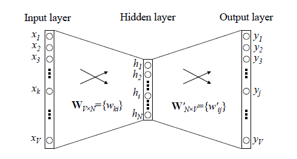
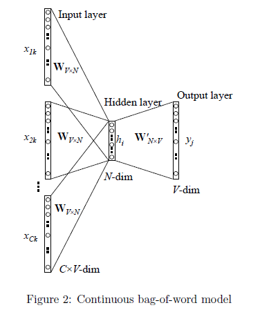
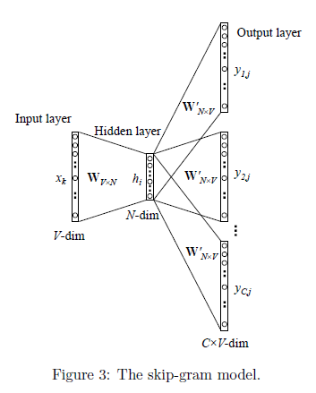
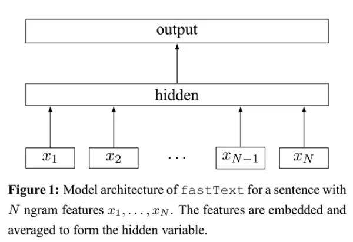
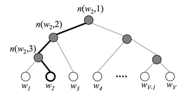

# **1.2.1 词嵌入介绍**

> **一句话总结：Embedding实际上就是一种映射关系，且是单射，可以看成是物理量语言文字、图像到数字的一种状态表征**
>
> * **物理意义：**&#x7528;数学的话来说：“**它是单射且同构的**”。简单来说，我们常见的地图就是对于现实地理的Embedding，现实的地理地形的信息其实远远超过二维，但是地图通过颜色和等高线等来最大化表现现实的地理信息。通过它，我们在现实世界里的文字、图片、语言、视频就能转化为计算机能识别、能使用的语言，且转化的过程中信息不丢失
>
> * **公式定义：**&#x45;mbedding 是一种**将高维数据（如文本或图像）转换为较低维度的向量表示**的技术。它以每个字在给定分布随机初始化的随机向量而组成的**可学习参数矩阵**，也就是一个全连接Dense层，其以**onehot为输入，稠密向量为输出，即词向量**，因此在实现上，用**lookup查找表**来代替矩阵乘积以提高性能。PyTorch中常用的实现&#x4E3A;**`nn.Embedding(vocab_size, embed_dim)`，**`embed_dim`为词向量的表征纬度大小，`vocab_size`为词表大小

# **1.2.2 词嵌入方法**

## **OneHot**

### **OneHot优缺点**

> 它的值只有0和1，不同的类型存储在垂直的空间
>
> * **优点：**&#x72EC;热编码解决了分类器不好处理属性数据的问题，在一定程度上也起到了扩充特征的作用。
>
> * **缺点：采用One-Hot编码方式来表示词向量非常简单，但缺点也是显而易见的**
>
>   * 一方面实际使用的**词汇表很大**，经常是百万级以上，随着词汇表的增大，OneHot编码会变得非常稀疏且高维，可能不适用于处理大规模的文本数据，这么**高维的数据处理起来会消耗大量的计算资源与时间。**&#x5728;这种情况下，一般可以用PCA来减少维度。而且one hot encoding + PCA这种组合在实际中也非常有用
>
>   * 另一方面，One-Hot编码中**所有词向量之间彼此正交，没有体现词与词之间的相似关系**

> ### **为什么需要OneHot？**
>
> 是因为大部分算法是基于向量空间中的度量来进行计算的，为了使非偏序关系的变量取值不具有偏序性，并且到圆点是等距的。使用one-hot编码，将离散特征的取值扩展到了欧式空间，离散特征的某个取值就对应欧式空间的某个点。将离散型特征使用one-hot编码，会让特征之间的距离计算更加合理。离散特征进行one-hot编码后，编码后的特征，其实每一维度的特征都可以看做是连续的特征。就可以跟对连续型特征的归一化方法一样，对每一维特征进行归一化。比如归一化到\[-1,1]或归一化到均值为0,方差为1

> ### **为什么特征向量要映射到欧式空间？**
>
> 将离散特征通过one-hot编码映射到欧式空间，是因为，在回归，分类，聚类等机器学习算法中，特征之间距离的计算或相似度的计算是非常重要的，而我们常用的距离或相似度的计算都是在欧式空间的相似度计算，计算余弦相似性，基于的就是欧式空间

### **OneHot编码例子及代码**

OneHot编码是一种将词语转换为数字向量的方式，其中每个词都会被表示为一个向量，在该向量中，只有一个位置是1，其他位置都是0。这个向量的长度等于词汇表中词语的总数，每个位置对应一个特定的词

例如，假设我们有一个词汇表：`["apple", "banana", "cherry"]`，我们要为其中的每个词生成OneHot编码：**"apple"** 的OneHot编码是 `[1, 0, 0]`，**"banana"** 的OneHot编码是 `[0, 1, 0]`，**"cherry"** 的OneHot编码是 `[0, 0, 1]`

```python
# 词汇表
vocab = ["apple", "banana", "cherry"]
# 构造一个词到索引的映射
word_to_index = {word: idx for idx, word in enumerate(vocab)}

# 定义OneHot编码函数
def one_hot_encoding(word, vocab, word_to_index):
    # 创建一个与词汇表长度相等的全0向量
    encoding = [0] * len(vocab)
    
    # 获取该词的索引
    idx = word_to_index.get(word, -1)
    
    if idx != -1:
        encoding[idx] = 1  # 将对应索引的位置置为1
    return encoding
# 测试
print("OneHot编码:")
for word in vocab:
    print(f"'{word}': {one_hot_encoding(word, vocab, word_to_index)}")
```

## **Word2Vec**

### **Word2Vec介绍**

> **论文：*Efficient Estimation of Word Representations in  Vector Space***
>
> **链接：**&#x68;ttps://arxiv.org/pdf/1301.3781
>
> **Distributed representation**可以解决One-Hot编码存在的问题，它的思路是通过训练，将原来One-Hot编码的每个词都映射到一个**较短的词向量**上来，而这个较短的词向量的维度可以由自己在训练时根据任务需要来指定
>
> **Word2Vec&#x20;**&#x7684;训练模型本质上是**只具有一个隐含层的神经元网络，最后取隐藏层的表示作为词向量。主要分为两种任务类型 CBOW 和 Skip-gram**



* **CBOW(Continus bag-of-word)：根据语境预测当前词**

```python
# 定义 CBOW 模型
import torch.nn as nn # 导入 neural network
class CBOW(nn.Module):
    def __init__(self, voc_size, embedding_size):
        super(CBOW, self).__init__()
        # 从词汇表大小到嵌入大小的线性层（权重矩阵）
        self.input_to_hidden = nn.Linear(voc_size, 
                                         embedding_size, bias=False)  
        # 从嵌入大小到词汇表大小的线性层（权重矩阵）
        self.hidden_to_output = nn.Linear(embedding_size, 
                                          voc_size, bias=False)  
    def forward(self, X): # X: [num_context_words, voc_size]
        # 生成嵌入：[num_context_words, embedding_size]
        embeddings = self.input_to_hidden(X)  
        # 计算隐藏层，求嵌入的均值：[embedding_size]
        hidden_layer = torch.mean(embeddings, dim=0)  
        # 生成输出层：[1, voc_size]
        output_layer = self.hidden_to_output(hidden_layer.unsqueeze(0)) 
        return output_layer    
embedding_size = 2 # 设定嵌入层的大小，这里选择 2 是为了方便展示
cbow_model = CBOW(voc_size,embedding_size)  # 实例化 CBOW 模型
print("CBOW 模型：", cbow_model)
```



* **Skip-gram：根据当前词预测语境**

```python
# 构建模型
class Skip_gram(nn.Module):
    def __init__(self):
        super(Skip_gram, self).__init__()
        # W：one-hot到词向量的hidden layer
        self.W = nn.Parameter(torch.randn(voc_size, embedding_size).type((dtype)))
        # V：输出层的参数
        self.V = nn.Parameter(torch.randn(embedding_size, voc_size).type((dtype)))
 
    def forward(self, X):
        # X : [batch_size, voc_size] one-hot
        # torch.mm only for 2 dim matrix, but torch.matmul can use to any dim
        hidden_layer = torch.matmul(X, self.W)  # hidden_layer : [batch_size, embedding_size]
        output_layer = torch.matmul(hidden_layer, self.V)  # output_layer : [batch_size, voc_size]
        return output_layer
model = Skip_gram().to(device)
criterion = nn.CrossEntropyLoss().to(device)  # 多分类，交叉熵损失函数
optimizer = optim.Adam(model.parameters(), lr=1e-3)  # Adam优化算法
```



### **Word2Vec加速方法**

一般神经网络语言模型在预测的时候，输出的是预测目标词的概率，通过softmax得到，也就是每一次预测都要基于全部的数据集进行计算，这无疑会带来很大的时间开销。Word2Vec提出两种加快训练速度的方式，一种是**Hierarchical softmax**，另一种是**Negative Sampling**

> * **霍夫曼树 Hierarchical softmax**
>
>   为了避免计算所有词的softmax概率，word2vec采用了霍夫曼树来代替从隐层到softmax层的映射，根据词频来建立哈夫曼树。**将多分类转为二分类问题**。哈夫曼树的所有内部节点就类似之前神经网络隐藏层的神经元，其中，根节点的词向量对应我们的投影后的词向量，而**所有叶子节点就类似于之前神经网络softmax输出层的神经元**，叶子节点的个数就是词汇表的大小。其**优点总结如下**：
>
>   * **计算效率高**：由于是二叉树，使得计算量从$$V
>     $$变为了$$log_2V
>     $$
>
>   * **符合贪心优化思想**：高频词更加接近树根，能更快速得被检索，符合贪心优化的思想
>
>   **霍夫曼树的缺陷：**&#x5982;果我们的训练样本里的中心词是一个**很生僻的词**，那么就得在霍夫曼树中辛苦的向下走很久了。负采样可以解决该问题
>
> * **负采样 Negative Sampling**
>
>   霍夫曼树使用霍夫曼树来代替传统的神经网络，可以提高模型训练的效率。但是如果我们的训练样本里的中心词是一个很生僻的词，那么就得在霍夫曼树中辛苦的向下走很久了
>
>   **负采样**：对于给定的词W的上下文Context(w)，词w是一个正样本，其他词是负样本。使用了sigmoid函数：
>
>   **负采样的本质**：每次让一个训练样本只更新部分权重，其他权重全部固定；减少计算量；（一定程度上还可以增加随机性）
>
>   **负采样实际例子**：
>
>   * 当我们用训练样本（input word:"fox", output word:"quick"）来训练我们的神经网时，“fox”和“quick”都是经过one-hot编码的。如果我们的vocabulary大小为10000时，在输出层，我们希望“quick”单词那个位置输出1，其余都是0。这些其余我们期望输出0的位置所对应的单词我们成为“negative” word
>
>   * **当使用负采样时，我们将随机选择一小部分的negative words（比如选5个negative words）来更新对应的权重。我们也会对我们的positive word进行权重更新**（上面的例子指的是"quick"）
>
>   * 假设隐层-输出层拥有300 x 10000的权重矩阵。如果使用了负采样的方法我们仅仅去更新我们的positive word-“quick”的和我们选择的其他5个negative words的结点对应的权重，共计6个输出神经元，相当于每次只更新300\* 6 = 1800个权重
>
>   **采样方式**：概率采样，可以根据词频进行随机抽样，我们倾向于选择词频比较大的负样本，比如“的”，这种词语其实是对我们的目标单词没有很大贡献的。Word2vec则在词频基础上取了0.75次幂，减小词频之间差异过大所带来的影响，使得词频比较小的负样本也有机会被采到

## **FastText**

> **论文：*Bag of Tricks for Efficient Text Classification***
>
> **链接：**&#x68;ttps://arxiv.org/pdf/1607.01759
>
> fastText是一个**快速文本分类算法**，本质和**CBOW**一样
>
> 和CBOW一样，fastText模型也只有三层：输入层、隐含层、输出层，输入都是多个经向量表示的单词，输出都是一个特定的target，隐含层都是对多个词向量的叠加平均；**不同的是，**&#x43;BOW的输入是目标单词的上下文，fastText的输入是多个单词及其**n-gram特征**，这些特征用来表示单个文档；CBOW的输入单词被onehot编码过，fastText的输入特征是被embedding过；CBOW的输出是目标词汇，fastText的输出是**文档对应的类标**




* **算法细节**

1. **损失函数：**&#x4EA4;叉熵损失

2. **Hierarchical Softmax：**&#x6839;据类别的频率构造霍夫曼树来代替标准softmax，通过分层softmax可以将复杂度从N降低到logN，下图给出分层softmax示例：

   

   具体来说，这棵哈夫曼树除了根结点以外的所有非叶节点中都含有一个由参数`θ`确定的sigmoid函数，不同节点中的`θ`不一样。训练时隐藏层的向量与这个sigmoid函数进行运算，根据结果进行分类，若分类为负类则沿左子树向下传递，编码为0；若分类为正类则沿右子树向下传递，编码为1。

3. **N-gram feature：**&#x5C06;文本内容按照子节顺序进行大小为N的窗口滑动操作，最终形成窗口为N的字节片段序列。而且需要额外注意一点是n-gram可以根据粒度不同有不同的含义，有字粒度的n-gram和词粒度的n-gram。fasttext**针对n-gram额外优化的点为：过滤掉出现次数少的单词、使用hash存储、由采用字粒度变化为采用词粒度**
