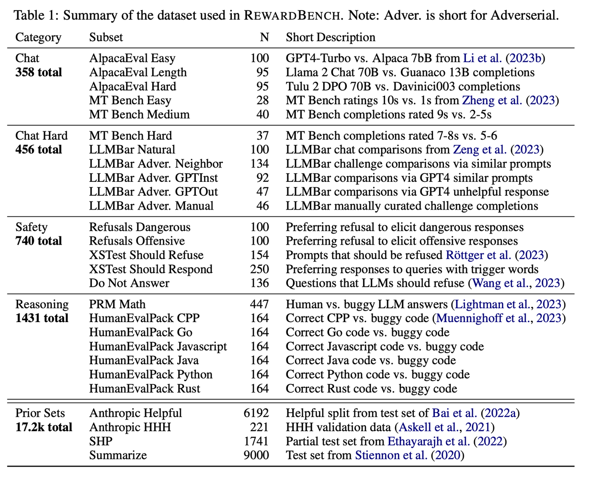
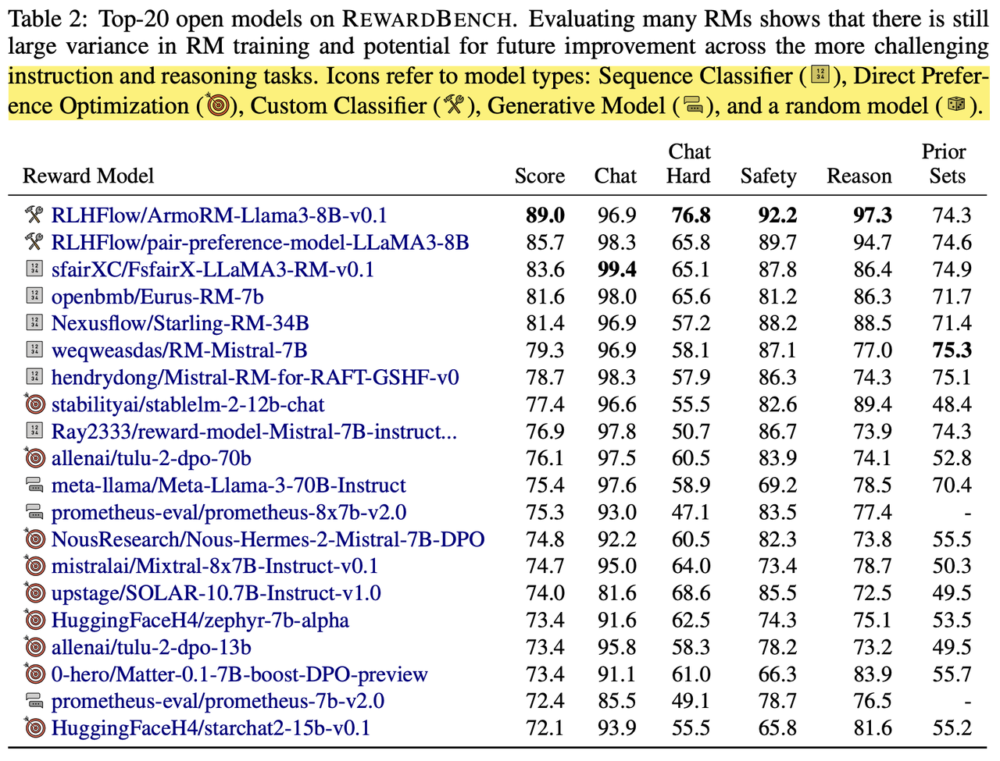
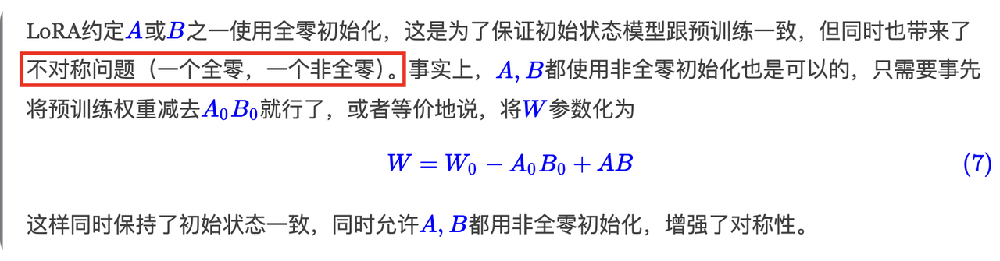
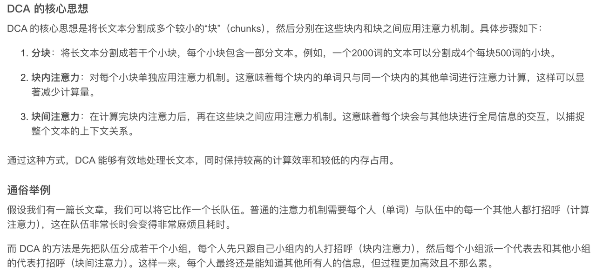

### **京东直播-搜推**

1. 自我介绍

2. 了解多少搜推知识

3. 介绍一下RLHF流程

4. 了解ANN算法吗，介绍Faiss的检索原理

5. 推荐项目里的图检索具体是如何实现的

6. 算法题：最大子数组和问题

```python
def max_subarray_sum(nums):
    # 初始化最大和为负无穷，当前和为0
    max_sum = float('-inf')
    current_sum = 0

    for num in nums:
        # 如果当前和为负数，则重置为当前元素
        current_sum = max(num, current_sum + num)
        # 更新最大和
        max_sum = max(max_sum, current_sum)

    return max_sum
示例数组
nums = [-2, 1, -3, 4, -1, 2, 1, -5, 4]
调用函数并打印结果
print(max_subarray_sum(nums))  # 输出应为6，对应子数组[4, -1, 2, 1]
```

1. 写一个sql：给一个用户id和薪水的表，返回第二高的薪水

```sql
SELECT DISTINCT Salary FROM Employees ORDER BY Salary DESC LIMIT 1 OFFSET 1;
```

### **美的AI创新中心 NLP实习生**

* 自我介绍

* 八股

1. 为什么要用深度迁移学习方法，对比finetune的好处

2. 了解最新的深度迁移学习方法么，为什么论文中不用最新的方法

3. 了解transformer模型吗，讲一下

4. 为什么要用轻量级的模型

5. 了解神经网络结构搜索吗，讲一讲NAS

* 算法题

两数之和

### **蔚来汽车-智能座舱-NLP实习**

1. 自我介绍

2. 问项目

3. 对比学习的loss是什么

4. transformer的decoder层长什么样

5. SK block是怎么操作的，具体的是怎么融合不同卷积的

6. 讲讲逆残差结构，为什么能减少参数量

7. cv项目的模型参数是多少

8. 安全生产项目中推荐部分详解

9. 俄语词典中的技术栈

### **探探-首页推荐算法实习**

* 自我介绍

* 业务问题

1. 你认为聊天软件中最重要的是什么指标。

2. 我们有一个爆款（很受欢迎的异性），如果我们要把他推给所有人，这样合适吗，为什么

3. 如果觉得不适合，那可能会导致哪些指标下降呢

4. 你如何提升你觉得最重要的指标，可以说策略

5. 你想使用什么样的模型来解决指标的提升。

6. 你认为我们模型的label是什么，目标函数应该是什么？（很难，大部分算法工程师都不知道答案）

### **理想大模型基座中心-安全对齐组**

1. 自我介绍

2. 训练奖励函数的难点在哪？自己尝试过写sft框架并优化吗？

3. 目前主流的sft方法有哪些？有什么特点？

4. 在sft中遇到了哪些问题？有哪些解决的方案

5. 法规大模型数据配比是如何考虑的

6. 全参微调和LORA的有哪些劣势？

7. RLHF怎么做的，用DPO或PPO为什么会训练不起来（不收敛），或者效果不好的原因有哪些？目前网上有挺多解决办法的，说说常用的有哪些？

8. 法规大模型中case太难，qwen14b解决不了，涉及到的数学逻辑能力不足和灾难性遗忘，有尝试过哪些办法解决？

9. 考虑过哪些数据配比的方法？

10. benchmark在构建时需要考虑哪些因素？

11. 多头注意力机制的复杂度

12. 手写多头注意力机制

### **腾讯视频搜推中心-大模型**

1. 介绍项目

2. 如何构造sft数据集，多轮对话数据集如何构造

3. 如何评估指标的

4. 偏好对数据如何构造？

5. 介绍RLHF，效果如何？训练时有哪些问题？

6. 为什么微调又说无需微调，在推理阶段缓解幻觉？

7. 讲讲上下文感知算法是如何实现的

8. 讲讲RLHF的流程包括哪几步

9. 如果输入文本太长，有哪些手段解决？外推法、内插法、RAG

10. lora原理细节，为什么可以加速？什么是秩？

11. 算法题：编辑距离

### **小红书通用大模型组-安全对齐算法**

1. 自我介绍

2. 如何解决幻觉问题的？为什么任务解码层对比方式可以缓解幻觉？

3. 了解安全方面的测评吗？有哪些评估方法和指标？

4. red teaming了解吗？

5. rlhf实验中哪些任务性能提升明显？为什么不同任务效果差别较大？（数学，推理、多轮对话任务提升明显）

6. reward model是如何实现的，效果如何？

7. 如果训练了不同评测类型的，比如分别训练了评测3H的3个reward model，如何在rlhf阶段使用它？

8. 测评维度划分参考了哪些工作？

9. RLHF的幻觉实验具体是怎么做的？

10. RLHF这块，除了做了幻觉实验外，还做过哪些其他的实验？比如安全性评估

11. 考虑过如果混合single和pair-wise形式的数据一起训练，效果差的原因是什么吗？

12. judge-as-LLM泛化能力差的原因是什么，GPT4也会出现类似的情况吗？（比如single形式比pair-wise形式正确率高）是否做过类似的消融实验

13. 你觉得你最可能在哪个领域发表文章？

### **快手可灵-大模型实习-一面**

1. 自我介绍

2. 介绍critique model的怎么做的，如何设置分数的，是pair-wise还是single-wise

3. 线上如何使用LLM-as-a-judge，如何评估在业务中的效果

4. 怎么做数据合成的，如何确保数据的质量和多样性

5. 数据量级多大，你觉得这个量级够了么

6. critique model只做了sft么，做sft时有哪些需要注意的点，你知道sft的loss和pretrain的区别么

7. 讲一下RLHF的流程

8. 训过PPO吗，你觉得实际训练中PPO和DPO哪个效果更好，你觉得是什么原因造成的

9. RM是你负责训练的么，有没有遇到了哪些问题，泛化性如何

10. 了解多模态吗，你觉得MLLM相比LLM的难点在哪

11. 看你做过RAG，有没有尝试过多模态+RAG

12. 算法题两道：手撕MHA、电话号的字母组合

### **百度文心一言多轮对话组-大模型实习**

自我介绍

主要问美团实习

介绍评估大模型是怎么做的

数据选取时如何考虑？

用了哪些自动筛选数据的pipeline

最后如何评估自研的judge-LLM生成数据的质量

算法题

给你一个字符串 s 和一个字符串列表 wordDict 作为字典。返回可以利用字典中出现的一个或多个单词拼接出 s 的最小次数，如何无法拼接，则返回-1。

【示例】

输入：s="applepen", wordDict = \["apple", "pen"]

输出：1

### **字节国际化商业产品与技术一面-算法实习生**

1. 自我介绍

2. 说说bert和LM的区别

3. bert和LM分别如何解决过拟合

4. 了解哪些seq2seq模型

5. 详细讲讲transformer的架构、如何训练

6. 为什么要用多头注意力机制

7. LLM数据清洗怎么做的

8. Lora和全参微调分别适用于哪些场景

9. 讲讲RLHF是怎么做的

10. 了解DDP和fsdp吗

11. deepseed是怎么做的，为什么zero3会比zero2慢

12. 微调阶段会加入哪些trick

13. Linux 查看文件行数

14. Linux 查找关键字

15. Linux 统计某些文件大小

16. 手写Layer Norm

### **字节国际化商业产品与技术二面-算法实习生**

1. 自我介绍

2. critique model怎么训练的，会不会存在bias

3. 介绍下transformer，attention的细节和mlp的作用

4. BN和LN的区别，BN在训练阶段和推理阶段有何不同

5. 在nlu任务上，你觉得bert和llm哪个效果会更好，为什么

6. 介绍下RLHF流程

7. deepspeed的原理

8. 了解dp和ddp，介绍一下原理和异同

9. 如果让你用llm做一个商品类目识别的项目，你会如何设计

10. 数组和链表有何不同

11. 插入和删除任务在两个数据结构上时间空间的复杂度是怎样的

12. 快排的思想，时间复杂度

13. 代码题: 反转链表

### 高德打车风控组-机器学习算法实习生

1. 自我介绍

2. 详细介绍美团实习中项目的背景、遇到了哪些困难、用了哪些算法

3. 如何评估judge-LLM的本身的效果

4. rouge-L和bertscore的原理

5. 删除了较长的response，有考虑会有什么影响吗，基于什么指标去筛选的长response

6. 聊聊对transformer的理解

7. 算法题：从数组中删除最小的k个数

### 腾讯综合搜索一面-大模型算法实习生

自我介绍

怎么构造数据的，最终数据形式及特点？

用Qwen出于什么考量，为什么不用其他开源模型，他和Baichuan的有哪些区别？

检索增强生成的数据是如何存储的

上下文感知算法具体是什么做的

知识图谱怎么融入推荐系统的

数据的来源有哪些，参考了哪些方法？

哪类数据质量对模型效果更好？

是通用大模型吗，是否已经上线使用？

除了PPO，还是过其他的强化算法吗？

算法题

1） 两数之和

2）三数之和

### Ladaza广告组-广告算法实习

1. 自我介绍

2. 上下文感知算法介绍一下

3. 你认为评估大模型最大的挑战在哪，遇到了哪些难题

4. 怎么检验judge大模型的效果

5. 是否用到垂域任务，效果如何

6. transformer的结构具体讲讲，说说你对self attention的理解

7. 你觉得为什么现在大模型会比传统的深度学习模型强大

8. 算法题

给定一堆整数，将这两部分，设计划分算法使得这两部分和最接近

### 高德打车二面-大模型算法实习生

1. 自我介绍

2. 评估大模型怎么做的，有哪些用途？

3. 是否用于垂域任务

4. 要你做一个智能陪练大模型，你该怎么做？

5. 如何评估质检的好坏，设计一个pipeline去验证

6. rag是怎么做的

7. 整个对话系统的pipline是什么样的，处于哪些考量设计这些功能

8. 有哪些防止过拟合的手段

9. 分类任务的评估指标有哪些，各代表什么含义

10. 有哪些常用的损失函数？

11. 了解多模态任务吗，对比学习的损失函数是什么，具体形式？

### 滴滴llab大模型一面面经

1. **reward bench**上的reward model分哪几类？reward model如何训练的，训练目标是什么？

   

   

   1. **Sequence Classifier**（序列分类器）：通过训练来预测人类偏好概率，从而对文本进行分类。

   2. **Direct Preference Optimization** (DPO，直接偏好优化)：通过重新参数化偏好奖励函数来解决 RLHF 问题，不需要学习单独的奖励模型。

   3. **Custom Classifier**（自定义分类器）：论文中未提及该类别的具体定义和特点。

   4. **Generative Model**（生成模型）：使用语言模型的生成来创建两个答案之间的判断，类似于 DPO 的奖励计算模式，但通常涉及特定的提示和更多的计算。

   5. **随机模型**（random model）：作为对比基准，用于评估其他模型的性能。

2. dpo训练的损失函数和训练目标，dpo如何改进

3. 指令跟随能力的评估集有什么，如何评估的？

   **SuperGLUE**：这是一个包含多个子任务的评估基准，用于评估自然语言处理模型的各种能力，其中包括模型对指令的理解和执行能力。SuperGLUE 中的一些任务，如`RTE（Recognizing Textual Entailment）`和`WiC（Word-in-Context）`，可以间接评估模型的指令跟随能力。

   **BIG-bench（Beyond the Imitation Game Benchmark）**：这是一个针对大语言模型的广泛评估基准，涵盖了许多任务，包括数学推理、编程、逻辑推理、道德推理等。其中的一些任务直接评估模型的指令理解和执行能力。

   **LAMBADA**：测试模型在给定的上下文中生成正确的下一个词或句子的能力。这可以间接评估模型在更复杂指令下的表现。

   **HumanEval**：专门设计用于编程语言模型的评估集，它包含一组编程任务，要求模型生成正确的代码以解决问题。尽管主要用于评估代码生成，但它也能评估模型在理解编程指令方面的能力。

   **TruthfulQA**：这是一个专门设计用于评估语言模型是否能够在回答问题时保持真实的评估集。它测试了模型在处理模糊或潜在误导性指令时的能力。

4. **gsm8k和math评估集有什么区别**？

   GSM8K和MATH是两个常用于评估大语言模型数学能力的基准测试集，它们在设计目标、内容范围和难度上有所不同。以下是它们的主要区别：

   1\. **设计目标和用途**

   * **GSM8K（Grade School Math 8K）**:

     * **目标**：GSM8K的设计目标是评估模型在解决小学到中学水平的数学问题方面的能力，特别是通过自然语言描述的问题。

     * **用途**：该评估集特别关注模型在理解自然语言描述的数学问题并生成正确答案的能力。这使得它适用于评估模型在日常应用场景中处理基础数学问题的能力。

   * **MATH**:

     * **目标**：MATH评估集旨在测试模型在高中至大学预科水平的数学问题上的能力。它包含了更为复杂和高级的数学问题。

     * **用途**：该评估集用于评估模型在处理更高难度的数学推理和证明方面的表现，适用于评估模型在学术或专业领域中解决数学问题的能力。

   2\. **内容范围**

   * **GSM8K**:

     * **问题类型**：包含的问题主要涉及基础的算术、代数、数列、几何、基本概率和统计等领域。这些问题通常是基于真实世界的应用场景，如购物计算、简单的几何问题或基本代数问题。

     * **问题格式**：问题通常以自然语言的形式呈现，模型需要理解问题的描述并输出最终答案。

   * **MATH**:

     * **问题类型**：MATH涵盖了广泛的数学领域，包括但不限于代数、几何、三角学、微积分、组合数学、数论、线性代数和数学证明等。

     * **问题格式**：问题通常以正式的数学语言和符号呈现，可能需要模型进行多步骤的推理和证明。问题的复杂性更高，可能涉及更深入的数学知识和推理能力。

   3\. **难度**

   * **GSM8K**:

     * **难度**：问题的难度较低，适合评估模型在基础数学问题上的表现。即使是基础数学问题，模型仍需展示出较强的自然语言理解和简单数学推理能力。

     * **挑战**：主要挑战在于正确理解问题描述并执行基本的数学运算。

   * **MATH**:

     * **难度**：问题难度显著更高，涵盖从高中到大学预科水平的复杂数学问题。解决这些问题需要更高级的数学知识和多步骤推理。

     * **挑战**：模型需要展示出更强的推理能力、问题分解能力和对复杂数学概念的掌握。

   4\. **评估重点**

   * **GSM8K**:

     * **重点**：评估模型在理解和解决实际应用中的基本数学问题的能力，强调自然语言理解与简单数学推理的结合。

   * **MATH**:

     * **重点**：评估模型在处理复杂数学问题时的推理深度和准确性，测试其在更高难度数学任务中的表现。

   总结

   GSM8K适合评估模型在基础数学推理和自然语言理解方面的能力，而MATH更关注模型在高级数学推理和复杂数学问题解决方面的能力。两者在内容和难度上的差异使得它们在评估大语言模型数学能力时能够提供不同层次的衡量标准。

5. **mbpp和hella swag评估集有什么区别？**

   1\. **设计目标和用途**

   * **MBPP (Mostly Basic Python Problems)**:

     * **目标**：MBPP 旨在评估模型在解决编程任务，特别是Python编程任务方面的能力。它测试了模型的代码生成和编程推理能力。

     * **用途**：主要用于评估模型在处理基本编程问题时的表现，特别是如何生成功能性Python代码来解决具体的编程问题。这对开发代码生成工具或自动编程助手非常重要。

   * **HellaSwag**:

     * **目标**：HellaSwag 旨在评估模型的常识推理能力，特别是在复杂的、多步骤推理场景中的表现。

     * **用途**：主要用于评估模型在推理任务中的表现，包括通过给定的上下文选择最合理的结论。它强调模型的常识理解和推理连贯性，对评估自然语言理解模型非常有用。

   2\. **任务类型**

   * **MBPP**:

     * **任务类型**：MBPP 包含一系列编程任务，这些任务描述了特定的编程问题，模型需要生成Python代码来解决这些问题。

     * **输入输出**：输入通常是一个自然语言描述的编程任务，输出是相应的Python代码。评估模型生成的代码是否能够正确解决问题是主要的评估标准。

   * **HellaSwag**:

     * **任务类型**：HellaSwag 任务类型是多项选择题，模型需要从给定的选项中选择最符合上下文的那一个。这些选项通常是描述某个场景接下来最有可能发生的事情。

     * **输入输出**：输入是一段描述性文字（或情景），以及若干选项；输出是模型选择的选项。模型需要理解情境并推理出最合适的下一步动作或结果。

6. **阿尔法狗强化学习策略是什么？**

7. 提升推理能力和指令跟随能力哪个更难，为什么，提升指令跟随能力的优化方式和其他的比如推理有什么不一样的地方

   提升大模型的推理能力和指令跟随能力各有其挑战性，但一般来说，\*\*提升推理能力\*\*可能更难一些。下面解释原因，并讨论提升指令跟随能力和推理能力的优化方式的不同之处。

   1\. **推理能力提升的难度**

   推理能力涉及模型在复杂情境下进行**逻辑分析、推断和问题解决**的能力。提升这一能力的难度源于以下几个方面：

   * **复杂性和多样性**：推理能力涉及多种类型的逻辑推理，如归纳推理、演绎推理、类比推理等。这些推理任务本质上复杂且多样，要求模型不仅能理解每种推理方式，还能在不同上下文中灵活应用。

   * **跨领域知识**：推理通常需要模型具备广泛的背景知识和跨领域的理解。例如，解决数学推理问题需要数学知识，解决常识推理问题需要对日常生活的深刻理解。跨领域的推理需要模型拥有高度抽象的理解能力。

   * **多步骤推理**：复杂推理任务往往需要分解为多个步骤，每一步都可能涉及前后逻辑的准确把握。这类多步骤推理任务对模型的注意力和记忆机制提出了更高的要求。

   * **数据稀缺性**：与自然语言理解或生成任务相比，高质量、标注精确的推理数据集更为稀缺，模型可能无法通过大量数据直接学习推理技能。

   2\. **指令跟随能力的难度**

   指令跟随能力要求模型能够准确理解并执行用户的自然语言指令。这通常包括对指令的解析、执行任务，以及产生期望的输出。指令跟随的挑战包括：

   * **指令理解**：模型必须准确解析自然语言中的指令，这要求对上下文和细微语言变化的敏感性。

   * **任务执行**：模型不仅要理解指令，还要能够正确地执行指令并提供合适的反馈或结果。

   * **泛化能力**：模型需要在未见过的指令或新任务下依然表现良好，这要求强大的泛化能力。

   3\. **提升指令跟随能力的优化方式与推理的区别**

   * **训练数据的差异**：

     * **指令跟随能力**：提升指令跟随能力通常依赖于大量的高质量指令-响应对的训练数据。这些数据可能来源于人工标注或通过人类反馈强化学习（RLHF）方式优化。指令跟随任务通常有明确的输入输出映射关系，这使得监督学习和人类反馈在这里非常有效。

     * **推理能力**：推理能力的提升更多依赖于复杂的数据集和多种任务的联合训练。这些数据集可能需要包含多步骤推理的示例，且推理任务本身往往没有固定的输入输出映射，难以通过简单的监督学习完成。

   * **模型架构与优化目标的差异**：

     * **指令跟随能力**：模型的架构通常会设计为能够快速适应和解析用户指令的输入，并通过精调或少量示例引导模型输出正确的结果。指令跟随任务的优化目标通常是最小化指令与响应之间的差距。

     * **推理能力**：推理能力的提升可能需要改进模型的架构以增强其长程依赖和多步骤推理能力，如增加注意力机制的复杂度、引入新的推理模块等。推理任务的优化目标更复杂，可能涉及提高模型的逻辑连贯性、减少推理错误率等。

   * **评估方式的差异**：

     * **指令跟随能力**：评估通常基于任务完成度或人类评分，比较容易通过特定任务集进行量化评估。

     * **推理能力**：评估难度较大，通常需要更复杂的评估基准，如逻辑推理测试、常识推理评估等，且推理错误有时难以精确界定。

   总结

   总体而言，\*\*推理能力的提升可能更具挑战性\*\*，因为它涉及更复杂的逻辑处理和跨领域知识的整合，而指令跟随能力虽然在理解和执行层面上存在挑战，但其优化可以更多地依赖于大量标注数据和特定的任务设计。

   提升指令跟随能力通常关注于指令理解和任务执行的准确性，优化方式可能更依赖于人类反馈和监督学习；而提升推理能力则需要更复杂的数据、模型架构的改进以及更复杂的训练和评估方法。

8. **dpo训完了一般输出长度会变化吗？如何解决这个问题？**

9. 注意力机制为什么除以根号dk，为什么不是dk

10. transformer里边norm的位置在哪里，norm如何计算的

11. **大模型训练过程学习率一般如何变化的，退火阶段学习率如何变化的**

12. 代码: 写了个注意力层

13. 手撕，一个数组，输出这个数组每个位置之外的其他元素的乘机，不能用除法，要求尽量减少时间复杂度，然后要求仅用一个数组存储

    链接：<https://www.nowcoder.com/feed/main/detail/de165d62324c4e3493e45b421e0e2a79?sourceSSR=users>

### FLOW-大模型算法工程师二面

1. 自我介绍

2. 在夸克的工作，怎么解决数值推理问题的？

3. 有哪些有挑战的地方？训练、评测、数据方面

4. 讲一下文心的工作，RM 的moe结构为什么这么设计，参数量？

5. RM模型怎么训练，数据->模型结构->loss，训练时容易出现哪些问题，有哪些调优策略

6. 讲讲DPO怎么训练，和ppo的区别。

7. 你认为LLM哪块工作最重要，为什么？

8. 算法题

   1. MHA

   2. 每日温度

### 网易互娱 AI Lab 一面

1. 自我介绍

2. 夸克数值计算怎么做的？怎么评估，线上怎么使用？

3. 一个7B模型，怎么初始化为moe8\*7b？

4. 项目推理的qps？多少时延？

5. refer、response答案一般多长？refer一般有多少个？

6. DPO怎么计算的？有value function吗？

7. 训练数据怎么做packing？有长的有短的怎么办？

8. 讲一下蒙特卡洛树搜索，怎么应用到业务中的？对比直接用GPT4哪个效果更好？

9. 如果大模型的显存不够应该怎么办？

10. 介绍下flash attention，为什么可以节省显存和加快速度？

11. 如何理解Lora算法，怎么初始化的，有什么缺陷？

* 一个高斯分布（A），一个0初始化（B）

* 缺点：



* 0初始化为什么不好？

* lora为什么可以加速？

* 有哪些注意力机制？

* MLA怎么做的，为什么快？为什么同样是低秩分解，推理是lora慢MLA快？

* 介绍下评估指标，数据集

* 数值推理的步骤如何评估？

* 如何让模型知道代码生成的对不对（代码评估）

* VLLM原理，为什么会快？

* deepspeed原理？

### 快手 大模型应用算法工程师 一面

1. 自我介绍

2. 介绍文心项目

3. 介绍一下Reward model在训练中扮演了什么角色？

4. 100页的pdf文件格式化后有多大？

5. Qwen的模型结构了解多少？qwen和qwen2的区别有哪些？

**Qwen1.5**: rope、gqa、rmsnorm，**NTK-aware插值**、**LogN - Scaling和分层窗口分配**

logN的好处：实现了熵不变性，让模型拥有更好的长度外推性。

为什么要实现熵不变？熵是不确定性的度量，换个角度想，我们可以将不确定性视为注意力的“聚焦程度”：如果熵为0，那么注意力将聚焦到某一个token上，如果熵为log⁡𝑛，那么注意力均匀分布到所有token上。我们希望熵不变，是希望引入新的token后，已有的token依旧能同样地聚焦到原来的token上，而不希望新token的引入过多地“分摊”了原有的注意力，导致求和结果显著发生变化。

**Qwen2**: Dual Chunk Attention、YaRN



* 安全生产的项目怎么评估的？

1）传统指标：acc、rouge-L、berscore

2）模型打判

3）规则匹配

* 造好的数据，怎么做数据配比，如何评估数据质量？

* DPO是怎么训练的？

* 算法题：最长回文子串

### FLOW-大模型算法工程师

1. 自己介绍

2. 问实习经历

3. 弱相关性干扰数据如何构造

4. 拒答的数据如何构造

5. 测评的手段，指标

6. 大模型微调的方法

7. 介绍下LORA的出发点，优势

8. LORA在反向传播过程中可以减少多少参数

9. 在Transformer模型的self-attention层，通常包括几个权重矩阵

10. LORA的计算量和显存相比全量微调有什么变化

11. LORA在反向传播时哪些计算时省不掉的

12. 节省显存的方法有哪些

&#x20;1\. **混合精度训练 2. 梯度累积：在更新权重之前，将多个小批次的梯度进行累积，这样可以使用更大的有效批次大小，而不需要一次性加载整个大批次到显存中 3. 模型量化 4. 模型并行和数据并行 5. 梯度检查点**：在反向传播时，重新计算而不是存储中间激活，这可以减少存储需求，但会增加计算时间

文本很长，显卡数量不多，导致训练的batch\_size太小，如何解决这个问题

* 梯度累积

* 自适应学习率：使用具有自适应学习率的优化器（如Adam、RMSprop），这些优化器能够自动调整每个参数的学习速率，有助于缓解因小批量引起的训练不稳定。

* 张量并行

* 增加正则化

- 如何解决梯度更新噪声大（mini batch）的问题

- 算法题

* 岛屿数量

```python
class Solution:
    def numIslands(self, grid: List[List[str]]) -> int:
        result = 0
        for row in range(len(grid)):
            for column in range(len(grid[0])):
                if grid[row][column] == "1":
                    self.dfs(grid, row, column)
                    result += 1
        return result
    def dfs(self, grid: List[List[str]], row: int, column):
        # 处理越界问题
        if row < 0 or column < 0 or row > len(grid) - 1 or column > len(grid[0]) -1:
            return
        # 如果是“0”、“2”，则直接返回
        if grid[row][column] != "1":
            return
        # 如果是“1”，就改为“2”，表示已经扫描过的陆地
        grid[row][column] = "2"
        self.dfs(grid, row - 1, column)
        self.dfs(grid, row, column - 1)
        self.dfs(grid, row + 1, column)
        self.dfs(grid, row, column + 1)
```

### 腾讯音乐 酷狗搜索 一面

1. 聊项目

2. 如何计算LLM参数量

3. 介绍一个传统ML模型

4. deepspeed原理，如何实现zero1，2，3

5. LLM中温度的意义

### 腾讯音乐 酷狗搜索 二面

1. 聊项目

2. transformer相比LSLTM的优势

3. nlp的发展历程，学过传统nlp么

4. word2vec和rnn了解吗，讲讲工作原理

5. Lora相比全参微调减少了多少参数量，增加多少计算量


### 百度 深度学习技术平台 一面

1. 自我介绍

2. 文心的工作

3. MOE结构的 RM，模型的输入输出是什么，数据长什么样，loss是什么？

4. RM模型的输出是什么？RM数据有哪些种类？

5. RM的loss一般是什么？

6. point-wise和pair-wise的输入数据，在训练和推理它们分别是怎么计算loss？

7. DPO和PPO的区别？

8. DPO有哪些问题？优化方向有哪些？

9. DPO的输出是什么，源码是怎么做loss计算的？

10. 无code

### 百度 深度学习技术平台 二面

1. 自我介绍

2. 为什么数值计算要用DPO

3. SFT和DPO分别在什么场景效果更好

4. 什么场景SFT比DPO效果好

5. DPO怎么优化

6. 写一个self attention

7. 写一个多头注意力

8. 把每个中间结果的shape写出来

### 百度 深度学习技术平台 三面

1. 项目收获

2. 实习经历，拷打其中一个

3. DPO和RLHF的异同

4. 聊天

### 度小满 智能对话 一面面经

1. 自我介绍

2. 夸克数值计算怎么做的

3. 怎么优化模型的弱相关性抗干扰能力

4. 讲讲MOE怎么做负载均衡的

5. DeepSeek Moe怎么做的

6. PPO和DPO的区别是什么

7. 挑一个项目、实习或论文讲讲有哪些难点，怎么解决这些难点的

8. 用torch手写一个BCE loss，softmax单独写

9. 合并数组 leetcode

### 网易互娱-大模型算法工程师 Ai Lab - 二面

1. 问文心项目

2. KL散度和交叉熵的区别？

3. KL散度是对称的吗？

4. 如果P是双峰分布（两正态分布拼接），Q是正态分布，用KL（P，Q）和KL（Q，P）有什么区别？

假设 (P) 是双峰分布， (Q) 是正态分布：

**KL(P || Q)**:

**KL(Q|| P)**:

总结规律：

* 一般而言， KL(P || Q) 通常大于  KL(Q || P)。在双峰分布和单峰正态分布的情况下，这个规律特别明显，因为单峰分布无法很好的捕捉双峰分布的复杂性。

* KL(P || Q) 更强调用简单模型拟合复杂模型时的信息损失，而 KL(Q || P)则是用复杂模型在简单模型的描述下剩余的信息损失。

- 什么是投机采样？

- 讲讲有哪些Attention变体

- 偏好模型和对比模型（Pairwise）有什么区别？

* Pairwise 排序模型：优化成对文档的相对顺序，主要关注文档之间的关系。

* 偏好模型：优化用户偏好预测，主要关注用户个体对不同项的评分或偏好。

**损失函数**

* Pairwise 排序模型：pairwise logistic loss&#x20;

$$\text{Pairwise Logistic Loss} = \log(1 + \exp(-(\hat{y}_i - \hat{y}_j)))$$

* 偏好模型：常用,BPR loss ，旨在进一步反映用户个性化偏好

$$\text{BPR Loss} = - \sum_{(u, i, j) \in D} \ln(\sigma(\hat{y}_{ui} - \hat{y}_{uj}))$$

* 讲下MLA

* PPO原理

* PPO和DPO区别

### 网易互娱ailab 三面

1. 问项目细节

2. 你觉得游戏中的智能npc会带来什么样的收益，要你设计类似逆水寒中的智能npc，你该怎么做，说说从数据收集、预处理到模型训练，系统开发该怎么做

3. 训练一个智能npc你觉得需要多少数据量，模型尺寸，训练的策略该怎么选

4. 如何解决对话系统中时延问题

5. triton学过吗，传统方法部署模型的流程是怎么样的

### 字节抖音搜索-大模型算法工程师-一面

1. 问项目

2. 为什么moe结构的RM，能力点没有标签

3. 无重复字符的最长子串

### 哔哩哔哩-搜索大模型-一面

1. 两道code，最长公共前缀改条件，第二道忘了

2. 机器学习基础

   1. 如何理解attention的物理含义

   2. 传统attention（非self- attention）元素是如何计算

   3. transformer可以没有MLP嘛

   4. 了解哪些优化器，讲讲Adam原理

   5. 如何判断过拟合和欠拟合

   6. 为什么会出现梯度消失，有哪些解决梯度消失的方法

   7. svm的工作原理

   8. 了解哪些集成学习算法，gdbt的英文全称（不知道问这个干啥。。），xgboost相比gdbt改进了哪些点

3. 问夸克实习项目

### 哔哩哔哩-搜索大模型-二面

1. 问项目

2. Transformer结构

3. L1和L2区别

4. 了解那些优化器

5. 介绍Adam

6. 删除排序链表中的重复元素 II

### 哔哩哔哩-搜索大模型-三面

1. 聊项目

2. 有哪些优化softmax的方法

3. 用log\_sum\_exp方法是否可以确保概率分布和为1，有优化的思路嘛

4. 讲讲rnn结构，有哪些缺点

5. LLM的模型参数怎么计算

6. 用过triton吗，在蔚来怎么部署模型的

### 快手-广告大模型-一面

1. 二叉树的最近公共祖先

2. 聊文心项目，RM怎么设计的

3. RM和传统的MOE结构有什么区别

4. 大模型在搜推上的应用，了解对话型推荐吗

### 快手-广告大模型-二面

1. 聊项目

2. 如何理解scaling law，它可以如何应用在广告中

3. 讲讲实习工作中rag的精排和重排怎么做的

4. 对RLHF的理解

5. transformer的理解，与bert有何异同

### 滴滴-大模型算法工程师 L lab-一二三面

1. 介绍项目

2. 手撕DPO

3. 手撕MHA，加上KV cache，rope加在哪

4. 美团销售大模型的数据怎么清洗，怎么配比的，数据量多大

5. 怎么合成高质量数据的，如何评估数据质量

6. 蒙特卡洛树搜索怎么做的，和openai o1的区别在哪

7. RL scaling law是什么

8. 对于数学reward model，如果输出是“对”“错”二分类，应该怎么设计loss

9. 最长无重复元素

### minimax一面

* 监督微调有用么，怎么做效果好

* 有必要做rlhf么

* 手撕线性回归，提前看了大佬的面经，准备用了俩方法做

### minimax二面

* 挑个项目讲

* 你认为llm哪块最重要，让你当ld你会怎么投人力

* 怎么清洗数据，有什么经验

* 摘要任务怎么做评估

* 手撕概率题，从棋盘一角走到另一角所用步数的期望

### 上海ailab一面

1. 项目中MCTS用在什么阶段

2. MCTS在传统RL中和LLM中会有什么不同

3. 训练过PRM吗（答没有）

4. 用MCTS构造数据的工作是使用的现有框架还自己写的

5. 要你做O1你会怎么做（假设不是多个模型），MCTS是必须的吗，什么条件下用MCTS会比较好

6. 推理数据合成还有哪些思路

7. 一道AGI题

### 上海ailab二面

1. 问项目中预训练细节

2. PRM结合bon会和MCTS有哪些不同

3. 如何理解DPO（从BT->RM->RLHF->DPO讲会比较好）

4. RLHF和DPO在训练和模型效果上会有什么不同

5. 为什么实习从预训练换到了post training，为什么不一直干预训练（二面是搞预训练的哈哈）

### 上海ailab三面

1. 哪段实习经历收获最大，讲讲为什么

2. 训练过PRM吗（又问了一遍。。答没有）

3. 推理能力怎么获得，你觉得预训练和post training阶段哪个更重要（还可以说说inference time，吹一下rl scaling law）

4. MCTS会比直接使用拒绝采样好吗，具体好在哪

5. RLHF训练可能会遇到哪些问题，用什么框架训练的，改了哪些地方

6. SFT和RLHF后的模型输出内容会有什么区别，产生的原因

7. 职业规划，是否工作后考虑联培博士

### 饿了么aigc一面

1. 智能销售大模型预训练细节

2. 预训练的初始loss怎么算

3. 怎么估算训练速度

4. 教科书式的合成数据怎么做的

5. 如何分别在预训练和agent系统回复时不输出商家和用户身份信息

6. 讲一下dpo，有哪些变体，在实验中用过么，效果怎么样

7. 论文创新点在哪，怎么权衡论文和实习

8. 平常怎么看论文的

### 饿了么aigc二面

1. 问实习项目

2. Reward model怎么训练的，数据量多大

3. 如何构造DPO数据，有一套现成的数据飞轮么

4. 聊天，主要是介绍业务还有问个人情况

### 商汤科技-预训练算法-一面

1. 介绍文心项目

2. Reward model的loss是什么，为什么这么设计

3. 你觉得reasoning能力应该在哪个部分获得

4. 你觉得预训练和后训练那个更加重要，为什么

5. 如果让你训练一个base model，你会怎么做

6. 怎么评估长文本任务，有哪些指标？

### 商汤科技-预训练算法-二面

1. 介绍美团继续预训练项目

2. 学习率、epoch、Megatron是怎么设置的，loss长什么样

3. 怎么做数据清洗的，用了哪些指标

4. 启发式规则清洗数据在多少资源上跑的，用了多长时间

5. 质量判别模型怎么训练，用了多少数据

6. 了解scaling law吗，讲一下llama3的scaling law，继续预训练有scaling 么

7. 预训练一般分为哪些阶段，每个阶段的特点有哪些不同

### 文心大模型算法春招一面面经&#x20;

1. 自我介绍

2. puzzle数据是如何构造的，如何验证合成数据质量

3. 合成数据都有哪些方法，你觉得都有哪些利弊

4. 你们造的数据都是用在RL上吗，放到预训练中的量级有多大

5. 难度和多样性，对于RL来说到底哪个更加重要

6. 预训练的enhance是咋做的，讲一下

7. 如何确保prompt的多样性，以及如何控制puzzle问题的难度

8. reasoning任务接下来应该往哪个方向优化，分别从多模态和文本讲讲

9. 交付训练多大的模型，数据量有多大，什么规模的集群上训练了多久

10. Code:

    1. 二维数组的全排列（笛卡尔内积）

    2. 有一个file，包含n个query和freqs，随机采样query并保证分布与原来大体一致。

### AIDU大模型算法春招二面

1. 自我介绍

2. RL用的什么框架，用的时候有什么问题

3. 使用沙盒构造的数据如何评估质量的，你们的scaling law是如何设计的

4. 你们的\*\*数据是否混合了math和code数据，怎么混的

5. 自研的RL框架哪些部分是你写的，相比VERL做了哪些优化

6. 讲一下你觉得DAPO那几个点最关键有用，是否做了消融实验

7. Clip-Higher在实验中的在那个指标上有明显变化

8. 复现DAPO的时候实现了动态采样吗，效果如何

9. 动态采样到后期，采样的数量是越来越多还是越来越少

10. 是否从零训练过大模型，一般你们的PreTrain和RL都是在多少资源下训练的

11. 你们合成过多模态数据吗

12. code三道

    1. 手撕MHA

    2. 手撕Linear

    3. 手撕sparse attention

### 京东大模型春招一面

1. 自我介绍

2. 介绍下DPO、step DPO细节

3) DPO和PPO的区别

4) DAPO看了吗，讲一下

5. DeepSeek-R1-zero不能直接拿来用吗，还需要搞一个R1出来

6. 为什么RL会这么火，SFT真的不需要做了吗

7) 细粒度的数据合成是怎么做的

8) reasoning任务如何评估的

9. 如何构造多轮对话的数据

10. 大规模数据合成框架是自己写的吗

11) 你认为推理类模型的下一个发展的重点在哪

12) 你比较看好的大模型方向有哪些，讲下原因

13. 无code

14. 反问: 小组工作内容，工作强度，怎么培养新人

### 京东大模型春招二面

1. 自我介绍

2. 介绍夸克实习工作

3. 如何稳定训练moe模型，有哪些trick可以设计

4. 当时为什么业务上没用online RL去做，有哪些难点，除了DPO，还做了哪些其他尝试

5. 如何解决DPO两个loss同时下降的问题的，最终的回答质量如何

6. ORM和PRM的区别，你觉得哪个的效果会更好

7. RPM的数据如何构造，研究过RPM的scaling law吗

8. 业务上的训练数据是怎么制作的，完成了哪些专项

9. RAG了解的怎么样，讲一下目前学术界和工业界的做法

10. 对prompt工程了解吗，一般都是怎么设计的，有哪些promising的方法

11. 秋招拿到了哪些offer

12. 无code

13. 反问: 在贵司的业务上prm真的比orm有效吗；工作内容和培养方式；工作强度；面试结果什么时候给反馈

### 小鹏汽车一面

1. 自我介绍

2. 挑个实习详细讲讲

3) RL算法在什么框架下训练的

4) 输入的数据格式长什么样

5. reward是如何设计的，为什么不用judger做

6. RL算法做了哪些优化，相比GRPO和DAPO有何优劣

7) 数据合成是在多少资源下进行的，框架是自己写的吗，相比fastchat的优势

8) function call了解吗，讲讲怎么用的

9. 反问: 工作内容，小组氛围，工作强度

### 小鹏汽车二面

1. 自我介绍

2. 车载场景的拒识是怎么做的

3) agent微调做过吗，你当时是怎么做的

4) 用过哪些RL算法，这些算法在实际使用中在指标和效果上有什么不同

5. code: 两数之和的变体，要求时间复杂度logn

6. 闲聊20min

### **淘天-大模型应用暑期实习一面**

考察整体素质、领域知识比较多

1. 自我介绍一下

2. 迁移学习原理，以及NLP中有哪些迁移学习的经典模型/任务？

3. 从最初的 word2vec → 现在的Deepseek-r1 的发展历程

4. R1的训练过程？

5. GRPO 的过程？和PPO相比，哪些改进和优势？

6. sft  /  rl 的区别？

7. 讲一下作为算法工程师，在目前LLM技术发展迅速时怎么做？

### **淘天-大模型应用暑期实习二面**

1. 自我介绍

2. 介绍一下你的项目，遇到的难点，解决的问题

3. 在workflow上添加某个agent后，模型答复耗时增加多少？是否有测量？

4. DPO时怎么构造数据集的？效果如何？有什么积累与启示？

5. 拟人性可以从哪几个角度去理解和建设？

6. **发散题：**

   1. 你觉得目前业界，主流的大模型技术研究方向有哪些？你觉得哪些有价值？为什么？

   2. 对应方向最近的论文

   3. 工作后想从事哪个方面？

### **淘天集团-搜推智能产品事业部-AI助手算法**

**一面**

1. 自我介绍一下

2. 构造 functon call数据过程？对数据的额外处理？

3. 工具调用数据时候，怎么写prompt的？怎么构造整个自动化流程的？微调的数据量，模型，卡数，训练细节

4. benchmark设计？

5. long-cot 和 short cot 区别是

6. dpo 训练原理，和 之前的RLHF区别？

7. 了解GRPO吗？和PPO区别？

8\. **DeepSpeed、Megatron 的区别？**

9\. 代码题：**最长公共子序列**

**二面**

* 自我介绍

* 用的是什么模型？在推理模型的基础上，怎么构建agent的工具调用能力？think 和 answer的部分怎么使用的？训练的数据量？分别有哪几类？

* 具体介绍一下项目的sop

* 介绍GRPO原理，与业务探索，遇到的难点与解决

* 强化训练前后，模型除了指标的变化，观感上有没有提升？举几个case？

* 怎么理解助手的拟人性？

### 蚂蚁-大模型暑期实习一面

偏项目细节+场景+新论文，最长的面了1个半小时

1. 自我介绍下

2. 介绍项目，难点与解决方法

3) 数据构造，质量&多样性方面的处理方法和流程，与其他方法有对比吗

4) 对话过程中幻觉消解

5. 在对agent workflow 修改后，有测量链路回复/首字延迟的影响吗？说出1个具体数值？

6. R1 蒸馏小模型的流程？

7) r1 在易于获取信号的 代码、数学去训练，在没有验证器的情况下怎么去获取强化学习的信号？

8) dpo的原理和训练过程

9. 使用的什么训练框架？

10. **开放问题：**

    1. 讲一下对MCP的理解，以及一些实际的产品？

    2. 讲一下怎么做端到端 agent能力建设与优化？⇒RL4Agent

11) 手撕：爬楼梯

### 蚂蚁-大模型暑期实习二面

1. 先做个自我介绍

2. 项目细节，遇到困难和解决

3) function-call数据构造与训练流程？

4) 如果遇到1个query中包含多个意图，怎么处理？结合sop去讲？

5. 哪些内容是主要做的，哪些是参与？

6. 讲解一下RLHF的流程？从实践中获得哪些经验？

7) 大规模数据系统，怎么优化检索/服务效率的，毕竟C端对时延非常敏感？

8) 基于llm的对话助手，和原来基于传统模型的对话有什么优势？

9. 讲一下 dpo 和 grpo 区别

10. 手撕：

```python
1 2 6 7 ...
3 5 8 ...
4 9 ... 
10 ...

1. 对于这个矩阵，给1个坐标(i,j)，打出对应的value
2. 给value，返回对应坐标
3. 优化，要求达到根号n复杂度
```

11. **场景题**：

    * 项目有上线吗？是否有随时oncall 的经历？

    * 每周读多少篇文章？具体的数值？讲一下最近的几篇文章？

    * 如果给1个2周内要完成的指标任务，除了模型训练，还会从哪些角度安排？

### **高德-平台业务大模型暑期实习一面**

偏agent相关的场景题，以及项目细节

1. 自我介绍一下

2. 对于对话助手，对话主动性、推动性、拟人性怎么定义？从理解-技术探索-评测都讲讲

3. R1 的推理体现在数学、代码题上，怎么和项目背景结合的？

4. 多轮对话中如何进行缓解幻觉问题？

5. 讲一下对workflow和agentic 的理解？

6. 从agent的角度思考，项目分别怎么做 memory, planning, tool-use等几个部分？

7. 项目部署首字延迟是多少？可以从哪些角度缓解？

### **高德-平台业务大模型暑期实习二面**

1. 自我介绍一下

2. 概述最熟悉的2个项目，详细讲探索过程和负责部分

3. 检索召回的内容是什么格式？结构化还是非结构化？几路召回？详细的召回流程？

4. 讲一下RLHF的流程与实践

5. 开放问题：你觉得基于llm的对话助手最大的优势在哪里？因为对话助手已经发展10多年了。

### **腾讯IEG的大模型应用研究暑期实习一二面**

一面主要项目拷打，八股不多

二面40分钟项目拷打+八股

1. 讲讲MCP A2A都是什么

2. 讲讲autogen

3. dpo数据怎么构建

4. 有没有用推理加速框架 VLLM这些

5. 说说react agent和multiagent区别

6. MCP和function call区别

7. 如何判断歌词生成的好坏

8. LLAMA 3结构讲讲

9. 歌词生成项目用的啥卡

10. agent用的啥模型，跑一次多久，是不是很贵

11. 10分钟代码写个归并排序

### **饿了么大模型暑期实习一面**

八股:

1. 怎么理解大模型的loss,是在优化什么

2. 介绍一下ppo dpo grpo及他们的区别

3. 介绍一个LLM的架构(transformer除外)

4. 了解deepspeed吗

5. 除了EB还用过哪些模型，比如qwen和deepseek

6. mla相对于mha的优化

7. r1的训练为什么放弃了prm

### 腾讯大模型infra暑期实习一面

1. 自我介绍

2. 介绍数据合成框架，调度策略是通过什么方式实现的

3) 如何设置并行策略，讲讲dp、tp和pp的作用

4) 待推理的数据如何分发给server，输入的数据包含那些参数

5. 起server用的什么框架，什么时候用vllm什么时候用sglang

6. 讲讲vllm的原理

7) sglang是通过什么技术推理这么快

8) 项目中的rag是怎么建库、检索的，用到了哪些存储技术、模型、切分算法

9. 有没有考虑如何构建多模态rag，比如如何构建图文对进行存储

10. 做过agent么，agent的工作流一般都是怎么做的

11) 讲讲MCP，MCP server是如何实现的

12) Java最新的版本和特性，详细说说虚拟线程池

13. Java有哪些常用命令行

14. Linux常用命令行

15) Linux查看日志

16) 一个task的第十行，包含了若干费数字，提取出第十行中的所有数字(同时实现大小写字母)

17. 排序数组查找元素第一个和最后一个位置(LeetCode 34)

### **米哈游大模型暑期实习面经**

1. dpo业务部署时的温度和训练时的温度是有差异的，这个问题考虑过吗

2. 业务中有没有观察过dpo回答中有过长的回 答，怎么解决

3. dpo的切分粒度并不需要取平均分，有session level的dpo

4. dpo训练时的学习率怎么调整的

5. sft、dpo、ppo阶段的学习率有差异吗，哪个 阶段需要更大，为什么

6. 训练中有没有出现过reard hacking的问题

7. 训练时可以加一层模型退火，如果加了你觉得收益在哪里

8. Pointwise和pairwise你觉得哪种方式会更好 为什么，pointwise他可能有更细粒度的打分最后 在加权

9. 最新的GRPO、DAPO、VAPO你了解 吗，有没有从这些角度去做过

### **字节搜索电商大模型一面**

1. 自我介绍&#x20;

2. 概括之前的实习，从模型训练中学到了什么&#x20;

3. 强化学习业务应用探索过程拷打&#x20;

4. DPO,PPO,GRPO 主要思想和细节&#x20;

5. 各个阶段中，大模型训练成功的关键因素包括哪几方面？（预训练 & 后训练等）&#x20;

6. 除了R1系列，其他使用强化学习取得效果的模型&#x20;

7. 面对亿级的词表，预训练pipeline怎么优化&#x20;

8. 多头注意力结构，复杂度，线性注意力八股&#x20;

9. 算法题：5614. 找出最具竞争力的子序列&#x20;

### **字节搜索电商大模型二面**

1. 自我介绍

2. 介绍论文核心创新点

3. 业务function call数据构造与训练细节，遇到问题和解决方法

4. 手撕公式和伪代码：

   1. 对比学习loss：三元组损失，直接对比损失

   2. 熵，交叉熵，KL散度

   3. 二分类loss

   4. MSE loss

   5. 预训练next token prediction loss

   6. batch norm vs. layer norm 区别，写后者

5. 算法题：力扣124.二叉树中的最大路径和

### 26秋招 快手大模型一面

1. 自我介绍&项目介绍

2. 微调数据构造，去重，微调细节，dpo 数据构造细节

3) 强化奖励设计方法，训练过程中reward score趋势

4) grpo -> dapo-> gspo

5. 手撕：无重复字符最长子串

### 26秋招 快手大模型二面

1. 自我介绍&项目介绍

2. 奖励设计方式，rule-base / model-base 方式选择

3) 缓解reward hacking

4) grpo为什么不稳定，缓解方法

5. 怎么评测没有golden answer的模型回答

6. 结果奖励和中间奖励分别有哪些类型？

7) Deep search 中推理模型和回复模型设计

8) 怎么解决ai搜中低质量网页的问题？

### 26秋招 中兴领军大模型一面

1. 自我介绍

2. 怎么定义和评测拟人性，这几个有啥区别？怎么构造的？

3) 强化学习奖励函数怎么构造的？怎么考虑的？输入输出？

4) 多agent每个agent的选型怎么考虑的？主要解决什么问题？

5. 一般幻觉发生的现象是什么？有哪些可能的原因，以及缓解的办法？

6. 介绍论文思路？实习会不会对学业有影响？

7) 本科硕士的绩点？

8) 代码口述思路：1个图，有起点和终点，每条边有权重（距离），怎么去找到最短的一条路径？

### 26秋招 中兴领军大模型二面

1. 自我介绍

2. 遇到困难与解决

3) 多agent与单agent对比

4) 微调数据集来源，怎么筛选过滤

5. 期望薪资

### 26秋招 中兴领军大模型三面

1. 自我介绍，项目介绍

2. 多agent交互流程，与单agent区别

3) kimi k2 等最新报告细节

4) 场景题：假设有1000个tools，现在有K2可以用，怎么保证fc又快又准

5. 现在做大模型的人很多，觉得自己的优势在哪里？

### 26秋招 美团大模型应用一面

1. 项目外呼智能客服怎么评测

2. 训练function call 应该 单轮QA形式，还是多轮训练

3. 怎么应对训练时上下文太长的情况

4. PPO的训练流程

5. PPO是什么结构（value-base还是policy-base）为什么

6. GAE的公式

7. GRPO训练时应该看哪些指标

8. 手撕：小偷偷钱，单维动态规划

### 26秋招 快手快star推荐算法一面

1. 推荐系统链路，每个部分有什么方法，简单介绍

2. 过拟合如何解解决

3. 讲一讲PLE

4. auc/gauc，如何计算，gauc公式

5. 语义ID和传统ID

6. 快手ONEREC了解吗

7. 论文Tiger了解吗

8. 项目中对比学习如何做的

9. 介绍一下InfoNCE loss，如何计算，计算公式

10. 如果BATCH SIZE很大，大到几十万上百万，怎么办

11. 代码题：反转链表2

