# **10.4.1 RNN、CNN和Transformer三大NLP特征提取器对比**

* **RNN：**&#x91C7;取**线性序列结构不断从前往后收集输入信息，但这种线性序列结构在反向传播的时候存在优化困难问题，因为反向传播路径太长，容易导致严重的梯度消失或梯度爆炸问题**。RNN结构（LSTM，GRU）结构**存在序列依赖，对大规模并行非常不友好**

* **CNN：卷积层其实是保留了相对位置信息的，并行能力比较强**

RNN，CNN，Transformer对比：

1. **语义特征提取能力**：Transformer在这方面的能力非常显著地超过RNN和CNN，RNN和CNN两者能力差不太多

2. **长距离特征捕获能力**：原生CNN特征抽取器在这方面极为显著地弱于RNN和Transformer，Transformer微弱优于RNN模型(尤其在主语谓语距离小于13时)，能力由强到弱排序为Transformer>RNN>>CNN; 但在比较远的距离上（主语谓语距离大于13），RNN微弱优于Transformer，所以综合看，可以认为Transformer和RNN在这方面能力差不太多，而CNN则显著弱于前两者

3. **任务综合特征抽取能力**（机器翻译）：Transformer综合能力要明显强于RNN和CNN，而RNN和CNN看上去表现基本相当，貌似CNN表现略好一些

4. **并行计算能力及运行效率**：RNN在并行计算方面有严重缺陷，这是它本身的序列依赖特性导致的；对于CNN和Transformer来说，因为它们不存在网络中间状态不同时间步输入的依赖关系，所以可以非常方便及自由地做并行计算改造。Transformer和CNN差不多，都远远远远强于RNN

***单从任务综合效果方面来说，Transformer明显优于CNN，CNN略微优于RNN。速度方面Transformer和CNN明显占优，RNN在这方面劣势非常明显***

# **10.4.2 手撕交叉熵**

* **首先是交叉熵的公式**

  * 二分类交叉熵： $L_{BCE}=-\frac{1}{N}\sum_{i=1}^N[y_ilog(\hat{y_i})+(1−y_i)log(1−\hat{y_i})]$

  * 多分类交叉熵： $L_{CCE}=-\frac{1}{N}\sum_{i=1}^N\sum_{c=1}^Cy_{i,c}log(\hat{y}_{i,c})$

* **写一个二分类交叉熵流程代码**

  ```python
  # 二分类交叉熵loss
  def binary_cross_entropy_loss(y_pred, y_true):
      # 应用 Sigmoid 将模型输出转换为概率
      y_pred = 1 / (1 + torch.exp(-y_pred))
      
      # 防止 log(0) 导致的数值不稳定，使用 epsilon 做平滑处理
      epsilon = 1e-7
      # 限制预测值在 (epsilon, 1-epsilon) 范围内
      y_pred = torch.clamp(y_pred, min=epsilon, max=1.0 - epsilon) 

      # 计算交叉熵损失
      loss = - (y_true * torch.log(y_pred) + (1 - y_true) * torch.log(1 - y_pred))
      return loss.mean()

  # 分类器
  model = SimpleNN()
  # 特征数据和标签
  features = np.array([[0.1, 0.2], [0.3, 0.4], [0.5, 0.6], [0.7, 0.8], [0.9, 1.0]]) 
  labels = np.array([0, 1, 0, 1, 0]) 
  # model输出
  outputs = model(features)
  loss = binary_cross_entropy_loss(outputs, labels)
  ```

* **交叉熵loss反向链式求导过程**

  * $L$对 $\hat{y}$求导： $\frac{∂L}{∂\hat{y}} =−[\frac{y}{\hat{y}}−\frac{1-y}{1-\hat{y}}] $

  * $\hat{y}$对 $sigmoid$ 求导：令 $\hat{y}=\sigma(z)$， $\frac{∂\hat{y}}{∂z}=\hat{y}(1−\hat{y})$，这里用到了 $sigmoid(z)= \frac{1}{1+e^{-z}}$ 激活函数的导数性质

* **使用numpy手撕二分类交叉熵，包括train和predict的函数**

  ```python
  import numpy as np
  # 定义sigmoid和其导数
  def sigmoid(z):
      return 1 / (1 + np.exp(-z))
  def sigmoid_derivative(z):
      return sigmoid(z) * (1 - sigmoid(z))
  # 定义model以及训练推理代码
  class SimpleNN:
      def __init__(self, input_size, hidden_size, output_size):
          # 初始化权重和偏置
          self.weights1 = np.random.randn(input_size, hidden_size)
          self.bias1 = np.zeros((1, hidden_size))
          self.weights2 = np.random.randn(hidden_size, output_size)
          self.bias2 = np.zeros((1, output_size))
      def forward(self, X):
          self.Z1 = np.dot(X, self.weights1) + self.bias1
          self.A1 = sigmoid(self.Z1)
          self.Z2 = np.dot(self.A1, self.weights2) + self.bias2
          self.A2 = sigmoid(self.Z2)
          return self.A2
      def backward(self, X, y, learning_rate):
          # 样本数量 
          m = X.shape[0]
          # 计算输出层的误差
          dA2 = -y / self.A2 + (1 - y) / (1 - self.A2)
          dZ2 = dA2 * sigmoid_derivative(self.Z2)  # dZ2其实可以直接等于 self.A2-y
          dW2 = np.dot(self.A1.T, dZ2) / m
          db2 = np.sum(dZ2, axis=0, keepdims=True) / m
          # 计算隐藏层的误差
          dA1 = np.dot(dZ2, self.weights2.T)
          dZ1 = dA1 * sigmoid_derivative(self.Z1)
          dW1 = np.dot(X.T, dZ1) / m
          db1 = np.sum(dZ1, axis=0, keepdims=True) / m
          # 更新权重和偏置
          self.weights1 -= learning_rate * dW1
          self.bias1 -= learning_rate * db1
          self.weights2 -= learning_rate * dW2
          self.bias2 -= learning_rate * db2
      def compute_loss(self, X, y):
          # 计算交叉熵损失
          A2 = self.forward(X)
          m = X.shape[0]
          loss = - np.mean(y * np.log(A2) + (1 - y) * np.log(1 - A2))
          return loss
      def train(self, X_train, y_train, epochs, learning_rate):
          # 训练模型
          for epoch in range(epochs):
              self.forward(X_train)  # 前向传播
              self.backward(X_train, y_train, learning_rate)  # 反向传播            
              # 每100次迭代打印一次损失
              if epoch % 100 == 0:
                  loss = self.compute_loss(X_train, y_train)
                  print(f"Epoch {epoch}/{epochs}, Loss: {loss:.4f}")
      def predict(self, X):
          # 推理，返回类别标签
          A2 = self.forward(X)
          return (A2 > 0.5).astype(int)
  ```

# **10.4.3 手撕Transformer Encoder、Deocder Block**

**Transformer Encoder Block**

```python
import torch
import torch.nn as nn
import torch.nn.functional as F
class TransformerEncoderBlock(nn.Module):
    def __init__(self, embed_dim, num_heads, ffn_hidden_dim, dropout=0.1):
        super(TransformerEncoderBlock, self).__init__()
        # Multi-Head Self-Attention
        self.self_attention = MultiHeadAttention(embed_dim, num_heads, dropout)
        # Layer normalization
        self.ln1 = nn.LayerNorm(embed_dim)
        self.ln2 = nn.LayerNorm(embed_dim)
        # Feed-Forward Network (FFN)
        self.ffn = nn.Sequential(
            nn.Linear(embed_dim, ffn_hidden_dim),
            nn.ReLU(),
            nn.Linear(ffn_hidden_dim, embed_dim),
            nn.Dropout(dropout)
        )
        self.dropout = nn.Dropout(dropout)
    def forward(self, x, mask=None):
        # Self-Attention with residual connection
        attention_output = self.self_attention(x, mask)
        x = x + self.dropout(attention_output)  # Residual connection
        x = self.ln1(x)  # Layer normalization
        # Feed-Forward Network with residual connection
        ffn_output = self.ffn(x)
        x = x + self.dropout(ffn_output)  # Residual connection
        x = self.ln2(x)  # Layer normalization
        return x
```

**Transformer Decoder Block**

```python
import torch
import torch.nn as nn
import torch.nn.functional as F
class EncoderDecoderAttention(nn.Module):
    def __init__(self, embed_dim, num_heads, dropout=0.1):
        super(EncoderDecoderAttention, self).__init__()
        # 这个MultiHeadAttention forward的时候直接接受QKV对应的输入
        self.cross_attention = MultiHeadAttention(embed_dim, num_heads, dropout)
    def forward(self, x, encoder_output, mask=None):
        # Calculate attention based on encoder's output (cross-attention)
        # KV：encoder_output，Q：X
        attention_output = self.corss_attention(x, encoder_output, encoder_output, mask)
        return attention_output
class TransformerDecoderBlock(nn.Module):
    def __init__(self, embed_dim, num_heads, ffn_hidden_dim, dropout=0.1):
        super(TransformerDecoderBlock, self).__init__()
        # Masked Multi-Head Self-Attention
        self.self_attention = MultiHeadAttention(embed_dim, num_heads, dropout)
        # Encoder-Decoder Attention (Cross Attention)
        self.encoder_decoder_attention = EncoderDecoderAttention(embed_dim, num_heads, dropout)
        # Layer normalization
        self.ln1 = nn.LayerNorm(embed_dim)
        self.ln2 = nn.LayerNorm(embed_dim)
        self.ln3 = nn.LayerNorm(embed_dim)
        # Feed-Forward Network (FFN)
        self.ffn = nn.Sequential(
            nn.Linear(embed_dim, ffn_hidden_dim),
            nn.ReLU(),
            nn.Linear(ffn_hidden_dim, embed_dim),
            nn.Dropout(dropout)
        )
        self.dropout = nn.Dropout(dropout)
    def forward(self, x, encoder_output, self_attention_mask=None, cross_attention_mask=None):
        # Self-Attention with residual connection
        self_attention_output = self.self_attention(x, self_attention_mask)
        x = x + self.dropout(self_attention_output)  # Residual connection
        x = self.ln1(x)  # Layer normalization
        # Encoder-Decoder Attention (Cross-Attention) with residual connection
        encoder_decoder_output = self.encoder_decoder_attention(x, encoder_output, cross_attention_mask)
        x = x + self.dropout(encoder_decoder_output)  # Residual connection
        x = self.ln2(x)  # Layer normalization
        # Feed-Forward Network with residual connection
        ffn_output = self.ffn(x)
        x = x + self.dropout(ffn_output)  # Residual connection
        x = self.ln3(x)  # Layer normalization
        return x
```

# **10.4.4 手撕Transformer位置编码**

**Transformer 位置编码**

```python
import torch
import math
import torch.nn as nn
class PositionalEncoding(nn.Module):
    def __init__(self, d_model, max_len=5000):
        super(PositionalEncoding, self).__init__()
        # 初始化一个位置编码的矩阵，维度是(max_len, d_model)
        self.pe = torch.zeros(max_len, d_model)
        self.base = 10000.0
        # Shape: (max_len, 1)
        position = torch.arange(0, max_len, dtype=torch.float).unsqueeze(1)  
        # Shape: (d_model//2,) 
        div_term = torch.exp(torch.arange(0, d_model, 2).float() * -(math.log(self.base) / d_model))
        # 根据公式填充位置编码矩阵
        self.pe[:, 0::2] = torch.sin(position * div_term)  # 偶数位置使用sin
        self.pe[:, 1::2] = torch.cos(position * div_term)  # 奇数位置使用cos 
        self.pe = self.pe.unsqueeze(0)  # Shape: (1, max_len, d_model)
    def forward(self, x):
        # 获取输入张量的序列长度 (batch_size, seq_len, embed_dim)
        seq_len = x.size(1)
        return self.pe[:, :seq_len]
```

# **10.4.5 什么是Reward Hacking？**

**Reward Hacking又叫Reward Exploition**，指在强化学习（Reinforcement Learning, RL）或其他基于奖励的系统中，agent利用奖励函数的漏洞，以**意料之外但可能不符合目标设计者意图的方式最大化奖励的现象**

* **关键点：**

  **奖励最大化的偏离目标：**

  * 强化学习的核心目标是通过奖励信号指导智能体学习策略。然而，设计不完善的奖励函数可能无法完全覆盖任务的真实目标

  * 智能体可能找到一种投机取巧的方式，通过偏离真实目标来获取更高奖励

  **未预期行为：**

  * Reward Hacking 经常导致智能体采取设计者未预期的行为，例如忽略主要任务、优化无关参数，甚至破坏环境

* **典型案例：**

  **游戏中的奖励欺骗：** 在视频游戏任务中，RL智能体可能找到绕过游戏规则获取高分的方法，例如卡住计分系统，或无意义地重复某些操作以获得奖励

  **机器人学习中的意外行为：** 一个扫地机器人学习到奖励与覆盖面积相关，但没有惩罚破坏家具，于是采取撞击家具以“扩大”覆盖面积的方式获得更高奖励

* **解决方案：**

  **改进奖励函数设计：**

  * **覆盖真实目标：** 确保奖励函数尽可能全面地描述任务目标，避免遗漏重要方面

  * **负面奖励：** 对不符合目标的行为添加惩罚

  **多目标优化：**

  * 在奖励函数中引入多个目标权重，并动态调整，以避免智能体过度优化单一目标

  **安全约束：**

  * 在智能体的行为中添加硬性约束，限制其策略范围，防止出现极端行为

  **人工反馈：**

  * 定期引入人类评估，检查智能体行为是否符合设计者预期，调整奖励函数

  **对抗性测试：**

  * 模拟不同环境和奖励分布，测试智能体是否倾向于奖励欺骗行为

# **10.4.6 Reward Model有什么优化的方法吗？**

> 奖励模型的训练loss如下，$r_\phi$为 (prompt, response) 分配一个标量奖励值
>
> $\mathcal{L}_{RM}=-E_{(x, y_w, y_l) \sim \mathcal{D}_{RM}}[log(\sigma(r_{\phi}(x, y_w)-r_{\phi}(x, y_l)))]$
>
> * **减少数据长度引起的偏差**
>
>   偏好数据中存在一些固有的偏差，例如**人类倾向于偏好较长、结构化比较好的响应，**&#x8FD9;样可能会误导大模型，**过分强调数据的次要特征，从而忽视了回复的内容质量**
>
>   **通过对chosen/rejected偏好对数据的长度差进行分桶，不同的bucket里面放长度差相近的偏好数据，然后平衡每组数据里面chosen/rejected更长的数量**（比如尽量让chosen/rejected长度更长的样本数量一致，如果出现都是chosen的回复更长或者都是rejected的回复更长，跟容易就学偏了，只学到了长度这种不重要的特征）
>
>   $d = \text{abs}(|\text{tokenize}(y_w)|-|\text{tokenize}(y_l)|)$
>
>   此外，分桶的粒度也会影响效果，一般来说更细的桶范围可以更有效地减少长度偏差
>
> * **提升训练的稳定性**：
>
>   * 奖励模型训练过程中很**容易出现奖励值大范围波动导致训练不稳定**，所以训练过程中引入类似**L2正则化损失**，约束奖励模型分数分布的波动性
>
>     $\mathcal{L}_{REG}=r_{\phi}(x, y_w)^2 + r_{\phi}(x, y_l)^2\\
>     \mathcal{L_{total}}=\mathcal{L_{RM}}+\mathcal{L}_{REG}$
>
> * **利用基于规则的奖励模型：**
>
>   对于类似**数学、code一类的任务，有明确答案反馈**（数学任务可以通过生成特定格式的回答，检测答案，code任务可以通过编译器运行来检测答案），那么就可以**直接应用rule-based奖励函数，这样可以提高奖励模型的可靠性，一定程度防止reward hacking/exploition**，其他任务则继续使用训练出来的RM
>
> * **利用CoT降低reward hacking：**
>
>   构建偏好数据的时候可以**提供最终奖励值以及引导出奖励值的思维链CoT数据**，这样可以降低大模型过度利用奖励值的风险
>
> * **模型集成缓解过优化问题：**
>
>   通过模型集成ensemble，可以降低奖励模型的方差，有助于缓解overoptimization问题
>
>   * **均值集成 Mean：**&#x5747;值优化不是一种保守的优化技术；如果集成中的至少一个成员高估了奖励（即使其他成员准确估计了奖励），均值优化也无法阻止策略利用有错误的奖励模型
>
>     $R = \frac{1}{k}\sum_iR_i$
>
>   * **最差例子集成 Worst-Case：**&#x4E3B;要优点是没有任何可能需要调整的超参数。然而，由于其高度保守的性质，有时可能会导致性能下降
>
>     $R = \min_i R_i$
>
>   * **不确定性加权集成 Uncertainty-Weighted：**&#x5956;励是通过将所有模型的平均奖励与方差相结合来计算的。主要远离是对ensemble内奖励模型之间存在高度分歧的响应的策略进行惩罚，这有助于防止利用单个有错误的奖励模型
>
>     $R:=\frac{1}{k} \sum_{i} R_{i}-\lambda\frac{1}{k} \sum_{i}(R_{i}-\frac{1}{k} \sum_{i} R_{i})^{2}$

# **10.4.7 RoPE旋转位置编码手撕**


* **复数实现形式**

二维情况下，对于向量 $\textbf{q}$用复数表示的RoPE如下所示：

$   f({q}_{m}, m) = R_{m}(f(q_{m}, m))e^{i\theta(q_{m}, m)} = \|q_{m}\|e^{i(\theta(q_{m}) + m\theta)} = qe^{im\theta}  $

**Llama3的RoPE实现代码**

```python
# 用于预计算旋转位置嵌入（Rotary Position Embedding）的频率
def precompute_freqs_cis(dim: int, end: int, theta: float = 10000.0):
    """
    返回预计算的频率tensor,形状为 (end, dim // 2),数据类型为complex64(复数)
    """
    # 计算频率，使用 theta 的倒数作为基数，以 2 为步长从 0 到 dim 生成一个等差数列，然后取前 dim // 2 个元素
    freqs = 1.0 / (theta ** (torch.arange(0, dim, 2)[: (dim // 2)].float() / dim))
    # 创建一个从 0 到 end-1 的等差数列，作为时间步
    t = torch.arange(end, device=freqs.device, dtype=torch.float32)
    # 计算时间步和频率的外积，得到每个时间步的频率
    freqs = torch.outer(t, freqs)
    # 将频率转换为复数形式，实部为 1，虚部为频率
    freqs_cis = torch.polar(torch.ones_like(freqs), freqs)  # complex64
    return freqs_cis
def reshape_for_broadcast(freqs_cis, x):
    ndim = x.ndim
    assert 0 <= 1 < ndim
    assert freqs_cis.shape == (x.shape[1], x.shape[-1])
    shape = [d if i == 1 or i == ndim - 1 else 1 for i, d in enumerate(x.shape)]
    return freqs_cis.view(*shape)
def apply_rotary_emb(xq, xk, freqs_cis):
    # 将QK转换为复数形式，并重塑为 (batch_size, seq_len, num_heads, head_dim // 2, 2)
    xq_ = torch.view_as_complex(xq.float().reshape(*xq.shape[:-1], -1, 2))
    xk_ = torch.view_as_complex(xk.float().reshape(*xk.shape[:-1], -1, 2))
    freqs_cis = reshape_for_broadcast(freqs_cis, xq_)
    # 将QK与旋转位置嵌入频率相乘，并将结果转换回实数形式
    xq_out = torch.view_as_real(xq_ * freqs_cis).flatten(3)
    xk_out = torch.view_as_real(xk_ * freqs_cis).flatten(3)
    return xq_out.type_as(xq), xk_out.type_as(xk)
```

**代码中用到的torch函数理解**

```python
torch.outer:
>>> v1 = torch.arange(1., 5.)
>>> v2 = torch.arange(1., 4.)
>>> torch.outer(v1, v2)
tensor([[  1.,   2.,   3.],
        [  2.,   4.,   6.],
        [  3.,   6.,   9.],
        [  4.,   8.,  12.]])      
torch.polar:
>>> abs = torch.tensor([1, 2], dtype=torch.float64)
>>> angle = torch.tensor([np.pi / 2, 5 * np.pi / 4], dtype=torch.float64)
>>> z = torch.polar(abs, angle)
>>> z
tensor([(0.0000+1.0000j), (-1.4142-1.4142j)], dtype=torch.complex128)
torch.view_as_complex:
>>> x
tensor([[ 1.6116, -0.5772],
        [-1.4606, -0.9120],
        [ 0.0786, -1.7497],
        [-0.6561, -1.6623]])
>>> torch.view_as_complex(x)
tensor([(1.6116-0.5772j), (-1.4606-0.9120j), (0.0786-1.7497j), (-0.6561-1.6623j)])
torch.view_as_real:
>>> x
tensor([(0.4737-0.3839j), (-0.2098-0.6699j), (0.3470-0.9451j), (-0.5174-1.3136j)])
>>> torch.view_as_real(x)
tensor([[ 0.4737, -0.3839],
        [-0.2098, -0.6699],
        [ 0.3470, -0.9451],
        [-0.5174, -1.3136]])
```

# **10.4.8 什么是自回归语言模型和n-gram模型？**

1. **自回归语言模型**

   用历史信息预测下一个字符/token，然后加入历史信息中，再去预测下一个

   $ x_i∼p(x_i∣x_{1:i−1})^{1/T}$

   其中*T*≥0 是一个控制我们希望从语言模型中得到多少随机性的**温度参数，**&#x52A0;了1/T之后要重新归一化概率

2. **N-gram模型**

   在一个n-gram模型中，关于$x_i$的预测只依赖于最后$n-1$个字符而不是整个历史：

   $ x_i∼p(x_i∣x_{i-(n-1):i−1})^{1/T}$

# **10.4.9 为什么BERT在第一句前会加一个\[CLS]标志? BERT输出的两个函数是什么？**

* BERT在第一句前会加一个\[CLS]标志，最后一层该位置对应的向量可以作为整句话的语义表示，从而用于下游的分类任务等。与文本中已有的其它词相比，**这个无明显语义信息的符号会更“公平”地融合文本中各个词的语义信息，从而更好的表示整句话的语义。**&#x5177;体来说，self-attention是用文本中的其它词来增强目标词的语义表示，但是目标词本身的语义还是会占主要部分的，因此，经过BERT的12层，每次词的embedding融合了所有词的信息，可以去更好的表示自己的语义。**而\[CLS]位本身没有语义，经过12层，得到的是attention后所有词的加权平均，相比其他正常词，可以更好的表征句子语义。**&#x5F53;然，也可以通过对最后一层所有词的embedding做pooling表征句子语义

* **在BERT TF源码中有两种输出**

  * **get\_pooled\_out()**，就是上述\[CLS]的表示，输出shape是\[batch size,hidden size]

  * **get\_sequence\_out()**，获取的是整个句子每一个token的向量表示，输出shape是\[batch\_size, seq\_length, hidden\_size]，这里也包括\[CLS]对应的向量

# **10.4.10 为什么现在的LLM都是Decoder only的架构？**

* **算法层面**

  * **Decoder-only的泛化性能更好：**&#x7528;next token prediction预训练的**decoder-only模型在各种下游任务上zero-shot泛化性能最好；另外，许多工作表明decoder-only模型的few-shot（也就是上下文学习，in-context learning）泛化能力更强**

  * **注意力满秩问题：**&#x53CC;向注意力的注意力矩阵容易退化为低秩状态，而**causal attention的注意力矩阵是下三角矩阵，必然是满秩的，建模能力更强**

  * **预训练任务难度问题：**&#x7EAF;粹的decoder-only架构 + next token prediction预训练，**每个位置所能接触的信息比其他架构少，要预测下一个token难度更高，当模型足够大，数据足够多的时候，decoder-only模型学习通用表征的上限更高**

  * **上下文学习为decoder-only架构带来的更好的few-shot性能：**&#x70;rompt和demonstration的信息可以视为对模型参数的隐式微调，**decoder-only的架构相比encoder-decoder在in-context learning上会更有优势，因为prompt可以更加直接地作用于每一层的每一层，微调的信号更强**

  * **causal attention的隐式编码功能：**&#x6253;破了transformer的不变性，而带有双向attention的模型，如果不带位置编码，双向attention的部分token可以对换也不改变表示，对语序的区分能力天生较弱

  * **轨迹依赖问题：**&#x4F;penAI作为开拓者深挖坑踩深，以decoder-only架构为基础摸索出了一套行之有效的训练方法和Scaling Law，后来者鉴于时间和计算成本，自然不愿意做太多结构上的大改动，继续沿用decoder-only架构。在工程生态上，decoder - only架构也形成了先发性优势，Megatron和flash attention等重要工具对causal attention的支持更好

* **Infra层面**

  Decoder-Only 的进行基于 Scaling Laws 的实际训练成本低，而 Encoder-Only 压根就不适合做生成任务

  * **工业实现效率问题：decoder-only支持一直复用KV-Cache**，多轮对话更友好，因为每个token的表示只和它之前的输入有关，而encoder - decoder和PrefixLM就难以做到

  * **类似 T5 的 Encoder-Decoder 架构很难支持 PP Pipeline Parallel**，那么，为什么 PP 如此重要呢？核心点在于，PP 的通信代价最低并且容易被 overlap，而 TP Tensor Parallel 的带宽通信成本最高，跨机的 TP 会严重影响训练速度。现如今 LLM 预训练几乎都在万卡集群上训练，而 PP 是让 LLM 可以达到千亿集群以上的一个最重要的特性。但是！进行 PP 的一个重要特性为：需要一个 规整对称的、线性顺序的网络结构，Decoder-Only 正好满足。T5 这种架构本身就不是均匀对称的，而且 Encoder 输出要发给每个 Decoder，导致 PP 时，各个 Stage 之间会产生大量的、非对称的、间隔跨多个 Stage 的数据依赖，（其实 Megatron-LM 是支持 T5 做 PP 的，但是效果很糟糕），这样约束了 T5 的所有 Layer 都必须放在每一个 GPU 上，将 DP 开到很大的代价是巨大的通信成本，训练效率低下。所以，T5 很难 scale up 到超过 100B 的量级

  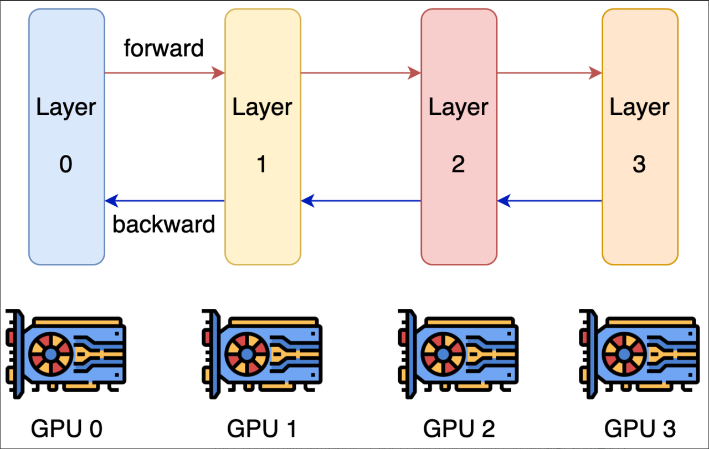

# **10.4.11 什么是FIM(Fill in the Middle)？**

论&#x6587;***Efficient Training of Language Models to Fill in the Middle***&#x4E2D;提出了FIM方法，通过简单数据转换使自回归语言模型具备填充中间文本能力

如果有一个填空题：`To be or not to be, _ _ _ question`Encoder模型主导的时代，注意力是双向的，所以可以非常方便的填充中间 mask 的内容。Decoder-only模型，token只能从左往右生成，就没法填充中间的内容了。但是填充中间内容的需求一直是存在的，比如有一段代码，想在函数名和函数体中间生成注释，Decoder-only模型就无法做到

**FIM的核心思想：**&#x901A;过**对训练数据的简单修改，在不改变模型架构的情况下，casual自回归语言模型能学习填充中间文本**，且不影响其正常的从左到右生成能力

会将原始文本划分为**prefix、suffix和middle**三部分，上面的例子就可以表示成如下的格式：

`<PRE>To be or not to be, <SUF> question<MID>This is a<EOS> `

`<PRE>`代表前缀，`<SUF>`代表后缀，`<MID>`代表填充开始，`<EOS>`表示填充结束，训练的时候用上面的样本，预测的时候则输入到`<MID>`为止，然后进行预测。同时论文中也发现这样的FIM机制堆原来的模型性能几乎没有影响：

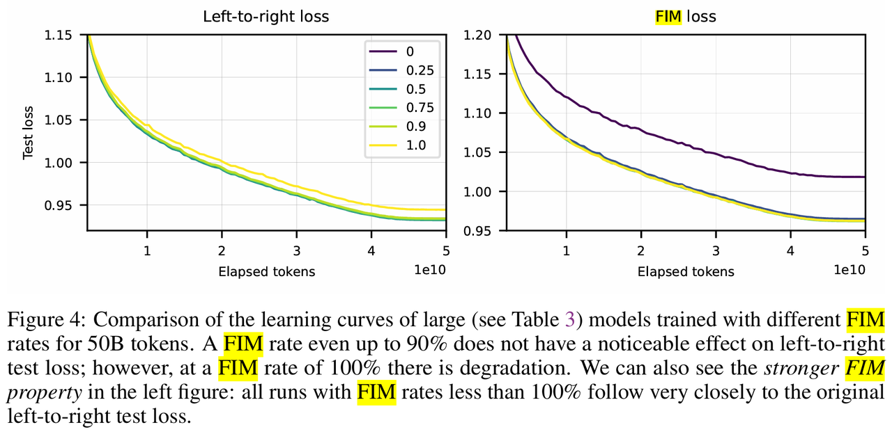

**FIM数据的casual attention pattern：**

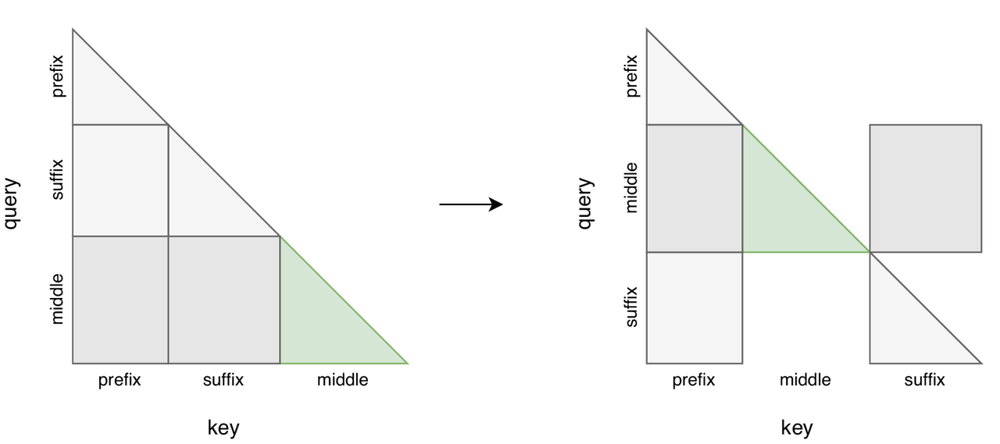

# **10.4.12 LLM的涌现能力的两个技术体现：in-context learning，COT**

模型在训练过程中能够生成出令人惊喜、创造性和新颖的内容或行为

1. **任务的评价指标不够平滑**：因为很多任务的评价指标不够平滑，导致我们现在看到的涌现现象。如果评价指标要求很严格，要求一字不错才算对，那么Emoji\_movie任务我们就会看到涌现现象的出现。但是，如果我们把问题形式换成多选题，就是给出几个候选答案，让LLM选，那么随着模型不断增大，任务效果在持续稳定变好，但涌现现象消失，如上图图右所示。这说明评价指标不够平滑，起码是一部分任务看到涌现现象的原因

2. **复杂任务 vs 子任务**：展现出涌现现象的任务有一个共性，就是任务往往是由多个子任务构成的复杂任务。也就是说，最终任务过于复杂，如果仔细分析，可以看出它由多个子任务构成，这时候，子任务效果往往随着模型增大，符合 Scaling Law，而最终任务则体现为涌现现象

3. **用 Grokking （顿悟）来解释涌现：**&#x5BF9;于某个任务T，尽管我们看到的预训练数据总量是巨大的，但是与T相关的训练数据其实数量很少。当我们推大模型规模的时候，往往会伴随着增加预训练数据的数据量操作，这样，当模型规模达到某个点的时候，与任务T相关的数据量，突然就达到了最小要求临界点，于是我们就看到了这个任务产生了Grokking现象

   尽管涌现能力为模型带来了创造性和独特性，但也需要注意其生成的内容可能存在偏差、错误或不完整性。因此，在应用和使用涌现能力强的模型时，需要谨慎评估和验证生成的

# **10.4.13 LLMs复读机问题**

**生成文本时过度依赖输入文本的复制，而缺乏创造性和独特性。**&#x5F53;面对一个问题或指令时，模型可能会简单地复制输入文本的一部分或全部内容，并将其作为生成的输出，而不是提供有意义或新颖的回应

1. **数据偏差**：大型语言模型通常是通过预训练阶段使用大规模无标签数据进行训练的。如果**训练数据中存在大量的重复文本或者某些特定的句子或短语出现频率较高，模型在生成文本时可能会倾向于复制这些常见的模式**

2. **训练目标的限制**：大型语言模型的训练通常是基于自监督学习的方法，**通过预测下一个词或掩盖词来学习语言模型。这样的训练目标可能使得模型更倾向于生成与输入相似的文本，导致复读机问题的出现**

3. **缺乏多样性的训练数据**：虽然大型语言模型可以处理大规模的数据，但如果训练数据中缺乏**多样性的语言表达和语境，模型可能无法学习到足够的多样性和创造性，导致复读机问题的出现**

4. **模型结构和参数设置**：大型语言模型的结构和参数设置也可能对复读机问题产生影响。例如，模型的注意力机制和生成策略可能导致模型更倾向于复制输入的文本

解决方法：

1. **多样性训练数据**：在训练阶段，使用多样性的语料库来训练模型，避免数据偏差和重复文本的问题。这可以包括从不同领域、不同来源和不同风格的文本中获取数据

2. **引入噪声**：在生成文本时，引入一些随机性或噪声，例如通过采样不同的词或短语，或者引入随机的变换操作，以增加生成文本的多样性。这可以通过在生成过程中对模型的输出进行采样或添加随机性来实现

3. **温度参数调整**：温度参数是用来控制生成文本的多样性的一个参数。通过调整温度参数的值，可以控制生成文本的独创性和多样性。较高的温度值会增加随机性，从而减少复读机问题的出现

4. **Beam搜索调整**：在生成文本时，可以调整Beam搜索算法的参数。Beam搜索是一种常用的生成策略，它在生成过程中维护了一个候选序列的集合。通过调整Beam大小和搜索宽度，可以控制生成文本的多样性和创造性

5. 后处理和过滤：对生成的文本进行后处理和过滤，去除重复的句子或短语，以提高生成文本的质量和多样性。可以使用文本相似度计算方法或规则来检测和去除重复的文本

6. 人工干预和控制：对于关键任务或敏感场景，可以引入人工干预和控制机制，对生成的文本进行审查和筛选，确保生成结果的准确性和多样性

# **10.4.14 什么是Self-consistency和Best-of-N？**

两种方法都是 **Aggregation-based test-time compute method**，即在**大模型在推理阶段通过输出多个回答进行聚集的出最终输出答案**

* **Self-consistency：**&#x6700;早出现在论文 ***SELF-CONSISTENCY IMPROVES CHAIN OF THOUGHT REASONING IN LANGUAGE MODELS*** 中，通过让大模型**输出多个CoT推理路径，得到多个答案，然后通过多数投票的方式选出最终答案**

  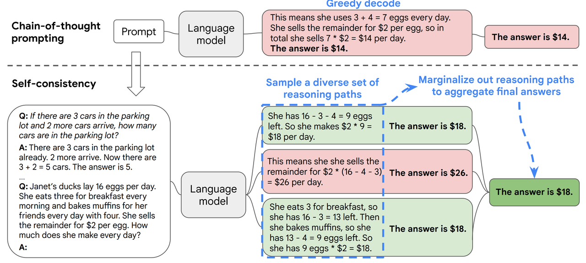

* **Best-of-N：**&#x901A;过让大模型输出N个回答，然后通过不论**是Verifier、ORM还是PRM（PRM可以给出步骤奖励加权和作为整个回答的分数）给出每个回答的分数，然后选择其中最高的（Best）作为最后的回答**

# **10.4.15 什么是对齐税 Alignment Tax？如何缓解？**

大模型在预训练过程中获得了广泛的能力，但**在RLHF框架下对大语言模型进行对齐时，可能会导致模型遗忘预训练获得的能力，这就是对齐税 Alignment Tax，即 RLHF 虽然有助于对齐人类偏好，但也可能导致模型在某些 NLP 基准上的性能下降**


解决方法：

* **PPO-ptx：**&#x50;PO-ptx就是在原本的PPO优化目标（带KL行为约束的最大化累积奖励）基础上，**增加了一项当前policy在pretrain数据集上的优化目标**，或者说加了在pertain数据集上的预训练loss，即ptx loss：

$
\mathrm{objective}(\phi) = E_{(x,y)\sim D_{\pi_{\phi}^{\mathrm{RL}}}} \left[r_{\theta}(x,y) - \beta \log \left(\pi_{\phi}^{\mathrm{RL}}(y|x)/\pi^{\mathrm{SFT}}(y|x)\right)\right] +  \gamma E_{x\sim D_{\mathrm{pretrain}}} \left[\log(\pi_{\phi}^{\mathrm{RL}}(x))\right]$

* **Model Average 模型平均：**&#x5728;**预训练和RLHF后的模型权重之间进行插值，平衡训练前后的模型参数**，减轻预训练阶段能力遗忘

* **Heterogeneous Model Averaging 异构模型平均：**&#x57FA;于模型平均的基础上，**进一步考虑在模型的不同层之间进行不同比例的权重平均，将Transformer模型分为K个部分，并为每个部分分配不同的平均比例**，优化这些比例以最大化对齐性能，同时尽量减少对齐税

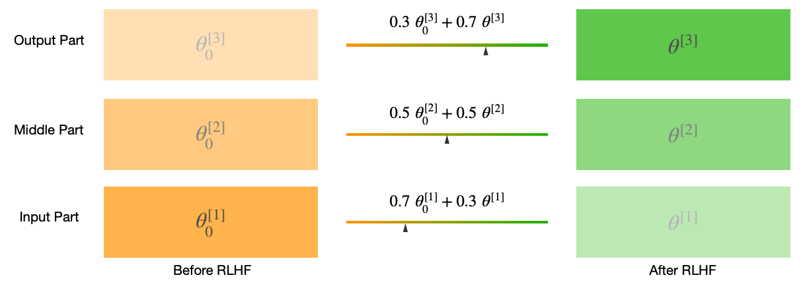


# **10.4.16 如何提升合成数据的多样性**

**AttrPrompt \[1]**

**一句话总结**：明确告诉LLM，你想要生成的文本在哪些维度（Attribute）上、有怎样的 具体要求（Value）。

做法

1. 向ChatGPT提问，询问在生成此类数据时，需要考虑哪些Attribute；

2. 人工筛选，保留必要的Attribute；

3. 再向ChatGPT提问，让它给出每个Attribute的Value集合；

4. 再次人工筛选，保留必要的Value，并且去掉那些可能带来歧义的Value。

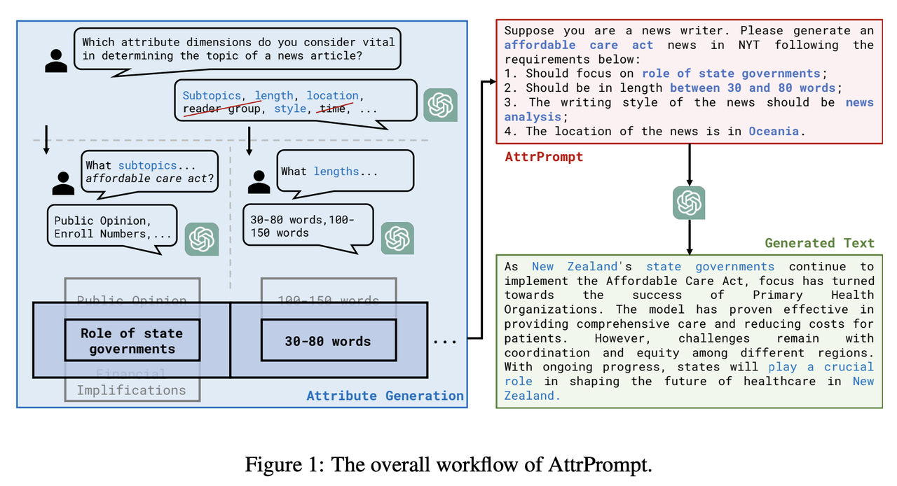

核心代码

* 获得每条数据 的Attribute

  ```python
      if args.attribute == 'similar': # find the similar topics
          args.prompt = [re.sub("_", " ", f"Give 5 most relevant classes related to {x} {args.domain} on {args.data_source} from the classes: {json.dumps(label_names)}. Write each class in a line. Do not include {x}.") for x in label_names]
          print(f"Generate a {args.domain} using model {model}, prompt: {args.prompt}")
      else:
          similar_keywords = load_attributes(attr_name = args.attribute, model = args.model_name, dataset = args.dataset, method = args.model_type, classes = label_names)
          args.prompt = [re.sub("_", " ", f"List {args.n_sample} diverse {args.attribute} related to {label_names[i]} on {args.data_source}. These {args.attribute} should be unrelated to  {similar_keywords[x]}.") for (i,x) in enumerate(label_names)]
      msg_lst = [
                  [{"role": "user", "content": p}] for p in args.prompt
              ]
  ```

* 过滤掉Attribute低的数据

  ```python
      attributes = load_attributes(attr_name = args.attribute, model = args.model_name, dataset = args.dataset, method = args.model_type, classes = label_names)
      similar_keywords = load_attributes(attr_name = 'similar', model = args.model_name, dataset = args.dataset, method = args.model_type, classes = label_names)
      i = 0
      max_reject = 5
      for c in tqdm(label_names):
          i += 1        
          similar_keyword = ",".join(similar_keywords[c])
          args.prompt = [re.sub("_", " ", f"Consider {x}. Is it relevant to the following categories: {similar_keyword}? Return 1 for yes and 0 for no.") for x in attributes[c]]
          
          print(f"Consider {attributes[c][0]}. Is it relevant to the following categories: {similar_keyword}? Return 1 for yes (related to any of these categories) and 0 for no. You only need to return one number.")
          n_reject = 0
          args.prompt = split_list(args.prompt, 25)
          for prompt in args.prompt:
              msg_lst = [
                          [{"role": "user", "content": p}] for p in prompt
                      ] 
  ```

**KMQ \[2]**

**一句话总结**：核心是基于多样性的数据选择，通过反馈循环的迭代实现学习行为的一致性。

**做法**

* 系统分析了各种聚类和采样方法，发现k-means聚类在选择最优多样化的指令数据子集方面特别有效，尤其是在结合质量采样步骤时。

* 首先对固定的数据子集进行采样，这里最初使用k-means方法，然后结合质量采样提出改进的KMQ算法，在确保选择的子集具有高度的多样性后，对模型进行微调。

* 考虑到采样和微调之间没有信息交换，通过早期训练反馈不断调整聚类的权重，以优化数据子集的选择。

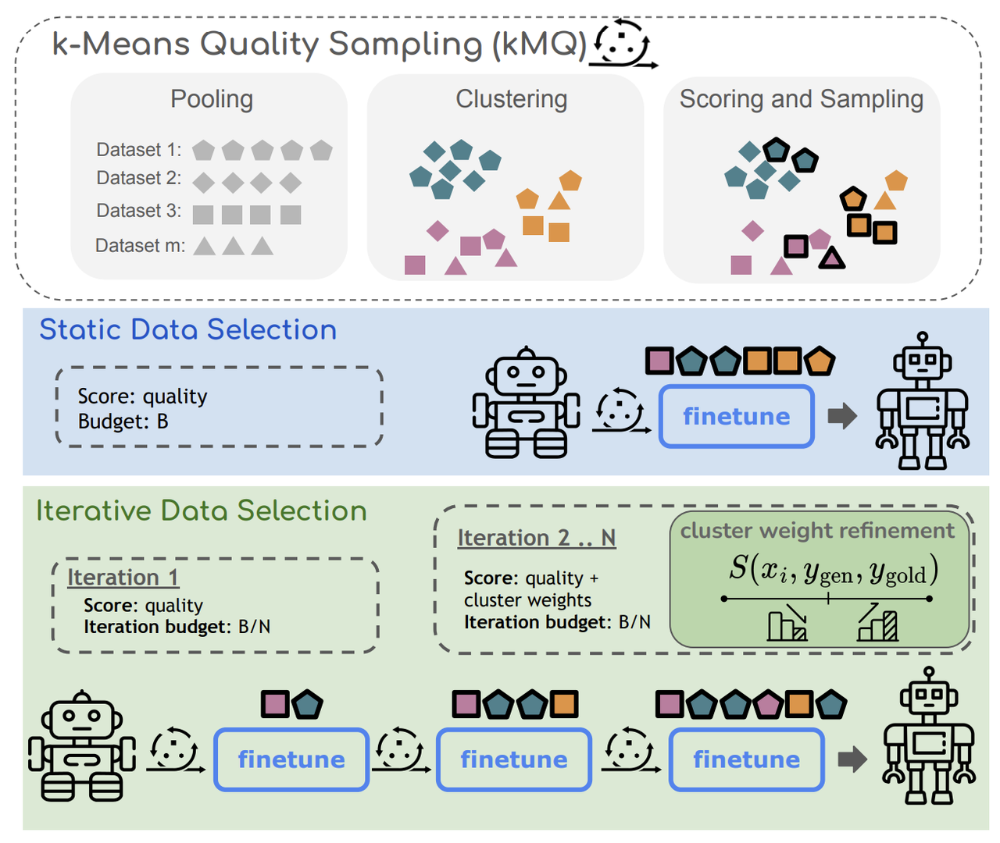

**EntiGraph \[3]**

**一句话总结**：从有限的文本中提取出关键实体和它们之间的关系，然后基于这些信息合成出大量的新文本。这个过程可以类比为，我们先从教科书中提取出知识点，然后用这些知识点编写出各种各样的习题和例子。

**做法**

1. 实体抽取：从原始文本中提取出所有的关键实体

2. 单实体描述：针对每个提取出的实体，生成详细的描述文本。这个过程同样是通过设计提示词来引导GPT-4完成的。

3. 实体关系分析：分析不同实体之间的关系，并生成相关的文本。这一步骤不仅考虑实体对，还会考虑三个实体之间的关系。

**Evol-Instruct \[4]**

**一句话总结**：核心在于指令数据演化。它通过对初始指令集进行升级和演化，生成更多样化的指令，从而提高模型对不同类型指令的处理能力。

做法

1. **收集初始指令集**：作为演化的基础，初始指令集应包含来自不同领域和任务、具有不同复杂度和难度级别的指令。这些指令可以是简单的问答、翻译任务，也可以是复杂的推理、总结任务。

2. **指令数据演化**：通过对初始指令集进行深度演化和广度演化，生成更多样化的指令。深度演化主要包括添加约束、深化、具体化、增加推理步骤和复杂化输入等操作。

3. **淘汰低效指令**：在演化过程中，会产生一些没有提供信息增益、难以生成响应或明显复制了演化提示词汇的指令。这些指令被称为低效指令，需要通过淘汰演化过程进行识别和过滤，以确保指令集的质量。

4. **合并与微调**：将演化的指令数据与初始指令集合并，形成最终的微调数据集。然后，在LLM上进行微调训练，以提高模型对复杂指令的处理能力。

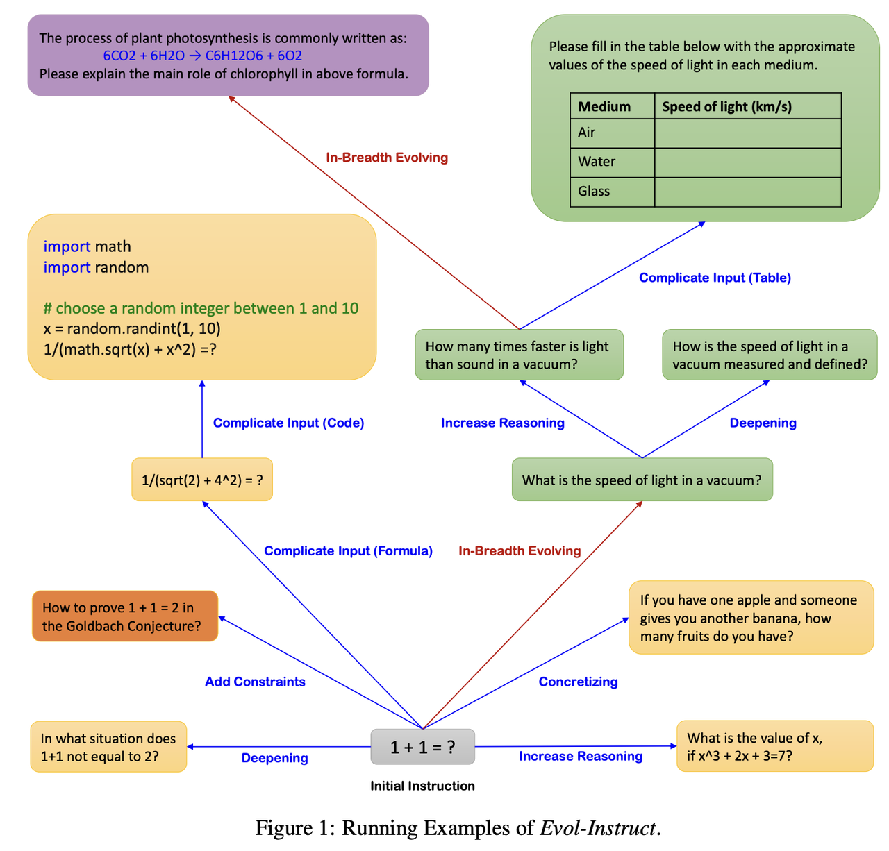

**核心代码**

* **深度指令进化**

  ```python
  base_instruction = "I want you act as a Prompt Rewriter.\r\n \
                                          Your objective is to rewrite a given prompt into a more complex version to make those famous AI systems (e.g., chatgpt and GPT4) a bit harder to handle.\r\n \
                                          But the rewritten prompt must be reasonable and must be understood and responded by humans.\r\n \
                                          Your rewriting cannot omit the non-text parts such as the table and code in #The Given Prompt#:. Also, please do not omit the input in #The Given Prompt#. \r\n \
                                          You SHOULD complicate the given prompt using the following method: \r\n\
                                          {} \r\n\
                                          You should try your best not to make the #Rewritten Prompt# become verbose, #Rewritten Prompt# can only add 10 to 20 words into #The Given Prompt#. \r\n\
                                          '#The Given Prompt#', '#Rewritten Prompt#', 'given prompt' and 'rewritten prompt' are not allowed to appear in #Rewritten Prompt#\r\n"
  ```


  def createConstraintsPrompt(instruction):
          prompt = base_instruction.format("Please add one more constraints/requirements into #The Given Prompt#'")
          prompt += "#The Given Prompt#: \r\n {} \r\n".format(instruction)
          prompt += "#Rewritten Prompt#:\r\n"
          return prompt
  def createDeepenPrompt(instruction):
          prompt = base_instruction.format("If #The Given Prompt# contains inquiries about certain issues, the depth and breadth of the inquiry can be increased.")
          prompt += "#The Given Prompt#: \r\n {} \r\n".format(instruction)
          prompt += "#Rewritten Prompt#:\r\n"
          return prompt
  def createConcretizingPrompt(instruction):
          prompt = base_instruction.format("Please replace general concepts with more specific concepts.")
          prompt += "#The Given Prompt#: \r\n {} \r\n".format(instruction)
          prompt += "#Rewritten Prompt#:\r\n"
          return prompt
  def createReasoningPrompt(instruction):
          prompt = base_instruction.format("If #The Given Prompt# can be solved with just a few simple thinking processes, you can rewrite it to explicitly request multiple-step reasoning.")
          prompt += "#The Given Prompt#: \r\n {} \r\n".format(instruction)
          prompt += "#Rewritten Prompt#:\r\n"
          return prompt
  ```

* **宽度指令进化**


  ```python
  base_instruction = "I want you act as a Prompt Creator.\r\n\
  Your goal is to draw inspiration from the #Given Prompt# to create a brand new prompt.\r\n\
  This new prompt should belong to the same domain as the #Given Prompt# but be even more rare.\r\n\
  The LENGTH and complexity of the #Created Prompt# should be similar to that of the #Given Prompt#.\r\n\
  The #Created Prompt# must be reasonable and must be understood and responded by humans.\r\n\
  '#Given Prompt#', '#Created Prompt#', 'given prompt' and 'created prompt' are not allowed to appear in #Created Prompt#\r\n"


  def createBreadthPrompt(instruction):
          prompt = base_instruction
          prompt += "#Given Prompt#: \r\n {} \r\n".format(instruction)
          prompt += "#Created Prompt#:\r\n"
          return prompt
  ```

**Quad**

**一句话总结**：利用数据影响来评估数据质量，并通过簇聚类和多臂赌博机方法来确保数据多样性。

**做法**

**簇聚类**：Quad首先将数据集分成多个簇，使得同一簇内的数据实例相似，不同簇之间的数据实例具有多样性。

**多臂赌博机**：每个簇被视为一个赌博机的臂，通过选择臂来抽取样本并计算影响分数，从而在确保高质量数据的同时，也保证了数据的多样性。

**加速计算**：为了更准确地评估单个数据点对整体模型的影响，Quad扩展了从MLP层到整个层的加速iHV P计算方法。

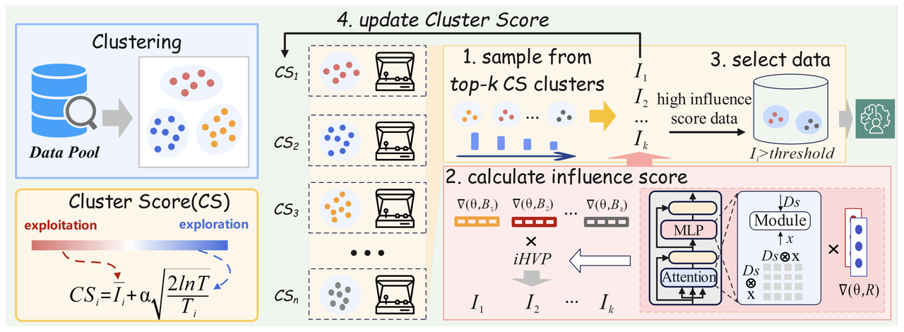

**参考文献**

\[1] Large Language Model as Attributed Training Data Generator: A Tale of Diversity and Bias.

\[2] Diversify and Conquer: Diversity-Centric Data Selection with Iterative Refinement.

\[3] Synthetic continued pretraining.

\[4] WizardLM: Empowering Large Language Models to Follow Complex Instructions.

\[5] Harnessing Diversity for Important Data Selection in Pretraining Large Language Models.

# **10.4.17 介绍Lora及其变体的特点**

**参考3.5.6章节[ 3.5 PEFT 参数高效微调](https://kcnd4kn8i6ap.feishu.cn/wiki/OYA5wHPWoit8mpkCAqIcdN0hnQK?fromScene=spaceOverview#share-XgVcd59Ngo59ScxbJeqc0MXxnMf)**

# **10.4.18 讲讲attention的各个变体**

**参考1.3章[ 1.3 Attention 注意力](https://kcnd4kn8i6ap.feishu.cn/wiki/SUHDwvtwLiyigUkbMk5c49sPnHW)**

# **10.4.19 讲讲工业界RAG具体如何优化？**

**工业界关注什么**

* 对于内容供给，工业界关注query改写、意图分流、向量召回、重排、大模型和搜索引擎的交互方式。

* 对于归纳总结能力，工业界更加关注内容全面性，生成内容格式，生成效果稳定性。

**检索**

1. 通过生成与用户query 相关的伪文档来扩展 query，就是Query2Doc \[1]。

2. 通过生成伪文档，并使用无监督检索器对其进行编码，并在其嵌入空间中进行搜索，就是HyDE \[2]。

3) 将 prompt 与LLMs结合作为一个无需微调的 query 生成器，仅依赖目标任务中的一些监督示例，就是PROMPTAGATOR \[3]。

4) 鼓励 LLM 从具体实例中退一步，参与对底层一般概念或原则的推理，这就是StepBack-prompt \[4]。

**生成**

1. LLM对文本的位置存在bias，那就根据文本质量和查询时效性对召回的材料做重排。

2. 通过触发，检测，缓解三步走解决生成结果前后矛盾，局部消除矛盾点，就是gLM \[5]。

3) 额外设计了一个NLI模型对检索的信息做噪声识别，并在RAG的微调阶段，同时加入正向相关的检索结果以及不相关的噪声信息做sft微调，就是RALM \[6]。

4) 通过递归地向量化、聚类和摘要文本，自下而上构建出一个包含不同级别摘要的树状结构，就是RAPTOR \[7]。

5. 分别设计了抽取和生成两种压缩器，对RAG召回文档进行进一步压缩，这就是RECOMP \[8]。

6. 利用LLM（如LLaMA）对每个文档和query的组合计算QLM分数，根据QLM分数进行重排序，这就是zero shot QLM \[9]。

7) 提出在softmax分母中添加了一个1，大大减少注意力头生成的不必要的噪声，就是softmax1 \[10]。

微调

1. SFT训练的过程中增加负例文档，从而消除不相关文档的干扰，增强鲁棒性，就是RAFT \[11]。

2. 通过编码器解码器架构 LM 为预训练的检索器提供监控信号，就是AAR \[12]。

3) 在训练阶段，使用冻结的LLM来监督提示检索器的调整，其中LLM和检索器都将提示输入对作为输入，并且我们使用LLM给出的任务分数来监督对比学习 检索器的，就是UPRISE \[13]。

4) 在第一个“上下文提取阶段”，PRCA 模块针对领域抽象摘要任务进行预训练。 第二个“奖励驱动阶段”展示了检索到的 Top-K 文档与 PRCA 之间的交互。 就是PRCA \[14]。

**参考文献**

\[1] Query2doc: Query Expansion with Large Language Models.

\[2] Precise Zero-Shot Dense Retrieval without Relevance Labels.

\[3] Promptagator: Few-shot Dense Retrieval From 8 Examples

\[4] TAKE A STEP BACK: EVOKING REASONING VIA ABSTRACTION IN LARGE LANGUAGE MODELS.

\[5] Self-contradictory Hallucinations of Large Language Models: Evaluation, Detection and Mitigation.

\[6] Making Retrieval-Augmented Language Models Robust to Irrelevant Context | Semantic Scholar.

\[7] RAPTOR: Recursive Abstractive Processing for Tree-Organized Retrieval.

\[8] RECOMP: Improving Retrieval-Augmented LMs with Compression and Selective Augmentation.

\[9] Open-source Large Language Models are Strong Zero-shot Query Likelihood Models for Document Ranking | Semantic Scholar.

\[10] Attention Is Off By One.

\[11] RAFT: Adapting Language Model to Domain Specific RAG.

\[12] Augmentation-Adapted Retriever Improves Generalization of Language Models as Generic Plug-In.

\[13] UPRISE: Universal Prompt Retrieval for Improving Zero-Shot Evaluation.

\[14] PRCA: Fitting Black-Box Large Language Models for Retrieval QuestionAnswering via Pluggable Reward-Driven Contextual Adapter.

# **10.4.20 LLM和搜广推的MoE是一个东西吗**

**结论**：LLM所谓的`MoE`和搜推里的`MoE`不尽相同。LLM用的这个技术准确点应该叫做`SMoE`，而搜推中通常叫`MMoE`。

**搜推的MoE**：搜推的`MoE`更多的是用在多任务学习中，或者说叫`MMoE`，是`sample-level`的。每个专家都是一个独立的网络并拥有特定的功能，各个专家都会计算最后做聚合，进行多目标预告（广告和）。

**LLM的MoE**：LLM的`expert`都是自动学出来的，它是`token-level`的。各个`Expert`之间没有实质区别，通过`gate`在稀疏MoE层中决定哪些`token`被发送到哪个expert中，本质上只激活了LLM中的部分`expert`。

**观点**：LLM的SMoE更偏向`Sparseness`，而不是`Expertise`，它和搜广推在目的上有着本质的区别。

**个人看法**：LLM里的MoE应该也是可以做成`sample-level`的，比如先进行`classifier`路由，将`sample`发送到对应的`Lora`模型，然后在调用该`topic model`进行输出，这样也同样达到了`Sparseness`的目的。或者分阶段，第一步进行`Route`，第二步训练`Expert`（Multi-Lora）。基于前两步对`sample`进行多专家聚合，这样也可以达到了`Expertise`的效果。

# **10.4.21 手撕Normalization**

要求手&#x6495;**`RMSNorm`**&#x548C;**`LayerNorm`**，一般要求用torch实现。

**代码实现：**

# **10.4.22 手撕在MHA中加入KV Cache**

在写&#x5B8C;**`MHA`**&#x540E;，遇到过要求在代码中加&#x5165;**`KV Cache`**&#x7684;情况。

**代码实现：**

# **10.4.23 手撕线性回归（Minimax必考题）**

要求用numpy手撕一个线性回归，可以用多种方法来做，可以使用SDG和直接求解W的方法来做。

**代码实现：**

# **10.4.24 手撕 K-Means聚类**

实&#x73B0;**`K-Means`**&#x805A;类，要求包含**Fit**和**Predict**两个函数。

**代码实现：**

# **10.4.25 SFT的局限？**

* sft无法负反馈

sft只知道 [next\_token](https://zhida.zhihu.com/search?q=next_token\&zhida_source=entity\&is_preview=1) 出什么是正确的，而不知道 next\_token 出什么是错误的，sft 一直在通过“孤立”来降低错误 token 的出现概率。

越是在 sft 阶段告诉它什么是错误的，它越是容易提高错误 token 的概率。

站在模型的角度来思考，这个现象非常合理：“训练者不断让我提高 Prob( E | ABCD ) 的概率，那我举一反三，顺带提高一下 Prob( E | ACD ) 的概率是不是也合理？训练者是不是应该表扬我？”。

当B 这个 token，恰好是“not”，恰好是“不”，就会诱导模型产生严重的幻觉。

* sft不具有向后看的能力

在 sft 的训练过程中，每一个 token 都只看得见前面的 token。还是那个经典例子，“东京是中国的，这个观点是严重错误的”。无论你用什么炼丹技巧来做 sft，Prob(中国 | 东京是) 的概率都是在增加的，模型无法利用“后半个句子在否定前半句子”这个重要信息。

在做rlhf时，reward 反向衰减传递的时候，把最大的奖励赏赐给“*错误&#x20;*”这个 token，而“*中国&#x20;*”这个 token 可能并不会得到很多的 reward。

# **10.4.26 SFT中的loss是怎么做计算的？**

与pretrain不同，sft计算只需要计算response部分与label的交叉熵损失。计算的具体流程如下（来源Megatron源码）：

1）get\_batch: 获取tokens, labels, loss\_mask, attention\_mask, position\_ids

2\) model forward: 获取output\_tensor

3\) loss\_func: 计算loss

# **10.4.27 SFT阶段怎么做数据packing？**

处理变长数据，如果一个micro-batch一条数据，容易造成资源浪费。

**使用背包问题的贪心解法作packing**

**参考[ 5.7 大模型的packing技巧](https://kcnd4kn8i6ap.feishu.cn/wiki/JMT4wrAKUiZaoHkCONScvVr5nKd)**

# **10.4.28 作packing可能有什么坏处？**

1. **削弱了模型对难的短query和短答案的拟合**。

   1. 在无sft packing得情况下，假设batch\_size= 1，那么如果有个短query和短答案在这个batch里，其余补充padding，那么这个batch的gradient全是这个短文本的gradient，模型对这个query的拟合能力会变强。但是如果SFT packing以后，多个短文本在一个样本中，这个batch的gradient会被稀释，短文本的拟合就不会特别强。

2. **对多轮对话有影响**。

   1. 目前没有使用Block Attention的微调框架对于Packing的实现方式往往是在两个conversation之间用Padding Token或者是EOS Token进行隔断，这种方式无法避免Seq和Seq之间的影响，并且，这种数据格式和多轮对话的数据格式是一致的。

   2. 如果在多轮对话中使用EOS Token作为当前轮对话结束的标识，那么我们就会发现，模型仅能依赖BOS Token来作为当前Seq的标识符（即BOS Token前面的是历史Seq，BOS Token后面的才是模型需要的历史信息），实际上这一点对于现在的LLM通常来说是难以做到的，因为在没有Block Attention的情况下，Seq和Seq之间的Attention系数会导致模型总是无法避免的依赖于之前的Seq的内容，因此，如果一个数据集中既出现了多轮对话又使用了Packing的技术，会导致模型无法区分历史对话和当前对话。如果强行使用Packing技术，那么甚至会存在算力浪费

# **10.4.29 有一个非常完备的sft指令集，你只能选择1w条，你如何选择数据来使模型的能力更加提升+完备？**

* 每条数据指令的质量+多样性筛选

* 涵盖尽可能多的任务，其中推理和code类可以占比稍大

* 多语言

* 指令难度筛选

* 指令长度筛选，长度总体分布均匀

* 根据任务目标添加相关任务类型的数据

# **10.4.30 以跳过sft阶段直接进行RLHF么？**

sft可以类比的是RL中的模仿学习，RLHF就是在此基础上纯跟环境交互的RL。那么和LLM对齐阶段相似的过程有两个，第一是alpha-go，第二个是自动驾驶。它们两个现实中的人工智能技术，开始的时候都是先做模仿学习，第二步进行跟环境交互的强化学习。他们都有个共同特点，就是环境复杂，模型如果纯进行RL的话，搜索空间过于庞大，消耗资源较多。尽管alpha-go后续有zero-alpha-go算法，但是建立的基础是reward model是客观的，且不计成本的进行空间搜索。在LLM环境下，由于不存在天然的reward model，所以建立reward model的人工成本较大，所以不适合不计成本的空间搜索。所以利用sft首先做模仿学习缩小搜索空间，再利用RLHF进行进一步对齐是必要的。

# **10.4.31 模型在SFT后会出现“复读机”情况该如何debug，以及出现的原因是什么？**

* pretrain模型能力不强

* 复读的那部分数据不能给予更多的信息，所以模型attention时候会跳过这部分信息依然从之前的context后进行预测。也就是\<context> -> 复读数据 & \<context, 复读数据> -> 复读数据。之前的做法一般会搞一个复读的penalty阻止这一现象，现在几乎没用了。

* pre train阶段：1）模型承载能力（模型大小，模型结构），2）数据多样性

* 补充：确实sft数据训练过少的情况也会导致复读，本质还是模型一般学不会何时停止输出结果，因为pre-train的时候一般是packing，那么基本不太会学会输出\<eos>，所以pre-train模型一般都是会复读的。

参考链接：https://zhuanlan.zhihu.com/p/692962369

# **10.4.32 为什么RLHF在多轮对话和数学推理上有用？**

随着多轮对话的进行，模型解码时每一步推理的attention都会因为序列长度变大而可能被“稀释”，强化学习在每一轮交互中的奖惩可以达到“纠偏”的作用，降低这种“稀释”对good case的影响，尤其是针对数学和代码类这种标准答案相对唯一但题目又可灵活多变的交互， 交互粒度越细，good与bad界限越清晰， 强化学习相对sft的提升就越明显。

目前看的话，stepDPO 对我接触的业务数据似乎更有用。

# **10.4.33 RLHF 最近的新算法有哪些，介绍几个？**

参考链接：https://zhuanlan.zhihu.com/p/710021282

大厂面试官问RLHF及变体时，如何优雅地装杯

1. 如果数据集是人类标注的，就是RLHF

2. 如果是gpt，PaLM2等模型标注的，就是RLAIF

3. RL技术中，典型的是PPO（缺点是训练不太稳定，效率低，资源消耗大）

4. 使用一种好的方法来计算 baseline 是丢掉 Critic 网络的关键，就是GRPO

5. 我们可以丢掉 Critic（教练），Actor 不再需要受到 Critic 的指导，而是直接去对齐 RM，就是ReMax

6. 后面出现了非RL的技术，典型的就是DPO（直接构造偏好数据集进行优化）

7. 然后有一些工作觉得SFT+RLHF不是end2end，索性直接在SFT上加一个alignment的loss，这个典型的就是ORPO

8. 还有一部分工作觉得DPO训练的pair-wise（x,y\_w,yl）的数据集获取很困难，于是有了point-wise(x,y,label)的方法，典型的是KTO

9. 还有一些就是优化Alignment的输出长度的，加了一个类似正则化项的限制DPOP

10. 最近又出现了一种step-wise的优化方法(例如Step-DPO)，直接对reasoning的过程进行优化限制(step-level)，而不是等模型输出完了再进行优化(Instance-level)

11. 有人觉得reward model无法优化general perference（不可传递性偏好，比如a>b,b>c, c>a的情况）于是有了DNO，SPO（引入了纳什均衡，Nash equilibrium）

12. 有的人觉得DPO优化的是单轮，因此对多轮的偏好优化做了拓展（multi-turn DPO）

13. 方法超不过你，就直接合成数据，用MCTS（exploration and exploitation保证多样性和质量）等方式造完数据，直接DPO开始训练就完了，完美的数据闭环

# **10.4.34 Reward Model常见的hacking有哪些？**

参考链接：https://www.zhihu.com/question/662061754/answer/3573741988

1. 长度hacking：RM如果数据有限会极端偏好更长的回答

2. 风格hacking：对于markdown或者latex等高阶格式的偏爱

3. [CoT](https://zhida.zhihu.com/search?content_id=678994470\&content_type=Answer\&match_order=1\&q=CoT\&zhida_source=entity)的hacking：对于CoT范式本身的偏爱而非CoT对于解答用户问题的促进作用

此外，事实类问题（均存在概率分布的原子知识应该相信谁），安全性问题（处于边界的问题是应该拒答，正答还是指令遵循）等任务对于RM过于困难也可能导致RM效果差。

# **10.4.35 什么任务适合上RLHF，什么任务sft效果更好？**

* RLHF适合解决Reward比较明确的复杂问题，典型的是数理化、[Coding](https://zhida.zhihu.com/search?content_id=248563321\&content_type=Article\&match_order=1\&q=Coding\&zhida_source=entity)等有标准答案的学科

* 对于文创、角色扮演等一般依赖于长文本能力，需要做好预训练和sft，偶尔会做DPO训练。

# **10.4.36 LORA 介绍，秩的数学含义，怎么计算矩阵的秩？**

* 秩是指矩阵中线性无关的行或列的最大数目

* 具体地说：

  * **线性独立性**：矩阵的秩是矩阵中线性独立行或列的数量。如果矩阵的某些行或列可以通过其他行或列的线性组合来表示，那么这些行或列就不是线性独立的。

  * **维度**：矩阵的秩可以告诉我们矩阵的列空间或行空间的维度。秩越高，矩阵的列空间或行空间的维度就越大。

  * **解的个数**：在线性方程组中，矩阵的秩可以决定方程组解的个数。如果增广矩阵的秩等于系数矩阵的秩，并且等于变量的个数，那么方程组有唯一解；如果增广矩阵的秩小于系数矩阵的秩，那么方程组无解；如果增广矩阵的秩小于变量的个数，那么方程组有无穷多解。

  * **矩阵的逆**：如果矩阵是方阵，那么只有当矩阵的秩等于其阶数时，矩阵才是可逆的。

* 计算方式

  * 通过初等行变换将矩阵转换为阶梯形或行最简形，然后计算非零行的数量

# **10.4.37 Lora 相比全参数微调可以节省多少计算量和显存？**

* 为什么 Lora 有效？

  1. deep model 的本征维度很小 （https://papers.cool/arxiv/2110.07867)

  2. 使用低秩矩阵分解来近似表示全量矩阵在特定任务上的参数变化

* https://spaces.ac.cn/archives/9590

# **10.4.38 知道Lora中的scale吗？**

$h = W_0x + ∆W x = W_0x + BAx$

通过 $\frac{\alpha}{r}$缩放 $∆W$， $\alpha$是r的一个常数。调整 *α* 大致等同于调整学习率。因此，我们简单地将 *α* 设置为我们首先尝试的r值，并且不再对其进行调优。

# **10.4.39 Lora是否能降低计算量？**

**梯度分析**

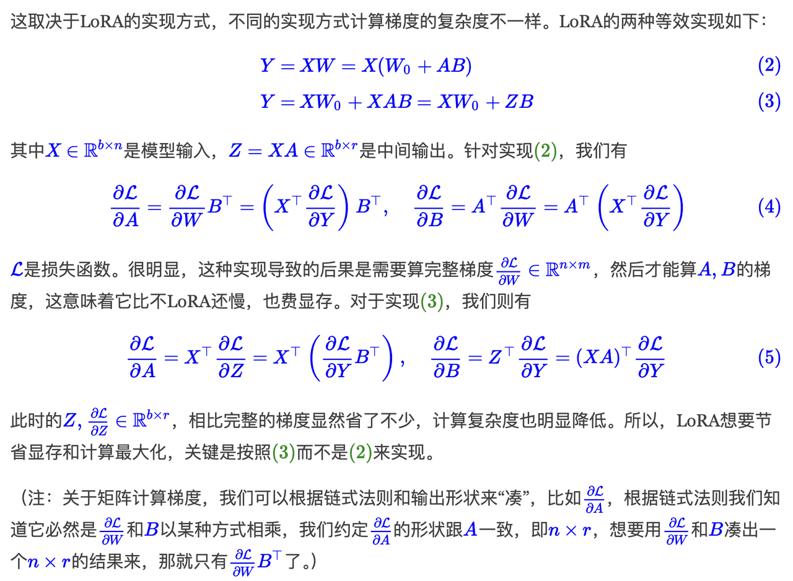

其他原因：

1、只更新了部分参数：比如LoRA原论文就选择只更新Self Attention的参数，实际使用时我们还可以选择只更新部分层的参数；

2、减少了通信时间：由于更新的参数量变少了，所以（尤其是多卡训练时）要传输的数据量也变少了，从而减少了传输时间；

3、采用了各种低精度加速技术，如FP16、FP8或者INT8量化等。

# **10.4.40 LongLora是怎么做的？**

LoRA在遇到超长上下文的查询时，提升效果不够明显，并且会带来模型困惑度增加的问题。

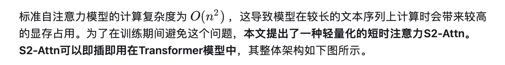

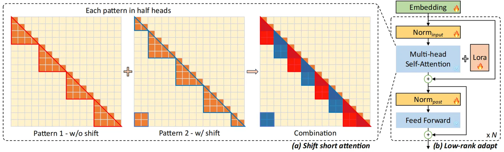

首先将模型的输入分为几组，并在每个组中分别进行注意力计算，**同时在每个组中，将原有的token移动组大小的一半来保证相邻注意力头之间的信息交互**

# **10.4.41 大模型出现幻觉的原因**

在输出答案的时候是逐个Token输出，当输出长度较长的时候，中间某些Token出错是一定会发生的，但即使LLM后来知道前面输出的Token错了，它也得将错就错往下继续编（这也是大模型幻觉的来源之一，为了看上去逻辑合理，LLM得用100个错误来掩盖前面的第一个错误），因为落Token无悔，没有机制让它去修正前面的错误

# **10.4.42 讲讲你了解的scaling law有哪些？**

> 目前关于LLM的Scaling Law研究主要集中在模型性能与规模（参数、数据、计算量）之间的关系、涌现能力的发现、推理优化以及实际应用中的挑战等方面。

**基础Scaling Law研究 \[1]**

* **Kaplan等人的经典理论**：2020年提出的Scaling Law指出，模型性能（如测试损失）随参数数量、数据集大小和计算量的指数增长呈线性提升，且三者需协同扩展以避免瓶颈。例如，模型参数增加约8倍时，训练数据需增加约5倍以维持性能提升。

* **幂律关系的验证**：研究发现，测试损失与模型规模之间遵循逆幂律关系，即损失随规模增大而平滑下降，但提升速度逐渐放缓。这一现象在多个数据集上被复现，成为预训练扩展的理论基础。

**强化Scaling Law研究 \[2]**

* **过优化Goodhart’s law：**&#x6A21;型可能过度拟合代理奖励函数，导致在真实评估指标上的性能下降，即Reward Hacking。这符合Goodhart定律——“当指标成为目标时，它就不再是一个好指标”。论文通过合成实验验证了这一现象：随着模型在代理奖励上的得分提升，其在“黄金标准”奖励模型（代表真实偏好）上的得分先上升后下降，呈现“驼峰型”曲线。

* **直接对齐算法的隐式过度优化**：

  * **KL散度与性能的非线性关系**：不同KL约束下，模型性能（如GPT-4评估的胜率）随训练步长增加先升后降，且小模型更易陷入过度优化。

  * **模型规模的影响**：大模型在KL与性能的权衡中表现更优，表明模型容量越高，对隐式奖励的泛化能力越强。

**微调Scaling Law研究 \[3]**

* **幂律联合缩放法则：**

  * 微调性能遵循幂律乘法联合缩放法则，即模型性能与微调数据量、模型大小、预训练数据量等因素呈幂律关系。例如，测试PPL随模型参数和微调数据量的增加而平滑下降，但提升速度逐渐放缓。

  * 当模型大小（如从 1B 到 16B）与微调数据量协同扩展时，性能提升显著，但参数高效调优（PET）方法的参数量扩展对性能提升作用有限

* **模型规模 > 预训练数据规模：**&#x6A21;型大小的扩展比预训练数据量的扩展更有效，且发现预训练数据量的影响仅在模型规模较小时显著，而对大模型的微调增益有限。

* **PEFT的适用性：**

  * PEFT在数据量较少时表现更优，而全模型调优（FMT）需要更多数据但最终效果更好13。

  * LoRA 的稳定性优于 Prompt Tuning：LoRA 在数据量增加时表现更稳定，而 Prompt Tuning 可能出现逆向扩展（性能随参数增加而下降）。

  * PEFT 方法的泛化能力更强，因其冻结了大部分预训练参数，保留基础模型的知识。

* **任务与数据的依赖：**&#x6700;优微调方法高度依赖任务类型和微调数据量。例如：

  * 数据量少（几千样本）：优先选择 PET（如 LoRA 或 Prompt Tuning）。

  * 数据量中等（数万样本）：LoRA 更稳定。

  * 数据量极大（百万级）：FMT 效果更优。

**推理Scaling Law研究 \[4]**

* **慢思考策略**：通过额外计算资源（如多次采样、树搜索）提升推理质量，例如宽度扩展（BoN、MCTS）和生成-选择机制。研究发现，推理路径长度增加会导致信息损失（雪球误差效应），需平衡生成与选择步骤的效率和准确性。

* **推理成本与效率**：随着模型规模扩大，推理成本急剧上升，行业开始转向优化推理阶段而非单纯扩展预训练。

**批大小Scaling Law研究 \[5]**

* **激增现象：**&#x41;dam类优化器的最优学习率随Batch Size的增加呈现先上升后下降的非单调趋势，类似“浪潮”形态。例如，当Batch Size较小时，增大Batch Size可提升学习率；但超过临界值（由噪声水平 Bnoise决定）后，学习率反而需降低以维持收敛稳定性。

* **与SGD优化器的对比：**

  * SGD的最优学习率随Batch Size线性或平方根缩放（如 η∝B或 η∝B），主要基于梯度噪声方差的分析。

  * Adam的激增现象源于其自适应学习率机制和符号更新策略，导致其优化路径对Batch Size的敏感度更高。

* **训练过程中的动态变化：**&#x968F;着训练进行，Bnoise*Bnoise* 逐渐增大，导致激增现象的峰值向更大的Batch Size方向移动。这表明不同训练阶段需动态调整学习率与Batch Size的配比。

**蒸馏Scaling Law研究 \[6]**

* **蒸馏性能的可预测性**：学生模型的交叉熵损失 $L_S$可通过教师模型的交叉熵损失 $L_T$、学生参数 $N_S$和训练 token 数 $D_S$的幂律关系预测：

  $L_S=\alpha\cdot L_T^\beta+\gamma\cdot N_S^{-\delta}+\epsilon\cdot D_S^{-\zeta}$

* **能力差距现象**：教师与学生之间的性能差距不仅由模型大小决定，更源于两者在假设空间和优化能力上的差异。过强的教师可能导致学生模型表现下降，需通过调整资源分配缓解。

* **弱学生超越教师的可能性**：在特定配置下（如 $L_S>2.3$），学生模型可通过蒸馏优化实现性能反超教师（即“弱到强泛化”）。

* **教师模型的影响**：教师性能由 $L_T=L_T(N_T,D_T)$ 决定，其交叉熵损失通过幂律影响学生性能。教师的训练成本需纳入整体计算预算考虑。

* **最优蒸馏条件**：

  1. **已有教师模型**：优先选择蒸馏，其计算效率优于监督预训练，直至学生模型规模超过阈值。

  2. **需训练教师模型**：若教师仅用于单次蒸馏，监督学习更优；教师可复用蒸馏更高效。

* **IsoFLOP 配置实验**：在固定计算预算下，调整学生参数  $N_S$与训练数据量  $D_S$ 的配比，验证了学生模型在多种规模下遵循幂律扩展。

# **10.4.43** **LLM数据合成工作有哪些？**

**数学推理**

1. [**MuggleMath: Assessing the Impact of Query and Response Augmentation on Math Reasoning**](https://arxiv.org/abs/2310.05506v3)

* 通过对原有问题进行改写，并通过对改写后的新问题采样不同的回答，获得新的增强数据集。

- [**Distilling LLMs' Decomposition Abilities into Compact Language Models**](https://arxiv.org/abs/2402.01812)

* 提出了一个基于GSM8K数据集的AI生成数学问题子问题分解基准，通过微调和离线强化学习方法在小型模型中蒸馏复杂问题的分解能力，并探索了利用模型自身反馈提升推理性能的潜在路径。

- [**MathGenie: Generating Synthetic Data with Question Back-translation for Enhancing Mathematical Reasoning of LLMs**](https://arxiv.org/abs/2402.16352)

* 通过迭代解决方案增强、问题回译和验证过滤生成多样可靠的数学问题及代码集成解决方案，并基于此数据微调预训练模型，获得高性能的MathGenieLM系列模型。

- [**MetaMath: Bootstrap Your Own Mathematical Questions for Large Language Models**](https://arxiv.org/abs/2309.12284)

* 通过重写技术（答案增强、问题改写、逆向问题增强）来增加训练数据集中的数学问题多样性，并在新的数据集MetaMathQA上微调模型。

- [**WizardMath: Empowering Mathematical Reasoning for Large Language Models via Reinforced Evol-Instruct**](https://arxiv.org/abs/2308.09583)

* 从上行演化和下行演化角度出发，合成具有各种复杂性和多样性的数学指令，以增强大语言模型的数学能力。

- [**JiuZhang3.0: Efficiently Improving Mathematical Reasoning by Training Small Data Synthesis Models**](https://arxiv.org/pdf/2405.14365)

* 提出一种低成本知识蒸馏数据集构建方法，通过教育阶段提示词和梯度相似性筛选高价值文本，利用GPT-4生成数据训练小模型DeepSeekMath-7B合成高质量数学问题，并预训练JiuZhang3.0模型。

- [**Unleashing Reasoning Capability of LLMs via Scalable Question Synthesis from Scratch**](https://arxiv.org/pdf/2410.18693)

* 首先通过QFT和QPO训练出一个问题生成器，然后利用这些生成器进行开放式问题采样，并对生成的问题进行进一步筛选，最终基于筛选出的高质量问题生成相应的解答。

- [**Augmenting Math Word Problems via Iterative Question Composing**](https://arxiv.org/abs/2401.09003)&#x20;

* 通过整合预处理的高质量网络数据与多策略增强合成数据（包括GPT-4提示生成、迭代问题组合和拒绝采样），并基于此微调多个基础模型，显著提升数学推理能力。

**代码生成**

1. [**Self-play with Execution Feedback: Improving Instruction-following Capabilities of Large Language Models**](https://arxiv.org/abs/2406.13542)

* 通过自我指导和执行反馈来自动化地生成和验证指令遵循训练数据，进而通过SFT或基于人类反馈的RLHF来提升LLMs的性能。

- **[AutoCoder: Enhancing Code Large Language Model with AIEV-Instruct](https://arxiv.org/abs/2405.14906)&#x20;**

* 通过双代理交互模拟编程测试流程生成高质量代码数据集，结合教学与自学习阶段减少闭源模型依赖，并训练出AutoCoder系列模型。

- [**CodeRL: Mastering Code Generation through Pretrained Models and Deep Reinforcement Learning**](https://arxiv.org/abs/2207.01780)

* 通过强化学习的actor-critic架构（利用预训练模型生成代码样本并由错误预测器评估），结合推理阶段的单元测试信号优化与程序修复机制，显著提升程序合成能力。

- [**Genetic Instruct: Scaling up Synthetic Generation of Coding Instructions for Large Language Models**](https://arxiv.org/abs/2407.21077)

* 基于进化算法的交叉变异操作和LLM驱动的适应度评估，从少量初始样本生成高质量编码指令数据集，并以此训练开源模型。

- [**WizardCoder: Empowering Code Large Language Models with Evol-Instruct**](https://arxiv.org/abs/2306.08568)&#x20;

* 提出代码专用Evol-Instruct方法，通过进化提示优化和代码调试约束生成复杂指令数据，微调StarCoder得到WizardCoder模型。

- [**Magicoder: Empowering Code Generation with OSS-Instruct**](https://arxiv.org/abs/2312.02120)&#x20;

* 通过开源代码片段启发生成多样化、高真实性的代码指令数据，结合Evol-Instruct微调得到Magicoder系列模型。

- [**SelfCodeAlign: Self-Alignment for Code Generation**](https://arxiv.org/abs/2410.24198)

* 通过从开源代码库提取编程概念生成多样化任务，结合自生成响应与测试用例验证构建高质量指令数据，无需人工标注或蒸馏闭源模型，训练出完全透明的StarCoder2-Instruct模型。

# **10.4.44 大模型的困惑度（PPL）是什么？**

**困惑度（Perplexity, PPL）**&#x7528;于衡量语言模型的好坏。模型 Model 在**预训练测试集数据** $T=\left\{w_{1}, w_{2}, \ldots, w_{N}\right\}$上的**困惑度越低，说明模型对下一个单词的预测越准确，模型性能越好，生成文本的流畅性和一致性越高**：

&#x20;                    $    \text{Perplexity}(Model)=\exp\left(-\frac{1}{N}\sum_{i = 1}^{N}\log P\left(w_{i}\mid w_{1}, \ldots, w_{i-1}\right)\right)$

其中$N$是测试数据的 token 总数， $P(w_i |w_1,\cdots,w_{i-1})$是模型对第$i$个 token 的预测概率 &#x20;

可以看到上述公式括号中的式子实际上就是**预训练使用的交叉熵 Loss**，所以 PPL 的计算也可以写成下式：

$\text{PPL}(Model)=\exp(L)$

利用`transformers`库简单计算逻辑如下，更详细的代码见：https:///docs/transformers/perplexity

```python
from transformers import AutoModelForCausalLM, AutoTokenizer
import torch
model = AutoModelForCausalLM.from_pretrained("gpt2")
tokenizer = AutoTokenizer.from_pretrained("gpt2")
text = "I am RZ, a LLMer and a RLer."
inputs = tokenizer(text, return_tensors="pt")
with torch.no_grad():
    outputs = model(**inputs, labels=inputs["input_ids"])
    loss = outputs.loss
    ppl = torch.exp(loss).item()
print(f"Perplexity: {ppl}")
```

对于**长文本来说则需要进行分块处理：**

```python
max_length = model.config.n_positions
stride = 512  # 滑动窗口步长
total_loss = 0
total_count = 0
for i in range(0, len(input_ids), stride):
    chunk = input_ids[:, i:i+max_length]
    with torch.no_grad():
        outputs = model(chunk, labels=chunk)
    loss = outputs.loss
    total_loss += loss.item() * chunk.size(1)
    total_count += chunk.size(1)
ppl = torch.exp(total_loss / total_count).item()
```

在训练过程中监控验证集的PPL变化，可动态调整学习率或提前终止训练，也可以监控预训练多任务、多领域数据的训练情况（比如从每个数据集随机抽样出200个左右的样本，作为PPL监控的样本）。但是PPL指标依赖测试数据的分布，若数据与训练集差异大，PPL可能失真。而且全局平均值可能掩盖局部生成错误（如逻辑矛盾）。

**PPL与BLEU、ROUGE的区别？**

PPL基于概率评估，BLEU/ROUGE基于n-gram重叠率。PPL 反映模型内部置信度，其他两个衡量的是生成文本与参考文本的相似度

# **10.4.45 对于大模型的badcase，如何迭代优化**

> 大模型业务中每天都会遇到大量的badcase，评测时发现的还好说，如果是老板们抛出来的是一定要去解决的，今天站在大模型业务算法的角度聊聊业务算法一般是如何优化大模型的badcase的。

1. **策略优化：**&#x9996;先最简单的办法是走策略，让某类badcase走兜底策略（比如白名单、多路逻辑仲裁、拒答等）或者直接删除掉某个badecase。

2. **SFT：**&#x901A;过人工改写或者LLM API把badcase改写成高质量的数据，进行SFT训练。这样的缺点是容易过拟合，且没有利用上原来的负样本。

3. **DPO：**&#x5982;何利用上原来的负样本呢，最简单的做法是在SFT的基础上再做一版DPO。注意，最好用已经训练过改写好后的数据重新训过的SFT Model。

4. **主动学习：**&#x5B9A;时地利用某个小模型或者Reward Model去收集该类case，然后采取离线标注或者进行Online RL迭代模型。

# **10.4.46 对于大模型复杂推理任务，有哪些主流方法**

> 复杂推理任务是LLM目前讨论的最多的基础能力，试图通过增强LLM的复杂推理能力来幻觉LLM的幻觉问题，同时赋予LLM更多的可能性。

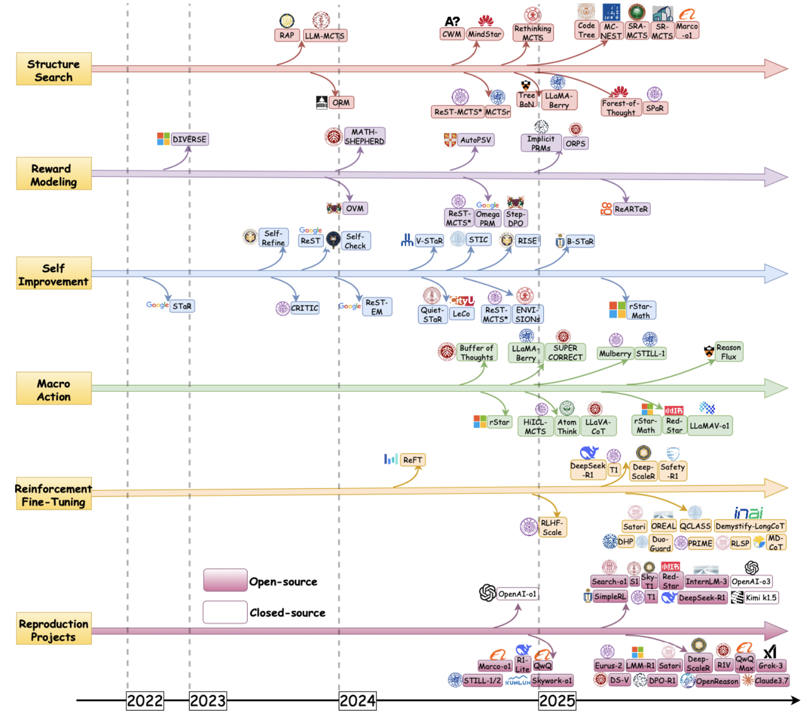

**一、 Prompt Engineering**

**一句话总结：**&#x4EC5;仅通过prompt最大化地激发出LLM的知识，从而获得更好的推理结果。

1. **COT**

**Chain-of-Thought（CoT）** 是一种让LLM通过分步推理生成答案的技术。其核心是模仿人类思考过程，将复杂问题拆解为多个中间步骤，逐步推导出最终答案，而非直接输出结果。

在实现上，可以分为zero shot（let's step by step）和few shot（给予多个无偏示例，展示如何分步解决问题）。

* **示例**

> **问题**：28名学生需要乘车，每辆车坐6人，至少需要几辆车？
>
> **CoT回答**：28 ÷ 6 = 4余4 → 需要4辆车坐满，剩余4人需1辆车 → 共5辆。

* **优缺点**

优点：

* 降低单步错误率，增强答案可靠性。

* 推理过程透明化，便于验证逻辑是否合理。

* CoT生成的推理链可作为高质量数据，用于微调模型。

缺点：

* 模型需要逐句输出推理过程，消耗更多计算资源和时间，影响实时性。

* 少样本CoT依赖提供的示例质量，若示例存在偏差或错误，模型可能模仿错误模式。

* 对无需复杂推理的问题（如事实问答），分步解释反而降低效率。

- **ToT**

**Tree of Thought（ToT）** 是一种更复杂的推理框架，通过**多路径探索和动态决策**提升LLM解决复杂问题的能力。其核心是将单一线性CoT扩展为树状结构，允许模型在推理过程中生成多个可能的路径，并基于反馈选择最优路径。

* **关键实现方式**

> **节点生成**：将问题分解为多个中间步骤（节点），每个节点代表一种可能的推理方向。
>
> **评估与剪枝**：对每个节点进行评分（如正确性、效率），淘汰低质量分支以节省资源。
>
> **深度优先/广度优先搜索**：按需选择搜索策略，平衡计算成本与答案质量。

* **SC**

**Self-Consistency（SC）** 是一种基于CoT的增强推理方法，旨在通过**生成多条推理路径并选择最一致的答案**，提升LLM在复杂任务中的准确性和鲁棒性。其核心思想是：**单一推理路径可能因随机性出错，但多条独立路径的统计共识更可能接近正确答案**。

* **核心实现**

> **生成多样性**：通过调整Temperature或随机种子，让模型对同一问题生成多条不同的推理路径（即不同的“思维链”）。
>
> **答案聚合**：从所有生成的路径中提取最终答案，通过**多数投票（Majority Voting）** 或 **加权评分** 选择出现频率最高的答案。

* **实现细节**

> **路径数量**：通常取5\~40条，需权衡成本与精度（N越大效果越好，但成本线性增长）。
>
> **温度参数**：适当调高温度（如0.7\~1.0）以增加生成多样性，但过高可能导致逻辑混乱。
>
> **答案对齐**：需设计规则处理格式差异（如“五辆”和“5”需归一化为同一答案）。

* **PAL**

**Program-Aided Language Models (PAL)** 是一种通过**生成可执行程序代码**来解决复杂问题的LLM增强方法。其核心思想是让模型将自然语言问题转化为代码（如Python），并通过执行代码获得精确答案，而非依赖模型直接计算或推理。这种方法尤其擅长数学、逻辑和符号推理任务，结合了语言模型的灵活性与代码执行的准确性。

* **核心实现**

> **代码即中间表示**：模型将问题拆解为可编程逻辑，生成代码片段（如计算、循环、条件判断）。
>
> **外部执行验证**：生成的代码由外部解释器（如Python解释器）执行，确保计算结果的数学正确性。

**二、 Training**

1. **SFT**

通过在特定的推理数据集上进行SFT，能让模型更精确地掌握某类推理任务。

常用的推理数据集包括：

> * GSM8K：中小学数学题集。
>
> * MATH：涵盖高中及竞赛数学题，考察较高难度的数学推理。
>
> * LogiQA：考察抽象的逻辑推理与阅读理解能力。
>
> * ARC：覆盖若干领域的常识与推断题。

如果数据质量高且包含足够多的推理示例，模型在该领域的推理能力会显著增强。不过，这也带来泛化性、跨领域迁移等问题。

* **RLHF**

- **核心流程**

> 1. 使用语言模型生成回答；
>
> 2. 人类标注者对回答进行评分或排序；
>
> 3. 训练一个Reward Model来模拟人类对回答优劣的判断；
>
> 4. 用 PPO 等强化学习算法，让模型在每次生成回答后，根据「奖励」进行参数更新，倾向输出更符合人类需求和逻辑的内容。

* **Critic Models**

有些研究会在主模型之外，再训练一个Critic Models来检查主模型的推理步骤，一旦发现不合理之处，就提出警示或要求修正，进而将这类评价结果反馈到训练或推断过程中，实现对主模型推理质量的改进。

* **核心思路**

> 有一个主模型（或者说「生成模型」）进行推理、回答。
>
> 有一个次级模型（或者说「批判模型」或「验证器」）对主模型的理由链、过程正确性或最终输出进行打分或判断。
>
> 以此打分或判断为依据来改进主模型：比如过滤掉错误推理，或通过强化学习的方式更新主模型参数等。
>
> 近期常见的 PRM/ORM 或类似的多级 reward 机制，通常就是「自动验证器与批判模型」在实践中的一个具体实现 。它们都为主模型生成的过程或结果提供一种「外部批判/评价」，从而帮助主模型提升推理一致性、正确性或安全性。

* **PRM（Process Reward Model）**

PRM 的目标是给「推理过程」给一个reward，比如给每一步的思路链、Chain-of-Thought 提供一个质量评价。

这意味着它更关注推理展开的细节：是否逻辑连贯、中间步骤有没有硬伤等。

这种过程级评估非常符合「批判模型」或「验证器」的角色——它不仅看最终答案对不对，更会审查一系列中间步骤的合理性。

* **ORM（Output Reward Model）**

ORM 则主要打分「最终输出」的质量。

与 PRM 相比，ORM 只看结果是否正确、合乎人类偏好或任务标准，而不深入逐步过程。

这种单一关注输出的评估模式，也可视为一种更「精简」的批判模型——它仍然在对主模型的推理结论进行审核。

另外，若结合外部符号推理器进行正式验证，还可以将数学推理或逻辑证明转化为可机读的公式化、形式化的形式，进而用定理证明器进行检验，保证结论正确。不过，目前公式化、形式化的验证仅能涵盖少数对逻辑一致性要求极高的任务，对日常复杂语言仍有难度。

# **10.4.47 如何计算 LLM 部署的TPS？**

> ### **如何计算TPS？**
>
> 部署 LLM 时，**每秒生成的token数量 TPS（Tokens Per Second）**&#x662F;衡量推理性能的重要指标：
>
> $\text{TPS}=\frac{生成的\text{token}总数}{总延迟时间（秒）}$
>
> 总延迟时间包括两个阶段：
>
> * **TTFT（Time To First Token）**：​从输入到生成第一个token的延迟时间，主要受prompt长度和模型结构影响，也就是在 **Prefilling 阶段**
>
> * **TPOT（Time Per Output Token）**：​生成每个后续token所需的平均时间，也就是在 **Decoding 阶段**
>
> **总延迟延迟可表示为&#x20;**$\text{Latency} = \text{TTFT} + \text{TPOT} \times \text{输出token数量}$
>
> 所&#x4EE5;**&#x20;TPS 可以表示为**​ $\text{TPS} = \frac{\text{输出token数量}}{\text{TTFT} + \text{TPOT} \times \text{输出token数量}}$
>
> ### **TPS估算方法**
>
> * **确定模型参数量**：**X B**
>
> * **计算Prefilling阶段的FLOPs：&#x20;**$\text{FLOPs}_{\text{prefill}}=\text{2×Batch Size×Prompt Length×模型参数量}$
>
> * **计算Decoding阶段的FLOPs**：​使用公式： $\text{FLOPs}_{\text{decoding}} = 2 \times \text{Batch\_size} \times \text{Completion Size} \times \text{模型参数量} $
>
>   > 矩阵-向量乘法对每个矩阵元素执行一次**乘加运算（2 FLOPs）**
>
> * **估算TTFT和TPOT**：​将上述 **FLOPs 除以GPU的实际算力（考虑利用率，比如 A100 312 TFLOPs，60%利用率，实际算力就是 312 x 60% = 187 TFLOPs）即可得到TTFT和TPOT**
>
> * **计算TPS**：​使用估算的TTFT和TPOT计算TPS
>
> 实际 FLOPs 计算还会受到模型具体实现、硬件架构（如GPU的并行计算能力）以及优化技术（如Flash Attention）的影响

# **10.4.48 业务中使用Reward Model评估会有哪些问题，如何优化？**

> 首先，无论是在基座团队还是在业务算法中，使用Reward Model评估数据质量或者作为自动化评估的一环已经是必然的事实（还在用纯指标或者人工评估的团队反思一下）。但是在实际的使用过程中会发现效果并不理想，特别是在非常复杂的业务问题上更是如此，今天就来总结一下直接使用Reward Model可能存在的问题及我们可以考虑从哪些角度进行优化。

**存在的问题**

**Reward hacking与泛化性**

> 当任务难度相对简单时，很容易出现**Reward hacking**现象。LLM下的Reward Model的本质上就是学习同一个state（即输入的prompt）下两个不同的action（即两个response）的偏好，倘若任务过于简单，很容易让强大的LLM学到一个shortcut pattern，譬如**response的长度、文本格式、特殊字符、输出风格（CoT）**&#x7B49;，在业务中可能对一些特定的话术风格天然给出更高的偏好。
>
> 究其原因，还是会受到训练数据的影响，学习有限的preferences，限制了其泛化性，同时产生了这些hacking。

**评估纬度多样化**

> 无论何种任务，要做到精细化评估，它的评估纬度都应该是多样的，比如**事实性、流畅性、安全性**等等。而有些评估能力点是非常依赖于原本的base model的相关能力的，因为我们知道Reward Model是在某一个base model上boostrap得到的，如果base model本身就对某一类事实存在幻觉或者偏见，那么基于它训练出来的Reward Model也不可避免存在相关的问题。
>
> 更重要的是，在业务场景中，话术回复的安全评估是非常重要的，比如在一个商家端场景中，用户可以询问某一件商品时可能无意会把其他商家的私密信息泄露出来，也就是我们所说的LLM越狱，如果没方面的有安全评估后果是很严重的，训练一个可用的安全Reward Model的难度也是很大的，因为，有的问题需要拒答，而有的问题则需要正面回答，如何基于RM的打分进行选择，是算法同学需要考虑的。

**评估结果可信度**

> 假设我们已经得到了一个非常强大的Reward Model，但是再怎么强的Reward Model，如何保证每一条数据的自动化评估结果是可信的。具体来说，在线上我们用RM对一条数据进行评估，我们怎么知道这一条数据的结果是可用的，因为这个评估结果对后续链路的影响可能是至关重要的，光靠一个简单的标量是毫无说服力的。

**解决方案**

**LLM-as-Judge**

> 这是23年底大家就开始研究的重要方向，本质上来说就是利用一个LLM去给另一个LLM的输出内容进行打分、排序和筛选，以解决传统评估方法难以捕捉微妙属性的难题。
>
> 现阶段的LLM-as-Judge已经非常广泛地被使用在业务和基座团低，一般有以下的做法（具体的研究工作可以参考商品笔记中的LLM-as-Judge部分）。
>
> * 对于输入数据而言：
>
>   * 点式（Point-wise）：评估单个样本的属性，例如判断一篇文章的质量。
>
>   * 对式/列表式（Pair/List-wise）：对多个样本进行比较，例如排序答案的优劣。
>
> * 对于输出形式而言：
>
>   * 评分（Score）：为每个样本分配一个分数。
>
>   * 排名（Ranking）：为样本生成排序。
>
>   * 选择（Selection）：选出最佳样本。
>
> * 对于Reward Model的选择而言：
>
>   * 选择一个强大的instruct model
>
>   * 训练一个专用的critique model

**GenRM**

> 由于简单使用LLM-as-a-Judge的方法有时在推理任务中表现也不佳。通过下一个token预测利用LLMs的文本生成能力来改进验证过程。
>
> 具体来说，模型的输入为 问题 + 解决方案（不知正确与否） ，输出为 COT（判断过程）+最终判断（yes or no）。其中会利用GenRM-COT，COT会有很多条，因为一条COT的路径有可能是错的，所以需要投票，也就是多条COT+判断的路径。而文中的超参数K（路径数目）设置在了32是最好的结果，说实话这个数目已经不是几台A100能够跑起来的了。那么有了多条路径，最终的分数如何计算呢？首先，模型会拿出最后的Yes、No的概率值，然后根据概率值，取得一个平均数，就是最终Yes、No的概率了。

**Pretrain RM from scratch**

> 开源的工作目前还没找到，就不细说了，属于商业机密，讲下大致的思路。
>
> 我们可以重新设计RM的训练范式，就如同消除NLP中的“任务形式”那样，消除 RM 的“打分标准”。在此基础上，探寻一个独立于“打分标准”、更为本质的loss目标函数，以此来进行模型扩展（scale）。当完成预训练后，RM 只需借助少量的“打分标准”案例，便能迅速迁移至新的打分任务中。&#x20;

# **10.4.49 大模型实践：通过self-improve技术优化LLM专项能力**

> **Self-Improve**技术指的是**让模型利用自身输出或环境反馈来迭代改进能力的方法**。这类技术一般不依赖大规模人工标注，而是通过模型自生成的数据或信号进行再训练或优化，从而提高模型性能和适应性。在这里我们不考虑简单的**ICL，**&#x56E0;为在实验上的效果并不理想。
>
> 它的本质是**给定一个预训练的大模型，通过大模型自己生成数据，并在自生成数据上进行fine-tune以提升模型的效果**。
>
> Self-Improve 技术对LLM非常重要，因为它能降低标注成本、提高模型的持续学习能力，并帮助模型在部署后不断调整以适应新的任务需求。

**Self-Supervised Self-Improvement**

> 自监督自提升方法主要**依赖模型自身生成的伪标注数据进行再训练，形成一个闭环**。典型思路包括“生成-自标注-再训练”的流程。代表性方法有：
>
> * **Self-Instruct**：让预训练模型自己生成指令-输入-输出三元组，然后过滤掉不合格的样本，最后用这些生成的数据对原模型进行微调。
>
> * **Self-Taught Reasoner (STaR)**：通过CoT推理增强模型。具体做法是：首先用少量示例提示模型生成带推理过程的答案，如果答案错误则重新生成直到正确；然后用所有正确答案的推理过程数据对模型进行微调，并重复这一过程。
>
> * **迭代自学习**：类似的还有一些工作让模型反复利用自生成数据进行强化学习或蒸馏训练。例如，可以让模型多次生成链式推理并投票（SC），或将生成的答案当作标签再次训练。通过这种方式，小模型也能得到类似大型模型的推理能力提升。

* **伪代码实现**

```python
from tqdm import tqdm

def generate_pseudo_data(seed_prompts, n_samples=1000):
    pseudo_data = []
    for prompt in tqdm(seed_prompts):
        for _ in range(n_samples // len(seed_prompts)):
            # 1) 模型生成“指令-输入-输出”三元组
            inst = call_llm(f"Generate an instruction, input, and output example based on: {prompt}")
            # 2) 简单过滤：如检查是否包含“INSTRUCTION”关键词
            if "INSTRUCTION" in inst:
                pseudo_data.append(parse_instruction(inst))
    return pseudo_data

def self_instruct_loop(model, seed_prompts, rounds=3):
    for r in range(rounds):
        pseudo = generate_pseudo_data(seed_prompts)
        # 3) 用伪标注数据微调
        model = finetune(model, pseudo)
    return model

# 使用示例
seed = ["翻译句子", "总结文章要点", "回答数学题"]
model = "base-llm"
model = self_instruct_loop(model, seed)
```

**Self-Reflection / Self-Debugging**

> 自反推理方法让模型像智能体一样，**通过“思考+行动/反馈”的循环来改进自身，而不直接修改参数或采用传统训练**。典型思路是让模型对任务的反馈信息进行语言化反思，并据此调整下一步行为。代表性方法有：
>
> * **ReAct（Reason + Act）**：ReAct方法要求LLM在生成答案的同时输出推理链条，并可以在推理过程中调用外部工具（如Wiki查询、执行命令等）来辅助决策。这样的交互式推理既包含模型内部的思考步骤，也包含向环境提问或检索知识的行动。例如，在HotpotQA问答任务中，ReAct通过调用维基百科API获取额外信息，有效克服了纯Chain-of-Thought推理时可能出现的谬误，并生成了更可靠的答案路径。
>
> * **Reflexion**：Shinn等人提出的Reflexion框架让语言代理在每次试验后对执行结果进行“反思”，并将这种反思以文本形式保存在记忆缓冲区中。具体来说，Reflexion代理会对任务反馈信号进行语言化处理，然后将相关的思考内容存入内存，使模型在后续尝试中参考这些经验。
>
> 通过此类方法，LLM能在不改变底层权重的前提下，模拟人类思考和检验过程，快速从经验中学习并改进表现。

* **伪代码实现**

```python
def react_agent(prompt):
    reasoning = []
    current = prompt
    while True:
        # 模型同时输出思考和行动指令
        thought, action = call_llm(model, current, return_thought_action=True)
        reasoning.append(thought)
        if action.startswith("SEARCH"):
            query = action.replace("SEARCH:", "").strip()
            result = wiki_search(query)
            current = f"Use search result: {result}"
        else:
            # 若无更多行动，直接输出答案
            answer = call_llm(model, f"{thought}\nAnswer:")
            return answer, reasoning

# 使用示例
ans, trace = react_agent("爱因斯坦在哪一年获得诺贝尔奖？")
print("Answer:", ans)
print("Trace:", trace)

```

```python
memory = []

def reflexion_agent(task):
    for step in range(3):
        # 执行一步并得到反馈（True/False）
        result = call_llm(model, f"{task}\nMemory:{memory}")
        success = evaluate_result(result)
        # 生成语言化反思
        reflection = call_llm(model, f"Result: {result}\nWas it correct? Why or why not?")
        memory.append(reflection)
        if success:
            return result, memory
    return f"Failed after {step+1} attempts", memory

# 使用示例
res, mem = reflexion_agent("写一个函数，判断素数")
print(res)
print("Reflections:", mem)
```

**Self-Evaluation and Self-Correction**

> **自评估自修正方法的核心在于让模型像人一样回顾自己的“思路”或依据一定规则评判自己的输出，从而形成闭环的自我修正能力。**&#x8FD9;通常涉及让模型生成多个推理路径、重新审视答案或者利用内置规则进行对比判断。典型方法和思路包括：
>
> * **链式推理迭代**：Iter-CoT（Iterative Chain-of-Thought）方法首先注意到模型生成的推理示例往往包含错误，并提出一个迭代引导策略。Iter-CoT让模型在推理过程中反复自检，自动纠正之前的错误假设。
>
> * **多路径推理（Divergent CoT）**：要求模型在一次回答中生成多条相互独立的思路路径，然后比较它们以得出最终答案。通过对比多个答案路径，模型能够识别并修正其中的偏差，从而实现自我纠错。作者发现，对小型模型进行这种多路径推理的微调后，其性能在多种任务上超过了仅依赖单一路径的基线。
>
> * **自奖励自修正**：提出了针对数学推理的自奖励自修正框架。该方法让模型在推理时同时生成一个**自我评价**分数，用以衡量答案正确性，并在必要时迭代地修改答案。通过先用序列拒绝采样生成包含自我奖励和自修正的推理数据，再用这些数据微调模型，最后结合基于规则的强化学习进一步提升，模型在无需外部评价的情况下学会了自主发现并修正错误。
>
> * **Constitutional AI（宪法式AI）**：这是Anthropic提出的一种自评估方法。首先预先制定一系列自然语言的原则（即“宪法”），例如“哪个回答更符合伦理和安全”。在训练时，模型在给定回答对后，根据宪法原则自行选择哪个回答更良善（无需人工参与），并据此构建偏好标签。然后模型用这些自生成的评价来进行强化学习微调，从而学会主动批判并修正不良答案。
>
> * **链式思维自检**：还有一些更简单的自纠错方案，例如在生成答案后让模型自问“我的回答有误吗？如果有，请修正”，或者生成辅助性的自检问题。这种“自问自答”策略在多种对话系统和QA任务中被探索过，效果表明模型往往能够纠正部分明显的错误。

* **伪代码实现**

```python
def self_correct(prompt, threshold=0.7):
    # 一次生成多个候选
    candidates = [call_llm(model, prompt, return_score=True) for _ in range(5)]
    # candidates = [(answer, score), ...]
    best = max(candidates, key=lambda x: x[1])
    if best[1] < threshold:
        # 若最高分低，则附带自评反馈让模型重新生成
        feedback = call_llm(model, f"I gave a low score ({best[1]}) for: {best[0]}. Please improve it.")
        return feedback
    return best[0]

# 示例
print(self_correct("计算 47 的阶乘，有没有错误？"))
```

# **10.4.50 PPO到底是on-policy还是off-policy？**

先说结论，**PPO 是 on-policy 算法，但是带有部分 off-policy 的性质**，下图为OpenAI Spinning Up给出的定义


> 首先先对 on-policy 和 off-policy 的定义做一下解释：
>
> * **On-policy：**&#x540C;策略，即跟环境互动**采样的策略和要优化的策略是同一个策略**
>
> * **Off-policy：**&#x5F02;策略，即跟环境互动**采样的策略和要优化的策略不是同一个策略**
>
> **PPO 严格使用 $\pi_{\theta_k}$采样的数据来更新得到 $\pi_{\theta_{k+1}}$，即每次采样之后 policy 都会被更新，然后用新的策略再去采样，所以是 on-policy的。**&#x4F46;是 PPO 在更新策略的时候，会对同一批数据进行复用，即采样之后，对这一批数据进行多次更新，会产生中间策略，除开第一次更新是 on-policy，剩下几次采样和更新策略不一致理论上应该是 off-policy？但是 PPO 在这里做了重要性采样，目的就是用采样策略去估计目标策略，**做了重要性采样近似，可以理解为更新的样本就是当前的策略采样得来的**
>
> 当然上述结论成立的前提是采样策略和目标策略差距不大，所以 PPO 使用 clip 处理限制每一次更新的时候策略更新的幅度
>
> 另外，一般 **off-policy 强调的是任意采样策略的数据都可以用来更新当前的目标策略**，即 replay buffer中的数据可以一直保留，而 PPO 相当于每迭代一次策略就把 replay buffer重新换掉
>
> 还有很多解释的角度，也可以理解为 PPO 不是纯的 on-policy，带有部分 off-policy 性质，策略更新的epoch数设置越高，样本重用越多，off 程度越高

# **10.4.51 DPO中有没有KL散度？**

> 首先DPO是从**带行为约束的强化学习目标（当前策略不要太远离参考策略）出发进行推导的，即最大化奖励的期望减去当前策略和行为/参考策略的KL散度**，并根据KL散度的定义，将其**提取一个$y \sim \pi$就能到期望括号里面**，变成下式第二行：
>
> $
> \max _\pi \mathbb{E}_{x \sim \mathcal{D}, y \sim \pi} [r(x, y)] - \beta D_{\text{KL}} [\pi(y|x) \| \pi_{\text{ref}}(y|x)]\\ = \max _\pi \mathbb{E}_{x \sim \mathcal{D}} \mathbb{E}_{y \sim \pi(y|x)} \left[ r(x, y) - \beta \log \frac{\pi(y|x)}{\pi_{\text{ref}}(y|x)} \right] \\$
>
> **这里的 $\beta \log \frac{\pi(y|x)}{\pi_{\text{ref}}(y|x)} $就理解为KL项**
>
> 最后经过一系列推导得到DPO的最终loss：
>
> $\mathcal{L}_{\text{DPO}}(\pi_{\theta}, \pi_{\text{ref}}) = - \mathbb{E}_{(x, y_w, y_l) \sim \mathcal{D}} \left[ \log \sigma \left( \beta \log \frac{\pi_{\theta}(y_w | x)}{\pi_{\text{ref}}(y_w | x)} - \beta \log \frac{\pi_{\theta}(y_l | x)}{\pi_{\text{ref}}(y_l | x)} \right) \right]$
>
> 其中 $\sigma$为 sigmoid 函数

# **10.4.52 P是双峰分布，Q是正态分布，KL(P,Q)和KL(Q,P)有什么区别**

> 假设 P是双峰分布， Q 是正态分布
>
> $KL(P|| Q):$
>
> $KL(Q|| P):$
>
> **总结规律：**
>
> * 一般而言， $KL(P || Q)$ 通常大于 $ KL(Q || P)$。在双峰分布和单峰正态分布的情况下，这个规律特别明显，因为单峰分布无法很好的捕捉双峰分布的复杂性。
>
> * $KL(P || Q) $更强调用简单模型拟合复杂模型时的信息损失，而 $ KL(Q || P)$则是用复杂模型在简单模型的描述下剩余的信息损失。

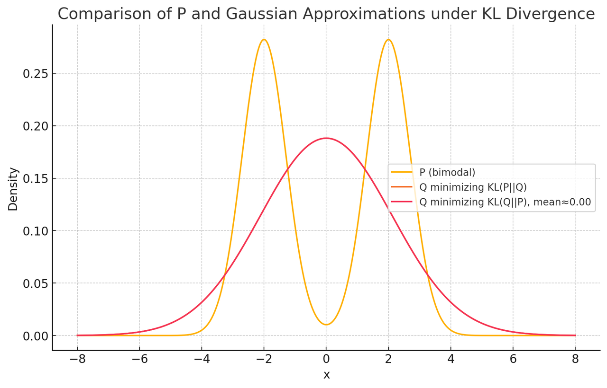

> 黄色实线为目标双峰分布  $ \mathcal{N}(-2,0.5)+0.5\,\mathcal{N}(2,0.5)$
>
> 橙色曲线对应最小化 $\mathrm{KL}(P\|Q)$时的高斯近似 $Q(x)=\mathcal{N}(0,\;4.5)$，它“覆盖”住了 P 的两个峰。
>
> 红色曲线对应最小化 $\mathrm{KL}(Q\|P)$ 时得到的高斯近似，同样方差但均值落在中间位置（图中约为 0），为了避免在 PPP 的低密度区（双峰中间）放置过多质量，它“聚焦”于中央——如果优化空间更小或有轻微偏置，可聚焦到某一峰。

# **10.4.53 面试官：MoE模型的专家个数是如何决定的**

> ### **先说结论**：
>
> * 专家数目越大可提升模型能力，但**超出一定阈值后收益递减且可能引入过拟合和负载问题**，需要通过实验验证找到最佳平衡点。
>
> * expert的不是越多越好，训练完成后，各个expert的功能是分化了的，**每个expert只适用于部分数据，而对其他数据可能形成干扰，**&#x9700;要被抑制掉。
>
> ### **理论标准：**
>
> 1. **专家总数N直接决定MoE层的总参数量**（≈N×单专家参数量）。经典理论表明，含有足够expert的MoE模型在含有Softmax门控和线性专家时可实现通用函数逼近。
>
> 2. **模型质量随训练数据量和参数规模呈幂律增长**。当训练数据量极大时，需要更高的模型容量（更多expert）才能避免过拟合并充分利用数据。
>
> 3. **采用Top-k稀疏门控**，每个token仅激&#x6D3B;**`k`**&#x4E2A;专家，使得计算成本近似恒定。
>
> 4. **每个token的信息只能通过选定专家通道传递**。常引入辅助损失等技术来鼓励token均匀分布。
>
> ### **数量是否越多越好：**
>
> * **存在容量瓶颈效果。**&#x8D85;出瓶颈后，新增expert带来的性能提升会逐渐减弱。
>
> * expert数过多意味着模型容量远大于数据所需，容易**在部分expert上发生过拟合**。
>
> * 过多expert可能**加剧部分“热门”expert被过度激活**，而其他expert接近闲置。
>
> * 更多expert在模型并行时需要**跨更多设备分散存储和通信**，增加了分布式训练和推理的实现复杂度。
>
> ### **Expert的作用：**
>
> * 显著提升训练效率
>
> * 推理阶段实际计算量接近等效规模的稠密模型
>
> * 提升多任务或多领域泛化能力
>
> ### 经典MoE模型中的expert设置：
>
> * **GShard：**&#x54;ransformer中**每隔一层**加入Top-2 MoE层，在实验中尝试了从128到2048不同的专家数量。
>
> * **Qwen1.5-MoE：**&#x91C7;用Top-8路由、64个专家，每token选择8个专家参与计算。
>
> * **Mixtral ：**&#x6BCF;层MoE模块配置8个expert，每个token被路由至2个专家。
>
> * **DeepSeek-MoE：**&#x5728;每层引入MoE模块，共包含16个专家，每个token通过Top-2路由激活2个expert。
>
> * **DeepSeek-V3：**&#x6BCF;个 MoE 层包含 256 个路由专家 和 1 个共享专家，每个 token 激活 8 个expert。

# **10.4.54 DPO中训练的时候为什么会出现chosen概率和reject概率都下降的情况？怎样解决？**

> **为什么会出现？**
>
> 回顾 DPO 的 loss 公式，可以看到下面的式子**其实是在优化chosen和reject之间的差距，差距只要在增大，那么优化方向就是对的，所以可能会出现chosen和reject概率都下降的情况，只要reject概率下降的幅度比chosen大就行**。这种现象尤其是在DPO数据的**chosen和reject编辑距离非常小的时候出现，即二者有大量重复相似的token**
>
> &#x20;$\mathcal{L}_{\text{DPO}}(\pi_{\theta}, \pi_{\text{ref}}) = - \mathbb{E}_{(x, y_w, y_l) \sim \mathcal{D}} \left[ \log \sigma \left( \beta \log \frac{\pi_{\theta}(y_w | x)}{\pi_{\text{ref}}(y_w | x)} - \beta \log \frac{\pi_{\theta}(y_l | x)}{\pi_{\text{ref}}(y_l | x)} \right) \right]$
>
> **如何解决？**
>
> 1. 首先**检查自己的数据**，看看是不是有大量的前置prompt都是一样的，尽量让chosen和reject有所差别。
>
> 2. 如果无法避免的要引入编辑距离很小的chosen和reject偏好对，那么可以**尝试使用正则，或者额外的loss**：
>
>    1. **DPOP 的正则化**，sigmoid里面加了一个chosen回答的似然，强行提高chosen概率 $\mathcal{L}_{\mathrm{DPOP}}(\pi_{\theta}; \pi_{\mathrm{ref}}) = -\mathbb{E}_{(x, y_w, y_l) \sim D} \left[
>
>       \log \sigma \Bigg( \beta \Bigg( \log \frac{\pi_{\theta}(y_w | x)}{\pi_{\mathrm{ref}}(y_w | x)} - \log \frac{\pi_{\theta}(y_l | x)}{\pi_{\mathrm{ref}}(y_l | x)} \\ - \lambda \cdot \max \left( 0, \log \frac{\pi_{\mathrm{ref}}(y_w | x)}{\pi_{\theta}(y_w | x)} \right) \Bigg) \Bigg)
>       \right]$
>
>    2. llama3 技术报告中提到的，给DPOloss后面**加入一个chosen回答的NLL loss，或者说是SFT loss**
>
>    3. 对于chosen和reject**使用不同的$\beta$值来缩放**他们的大小

# **10.4.55 在训练垂域大模型时，SFT是否能注入知识？**

> **结论**：
>
> 1. SFT能有效注入新知识，尤其是在处理模型知识截止日期后的信息时
>
> 2. 通过对特定领域施加偏向有效刷新模型记忆，对于模型在pretrain可能遇到但未能保留或充分强调的知识特别有用
>
> 3. 难以高效学习和内化全新的事实信息，且训练时表现出固有的不稳定性
>
> 4. 可以增强LLM在实际应用中实现更高准确性，使LLMs能够学习并有效利用下游领域知识来回答各种问题

**最新研究证据**

> SFT可以提高模型性能，使响应不仅事实准确，而且针对给定任务结构合理 **\[1]**。一个显著的例子是SciLitLLM，它整合了CPT和SFT。这种混合策略成功地注入了科学领域知识，同时增强了科学文献理解的指令遵循能力。SciLitLLM已被证明在这一专业领域超越了领先的开源LLMs **\[2]**。KnowTuning方法，一种知识感知SFT形式，已通过实验证实可显著提高LLMs的知识感知能力，从而在通用和医学问答数据集中提供更完整、真实和逻辑的答案 **\[3]**。
>
> SciLitLLM项目明确采用CPT和SFT的混合策略，以同时注入科学领域知识并增强领域特定任务的指令遵循能力” \[2]。它还指出“仅靠指令微调不足以赋予模型全面的科学知识” 。这表明，虽然SFT对于知识的任务特定应用和指令遵循非常有效，但其注入全面、基础领域知识的能力在建立于更广泛的CPT知识库之上时会显著增强。

> LLMs在进行无监督微调时，通常难以学习全新的事实信息 **\[4]**。标准的无监督微调甚至可能在尝试注入新事实时导致性能下降，如果缺乏足够的上下文或重复。一个关键发现是，在SFT期间，将同一新事实的多种变体暴露给LLMs可以显著缓解这一困难并提高性能。这表明仅仅记忆句子并不等同于理解；相反，以多种形式重复对于模型理解和从有限数据中概括新知识至关重要。
>
> SFT在“全新事实信息”方面存在困难，但从“同一事实的多种变体”中受益匪浅。准确性是“释义数量的单调递增函数”。这意味着SFT学习新事实知识的机制并非关于单实例记忆。相反，它似乎需要足够的冗余和多样化的语境化，才能在其参数空间内构建新的信息的稳健、泛化表示。这对于“知识注入”来说是一个关键的细微差别。这意味着对于事实知识，SFT在通过多样化暴露进行呈现时，更有效地“巩固”和“整合”信息，而不是快速获取孤立的新事实。这凸显了在使SFT成为注入新的、稳定事实知识的可行方法方面，复杂数据增强策略的至关重要的作用，强调了数据工程作为知识注入过程的关键组成部分.

**参考来源：**

\[1] What is supervised fine-tuning in LLMs? Unveiling the process

\[2] SciLitLLM: How to Adapt LLMs for Scientific Literature Understanding

\[3] KnowTuning: Knowledge-aware Fine-tuning for Large Language Models

\[4] Fine-Tuning or Retrieval? Comparing Knowledge Injection in LLMs

# 10.4.56 SFT在垂域大模型训练的必要性

> ### 知识注入的定义
>
> 为通过整合外部或嵌入的领域专业知识来增强LLMs的过程，这一过程是为了弥补通用语言理解与专业任务严格要求之间的差距。
>
> 对知识注入的定义和LLM能力的理解，涵盖了“推理、知识表示和决策”等更深层次的能力。SFT被应用于比如“摘要和思维链推理、编码和编程任务” 以及“医疗诊断” 等任务。这些任务不仅仅是检索事实；它们需要理解、综合、逻辑推理和问题解决。如果知识注入仅仅是添加事实，那么方法和评估指标将主要关注事实准确性。然而，对“推理深度、创造力、清晰度和量化”评估以及提高“逻辑性”的强调，表明了更深层次的目标。这表明，“知识注入”在LLMs的语境中，不仅仅是扩展模型的内部事实数据库，而是从根本上塑造其在特定领域内的认知过程和行为模式。其目标是使模型能够像领域专家一样“思考”和“行动”，而不仅仅是“知道”像领域专家一样。
>
> ### 增强的知识类型
>
> * **事实知识：** 提高了响应的事实准确性。例如，在医疗保健领域，它允许LLMs理解和利用特定的医学术语、诊断和治疗方案。  &#x20;
>
> * **语境理解：** 通过对领域特定数据集的微调，模型对领域的复杂性有了更深入的理解，从而提高了语境相关性和整体领域理解。  &#x20;
>
> * **推理能力：** 有助于增强LLMs在专业领域内的推理、知识表示和决策能力。此外，SFT可以促进CoT推理能力的迁移，这需要领域特定表示才能有效应用。  &#x20;
>
> * **指令遵循：** 的核心优势在于其能够赋予LLMs强大的指令遵循能力，这对于指导模型在领域特定任务中的行为至关重要

# **10.4.57 手撕LoRA**

手撕一个应用于 Linear 层的 LoRA

```python
class LoRALayer(torch.nn.Module):
    def __init__(self, in_dim, out_dim, rank, alpha, dropout=0.0):
        super().__init__()
        self.rank = rank
         # 可训练的低秩矩阵
        self.lora_A = nn.Linear(in_features, rank, bias=False)
        self.lora_B = nn.Linear(rank, out_features, bias=False)

        # 初始化
        nn.init.kaiming_uniform_(self.lora_A.weight, a=math.sqrt(5))
        nn.init.zeros_(self.lora_B.weight)
        self.alpha = alpha
        
        self.scaling = alpha / r
        self.dropout = nn.Dropout(dropout)

    def forward(self, x):
        x = self.dropout(self.lora_B(self.lora_A(x))) * self.scaling
        return x

class LinearLoRA(torch.nn.Module):
    def __init__(self, linear, rank, alpha):
        super().__init__()
        self.linear = linear
        self.linear.weight.requires_grad = False  # 冻结原始权重
        self.lora = LoRALayer(
            linear.in_features, linear.out_features, rank, alpha
        )

    def forward(self, x):
        return self.linear(x) + self.lora(x)

# 示例：将模型中的 Linear 全部换成 LoRA
def replace_linear_with_lora(model, r, alpha, dropout=0.0):
    for name, module in model.named_children():
        if isinstance(module, nn.Linear):
            in_features = module.in_features
            out_features = module.out_features
            lora_module = LoRALinear(in_features, out_features, r, alpha, dropout)
            setattr(model, name, lora_module)
        else:
            replace_linear_with_lora(module, r, alpha, dropout)
```

# **10.4.58 LoRA的初始化有什么缺陷，如何解决？**

> #### **初始化方式：**
>
> LoRA 在实现低秩适配时，通常采用将增量矩阵 $  ΔW=BA  $ 初始化为零，以确保模型从预训练权重平滑过渡。其中，标准做法是在代码实现中将矩阵 $B$全部置零，而矩阵 $A$采用类似 `Kaiming` 初始化的随机分布。
>
> #### **为什么可以这么初始化**：
>
> 首先我们来看 $B$的梯度： $\frac{\partial\mathcal{L}}{\partial B}=A^T\cdot\frac{\partial\mathcal{L}}{\partial\Delta W}$
>
> **可以看到，当B初始化为0，只要A不是全零，B的梯度依然可以非零。**
>
> 那么 $A$能不能也初始化为0呢？ 答案是不能。 $A$的梯度： $\frac{\partial\mathcal{L}}{\partial A}=\frac{\partial\mathcal{L}}{\partial\Delta W}\cdot B^T$，**如果 $A$初始化为0且没有微小扰动，那么 $ΔW$在整个训练初期都为0**， $A$无法完成更新操作。
>
> #### **有什么缺陷：**
>
> 虽然这种初始化让适配前的输出与原模型一致，但其初始状态完全依赖于随机噪声和零矩阵，导致训练过程对初始化超参数极为敏感，难以保证收敛到最优的低秩解\[1]。
>
> 虽然上述提到了这样的非对称初始化看似是完美的，但是当 $B$ 从零开始时，梯度传播路径出现不对称：**只有矩阵 $A$ 在初始阶段接收到梯度信号，而  $B$ 由于全零状态梯度近似为零，从而陷入“梯度停滞”**——直到  $A$  的参数漂移到足够大，才会带动  $B$ 发生更新。特别是在短周期或小规模数据集上，这种结构性的梯度失衡会显著拖慢适配速度，甚至导致局部收敛性能不佳\[2]。
>
> 此外，纯随机初始化往往使得 LoRA 收敛到“随机低秩”解，而非任务或数据分布所要求的“最佳低秩”解。近期的理论工作表明，**在未掌握目标权重分布先验的情况下，随机化策略会使 LoRA 的初始方向与潜在最优子空间存在较大偏差，从而加大后续微调的难度和不确定性**\[3]。
>
> **参考**：
>
> \[1]《The Impact of Initialization on LoRA Finetuning Dynamics》
>
> \[2]《ALLoRA: Adaptive Learning Rate Mitigates LoRA Fatal Flaws》
>
> \[3]《HRP: High-Rank Preheating for Superior LoRA Initialization》
>
> #### **如何解决：**
>
> 1. 苏神之前提到过这个问题，解决办法也很简单， $A$和 $B$都用非零初始化，但是将预训练权重减去 $A_0B_0$即可，等价于将W初始化为： $W=W_0-A_0B_0+AB$
>
> 2. 将 $A$ 和 $B$ 同时采样为正交矩阵，并在随后按  $\frac{\alpha}{r} $进行比例缩放，从而保证在训练初期两部分参数都能获得有效梯度信号，避免了单侧更新滞后的问题。
>
> **参考：**
>
> \[1]《OrthLoRA: Orthogonally Initialized Low-Rank Adaptation for Stable Convergence》
>
> \[2]《梯度视角下的LoRA：简介、分析、猜测及推广》-科学空间站

# 10.4.59 function-call数据构造与训练流程

> #### **定义**
>
> `Function Call`指LLM能够根据自然语言指令，**自动识别需要调用的函数、生成对应参数，并输出标准结构化调用格式**（如JSON、Python函数调用语句等）。此能力通常包含：**函数选择、参数构造和结构化输出生成。**

> #### **数据构造**
>
> **第一步**：定义Function Schema。即定义一组函数原型，包括**函数名、参数名称、参数类型、参数**说明等，形成函数的元数据，如：

```json
{
  "name": "get_weather",
  "description": "Get weather information for a city.",
  "parameters": {
    "type": "object",
    "properties": {
      "city": {"type": "string", "description": "City name"},
      "unit": {"type": "string", "enum": ["Celsius", "Fahrenheit"]}
    },
    "required": ["city"]
  }
}

```

> **第二步**：生成或采集自然语言输入。通过人工标注、半数据合成、数据飞轮的方式构造。
>
> **数据合成：**
>
> 1. 使用模板构造 ("What is the weather in {city} in {unit}?")
>
> 2. 使用大模型反向生成自然语言（如通过反向prompt让模型从调用生成意图）
>
> 3. 基于多轮对话语料，将用户意图抽取为函数调用请求。例如：
>
> * 将“我想预订一家明天下午在巴黎的中餐馆”转换为 `book_restaurant(city="Paris", cuisine="Chinese", time="tomorrow afternoon")`；
>
> * 此类方法常与对话状态追踪结合使用，提取 slot 并匹配到函数定义。
>
> **数据飞轮：**
>
> 从系统日志中提取历史调用记录，配合用户查询自动生成`自然语言-调用`对。

> **第三步**：构造调用标签，为每个自然语言输入生成正确的调用格式，如：

```json
{
  "function_call": {
    "name": "get_weather",
    "arguments": {
      "city": "Beijing",
      "unit": "Celsius"
    }
  }
}
```

> #### **训练**
>
> **输入输出格式定义**：作为监督信号参与训练，使模型能将自然语言映射到结构化调用。

```json
{
"src": "xxxxxxx",
"tgt": {
  "function_call": {
    "name": "xxxx",
    "arguments": {
      "city": "xxxx",
      "unit": "xxxx"
    }
  }
}
}
```

> 目前主流的做法是尝试结合RL训练，下面是RL训练数据的示例：

````json
{
        "instruction": "You are a helpful multi-turn dialogue assistant capable of leveraging tool calls to solve user tasks and provide structured chat responses.\n\n**Available Tools**\nIn your response, you can use the following tools:\n1. Name: Nitrous Ozone Levels API\nDescription: Retrieves nitrous oxide levels in the atmosphere, providing current and historical data.\nParameters: {\"nitrous\": {\"description\": \"Optional filter for nitrous oxide levels (e.g., 'current', 'historical', or a specific value)\", \"type\": \"string\", \"default\": \"\"}}\n2. Name: Country Information API\nDescription: Retrieve information about countries, including their capitals, currencies, and flags.\nParameters: {}\n3. Name: M4.5+ Earthquakes, Past 7 Days\nDescription: Retrieve a list of earthquakes with a magnitude of 4.5 or greater that have occurred in the past 7 days.\nParameters: {\"start_string\": {\"description\": \"The start string of the 7-day period (in ISO format, e.g., 2023-03-01T00:00:00.000Z)\", \"type\": \"string\", \"default\": \"\"}, \"end_string\": {\"description\": \"The end string of the 7-day period (in ISO format, e.g., 2023-03-08T00:00:00.000Z)\", \"type\": \"string\", \"default\": \"\"}}\n\n**Steps for Each Turn**\n1. **Think:** Recall relevant context and analyze the current user goal.\n2. **Decide on Tool Usage:** If a tool is needed, specify the tool and its parameters.\n3. **Respond Appropriately:** If a response is needed, generate one while maintaining consistency across user queries.\n\n**Output Format**\n```plaintext\n<think> Your thoughts and reasoning </think>\n<tool_call>\n{\"name\": \"Tool name\", \"parameters\": {\"Parameter name\": \"Parameter content\", \"... ...\": \"... ...\"}}\n{\"name\": \"... ...\", \"parameters\": {\"... ...\": \"... ...\", \"... ...\": \"... ...\"}}\n...\n</tool_call>\n<response> AI's final response </response>\n```\n\n**Important Notes**\n1. You must always include the `<think>` field to outline your reasoning. Provide at least one of `<tool_call>` or `<response>`. Decide whether to use `<tool_call>` (possibly multiple times), `<response>`, or both.\n2. You can invoke multiple tool calls simultaneously in the `<tool_call>` fields. Each tool call should be a JSON object with a \"name\" field and an \"parameters\" field containing a dictionary of parameters. If no parameters are needed, leave the \"parameters\" field an empty dictionary.\n3. Refer to the previous dialogue records in the history, including the user's queries, previous `<tool_call>`, `<response>`, and any tool feedback noted as `<obs>` (if exists).",
        "input": "**Dialogue Records History**\n<user> Could you get the current levels of nitrous oxide in the atmosphere for me? </user>\n\n<think> I should use the appropriate tool with proper parameters to respond to the user's need. </think>\n<tool_call>\n{\"name\": \"Nitrous Ozone Levels API\", \"parameters\": {\"nitrous\": \"current\"}}\n</tool_call>\n<obs> [{\"name\": \"Nitrous Ozone Levels API\", \"results\": {\"nitrousOxideLevels\": {\"currentLevel\": \"330 ppb\", \"dateMeasured\": \"2020-10-09T06:00:00.000Z\", \"location\": \"Global\"}, \"dataSources\": [\"NASA Ozone Monitoring Instrument\", \"NOAA Global Monitoring Laboratory\"], \"error\": null}}] </obs>\n\n<think> I should directly respond to the user's need. </think>\n<response> The current nitrous oxide levels in the atmosphere are as follows:\n- **Current Level**: 330 parts per billion (ppb)\n- **Date Measured**: 2020-10-09T06:00:00.000Z\n- **Location**: Global\n### Data Sources\n- NASA Ozone Monitoring Instrument\n- NOAA Global Monitoring Laboratory </response>\n\n<user> Thank you for the information. It's alarming to see such high levels of nitrous oxide. Could you explain the impact of nitrous oxide on the environment and human health in more detail? </user>\n\n<think> I should directly respond to the user's need. </think>\n<response> Certainly. Nitrous oxide, often known as laughing gas, has several significant impacts on both the environment and human health.\n**Environmental Impact:**\n1. **Greenhouse Gas**: Nitrous oxide is over 300 times more potent as a greenhouse gas than carbon dioxide. It can trap significant amounts of heat in the atmosphere, thereby contributing to global warming and climate change.\n2. **Ozone Layer Depletion**: Nitrous oxide is also the most significant ozone-depleting substance being emitted today. It breaks down and destroys the ozone layer, increasing the Earth's exposure to harmful ultraviolet (UV) radiation.\n**Impact on Human Health:**\n1. **Respiratory Issues**: Inhalation of nitrous oxide can lead to oxygen deprivation, which can affect both the brain and the heart. Reduced oxygen can lead to an array of respiratory issues, including shortness of breath, wheezing, and potential long-term harm to overall lung health.\n2. **Neurological Issues**: Nitrous oxide is known to affect the nervous system. It can cause harmful neurological impacts, including dizziness, loss of motor control, and in severe cases, a risk of seizures or coma.\n3. **Vitamin B12 Deficiency**: Prolonged exposure to or inhalation of nitrous oxide can inhibit the body's ability to use vitamin B12, leading to vitamin B12 deficiency. This can result in anemia and potential neurological damage.\nAlways be aware of your environment and attempt to reduce nitrous oxide emissions where possible. This can include practices like reducing motor vehicle emissions and being mindful of agricultural practices. </response>\n\n<user> Thank you for the detailed explanation. It's quite concerning how much nitrous oxide affects both our planet and our health. Could you also provide some information on which countries are the largest emitters of nitrous oxide? </user>",
        "output": "<think> I should directly respond to the user's need. </think>\n<response> While I'm not able to pull up real-time data here, some of the largest contributors to nitrous oxide emissions at a country level, according to the most recent assessments, are:\n1. **China:** As an agricultural powerhouse and the world's most populous country, China contributes a substantial portion of the world's nitrous oxide, mainly from agricultural and industrial activities.\n2. **United States:** The U.S. is another significant contributor due to its industrial activities, energy production, and agriculture.\n3. **India:** Like China, India's substantial agricultural sector contributes heavily to its nitrous oxide emissions.\nPlease note that this information might vary year by year and depends on each country's industrial, agricultural, and environmental policies. For the most accurate and up-to-date information, it is recommended to refer to the latest environment reports or data available from environmental protection agencies or international climate organizations. </response>"
    }
````

# 10.4.60 大模型经过dpo训练输出长度会怎么变化？如何解决这个问题？

> DPO的本质还是用于人类偏好对齐的大模型微调技术，在DPO训练时经常会遇到随着训练的进行大模型的输出会变得越来越长，且多轮DPO的话会让模型输出越来越长。下面分析具体的原因及解决方案。
>
> #### **原因分析**
>
> 1. DPO数据的chosen和rejected数据一般来源于reward model或critic model打分，由于训练任务的关系它们存在长度hacking，更加倾向于给更长的答案一个更高的分数。
>
> 2. 另外，DPO的算法本身也存在对response长度的依赖，**即Response长度对似然概率的影响极大**，chosen和rejected之间的长度差异可能会导致reward被高估或低估。虽然DPO未显式优化长度，但这种调整在自回归生成中逐步累积，导致长度变化。一旦模型因偏好数据倾向于生成更长文本，自回归生成时会不断选择高概率的延续词。
>
> 3. 短响应通常在关键信息结束后直接生成\<EOS>。若负例多为短文本，DPO 会压低\<EOS>的概率，因为模型会认为 “生成\<EOS>可能导致非偏好响应”。模型因此更倾向于继续生成而非终止。
>
> #### **解决方案**
>
> **数据层面**
>
> 1. 确保训练数据中正负例的长度分布均衡，避免模型因数据偏差而过度学习长度特征。
>
> 2. 控制数据的最大输出长度，剔除输出长度过长的数据，参考 GLM 4-9B。
>
> **训练层面**
>
> 1. 加入SFTloss
>
> 2. **将更长的答案拆成“公共长度部分”和“额外部分”**，并进一步将后者拆分为真实偏好和冗余偏好，并对其中的冗余部分进行降权操作。
>
> **算法层面**
>
> 1. **引入长度归一化项**，将正负例的对数概率差除以各自长度，避免模型仅通过增加或减少长度来优化损失。
>
> 2. 在模型输入中**显式加入长度控制标记**，如在训练时将目标长度作为附加条件输入模型，在推理时用户可通过指定长度标记精确控制输出。
>
>

# 10.4.61 transformer中MLP的作用

> #### **定义**
>
> **`MLP`**&#x901A;常位于自注意力层之后，是一个两层的全连接层，第一层的激活函数为 **`ReLU`**，第二层不使用激活函数，对应的公式如下：
>
> $MLP = Linear(ReLU(Linear(x)))$
>
> #### **作用**
>
> **《Attention is not all you need: pure attention loses rank doubly exponentially with depth》**&#x4E2D;其实提到过，**纯粹由Self-Attention层堆叠存在一个致命的缺陷：随着网络深度的增加，其输出矩阵的秩rank会以双指数速率坍塌至1，导致所有输出token趋于相同，即token uniformity，从而丧失表达能力**。
>
> &#x800C;**`Transformer`**&#x4E2D;抵抗秩坍塌的关键因素&#x662F;**`Skip Connection`和`MLP`**：
>
> * **`Skip Connection`**&#x901A;过允许信息绕过某&#x4E9B;**`Self-Attention`**&#x5C42;，从而**在路径分解中引入了大量短路径** 。最极端的情况是一条长度为0的路径，它直接将原始输入传递到输出，完整保留了输入的秩。**这些短路径不会经历`Deep Layer`导致的严重秩坍塌，因此它们的存在有效地阻止了整个网络输出的退化**，这揭示了跳跃连接&#x5728;**`Transformer`**&#x4E2D;一个此前未被充分认识的关键作用：**防止秩坍塌。**
>
> * **`MLP`**&#x5757;作为非线性变换，可以**增加其输入矩阵的秩，与`Self-Attention`层的降秩进行博弈**。MLP的能力可以通过其**Lipschitz constant**来衡量，**Lipschitz**常数越大&#x7684;**`MLP`**，其提升秩的能力越强，从而能更有效地减缓秩坍塌的速度。

```python
import torch
import torch.nn as nn

class FeedForwardNetwork(nn.Module):    
    def __init__(self, d_model: int, d_ff: int, activation: nn.Module = nn.GELU, dropout: float = 0.1):
        super().__init__()
        # Two linear layers: expand then project back
        self.fc1 = nn.Linear(d_model, d_ff)
        self.act = activation()
        self.dropout1 = nn.Dropout(dropout)
        self.fc2 = nn.Linear(d_ff, d_model)
        self.dropout2 = nn.Dropout(dropout)

    def forward(self, x: torch.Tensor) -> torch.Tensor:
        # x: (B, T, D)
        out = self.fc1(x)             # (B, T, d_ff)
        out = self.act(out)          # (B, T, d_ff)
        out = self.dropout1(out)
        out = self.fc2(out)          # (B, T, D)
        out = self.dropout2(out)
        return out

# Example usage:
if __name__ == "__main__":
    batch_size, seq_len, d_model = 2, 5, 512
    d_ff = 2048
    ffn = FeedForwardNetwork(d_model, d_ff, activation=nn.GELU, dropout=0.1)
    x = torch.randn(batch_size, seq_len, d_model)
    y = ffn(x)
    print(y.shape)  # should be (2, 5, 512)
```

# 10.4.62 重要性采样在RL中的作用

> **第一，作为加速作用，重要性采样提高了数据利用率和训练效率。** 它允许我们先用一个固定的“旧策略”一次性、并行地生成一个大的数据池。在接下来的多次训练中，我们都复用这批数据。虽然数据是“旧”的，但我们通过乘以一个**重要性权重**（即新、旧策略对同一个行为的概率比值），对数据分布的差异进行校正，从而能近似地在“新策略”上进行无偏估计。这就把“采一次用一次”变成了“采一次用N次”，极大地加速了训练。
>
> **第二，重要性采样与PPO的Clip结合，保证了训练的平稳。** 其本身也反映了新旧policy的差异。如果这个比值过大，说明策略想做一个非常激进的更新，这很危险，容易导致模型“学废”了。PPO的精髓就在于，它会把这个比值**Clip**在一个非常小的安全区间内。这样既能让策略朝着正确的方向更新，又限制了每一步的更新幅度不能过大，确保了整个RLHF过程的稳定收敛。

**深层原理**

首先我们需要理解RLHF中强化学习阶段的基本运作方式：Policy会针对一个给定的Prompt生成一个回答（Rollout/Episode）。然后，一个预先训练好的Reward Model会为这个回答打分。最后，模型根据这个分数，通过RL算法（如PPO）来更新自己的参数，以期下次能生成更高分的回答。

在经典的强化学习理论中，最直接、最符合直觉的是 **On-Policy**方法。它的理念是“现学现用”：

1. 用当前策略 $\pi_{\theta}$ 生成一个回答。

2. 用这个回答计算梯度，更新一次模型参数，得到新策略 $\pi_{\theta'}$。

3) **丢弃**刚刚生成的回答，因为它是由“旧”策略 $\pi_{\theta}$ 产生的，对于新策略 $\pi_{\theta'}$ 来说已经是“过期数据”（off-policy）。

4) 重复第一步，用最新的策略 $\pi_{\theta'}$ 去生成新的回答。

这种方法的优点是无偏，因为它始终使用当前策略的真实数据进行学习。但对于动辄千亿参数的LLM来说，它的缺点是致命的：

* **极度的数据低效**：一个精心生成的回答（通常包含数百个token，计算成本高昂）只能用来更新一次模型。这就像为了炒一个菜，专门建一个新厨房，用完就拆。

* **训练速度缓慢**：串行的“生成-更新”循环，无法充分利用现代GPU的并行计算能力。N次生成一条数据，远比一次生成N条数据要慢。

* **高方差**：单条数据带来的随机性会直接作用于梯度，导致训练过程非常不稳定，这对于追求稳定对齐的RLHF来说是不可接受的。

如何解决这个矛盾？我们既想要On-Policy的训练稳定性，又渴望Off-Policy的数据复用效率。这时，重要性采样登场了。

**加速作用的重要性采样**

重要性采样的核心数学思想是，我们可以用一个易于采样的分布 $q(x)$ 的样本，来估计另一个难以采样的分布 $p(x)$ 下的某个函数 $f(x)$ 的期望。其转换公式为：

$E_{x \sim p}[f(x)] = \int p(x)f(x)dx = \int q(x) \frac{p(x)}{q(x)} f(x)dx = E_{x \sim q}\left[\frac{p(x)}{q(x)}f(x)\right]$

这个公式的魔力在于，它为我们搭起了一座桥梁。在PPO中：

* **难以采样的分布&#x20;**$p(x)$：是我们希望迭代更新的新策略 $\pi_{\theta_{new}}$。如前所述，为它的每一次微小更新都重新采样，成本太高。

* **易于采样的分布&#x20;**$q(x)$：是我们固定住的\*\*旧策略 $\pi_{\theta_{old}}$。

这里的“采样”，就是指模型生成一个完整的rollout。

基于此，RLHF的训练流程被彻底改造，重要性采样成为了训练的加速器：

1. **批量生成阶段（Rollout Phase）**：我们首先用一个固定的旧策略  $\pi_{\theta_{old}}$（例如，SFT阶段结束后的模型），一次性、并行地生成一个巨大的数据池（数万条“Prompt-回答”对）。这个过程是高效的。

2. **多次更新阶段（Training Phase）**：我们将这个数据池分成 $K$ 个mini-batches。在接下来的数个（甚至数十个）epochs中，我们反复使用这个数据池进行模型更新。

在每次更新时，模型从 $\pi_{\theta_{old}}$ 变为 $\pi_{\theta_{k}}$。虽然训练数据是由 $\pi_{\theta_{old}}$ 产生的，但我们可以通过乘以Importance Weight $\frac{\pi_{\theta_{k}}(a_t|s_t)}{\pi_{\theta_{old}}(a_t|s_t)}$，来修正这个数据分布的差异，从而近似地估计在当前新策略 $\pi_{\theta_{k}}$ 下的期望回报。

这样一来：

* **数据利用率**得到了极大提升。一条生成的数据可以被用于多次梯度更新，不再是“一次性厨房”。

* **训练效率**显著提高。一次性的并行生成，取代了缓慢的串行循环。

**作为稳定器的重要性采样与PPO裁剪**

仅仅加速是不够的，PPO还需要稳定。重要性采样比率 $r_t(\theta) = \frac{\pi_{\theta_{new}}(a_t|s_t)}{\pi_{\theta_{old}}(a_t|s_t)}$ 本身也蕴含着深刻的意义，体现了“重要性”三个字的精髓。

对于某个生成的token，如果新策略产生它的概率远大于旧策略 $r_t(\theta) \gg 1$，说明这次更新中，模型认为这个token“极其重要”，是策略改进的关键方向。反之，如果 $r_t(\theta) \ll 1$，则说明模型希望抑制这个token的出现。

然而，这个比率也可能成为一匹脱缰的野马。如果 $r_t(\theta)$ 过大，会导致某一次的梯度更新极其剧烈，将模型参数推向一个意想不到的糟糕区域，造成Policy Collapse。

PPO算法的精妙之处，就在于它为重要性采样套上了Clipping。PPO的目标函数如下：

$L^{CLIP}(\theta) = \hat{E}_t \left[ \min\left(r_t(\theta)\hat{A}_t, \text{clip}(r_t(\theta), 1-\epsilon, 1+\epsilon)\hat{A}_t\right) \right]$

让我们来解读这个公式：

* $\hat{A}_t$ 是Advantage，简单理解就是某个行为比平均水平好多少。

* $r_t(\theta)\hat{A}_t$ 是标准的、由重要性采样加权的目标。

* $\text{clip}(r_t(\theta), 1-\epsilon, 1+\epsilon)\hat{A}_t$ 是被“裁剪”过的目标。它将重要性采样比率 $r_t(\theta)$ 强行限制在 $[1-\epsilon, 1+\epsilon]$ 这个很小的区间内（例如， $\epsilon=0.2$）。

`min` 函数的作用是取这两者中较小的一个。这意味着：

* 当策略改进很“好” $\hat{A}_t > 0$， $r_t(\theta)$想要变得很大时，它会被 $1+\epsilon$ 卡住上限，防止过度优化。

* 当策略改进很“差” $\hat{A}_t < 0$， $r_t(\theta)$想要变得很小时，它会被 $1-\epsilon$ 兜住下限，防止灾难性更新。

通过这种方式，PPO利用重要性采样的比率来判断策略更新的方向，同时用裁剪机制来限制更新的步长。它确保了新策略始终在旧策略的一个可信赖的“邻域”内探索，从而极大地保证了模型更新的稳定性。

# 10.4.63 GRPO前筛掉全对样本会有问题吗？

**结论**

> 在以 GRPO 为代表的在线强化学习场景中，**将“连续 N 次全对”的简单样本从训练流中剔除，极有可能导致模型对这些简单任务能力的退化**。并且高reward和低价值并不完全挂钩，很有可能只是模型正好蒙对了这道题，或者找到了某种hacking。之前做过只加入中难度+高难度的推理数据进行RL训练的实验，然后发现它连简单的指令遵循都做不好，这显然不符合我们对高reward的预期。所以，尽管剔除易样本能在短期内节省计算、聚焦难样本以提高局部学习效率，但这种极端的数据偏斜会破坏训练中的对比信号与分布一致性，从而损害整体泛化与稳定性。只有在配合经验回放、混合采样或有原则的数据选择等缓解措施时，才有可能在不显著降低旧能力的前提下获得效率收益，这也是为什么DAPO work的原因。

**分析**

> * GRPO 属于以在线生成样本、快速更新为主的策略优化范式，训练时若长期“远离”预训练分布，模型不会再接触已移除的简单样本，从而缺乏维持这些能力的训练信号。
>
> * 仅在困难、低奖励样本上训练会使梯度被这些样本主导，导致参数向解决少数难题的方向迁移，而该参数配置对简单任务可能是次优的。
>
> * 单一的历史计数无法反映样本在不同训练阶段的动态信息量；信息价值应由在线损失/奖励谱、方差等度量自适应评估。
>
> * 极端下采样高奖励/“已掌握”样本会降低对这些样本的长期表现，除非引入显式的重放或混合机制维持记忆。

**解法**

> * 不要完全移除简单样本；将其降权而非删除，以保持微弱但持续的记忆痕迹。
>
> * **下采样与重加权**：采用PODS或基于当前损失or奖励的动态重加权策略，保留奖励谱两端以维持对比信号并降低异常值影响。
>
> * **经验回放**：为 GRPO 流水线引入在线回放缓冲区或周期性Rollout Replay，定期重放历史样本以对抗遗忘并提高样本效率。
>
> * **自适应课程**：使用自演进课程（SEC）或难度导向在线选择（DOTS）等方法，根据当前学习收益动态选择样本，避免二元化的“易/难”划分。
>
> * **正则化**：在必要时结合弹性权重整合（EWC）等正则化、寻求更平坦的最小点以提升泛化并降低遗忘倾向；同时在训练过程中监控按难度划分的指标以即时发现并修正遗忘趋势。
>
> 总之，若目标是在有限计算下提高效率，则应采用“有原则的选择 + 持续复习”的混合策略：通过动态下采样or重加权与回放缓冲并行，平衡训练效率与对已掌握能力的保持，从而避免剔除简单样本带来的灾难性遗忘风险。

# 10.4.64 GRPO中被Clip掉的Token对梯度的贡献为何为0

> 许多同学初看到这个问题时有这样的疑问，GRPO中被clip掉的token对loss是有影响的，那么被clip掉的token就会影响batch算出来的梯度，为什么会梯度的贡献会为0呢？接下来咱们逐步分析一下这个问题。

**定义**

> 先来看看GRPO的定义，其目标函数旨在最大化生成序列的优势，同时通过一个类似于PPO的裁剪代理目标来约束策略的更新幅度。其简化的目标函数可以表示为：
>
> $L\_clip(θ) = -E[min(r_t(θ) * A_t, clip(r_t(θ), 1 - ε, 1 + ε) * A_t)]$

**代码剖析**

> 现在以HF的TRL库中的`GRPOTrainer`为例（简化版本，便于理解），来剖析裁剪机制如何让梯度消失。

```python
# a_t.requires_grad = True, A_t.requires_grad = False
# 1. 计算未裁剪部分的损失
unclipped_loss = a_t * A_t
# 2. 计算裁剪部分的概率比
clipped_ratio = torch.clamp(a_t, 1 - epsilon, 1 + epsilon)
# 3. 计算裁剪部分的损失
clipped_loss = clipped_ratio * A_t
# 4. 取两者中的较小值
loss = -torch.min(unclipped_loss, clipped_loss)
# 5. 反向传播
loss.backward()
```

> 关键在于`torch.clamp`这个操作。当概率比`a_t`超出了`[1 - ε, 1 + ε]`的范围时，`torch.min`会选择`clipped_loss`作为最终的损失项。
>
> * **当`a_t > 1 + ε`时**：
>
>   * `clipped_ratio` 的值被固定为 `1 + ε`。这是一个常数，不依赖于`a_t`。
>
>   * 此时，`loss = -((1 + ε) * A_t)`。
>
>   * 当我们对`loss`关于`a_t`求导时，由于`1 + ε`和`A_t`都是常数（`A_t`不参与梯度计算），所以梯度为0。
>
> * **当`a_t < 1 - ε`时**：
>
>   * `clipped_ratio` 的值被固定为 `1 - ε`。同样，这是一个常数。
>
>   * 此时，`loss = -((1 - ε) * A_t)`。
>
>   * 同理，对`loss`关于`a_t`求导，梯度也为0。
>
> **从数学角度看，当一个函数的某个输入变量在某个区间内被一个常数取代时，该函数在这个区间内对这个输入变量的偏导数就为0。** 在PyTorch的自动求导机制中，当反向传播遇到一个梯度为0的操作时，流向该操作输入的梯度也会变为0。
>
> 因此，对于那些导致概率比过大或过小的token（即被`clip`函数影响的token），它们对应的损失项在求导后梯度为0，从而不会对模型参数的更新做出任何贡献。

**置0原因**

> 将超出范围的token的梯度置为0，是GRPO稳定性的关键所在。其主要目的在于：
>
> 如果没有裁剪机制，当模型产生一个优势非常大的动作时，`r_t(θ) * A_t`会变得非常大，导致一个巨大的梯度更新，这可能会让模型偏离到一个次优的策略上，难以恢复。比如一些高entropy的token，例如but、wait、however等。

# **10.4.65 LLM推理流水线并行效率为什么低**

> ### **背景知识**
>
> LLM推理服务分为两个截然不同的计算阶段：
>
> 1. **Prefill：** 处理输入Prompt。
>
> 2. **Decode：** 自回归地逐个生成后续Token。  &#x20;
>
> Decode 阶段计算强度极低，性能不再受 GPU 算力限制，而是被内存访问延迟支配。任何单一并行策略试图优化这两种截然不同的负载，必然在其中一个阶段表现出效率不足。

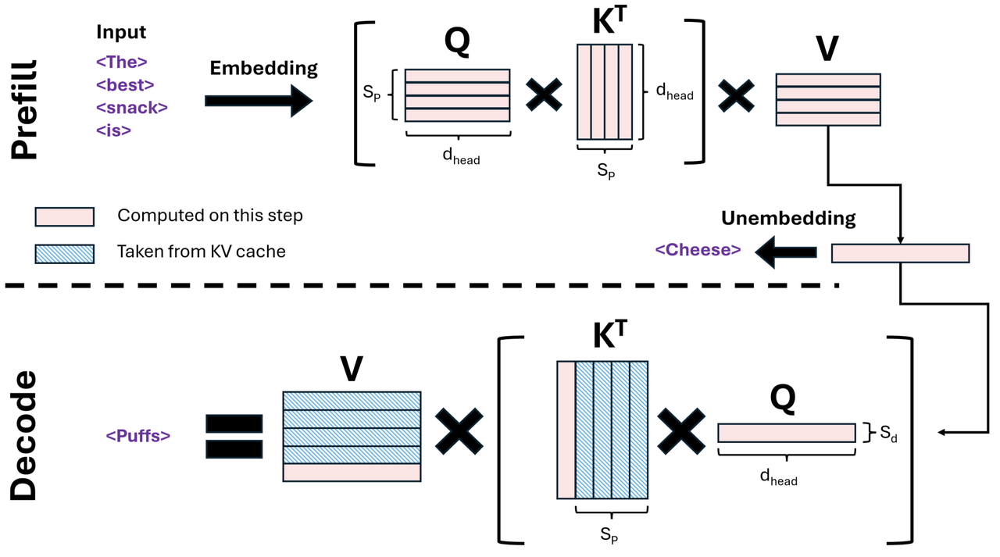

> ### **PP在解码阶段的不足**
>
> * **计算放大效应：** 为了维持流水线运行，PP 必须将本质上计算强度已极低的解码批次进一步拆分成 P 个微批次。这意味着处理相同的请求，PP 需要执行 P 倍次数的前向传播 。
>
> * **内存开销放大：** 在内存密集型的解码阶段，权重加载/转移时间占据了不成比例的总执行时间。由于需要执行 P 次前向传播，模型权重必须从全局内存中**重复加载 P 次** 。这种放大的重复加载开销是 PP 效率低于 TP 的主要结构性原因。  &#x20;
>
> * **Bubbles：** 即使采用微批次，流水线中仍存在 GPU 闲置等待输入数据的气泡时间。  &#x20;
>
> * **同步开销占比过高：** 在解码阶段，微批次的实际计算时间极短，导致通信延迟和微批次管理所需的Static Overhead相对于实际计算时间被极度放大。  &#x20;
>
> * **首 Token 延迟：** PP 的层级串行结构导致 Prefill 阶段必须让数据依次流过所有 P 个阶段才能生成第一个 Token，导致 TTFT 极高（纯 PP=8 配置下延迟高达 2430ms），远不适合需要低延迟的交互式应用。

> ### **与 TP、DP 的通信对比**

> ### **优化手段**

**Hybrid Parallelism：** 结合 TP 和 PP。通常采用 TP 负责节点内的高速计算和内存切分，PP 负责节点间的通信和层级切分 。但需谨慎配置，不平衡的混合配置会严重损害性能。&#x20;

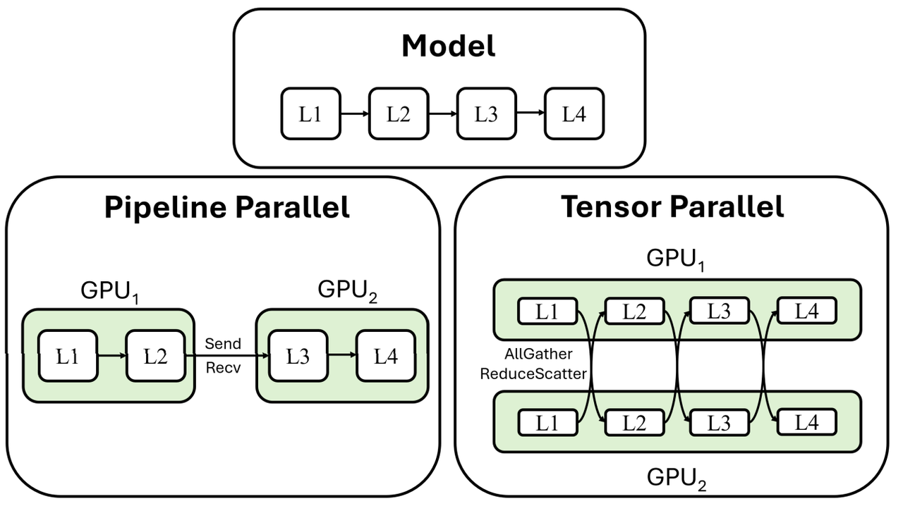


**Continuous Batching：** 通过允许新的请求动态进入批次，提高**有效批次大小**。更大的批次能更好地摊销 PP 在微批次和重复权重加载方面的固定开销 。

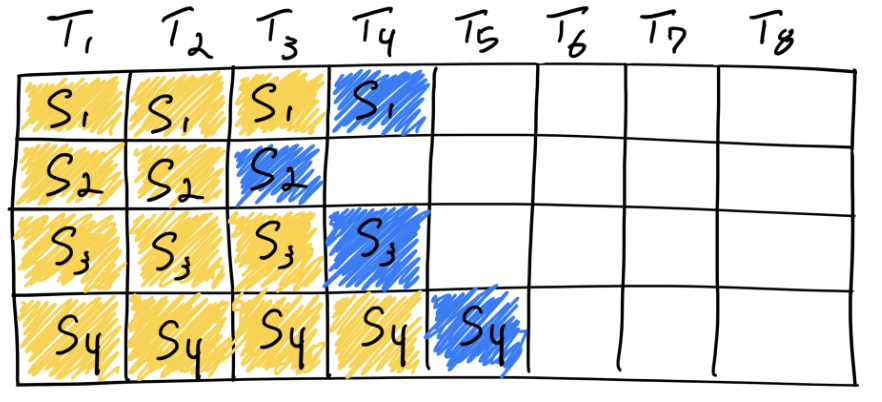

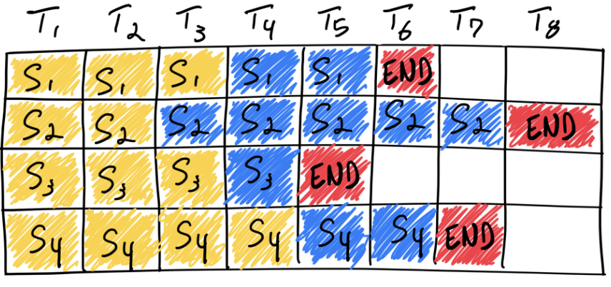


**Speculative Decoding：** 使用小型草稿模型预测 Token，然后由大型模型在**一次并行前向传播**中验证 。这将 N 步顺序自回归生成转化为 1 步并行验证，从根本上减少了 PP 流水线的总迭代次数和气泡累计时间 。

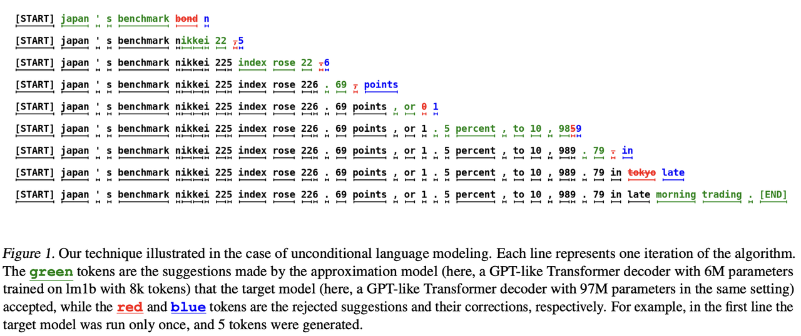

**PD分离：** 将 Prefill 和 Decode 视为独立的执行阶段，允许系统为计算密集型的 Prefill 和内存密集型的 Decode 阶段独立应用最优并行和调度策略，以减少阶段切换的同步开销&#x20;

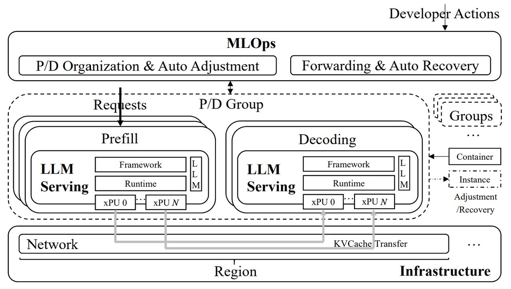


# 10.4.66 大模型的 Embedding 层和独立的 Embedding 模型有什么区别

> ## 定义
>
> **大模型Embedding层**通常集成在Transformer等深度网络内部，用于对输入Token进行初始编码，其参数矩阵与后续的Transformer模块深度耦合。
>
> 这意味着Embedding层是模型的一部分，无法脱离原模型单独使用。
>
> **独立Embedding模型**（如Word2Vec、GloVe）则是单独训练的语义编码模块，专注于生成固定的词向量字典。
>
> 训练完成后，这些模型输出预训练的词向量文件，可被其他系统模块灵活调用，具有更强的可模块化特性。

> ## 举例说明

**大模型 Embedding 层**

**输入**：「中国的首都是哪里？」

**Embedding 层作用**：把每个 token（“中国”“的”“首都”“是”“哪里”）映射为向量 → 输入给 Transformer → Transformer 根据上下文生成输出“北京”。

**特点**：Embedding 向量只是模型理解文本的“入口表示”，并不会直接拿出来用。

**更新方式**：随着 GPT 模型的预训练与微调一起更新。


**独立 Embedding 模型**

* **输入**：「中国的首都是哪里？」

* **输出**：一个 768 维固定向量 `[0.12, 0.43, -0.22, ...]`

* 你可以拿这个向量去和另一个句子向量做 **余弦相似度计算**。
  &#x20;例如：

* **特点**：Embedding 向量本身就是可直接用于搜索、聚类、召回的“终端产品”。

> ## 训练方式
>
> **大模型Embedding层**采用端到端联合训练模式：Embedding层与Transformer等模块同步初始化，在海量语料上进行自监督预训练（如下一个词预测任务），损失通过反向传播驱动Embedding参数微调，以提升整体模型的预测性能。在这个过程中，Embedding层的优化目标是配合Transformer捕获更多上下文信息，而非单独优化词义相似度。
>
> **独立Embedding模型**通常采用“单任务独立训练”策略，训练时以特定任务（如Word2Vec的Skip-gram/CBOW或对比学习等）为目标。训练完成后，模型参数固定不变，可直接迁移到不同下游任务，无需与具体任务模型联合微调。独立模型往往使用自监督或无监督方式，只需原始语料或用户行为序列等数据，无需额外标注。

> ## 输入输出格式
>
> **大模型Embedding层**的输入通常是离散化后的Token的索引，输出一个固定维度的向量，维度等于模型隐层大小。这个向量只是语义“原材料”，还需经过Transformer的自注意力和前馈网络等多层加工，才能得到上下文相关的表示。
>
> **独立Embedding模型**的输入形式更加多样，可以是单词、句子，也可以是商品ID、用户行为序列、图片等不同模态的数据。输出则是一个固定维度的稠密向量（通常是一维实数数组），代表输入对象的语义。这个向量在输出后即可直接用于相似度计算或其他任务中，不需要再依赖大模型的后续层处理。独立模型的向量表示通常是静态的，即相同词或实体在任意上下文中得到相同向量；而大模型内部最后得到的向量会随着上下文动态变化。

# **10.4.67 拒绝采样的原理是什么？**

**&#x20;接受-拒绝采样的原理**

**Acceptance–Rejection method（接受–拒绝法）**&#x662F;所有拒绝采样方法的起点，其核心问题很简单：

***给定一个难以直接采样的目标分布 p(x)，如何利用一个容易采样的分布 q(x) 来间接从 p(x) 采样？***

**接受-拒绝采样的目标设置**

* 想从**目标分布$\boldsymbol{p(x)} $中采样**

* 有一个**易采样的提议分布$\boldsymbol{q(x)}$**

* 能**找到一个常数$\boldsymbol{M \ge 1}$，使得对所有$x$有：**

$\boldsymbol{p(x)≤Mq(x)}$

几何上可以理解为：**用$Mq(x)$这条上包络曲线把$p(x)$整体包住**

**接受-拒绝采样的算法步骤**

重复以下过程，直到收集到足够多样本：

1. 从提议分布采样 $x \sim q(x)$

2. 从均匀分布采样 $ u \sim \mathrm{Uniform}(0,1)$（一个好采样的分布）

3. **如果 $\boldsymbol{u \le \frac{p(x)}{M q(x)}}$，则接受$x$作为来自$p(x)$的样本**

4. 否则，拒绝并重来

**直觉图像：在二维平面上画出曲线$\boldsymbol{y = M q(x)}$，在其下方均匀撒点 $\boldsymbol{(x, u M q(x))}$，落在$\boldsymbol{y = p(x)}$下方的点对应被接受的样本**

**&#x20;为什么得到的就是 $\boldsymbol{p(x)}$？**

* 先采样到某个$x$的概率是$q(x)$

* 条件在给定$x$下，其被接受的概率是$\frac{p(x)}{Mq(x)}$

* 所以被接受的联合密度 $f(x,\text{acc}) = q(x) \cdot \frac{p(x)}{Mq(x)} = \frac{p(x)}{M}$

**对所有被接受样本归一化后，边缘分布正比于$\boldsymbol{p(x)}$，因此就是从$\boldsymbol{p(x)}$采样**

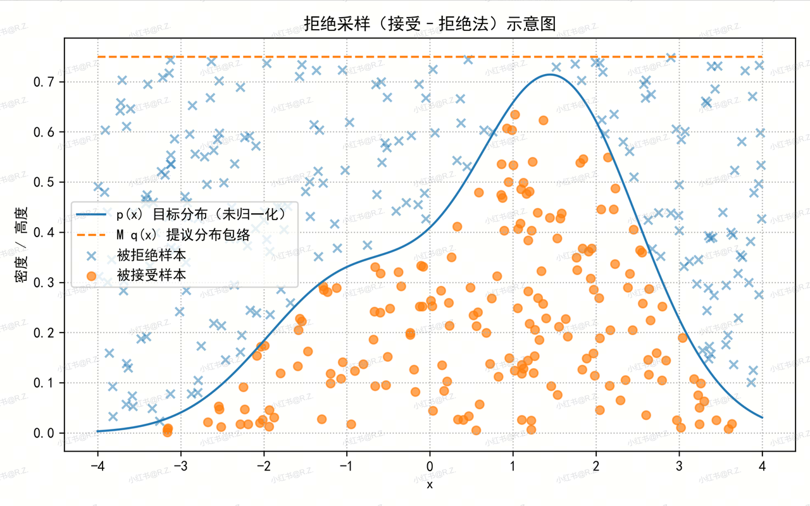

**接受率与效率**

* **平均接受率：** $\mathbb{E}[\text{acc}] = \frac{1}{M} \int p(x)\,dx = \frac{1}{M}$（p(x)已归一化）

* 相当于**每采样 M 个样本，才会接受一个样本。所以 M 越接近 $\sup_x \frac{p(x)}{q(x)}$（sup表示上确界），接受率越高，采样越高效**

**大模型中拒绝采样的统一视角**

**在大模型里，我们通常关心的是条件分布：**

$\boldsymbol{P_\theta(y \mid x)}$

其中$x$是输入（指令、问题、上下文），$y$是输出文本（或包括思维链、结构化结果等）

**但我们真正想要的理想分布往往不是当前模型的$P_\theta$​，而是某种经过对齐后的$P^*$，例如：**

$\boldsymbol{P^*(y \mid x) \propto \exp(\beta r(x, y)) \, P_\theta(y \mid x)}$

其中$r(x,y) $是 reward / 评分函数（例如对齐人类偏好的 reward model、任务正确性的评估器）

**核心思想与区别**

**拒绝采样在大模型里的共同思想就是：**

> **难以直接从$P^*$中采样，于是选择把当前模型$P_\theta$当成提议分布，从$P_\theta$采样，再根据reward / 评分函数做接受–拒绝判据或重加权，从而更接近$P^*$。**

不同方法之间的差异主要体现在：

* 用在**推理阶段**还是**训练阶段**

* **接受–拒绝是在单步 token 级别、整段输出级别，还是 pair-wise 级别（偏好学习）**

* **是按照概率比例做采样，还是用更粗糙的选最优或者过滤方法**

**大模型推理阶段的拒绝采样**

**Self-Consistency**

对一个问题$x$从同一个模型$P(\cdot|x)$中反复采样$K$条思维链和答案，对答案做多数投票，输出最高票回复

从拒绝采样的角度看，这相当于**提议分布就是模型的采样输出，得票少的候选答案被视为不太可信，在最终输出时被拒绝**。虽然没有显式的接受概率公式，但**通过 vote 机制做了一次粗糙的采样过滤**，**在分布层面接近只保留一致性更高的推理路径**

**Best-of-N**

更通用的一类方法是：

> **针对每个输入$x$，采样生成**$N$**个候选输出，用一个额外的 scorer（reward model、verifier等）对每个候选输出打分，然后选分数最高的一个输出**

RLHF 里常提到的 **rejection sampling baseline，**&#x5176;在推理阶段的对应：

$\boldsymbol{\hat{y} = \arg\max_{y_1, \dots, y_N \sim P_{{\theta}}(\cdot|x)} r(x, y_i)}$

* **提议分布：**&#x5C31;是当前模型自己的采样分布$P_{{\theta}}$

* **目标分布：**&#x88AB;评分函数$r(x,y) $重新加权后的分布$P^*(y \mid x) \propto \exp(\beta r(x, y)) \, P_\theta(y \mid x)$，Best-of-N 只是用有限个样本加上选最优的方法，对这个目标分布做了一个非常粗糙的近似

**&#x20;大模型训练阶段的拒绝采样**

**Rejection Sampling Fine-Tuning**

用**当前模型生成多条推理路径，只保留最终答案正确的路径/或选取得分最高的若干条，作为新数据再去微调模型**，从拒绝采样视角来看：

* **提议分布：**&#x5F53;前模型的 CoT 分布

* **验证器：**&#x57FA;于真值的答案是否正确；奖励模型

* 只接受正确的/奖励值高的路径，相当于从正确推理分布中做采样

**RS-DPO/RSO 与偏好优化结合**

* **Statistical Rejection Sampling Optimization（RSO）**：通过**拒绝采样从目标最优策略中抽取偏好数据**，改善传统 DPO 在分布错位下的估计偏差

* **RS-DPO**：从当前 SFT 策略直接采样多条回答，**用 reward model 在这些回答之间构造对比对，再用 DPO 进行训练**

1. **采样阶段**：从当前策略模型大量采样候选

2. **拒绝阶段**：根据 reward 把候选划分为二级 更好/更差

3. **优化阶段**：

   * RSO 把采样–拒绝过程看成近似从目标策略采样

   * RS-DPO 利用被拒绝 / 接受的样本对构造 preference pair 来训练 DPO

相对 DPO 的，这些方法优势在于偏好对来自**当前策略 on-policy 采样**，而不是固定的外部标注，更符合 policy improvement 的理论框架  &#x20;

**拒绝采样的实践**

和经典接受–拒绝法相比，大模型实践有几个现实问题：

1. **不知道严格意义上的 M**：没有办法保证$ P^*(y\mid x) \le M P_\theta(y\mid x)$的严格上界，因此很多方法只是启发式的拒绝采样，并不是真的无偏采样

2. **评分函数有噪声**：reward model 可能出错，会把好样本拒了、坏样本收了

3. **代价巨大**：LLM 采样本身就贵，拒绝采样意味着更大的算力消耗

<table>
<thead>
<tr>
<th><strong>推理端</strong></th>
<th><strong>训练端</strong></th>
</tr>
</thead>
<tbody>
<tr>
<td><strong>Best-of-N 解码</strong><ul>
<li>按任务复杂度选择 N</li>
<li>scorer 可以是<strong>简单启发式</strong>（长度、是否包含非法 token、敏感词）；<strong>轻量 reward model</strong>（安全性 / helpfulness / factuality）；<strong>任务特定的验证器</strong>（单元测试、json 校验）</li>
</ul><strong>Self-Consistency for CoT</strong><ul>
<li>适合数学 / 逻辑 / 规划类问题</li>
<li>对于每个问题<strong>采样多条思维链，多数投票+筛选更有逻辑的路径</strong></li>
</ul></td>
<td><ol>
<li>把已有监督数据做一次 SFT</li>
<li><strong>用模型在训练集或扩展数据上采样多条解法</strong></li>
<li><strong>自动验证，筛出高质量样本</strong></li>
<li><strong>合并为新的训练集，再 SFT 一轮</strong></li>
<li>多迭代几轮</li>
</ol>重点注意：<ul>
<li>自动验证规则的 <strong>准确度优先</strong>，宁可少接受样本也不要垃圾样本</li>
<li><strong>留一部分监督数据只做 评估，避免自举过拟合</strong></li>
</ul></td>
</tr>
<tr>
<td></td>
<td></td>
</tr>
<tr>
<td></td>
<td></td>
</tr>
<tr>
<td></td>
<td></td>
</tr>
<tr>
<td></td>
<td></td>
</tr>
</tbody>
</table>

