# 机器学习

## 图谱：

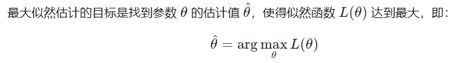

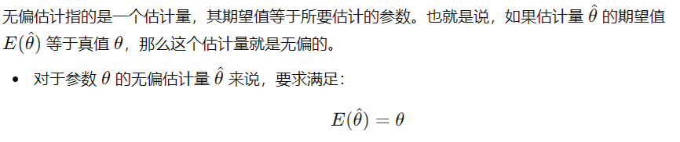

**最大似然估计**：侧重于找到使观测数据最有可能出现的参数值，不一定是无偏的，但在样本量趋于无穷时，它往往是渐近无偏的，并且具有渐近最小方差。

**无偏估计**：保证了估计量的期望等于真实参数值，但不保证估计量是最可能的或方差最小的。

## 过拟合欠拟合

过拟合是指模型在训练数据上表现得非常好，但在新的、未见过的数据上表现较差。这通常是因为模型过于复杂，捕捉到了训练数据中的噪声或细节，从而丧失了泛化能力。常见的表现包括：

* 训练误差很低，但测试误差很高。

* 模型对训练数据的变化非常敏感，对特定数据点的表现过度拟合。

**简化模型**：减少模型的复杂度，例如降低多项式的阶数或减少神经网络的层数。

**正则化**：引入惩罚项来限制模型的复杂性，如L1正则化（Lasso）或L2正则化（Ridge）。

**增加数据**：通过增加更多的训练数据来帮助模型学习更广泛的模式，而不是特定数据的细节。

**交叉验证**：使用交叉验证方法来选择模型参数，从而避免过度拟合。

欠拟合是指模型在训练数据和测试数据上都表现得不好，无法捕捉数据的潜在模式。这通常是因为模型过于简单，不能充分学习数据中的规律。常见的表现包括：

* 训练误差和测试误差都很高。

* 模型对数据中的复杂关系或非线性特征不敏感。

**增加模型复杂度**：选择更复杂的模型，例如增加多项式的阶数、增加神经网络的层数或节点数。

~~**增加特征**：引入更多有用的特征或进行特征工程，以帮助模型更好地捕捉数据中的模式。~~

**减少正则化**：如果正则化项过大，可能导致欠拟合，适当减少正则化强度。

## 逻辑回归：

怎么理解损失函数？？？？？？？交叉熵https://zhuanlan.zhihu.com/p/638725320

**衡量概率分布之间的差异**：交叉熵本质上是衡量两个概率分布之间差异的度量方式。在逻辑回归中，模型输出的是预测的概率分布（预测正类的概率 hθ(x)h\_\theta(x)hθ(x) 和预测负类的概率 1−hθ(x)1 - h\_\theta(x)1−hθ(x)），而实际的标签也是一种“概率分布”（1 表示完全属于某一类）。交叉熵有效地衡量了这两者之间的差异。

**凸性和优化性**：交叉熵损失函数是一个凸函数，这意味着在参数空间中只有一个全局最小值。凸函数使得基于梯度的优化方法（如梯度下降）能够稳定地收敛到全局最优解，而不容易陷入局部最小值。

Logistic 回归的本质是：假设数据服从这个分布，然后使用极大似然估计做参数的估计。

逻辑回归在 0 附近敏感，在远离 0 点位置不敏感，这个的好处就是模型更加关注分类边界，可以增加模型的鲁棒性。

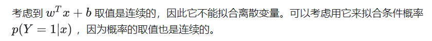

再加一个sigmoid函数取到0-1，不用阶跃是因为不可微

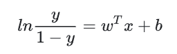

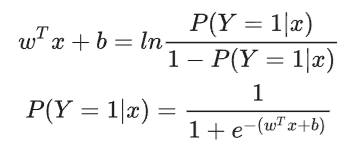

最大似然估计/损失函数/交叉熵

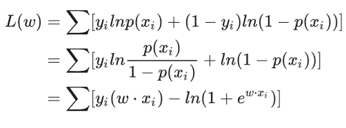


使用对数几率的意义（上2式）：

1. 直接对分类的概率建模，无需实现假设数据分布，从而避免了假设分布不准确带来的问题（区别于生成式模型）；

2. 不仅可预测出类别，还能得到该预测的概率，这对一些利用概率辅助决策的任务很有用；

3. 对数几率函数是任意阶可导的凸函数，有许多数值优化算法都可以求出最优解。

梯度下降：

怎么推导的？？？？？？？？https://www.zhihu.com/tardis/zm/art/35709485?source\_id=1003

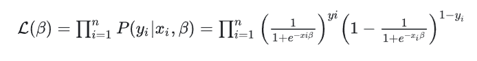

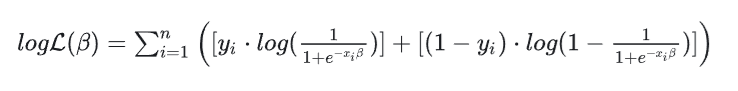


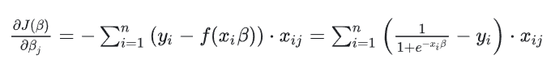

1. 离散后稀疏向量内积乘法运算速度更快，计算结果也方便存储，容易扩展；

2. 离散后的特征对异常值更具鲁棒性，如 age>30 为 1 否则为 0，对于年龄为 200 的也不会对模型造成很大的干扰；

3. LR 属于广义线性模型，表达能力有限，经过离散化后，每个变量有单独的权重，这相当于引入了非线性，能够提升模型的表达能力，加大拟合；

4. 离散后特征可以进行特征交叉，提升表达能力，由 M+N 个变量编程 M\*N 个变量，进一步引入非线形，提升了表达能力；

5. 特征离散后模型更稳定，如用户年龄区间，不会因为用户年龄长了一岁就变化；

逻辑回归在 0 附近敏感，在远离 0 点位置不敏感，这个的好处就是模型更加关注分类边界，可以增加模型的鲁棒性。

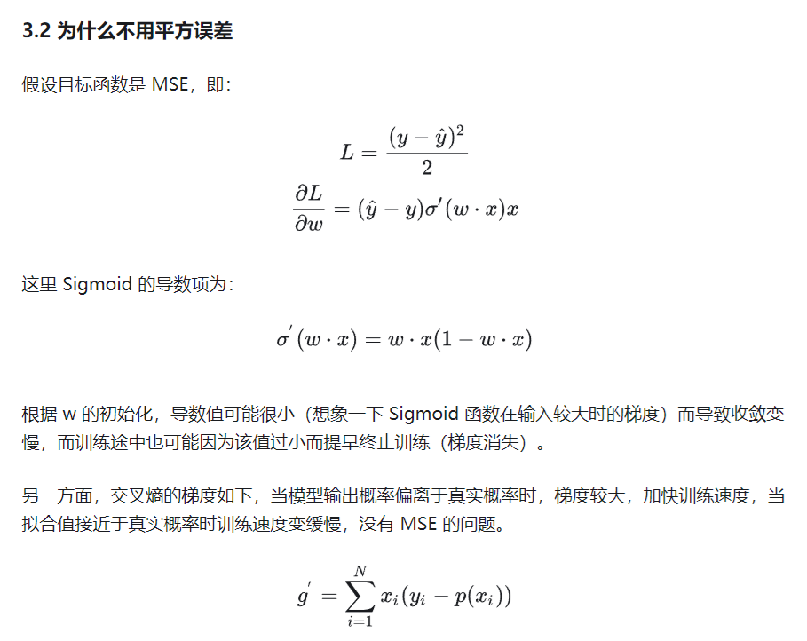

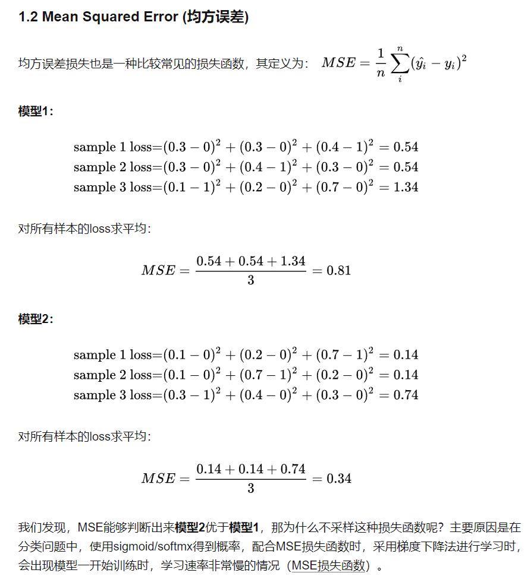


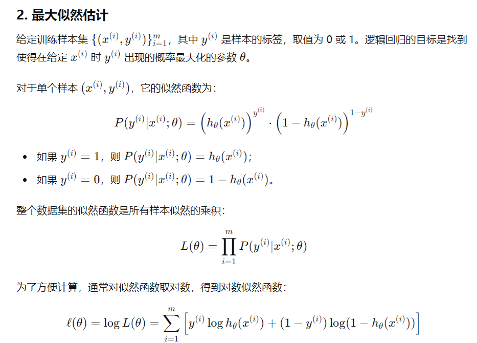

## 正则化

正则化是一个通用的算法和思想，所以会产生过拟合现象的算法都可以使用正则化来避免过拟合。如果模型过于复杂，变量值稍微有点变动，就会引起预测精度问题。正则化之所以有效，就是因为其降低了特征的权重，使得模型更为简单。

**L1 正则化增加了所有权重 w 参数的绝对值之和逼迫更多 w 为零**，也就是变稀疏（ L2 因为其导数也趋 0, 奔向零的速度不如 L1 给力了）一般来说，大部分特征 x\_i 都是和最终的输出 y\_i 没有关系或者不提供任何信息的。在最小化目标函数的时候考虑 x\_i 这些额外的特征，虽然可以获得更小的训练误差，但在预测新的样本时，这些没用的特征权重反而会被考虑，从而干扰了对正确 y\_i 的预测。L1 正则化的引入就是为了完成特征自动选择的光荣使命，它会学习地去掉这些无用的特征，也就是把这些特征对应的权重置为 0。

**L2 正则化中增加所有权重 w 参数的平方之和，逼迫所有 w 尽可能趋向零但不为零**（L2 的导数趋于零）。因为在未加入 L2 正则化发生过拟合时，拟合函数需要顾忌每一个点，最终形成的拟合函数波动很大，在某些很小的区间里，函数值的变化很剧烈，也就是某些 w 值非常大。为此，L2 正则化的加入就惩罚了权重变大的趋势。

**L2 范数能让解比较小（靠近 0），但是比较平滑（不等于 0）。**

**Dropout** 是一种在训练神经网络模型时用于防止过拟合的正则化技术。它的核心思想是：在每次训练过程中，随机“丢弃”一部分神经元（即将它们的输出置为零），以减少神经元之间的相互依赖性，从而使模型更加稳健和具有更好的泛化能力。

**防止过拟合**：Dropout减少了神经元之间的相互依赖，迫使网络学习更加分散的特征表示，从而提高模型的泛化能力。

**类似于模型集成**：每次训练Dropout后，模型可以看作是一个子网络的组合，多个子网络的组合相当于一个集成模型，而测试时使用的是这些子网络的平均效果。

由于训练和推理阶段的这种不同处理方式，可能会导致推理阶段的模型表现与训练阶段的期望有差距。解决这种差距的方法包括：

1. **缩放权重**：在推理阶段，我们通常会缩放神经元的权重，以补偿训练阶段 Dropout 的影响。常见的做法是在训练时对每个神经元的输出进行 Dropout 操作，然后在推理阶段将所有神经元的输出乘以保留率（即 1 - Dropout 率）。例如，如果 Dropout 率为 0.5，在推理阶段，神经元的输出应该乘以 0.5，以保持输出的期望值一致。

2. **Batch Normalization**：使用批归一化（Batch Normalization）可以在一定程度上减少训练和推理阶段的差异。批归一化通过归一化每一层的输入，减小了由于不同批次数据带来的波动，也可以帮助模型更好地适应 Dropout 带来的变化。

3. **在推理阶段禁用 Dropout**：推理阶段本质上是希望模型尽可能充分地利用所有学到的特征，因此直接在推理阶段禁用 Dropout 是通常的做法。大多数框架（如 TensorFlow 和 PyTorch）在推理模式下会自动禁用 Dropout。

4. **使用 Monte Carlo Dropout**：在某些不确定性估计的场景中，可能希望在推理阶段也使用 Dropout。通过进行多次前向传递，并对输出结果进行平均，可以得到更稳定的预测。这种方法被称为 Monte Carlo Dropout，并且可以用于估计模型的不确定性。

## 线性回归：

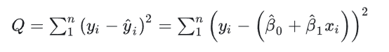

最小二乘：

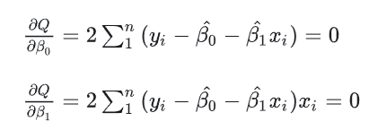


## K-means:

https://zhuanlan.zhihu.com/p/78798251

K-means 是我们最常用的基于欧式距离的聚类算法，其认为两个目标的距离越近，相似度越大。

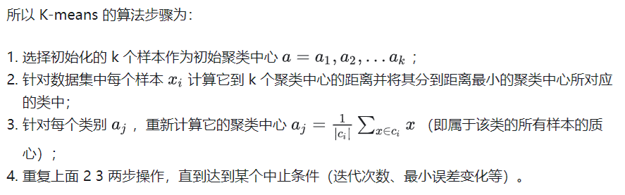

调优方式：如数据预处理（去除异常点），合理选择 K 值，高维映射等。

**数据预处理：**&#x4B;-means 的本质是基于欧式距离的数据划分算法，均值和方差大的维度将对数据的聚类产生决定性影响。所以未做归一化处理和统一单位的数据是无法直接参与运算和比较的。常见的数据预处理方式有：数据归一化，数据标准化。此外，离群点或者噪声数据会对均值产生较大的影响，导致中心偏移，因此我们还需要对数据进行异常点检测。

**合理选择 K 值：**

手肘法

Gap statistic

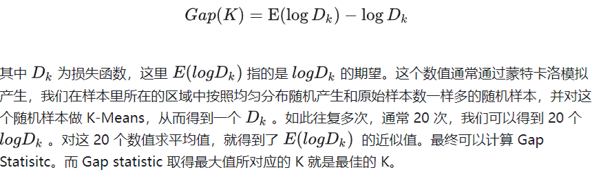

**采用核函数：**

基于欧式距离的 K-means 假设了了各个数据簇的数据具有一样的的先验概率并呈现球形分布，但这种分布在实际生活中并不常见。面对非凸的数据分布形状时我们可以引入核函数来优化，这时算法又称为核 K-means 算法，是核聚类方法的一种。核聚类方法的主要思想是通过一个非线性映射，将输入空间中的数据点映射到高位的特征空间中，并在新的特征空间中进行聚类。非线性映射增加了数据点线性可分的概率，从而在经典的聚类算法失效的情况下，通过引入核函数可以达到更为准确的聚类结果。

**K-means++：**

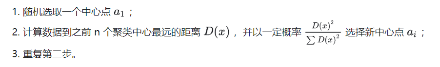

## KNN：

* KNN中的K指的是近邻个数，也就是最近的K个点 ；

* Kmeans中的K指的是最终聚类的个数，也就是要将所有点分成K类。

我们有一堆样本点，类别已知，蓝色为一类，黄色为另一类。现在有个新样本点，也就是图中黑色的叉叉，需要判断它属于哪一类。KNN做的就是选出距离目标点黑叉叉距离最近的k个点，看这k个点的大多数颜色是什么颜色。

KNN的决策边界一般不是线性的，也就是说KNN是一种非线性分类器

K越小越容易过拟合，当K=1时，这时只根据单个近邻进行预测，如果离目标点最近的一个点是噪声，就会出错，此时模型复杂度高，稳健性低，决策边界崎岖。

但是如果K取的过大，这时与目标点较远的样本点也会对预测起作用，就会导致欠拟合，此时模型变得简单，决策边界变平滑。

1. 把样本集分成5个小的子集，编号为set1、set2、set3、set4、set5；

2. 先用set1、set2、set3、set4建模，得到model1，并在set5上计算误差error1；

3. 在用set1、set2、set3、set5建模，得到model2，并在set4上计算误差error2；

4. 重复以上步骤，建立5个模型，将5个误差值相加后除以5得到平均误差。

了解完交叉验证是什么，我们就可以从k=1开始尝试，计算K=1时的平均误差值，每次K增加2，最终能选到产生最小误差值的K（因为随着K变大，误差值会先变小后变大嘛）。

为什么是每次增加2？因为K最好取奇数。还是用最开始那个例子，如果K取4，最近的4个点有2个蓝色，2个黄色，这时打成了平手，就不好判断目标点属于哪一类了。

## EM：

EM 算法的核心思想非常简单，分为两步：Expection-Step 和 Maximization-Step。E-Step 主要通过观察数据和现有模型来估计参数，然后用这个估计的参数值来计算似然函数的期望值；而 M-Step 是寻找似然函数最大化时对应的参数。由于算法会保证在每次迭代之后似然函数都会增加，所以函数最终会收敛。

## 评估指标：

[精确率、召回率、F1 值、*ROC*、AUC 各自的优缺点是什么？](https://www.zhihu.com/question/30643044/answer/48955833)

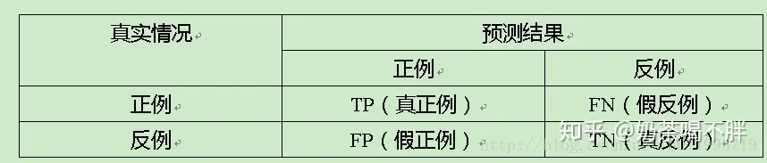

**准确率**(accuracy) A=(TP+TN)/(TP+FN+FP+TN) 通俗解释： 在所有样本中，预测正确的概率

**精确率**(precision) P=TP/(TP+FP) 通俗解释：你认为的正样本中，有多少是真的正确的概率

**召回率**(recall) R=TP/(TP+FN) 通俗解释：正样本中有多少是被找了出来

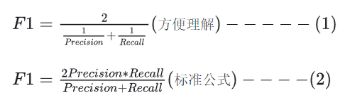

真阳性率（True Positive Rate，简称TPR）：TP/(TP+FN)

假阳性率（False Positive Rate，简称FPR）:FP/(FP+TN)

**ROC曲线**：以FPR为横坐标、TPR为纵坐标，将每一个阈值所对应的(FPR,TPR)放入坐标系中

&#x20;               越接近左上角，那么说明模型的预测效果越好

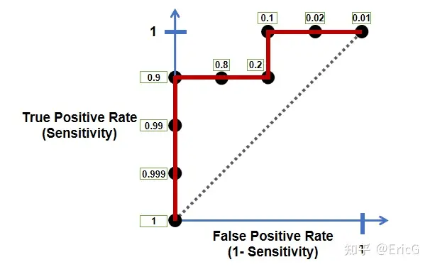

**AUC**：也可以计算出ROC曲线下方的面积，计算出来的面积就是AUC的值了

**AUC计算方法：**

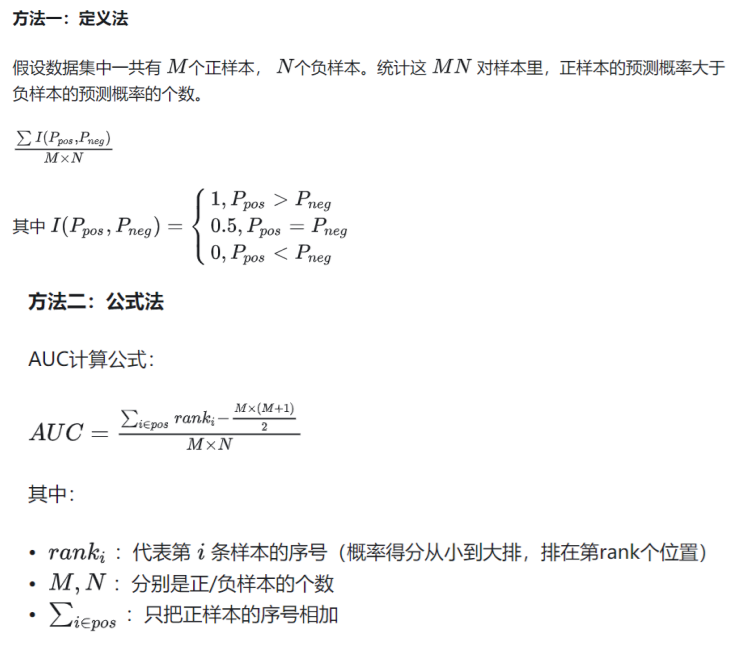


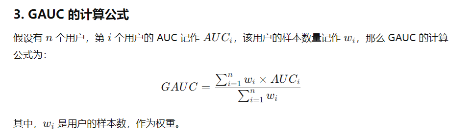

## 决策树：

### 简单描述

决策树是一种机器学习算法，其核心思想是通过对数据的特征进行逐步的分割，构建一个树状模型来进行分类或回归任务。具体来说，决策树通过以下步骤实现其功能：

1. **数据分割**：决策树从根节点开始，根据数据的特征选择最佳分割点，将数据集分成不同的子集。这个过程重复进行，形成一棵树状结构，其中每个节点代表一个特征分割条件，每个叶节点代表最终的预测结果（类别标签或数值）。

2. **选择分割标准**：在每个节点，决策树算法选择最优的特征及其分割点。常见的分割标准包括：

   * **分类任务**：使用信息增益（Information Gain）、基尼指数（Gini Index）等来衡量分割后的数据纯度。

   * **回归任务**：使用均方误差（MSE）或平均绝对误差（MAE）来衡量分割后数据的误差。

3. **递归构建**：通过递归地对每个子集进行进一步的分割，决策树不断细化，直至满足停止条件（如达到最大深度、没有进一步的信息增益等）。

4. **剪枝（Pruning）**：为了避免过拟合，决策树在构建完成后可能会进行剪枝操作，即通过移除一些子树来简化模型，提升其泛化能力。

5. **预测**：对于新的输入数据，决策树从根节点开始，根据输入数据的特征逐步在树上遍历，最终到达叶节点，输出预测结果。

决策树的优势在于直观易理解、不需要大量的数据预处理。它能够处理分类和回归问题，并且对特征的尺度不敏感。缺点则包括容易过拟合和对数据中的小扰动敏感。

总结来说，决策树的思想是通过逐层分割数据，构建一个简单而直观的模型，用来做决策或预测。

### ID3:

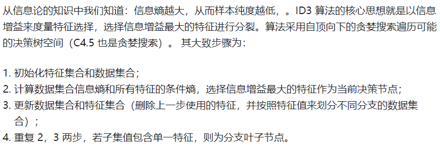

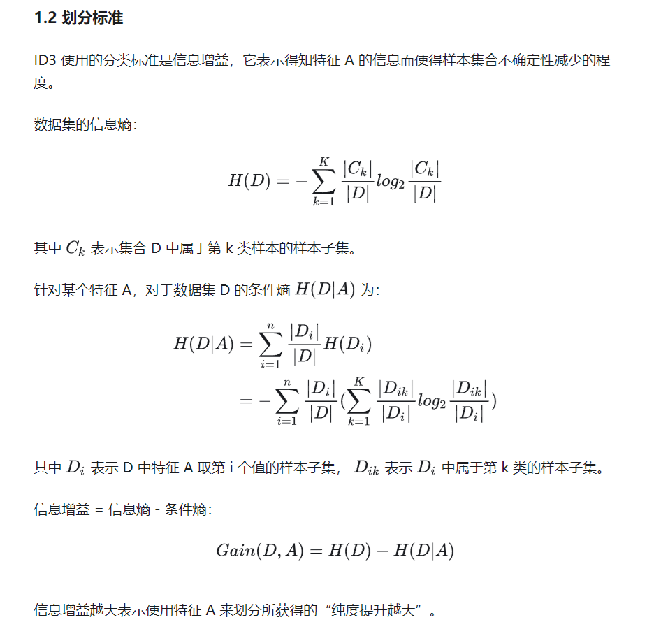

* **ID3 没有剪枝策略，容易过拟合**；

* 信息增益准则对可取值数目较多的特征有所偏好，类似“编号”的特征其信息增益接近于 1；

* **只能用于处理离散分布的特征**；

* **没有考虑缺失值。**

### C4.5：

C4.5 算法最大的特点是克服了 ID3 对特征数目的偏重这一缺点，引入信息增益率来作为分类标准。

* 引入悲观剪枝策略进行后剪枝；

* 引入信息增益率作为划分标准；

* 将连续特征离散化，假设 n 个样本的连续特征 A 有 m 个取值，C4.5 将其排序并取相邻两样本值的平均数共 m-1 个划分点，分别计算以该划分点作为二元分类点时的信息增益，并选择信息增益最大的点作为该连续特征的二元离散分类点；

* 对于缺失值的处理可以分为两个子问题：

* 问题一：在特征值缺失的情况下进行划分特征的选择？（即如何计算特征的信息增益率）

* 问题二：选定该划分特征，对于缺失该特征值的样本如何处理？（即到底把这个样本划分到哪个结点里）

* 针对问题一，C4.5 的做法是：对于具有缺失值特征，用没有缺失的样本子集所占比重来折算；

* 针对问题二，C4.5 的做法是：将样本同时划分到所有子节点，不过要调整样本的权重值，其实也就是以不同概率划分到不同节点中。

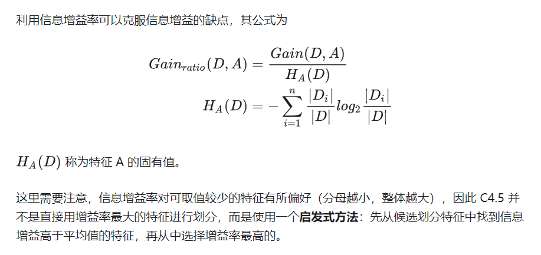

为什么要剪枝：过拟合的树在泛化能力的表现非常差。

预剪枝

在节点划分前来确定是否继续增长，及早停止增长的主要方法有：

* 节点内数据样本低于某一阈值；

* 所有节点特征都已分裂；

* 节点划分前准确率比划分后准确率高。

预剪枝不仅可以降低过拟合的风险而且还可以减少训练时间，但另一方面它是基于“贪心”策略，会带来欠拟合风险。

后剪枝

在已经生成的决策树上进行剪枝，从而得到简化版的剪枝决策树。

C4.5 采用的悲观剪枝方法，用递归的方式从低往上针对每一个非叶子节点，评估用一个最佳叶子节点去代替这课子树是否有益。如果剪枝后与剪枝前相比其错误率是保持或者下降，则这棵子树就可以被替换掉。C4.5 通过训练数据集上的错误分类数量来估算未知样本上的错误率。

后剪枝决策树的欠拟合风险很小，泛化性能往往优于预剪枝决策树。但同时其训练时间会大的多。

* 剪枝策略可以再优化；

* C4.5 用的是多叉树，用二叉树效率更高；

* C4.5 只能用于分类；

* C4.5 使用的熵模型拥有大量耗时的对数运算，连续值还有排序运算；

* C4.5 在构造树的过程中，对数值属性值需要按照其大小进行排序，从中选择一个分割点，所以只适合于能够驻留于内存的数据集，当训练集大得无法在内存容纳时，程序无法运行。

### CART：

ID3 和 C4.5 虽然在对训练样本集的学习中可以尽可能多地挖掘信息，但是其生成的决策树分支、规模都比较大，CART 算法的二分法可以简化决策树的规模，提高生成决策树的效率。

CART 分类树采用叶子节点里概率最大的类别作为当前节点的预测类别

不太懂了

### Bagging：

Bagging 全称叫 Bootstrap aggregating，每个子学习器都会对训练集进行有放回抽样得到子训练集，比较著名的采样法为 0.632 自助法。每个基学习器基于不同子训练集进行训练，并综合所有基学习器的预测值得到最终的预测结果。Bagging 常用的综合方法是投票法，票数最多的类别为预测类别。

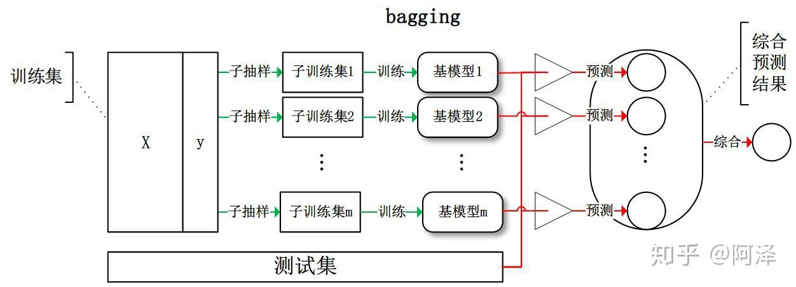

Bagging 的优点：

1. 降低方差： Bagging 的主要作用是通过训练多个不同的模型来降低单个模型的方差，减少过拟合风险，特别是对于高方差的模型（如决策树）。

2. 增强稳定性： Bagging 能提高模型的稳定性和鲁棒性，即使原始训练数据存在一些噪声或异常点，模型的最终预测结果也不会被过度影响。

Bagging 最常见的应用是**随机森林**（Random Forest）。随机森林是通过对决策树应用 Bagging 并在每个节点选择部分特征进行分裂来实现的，这进一步增强了模型的多样性，提升了模型性能。


### Boosting：

Boosting 训练过程为阶梯状，基模型的训练是有顺序的，每个基模型都会在前一个基模型学习的基础上进行学习，最终综合所有基模型的预测值产生最终的预测结果，用的比较多的综合方式为加权法。

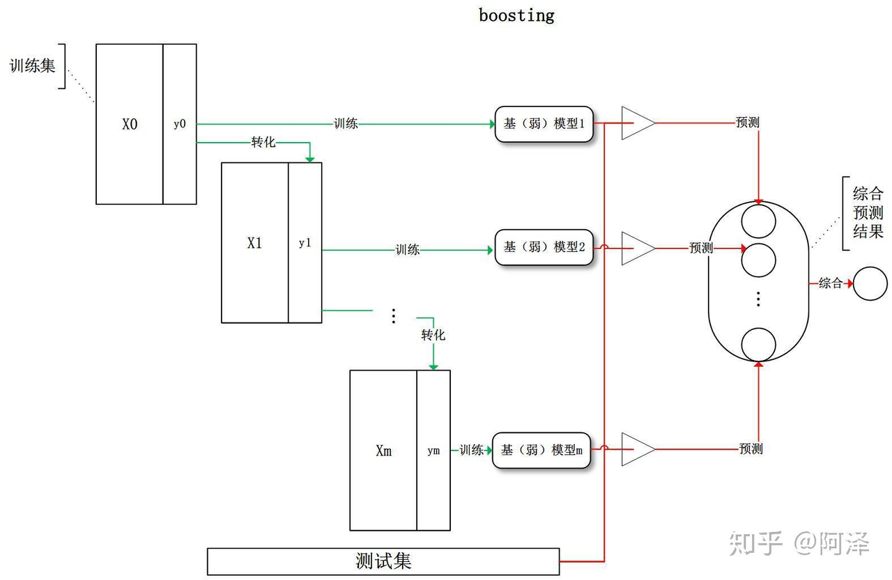

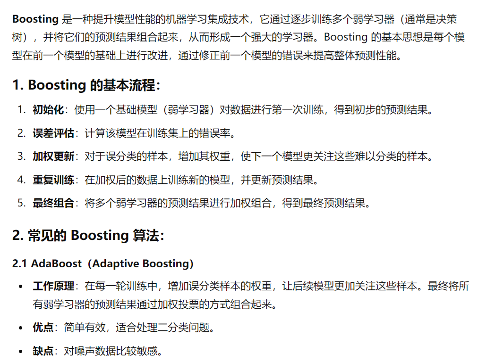

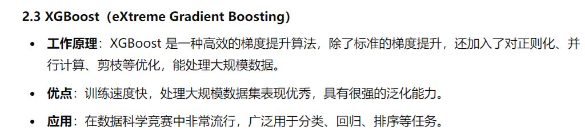

### Stacking：

Stacking 是先用全部数据训练好基模型，然后每个基模型都对每个训练样本进行的预测，其预测值将作为训练样本的特征值，最终会得到新的训练样本，然后基于新的训练样本进行训练得到模型，然后得到最终预测结果。

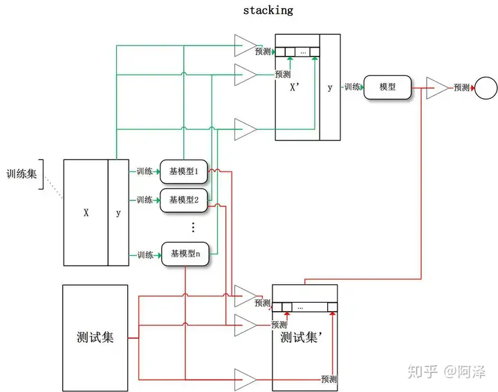


### Random Forest（bagging）：

用随机的方式建立一个森林。RF 算法由很多决策树组成，每一棵决策树之间没有关联。建立完森林后，当有新样本进入时，每棵决策树都会分别进行判断，然后基于投票法给出分类结果。

是 Bagging 的扩展变体，它在以决策树为基学习器构建 Bagging 集成的基础上，进一步在决策树的训练过程中引入了随机特征选择，因此可以概括 RF 包括四个部分：

1. 随机选择样本（放回抽样）；

2. 随机选择特征，在构建每棵决策树的每个节点时，随机选择一部分特征进行划分，而不是使用所有特征。这样做增加了决策树之间的差异性，减少了过拟合的风险。；

3. 构建决策树；

4. 随机森林投票（平均）。

在数据集上表现良好，相对于其他算法有较大的优势

易于并行化，在大数据集上有很大的优势；

能够处理高维度数据，不用做特征选择。

### Adaboost（boosting）：

**弱学习器**：AdaBoost 使用多个弱学习器，这些学习器通常在单独使用时只能稍微好于随机猜测（准确率略高于 50%）。

**迭代训练**：AdaBoost 通过迭代的方式训练这些弱学习器。在每一轮迭代中，AdaBoost 会根据上一轮的错误率调整训练数据的权重，使得下一轮的弱学习器更加关注之前难以正确分类的样本。

**权重调整**：在每一轮迭代中，样本的权重会根据它们的分类错误情况进行调整。那些被错误分类的样本的权重会被增加，使得下一个弱学习器更加关注这些样本。

**组合模型**：最终的分类器是所有弱学习器的加权组合。每个弱学习器的权重取决于它的分类准确率。准确率越高的弱学习器在最终的组合中占的权重越大。

### GBDT（boosting）：

GBDT（Gradient Boosting Decision Tree，梯度提升决策树）是一种集成学习算法，它通过逐步构建多个决策树来优化模型的预测结果。GBDT 的核心思想是每棵新树都拟合前一棵树的残差，即预测误差，逐步提高模型的性能。

**与 Adaboost 的对比**：

相同：

1. 都是 Boosting 家族成员，使用弱分类器；

2. 都使用前向分布算法；

不同：

1. 迭代思路不同：Adaboost 是通过提升错分数据点的权重来弥补模型的不足（利用错分样本），而 GBDT 是通过算梯度来弥补模型的不足（利用残差）；

2. 损失函数不同：AdaBoost 采用的是指数损失，GBDT 使用的是绝对损失或者 Huber 损失函数；

**与Random Forest的对比：**

随机森林（Random Forest）：

采用 Bagging（Bootstrap Aggregating）方法，所有的树是并行训练的。通过对样本进行随机采样（有放回）和对特征进行随机选择，随机森林训练多棵独立的决策树，最终通过投票或平均来做出最终预测。

随机森林关注的是降低方差

GBDT（Gradient Boosting Decision Tree）：

使用 Boosting 方法，所有的树是顺序训练的，每一棵新树是在拟合前一棵树的残差的基础上构建的。也就是说，每一棵树试图纠正前一棵树的错误。因此，GBDT 是一个逐步提升模型性能的过程。

GBDT 的重点是降低偏差

### &#x20;XGBoost（boosting）：

**XGBoost** 和 **GBDT** 都是提升树（Boosting Trees）模型的实现，但 XGBoost 是 GBDT 的一个改进版本，特别是在效率、性能和功能方面做了优化。以下是它们的主要区别：

1\. **核心算法**

* **GBDT**：基于梯度提升算法，依赖于每一轮迭代训练一个新的决策树来拟合上一次模型的残差。这种方式逐步减少误差，最终构建一个强模型。

* **XGBoost**：XGBoost 也是基于梯度提升的，但它引入了更强大的正则化方法（L1 和 L2 正则化）来防止过拟合。此外，XGBoost 通过二阶导数信息（Hessian）进行损失函数的优化，使得模型的收敛速度更快，优化更加稳定。

2\. **正则化**

* **GBDT**：GBDT 的模型中通常不包含显式的正则化项，这可能导致模型在面对复杂数据时出现过拟合的情况。

* **XGBoost**：引入了正则化项，特别是 L1 和 L2 正则化，这使得模型能够更好地控制复杂度，从而减少过拟合的风险。

3\. **处理缺失值**

* **GBDT**：传统的 GBDT 对缺失值的处理并不完善，通常需要手动预处理缺失数据。

* **XGBoost**：XGBoost 具有自动处理缺失值的功能，能够在训练过程中自动决定缺失值的最佳填补方式。

4\. **并行处理**

* **GBDT**：由于梯度提升的本质，传统 GBDT 的决策树训练是顺序的，因此在计算上不容易并行化。

* **XGBoost**：XGBoost 引入了块结构（block structure）和列块（column block）技术，能够实现树结构的并行化构建，从而大大提高了训练速度。

5\. **树的构建方式**

* **GBDT**：每棵树的构建通常是贪心地从根到叶节点一层层进行。

* **XGBoost**：XGBoost 在分裂点选择时使用了更优化的近似算法，比如通过候选分裂点的量化（quantile sketch）技术，使得在大数据集上进行树的构建更加高效。

6\. **支持的功能**

* **GBDT**：传统的 GBDT 实现通常只支持基本的功能，如回归和分类。

* **XGBoost**：XGBoost 不仅支持回归和分类，还支持排序任务（learning to rank），并且可以与多种自定义的目标函数和评估指标结合使用。

7\. **效率**

* **GBDT**：训练速度相对较慢，特别是在数据量大的情况下，处理效率较低。

* **XGBoost**：由于并行计算、正则化和更高效的算法，XGBoost 在大多数情况下具有更高的训练效率。

## [梯度下降](https://www.cnblogs.com/pinard/p/5970503.html)：

线性回归：

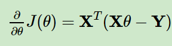


## MLP:

```python
import numpy as np


class LinearLayer:
    def __init__(self, n_in, n_out, batch_size, activation=None, lr=0.001):
        self.W = np.random.normal(scale=0.01, size=(n_in, n_out))
        self.b = np.zeros((batch_size, n_out))
        self.activation = activation
        self.lr = lr
        self.batch_size = batch_size
        self.parameter = {'name':'Linear', 'size':[n_in, n_out], 'activation':activation}

    def forward(self, x):
        self.x = x
        output = np.dot(x, self.W) + self.b
        if self.activation is 'relu':
            output = np.maximum(0, output)
        if self.activation is 'sigmoid':
            output = 1 / (1 + np.exp(-output))
        if self.activation is 'tanh':
            output = np.tanh(output)
        self.activated_output = output
        return output

    def backward(self, dout):
        if self.activation is 'relu':
            self.activated_output[self.activated_output <= 0] = 0
            self.activated_output[self.activated_output > 0] = 1
            dout = dout * self.activated_output
        if self.activation is 'sigmoid':
            dout = self.activated_output * (1 - self.activated_output) * dout
        if self.activation is 'tanh':
            dout = (1 - self.activated_output ** 2) * dout
        dx = np.dot(dout, self.W.T)
        self.dW = np.dot(self.x.T, dout)
        self.db = dout
        self.W = self.W - self.dW * self.lr / self.batch_size
        self.b = self.b - self.db * self.lr / self.batch_size
        return dx


class SoftMax:
    y_hat = []

    def __init__(self):
        super(SoftMax, self).__init__()
        self.parameter = {'name':'SoftMax'}

    def forward(self, x):
        x_exp = np.exp(x)
        partition = np.sum(x_exp, axis=1, keepdims=True)
        self.y_hat = x_exp / partition
        return self.y_hat

    def backward(self, y):
        dout = self.y_hat - y
        return dout


class MLP:
    def __init__(self, input_size, batch_size, num_classes, lr=0.001, hidden_layer_sizes=(), activation='relu'):

        self.layer_list = [[hidden_layer_sizes[i], hidden_layer_sizes[i + 1]]
                           for i in range(len(hidden_layer_sizes) - 1)]
        self.input_layer = LinearLayer(input_size, hidden_layer_sizes[0], batch_size, activation, lr=lr)
        self.classifier = LinearLayer(hidden_layer_sizes[-1], num_classes, batch_size, activation, lr=lr)
        self.softmax = SoftMax()
        self.batch_size = batch_size
        self.lr = lr

        self.layers = [self.input_layer]
        for i in range(len(self.layer_list)):
            self.layers.append(LinearLayer(self.layer_list[i][0], self.layer_list[i][1], batch_size, activation, lr=lr))
        self.layers.append(self.classifier)
        self.layers.append(self.softmax)

    def forward(self, x):
        for layer in self.layers:
            x = layer.forward(x)
        return x

    def backward(self, y):
        for layer in reversed(self.layers):
            y = layer.backward(y)

    def parameter(self):
        for i in range(len(self.layers)):
            print("layer {}: {}".format(i + 1, self.layers[i].parameter))

```

## [激活函数](https://mp.weixin.qq.com/s?__biz=MzA3MzI4MjgzMw==\&mid=2650732724\&idx=4\&sn=5230b8bb1811cda38ab97afb417d1613\&chksm=871b3ccab06cb5dcdf0bdfadcc7ae85d8ae95588bed0b884a55ba50b76d541771104675fbb3e\&scene=21#wechat_redirect)：

**引入非线性**

* 非线性是激活函数最关键的作用。神经网络的强大之处在于能够拟合和表示复杂的非线性关系，而这一点正是通过激活函数来实现的。

* 如果没有激活函数，神经网络中的每一层都只是输入和权重的线性组合，最终只能表示线性关系。通过在每一层应用激活函数，神经网络能够逐层构建出复杂的非线性映射。

**模拟神经元的激活**

* 激活函数模拟生物神经元的激活过程，即神经元收到一定强度的信号时会被激活并传递信号，而信号太弱时则不会被激活。通过激活函数，神经网络中的“人工神经元”可以根据输入的强度决定是否“激活”并将信号传递到下一层。

**提升网络的表达能力**

* 由于引入了非线性，激活函数使得深度神经网络能够表示任意复杂的函数。通过多层非线性变换，神经网络可以从原始输入数据中逐步提取高层次的特征，从而进行复杂的任务，例如分类、回归和生成。

**处理复杂的数据分布**

* 通过不同的激活函数，神经网络可以更灵活地适应和处理不同类型的数据分布。例如，某些激活函数（如ReLU）可以处理稀疏数据，而其他函数（如Sigmoid）则适用于概率或二分类任务。

## 优化器：

### **Batch Gradient Descent （BGD）**

采用整个训练集的数据来计算 cost function 对参数的梯度：

由于这种方法是在一次更新中，就对整个数据集计算梯度，所以计算起来非常慢，遇到很大量的数据集也会非常棘手，而且不能投入新数据实时更新模型。

### **Stochastic Gradient Descent (SGD)**

SGD 每次更新时对每个样本进行梯度更新，对于很大的数据集来说，可能会有相似的样本，这样 BGD 在计算梯度时会出现冗余，而 SGD 一次只进行一次更新，就没有冗余，而且比较快，并且可以新增样本。

SGD 因为更新比较频繁，会造成严重的震荡。

BGD 可以收敛到局部极小值，当然 SGD 的震荡可能会跳到更好的局部极小值处。

虽然训练速度快，但是准确度下降，并不是全局最优

### **Mini-Batch Gradient Descent （MBGD）**

MBGD 每一次利用一小批样本，即 n 个样本进行计算，这样它可以降低参数更新时的方差，收敛更稳定，另一方面可以充分地利用深度学习库中高度优化的矩阵操作来进行更有效的梯度计算。

1. 不过 Mini-batch gradient descent 不能保证很好的收敛性，learning rate 如果选择的太小，收敛速度会很慢，如果太大，loss function 就会在极小值处不停地震荡甚至偏离。（有一种措施是先设定大一点的学习率，当两次迭代之间的变化低于某个阈值后，就减小 learning rate，不过这个阈值的设定需要提前写好，这样的话就不能够适应数据集的特点。）对于非凸函数，还要避免陷于局部极小值处，或者鞍点处，因为鞍点周围的error是一样的，所有维度的梯度都接近于0，SGD 很容易被困在这里。（会在鞍点或者局部最小点震荡跳动，因为在此点处，如果是训练集全集带入即BGD，则优化会停止不动，如果是mini-batch或者SGD，每次找到的梯度都是不同的，就会发生震荡，来回跳动。）

2. SGD对所有参数更新时应用同样的 learning rate，如果我们的数据是稀疏的，我们更希望对出现频率低的特征进行大一点的更新。LR会随着更新的次数逐渐变小。

### **Momentum**

SGD 在曲面的一个方向比另一个方向更陡时会发生震荡而不能接近极小值：

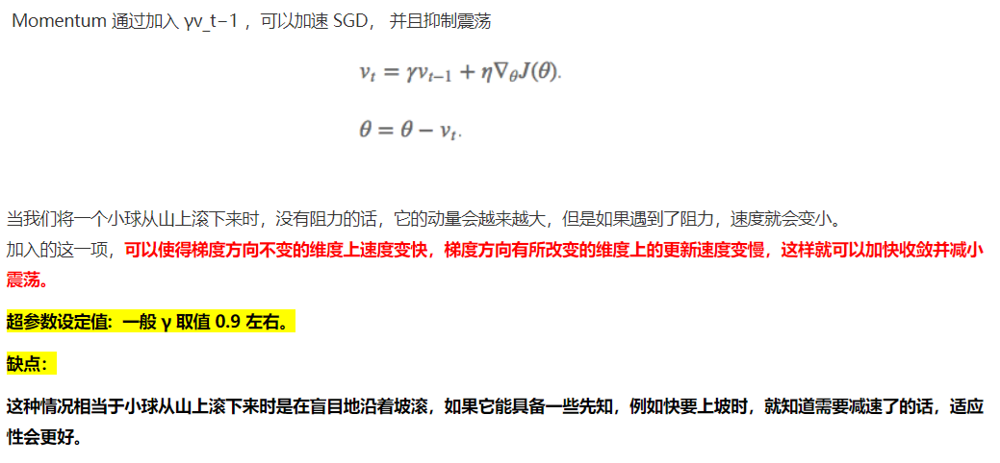

### **Adagrad （Adaptive gradient algorithm）**

这个算法就可以对低频的参数做较大的更新，对高频的做较小的更新，能够自适应地调整每个参数的学习率，也因此，对于稀疏的数据它的表现很好，很好地提高了 SGD 的鲁棒性

对于每一个参数 θ，Adagrad 都会计算从训练开始到当前时刻为止的所有梯度的平方和，即G：

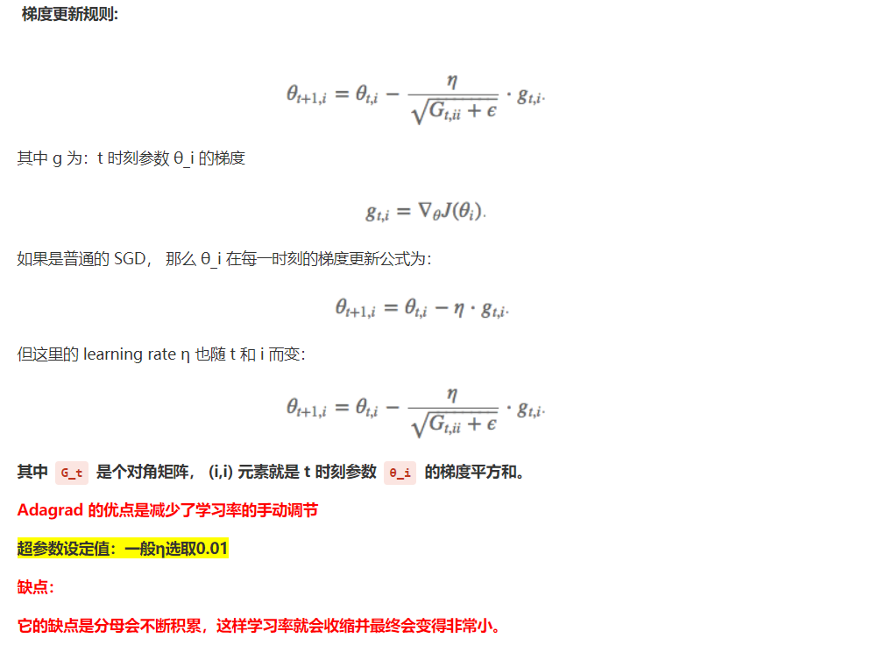

### **Adadelta**

和 Adagrad 相比，就是分母的 G 换成了过去的梯度平方的衰减平均值，指数衰减平均值

Adadelta 通过引入一个衰减率和一个滑动窗口来计算梯度的均方值，从而限制累积的梯度平方和的增长速度。这使得 Adadelta 能够在训练过程中保持学习率的动态调整，而不会像 Adagrad 那样过早地停滞。

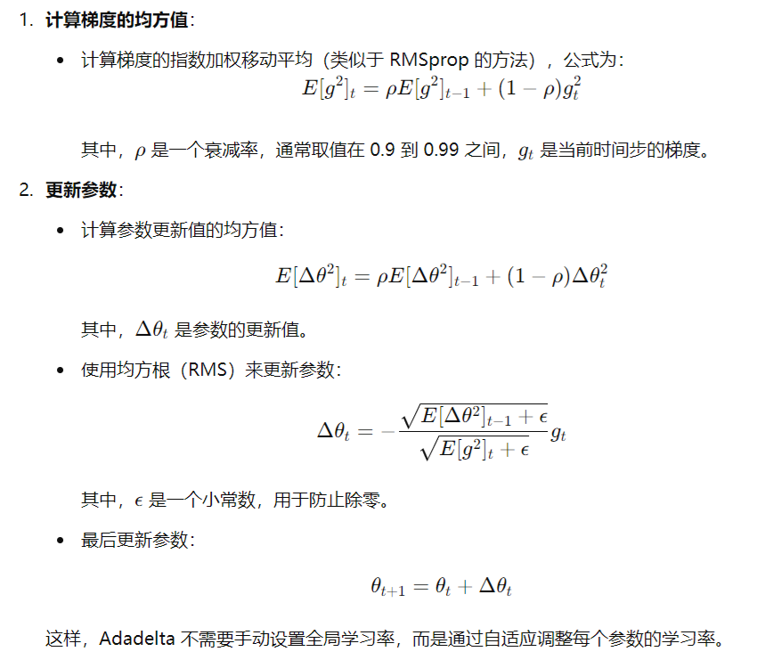

### **RMSprop：**

RMSprop 通过维护梯度平方的指数加权移动平均来调整每个参数的学习率。这种方法确保了即使在较长时间的训练过程中，学习率也不会迅速减小，从而可以持续进行有效的学习。

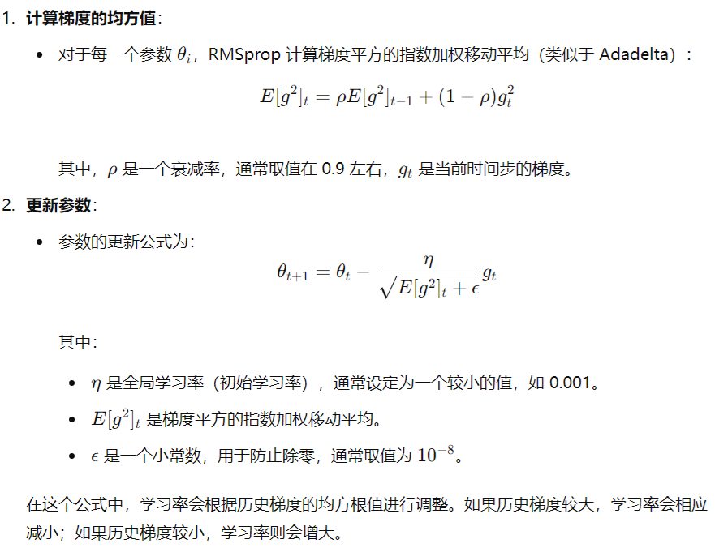

### Adam

结合了Momentum和 RMSprop

Adam 使用了梯度的一阶动量和二阶动量来动态调整每个参数的学习率

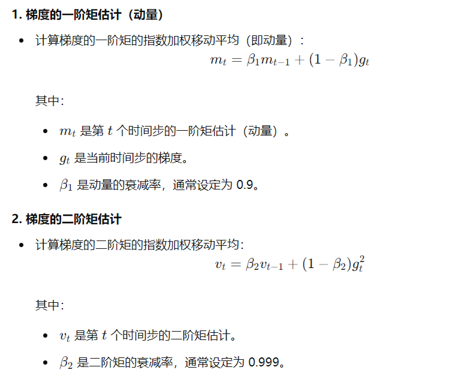

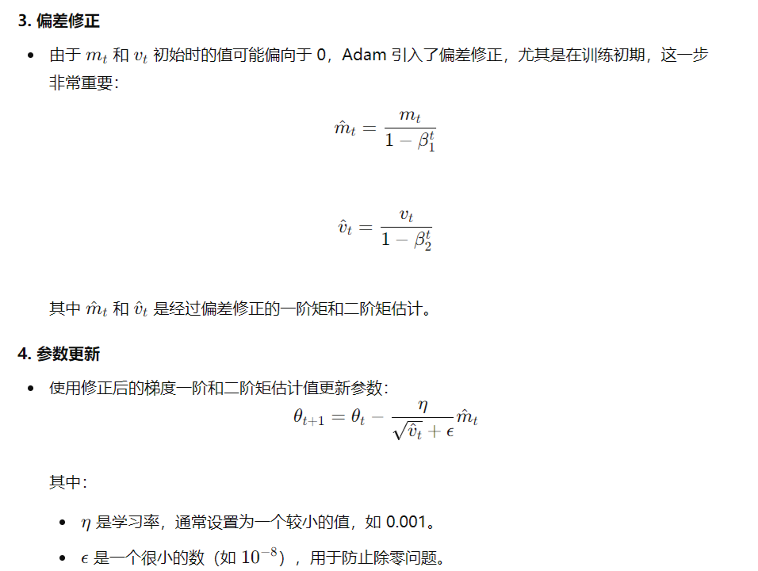

Adam 的优点

1. 自适应学习率：Adam 自适应地调整每个参数的学习率，结合了 RMSprop 的优点，使得在处理稀疏梯度或具有噪声的梯度时表现出色。

2. 动量的引入：Adam 引入了动量的概念，通过使用一阶矩估计（动量），有效地加速了训练过程，并减少了梯度振荡。

3. 偏差修正：通过偏差修正，Adam 在训练的早期阶段能够更准确地估计梯度一阶和二阶矩，避免了初始偏差问题。

4. 广泛适用性：Adam 几乎可以在所有深度学习任务中表现良好，包括卷积神经网络（CNNs）、循环神经网络（RNNs）等，成为很多深度学习框架中的默认优化器。

Adam 的缺点

1. 超参数敏感性：尽管 Adam 在大多数情况下表现良好，但它对超参数（如学习率、动量系数等）的选择仍然比较敏感。如果超参数选择不当，可能会导致模型收敛不稳定。

2. 收敛问题：在一些特定任务中，Adam 的收敛速度较快，但有时可能收敛到一个次优解。因此，一些改进版的 Adam，如 AdamW（引入权重衰减的 Adam）等，试图解决这一问题。

## 归一化：

1. Batch Normalization适用于CNN等有大mini-batch的模型

**原因**：BN在 mini-batch 维度上进行归一化，主要通过对 mini-batch 内的所有样本求均值和方差来消除内部协变量偏移。具体适用原因包括：

* **空间维度共享**：在卷积神经网络（CNN）中，特征图的每个通道都是在空间维度上共享的，即相同的卷积核在图像的不同位置都应用相同的参数。因此，BN可以通过 mini-batch 中所有样本的同一通道来计算统计量，从而加速模型收敛。

* **对大 mini-batch 敏感**：BN 依赖 mini-batch 的均值和方差作为归一化统计量，因此在 mini-batch 较大时，统计量更为稳定且估计更准确。而 CNN 等模型通常能够处理较大的 mini-batch，因此在这些模型中效果最佳。

* **内存优化**：在 CNN 中，BN 的 mini-batch 统计量可在并行计算中快速更新，减少计算瓶颈。这使得 BN 尤其适合处理图像任务。

**适用效果**：在 CNN 和深度全连接网络（DNN）中，BN 能有效减少偏移，抑制梯度消失/爆炸，加速收敛。

* Layer Normalization适用于RNN等依赖单个样本特征的模型

**原因**：LN 不依赖 mini-batch 统计量，而是对每个样本的特征维度进行归一化，适合序列处理模型，如 RNN 和 Transformer。主要原因有：

* **处理时序依赖性**：RNN 依赖序列的时序信息，在每个时间步共享相同的参数。而 BN 由于需要在 mini-batch 维度上计算均值和方差，无法在时间序列中单独应用。这导致 BN 难以应用于序列模型，因为每个时间步的 mini-batch 统计信息可能会相差较大，影响模型效果。

* **不依赖 batch size**：LN 在特征维度上归一化，计算的是每个样本自身的均值和方差。因此，LN 不依赖于 mini-batch 大小，适合于小 mini-batch，甚至是 batch size 为 1 的情况。RNN 和 NLP 模型在很多任务中需要小的 mini-batch，这使得 LN 更适合此类任务。

* **个体特征归一化**：在 NLP 等任务中，每个样本（句子、序列等）的特征差异性较大。LN 能更好地捕捉和归一化每个样本的个体特征，而不会受到 mini-batch 内其他样本的干扰。

**适用效果**：在 NLP 和序列数据任务中，LN 能提供更稳定的归一化效果，保持序列依赖性，适合小 batch 或逐步处理的情景。

### Batch Normalization：

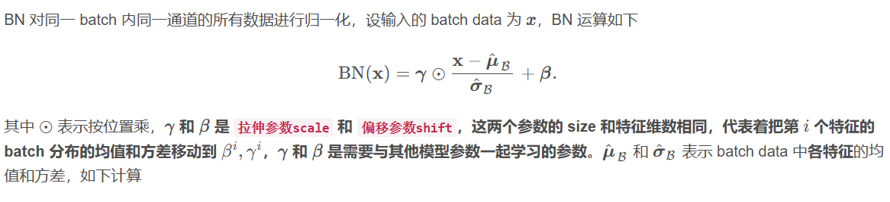

数据间操作，所以不适用于变长数据

训练过程中会有额外学习参数

测试过程中

1.用训练集中的均值和方差做测试集中均值和方差的无偏估计

2.移动平均法(Moving Average)

好处：

（1）BN使得网络中每层输入数据的分布相对稳定，加速模型学习速度

（2）BN使得模型对网络中的参数不那么敏感，简化调参过程，使得网络学习更加稳定

（3）BN允许网络使用饱和性激活函数（例如sigmoid，tanh等），缓解梯度消失问题

（4）BN具有一定的正则化效果

### Layer Normalization：

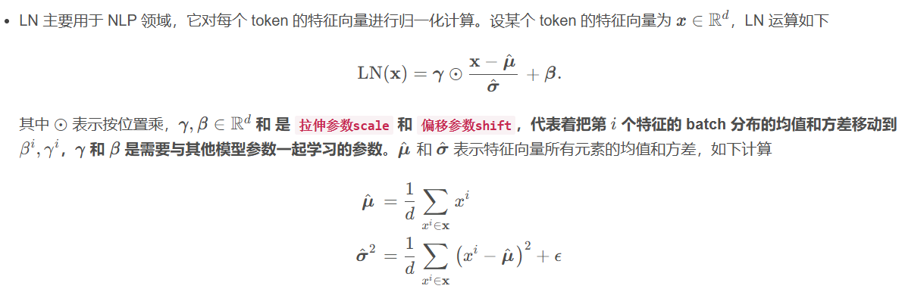

在整条数据进行

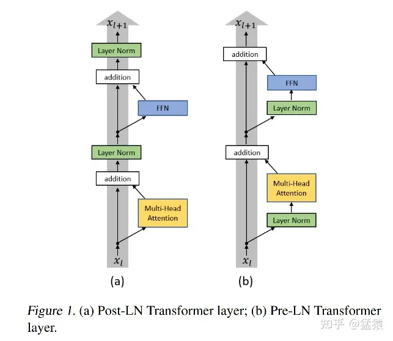

* Post-Norm会削弱残差的作用，深度保持，但是收敛和调参困难

* Pre-Norm会将网络变成浅且宽的结构，收敛容易，但是精度会有一定损失

### RMSNorm：

RMSNorm 是 LayerNorm 的一个简单变体，来自 2019 年的论文 Root Mean Square Layer Normalization，被 T5 和当前流行 lamma 模型所使用。其提出的动机是 LayerNorm 运算量比较大，所提出的RMSNorm 性能和 LayerNorm 相当，但是可以节省7%到64%的运算

RMSNorm和LayerNorm的主要区别在于RMSNorm不需要同时计算均值和方差两个统计量，而只需要计算均方根 Root Mean Square 这一个统计量，公式如下

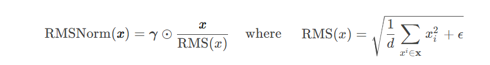

