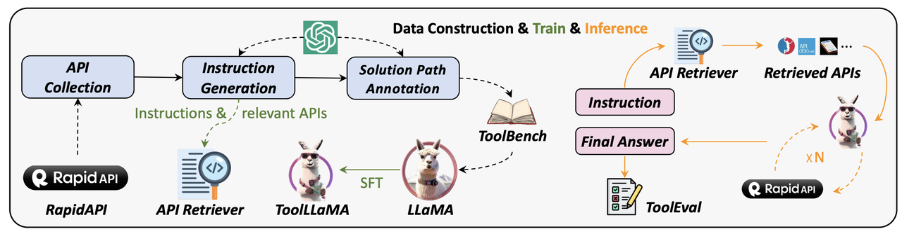
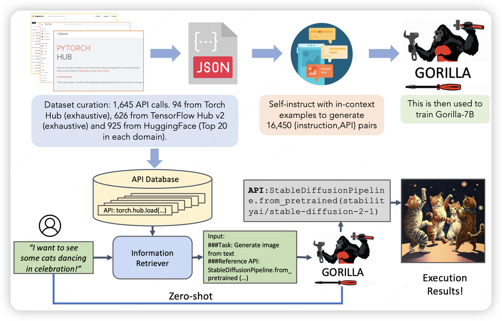
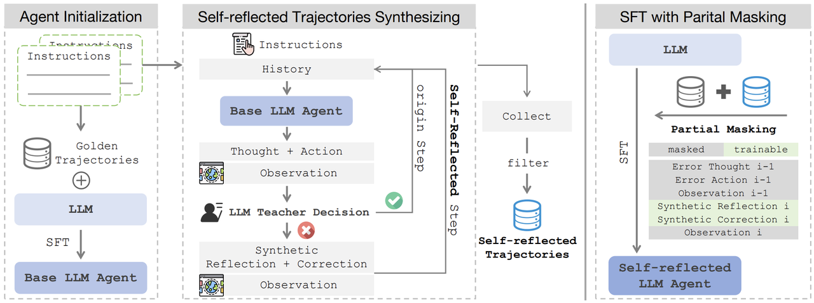
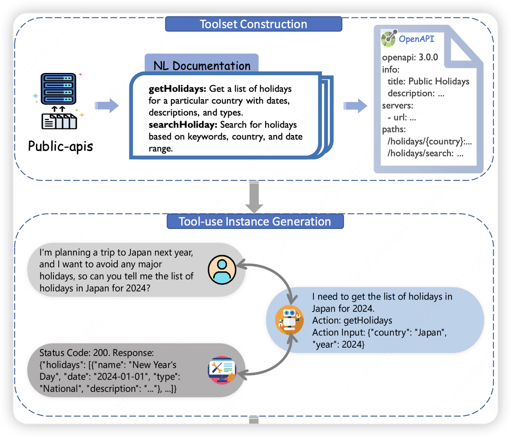
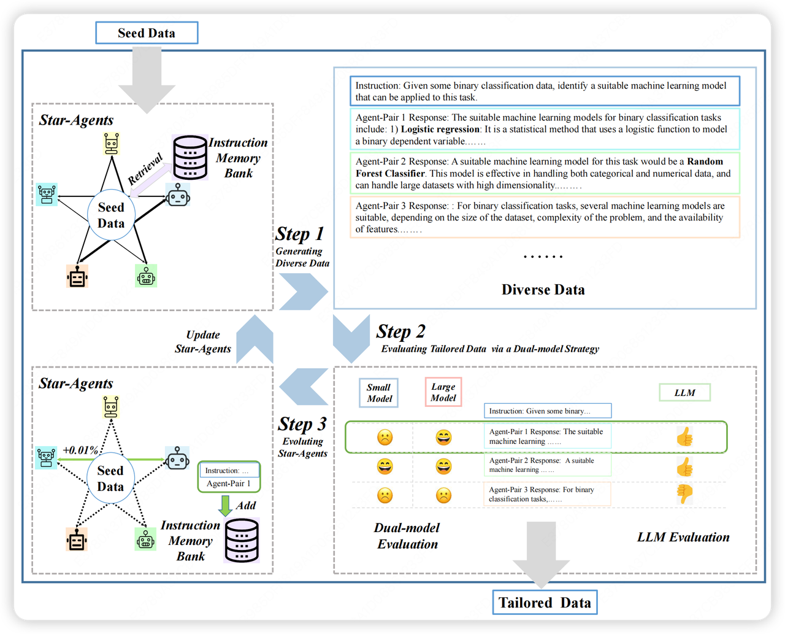
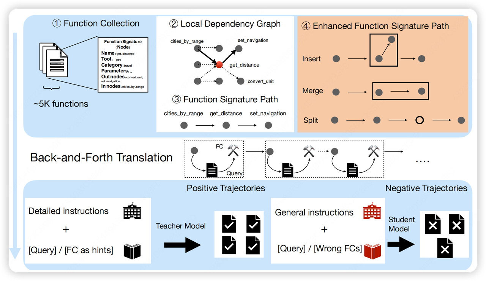
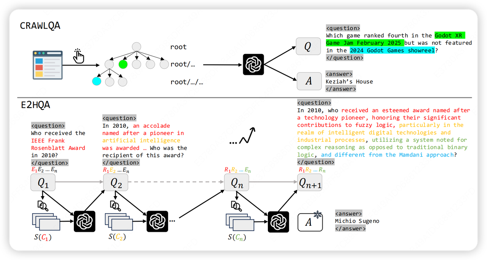
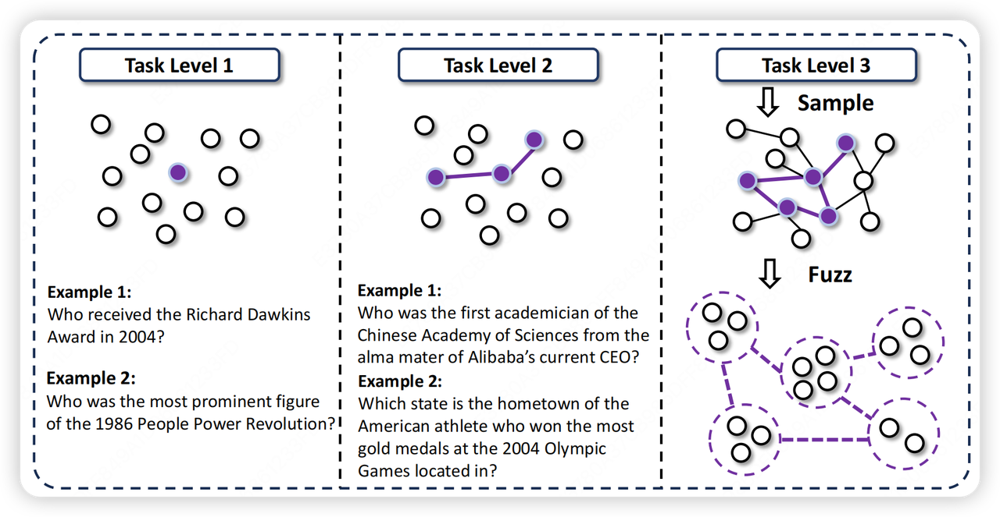

## 一、tool-use数据合成的重要性

对于agent而言，function call能力是大模型从“会说话”向“会解决问题”转化的核心能力，而tool-use数据构成了这一能力学习的基础。没有充分反映真实工具行为和交互模式的数据，模型难以掌握在实际环境中选择合适工具、构造调用参数并对结果进行有效校验的能力。

现实世界中工具调用往往成本高、调用样本稀少且场景复杂，单靠真实交互难以覆盖足够的任务空间并得到稳定、可泛化的学习信号。因此，大规模、可控且低成本的数据合成成为最有效的补充手段。通过系统化的数据合成，模型可以在多样化任务中练习工具选择、参数生成与结果验证等技能，并在多步骤任务中提升决策一致性与鲁棒性，降低因数据稀疏带来的过拟合与偏差风险。

在面向 agent 的应用场景中，合成数据应特别注重模拟多轮对话、工具调用及其对应的action–feedback轨迹，以训练模型在连续决策链中合理编排工具并保持语境连贯与状态一致性。

* **tool-use合成技术发展的思维导图（展开）**

  

## 二、 常见技术流

### 2.1 prompt驱动

* **核心点**：利用 LLM API 根据提示自动生成工具使用任务和解决方案。典型做法是收集或设计一定量的工具API，然后通过Prompt要求模型编&#x5199;**&#x20;用户指令** 及相应的**工具调用链**。

#### ToolLLM

**做法**：首先从RapidAPI收集了16464个真实RESTful API；然后用 LLM 生成多样的指令和调用序列；并采用深度优先搜索算法扩展推理路径。

**优点**：是成本低、易扩展，可快速覆盖大规模API库

**缺点**：生成质量受限于基础LLM，易出现指令不切题或参数错误等幻觉现象

#### Gorilla

**做法**：抓取 HuggingFace、TorchHub、TensorHub 三大平台的 1645 个独特 API，提取其功能、参数、示例代码等信息并标准化为统一json格式。借助 Self-Instruct ，用 GPT-4 为每个 API 生成 10 条真实场景指令，最终形成约 1.6 万条指令 - API 对的数据集

### 2.2 Self-play

* **核心点**：让模型在内部模拟交互或反思，生成高质量的交互轨迹，LLM可能扮演用户和助手双方或主动自我反思。

#### STeP

**做法**：在生成训练轨迹时引入“自我反思”。

1）首先用教师模型对LLM生成的工具调用序列进行实时检验，若发现错误则让教师模型写出纠错推理和修正操作。这样产生的自我反思轨迹包含对错误步骤的分析与修正。

2）过滤出成功完成任务（奖励 r=1）且包含反思 - 校正步骤的轨迹，构成自反思轨迹集

3）引入部分掩码策略：在训练中对轨迹中标记的错误步骤 $$（ŷⱼ, âⱼ）$$进行掩码，不计算该步骤的损失，防止模型内化错误的思考和动作。

#### ToolAlpaca

**做法**：

1）从public-apis等开源库抓取工具名及简描，最终整合50类、400+个真实世界工具API，覆盖多领域以保证多样性。

2）借大模型能力扩展信息，先将简描扩为含工具函数、输入要求的自然语言文档，再转为规范的结构化文档。

3）拆分三大核心智能体

* 用户智能体：依据工具文档生成多样任务指令，补充指令缺失信息；

* 助理智能体（核心）：接收指令后决策工具/函数调用方案，向工具执行器发请求，最终整合结果生成回复；

* 工具执行智能体：按OpenAPI规范模拟工具运行，返回调用结果。

### 2.3 模拟环境

* **核心点**：构建虚拟环境，将工具调用场景具象化，也是目前最主流的数据合成技术

#### Star-Agents

**做法**：

1）采用 Agent-Pair 策略生成数据，并根据生成样本的质量动态更新采样概率。如果某一Agent-Pair 生成了高质量的样本，其在下一轮迭代中被选中的概率会增加，从而优先选用更有效的 LLM 来增强整体数据质量

2）通过比较大型模型和小型模型在指令遵循难度（IFD）上的差异来评估样本的难度指标 $$ π_{dual}$$。

3）为了避免仅基于相对难度的度量（如  $$ π_{dual}$$）引入的低质量噪声数据，框架引入了LLM 作为裁判来评估数据样本的生成质量，给出量化的分数

#### Magnet

**做法：**

1.）基于图的 FSP 构建：Magnet 从图的视角构建多轮函数签名路径，这为多轮调用中的逻辑结构提供了清晰的骨干。

2）节点操作增强 FSP ：insert、Merge、Split三种操作来模拟多轮调用中的复杂性和错误场景，例如将连续两轮调用合并以创建多步调用，或模拟参数缺失/不相关函数场景。

3）往复翻译：这是核心的迭代机制。首先通过反向翻译 将 FSP 转化为用户查询，然后通过正向翻译将查询转化为带有实际参数的可执行函数调用参考。这一迭代确保了后继轮次的输入参数依赖于前一轮的输出。

4\. 基于提示的上下文蒸馏：利用教师 LLM来构建轨迹。

* 正向轨迹：在查询中添加正确的 *FC* 作为提示，指导教师模型生成准确的执行轨迹。

* 负向轨迹：故意引入从 SFT 模型错误中收集的误导性错误 *FC* 作为提示，从而构建具有明显对比度的负向轨迹，用于后续的 mDPO偏好学习

#### WebDancer

**做法：**

1）双重数据合成策略：

* CRAWLQA：模仿人类浏览行为，递归爬取专业网站内容，并利用 GPT-4o 合成特定类型（如 COUNT, MULTI-HOP）的 QA 对。

* E2HQA（易到难 QA）：通过迭代演化初始简单问题，使其逐步复杂化，生成多步推理任务。

2）双 CoT 构造：使用强大的 LLM 生成Short CoT，并使用大推理模型生成包含详细中间推理步骤的Long CoT作为监督信号。

3）两阶段训练：先使用 RFT进行冷启动，训练模型掌握基本的 ReAct 框架和工具使用能力，随后使用 DAPO 进行在线策略 RL 优化，以增强泛化能力

**WebSailor**

**做法：**

1） SailorFog-QA 数据合成：通过子图采样和信息混淆生成具有高初始不确定性的 Level 3 复杂问题。混淆技术将精确事实转化为模糊描述，迫使 Agent 必须进行多步推理和信息合成，而非简单的查找。

2） 严格的轨迹过滤：仅保留正确最终答案、长度不超过 32k tokens 且工具调用次数大于 5 次的复杂轨迹用于 RFT 冷启动。

3） DUPO 强化学习：引入DUPO算法，通过重复采样机制来解决批次中所有 Roll-out 结果一致（即标准差为 0）的案例，从而在稀疏奖励环境中提高样本效率和稳定性。

4\. 奖励机制：采用Rule-based Reward，结合格式验证和答案验证，以防止奖励作弊。

