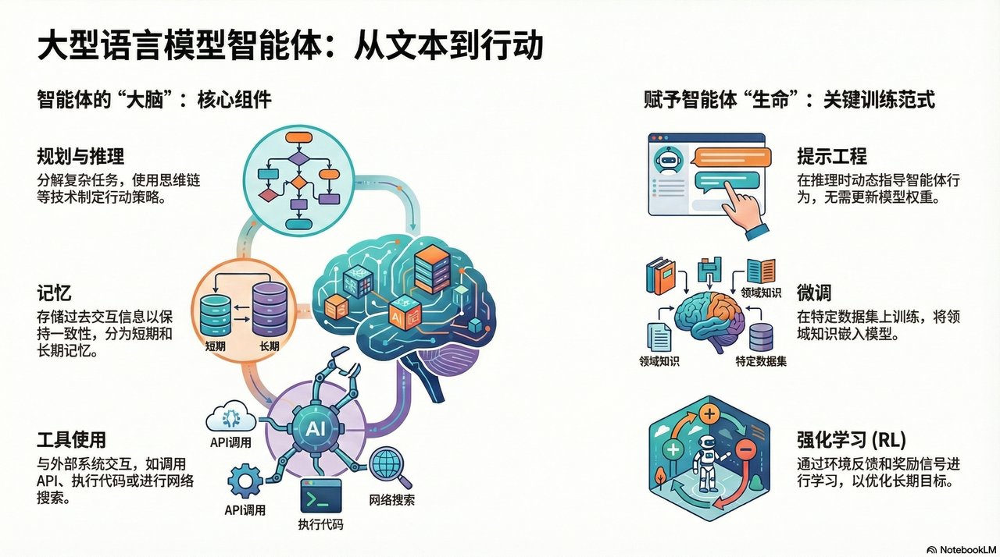
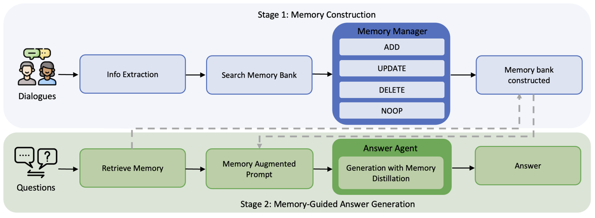
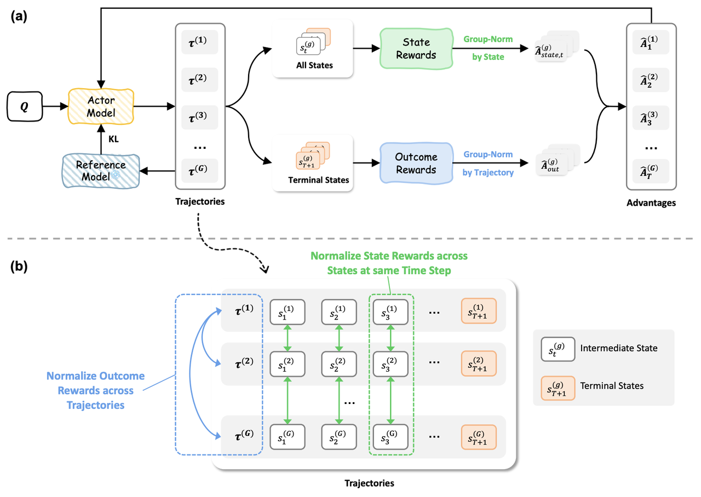
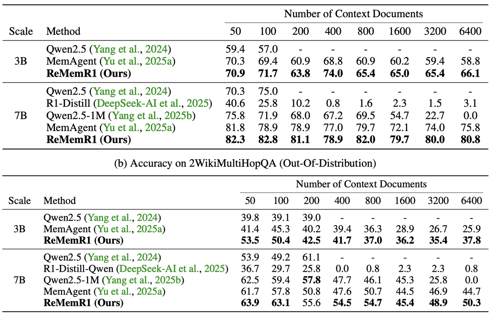

## 一、优化 Agentic 能力的背景

预训练阶段通常以自回归目标在海量文本语料上训练模型，使其掌握语言建模和基础知识。之后，通过SFT**将模型适配下游任务，即使用人类标注的数据对模型进行监督学习，使其具备更好的任务执行能力和指令遵循能力。**&#x518D;进一步，采用RLHF方法对模型进行对齐：通过人类偏好打分或评分系统，将任务完成的质量作为奖励，使用策略梯度算法迭代优化模型策略，以提升模型生成结果的正确性和安全性。

总体而言，预训练＋SFT＋RLHF 构成了当前LLM训练的基础pipeline，而对于Agent来说，针对更复杂的 Agentic 问题往往还需要更多定制策略来克服有限长记忆、稀疏奖励、工具调用及环境等挑战。

**对于Agentic能力的提升，主要分为 mid-training 阶段的的原生agentic能力增强，sft冷启动 和 RL提升pass@1的准确率。**

考虑到绝大部分人没有机会接触到 mid-training ，我们先聊聊如何从 SFT 和 RL 阶段提升 Agentic 能力。

## 二、记忆增强训练策略

**记忆感知增** 强旨在让 LLM 代理具备长期信息保留和利用能力。传统 LLM 本身是没有长期记忆的，面对多步任务时会遗忘早期信息。为此，不少工作提出了**将外部记忆模块与模型结合的方案**，并使用强化学习来训练记忆操作策略。

### **代表工作1**： **`Memory-R1 `**

**论文地址**：https://arxiv.org/abs/2508.19828

**核心点**：设计了 **Memory Manager 和 Answer Agent两个主模块，**&#x5BF9;流入信息执行结构化操作集合` {ADD, UPDATE, DELETE, NOOP}`，决定哪些新观测/对话片段要落库、在哪些情况下替换或合并已有记忆等；同时可以在查询时对检索出的候选记忆进行筛选/重排序（，并基于筛选后的记忆与当前上下文产生最终答案。

* **算法框架图（展开）**

  

**训练相关**：

* **算法策略**： 使用 outcome-driven RL来对 Memory Manager 与 Answer Agent 进行 fine-tune。

  * **关键思想**：以下游任务最终结果（例如 QA 准确率、F1、BLEU 或对话质量指标）作为回报信号，训练 agent 学会在长期交互中做出对最终效果有利的记忆决策。

  * **算法细节**：

    * Answer Agent 策略表示： $y \sim \pi_{\text{ans}}(\cdot \mid q,\, \mathcal{M}_{\text{ret}})$

    * 基于 Exact Match 的奖励信号： $R_{\text{answer}} = \text{EM}(y_{\text{pred}}, y_{\text{gold}})$

    * 更新策略： $\rho_\theta(q, \mathcal{M}_{\text{ret}}) = \frac{\pi_\theta(y \mid q, \mathcal{M}_{\text{ret}})}{\pi_{\text{old}}(y \mid q, \mathcal{M}_{\text{ret}})}$

  * **奖励设计**：Reward 既包含对最终答案质量的即时评估（例如回答是否正确），也可能包含稀疏的长期奖励（例如后续对话中该记忆是否被复用、是否导致错误）。合适的 reward shaping 对于稳定训练并避免短视（myopic）策略非常重要。

**实验收益**：论文宣称在少量标注下也能取得明显收益，说明 outcome-driven RL 在“对记忆操作有稀疏监督”的场景里较为数据高效（但注意这类评价受具体任务/benchmark影响）。

### **代表工作2：`ReMemR1`**&#x20;

**论文地址**：https://arxiv.org/pdf/2509.23040

**核心点**：通过引入**Revisitable的记忆机制**和**多级奖励强化学习（RLMLR）**&#x6765;解决传统长上下文模型的**单向记忆不可逆性，**&#x5373;模型一旦读过某段信息，如果当时没意识到其重要性，后续就很难再“回想”起来。

* **算法框架图（展开）**

  

**训练相关：**

* **算法策略**：由于长文档问答通常只有在最后输出答案时才能获得 Sparse Reward ，中间漫长的检索和推理过程缺乏监督。ReMemR1 使用 PPO (Proximal Policy Optimization) 或类似的策略梯度算法进行微调。目标函数为最大化期望累积奖励：**&#x20;**$J(\theta) = \mathbb{E}_{\tau \sim \pi_\theta} \left[ \sum_{t=0}^{T} \gamma^t \left( R_{\text{outcome}} + \lambda R_{step}(t) \right) \right]$

* 奖励设计： 由 结果奖励 和 过程奖励 组成 $R_{\text{total}} = R_{\text{outcome}} + \lambda \sum_{t=1}^{T} R_{\text{step}}(s_t, a_t)$。

  * $R_{\text{outcome}}$ ：最终答案 $y$与 $y^{*}$的匹配程度 $R_{\text{outcome}} = \mathbb{I}(y = y^*)$

  * $R_{step}(t)$：每一步的密集奖励，用于指导 Agent 何时该“读”，何时该“回顾”，何时该“回答”。

  假设在 $t$ 时刻，Agent 执行了检索操作 $a_t$，检索到的内容为 $c_t$，真实证据集合为 $E_{gold}$，则过程奖励可以形式化为：

  &#x20; $R_{step}(t) = 
  \begin{cases} 
  +r_{hit}, & \text{if } c_t \cap E_{gold} \neq \emptyset \\
  -r_{cost}, & \text{if } a_t \text{ is redundant/hallucinated}
  \end{cases}$

**实验收益**：打破了模型在处理长文档的记忆遗忘问题，并在跨度极大的多跳推理任务上显著超越传统 RAG 和长窗口模型。通过RL，agent学会了按需回头看，在大幅提升证据召回率和答案准确性的同时，相比全量上下文输入节省了约 40% 的 Token 开销，实现了高精度（准确找回细节）与高效率（不盲目阅读）的最佳平衡。

* **实验效果（展开）**

  

## 三、课程学习与自适应采样

## 四、RL训练策略

### 4.1 tool- use能力增强

### 4.2 multi-agent 训练

