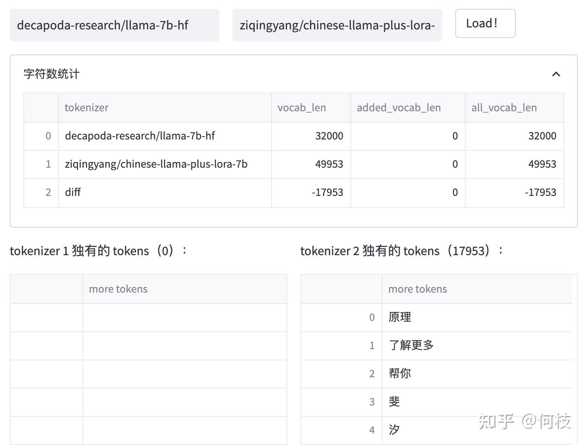
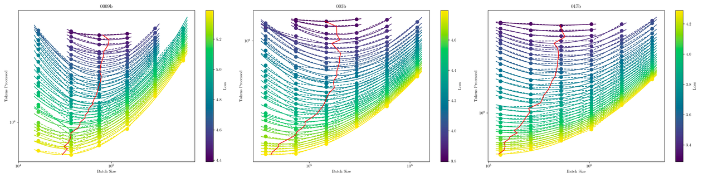
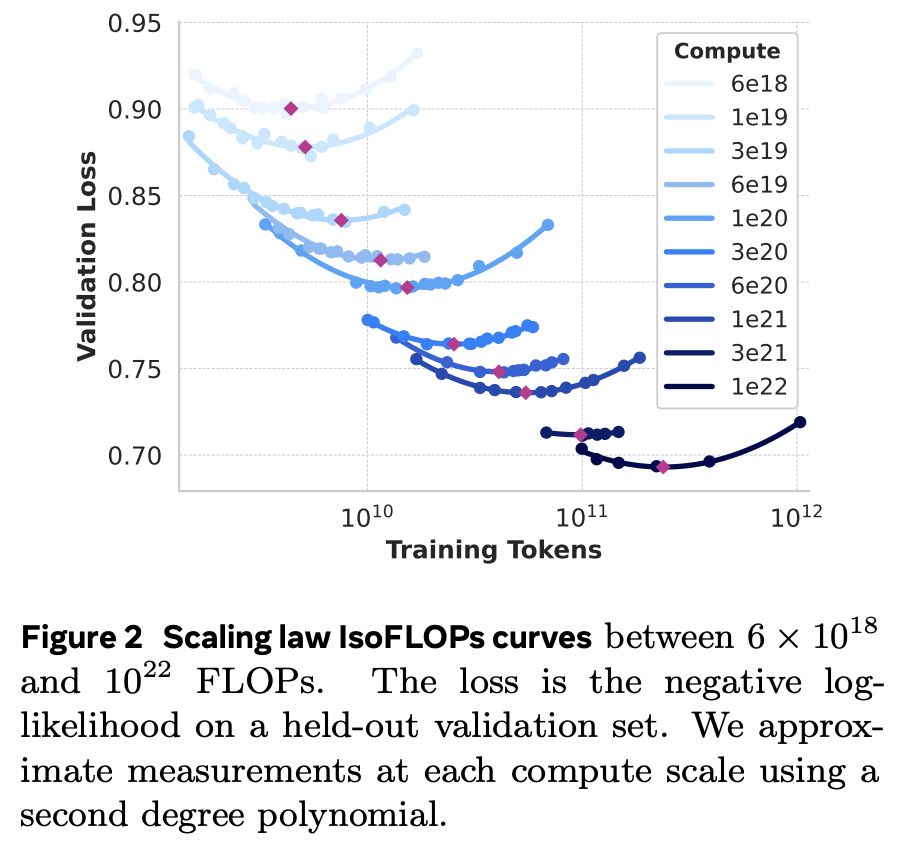
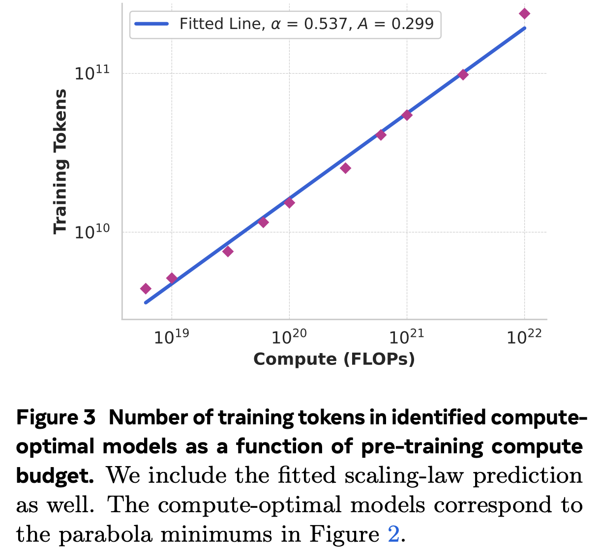
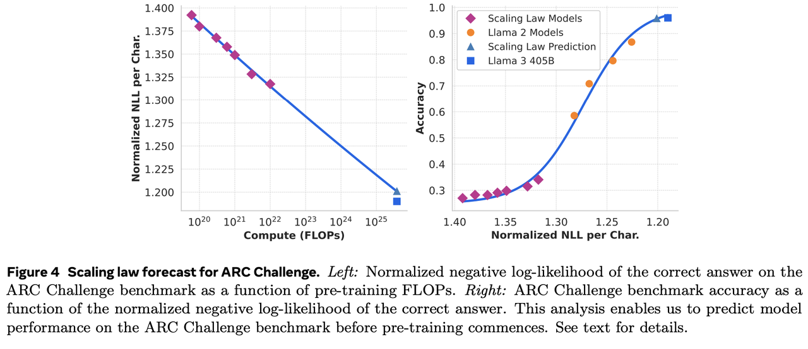
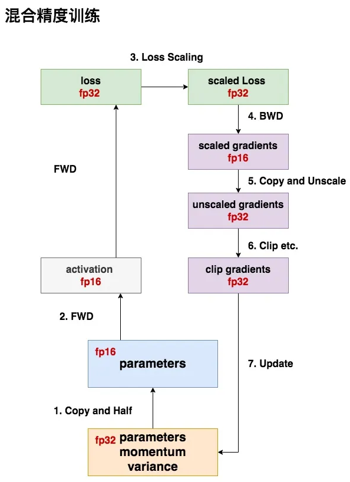
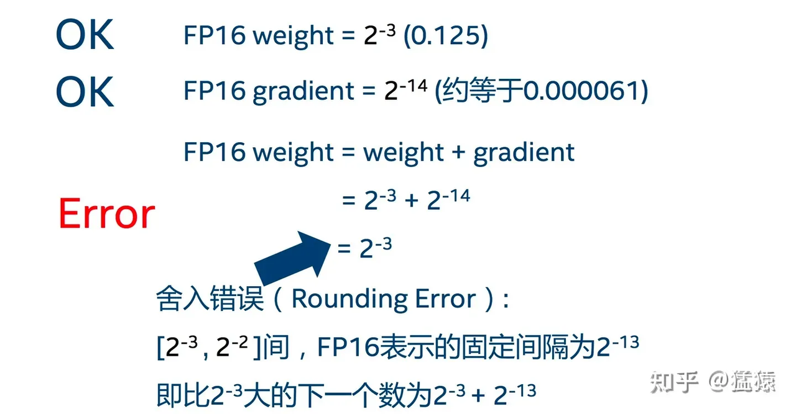
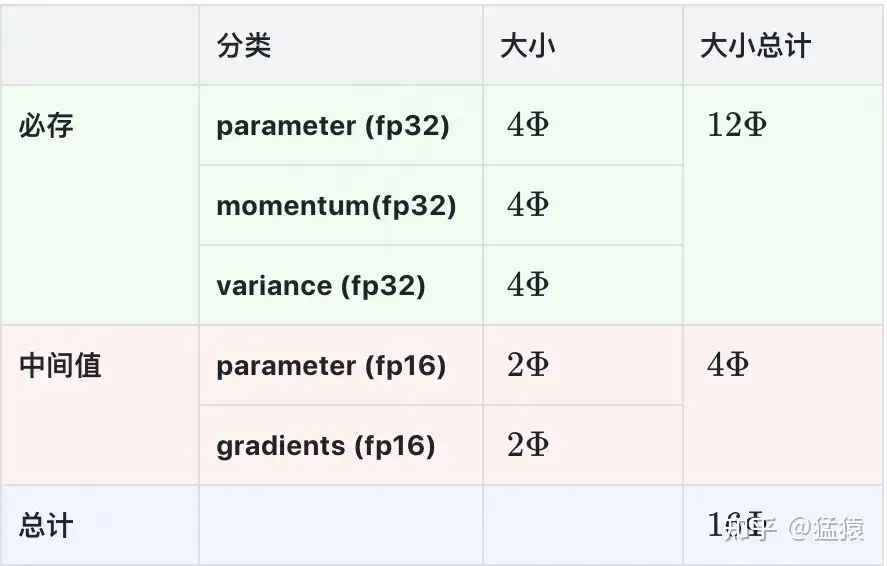

# **2.3.1 训练Tokenizer**

> 在进行预训练之前，我们需要先选择一个预训练的模型基座。根据收集到的数据以及具体需求，训练一个 tokenizer。在收集到的数据集以及更大的通用数据集上，利用 BPE / BBPE / WordPiece 算法进行训练。一个较为普遍的问题是：**大部分优秀的语言模型都没有进行充分的中文预训练（这段话在2024年可能是对的，但是在2025年有DeepseekR1这样比较优秀的中文能力大模型存在，这句话可以选择性理解）**。因此，许多工作都尝试将在英语上表现比较优秀的模型用中文语料进行二次预训练，期望其能够将英语上的优秀能力迁移到中文任务中来。通俗来讲，tokenizer 的目的就是将一句话进行切词，并将切好词的列表喂给模型进行训练。例如：你好世界 >>> \['你', '好', '世', '界']

## **切词技巧**

> 至于怎么训 tokenizer：找一个内存空间很大的 cpu 机器，再找一份很大的 common 数据集，然后利用 BPE / BBPE 算法去跑，这里提醒一些细节：
>
> * **数字切分**（避免 9.9 > 9.11 的问题回答不正确)
>
> * **控制压缩率**，1 个 token 对应多少个汉字：压缩率太低，那就是字太多、词太少，很影响解码效率；压缩率太大，也就是词太多，又会影响模型的知识能力。通常，压缩率越低的模型，loss 也会低，大部份中文大模型的1 个 token 会映射成 1.5 个汉字左右
>
> * **手动移除脏的、敏感token**
>
> * 如果提前知道自己的业务场景，那就应该**补充业务场景对应的 token**，增加业务场景文本的压缩率，比如医疗场景，就提前把阿莫西林、青霉素等作为一个 token
>
> * **词表的中、英覆盖率要足够大**，至于其他小语种是否要加，则看业务需求
>
> * tokenizer 的**词表大小vocab\_size 和模型的 embedding\_size 之间，要有一千个左右的余量，后续的对齐环节，需要大量在 pretrain 阶段没见过的全新 token 来做训练**

## **词表扩充**

> 为了降低模型的训练难度，通常会考虑在原来的词表上进行**词表扩充**，也就是将一些常见的汉字 token 手动添加到原来的 tokenizer 中，从而降低模型的训练难度。对比 **Chinese-LLaMA和LLaMA&#x20;**&#x4E4B;间的 tokenizer 的区别如下图
>
> 可以发现：**Chinese LLaMA 在原始 tokenizer 上新增了17953 个 tokens，且加入 token 的大部分为汉字**。而在 **[BELLE](https://arxiv.org/pdf/2304.07854)&#x20;**&#x4E2D;也有同样的做法：在 120w 行中文文本上训练出一个 5w 规模的 token 集合，并将这部分 token 集合与原来的 LLaMA 词表做合并，最后再在 3.2B 的中文语料上对这部分新扩展的 token embedding 做二次预训练



# **2.3.2 确定模型结构和参数**

> 模型结构一般就使用**Llama架构，也就是RoPE + GQA + RMSNorm + SwiGLU，模型参数则根据拥有的训练资源进行选择。**&#x4E0B;表是模型大小对应所需资源的简要示意图：

| **Method**                      | **Bits** | **7B** | **14B** | **30B** | **70B** | **`x`B** |
| ------------------------------- | -------- | ------ | ------- | ------- | ------- | -------- |
| Full (`fp32`)                   | 32       | 120GB  | 240GB   | 600GB   | 1200GB  | `～18x`GB |
| Full (`pure_bf16`)              | 16       | 60GB   | 120GB   | 300GB   | 600GB   | `～8x`GB  |
| Freeze/LoRA/GaLore/APOLLO/BAdam | 16       | 16GB   | 32GB    | 64GB    | 160GB   | `～2x`GB  |
| QLoRA                           | 8        | 10GB   | 20GB    | 40GB    | 80GB    | `～x`GB   |
| QLoRA                           | 4        | 6GB    | 12GB    | 24GB    | 48GB    | `～x/2`GB |
| QLoRA                           | 2        | 4GB    | 8GB     | 16GB    | 24GB    | `～x/4`GB |

# **2.3.3 训练框架选择**

> 预训练框架尽量选择`Megatron-LM`，如果模型是Qwen，建议用`Pai-Megatron-Patch`项目地址：https://github.com/alibaba/Pai-Megatron-Patch。尽量别用deepspeed做训练（所以别用OpenRLHF和DeepSpeed-Chat做预训练）
>
> ### **为什么这样选择？**
>
> 1. **训练速度快：**&#x74;ensor\_parallel 和 pipeline\_parallel 被优化的炉火纯青，rope 已经被开发成了 apex 算子，速度远高于 llama 里的实现方案，据说 mlp 层的 apex 算子也正在开发
>
> 2. **参数清晰而明确：**&#x61;rgument.py 里，你能看见上百个参数配置，哪些层使用 dropout 等细节，训练框架早就帮你考虑好了，可微操的空间很大
>
> 3. 启动训练的时候模型加载速度快，千亿级别的模型一分钟就加载完毕了，debug 十分方便

# **2.3.4 预训练策略**

> 多多参考**MiniCPM，phi系列，DeepSeekMath**的训练方式

## **最优batch\_size**

> `batch_size`决定了模型的收敛速度和消耗计算资源的平衡。`batch_size`过大，达到一定的损失消耗的数据量和计算量都会很大，而`batch_size`过小，则需要消耗过多的训练步数，且有可能损失函数下降有限。0.009B，0.036B，0.17B的模型上分别进行了6个batchsize的训练实验，结果记录如下图
>
> `batch_size`关于C4 Loss的规律：$$B S=\frac{1.2110 \times 10^9}{L^{6.2393}}$$



## **WSD调度器**

> 大部分训练阶段分为：**快速收敛、平稳、退火三个阶段**。在退火阶段，我们加入高质量数据，一般采用余弦退火算法进行训练。minCPM提出了WSD调度器。这种学习率调度器分为三个阶段，warmup阶段（用W表示warmup阶段结束时的步数/训练量），稳定训练阶段（用S表示稳定训练阶段结束时的步数/训练量），退火阶段（用D表示退火阶段的训练量）。这种调度器可以写为：
>
> $$\operatorname{lr}(s)=\left\{\begin{array}{l}
> \frac{s}{W} * \eta, s<W \\
> \eta, W<s<S \\
> f(s-S) * \eta, S<s<S+D
> \end{array}\right.$$
>
> 其中 $$0<f(s−S)≤1$$是一个关于$$s$$的减函数，*η*是最大学习率。这种策略有四个好处：**可以持续训练、可以随时取出、性能优于Cosine LRS(Learning Rate Schedule)、有显式区分的训练阶段，便于使用不同的数据策略**

## **预训练Trick**

> * **提升训练效率：**&#x43;PT的训练时长一般在1个月以上，在显存够用的情况下，能不引入 tensor\_parallel，pipeline\_parallel，sequence\_parallel 就不要去引入，同样地、能不开 offload 就不要开 offload，能不开重算就不开重算
>
> * **加入指令数据：**&#x76EE;前看来指令数据占比越高越好

## **训练设置**

> pretrain 训练流程目前基本是固定的，当训练数据和训练代码都准备就绪后，按照以下四个流程来设置学习率和超参数就可以啦：
>
> * 开局 warmup，学习率缓慢上升到最大
>
> * 中间 cos / cos\_decay / constant / constant\_decay ，学习率比较大，是否 decay 看情况决定，多翻翻别人的技术报告，或者在小模型上做实验决定
>
> * 后期 改变 RoPE 的 base 频率，增加文本长度，开始让模型适应长文本
>
> * 收尾 anneal，用高精数据、IFT数据等来给强化模型的考试能力，做完退火就该上考场刷 benchmark 了
>
> **总结一下，一般来说预训练也通常会用两阶段或者多阶段的训练流程，先在全部语料上训练，然后在小部分长文本上训练，最后在小部分高质量数据上退火训练**

```bash
#!/bin/bash
set -e
ENV=$1
CURRENT_DIR="$( cd "$( dirname "$0" )" && pwd )"
MEGATRON_PATH=$( dirname $( dirname ${CURRENT_DIR}))
export PYTHONPATH=${MEGATRON_PATH}:${MEGATRON_PATH}/PAI-Megatron-LM-240718:$PYTHONPATH
export CUDA_DEVICE_MAX_CONNECTIONS=1

# Here are some configs controled by env
if [ -z ${MP_DATASET_TYPE} ];then
    MP_DATASET_TYPE="idxmap"
fi

if [ -z ${MP_AC_LAYERS} ];then
    MP_AC_LAYERS=1
fi

if [ $ENV = dsw ]; then
    export CUDA_VISIBLE_DEVICES=0,1,2,3,4,5,6,7
    MASTER_ADDR=localhost
    MASTER_PORT=$(shuf -n 1 -i 10000-65535)
    NNODES=1
    NODE_RANK=0
    GPUS_PER_NODE=8
elif [ $ENV = dlc ]; then
    NNODES=${WORLD_SIZE}
    NODE_RANK=${RANK}
    GPUS_PER_NODE=${KUBERNETES_CONTAINER_RESOURCE_GPU}
fi

if [ -z ${MP_VP} ]; then
    vp_options=""
else
    vp_options=" \
        --num-layers-per-virtual-pipeline-stage ${MP_VP}"
fi

if [ -z ${MP_SFT_PACKING} ]; then
    MP_SFT_PACKING=false
fi


DISTRIBUTED_ARGS="--nproc_per_node $GPUS_PER_NODE --nnodes $NNODES --node_rank $NODE_RANK --master_addr $MASTER_ADDR --master_port $MASTER_PORT"

### BASE CONFIG ###
MODEL_SIZE=$2
BATCH_SIZE=$3
GLOBAL_BATCH_SIZE=$4
LR=$5
MIN_LR=$6
SEQ_LEN=$7
PAD_LEN=$8
PR=$9
### BASE CONFIG ###

### PARALLEL / BOOL OPTION ###
TP=${10}
PP=${11}
CP=${12}
EP=${13}
SP=${14}
DO=${15}
FL=${16}
SFT=${17}
### PARALLEL / BOOL OPTION ###

### OTHERS ###
AC=${18}
OPTIMIZER_OFFLOAD=${19}
SAVE_INTERVAL=${20}
DATASET_PATH=${21}
VALID_DATASET_PATH=${22}
PRETRAIN_CHECKPOINT_PATH=${23}

# the following two values will not be used when SFT is true
TRAIN_TOKENS=${24}
WARMUP_TOKENS=${25}
###############################

OUTPUT_BASEPATH=${26}
### OTHERS ###

if [ $FL = true ]; then
    export NVTE_FLASH_ATTN=1 NVTE_FUSED_ATTN=0
elif [ $FL = false ]; then
    export NVTE_FLASH_ATTN=0 NVTE_FUSED_ATTN=1
fi

if [ $MODEL_SIZE = 0.5B ]; then

NUM_LAYERS=24
HIDDEN_SIZE=896
NUM_ATTN_HEADS=14
INTERMEDIATE_SIZE=4864
NUM_KEY_VALUE_HEADS=2
MAX_POSITION_EMBEDDINGS=131072
EXTRA_VOCAB_SIZE=293
RMS_NORM_EPS=1e-6
gqa_options=" \
                    --group-query-attention \
                    --num-query-groups ${NUM_KEY_VALUE_HEADS}"


tie_option=""
moe_options=" \
            "


elif [ $MODEL_SIZE = 1.5B ]; then

NUM_LAYERS=28
HIDDEN_SIZE=1536
NUM_ATTN_HEADS=12
INTERMEDIATE_SIZE=8960
NUM_KEY_VALUE_HEADS=2
MAX_POSITION_EMBEDDINGS=131072
EXTRA_VOCAB_SIZE=293
RMS_NORM_EPS=1e-6
gqa_options=" \
                    --group-query-attention \
                    --num-query-groups ${NUM_KEY_VALUE_HEADS}"

tie_option=""
moe_options=" \
            "

elif [ $MODEL_SIZE = 7B ]; then

NUM_LAYERS=28
HIDDEN_SIZE=3584
NUM_ATTN_HEADS=28
INTERMEDIATE_SIZE=18944
NUM_KEY_VALUE_HEADS=4
MAX_POSITION_EMBEDDINGS=131072
EXTRA_VOCAB_SIZE=421
RMS_NORM_EPS=1e-6
gqa_options=" \
                    --group-query-attention \
                    --num-query-groups ${NUM_KEY_VALUE_HEADS}"

moe_options=" \
            "
tie_option=" \
        --untie-embeddings-and-output-weights \
        "


elif [ $MODEL_SIZE = 72B ]; then

NUM_LAYERS=80
HIDDEN_SIZE=8192
NUM_ATTN_HEADS=64
INTERMEDIATE_SIZE=29568
NUM_KEY_VALUE_HEADS=8
MAX_POSITION_EMBEDDINGS=131072
EXTRA_VOCAB_SIZE=421
RMS_NORM_EPS=1e-5
gqa_options=" \
                    --group-query-attention \
                    --num-query-groups ${NUM_KEY_VALUE_HEADS}"

moe_options=" \
            "
tie_option=" \
        --untie-embeddings-and-output-weights \
        "


elif [ $MODEL_SIZE = A14B ]; then

NUM_LAYERS=28
HIDDEN_SIZE=3584
NUM_ATTN_HEADS=28
INTERMEDIATE_SIZE=18944
NUM_KEY_VALUE_HEADS=4
MAX_POSITION_EMBEDDINGS=131072
EXTRA_VOCAB_SIZE=293
RMS_NORM_EPS=1e-6
gqa_options=" \
                    --group-query-attention \
                    --num-query-groups ${NUM_KEY_VALUE_HEADS}"

NUM_EXPERTS=64
NUM_EXPERTS_PER_TOPK=8
MOE_INTERMEDIATE_SIZE=2560
SHARED_EXPERT_INTERMEDIATE_SIZE=20480

moe_options=" \
            --moe-router-topk ${NUM_EXPERTS_PER_TOPK} \
            --num-experts ${NUM_EXPERTS} \
            --expert-model-parallel-size ${EP} \
            --moe-ffn-hidden-size ${MOE_INTERMEDIATE_SIZE} \
            --shared-moe-ffn-hidden-size ${SHARED_EXPERT_INTERMEDIATE_SIZE} \
            --enable-shared-expert"

tie_option=" \
        --untie-embeddings-and-output-weights \
        "

fi

TP_COMM_OVERLAP=$(( ($TP > 1) ? 1 : 0 ))
comm_overlap_option="\
    --overlap-grad-reduce \
    --overlap-param-gather"
 

if [ $TP_COMM_OVERLAP -eq 1 ]; then
    comm_overlap_option="\
        --tp-comm-overlap \
        --overlap-grad-reduce \
        --overlap-param-gather"
fi

if [ $AC = full ]; then
    _check=$(( ($NUM_LAYERS / $PP) % ${MP_AC_LAYERS} ))
    if [ $_check != 0 ]; then
        echo "the num layers per pp rank must be a multiple of the recompute layers."
        exit -1
    fi
    activation_checkpoint_options=" \
                    --recompute-method uniform \
            --recompute-num-layers ${MP_AC_LAYERS} \
                    --recompute-granularity full"
elif [ $AC = sel ]; then
    activation_checkpoint_options=" \
        --recompute-activations"
elif [ $AC = none ]; then
    activation_checkpoint_options=" \
    "
elif [ $AC = offload ]; then
    activation_checkpoint_options=" \
                    --cpu-offloading \
                    --cpu-offloading-num-layers ${MP_AC_LAYERS}"
    if [ $TP_COMM_OVERLAP -eq 1 ]; then
        echo "Disable --overlap-grad-reduce and --overlap-param-gather when cpu offloading is on..."
        comm_overlap_option="\
            --tp-comm-overlap"
    else
        echo "Disable --overlap-grad-reduce and --overlap-param-gather when cpu offloading is on..."
        comm_overlap_option=""
    fi
fi

if [ $PR = fp16 ]; then
    pr_options=" \
                    --fp16 \
            --apply-query-key-layer-scaling"
    export NVTE_APPLY_QK_LAYER_SCALING=1
elif [ $PR = bf16 ]; then
    pr_options=" \
        --bf16"
elif [ $PR = fp8 ]; then
    pr_options=" \
        --bf16 \
        --fp8-format hybrid \
        --fp8-amax-compute-algo max \
        --fp8-amax-history-len 1024"
fi

if [ $OPTIMIZER_OFFLOAD != false ] && [ $DO = false ]; then
    echo "Offload optimizer is valid only if \$DO=true"
    DO=true
fi

if [ $DO = true ]; then
    do_options=" \
                    --use-distributed-optimizer"

elif [ $DO = false ]; then
    do_options=" \
                    "
fi

te_options=" \
        --transformer-impl transformer_engine"

if [ $SP = true ] && [ $TP -gt 1 ]; then
    sp_options=" \
                    --sequence-parallel"

elif [ $SP = false ]; then
    sp_options=" \
                    "
fi

if [ $PRETRAIN_CHECKPOINT_PATH != none ]; then
    load_options=" \
            --load $PRETRAIN_CHECKPOINT_PATH"
fi

if [ $OPTIMIZER_OFFLOAD = 'static' ]; then
    offload_option=" \
        --optimizer hybridadam \
        --optimizer-offload-policy static \
        --optimizer-offload-fraction 1.0"
elif [ $OPTIMIZER_OFFLOAD = 'auto' ]; then
    offload_option=" \
        --optimizer hybridadam \
        --optimizer-offload-policy auto"
else
    offload_option=""
fi

if [ $SFT = true ]; then
    TRAIN_ITERS=${24}
    LR_WARMUP_ITERS=${25}
    LR_DECAY_ITERS=$(( ${TRAIN_ITERS} - ${LR_WARMUP_ITERS}))
    PREFIX="finetune-mcore-qwen2-${MODEL_SIZE}-lr-${LR}-minlr-${MIN_LR}-bs-${BATCH_SIZE}-gbs-${GLOBAL_BATCH_SIZE}-seqlen-${SEQ_LEN}"
    sft_option=" \
         --eod-mask-loss \
         --train-mode finetune"
else
    TRAIN_ITERS=$(( ${TRAIN_TOKENS} / ${GLOBAL_BATCH_SIZE} / ${SEQ_LEN} ))
    LR_WARMUP_ITERS=$(( ${WARMUP_TOKENS}  / ${GLOBAL_BATCH_SIZE} / ${SEQ_LEN} ))
    LR_DECAY_ITERS=$(( ${TRAIN_TOKENS} /  ${GLOBAL_BATCH_SIZE} / ${SEQ_LEN} ))
    PREFIX="pretrain-mcore-qwen2-${MODEL_SIZE}-lr-${LR}-minlr-${MIN_LR}-bs-${BATCH_SIZE}-gbs-${GLOBAL_BATCH_SIZE}-seqlen-${SEQ_LEN}"
    sft_option=" \
        --train-mode pretrain"
fi

if [ ${MP_DATASET_TYPE} = "raw" ]; then
    dataset_option=" \
        --train-data-path ${DATASET_PATH} \
        --valid-data-path ${VALID_DATASET_PATH} \
        --dataloader-type cyclic \
        --dataset LLama-SFT-Raw"
else 
    dataset_option=" \
        --data-path ${DATASET_PATH} \
        --split 99,1,0 \
        --dataset LLama-Pretrain-Idxmap"
fi

if [ ${MP_SFT_PACKING} = true ]; then
    packing_options=" \
        --reset-position-ids \
        --no-create-attention-mask-in-dataloader
    "
else
    packing_options=""
fi

##### Prepare logdirs #######
NAME="${PREFIX}-pr-${PR}-tp-${TP}-pp-${PP}-cp-${CP}-ac-${AC}-do-${DO}-sp-${SP}-ti-${TRAIN_ITERS}-wi-${LR_WARMUP_ITERS}"
mkdir -p "${OUTPUT_BASEPATH}/tensorboard/"
mkdir -p "${OUTPUT_BASEPATH}/checkpoint/"
mkdir -p "${OUTPUT_BASEPATH}/log/"
current_time=$(date "+%Y.%m.%d-%H.%M.%S")
TENSORBOARD_DIR="${OUTPUT_BASEPATH}/tensorboard/${NAME}_${current_time}"
mkdir -p ${TENSORBOARD_DIR}
SAVED_PRETRAIN_CHECKPOINT_PATH="${OUTPUT_BASEPATH}/checkpoint/${NAME}"

mkdir -p ${SAVED_PRETRAIN_CHECKPOINT_PATH}
find -L ${PRETRAIN_CHECKPOINT_PATH} -maxdepth 1 -type f -name "*.json" -print0 | xargs -0 cp -t ${SAVED_PRETRAIN_CHECKPOINT_PATH}
find -L ${PRETRAIN_CHECKPOINT_PATH} -maxdepth 1 -type f -name "merges.txt" -print0 | xargs -0 cp -t ${SAVED_PRETRAIN_CHECKPOINT_PATH}


megatron_options="  \
        --save ${SAVED_PRETRAIN_CHECKPOINT_PATH} \
        --lr ${LR} \
        --min-lr ${MIN_LR} \
        --lr-decay-style cosine \
        --weight-decay 0.1 \
        --adam-beta1 0.9 \
        --adam-beta2 0.95 \
        --clip-grad 1.0 \
        --init-method-std 0.008 \
        --attention-dropout 0.0 \
        --hidden-dropout 0.0 \
        --lr-decay-iters ${LR_DECAY_ITERS} \
        --lr-warmup-iters ${LR_WARMUP_ITERS} \
        --train-iters ${TRAIN_ITERS} \
        --micro-batch-size ${BATCH_SIZE} \
        --global-batch-size ${GLOBAL_BATCH_SIZE} \
        --num-layers ${NUM_LAYERS} \
        --hidden-size ${HIDDEN_SIZE} \
        --num-attention-heads ${NUM_ATTN_HEADS} \
        --ffn-hidden-size ${INTERMEDIATE_SIZE} \
        --seq-length ${SEQ_LEN} \
        --max-position-embeddings ${MAX_POSITION_EMBEDDINGS} \
        --max-padding-length ${PAD_LEN} \
        --log-interval 1 \
        --log-throughput \
        --eval-interval 10000 \
        --eval-iters 10 \
        --save-interval ${SAVE_INTERVAL} \
        --tensorboard-queue-size 1 \
        --tensorboard-dir ${TENSORBOARD_DIR} \
        --log-timers-to-tensorboard \
        --log-batch-size-to-tensorboard \
        --log-validation-ppl-to-tensorboard \
        --tensor-model-parallel-size ${TP} \
        --pipeline-model-parallel-size ${PP} \
        --context-parallel-size ${CP} \
        --no-load-optim \
        --no-load-rng \
        --num-workers 8 \
        --extra-vocab-size ${EXTRA_VOCAB_SIZE} \
        --patch-tokenizer-type Qwen2Tokenizer \
        --swiglu \
        --normalization RMSNorm \
        --norm-epsilon ${RMS_NORM_EPS} \
        --use-rotary-position-embeddings \
        --position-embedding-type rope \
        --disable-bias-linear \
        --add-qkv-bias \
        --rotary-percent 1.0 \
        --rotary-base 1000000 \
        --rotary-seq-len-interpolation-factor 1 \
        --no-save-optim \
        --calculate-per-token-loss \
        "

run_cmd="torchrun $DISTRIBUTED_ARGS pretrain_qwen.py
 ${megatron_options} ${dataset_option} ${pr_options} ${load_options} ${te_options} ${activation_checkpoint_options} \
 ${do_options} ${sp_options} ${gqa_options} ${offload_option} ${comm_overlap_option} ${sft_option} ${moe_options} ${tie_option} ${vp_options} ${packing_options}"

echo ${run_cmd}
eval ${run_cmd}
set +x
```

# **2.3.5 训练容灾及训练监控**

> 1. **监控channel\_loss**，至少，**中文知识，英文知识，代码这三类数据的 loss 得分开观察**
>
> 2. **观察loss\_spike** ，虽然目前还没有工作去证明说 loss\_spike 会对模型造成不可逆的效果伤害，但不出现 loss\_spike 总是好的啊。loss毛刺不可忽视，无论是 loss 突然激增还是突然激减，都要重点留意，大概率是数据问题（脏数据不仅 loss 高，也会 loss 低，全是乱码的数据 loss 很高，全是换行符的数据 loss 很低）
>
> 3. **PPL困惑度：**&#x4E00;般，如通用语料，1）会先升后降，2）降低配比的数据可能会有上升趋势，3）而新增的领域数据，呈现下降趋势。我们会监控从每个数据集（同一个数据来源）随机抽样出200个左右的样本，作为PPL监控的样本
>
> 4. **不同 step 的 ckpt few-shot 提示的效果**


> ### **困惑度（Perplexity）**
>
> 是自然语言处理中常用的一个评价指标，用于衡量语言模型的好坏。语言模型Model在测试集数据 $$T=\left\{w_{1}, w_{2}, \ldots, w_{N}\right\}$$上的困惑度计算，困惑度越低，说明模型对下一个单词的预测越准确，模型性能越好：
>
> &#x20;                    $$    \text{Perplexity}(Model)=\exp\left(-\frac{1}{N}\sum_{i = 1}^{N}\log P\left(w_{i}\mid w_{1}, \ldots, w_{i-1}\right)\right)$$

> **解决`loss_spike`的方式**
>
> 1. 更换 checkpoint，找到出现 loss spike最近的 step 重新训练（来源于GLM130B技术报告）
>
> 2. 减小 $$\epsilon$$的大小
>
> 3. 浅层梯度乘上一个缩放系数降低浅层的梯度更新值
>
> 4. 使用miniCPM提出的WSD训练策略
>
> 5. z-loss正则化，控制内部softmax的归一化增长

# **2.3.6 预训练的Scaling Law**

> 首先**做预训练得知道如何估算资源**，牢记下面公式：
>
> $$\text{计算预算}(FLOPs)=6\times\text{数据}(token\text{数量})\times\text{模型尺寸}(\text{参数数量})$$
>
> * 计算预算可以理解为多少卡 \* 多少天
>
>   * 比如，100 台 A800，训练一个月。一块 A800 目前能达到最好的吞吐大概就是 210 TFLOPs/GPU(可以去英伟达官网查: https://developer.nvidia.com/cuda-gpus)，那么总预算就是： $$210*10^{12}*100*30*24*3600=5.4*10^{22} FLOPS$$
>
> * 其他单位
>
>   * Tokens: 一般我们都说训练用了多少"T"的Token， $$1T Token = 1*10^{12}$$
>
>   * 参数数量: 一般都说这个模型多少"B"， $$1B 参数 = 1*10^9$$
>
> * 那应该训练多大的模型？
>
>   * 根据公式，给定预算后，数据量和模型尺寸是成反比的。即，要么用大量数据训练一个小模型，要么用少量数据训练一个大模型
>
>   * 比如这一个月如果训练一个 7B 的模型，可以训练的  $$Token 数 =(4.35*10^{23}) / (7*10^9) / 6 = 10*10^{12}$$，大概就是 10T 的 Tokens
>
>   * 这一个月如果训练一个 70B 的模型，同理，就是 1T Tokens

## **Llama3的scaling law**

给定不同的预算($$6*10^{18} - 10^{22} FLOPs$$)，调整模型的大小(从 40M 到 16B)做了若干组实验，然后绘制了下图：



* **开始缩放**

有了在小模型上的实验结果，接下来需要预测在大预算下，什么模型是计算最优模型。本文还是使用幂律定则建模： $$N^∗(C)=AC^α$$ 。其中 C 是输入一个 FLOPs 预算，N\* 是这个预算下的计算最优 Token 数，A 和 alpha 是需要拟合的参数。将刚才的实验中的计算最优点，重新绘制成下图，就可以拟合到这条线。这里 alpha=0.537，A=0.299



* **指标预测**

使用 ARC Challenge 评测集。这是一个比较难的选择题评测集，一种常见的评测方法就是让模型算各个选项的 PPL，然后看哪个选项的 PPL 最低，就作为模型的最终答案。最后计算整体准确率。

预测指标分为两步：第一步，使用正确答案线性拟合的 NLL loss 和 FLOPs 的关系（这里使用刚才实验的计算最优小模型）；第二步，使用 sigmoid拟合 Loss 和 准确率 的关系（这里使用小模型 + Llama 2）



得到这两个曲线后，我们就知道给定预算下，这个模型能取得什么指标了。Llama3作者发现这种方法非常精准，可以外推 4 个数量级，在 Llama3 的 405B 旗舰模型上只低估了一点点

> 在 < 70B 的模型中，“计算最优”并没有很重要，因为这时并没有给定的预算，给定的是模型尺寸，需要保证推理速度。在更大的模型训练场景下，给定的是计算预算，所以“计算最优”就更重要了。也许未来随着芯片算力的发展，405B 也会成为“小模型”，那这时我们就可以用更多的 tokens 来卷这个尺寸了。Scaling Laws 对于大模型还是非常重要的，因为 Scaling Laws 不仅能让我们得到“计算最优”模型，还能让我们提前知道投入了这么多钱，排放了这么多二氧化碳后，我们能得到什么。过去的工作主要集中在 dev loss 的推算，Llama 3 拟合了任务指标，能够给出我们更直观的感受。对于选择题这种知识类测评，这种方法看起来比较靠谱，但是怎么评价模型的 COT、数学推理能力，还需要一些更好的预测方式

# **2.3.7 混合精度训练**

> ### **Megatron 混合精度训练**的整体流程
>
> 1. **计算准备：**&#x5B58;储一份 fp32 的 parameter，momentum 和 variance（Adam优化器）。然后，我们将 parameter 复制一份，再将其精度减半，得到一份 fp16 的 parameter
>
>    * fp32 的 parameter 相当于“**主权重**”。在模型训练的过程中，我们执行`optimizer.step()`更新的就应该是这份权重。当模型训练完毕后，我们保存的也是它。取得高精度的权重是我们的最终目标
>
>    * fp16 的 parameter 相当于“**训练权重**”，也就是在训练过程中实际参与前向传播过程的权重
>
> 2. **FWD：**&#x4F7F;用 fp16 的 parameter 做前向计算，在这过程中我们会得到 fp16 的 activation（将在反向传播过程中被使用）。特别注意的是，如果没有采取重计算等操作，activation 占据的存储会非常大（可能大过模型本身）。计算出来的 loss 我们用 fp32 精度来表示，这样做是为了保证反向传播计算梯度的精确性
>
> 3. **Loss 计算：**&#x4E3A;了防止梯度溢出（主要是下溢情况），对 loss 做 scale 处理，得到 fp32 的 scaled loss。后文会详细阐述 loss scale 的原理
>
> 4. **BWD：**&#x5229;用 fp32 的 scaled loss 做反向传播计算梯度。因为 loss 做过 scale 了，那自然得到的也是 scaled gradients，为了节省显存，scaled gradients 以 fp16 的形式存储
>
> 5. **Unscaled gradients：**&#x68AF;度以 fp16 的形式存储，但等到需要用梯度去更新模型权重时，就必须转换成 fp32 的形式了
>
> 6. **Clip gradients：**&#x5728;转换为 fp32 的梯度后，我们还可以执行 clip 等操作，来进一步预防梯度爆炸/消失。相关的细节会在后文详述



## **混合精度训练原因**

> 1. **舍入误差：**&#x89E3;决办法可以在更新模型权重时，将梯度从 fp16 转成 fp32 进行更新，而转变后的 fp16 权重可做存储释放
>
> 2. **梯度下溢：**&#x6709; 67%的梯度的值会小于 $$2^{-24}$$（复习一下，这是 fp16 所表示的数值范围的下界，也就是梯度可能比你想得还要小），也就是说，如果**全程用 fp16 做训练，在训练后期就会频繁出现梯度下溢的问题，使得整个训练过程不能正常进行**



## **显存占用情况**

1. **不算 activation**



> $$2\Phi$$、$$4\Phi$$怎么来的？ int8为一个字节，那么假设模型参数为$$\Phi$$，那么fp16即为$$2\Phi$$，fp32为$$4\Phi$$

* **算上 activation**

当 fp16 的梯度转变为 fp32 的梯度时，理论上 fp16 的梯度是可以删除的（或者 inplace 替换）。如果代码中做了这个操作，那么秉持“以最高占用存储作为计算标准”的规则，我们可以将表格中 fp16 的梯度替换成 fp32 的梯度，则**此时占用的总存储为 18**$$\phi$$**&#x20;**；如果代码中没做这个操作，让 fp16 和 fp32 的梯度共存了，那么**此时占用的总存储为 20$$\phi$$**

## **损失缩放**

> 1. **常量损失放大：**&#x53EA;用一个固定的缩放因子 loss\_scale 来缩放 loss，其流程如下：
>
>    * Scale up 阶段：在 backward 阶段，将 loss 值放大 2^（loss\_scale）倍，用放大后的 loss 计算梯度，然后正常用 fp16 存储梯度
>
>    * Scale down 阶段：在我们需要用梯度进行更新时
>
>      * 先检查放大后的梯度值是否出现上溢（inf/nan）的情况（毕竟放大 loss 后下溢问题是解决了，但副作用是可能出现上溢），如果有，则跳过本 step 权重更新
>
>      * 如果不存在梯度上溢情况，则将 fp16 的梯度 unscale，即将梯度值缩小 2^（loss\_scale）倍，并恢复成 fp32 的梯度，用于做本 step 权重更新
>
> 2. **动量损失放大**
>
>    * 首先，先用一个非常大的 loss\_scale，比如 $$2^{24}$$，然后用放大后的 loss 计算梯度
>
>    * 检查放大后的梯度是否出现上溢（inf/nan）：
>
>      * 没有出现上溢，则把梯度 unscale 成 fp32，正常做本 step 权重更新
>
>      * 出现上溢，则跳过本 step 权重更新，同时将 loss\_scale 缩小 F 倍（F 的默认值为 2）
>
>      * 在训练后期，梯度的波动幅度逐步稳定，此时可以尝试放大 loss scale，例如每 N 次 iteration 就放大 F 倍（N 默认为 2000）。如果放大 loss scale 后再次出现梯度上溢情况，可以将梯度回退成放大前的结果，以此类推
>
> 以上步骤的核心就是，**遇到梯度上溢，就缩小 loss scale 并跳过相关 step 更新；连续若干次没有遇到梯度上溢，就尝试增大 loss\_scale**

## **梯度裁剪**

> 根据全量梯度组成的梯度向量的范数来剪裁。这里介绍梯度裁剪的方法，对梯度的L2范数进行裁剪，也就是所有参数偏导数的平方和再开方：
>
> 让 $$\text{}g_1=\frac{\partial J(\mathbf{w})}{\partial w_1}\mathrm{,}g_2=\frac{\partial J(\mathbf{w})}{\partial w_2}$$，设定裁剪阈值为$$c$$， $$\|\mathbf{g}\parallel_2=\sqrt{g_1^2+g_2^2}$$。
>
> 当 $$\|\mathbf{g}\|_2$$大于$$c$$时：$$\mathbf{g}=\frac{c}{\|\mathbf{g}\|_2}\cdot\mathbf{g}$$；当 $$\|\mathbf{g}\|_2$$小于等于$$c$$时，g不变。其中， $$\frac{c}{\|\mathbf{g}\|_2}$$是一个标量。

# **2.3.8 继续预训练**

## **垂域继续预训练**

> **Continue Pre-train，**&#x4E00;般用于基于base模型去训练一个领域专项的模型，进行领域知识注入，例如code模型，法律模型等等。训练上跟pre-train完全一样，不过用到的数据和量不一样，一般来说也要做数据配比，大概有 **通用语料：领域语料：指令数据=7:2:1**，通用数据可以复用base模型的部分，领域数据需要额外进行收集、筛选等，可以复用base模型数据筛选、清洗和去重的pipeline

## **长文本继续预训练**

***参考文献：CodeLlama，Effective Long-Context Scaling of Foundation Models，YaRN: Efficient Context Window Extension of Large Language Models***

> 采样与中文继续预训练相同组成的**20B**数据，采用`Codellama`方法长文本继续预训练。外推方法可以选择`NTK-Aware`
>
> * **参数设置：**&#x53C2;&#x8003;***CodeLlama*** Long context fine-tuning的训练策略，从已经训练完的领域大模型基座上，用轻量的长文本语料继续预训练，具体为：
>
>   1. 继续预训练将长度从4096扩充至16384
>
>   2. 将RoPE中的 $$\theta_i=\theta^{-2i/d}$$ 中的 $$\theta$$ 从10000改成1000000，减少了RoPE对远距离token的衰减效应，进而有助于减少注意力分数的衰减，可以使得模型更关注长程注意力。
>
> * **工程优化**
>
>   * **预训练工程提速：**&#x957F;文本方面增加 context parallel 并行训练机制，针对模型输入的序列长度进行切分，类似于 ring attention/flash attention 的原理，显著提升模型在 32k/128k 训练的吞吐(50%+)，加速长文本基座迭代
>
>   * 预训练二阶段主要使用 长文本 语料（如128k），扩大长文本的效果(一阶段仍主要使用 8k 长度)
