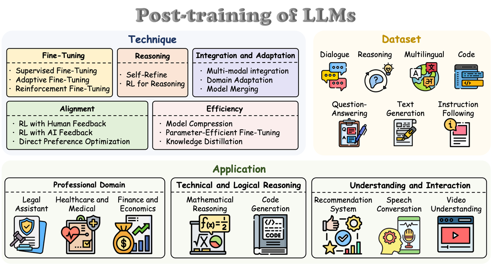

> 后训练是大模型经历预训练之后的训练阶段，这个阶段通常会更有目的性，比如让大模型学会**指令遵循（SFT）、对齐人类偏好（RLHF-PPO、DPO）**，而非进行预训练那样的大量的知识注入
>
> 本章主要从**SFT监督微调、RL强化学习、RLHF基于人类反馈的强化学习、PPO及其改进算法、DPO及其改进算法以及PEFT参数高效微调**几部分讲解大模型的后训练过程

> A Survey on Post-training of Large Language Models，https://arxiv.org/pdf/2503.06072v1

