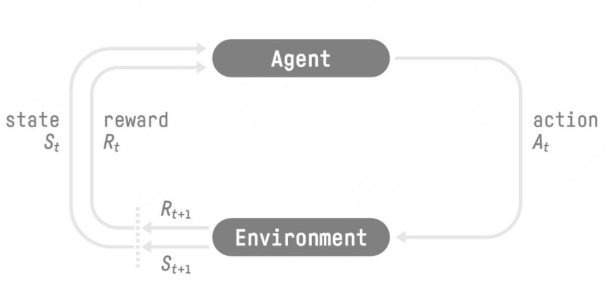
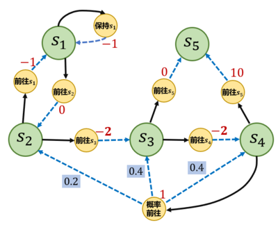
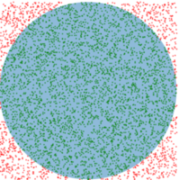
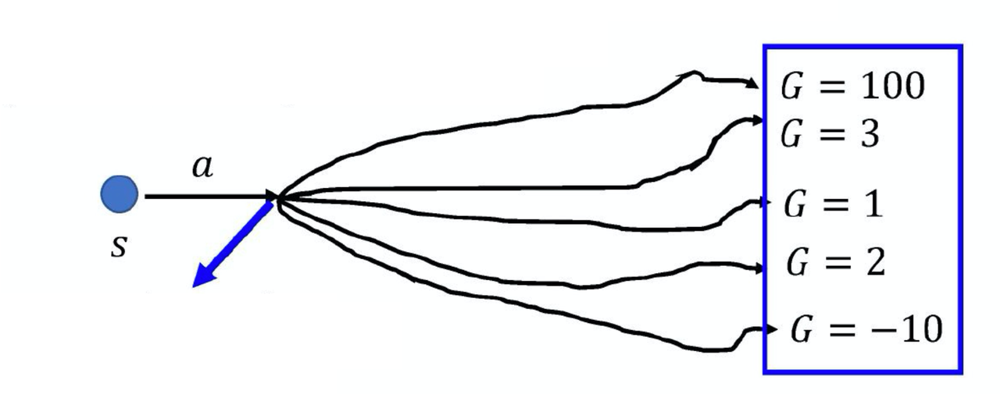
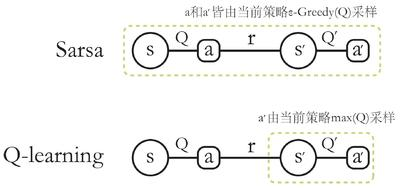
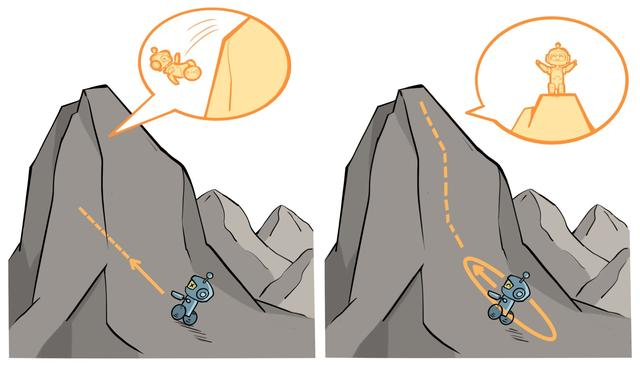
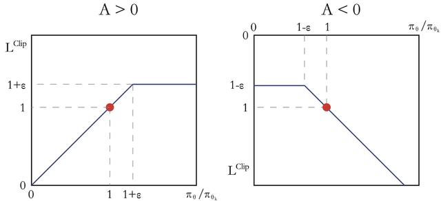

> **Reinforcement Learning 强化学习，**&#x8FD9;部分内容主要参考 [动手学强化学习](https://hrl.boyuai.com/chapter/1/%E5%88%9D%E6%8E%A2%E5%BC%BA%E5%8C%96%E5%AD%A6%E4%B9%A0)，可以通过该书详细入门强化学习，这里做一些**简要但是也比较全面**的介绍。**主要是想通过对强化学习有一定了解之后，看大模型强化学习会得心应手很多**

# **3.2.1 强化学习问题、流程以及独特性**

## **强化学习解决的问题**

> 在机器学习领域，有一类重要的任务和人生选择很相似，即**序贯决策（sequential decision making）任务。决策和预测任务不同，决策往往会带来“后果”，因此决策者需要为未来负责，在未来的时间点做出进一步的决策**。实现序贯决策的机器学习方法就是强化学习（reinforcement learning），**预测仅仅产生一个针对输入数据的信号，并期望它和未来可观测到的信号一致，这不会使未来情况发生任何改变**
>
> 强化学习（Reinforcement Learning，RL）是一种机器学习方法，用于解决需要在一定环境下**通过与环境交互来学习最优行为策略的问题**。其核心思想是**通过试错（Trial and Error）和奖励机制来指导智能体（Agent）学习如何在不同情境下采取行动，以最大化长期累积奖励**
>
> **应用场景：**&#x63A7;制问题、游戏、资源管理优化、金融风险控制、推荐算法

## **强化学习流程**



> 强化学习是机器通过与环境交互来实现目标的一种计算方法。机器和环境的一轮交互是指，机器在环境的一个状态下做一个动作决策，把这个动作作用到环境当中，环境发生相应的改变并且将相应的奖励反馈和下一轮状态传回机器。这种交互是迭代进行的，目标是**最大化在多轮交互过程中获得的累积奖励的期望**。强化学习用智能体（agent）这个概念来表示做决策的机器。相比于有监督学习中的“模型”，强化学习中的“智能体”强调机器不但可以感知周围的环境信息，可以通过做决策来直接改变这个环境，而不只是给出一些预测信号。**一般来说在经典的强化学习环境中agent的实现可以用一些简单的MLP、RNN、CNN等神经网络实现，与现在流行的LLM-based agent有区别**
>
> 智能体和环境之间具体的交互方式如图所示。在每一轮交互中，智能体感知到环境目前所处的状态，经过自身的计算给出本轮的动作，将其作用到环境中；环境得到智能体的动作后，产生相应的即时奖励信号并发生相应的状态转移，智能体则在下一轮交互中感知到新的环境状态直到到达终止状态
>
> 智能体在这个过程中学习，它的最终目标是：**找到一个策略，这个策略根据当前观测到的环境状态和奖励反馈，来选择最佳的动作**

## **强化学习的独特性**

> 对于一般的有监督学习任务，**目标是找到一个最优的模型函数，使其在训练数据集上最小化一个给定的损失函数**。在训练数据独立同分布的假设下，这个优化目标表示最小化模型在整个数据分布上的泛化误差，用简要的公式可以概括为：
>
> $$最优模型 = \arg\min_{模型} \mathbb{E}_{(特征, 标签)\sim 数据分布}[损失函数(标签, 模型(特征))]$$
>
> 相比之下，强化学习任务的最终优化目标是最大化智能体策略在和动态环境交互过程中的价值。**策略的价值可以等价转换成奖励函数在策略的占用度量（这里简单理解策略的占用度量是策略的分布即可）上的期望**，即：
>
> $$最优策略 = \arg\max_{策略} \mathbb{E}_{(状态, 动作)\sim 策略的占用度量}[奖励函数(状态, 动作)]$$
>
> * 有监督学习和强化学习的优化目标相似，即都是在**优化某个数据分布下的一个分数值的期望**。
>
> * 二者优化的途径是不同的，**有监督学习直接通过优化模型对于数据特征的输出来优化目标，即修改目标函数而数据分布不变**；**强化学习则通过改变策略来调整智能体和环境交互数据的分布，进而优化目标，即修改数据分布而目标函数不变**
>
> 综上所述，一般有监督学习和强化学习的范式之间的区别为：
>
> * 一般的**有监督学习关注寻找一个模型，使其在给定数据分布下得到的损失函数的期望最小**
>
> * **强化学习关注寻找一个智能体策略，使其在与动态环境交互的过程中产生最优的数据分布，即最大化该分布下一个给定奖励函数的期望**

> ### **强化学习与有监督学习的其他区别**
>
> 强化学习用智能体（agent）这个概念来表示做决策的机器。相比于有监督学习中的“模型”，强化学习中的“智能体”强调机器不但可以感知周围的环境信息，还可以通过做决策来直接改变这个环境，而不只是给出一些预测信号

**数据类型与来源**

* **有监督学习：依赖于标注好的数据集，每个数据样本都带有明确的标签（目标值）**

* **强化学习：不依赖预先标注的数据集，而是通过与环境交互产生数据**。智能体在每一步行动后会得到环境的反馈（奖励或惩罚），这个反馈用于指导学习

**学习方式**

* **有监督学习：**&#x57FA;于**静态数据集进行训练，学习过程通常是一次性的，即通过一个固定的数据集训练完模型**

* **强化学习：**&#x57FA;于**动态数据进行训练，学习过程是持续的，通过与环境不断交互、试错来更新策略**

**反馈机制**

* **有监督学习：**&#x6BCF;个训练样本都有明确的标签，模型可以直接计算误差

* **强化学习：**&#x6CA1;有明确的标签，模型通过从环境中获得的奖励信号来评估行动的好坏。奖励通常是延迟的，**不是每个行动都能立即得到反馈**

# **3.2.2 马尔可夫决策过程**

> ### **Markov Decision Process MDP**
>
>
>
> * 强化学习解决实际问题的**第一步就是把实际问题抽象成一个MDP**
>
> * 马尔可夫决策过程由**五元组 $$\mathcal{<S,A},P,r,\gamma>$$构成，其中$$\mathcal{S}$$是状态的集合，$$\mathcal{A}$$是智能体动作的集合，$$P(s'|s,a)$$是状态转移函数表示在状态$$s$$执行动作$$a$$之后转移到状态$$s'$$的概率，$$r(s,a)$$是即时奖励函数取决于状态和动作，$$\gamma$$是折扣因子**



**一个MDP过程的例子**

## **策略 Policy**

> 智能体的**策略**（Policy）函数通常表示如下：
>
> $$\pi(a|s)=P(A_t=a|S_t=s)$$
>
> 表示**在输入状态情况下采取动作的概率**。当一个策略是**确定性策略**deterministic policy时，它在每个状态时只输出一个确定性的动作，即只有该动作的概率为 1，其他动作的概率为 0；当一个策略是**随机性策略**stochastic policy时，它在每个状态时输出的是关于动作的概率分布，然后根据该分布进行采样就可以得到一个动作

## **价值函数 Value Function**

> ### **状态价值函数 State Value Function**
>
> 奖励值$$R_t$$是在状态$$S_t$$下的即时奖励，想要表示一个状态的好坏可以用**考虑总的期望收益的价值函数**来描述：
>
> $$V^{\pi}(s) = \mathbb{E}_{\pi}[G_t|S_t=s]\\
> \quad \quad \quad \quad \quad \quad \quad \quad \ \ =\mathbb{E}_{\pi}[R_t + \gamma V^{\pi}(S_{t + 1})|S_t = s] $$
>
> **定义为状态$$s$$出发遵循策略$$\pi$$能够获得的期望回报，其中回报定义为从时刻$$t$$的状态$$S_t$$开始直到终止状态时的所有奖励的折扣和：**

> ### **状态动作价值函数 State-Action Value Function**
>
> 简称为**动作价值函数，表示在MDP遵循策略$$\pi$$的时候，对当前状态$$s$$下执行动作$$a$$的期望回报：**
>
> $$Q^{\pi}(s,a)=\mathbb{E}_{\pi}[G_t|S_t=s, A_t=a]\\
> \quad \quad \quad \quad \quad \quad \quad \quad \quad \quad \quad \ \ \ =\mathbb{E}_{\pi}[R_t + \gamma Q^{\pi}(S_{t + 1}, A_{t + 1})|S_t = s, A_t = a]$$
>
> 两个价值函数的关系如下：
>
> $$V^{\pi}(s)=\sum_{a\in \mathcal{A}}\pi(a|s)Q^{\pi}(s,a)\\
> Q^{\pi}(s,a)=r(s,a) + \gamma\sum_{s'\in \mathcal{S}}P(s'|s,a)V^{\pi}(s')$$
>
> * **状态$$s$$的状态价值等于在该状态下基于策略$$\pi$$采取所有动作的概率与相应的价值相乘再求和的结果**
>
> * **状态$$s$$下采取动作$$a$$的动作价值等于即时奖励加上经过衰减后的所有可能的下一个状态的状态转移概率与相应的价值的乘积**

> ### **关于马尔可夫性质**
>
> **当且仅当某时刻的状态只取决于上一时刻的状态时，一个随机过程被称为具有马尔可夫性质Markov property，**&#x4E5F;就是说，当前状态是未来的充分统计量，即下一个状态只取决于当前状态，而不会受到过去状态的影响。需要明确的是，**具有马尔可夫性并不代表这个随机过程就和历史完全没有关系。因为虽然时刻的状态只与时刻的状态有关，但是时刻的状态其实包含了时刻的状态的信息，通过这种链式的关系，历史的信息被传递到了现在**
>
> $$P(S_{t+1}|S_t)=P(S_{t+1}|S_1,\cdots,S_t)$$

# **3.2.3 贝尔曼方程 Bellman Equation**

> ### **贝尔曼期望方程 Bellman Expectation Equation**
>
> 根据状态和动作价值函数之间的关系，以及两个价值函数自己的定义，进一步表示两个价值函数得到**贝尔曼期望方程Bellman Expectation Equation：**
>
> $$ 
> V^{\pi}(s) = \mathbb{E}_{\pi}[R_t + \gamma V^{\pi}(S_{t + 1})|S_t = s] \\
> \quad \quad \quad \quad \quad \quad \quad \quad \quad \quad = \sum_{a \in \mathcal{A}} \pi(a|s) \left( r(s, a) + \gamma \sum_{s' \in \mathcal{S}} p(s'|s, a)V^{\pi}(s') \right) \\
> Q^{\pi}(s, a) = \mathbb{E}_{\pi}[R_t + \gamma Q^{\pi}(S_{t + 1}, A_{t + 1})|S_t = s, A_t = a] \\
> \quad \quad \quad \quad \quad \ \ = r(s, a) + \gamma \sum_{s' \in S} p(s'|s, a) \sum_{a' \in \mathcal{A}} \pi(a'|s')Q^{\pi}(s', a')
>  $$

> ### **贝尔曼最优方程 Bellman optimality equation**
>
> 根据最优价值函数的关系，可以得到**贝尔曼最优方程**：
>
> $$V^{*}(s) = \max_{a\in\mathcal{A}}\{r(s,a) + \gamma\sum_{s'\in\mathcal{S}}p(s'|s,a)V^{*}(s')\} \\
> Q^{*}(s,a) = r(s,a) + \gamma\sum_{s'\in\mathcal{S}}p(s'|s,a)\max_{a'\in\mathcal{A}}Q^{*}(s',a')
> $$

> ### **最优策略 Optimal Policy**
>
> 最优策略$$\pi^{*}(s)$$可以有很多个，对应的**最优价值函数只有一个**：
>
> $$V^*(s)=\max_{\pi}V^{\pi}(s) \quad, s\in \mathcal{S}$$
>
> 同理**最优动作价值函数定义为**：
>
> $$Q^*(s,a)=\max_{\pi}Q^{\pi}(s,a) \quad, s\in \mathcal{S},a\in \mathcal{A}$$
>
> 为了**使得动作价值函数最大，需要在当前的状态动作对之后都执行最优策略**，所以可以得到下面的关系式：
>
> $$Q^*(s,a)=r(s,a)+\gamma\sum_{s'\in \mathcal{S}}P(s'|s,a)V^*(s')\\
> V^*(s)=\max_{a\in\mathcal{A}}Q^*(s,a)$$
>
> * **最优动作价值函数等于即时奖励加上之后可能转移到的状态的最优价值函数的折扣期望**
>
> * **最优价值函数等于当前状态选取能够使得动作价值函数最大的动作对应的Q值**

# **3.2.4 蒙特卡洛方法**

> **蒙特卡洛方法**（Monte-Carlo methods）也被称为统计模拟方法，是一种基于概率统计的数值计算方法。运用蒙特卡洛方法时，我们通常使用重复随机抽样，然后运用概率统计方法来从抽样结果中归纳出我们想求的目标的数值估计。一个**简单的例子是用蒙特卡洛方法来计算圆的面积**：
>
> $$\frac{圆的面积}{正方形的面积}=\frac{园中的点数}{正方形中的点数}$$
>
> 一个状态的价值是它的期望回报，一个很直观的想法就是用策略在 MDP 上采样很多条序列，计算从这个状态出发的回报再求其期望：
>
> $$V^{\pi}(s)=\mathbb{E}_{\pi}[G_t|S_t=s]\approx \frac{1}{N}\sum^N_{i=1}G_t^{(i)}$$



> ### **MC算法进行基于策略π的状态价值估计步骤**
>
> 1. **采样序列**：
>
>    * 使用策略$$\pi$$采样若干条序列，每条序列形如：$$s_{0}^{(i)} \stackrel{a_{0}^{(i)}}{\longrightarrow} r_{0}^{(i)}, s_{1}^{(i)} \stackrel{a_{1}^{(i)}}{\longrightarrow} r_{1}^{(i)}, s_{2}^{(i)} \stackrel{a_{2}^{(i)}}{\longrightarrow} \cdots \stackrel{a_{T-1}^{(i)}}{\longrightarrow} r_{T-1}^{(i)}, s_{T}^{(i)}$$
>
> 2. **序列处理与状态信息更新**：
>
>    * 对于每一条序列中的每一时间步$$t$$的状态$$s$$进行以下操作：
>
>      * 更新状态$$s$$的计数器：$$N(s) \leftarrow N(s) + 1$$
>
>      * 更新状态$$s$$的总回报：$$M(s) \leftarrow M(s) + G_{t}$$
>
> 3. **状态价值估计**：
>
>    * 每一个状态的价值被估计为回报的平均值：$$V(s) = M(s) / N(s)$$
>
>    * 根据大数定律，当$$N(s) \to \infty$$，有$$V(s) \to V^{\pi}(s)$$
>
> 4. **增量更新（可选）**：
>
>    * 对于每个状态$$s$$和对应回报$$G$$，进行如下计算：
>
>      * $$N(s) \leftarrow N(s) + 1$$
>
>      * $$V(s) \leftarrow V(s) + \frac{1}{N(s)}(G - V(s))$$

```python
def MC(episodes, V, N, gamma):
    for episode in episodes:
        G = 0
        for i in range(len(episode) - 1, -1, -1):  #一个序列从后往前计算
            (s, a, r, s_next) = episode[i]
            G = r + gamma * G
            N[s] = N[s] + 1
            V[s] = V[s] + (G - V[s]) / N[s]
```

# **3.2.5 动态规划方法**

> 动态规划基本思想是**将待求解问题分解成若干个子问题，先求解子问题，然后从这些子问题的解得到目标问题的解。动态规划会保存已解决的子问题的答案，在求解目标问题的过程中，需要这些子问题答案时就可以直接利用，避免重复计算**
>
> 基于**动态规划（Dynamic Programming）**&#x7684;强化学习算法主要有两种：一是**策略迭代（policy iteration）**，二是**价值迭代（value iteration）**
>
> 动态规划是一种**model-based方法（环境动态已知或者有训练好的环境模拟器），要求事先知道环境的状态转移函数和奖励函数，即MDP过程已知**，**环境动态完全已知**，这种情况下**Agent并不需要与环境真正交互（例如迷宫、既定规则网格），直接利用DP就可以求解最优策略**

## **策略迭代算法 Policy Iteration**

> 通过迭代的交替进行**策略评估和策略提升**得到最优策略的过程
>
> $$\pi^{0} \xrightarrow{\text{策略评估}} V^{\pi^{0}} \xrightarrow{\text{策略提升}} \pi^{1} \xrightarrow{\text{策略评估}} V^{\pi^{1}} \xrightarrow{\text{策略提升}} \pi^{2} \xrightarrow{\text{策略评估}} \cdots \xrightarrow{\text{策略提升}} \pi^{*}$$
>
> * **策略评估 Policy Evaluation**
>
>   **策略评估的目的是计算策略的状态价值函数**，有状态价值函数的贝尔曼期望方程：
>
>   $$V^{\pi}(s) = \mathbb{E}_{\pi}[R_t + \gamma V^{\pi}(S_{t + 1})|S_t = s]= \sum_{a \in \mathcal{A}} \pi(a|s) \left( r(s, a) + \gamma \sum_{s' \in \mathcal{S}} p(s'|s, a)V^{\pi}(s') \right)$$
>
>   我们通过下一个状态$$s'$$的价值函数$$V^{\pi}(s')$$来计算当前状态$$s$$的状态价值函数$$V^{\pi}(s)$$，基于动态规划的思想我们很容易想到把计算当前状态价值函数和下一个状态价值函数作为当前问题和子问题，然后就得到了策略评估方法，即**利用上一个迭代的状态价值函数来计算当前迭代的状态价值函数**：
>
>   $$V^{ k+1}(s) = \mathbb{E}_{\pi}[R_t + \gamma V^{\pi}(S_{t + 1})|S_t = s]= \sum_{a \in \mathcal{A}} \pi(a|s) \left( r(s, a) + \gamma \sum_{s' \in \mathcal{S}} p(s'|s, a)V^{ k}(s') \right)$$
>
>   价值函数的初始值可以是任意，当$$k \rightarrow \infty$$的时候，$${V^k}$$收敛到$$V^{\pi}$$，实际操作当会考虑当前迭代状态价值函数和上一轮迭代的状态价值函数的差小于阈值$$\epsilon$$就可以停止策略评估过程
>
> * **策略提升 Policy Improvement**
>
>   **策略提升的目的是依据状态价值函数改进策略**，有动作价值函数与状态价值函数的关系：
>
>   $$Q^{\pi}(s,a)=r(s,a) + \gamma\sum_{s'\in \mathcal{S}}P(s'|s,a)V^{\pi}(s')$$
>
>   我们可以通过**在每一个状态贪心的选择动作价值函数最大的动作来得到改进后的策略**：
>
>   $$\pi'(s) = \arg\max_{a} Q^{\pi}(s,a) = \arg\max_{a} \{ r(s,a) + \gamma \sum_{s'} P(s'|s,a)V^{\pi}(s') \}$$

> ### **策略迭代算法流程**
>
> * 随机初始化策略$$\pi(s)$$ 和价值函数$$V(s)$$
>
> * **while $$\Delta $$> $$ \theta$$ do :** (策略评估循环)
>
> &#x20;             $$ \Delta \leftarrow 0$$
>
> &#x20;              对于每一个状态$$s \in \mathcal{S}$$:
>
> &#x20;              $$v \leftarrow V(s)$$
>
> &#x20;              $$ V(s) \leftarrow r(s,\pi(s)) + \gamma \sum_{s'} P(s'|s,\pi(s))V(s')$$
>
> &#x20;              $$\Delta \leftarrow \max(\Delta, |v - V(s)|)$$
>
> &#x20;   **end while**
>
> &#x20;   $$\pi_{old} \leftarrow \pi$$
>
> * 对于每一个状态$$s \in \mathcal{S}$$:
>
> &#x20;   $$\pi(s) \leftarrow \arg\max_{a} r(s,a) + \gamma \sum_{s'} P(s'|s,a)V(s')$$
>
> * 若 $$\pi_{old} = \pi$$ 则停止算法并返回 $$ V,\pi$$; 否则转到策略评估循环

```python
class PolicyIteration:
    """ 策略迭代算法 """
    def __init__(self, env, theta, gamma):
        self.env = env
        self.v = [0] * self.env.ncol * self.env.nrow  # 初始化价值为0
        self.pi = [[0.25, 0.25, 0.25, 0.25]
                   for i in range(self.env.ncol * self.env.nrow)]  # 初始化为均匀随机策略
        self.theta = theta  # 策略评估收敛阈值
        self.gamma = gamma  # 折扣因子

    def policy_evaluation(self):  # 策略评估
        cnt = 1  # 计数器
        while 1:
            max_diff = 0
            new_v = [0] * self.env.ncol * self.env.nrow
            for s in range(self.env.ncol * self.env.nrow):
                qsa_list = []  # 开始计算状态s下的所有Q(s,a)价值
                for a in range(4):
                    qsa = 0
                    for res in self.env.P[s][a]:
                        p, next_state, r, done = res
                        qsa += p * (r + self.gamma * self.v[next_state] * (1 - done))
                        # 本章环境比较特殊,奖励和下一个状态有关,所以需要和状态转移概率相乘
                    qsa_list.append(self.pi[s][a] * qsa)
                new_v[s] = sum(qsa_list)  # 状态价值函数和动作价值函数之间的关系
                max_diff = max(max_diff, abs(new_v[s] - self.v[s]))
            self.v = new_v
            if max_diff < self.theta: break  # 满足收敛条件,退出评估迭代
            cnt += 1
        print("策略评估进行%d轮后完成" % cnt)

    def policy_improvement(self):  # 策略提升
        for s in range(self.env.nrow * self.env.ncol):
            qsa_list = []
            for a in range(4):
                qsa = 0
                for res in self.env.P[s][a]:
                    p, next_state, r, done = res
                    qsa += p * (r + self.gamma * self.v[next_state] * (1 - done))
                qsa_list.append(qsa)
            maxq = max(qsa_list)
            cntq = qsa_list.count(maxq)  # 计算有几个动作得到了最大的Q值
            # 让这些动作均分概率
            self.pi[s] = [1 / cntq if q == maxq else 0 for q in qsa_list]
        print("策略提升完成")
        return self.pi

    def policy_iteration(self):  # 策略迭代
        while 1:
            self.policy_evaluation()
            old_pi = copy.deepcopy(self.pi)  # 将列表进行深拷贝,方便接下来进行比较
            new_pi = self.policy_improvement()
            if old_pi == new_pi: break
```

## **价值迭代算法 Value Iteration**

> **策略迭代需要交替运行策略评估和策略迭代，需要很多多轮才能收敛，而价值迭代直接利用最优贝尔曼方程**：
>
> $$V^{*}(s) = \max_{a\in\mathcal{A}}\{r(s,a) + \gamma\sum_{s'\in\mathcal{S}}p(s'|s,a)V^{*}(s')\}$$
>
> 考虑和策略评估类似的动态规划，我们有：
>
> $$V^{k+1}(s) = \max_{a\in\mathcal{A}}\{r(s,a) + \gamma\sum_{s'\in\mathcal{S}}p(s'|s,a)V^{k}(s')\}$$
>
> 利用上式进行更新直到相邻两个迭代的价值函数差小于阈值$$\epsilon$$，然后通过下式提取Policy：
>
> $$\pi(s) == \arg\max_{a} \{ r(s,a) + \gamma \sum_{s'} P(s'|s,a)V^{k+1}(s') \}$$

> ### **价值迭代算法流程**
>
> * 随机初始化 $$V(s)$$
>
> * **while $$\Delta > \theta$$ do :**
>
>   * $$\Delta \leftarrow 0$$
>
>   * 对于每一个状态 $s \in \mathcal{S}$:
>
>     * $$v \leftarrow V(s)$$
>
>     * $$V(s) \leftarrow \max_{a} r(s,a) + \gamma \sum_{s'} P(s'|s,a)V(s')$$
>
>     * $$\Delta \leftarrow \max(\Delta, |v - V(s)|)$$
>
> * **end while**
>
> * 返回一个确定性策略 $$\pi(s) = \arg\max_{a} \{ r(s,a) + \gamma \sum_{s'} P(s'|s,a)V(s') \}$$

```python
class ValueIteration:
    """ 价值迭代算法 """
    def __init__(self, env, theta, gamma):
        self.env = env
        self.v = [0] * self.env.ncol * self.env.nrow  # 初始化价值为0
        self.theta = theta  # 价值收敛阈值
        self.gamma = gamma
        # 价值迭代结束后得到的策略
        self.pi = [None for i in range(self.env.ncol * self.env.nrow)]

    def value_iteration(self):
        cnt = 0
        while 1:
            max_diff = 0
            new_v = [0] * self.env.ncol * self.env.nrow
            for s in range(self.env.ncol * self.env.nrow):
                qsa_list = []  # 开始计算状态s下的所有Q(s,a)价值
                for a in range(4):
                    qsa = 0
                    for res in self.env.P[s][a]:
                        p, next_state, r, done = res
                        qsa += p * (r + self.gamma * self.v[next_state] * (1 - done))
                    qsa_list.append(qsa)  # 这一行和下一行代码是价值迭代和策略迭代的主要区别
                new_v[s] = max(qsa_list)
                max_diff = max(max_diff, abs(new_v[s] - self.v[s]))
            self.v = new_v
            if max_diff < self.theta: break  # 满足收敛条件,退出评估迭代
            cnt += 1
        print("价值迭代一共进行%d轮" % cnt)
        self.get_policy()

    def get_policy(self):  # 根据价值函数导出一个贪婪策略
        for s in range(self.env.nrow * self.env.ncol):
            qsa_list = []
            for a in range(4):
                qsa = 0
                for res in self.env.P[s][a]:
                    p, next_state, r, done = res
                    qsa += p * (r + self.gamma * self.v[next_state] * (1 - done))
                qsa_list.append(qsa)
            maxq = max(qsa_list)
            cntq = qsa_list.count(maxq)  # 计算有几个动作得到了最大的Q值
            # 让这些动作均分概率
            self.pi[s] = [1 / cntq if q == maxq else 0 for q in qsa_list]
```

# **3.2.6 时序差分方法**

> **时序差分Temporal Difference**是一种**model-free方法（即无法得知环境动力学，写不出MDP的状态转移方程）**，只能**通过Agent与环境交互采样得到的数据来学习策略，**&#x5B9E;际中大多数环境的状态转移方程都写不出来，所以model-free方法应用多
>
> **时序差分算法的核心思想是用对未来动作选择的价值估计来更新对当前动作选择的价值估计**
>
> **时序差分是估计策略的价值函数的方法**，它**结合了蒙特卡洛和动态规划算法的思想**

> 时序差分方法和蒙特卡洛的相似之处在于可以**从样本数据中学习，不需要事先知道环境**；和动态规划的相似之处在于**根据贝尔曼方程的思想，利用后续状态的价值估计来更新当前状态的价值估计**

> 考虑之前学过的蒙特卡洛方法的增量更新： $$V(s) \leftarrow V(s) + \frac{1}{N(s)}[G - V(s)]$$
>
> **MC方法需要严格的等整个序列结束之后才能计算回报$$G$$，TD方法则只使用即时奖励加下一步状态价值的折扣和来估计当前状态的期望回报**，因为根据状态价值函数的定义我们知道：
>
> $$V^{\pi}(s) = \mathbb{E}_{\pi}[G_t|S_t=s]\\
> \quad \quad \quad \quad \quad \quad \quad \quad \ \ =\mathbb{E}_{\pi}[R_t + \gamma V^{\pi}(S_{t + 1})|S_t = s] $$
>
> 所以**利用期望里面的式子估计期望值也可以，这样虽然牺牲了MC的无偏估计，但是得到了更为直接、方差更低的估计方法**
>
> 然后我们就得到了**时序差分方法的增量更新**： $$V(s_{t}) \leftarrow V(s_t) + \alpha[r_t+\gamma V(s_{t+1}) - V(s)]$$，后面这一项被称为时序差分误差，$$\alpha$$为控制更新步长的常数参数

## **SARSA算法**


> **直接使用TD算法来估计动作价值函数，然后使用贪婪算法选取状态下动作价值最大的动作**
>
> $$Q(s_{t},a_t) \leftarrow Q(s_{t},a_t) + \alpha[r_t+\gamma Q(s_{t+1},a_{t+1}) - Q(s_{t},a_t)]$$
>
> $$\pi(a|s) = 
> \begin{cases}
> \epsilon/|\mathcal{A}| + 1 - \epsilon & \text{如果 } a = \arg\max_{a'} Q(s,a') \\
> \epsilon/|\mathcal{A}| & \text{随机采样其他动作}
> \end{cases}$$
>
>
>
> 上面用到的**贪婪算法叫$$\epsilon - greedy$$算法，兼顾探索和利用**，如果一直都选择Q值最大的动作，那么就会有很多状态动作永远没见过，缺乏对状态动作空间的探索，所以使用一个小量$$\epsilon$$来控制利用和探索的比例


> ### **SARSA算法流程**
>
> * 初始化 $$Q(s,a)$$
>
> * **for 序列 $$e = 1 \to E$$ do :**
>
>   * 得到初始状态 $$s$$
>
>   * 用  $$\epsilon-greedy$$ 策略根据 $$Q$$ 选择当前状态 $$s$$ 下的动作 $$a$$
>
>   * **for 时间步 $$t = 1 \to T$$ do :**
>
>     * 得到环境反馈的 $$r, s'$$
>
>     * 用 $$\epsilon-greedy$$ 策略根据 $$Q$$ 选择当前状态 $$s'$$ 下的动作 $$a'$$
>
>     * $$Q(s,a) \leftarrow Q(s,a) + \alpha [r + \gamma Q(s',a') - Q(s,a)]$$
>
>     * $$s \leftarrow s', a \leftarrow a'$$
>
>   * **end for**
>
> * **end for**

```python
class Sarsa:
    """ Sarsa算法 """
    def __init__(self, ncol, nrow, epsilon, alpha, gamma, n_action=4):
        self.Q_table = np.zeros([nrow * ncol, n_action])  # 初始化Q(s,a)表格
        self.n_action = n_action  # 动作个数
        self.alpha = alpha  # 学习率
        self.gamma = gamma  # 折扣因子
        self.epsilon = epsilon  # epsilon-贪婪策略中的参数

    def take_action(self, state):  # 选取下一步的操作,具体实现为epsilon-贪婪
        if np.random.random() < self.epsilon:
            action = np.random.randint(self.n_action)
        else:
            action = np.argmax(self.Q_table[state])
        return action

    def best_action(self, state):  # 用于打印策略
        Q_max = np.max(self.Q_table[state])
        a = [0 for _ in range(self.n_action)]
        for i in range(self.n_action):  # 若两个动作的价值一样,都会记录下来
            if self.Q_table[state, i] == Q_max:
                a[i] = 1
        return a

    def update(self, s0, a0, r, s1, a1):
        td_error = r + self.gamma * self.Q_table[s1, a1] - self.Q_table[s0, a0]
        self.Q_table[s0, a0] += self.alpha * td_error
```

## **SARSA-λ**

> **蒙特卡洛方法是无偏（unbiased）的，但是具有比较大的方差**，因为**每一步的状态转移都有不确定性，而每一步状态采取的动作所得到的不一样的奖励最终都会加起来，这会极大影响最终的价值估计**；**时序差分算法具有非常小的方差，因为只关注了一步状态转移，用到了一步的奖励，但是它是有偏的，因为用到了下一个状态的价值估计而不是其真实的价值**
>
> SARSA-λ则采用两者折中的方法，考虑多步时序差分：
>
> $$Q(s_t,a_t) \leftarrow Q(s_t,a_t) + \alpha [r_t + \gamma r_{t + 1} + \cdots + \gamma^n Q(s_{t + n},a_{t + n}) - Q(s_t,a_t)]$$



## **Q-learning算法**


> **Q-learning方法则是基于最优贝尔曼方程去估计$$Q^*$$**:
>
> $$Q^{*}(s,a) = r(s,a) + \gamma\sum_{s'\in\mathcal{S}}p(s'|s,a)\max_{a'\in\mathcal{A}}Q^{*}(s',a')$$
>
> 所以Q-learning方法的更新式为：
>
> $$Q(s_{t},a_t) \leftarrow Q(s_{t},a_t) + \alpha[r_t+\gamma \max_{a} Q(s_{t+1},a) - Q(s_{t},a_t)]$$
>
>
>
> 相当于每次都**选下一个状态动作价值最高的值和即时奖励来作为当前状态最优动作价值的估计**


> ### **Q-learning算法流程**
>
> * 初始化 $$Q(s,a)$$
>
> * **for 序列 $$e = 1 \to E$$ do :**
>
>   * 得到初始状态 $$s$$
>
>   * **for 时间步 $$t = 1 \to T$$ do :**
>
>     * 用&#x20;**&#x20;**$$\epsilon-greedy $$策略根据 $$Q$$ 选择当前状态 $$s$$ 下的动作 $$a$$
>
>     * 得到环境反馈的 $$r, s'$$
>
>     * $$Q(s,a) \leftarrow Q(s,a) + \alpha [r + \gamma \max_{a'} Q(s',a') - Q(s,a)]$$
>
>     * $$s \leftarrow s'$$
>
>   * **end for**
>
> * **end for**

```python
class QLearning:
    """ Q-learning算法 """
    def __init__(self, ncol, nrow, epsilon, alpha, gamma, n_action=4):
        self.Q_table = np.zeros([nrow * ncol, n_action])  # 初始化Q(s,a)表格
        self.n_action = n_action  # 动作个数
        self.alpha = alpha  # 学习率
        self.gamma = gamma  # 折扣因子
        self.epsilon = epsilon  # epsilon-贪婪策略中的参数

    def take_action(self, state):  #选取下一步的操作
        if np.random.random() < self.epsilon:
            action = np.random.randint(self.n_action)
        else:
            action = np.argmax(self.Q_table[state])
        return action

    def best_action(self, state):  # 用于打印策略
        Q_max = np.max(self.Q_table[state])
        a = [0 for _ in range(self.n_action)]
        for i in range(self.n_action):
            if self.Q_table[state, i] == Q_max:
                a[i] = 1
        return a

    def update(self, s0, a0, r, s1):
        td_error = r + self.gamma * self.Q_table[s1].max(
        ) - self.Q_table[s0, a0]
        self.Q_table[s0, a0] += self.alpha * td_error
```

# **3.2.7 强化学习分类**

> **几个强化学习中比较重要的分类概念：Online\&Offline、On-Policy\&Off-Policy、Model-based\&Model-free和Value-based\&Policy-based**

> ### **以数据来源划分**
>
> * **Online：**&#x41;gent一边与环境交互收集轨迹样本$$<s_1,a_1,r_1,\cdots,s_T,a_T,r_T>$$，**一边学习策略**
>
> * **Offline：**&#x41;gent学习用到的轨迹样本是提前收集好的，**作为一个Offline dataset提供给Agent，学习策略过程不涉及环境交互**

> ### **以需不需要环境动态划分**
>
> * **Model-based：**&#x73AF;境动态已知，或者通过学习得到一个环境状态转移方程、奖励函数的模型，然后通过动态规划或者树搜索等方法直接求解最优策略，Agent不需要真正与环境交互采样
>
> * **Model-free：**&#x73AF;境动态未知，不需要学习状态转移，通过Agent与环境交互采样学习策略

> ### **以采样策略和更新策略划分**
>
> * **On-Policy**：用来采样的**行为策略 Behavior Policy和用这些数据更新的目标策略 Target Policy是同一个策略，**&#x4F8B;如SARSA，更新的时候需要使用到当前行为策略采样得到的五元组数&#x636E;**&#x20;**$$(s,a,r,s',a')$$
>
> * **Off-Policy：**&#x7528;来采样的**行为策略 Behavior Policy和用这些数据更新的目标策略 Target Policy不是同一个一个策略，**&#x4F8B;如Q-learning，更新使用当前行为策略采样的四元组 $$(s,a,r,s')$$ ，$$a'$$是通过 $$\max (Q)$$得到的，而不是行为策略采样得到的

> ### **以如何学习策略划分**
>
> * **Value-based：**&#x5148;学习值函数，然后从值函数导出策略，学习过程中不存在显式的策略
>
> * **Policy-based：**&#x76F4;接显式的学习一个目标策略



**On-Policy与Off-Policy对比示意图**

# **3.2.8 DQN**

> ### **Deep Q Network**
>
> 前面3.2.6节讲到的Q-learning算法应用到状态和动作都是离散的时候可以用表格法记录各个状态动作对的Q值，然后每次更新的时候就更新表格中对应位置的值就可以了，但是如果**状态动作空间非常大比如图像或者是连续变量，那表格法就不能使用了。这个时候就可以用参数化的神经网络来拟合Q值函数，由此诞生了DQN**
>
> 回归Q-learning的更新方式：
>
> $$Q(s_{t},a_t) \leftarrow Q(s_{t},a_t) + \alpha[r_t+\gamma \max_{a} Q(s_{t+1},a) - Q(s_{t},a_t)]$$
>
> 我们需要的是**让Q值网络的输出$$Q(s,q)$$与时序差分目标（TD target）接近，那么自然可以构造出MSEloss，也就是均方误差的损失函数形式**
>
> $$\mathcal{L}_{DQN} = \frac{1}{2N}\sum_{i=1}^N\left[Q_w(s_i,a_i)-(r_i+\gamma\max_{a'}Q_w(s'_i,a'))\right]^2$$
>
> 与Q-learning一样，**DQN是 Off-Policy算法，此外DQN还引入了两个重要的改进：**
>
> * **Repaly Buffer 经验回放：**&#x5728;一般的有监督学习中，每一个训练数据会被使用多次。但是在**原来的Q-learning 算法中，每个数据只会用来更新一次Q值**。DQN相当于结合部分Offline性质，通过**维护一个 Replay Buffer（一般提前定好存储samples的数量，先进先出，以及采样方法是采样最新的、按照优先级采样还是随机采样）来存放采样的数据，训练的时候则从Replay Buffer中samples batch进行训练，**&#x597D;处：
>
>   * **使样本满足独立假设**。在 MDP 中交互采样得到的数据本身不满足独立假设，因为这一时刻的状态和上一时刻的状态有关。非独立同分布的数据对训练神经网络有很大的影响，会使神经网络拟合到最近训练的数据上。采用经验回放可以打破样本之间的相关性，让其满足独立假设
>
>   * **提高样本效率**。每一个样本可以被使用多次，十分适合深度神经网络的梯度学习
>
> * **Target Network 目标网络：**&#x44;QN更新的目标是让$$Q_w(s,a)$$逼近TD目标$$r+\gamma Q_w(s',a')$$，但是我们发现**这两部分都是同一个Q值神经网络在计算，更新网络参数的时候，我的目标也在不断的改变，相当于我一边追，目标一边跑，这种Target shift现象很容易导致神经网络训练不稳定**，所以DQN引入一个**目标网络&#x20;**$$Q_{w^-}$$**来计算TD Target，初始化为与Q值网络一样，但不像Q值网络一样每一步都更新参数，而是隔固定步数直接copy Q值网络参数**，这样就能一定程度保证训练稳定性了
>
>   $$\mathcal{L}_{DQN} = \frac{1}{2N}\sum_{i=1}^N\left[Q_w(s_i,a_i)-(r_i+\gamma\max_{a'}Q_{w^-}(s'_i,a'))\right]^2$$

> ### **DQN算法流程**
>
> * 用随机的网络参数初始化网络$$Q_w(s,a)$$
>
> * 复制相同的参数 $$w¯ ← w$$来初始化目标网络
>
> * 初始化**经验回放池R**
>
> * **for 序列e = 1 → E do**
>
>   * 获取环境初始状态s1
>
>   * **for 时间步t = 1 → T do**
>
>     * 根据当前网络 $$Q_w(s,a)$$以ε-greedy选择动作 $$a_t$$
>
>     * 执行动作$$a_t$$，获得奖励$$r_t$$，环境状态变为$$s_{t+1}$$
>
>     * 将$$(s_t,a_t,r_t,s_{t+1})$$存储进**经验回放池R**中
>
>     * 若R中数据足够，**从R中采样N个数据** $${(s_i,a_i,r_i,s_{i+1})}_{i=1,...,N}$$
>
>     * 对每个数据，用目标网络计算 $$y_i = r_i+\gamma\max_{a'}Q_{w^-}(s_{i+1},a')$$
>
>     * 最小化目标损失 $$\mathcal{L}_{DQN} = \frac{1}{2N}\sum_{i=1}^N\left[Q_w(s_i,a_i)-y_i\right]^2$$，以此更新当前网络 $$Q_w$$
>
>     * 如果当前**时间步隔了固定步数C，更新目标网络，直接复制当前网络参数**
>
>   * **end for**
>
> * **end for**

```python
class ReplayBuffer:
    ''' 经验回放池 '''
    def __init__(self, capacity):
        self.buffer = collections.deque(maxlen=capacity)  # 队列,先进先出

    def add(self, state, action, reward, next_state, done):  # 将数据加入buffer
        self.buffer.append((state, action, reward, next_state, done))

    def sample(self, batch_size):  # 从buffer中采样数据,数量为batch_size
        transitions = random.sample(self.buffer, batch_size)
        state, action, reward, next_state, done = zip(*transitions)
        return np.array(state), action, reward, np.array(next_state), done

    def size(self):  # 目前buffer中数据的数量
        return len(self.buffer)
class Qnet(torch.nn.Module):
    ''' 只有一层隐藏层的Q网络 '''
    def __init__(self, state_dim, hidden_dim, action_dim):
        super(Qnet, self).__init__()
        self.fc1 = torch.nn.Linear(state_dim, hidden_dim)
        self.fc2 = torch.nn.Linear(hidden_dim, action_dim)
    
    def forward(self, x):
        x = F.relu(self.fc1(x))  # 隐藏层使用ReLU激活函数
        return self.fc2(x)
class DQN:
    ''' DQN算法 '''
    def __init__(self, state_dim, hidden_dim, action_dim, learning_rate, gamma,
                 epsilon, target_update, device):
        self.action_dim = action_dim
        self.q_net = Qnet(state_dim, hidden_dim, self.action_dim).to(device)  # Q网络
        # 目标网络
        self.target_q_net = Qnet(state_dim, hidden_dim, self.action_dim).to(device)
        # 使用Adam优化器
        self.optimizer = torch.optim.Adam(self.q_net.parameters(), lr=learning_rate)
        self.gamma = gamma  # 折扣因子
        self.epsilon = epsilon  # epsilon-贪婪策略
        self.target_update = target_update  # 目标网络更新频率
        self.count = 0  # 计数器,记录更新次数
        self.device = device
    
    def take_action(self, state):  # epsilon-贪婪策略采取动作
        if np.random.random() < self.epsilon:
            action = np.random.randint(self.action_dim)
        else:
            state = torch.tensor([state], dtype=torch.float).to(self.device)
            action = self.q_net(state).argmax().item()
        return action
    
    def update(self, transition_dict):
        states = torch.tensor(transition_dict['states'], dtype=torch.float).to(self.device)
        actions = torch.tensor(transition_dict['actions']).view(-1, 1).to(self.device)
        rewards = torch.tensor(transition_dict['rewards'],dtype=torch.float).view(-1, 1).to(self.device)
        next_states = torch.tensor(transition_dict['next_states'],dtype=torch.float).to(self.device)
        dones = torch.tensor(transition_dict['dones'],dtype=torch.float).view(-1, 1).to(self.device)
    
        q_values = self.q_net(states).gather(1, actions)  # Q值
        # 下个状态的最大Q值
        max_next_q_values = self.target_q_net(next_states).max(1)[0].view(
            -1, 1)
        q_targets = rewards + self.gamma * max_next_q_values * (1 - dones)  # TD误差目标
        dqn_loss = torch.mean(F.mse_loss(q_values, q_targets))  # 均方误差损失函数
        self.optimizer.zero_grad()  # PyTorch中默认梯度会累积,这里需要显式将梯度置为0
        dqn_loss.backward()  # 反向传播更新参数
        self.optimizer.step()
    
        if self.count % self.target_update == 0:
            self.target_q_net.load_state_dict(
                self.q_net.state_dict())  # 更新目标网络
        self.count += 1
```

# **3.2.9 策略梯度算法**

> **Q-learning到DQN都属于基于值的算法（Value-based），策略梯度方法是基于策略的方法（Policy-based）**
>
> 对策略参数化并用神经网络建模，输入状态，输出动作的概率分布，**策略学习的目标函数定义为当前策略在初始状态价值函数的期望**：
>
> $$J(\theta) = \mathbb{E}_{s_0}[V^{\pi_{\theta}}(s_0)]$$
>
> 目标函数对参数$$\theta$$求导，然后利用梯度上升方法最大化目标函数从而得到最优策略：
>
> $$ 
> \nabla_{\theta}J(\theta) \propto \sum_{s\in S}\nu^{\pi_{\theta}}(s)\sum_{a\in A}Q^{\pi_{\theta}}(s,a)\nabla_{\theta}\pi_{\theta}(a|s)\\
> \quad\quad\quad\quad\quad\quad\quad= \sum_{s\in S}\nu^{\pi_{\theta}}(s)\sum_{a\in A}\pi_{\theta}(a|s)Q^{\pi_{\theta}}(s,a)\frac{\nabla_{\theta}\pi_{\theta}(a|s)}{\pi_{\theta}(a|s)}\\
> \quad= \mathbb{E}_{\pi_{\theta}}[Q^{\pi_{\theta}}(s,a)\nabla_{\theta}\log\pi_{\theta}(a|s)]
>  $$
>
> 其中 $$\nu^\pi$$为状态访问分布，具体推导很繁琐复杂，我们直接记住最后一行的公式即可。从上述**导出的策略梯度可以看出，策略梯度算法是 On-policy算法，因为更新策略的数据是策略本身采样的**

> 直观理解**上式就是在每一个状态下，策略梯度让策略更多采样Q值高的动作，更少采样Q值低的动作，也可以理解为Q值函数引导策略的更新方向**

## **REINFORCE算法**


> **策略梯度**中需要用到Q值函数，有多种方式来估计Q值函数，REINFORCE算法就是采用的之前讲到的蒙特卡洛方法MC来估计Q值：
>
>
>
> $$\nabla_\theta J(\theta)=\\
> \mathbb{E}_{\pi_\theta}\left[ \sum_{t=0}^T \left( \sum_{t'=t}^T\gamma^{t'-t} r_{t'}\right) \nabla_\theta \log \pi_\theta(a_t|s_t )\right]$$


> ### **REINFORCE 算法流程**
>
> * 初始化策略参数 $$\theta $$
>
> * **for 序列 e = 1 → E do :**
>
>   * 用当前策略 $$\pi_\theta$$采样轨迹 $${s_1,a_1,r_1,s_2,a_2,r_2,\cdots,s_T,a_T,r_T}$$
>
>   * 计算当前轨迹每个时刻 $$t$$往后的回报 $$∑_{t'=t}^Tγ^{t'-t}r_{t'}$$，记为 $$ψ_t$$
>
>   * 对参数进行更新， $$θ = θ + α∑_t^Tψ_t∇_θ\logπ_θ(a_t|s_t)$$
>
> * **end for**

```python
class PolicyNet(torch.nn.Module):
    def __init__(self, state_dim, hidden_dim, action_dim):
        super(PolicyNet, self).__init__()
        self.fc1 = torch.nn.Linear(state_dim, hidden_dim)
        self.fc2 = torch.nn.Linear(hidden_dim, action_dim)

    def forward(self, x):
        x = F.relu(self.fc1(x))
        return F.softmax(self.fc2(x), dim=1)
class REINFORCE:
    def __init__(self, state_dim, hidden_dim, action_dim, learning_rate, gamma,
                 device):
        self.policy_net = PolicyNet(state_dim, hidden_dim,
                                    action_dim).to(device)
        self.optimizer = torch.optim.Adam(self.policy_net.parameters(),
                                          lr=learning_rate)  # 使用Adam优化器
        self.gamma = gamma  # 折扣因子
        self.device = device

    def take_action(self, state):  # 根据动作概率分布随机采样
        state = torch.tensor([state], dtype=torch.float).to(self.device)
        probs = self.policy_net(state)
        action_dist = torch.distributions.Categorical(probs)
        action = action_dist.sample()
        return action.item()

    def update(self, transition_dict):
        reward_list = transition_dict['rewards']
        state_list = transition_dict['states']
        action_list = transition_dict['actions']

        G = 0
        self.optimizer.zero_grad()
        for i in reversed(range(len(reward_list))):  # 从最后一步算起
            reward = reward_list[i]
            state = torch.tensor([state_list[i]],
                                 dtype=torch.float).to(self.device)
            action = torch.tensor([action_list[i]]).view(-1, 1).to(self.device)
            log_prob = torch.log(self.policy_net(state).gather(1, action))
            G = self.gamma * G + reward
            loss = -log_prob * G  # 每一步的损失函数
            loss.backward()  # 反向传播计算梯度
        self.optimizer.step()  # 梯度下降
```

# **3.2.10 Actor-Critic算法**

回顾一下策略梯度算法的公式：

$$\nabla_\theta J(\theta)=\mathbb{E}_{\pi_\theta}\left[ Q^{\pi_\theta}(s,a)\nabla_\theta \log \pi_\theta(a|s )\right]$$

REINFORCE算法是用蒙特卡洛方法（MC）去估计公式中的Q值，那么如果不用MC方法估计，而是学习一个Q值函数的话，那就相当于**结合了value-based（学习值，比如前面讲的DQN）方法和policy-based（学习策略，比如前面讲的REINFORCE）的方法，用actor代表策略，用critic代表值函数，这就有了Actor-Critic算法**

> 再结合前面讲的策略梯度方法以及Actor-Critic的名字，可以**简单理解Actor-Critic算法的思想就是：Actor与环境交互采样轨迹，Critic评判Actor的状态、动作的好坏，指导其策略更新的步长和方向（步长用大小，方向用正负控制）**

话说回来，策略梯度中的Q值函数用来指导策略的更新，那能不能用一些其他形式来指导策略更新，而不局限在Q值函数呢？我们把策略梯度写成更一般的形式

$$g=\mathbb{E}_{\pi_\theta}\left[ \sum^T_{t=0}\psi_t\nabla_\theta \log \pi_\theta(a_t|s_t )\right]$$

其中&#x7684;**$$\psi_t$$代表一种Critic给出的指导，或者是说对当前智能体的状态、动作的价值判断**，**具体形式可以有以下几种**：

1. **轨迹的总回报：**$$\sum_{t' = 0}^{T} \gamma^{t'} r_{t'}$$

相当于用整个轨迹 $$(s_0,a_0,r_0,\cdots,s_T,a_T,r_T)$$的总的回报（折扣奖励和）来指导$$t$$时刻的策略更新，缺点是对于整个轨迹的所有时刻的状态动作都用同一个值来评价，不能有效的进行时间维度的效用分配，而且需要计算到轨迹结束

* **动作$$a_t$$之后的回报：**$$\sum_{t' = t}^{T} \gamma^{t' - t} r_{t'}$$

这个就是蒙特卡洛估计，也就是REINFORCE方法用到的方法，但是前面讲过**MC方法虽然是无偏估计，但是方差比较大，每一步的状态转移都有不确定性，而每一步状态采取的动作所得到的不一样的奖励最终都会加起来，这会极大影响最终的价值估计**

* **加入基线的改进版本：**$$\sum_{t' = t}^{T} \gamma^{t' - t} r_{t'} - b(s_t)$$

通过加入基线 $$b(s_t)$$来降低方差，一个比较常用的基线就是价值函数$$V(s_t)$$

> ### **为什么减去基线可以降低方差？**
>
> 首先引入基线函数之后，策略梯度变为：
>
> $$\mathbb{E}_{\pi_\theta}\left[ \sum^T_{t=0}(\sum_{t' = t}^{T} \gamma^{t' - t} r_{t'} - b(s_t))\nabla_\theta \log \pi_\theta(a_t|s_t )\right]$$
>
> 但是基线函数是一个仅仅依赖于状态的函数，与动作无关，所以上述对策略采样动作的期望值和减去基线函数之前的期望值是等价的，即引入基线函数不影响策略梯度的期望值：
>
> $$\mathbb{E}_{\pi_\theta}\left[ \sum^T_{t=0}(\sum_{t' = t}^{T} \gamma^{t' - t} r_{t'} - b(s_t))\nabla_\theta \log \pi_\theta(a_t|s_t )\right]=\mathbb{E}_{\pi_\theta}\left[ \sum^T_{t=0}(\sum_{t' = t}^{T} \gamma^{t' - t} r_{t'})\nabla_\theta \log \pi_\theta(a_t|s_t )\right]$$
>
> 但是基线函数的作用是作为一个参考值 reference，用来减去那些不依赖于当前动作选择的“背景”回报。然而，通过减去基线值，可以使得不同动作的分数更加集中，从而减小方差。**直观地说，如果不减去基线，不同动作的回报可能因为环境的随机性等因素有很大的波动范围；而减去一个合适的基线后，动作之间相对的好坏关系更加明确，减少了波动，也就降低了方差**

* **动作价值函数：**$$Q^{\pi_{\theta}}(s_t, a_t)$$

这里就是学习一个Q值网络作为Critic

* **优势函数：**$$A^{\pi_{\theta}}(s_t, a_t)$$

优势函数Advantage就是从动作价值函数Q值函数中减去作为基线的状态价值函数V值函数，**意义是在当前状态下选择当前动作比起平均动作的优势（有可能是负的，就是不如平均动作），所以采用优势函数作为Critic是更加合理的指导策略更新的方法**

$$A(s,a) = Q(s,a)-V(s)$$

* **时序差分：**$$r_t + \gamma V^{\pi_{\theta}}(s_{t + 1}) - V^{\pi_{\theta}}(s_t)$$

如果要用优势函数来作为Critic的话，这就意味着我们要**同时学习Q和V两个函数的网络，估计不准确的风险直接变为原来的两倍**。在**实际的Actor-Critic算法中采用的是基于V值的时序差分来近似优势函数的**

> ### **为什么可以用V值的时序差分来近似优势函数？**
>
> 回顾之前讲过的MDP马尔可夫决策过程，我们知道Q和V也就是动作价值函数和状态价值函数直接的关系如下：
>
> $$Q^{\pi}(s,a)=r(s,a) + \gamma\sum_{s'\in \mathcal{S}}P(s'|s,a)V^{\pi}(s')$$
>
> **状态$$s$$下采取动作$$a$$的动作价值等于即时奖励加上经过衰减后的所有可能的下一个状态的状态转移概率与相应的价值的乘积**
>
> 但是很多时候状态转移是固定的，即 $$s,a$$之后的 $$s'$$是一定的，所以可以有：
>
> $$Q(s_t,a_t)=r(s_t,a_t)+\gamma V(s_{t+1})$$
>
> 上述式子在**状态转移是固定的时候是无偏估计，状态转移不固定或者随机的时候是有偏估计，整体上仍然是一个对于Q值函数的一个近似估计**
>
> 所以用 $$Q=r+\gamma V$$带入优势函数的式子就可以得到基于V值的时序差分，即：
>
> $$A(s_t,a_t)=r_t+\gamma V(s_{t+1})-V(s_t)$$

那么得到Actor-Critic的策略梯度之后，我们可以**根据策略梯度更新Actor**，更**新Critic则是依据前面讲过的时序差分方法TD-error的更新方式更新，MSE loss如下**：

$$ 
\mathcal{L}(\omega) = \frac{1}{2}(r + \gamma V_{\omega}(s_{t+1}) - V_{\omega}(s_t))^2
 $$

> ### **Actor-Critic算法的流程**
>
> * 初始化策略网络参数 $$\theta$$，价值网络参数 $$\omega$$
>
> * **for 序列e = 1 → E do：**
>
>   * 用当前策略 $$\pi_\theta$$采样轨迹 $$\{s_1,a_1,r_1,s_2,a_2,r_2,...\}$$
>
>   * 为每一步数据计算:  $$δ_t = r_t + γV_ω(s_{t+1}) - V_ω(s_t)$$
>
>   * 更新价值参数 $$w = w + α_ω∑_tδ_t∇_ωV_ω(s_t)$$
>
>   * 更新策略参数 $$θ = θ + α_θ∑_tδ_t∇_θ\logπ_θ(a_t|s_t)$$
>
> * **end for**

```python
class PolicyNet(torch.nn.Module):
    def __init__(self, state_dim, hidden_dim, action_dim):
        super(PolicyNet, self).__init__()
        self.fc1 = torch.nn.Linear(state_dim, hidden_dim)
        self.fc2 = torch.nn.Linear(hidden_dim, action_dim)

    def forward(self, x):
        x = F.relu(self.fc1(x))
        return F.softmax(self.fc2(x), dim=1)

class ValueNet(torch.nn.Module):
    def __init__(self, state_dim, hidden_dim):
        super(ValueNet, self).__init__()
        self.fc1 = torch.nn.Linear(state_dim, hidden_dim)
        self.fc2 = torch.nn.Linear(hidden_dim, 1)

    def forward(self, x):
        x = F.relu(self.fc1(x))
        return self.fc2(x)

class ActorCritic:
    def __init__(self, state_dim, hidden_dim, action_dim, actor_lr, critic_lr,
                 gamma, device):
        # 策略网络
        self.actor = PolicyNet(state_dim, hidden_dim, action_dim).to(device)
        self.critic = ValueNet(state_dim, hidden_dim).to(device)  # 价值网络
        # 策略网络优化器
        self.actor_optimizer = torch.optim.Adam(self.actor.parameters(),
                                                lr=actor_lr)
        self.critic_optimizer = torch.optim.Adam(self.critic.parameters(),
                                                 lr=critic_lr)  # 价值网络优化器
        self.gamma = gamma
        self.device = device

    def take_action(self, state):
        state = torch.tensor([state], dtype=torch.float).to(self.device)
        probs = self.actor(state)
        action_dist = torch.distributions.Categorical(probs)
        action = action_dist.sample()
        return action.item()

    def update(self, transition_dict):
        states = torch.tensor(transition_dict['states'],
                              dtype=torch.float).to(self.device)
        actions = torch.tensor(transition_dict['actions']).view(-1, 1).to(
            self.device)
        rewards = torch.tensor(transition_dict['rewards'],
                               dtype=torch.float).view(-1, 1).to(self.device)
        next_states = torch.tensor(transition_dict['next_states'],
                                   dtype=torch.float).to(self.device)
        dones = torch.tensor(transition_dict['dones'],
                             dtype=torch.float).view(-1, 1).to(self.device)

        # 时序差分目标
        td_target = rewards + self.gamma * self.critic(next_states) * (1 -
                                                                       dones)
        td_delta = td_target - self.critic(states)  # 时序差分误差
        log_probs = torch.log(self.actor(states).gather(1, actions))
        actor_loss = torch.mean(-log_probs * td_delta.detach())
        # 均方误差损失函数
        critic_loss = torch.mean(
            F.mse_loss(self.critic(states), td_target.detach()))
        self.actor_optimizer.zero_grad()
        self.critic_optimizer.zero_grad()
        actor_loss.backward()  # 计算策略网络的梯度
        critic_loss.backward()  # 计算价值网络的梯度
        self.actor_optimizer.step()  # 更新策略网络的参数
        self.critic_optimizer.step()  # 更新价值网络的参数
```

# **3.2.11 PPO算法**

## **TRPO算法**

> 在讲PPO算法之前有必要讲一下PPO的前身TRPO算法
>
> **Trust Region Policy Optimization，信赖域策略优化**
>
> 之前讲到的策略梯度算法和Actor-Critic算法都是沿着策略梯度的方向更新迭代策略参数$$\theta$$，这就带来一个问题，由于策略网络是深度神经网络模型，**策略更新步长太长有可能导致策略突然变坏，进而影响训练效果，所以TRPO就提出要找到一块信赖域 Trust Region，只在这里面更新策略，从而保障策略安全更新**
>
> TRPO推导以及近似计算非常复杂和难懂，这里只看TRPO的优化目标：
>
> $$ 
> \theta_{k + 1} = \underset{\theta}{\arg\max} \mathcal{L}(\theta_k, \theta)\\
> \text{s.t. } \bar{D}_{KL}(\theta||\theta_k) \leq \delta
>  $$
>
> 其中 $$\mathcal{L}(\theta_k, \theta) = \underset{s,a\sim\pi_{\theta_k}}{\mathbb{E}} \left[\frac{\pi_{\theta}(a|s)}{\pi_{\theta_k}(a|s)} A^{\pi_{\theta_k}}(s, a) \right]$$
>
> 优化目标用到了重要性采样的性质，这个在PPO环节讲解。**整体看上述优化目标就是使用优势函数引导策略优化，同时使得当前策略优化的时候跟上一个迭代策略的参数的KL散度（衡量策略的距离）不要太远（小于一个阈值）**



## **PPO算法和代码**

> ### **Proximal Policy Optimization，近端策略优化**
>
> PPO基于TRPO的优化目标作出了相应的简化，直接对策略更新的幅度进行clip操作，限制策略更新在一个相对安全的范围内。PPO有两个版本，PPO-penalty和PPO-clip，常用的PPO-clip的优化目标如下：
>
> $$ 
> \arg \max_{\theta} \mathbb{E}_{s \sim \nu^{\beta}, a \sim \pi_{\theta_k}(\cdot \mid s)} \left[ \min \left( \frac{\pi_{\theta}(a \mid s)}{\pi_{\theta_k}(a \mid s)} A^{\pi_{\theta_k}}(s, a), \text{clip} \left( \frac{\pi_{\theta}(a \mid s)}{\pi_{\theta_k}(a \mid s)}, 1 - \epsilon, 1 + \epsilon \right) A^{\pi_{\theta_k}}(s, a) \right) \right]
>  $$
>
> 其中 $$\pi_{\theta}$$为Actor的策略， $$Adv$$为Critic给出的优势函数估计，逆向看一下为什么PPO最后长这个样子，先看一下最简化的版本：
>
> $$\arg \max_{\theta} \mathbb{E}_{s \sim \nu^{\beta}, a \sim \pi_{\theta}(\cdot \mid s)} \left[ {\pi_{\theta}(a \mid s)} Adv^{\pi_{\theta}}(s, a)  \right]$$
>
> **Critic给出的优势函数指导Actor的策略优化的方向，如果优势函数值是正的，那说明这个动作的价值高于平均，那么最大化这个式子会增大策略在这个状态下采取对应动作的概率；如果优势函数是负数。则说明这个动作的价值低于平均，那么最大化这个式子会降低策略采取这个动作的概率**

> PPO在相当于此基础上进一步做了一些优化：
>
> * **重要性采样：**&#x4E0A;述简化的式子可以看出来PPO是一个on-policy算法，即采样的策略和更新的策略是同一个策略（动作是从$$\pi_{\theta}$$采样出来的，优化的也是$$\pi_{\theta}$$），但是这样存在一个问题就是**样本利用效率太低**，所以PPO利用了重要性采样技术，这样就可以利用之前迭代的策略 $$\pi_{\theta_k}$$产生的数据了
>
>   > **重要性采样**
>   >
>   > 1. 设要估计函数h(x)关于目标分布p(x)的期望 $$E_p[h(x)] = \int h(x) p(x) dx$$
>   >
>   > 2. 假设有一个提议分布q(x)，且q(x) > 0，只要p(x) > 0，可以将期望改写为：
>   >
>   > &#x20;                                         $$E_p[h(x)] = \int h(x) \frac{p(x)}{q(x)} q(x) dx $$
>
> * **策略截断：**&#x50;PO实际上是基于TRPO算法改进的，TRPO给优化目标引入了当前策略和历史策略的**KL散度约束**，**规范策略优化不要太过偏离上一个迭代回合的策略**，即策略更新的步长通过KL散度进行调节，但是TRPO用了很复杂的数学方法去估计KL散度的值，PPO这里直接进行固定的策略截断，也就是clip操作，将当前策略的更新的幅度控制在 $$[1 - \epsilon, 1 + \epsilon]$$之间。**PPO-Clip 其实就是通过设置一个“安全区间”，确保策略的更新不会偏离太远，每次策略更新时，PPO 会计算新策略与旧策略的差异，如果这个差异过大，PPO 会将其“裁剪”回一个合理的范围内**
>
> * **GAE估计：**&#x50;PO采用了**广义优势估计（Generalized Advantage Estimation），**&#x4F20;统的优势函数估计通常基于**单步的 TD 误差（Temporal Difference Error）或使用蒙特卡洛方法（Monte Carlo Methods）计算的回报**。GAE用于**减少策略梯度方法中的方差，同时保持低偏差**，从而**提高算法的样本效率和收敛速度**
>
>   根据**多步时序差分**的思想，有：
>
>   &#x20;                              $$
>     A_t^{(1)} = \delta_t = -V(s_t) + r_t + \gamma V(s_{t+1})
>   \\
>     A_t^{(2)} = \delta_t + \gamma \delta_{t+1} = -V(s_t) + r_t + \gamma r_{t+1} + \gamma^2 V(s_{t+2})
>   \\
>     A_t^{(3)} = \delta_t + \gamma \delta_{t+1} + \gamma^2 \delta_{t+2} = -V(s_t) + r_t + \gamma r_{t+1} + \gamma^2 r_{t+2} + \gamma^3 V(s_{t+3})
>   \\
>     \cdots
>   \\
>     A_t^{(k)} = \sum_{i=0}^{k-1} \gamma^i \delta_{t+i} = -V(s_t) + r_t + \gamma r_{t+1} + \cdots + \gamma^{k-1} r_{t+k-1} + \gamma^k V(s_{t+k})$$
>
>   **上述第一步的 $$A_t^{(1)}$$就是在Actor-Critic中用到的优势函数估计，但是只有单步估计，虽然方差小，但是估计准确度不如多步时序差分估计**。然后，GAE则是将这些**不同步数的优势估计进行指数加权平均**：
>
>   &#x20;       $$
>     A_t^{\text{GAE}} = (1 - \lambda)(A_t^{(1)} + \lambda A_t^{(2)} + \lambda^2 A_t^{(3)} + \cdots)
>   \\
>      = (1 - \lambda)(\delta_t + \lambda (\delta_t + \gamma \delta_{t+1}) + \lambda^2 (\delta_t + \gamma \delta_{t+1} + \gamma^2 \delta_{t+2}) + \cdots)
>   \\   = (1 - \lambda)\left(\delta_t (1 + \lambda + \lambda^2 + \cdots) + \gamma \delta_{t+1} (\lambda + \lambda^2 + \lambda^3 + \cdots) + \gamma^2 \delta_{t+2} (\lambda^2 + \lambda^3 + \lambda^4 + \cdots)+\cdots \right)
>   \\   = (1 - \lambda) \left( \frac{\delta_t}{1 - \lambda} + \frac{\gamma \delta_{t+1}λ}{1 - \lambda} + \frac{\gamma^2 \delta_{t+2}λ^2}{1 - \lambda} + \cdots \right)
>   \\   = \sum_{l=0}^{\infty} (\gamma \lambda)^l \delta_{t+l}$$
>
>   其中， $$  \lambda \in [0, 1]  $$是在GAE中额外引入的一个超参数。当其为0时，也是仅仅只看一步差分得到的优势：
>
>   $$ 
>     A_t^{\text{GAE}} = \delta_t = r_t + \gamma V(s_{t+1}) - V(s_t)
>     $$
>
>   当其为1时，则是看每一步差分得到优势函数的完全平均值:
>
>   $$   
>     A_t^{\text{GAE}} = \sum_{l=0}^{\infty} \gamma^l \delta_{t+l} = (\sum_{l=0}^{\infty} \gamma^l r_{t+l}) - V(s_{t}))
>     $$



**策略截断示意图**

```python
def compute_advantage(gamma, lmbda, td_delta):
    td_delta = td_delta.detach().numpy()
    advantage_list = []
    advantage = 0.0
    for delta in td_delta[::-1]:
        advantage = gamma * lmbda * advantage + delta
        advantage_list.append(advantage)
    advantage_list.reverse()
    return torch.tensor(advantage_list, dtype=torch.float)
```

> **ppo优点**：**稳定性强，实现容易，适合高维，平衡探索和利用，无约束优化等**

```python
class PolicyNet(torch.nn.Module):
    def __init__(self, state_dim, hidden_dim, action_dim):
        super(PolicyNet, self).__init__()
        self.fc1 = torch.nn.Linear(state_dim, hidden_dim)
        self.fc2 = torch.nn.Linear(hidden_dim, action_dim)

    def forward(self, x):
        x = F.relu(self.fc1(x))
        return F.softmax(self.fc2(x), dim=1)


class ValueNet(torch.nn.Module):
    def __init__(self, state_dim, hidden_dim):
        super(ValueNet, self).__init__()
        self.fc1 = torch.nn.Linear(state_dim, hidden_dim)
        self.fc2 = torch.nn.Linear(hidden_dim, 1)

    def forward(self, x):
        x = F.relu(self.fc1(x))
        return self.fc2(x)


class PPO:
    ''' PPO算法,采用截断方式 '''
    def __init__(self, state_dim, hidden_dim, action_dim, actor_lr, critic_lr,
                 lmbda, epochs, eps, gamma, device):
        self.actor = PolicyNet(state_dim, hidden_dim, action_dim).to(device)
        self.critic = ValueNet(state_dim, hidden_dim).to(device)
        self.actor_optimizer = torch.optim.Adam(self.actor.parameters(),
                                                lr=actor_lr)
        self.critic_optimizer = torch.optim.Adam(self.critic.parameters(),
                                                 lr=critic_lr)
        self.gamma = gamma
        self.lmbda = lmbda
        self.epochs = epochs  # 一条序列的数据用来训练轮数
        self.eps = eps  # PPO中截断范围的参数
        self.device = device

    def take_action(self, state):
        state = torch.tensor([state], dtype=torch.float).to(self.device)
        probs = self.actor(state)
        action_dist = torch.distributions.Categorical(probs)
        action = action_dist.sample()
        return action.item()

    def update(self, transition_dict):
        states = torch.tensor(transition_dict['states'],
                              dtype=torch.float).to(self.device)
        actions = torch.tensor(transition_dict['actions']).view(-1, 1).to(
            self.device)
        rewards = torch.tensor(transition_dict['rewards'],
                               dtype=torch.float).view(-1, 1).to(self.device)
        next_states = torch.tensor(transition_dict['next_states'],
                                   dtype=torch.float).to(self.device)
        dones = torch.tensor(transition_dict['dones'],
                             dtype=torch.float).view(-1, 1).to(self.device)
        td_target = rewards + self.gamma * self.critic(next_states) * (1 -
                                                                       dones)
        td_delta = td_target - self.critic(states)
        advantage = compute_advantage(self.gamma, self.lmbda,
                                               td_delta.cpu()).to(self.device)
        old_log_probs = torch.log(self.actor(states).gather(1,
                                                            actions)).detach()

        for _ in range(self.epochs):
            log_probs = torch.log(self.actor(states).gather(1, actions))
            ratio = torch.exp(log_probs - old_log_probs)
            surr1 = ratio * advantage
            surr2 = torch.clamp(ratio, 1 - self.eps,
                                1 + self.eps) * advantage  # 截断
            actor_loss = torch.mean(-torch.min(surr1, surr2))  # PPO损失函数
            critic_loss = torch.mean(
                F.mse_loss(self.critic(states), td_target.detach()))
            self.actor_optimizer.zero_grad()
            self.critic_optimizer.zero_grad()
            actor_loss.backward()
            critic_loss.backward()
            self.actor_optimizer.step()
            self.critic_optimizer.step()
```

