> **Reinforcement Learning from Human Feedback / Preference-based Reinforcement Learning 基于人类反馈的强化学习 / 基于偏好的强化学习**
>
> **本章主要包含RLHF-PPO的讲解及其改进算法GRPO等以及GRPO的改进算法的详解**
>
> 可以参考的博客： 知乎、小红书 @猛猿

# **3.3.1 RL在NLP场景下的拓展**

## **NLP MDP建模**

> 强化学习要应用到NLP任务中，需要进行马尔可夫决策过程MDP建模，对应的**agent、环境、状态和动作**都需要明确的定义，**MDP详见3.2.2章节[ 3.2 RL 强化学习基础](https://kcnd4kn8i6ap.feishu.cn/wiki/Cz5YwDjdpiPbIFkiqWecXt0EnNb?fromScene=spaceOverview#share-XZw9drgXBoOnHxxLXOzcQpKYnNc)**

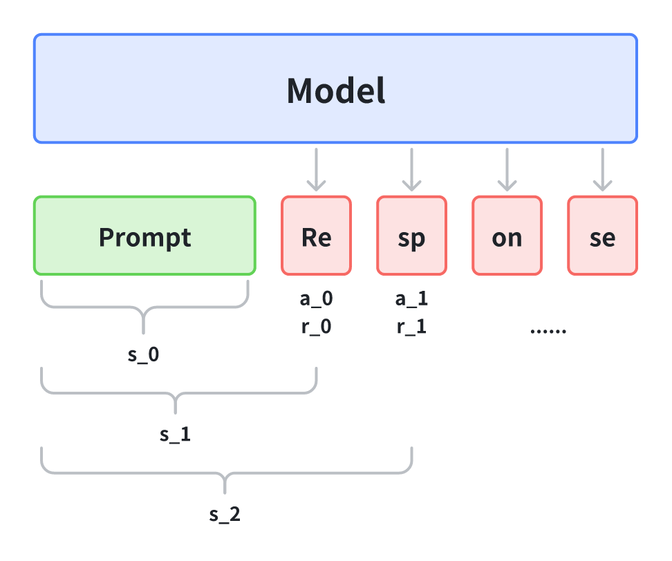

> 给定一个prompt，大模型会**在 $t$时刻生成一个token，然后下一个时刻根据prompt+上一时刻的token再去生成下一个token**，进行自回归的生成，所以可以定义强化学习中的各个概念为：
>
> * **动作$a_t$：**&#x751F;成的 `token`，动作空间就是整个词表，动作空间大小就是词表大小$|V|$
>
> * **策略$\pi(a_t|s_t)$：**&#x6839;据当前状态$s_t$生成动作`token`$a_t$的概率&#x20;
>
> * **状态$s_t$：**&#x4E0A;文以及$t$时刻前生成的**所有 token concat的 token 序列，**&#x521D;始状态 $s_0$就是prompt的token序列
>
> * **状态转移：**&#x8FD9;里的强化学习状态转移是确定性的，定义为**当前状态和动作的concat的token序列为下一个状态**，即$s_{t+1}=[s_t,a_t]$
>
> * **奖励$r_t$和价值 $V_t$：**&#x8FD9;里的定义就是一般强化学习的定义，**即时奖励以及状态价值函数**

## **NLP RL 优化目标**

> **强化学习的优化目标是最大化累积奖励的期望值：**
>
> $\max _\pi \mathbb{E}_{x \sim \mathcal{D}, y \sim \pi} [r(x, y)]$
>
> 其中$x,y$分别表示 prompt 和 response，$r(x,y)$即代表对于prompt，当前response的奖励值
>
> **带行为约束（behavior-regularized）的强化学习优化目标等同于对奖励值做出了修改：**
>
> $\max _\pi \mathbb{E}_{x \sim \mathcal{D}, y \sim \pi} [r(x, y)] - \beta D_{\text{KL}} [\pi(y|x) \| \pi_{\text{ref}}(y|x)]\\ = \max _\pi \mathbb{E}_{x \sim \mathcal{D}} \mathbb{E}_{y \sim \pi(y|x)} \left[ r(x, y) - \beta \log \frac{\pi(y|x)}{\pi_{\text{ref}}(y|x)} \right] \\$
>
> 目的是**约束强化学习策略在一个距离行为/参考策略不太远的范围内进行更新，防止策略跑偏**，这个**行为策略通常是offline数据集的行为克隆策略，或者是大模型中的SFT初始化策略（reference 策略）**

# **3.3.2 RLHF流程**

> 深度学习RLHF首次在2017年的论&#x6587;***&#x20;Deep Reinforcement Learning from Human Preferences&#x20;***&#x4E2D;被提出，一开始是用于解决**复杂强化学习任务中环境奖励函数设计问题**的
>
> **论文链接：https://arxiv.org/pdf/1706.03741**

## **研究背景**

> * 强化学习在许多任务中面临**目标复杂、难以定义奖励函数**的问题，导致**难以将人类实际目标传达给智能体**
>
> * 不正确的、有偏的奖励函数会导致**智能体过分利用(exploit)奖励函数**，产生**reward hacking**问题，即**实际学到的行为与人类期望不符合，甚至有害**
>
> * 奖励函数的设计工程需要**大量的专业人士的精力**
>
> * 现有方法如**逆强化学习和模仿学习在处理复杂行为时存在局限性，直接使用人类反馈作为奖励函数成本过高**

## **研究目标**

> 用于**解决没有明确定义奖励函数的强化学习**问题，需要满足以下几点：
>
> * 能够解决那些人类**只能识别期望行为**，但**不一定能提供demonstration的任务**
>
> * 允许**非专家用户对智能体进行教导**
>
> * 能够**扩展到大型问题**
>
> * 在**用户反馈方面经济高效**

## **研究方法**

> 算法将**奖励函数与人类偏好进行拟合**，同时**用RL算法训练一个策略来优化当前预测的奖励函数**。**给人类提供两个智能体行为轨迹的片段(一般来说是视频、动图)，让人给出自己的偏好标签(就是那个片段更好)，而不是提供绝对数值分数**。在某些领域中，人类更容易进行比较，而且这种比较对于学习人类偏好同样有用。比较智能体轨迹片段与比较单个状态几乎一样快，由此产生的比较结果明显更有帮助

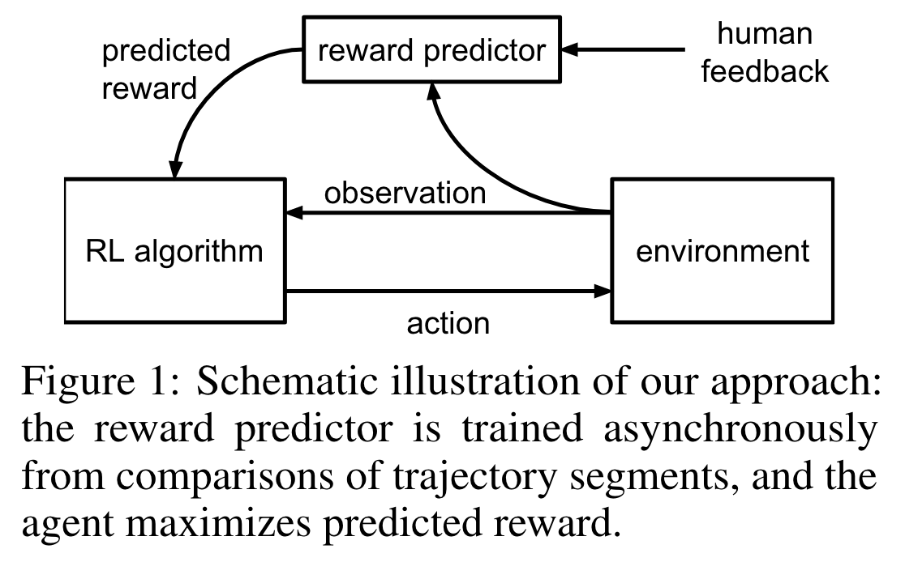


> * **对比标签：**&#x5BF9;于智能体轨迹片段 $\sigma^1$和 $\sigma^2$来说，下面的式子表示 $\sigma^1$比 $\sigma^2$更被人偏好，得到的标签 $y$也可以表示如下，0.5代表同等偏好程度。**&#x20;$s,a$分别表示智能体的观测/状态和动作**
>
> **&#x20;**$\sigma^1\succ\sigma^2=
> \left(\left(s_{0}^{1}, a_{0}^{1}\right), \ldots,\left(s_{k - 1}^{1}, a_{k - 1}^{1}\right)\right) \succ\left(\left(s_{0}^{2}, a_{0}^{2}\right), \ldots,\left(s_{k - 1}^{2}, a_{k - 1}^{2}\right)\right) 
> \\ \\
> y = \{0,1,0.5\} \text{  if  } \{\sigma^1\succ\sigma^2, \sigma^2\succ\sigma^1, \sigma^1=\sigma^2\}$
>
> * **偏好建模：**&#x7531;于RLHF的一个目标是将**奖励函数与人类偏好进行拟合，**&#x5C31;是**利用人类的比较偏好标签来学出一个reward model**，那就涉及到了奖励函数和偏好之间的关联问题，这里给出的方法是，将奖励函数视为解释人类判断的潜在因素，并**假设人类偏好一个片段的概率与潜在奖励在该片段长度上的总和呈指数相关**，基于 **Bradley-Terry 模型**，可以给出**人类偏好片段 $\sigma^1$超过 $\sigma^2$的概率**：
>
> $$
> \hat{P}[\sigma^{1} \succ \sigma^{2}] = \frac{\exp \sum \hat{r}(s_{t}^{1}, a_{t}^{1})}{\exp \sum \hat{r}(s_{t}^{1}, a_{t}^{1}) + \exp \sum \hat{r}(s_{t}^{2}, a_{t}^{2})}$$
>
> * **奖励学习：**&#x5F97;到这个偏好建模以及收集到的人类偏好标签之后，就可以简单的使用**二分类的思路来隐式的学习我们的奖励函数**了，损失函数是分类常用的**交叉熵，**&#x7136;后利用这个loss训练优化得到最后的符合人类偏好的奖励函数
>$$
>   \mathrm{loss}(\hat{r}) = - \mathbb{E}_{(\sigma^{1}, \sigma^{2}, y) \in \mathcal{D}} \left[y(\sigma^1\succ\sigma^2) \log \hat{P}[\sigma^{1} \succ \sigma^{2}] + y(\sigma^2\succ\sigma^1) \log \hat{P}[\sigma^{2} \succ \sigma^{1}]\right]$
> 
>  如果将正样本（被偏好）和负样本（不被偏好）记为 $\sigma^+,\sigma^-$，则上述loss可以写成：
> 
>  $
>   \mathrm{loss}(\hat{r}) = - \mathbb{E}_{(\sigma^{+}, \sigma^{-}, y) \in \mathcal{D}} \left[ \log \hat{P}[\sigma^{+} \succ \sigma^{-}] \right] =- \mathbb{E}_{(\sigma^{+}, \sigma^{-}, y) \in \mathcal{D}} \left[ \log \frac{\exp \sum \hat{r}(s_{t}^{+}, a_{t}^{+})}{\exp \sum \hat{r}(s_{t}^{+}, a_{t}^{+}) + \exp \sum \hat{r}(s_{t}^{-}, a_{t}^{-})}\right]$
> 
>* **策略学习：**&#x5F97;到奖励函数之后就可以应用任何一个强化学习算法去最大化奖励用来产出相应的策略了
> 
>* **在线学习：**&#x8FD9;篇文章提出的方法是在线RLHF(Online RLHF)，就是奖励函数和策略学习是交替同时进行的，伴随着智能体不断的和环境交互产生新的轨迹数据用来给人类打反馈标签

## 研究**总结**

> * **算法原理：**&#x7B97;法通过将奖励函数与人类偏好进行拟合，**使智能体的行为朝着符合人类期望的方向发展**。在训练过程中，同时优化策略以最大化预测的奖励，从而在没有明确奖励函数的情况下，让智能体学会做出符合人类偏好的决策
>
> * **反馈方式优势：**
>
>   * **易于提供：**&#x76F8;比提供绝对数值分数，**人类更容易对智能体轨迹片段进行比较**，降低了反馈的难度，使得非专家用户也能更轻松地参与到智能体的训练过程中
>
>   * **信息丰富：**&#x667A;能体轨迹片段包含了一定的行为序列信息，比单个状态更能反映智能体的行为特点和趋势，因此在学习人类偏好方面更有帮助，能够**为奖励函数的拟合提供更有价值的信息**
>
>   * **在线反馈的好处：**&#x5728;线收集反馈意味着系统可以**实时获取人类的偏好信息**，并**根据新的反馈及时调整策略和奖励函数**。这样可以**避免系统过度依赖之前学习到的奖励函数**，**防止因奖励函数的不准确性或局限性而导致的不良行为**，从而持续提高系统的性能，使其更好地适应复杂多变的任务环境；缺点就是**实时收集人类偏好标签成本很高**，所以之后在LLM中应用的时候，很多工作都在研究**自动化偏好标签，比如RLAIF，利用大模型代替人类给偏好**

# **3.3.3 LLM对齐中的RLHF+PPO**

> 训练框架仍然选用`OpenRLHF`比较方便好用

## **InstructGPT**

> 现在又看回来具体在LLM的对齐中是怎么应用上面那一套RLHF的流程和PPO算法的，OpenAI最早在**InstructGPT**中将RLHF技术应用在LLM post-training中，使模型真正与人类意图对齐
>
> **论文：*Training language models to follow instructions with human feedback***
>
> **链接：https://arxiv.org/pdf/2203.02155**

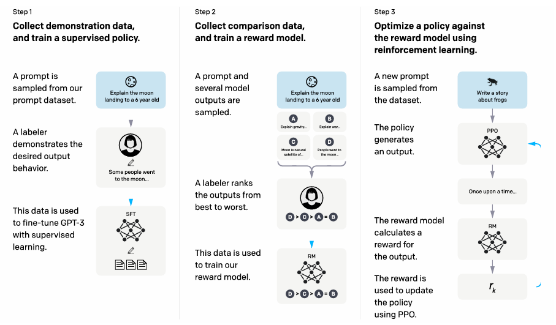

> InstructGPT的整个流程是**先基于GPT-3进行SFT训练，增强模型的指令遵循能力，然后人力给数据打偏好标签，得到的偏好数据利用前面提到的RLHF的偏好建模训练一个Reward Model，最后再应用PPO算法最大化这个Reward Model提供的奖励值来基于SFT模型训练得到InstructGPT**，整个过程有几个值得注意的地方：
>
> * **Reward Model是在移除了最后非嵌入层(unembedding)的 SFT 模型的基础上训练的**，使其接收一个prompt和response，并输出一个标量reward值。现在的做法通常是在原本模型基础上增加一个`[hidden_size,1]` 的线性层训练，输出一个标量值作为奖励
>
> * 图中可以看到，**对于同一个prompt， 人工可能需要打标签的response不止两个**，也就是需要给多个回答排序，然后InstructGPT的做法是通过排序标签，再将其转换为 $C_K^2$个两两对比的偏好标签
>
> * InstructGPT在**实现PPO的时候对强化学习的目标进行了修改**，原本的强化学习的目标是**最大化奖励**：
>
>   $$
>   \text{objective}(\phi) = \mathbb{E}_{(x, y) \sim D_{\pi_{\phi}^{\text{RL}}}} \left[ r_{\phi}(x, y)  \right]
>   $$
>
>   InstructGPT在此基础上，参考之前的一些文献，对奖励函数加上了**RL policy和 SFT policy的per-token level KL散度来防止RL policy的过优化**，导致偏离SFT模型太远。这样的操作最常见在**Behavior-Regularized Offline RL（行为约束的离线强化学习）**&#x4E2D;：
>
>   $$
>   \text{objective}(\phi) = \mathbb{E}_{(x, y) \sim D_{\pi_{\phi}^{\text{RL}}}} \left[ r_{\phi}(x, y) - \beta \log \left( \frac{\pi^{\text{RL}}_{\phi}(y \mid x)}{\pi^{\text{SFT}}(y \mid x)} \right) \right]
>   $$
>
>   形式上等同于重新设计了奖励函数，其中包含了行为约束项，使得RL策略的行为不要太偏离SFT模型。除此之外，**InstructGPT还加入了pretrain数据的梯度（PPO-ptx，详见3.3.4章PPO训练的Trick和问题），来修复在公开NLP数据集上的性能回归**：
>
>   $$
>   \text{objective}(\phi) = \mathbb{E}_{(x, y) \sim D_{\pi_{\phi}^{\text{RL}}}} \left[ r_{\phi}(x, y) - \beta \log \left( \frac{\pi^{\text{RL}}_{\phi}(y \mid x)}{\pi^{\text{SFT}}(y \mid x)} \right) \right] + \gamma \mathbb{E}_{x \sim D_{\text{pretrain}}} \left[ \log \left( \pi_{\text{RL}}^{\phi}(x) \right) \right]
>   $$

* **整体流程图：**&#x6574;体的流程中包含**Actor、Critic、Reward和Reference(SFT)四个模型**


## **Actor Model**

> input一条prompt （batch\_size = 1），output对应的response，再将prompt + response去计算得到loss，用于更新actor，具体&#x7684;**&#x20;PPO loss 和 GAE** 计算&#x89C1;**&#x20;3.2.11 PPO算法[ 3.2 RL 强化学习基础](https://kcnd4kn8i6ap.feishu.cn/wiki/Cz5YwDjdpiPbIFkiqWecXt0EnNb?fromScene=spaceOverview#share-VRhadlhMUoxfSzxH3u0cfZXvnY2)**， $\epsilon$取0\~1之间的值
>
> $$
> \text{Actor\_loss} = -\min \left(   \frac{\pi(a_t | s_t)}{\pi_{\text{old}}(a_t | s_t)}\cdot A_t(s_t,a_t), \text{clip} \left( \frac{\pi(a_t | s_t)}{\pi_{\text{old}}(a_t | s_t)}, 1-\epsilon, 1+\epsilon \right) \cdot A_t(s_t,a_t)\right)
>  $$
>
> 可以看到我们计算的是token-level的优势函数，每一个输出token处都计算loss


```python
class PolicyLoss(nn.Module):
    """
    Policy Loss for PPO
    """

    def __init__(self, clip_eps: float = 0.2) -> None:
        super().__init__()
        self.clip_eps = clip_eps

    def forward(
        self,
        log_probs: torch.Tensor,
        old_log_probs: torch.Tensor,
        advantages: torch.Tensor,
        action_mask: Optional[torch.Tensor] = None,
    ) -> torch.Tensor:
        ratio = (log_probs - old_log_probs).exp()
        surr1 = ratio * advantages
        surr2 = ratio.clamp(1 - self.clip_eps, 1 + self.clip_eps) * advantages
        loss = -torch.min(surr1, surr2)
        loss = masked_mean(loss, action_mask, dim=-1).mean()
        return loss

def masked_mean(tensor, mask, dim):
    if mask is None:
        return tensor.mean(axis=dim)
    return (tensor * mask).sum(axis=dim) / mask.sum(axis=dim)
```

## **Critic Model**

> 用于预测期望总收益 $V_t$ ，初始化方式有很多种，例如**和Actor共享部分参数、从Reward Model初始化而来**。Value Head层是个简单的线形层，用于将原始输出结果映射成单一的值。**Critic Model或者说Value Model用V值的TD-error更新，当前状态的预估收益对齐即时奖励加上下一步状态预估收益，TD-error详见3.2.6**
>
> $  \text{Critic\_loss} = (r_t + \gamma \cdot V_{t+1} - V_t)^2  $
>
> 实际的代码中会用到GAE+value=returns，然后critic当前的输出values去对齐returns， $Critic\_loss = (returns-values)^2$
>
> 在RLHF中，我们不仅要训练模型生成符合人类喜好的内容的能力（Actor），也要提升模型对人类喜好量化判断的能力（Critic）。这就是Critic模型存在的意义（上述是通俗解释，具体可以回顾 **3.2.10 Actor-Critic算法[ 3.2 RL 强化学习基础](https://kcnd4kn8i6ap.feishu.cn/wiki/Cz5YwDjdpiPbIFkiqWecXt0EnNb?fromScene=spaceOverview#share-SAZRdtSAQomwSlxOKMTcDXRpnqe)**）
>
> **状态价值函数V是针对状态来说的，所以V0对应S0，即prompt，所以取prompt最后一个token位置的输出作为V0**

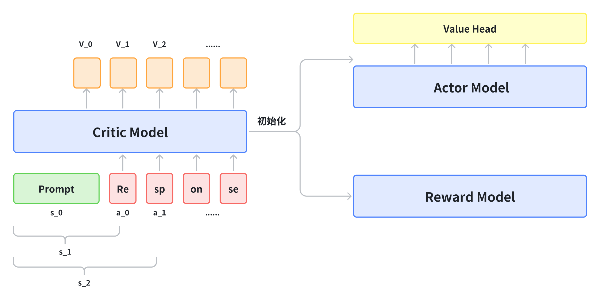

```python
class ValueLoss(nn.Module):
    """
    values: 实时critic跑出来的预估预期收益
    old_values：老critic跑出来的预估预期收益
    returns：实际预期收益
    mask：response部分的mask
    """

    def __init__(self, clip_eps: float = None) -> None:
        super().__init__()
        self.clip_eps = clip_eps

    def forward(
        self,
        values: torch.Tensor,
        old_values: torch.Tensor,
        returns: torch.Tensor,
        action_mask: Optional[torch.Tensor] = None,
    ) -> torch.Tensor:
        # 这里对Value也进行了clip操作，道理和actor loss那个clip一样
        if self.clip_eps is not None:
            values_clipped = old_values + (values - old_values).clamp(-self.clip_eps, self.clip_eps)
            surr1 = (values_clipped - returns) ** 2
            surr2 = (values - returns) ** 2
            loss = torch.max(surr1, surr2)
        else:
            loss = (values - returns) ** 2

        loss = masked_mean(loss, action_mask, dim=-1).mean()
        return 0.5 * loss
```

## **Reward Model**

> 在**PPO训练过程中Reward Model参数冻结，只用来提供奖励值**，只取最后token处的奖励值，作为整个句子的奖励 $r(x,y)$。Reward model一般是在SFT model的基础上添加Value Head训练的，具体reward model训练流程和代码见 **（9.2.4章RM训练）**

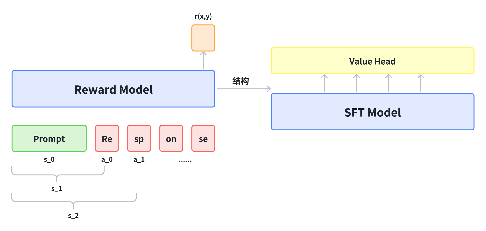

> **Reward Model训练的loss如下：**
>
> $\text{Reward\_loss}=- \mathbb{E}_{(x,y_w,y_l)\sim D} \left[\log\left(\sigma\left(r(x,y_w)-r(x,y_l)\right)\right)\right]$
>
> 其中$x,y_w,y_l$分别表示`prompt`、`chosen response` 和 `rejected response`
>
> sigmoid函数： $\sigma(x)=\frac{1}{1+\exp(-x)}$，所以 $\sigma(r(x,y_w)-r(x,y_r))=\frac{\exp(r(x,y_w))}{\exp(r(x,y_w))+\exp(r(x,y_l))}$
>
> 最后的reward loss为
>
> $\text{Reward\_loss}=- \mathbb{E}_{(x,y_w,y_l)\sim D} \left[\log\frac{\exp(r(x,y_w))}{\exp(r(x,y_w))+\exp(r(x,y_l))}\right]$

```python
class PairWiseLoss(nn.Module):
    """
    Pairwise Loss for Reward Model
    """
    def forward(self, chosen_reward, reject_reward, margin):
        if margin is not None:
            loss = -F.logsigmoid(chosen_reward - reject_reward - margin)
        else:
            loss = -F.logsigmoid(chosen_reward - reject_reward)
        return loss.mean()
```

> ### **与传统强化学习RLHF的对比**
>
> 对比一下我们前面**3.3.2章节[ 3.3 RLHF 基于人类反馈的强化学习](https://kcnd4kn8i6ap.feishu.cn/wiki/TQqTwh2uwiSrqYktIPccTQOcn0g?fromScene=spaceOverview#share-Wq9IdaBcnoFbVNxMffzcxW2xnMd)**&#x4F20;统强化学习的RLHF的loss：
>
> $
> \text{Reward\_loss}  =- \mathbb{E}_{(\sigma^{+}, \sigma^{-}, y) \in \mathcal{D}} \left[ \log \frac{\exp \sum r(s_{t}^{+}, a_{t}^{+})}{\exp \sum r(s_{t}^{+}, a_{t}^{+}) + \exp \sum r(s_{t}^{-}, a_{t}^{-})}\right]$
>
> **传统强化学习的RLHF是对一条轨迹里的所有 $(s,a)$状态动作对的奖励进行了加和，而大模型Reward model这里则只有一个针对整个response的奖励值；传统强化学习对比的两个片段轨迹初始状态 $s^+_0,s^-_0$不一定是相同的，而大模型的偏好数据这里初始状态prompt$x$是相同的**
>
> 更一般的，我们可以**把传统强化学习RLHF loss中的奖励加和换成一个聚合操作 `AGG`**，其中聚合操作可以取多种 $\text{AGG}=[\sum,\sum\beta,-1,\text{Transformer()}]$，这里列举的聚合操作分别是加和、加权和、取最后和Transformer聚合
>
> **从这里可以延伸出对大模型Reward model训练loss的两个理解**，首先我们看一下Reward Model训练的时候的操作如下图，对于**每一个response只取最后一个token位置对应的value作为整个response的reward值即 $r(x,y)$**

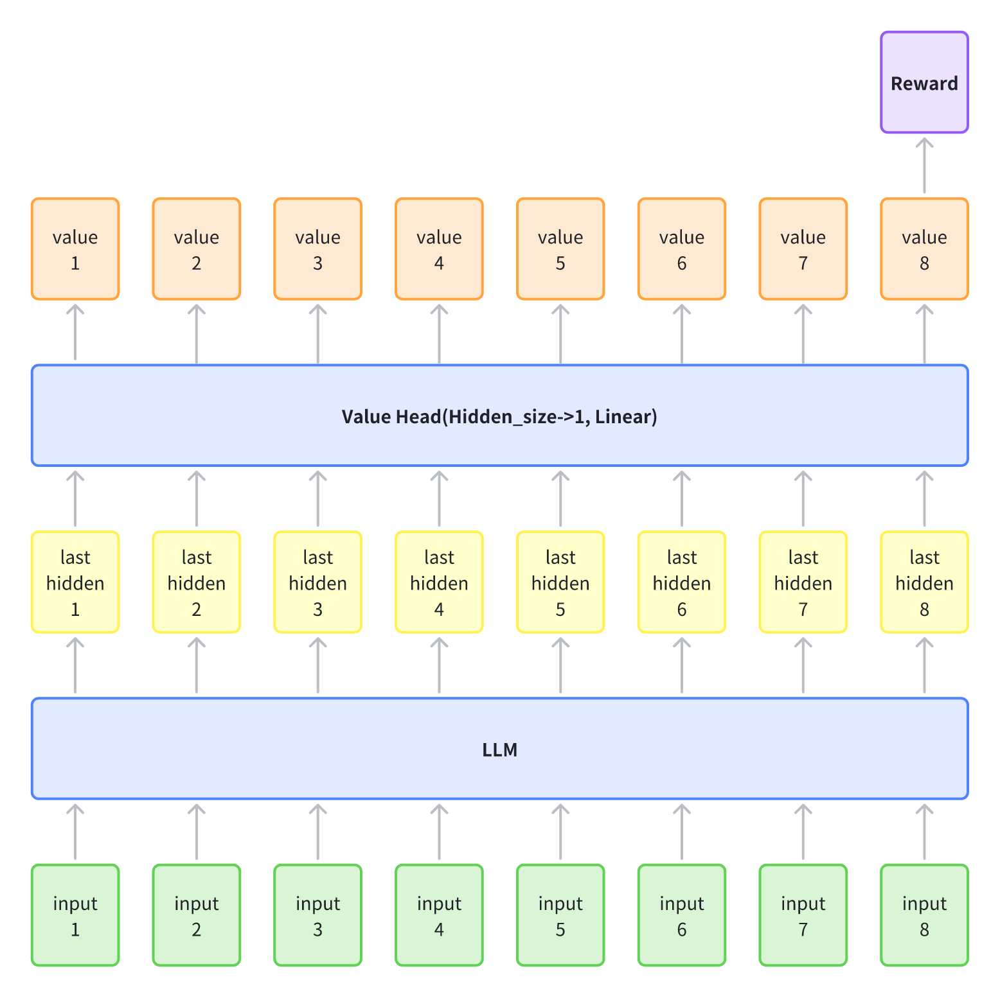

> ### **MDP角度**
>
> * **第一个角度，将prompt到response的过程看作是单步MDP**。即初始状态 $s_0=\text{prompt}$，动作 $a_0=\text{response}$，二者都是token序列，区别是之前定义的NLP RL MDP里面动作是一个token，这里是token序列。这样就是一个单步MDP，没有转移到下一个状态的，然后根据当前状态动作给出奖励 $r(s_0,a_0)$也就是 $r(x,y)$。从这个角度看，可以理解采用了`AGG`聚合操作中的`-1`操作，即最后一步状态动作对的奖励
>
> * **第二个角度，将prompt到response的过程看作多步MDP**。即`[prompt,response]`中每一个token都是一个动作，状态则是当前动作和之前所有token拼接的序列。此时将整个Casual LLM看作整体，中间结果看作 $r(s_t,a_t)$，那么最后一个token位置输出的reward值可以看作是采用了`AGG`聚合操作中的`Transformer`操作，即聚合了整个句子信息的奖励值 $r(x,y)=\text{Transformer}(\mathbb{I(s_0,a_0)},\mathbb{I(s_1,a_1),\cdots,\mathbb{I}}(s_T,a_T))$，$\mathbb{I}(s,a)$代表中间结果
>
> **为什么要用代表整个句子的奖励值？因为偏好标签是句子级别的**（当然到了PRM过程奖励模型的时候也会有中间过程的偏好标签）

## **Reference Model**

> 一般也用**SFT阶段得到的SFT模型做初始化**，在PPO训练过程中，它的参数是冻结的，用来产生per-token 的KL约束项，防止策略导致偏离SFT模型太远，也就是训偏了

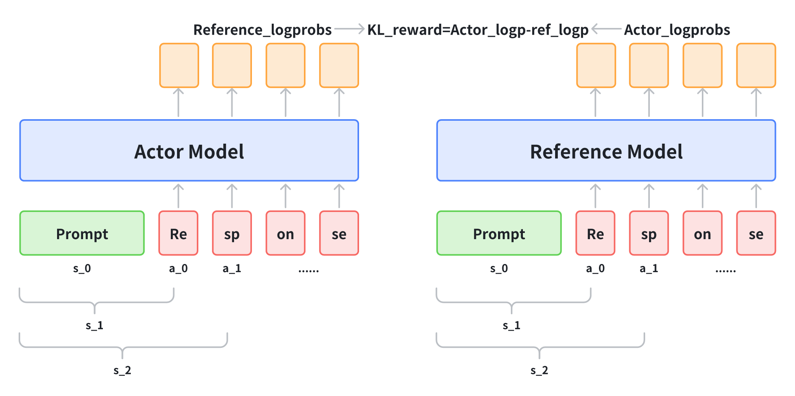

> 然后根据优化目标$\max _\pi \mathbb{E}_{x \sim \mathcal{D}} \mathbb{E}_{y \sim \pi(y|x)} \left[ r(x, y) - \beta \log \frac{\pi(y|x)}{\pi_{\text{ref}}(y|x)} \right] \\$，新的奖励可以写成 $r(x,y)-\beta KL\_reward$
>
> 所以新的token-level reward 可以表示成$\left\{\begin{array}{l}
> r_{t}=-\beta *\left(\log \frac{\pi\left(a_{t} \mid s_{t}\right)}{\pi_{r e f}\left(a_{t} \mid s_{t}\right)}\right), t \neq T \\
> r_{t}=r(x,y) -\beta *\left(\log \frac{\pi\left(a_{t} \mid s_{t}\right)}{\pi_{r e f}\left(a_{t} \mid s_{t}\right)}\right), t=T
> \end{array}\right.$，其中$T$表示终止状态时间，也就是句子末尾的token，或者表示为$r(s_t, a_t) = \textbf{I}(s_t =[\text{EOS}])r(x,y)-\beta \text{KL}(t)$，具体如下图所示：

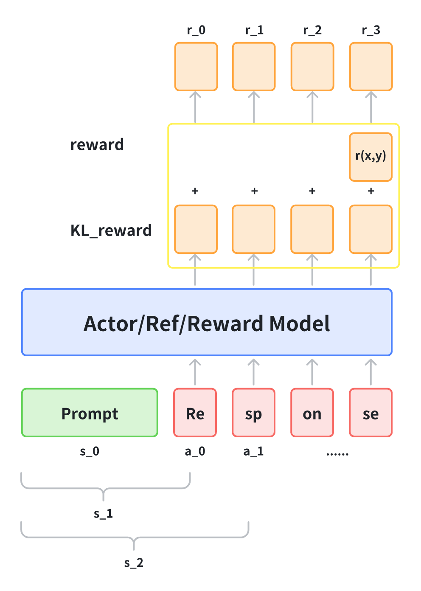

## **Online & Offline RLHF**

> **参考链接：https://www.zhihu.com/question/651021172/answer/3513159005**
>
> **Online和 Offline**也可以**回顾3.2.7章[ 3.2 RL 强化学习基础](https://kcnd4kn8i6ap.feishu.cn/wiki/Cz5YwDjdpiPbIFkiqWecXt0EnNb?fromScene=spaceOverview#share-QwGzdNFoxoeBOox3odmcUjhPnec)**
>
> * **Online 的核心思路就是：让模型自己做生成，我们根据模型生成结果的好坏来打分，用于指导模型进行更新**。Online 需要模型亲自输出答案，然后根据反馈学习；
>
> * **Offline 的方法：**&#x6A21;型不需要亲自输出答案，根据提前收集好的Offline数据集中的给定的「好坏样本」来进行模拟学习。Off Policy 的训练速度能够更快（只用forward看大量的样本来学习，不用generate），但非常依赖给定的数据是否和「模型自身能力」足够相近。最理想的效果就是，找到大量和你自身水平差不多的玩家的对局资料给你学习，这些训练样本的利用率才是最高的。反之，对于 Online 所有的训练样本都是模型自己生成的

# **3.3.4 PPO训练的Trick和问题**

## **模型层面**

> 1. **Token Level KL-Penalty：**&#x52;L模型和SFT模型的响应分布之间的KL散度会对每个token进行计算。这个散度随后在训练期间作为奖励函数中的惩罚项被纳入。具体来说，按标记的奖励表示如下：
>
> $r(s_t, a_t) = \textbf{I}(s_t =[\text{EOS}])r(x,y)-\beta \text{KL}(t)$
>
> $\text{KL}(t) = \log({\pi_{\theta_{\text{}}}(a_t|s_t)^{\text{RL}}}/{\pi^{\text{SFT}}(a_t|s_t)}）$
>
> * **Generalized Advantage Estimation ：**&#x5C06;GAE用于在 PPO 中估计逐个 token 的奖励。**通常设置 λ=1，将 GAE 方法转变为蒙特卡洛估计方法**
>
> * **Adding SFT Loss：**&#x50;PO中**加入额外的监督下一个token预测损失，以及KL散度，可以保留SFT模型的既有能力**

## **PPO层面**

4. **PPO-ptx：论文InstructGPT，**&#x50;PO-ptx就是在原本的PPO优化目标（带KL行为约束的最大化累积奖励）基础上，**增加了一项当前policy在pretrain数据集上的优化目标**，或者说加了在pertain数据集上的预训练loss，即ptx loss，**用于避免策略遗忘预训练阶段学习到的知识**：

   $
   \mathrm{objective}(\phi) = E_{(x,y)\sim D_{\pi_{\phi}^{\mathrm{RL}}}} \left[r_{\theta}(x,y) - \beta \log \left(\pi_{\phi}^{\mathrm{RL}}(y|x)/\pi^{\mathrm{SFT}}(y|x)\right)\right] +  \gamma E_{x\sim D_{\mathrm{pretrain}}} \left[\log(\pi_{\phi}^{\mathrm{RL}}(x))\right]$

   这样做的目的是为了**减轻对齐税（Alignment Tax）**，&#x5373;**&#x20;RLHF 虽然有助于对齐人类偏好，但也可能导致模型在某些 NLP 基准上的性能下降**

   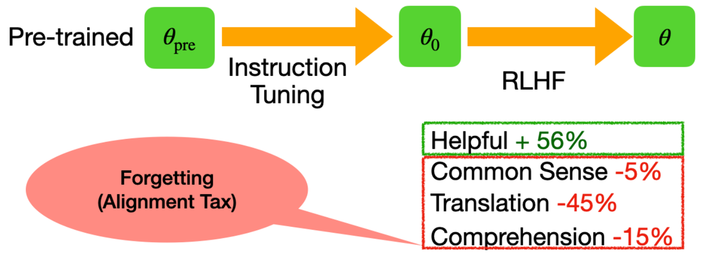

   **对齐税示意图**

   > 论&#x6587;***Training a helpful and harmless assistant with reinforcement learning from human feedback***&#x4E2D;，Anthropic 的研究者评估了大小在 13M 到 52B 之间的 7 种不同模型，得出的结论是对较小的模型来说，会有对齐税，但对较大模型来说，对齐只有好处，尤其是参数量在 13B 到 52B 之间的模型，**即只要模型够大，PPO 本身就能在 NLP 下游任务上带来对齐的好处**，他们还确定了强化学习策略训练中 KL 散度系数的最优参数为 β = 0.001

5. **KL Reward：**&#x7B2C;二项的 KL reward前面有一个系数 beta，从实际训练的体验来说 beta的设置非常重要，可以有效避免策略走的太远（走太远容易导致策略过拟合和坍塌），这里beta的设定通常要结合target KL的设定，即我们可以通过实验确定KL变化多大模型的表现比较好，然后根据这个 target KL来决定 beta的大小，但是这种方式通常需要大量的实验比较。

   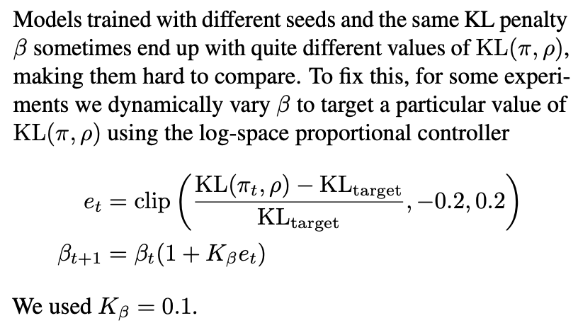

6. **PTX Loss：**&#x6700;后一项是预训练的 Loss，同样这一项有一个系数 $\gamma$，InstructGPT 种将 $\gamma$设为 27.8，但在我的实验经历中，通常这一项应结合 policy loss 和 pretrain loss 的大小综合设定。在我的实验中，gamma < 1 模型才能比较好的收敛

7. **Reward Normalization：**&#x5728; RLHF 的训练&#x4E2D;**&#x20;reward normalization 非常有助于训练的稳定性**，毕竟我们的 reward 不像在游戏环境中那么规则，而是通过一个模型学出来的中间层输出（这就意味着输出范围可能会很大）

8. **Distributed Advantage Normalization：**&#x540C;&#x6837;**&#x20;Advantage Normalization 也是PPO训练中常用的稳定训练的技术**，我们在使用 DeepSpeed 等类似 DDP 的训练手段时应注意做全局样本的 Advantage Normalization，而不是某个DDP进程只针对自己的样本做归一化。这一点目前的 RLHF 开源框架都没有充分考虑进来

9. **Model Initialization：**&#x5177;体来说，用监督微调（SFT）模型初始化 Actor 模型，用奖励模型初始化 Critic 模型，以确保高效的PPO训练。也是一般默认的操作

10. **Adam Learning Rate：**&#x41;ctor model的Adam学习率大约是SFT模型学习率的十分之一。例如，在OpenRLHF中，SFT model的Adam学习率为5e−6，而actor model的学习率为5e−7。此外，评论者模型的Adam学习率大约是SFT model的两倍，一般设置学习率为9e−6

11. **Value Function Loss Clipping：**$Loss_v = \max[(V_{\theta_t} - V_{targ})^2, (\text{clip}(V_{\theta_t}, V_{\theta_{t-1}} - \epsilon,  V_{\theta_{t-1}} + \epsilon) - V_{targ})^2]$，这个在前面3.3.3章节中的代码部分已经涉及到了

12. **Advantage Normalization：**&#x5728;使用均方损失训练值网络的过程中，算法对一些大值敏感。标准化优势可以减轻这些大值的影响。实践中，我们还采用Z分数标准化方法，𝑟=(𝑟−𝜇)/𝛿，其中𝜇是一个批次样本的均值，𝛿是标准差

## **奖励利用和泛化问题**

> 持续在一个训练集合上做RL训练，发现train reward持续在涨，但是在测试集合上人工测试效果会下跌。总的来说，这是Reward hacking和Generalization问题导致的
>
> * **Reward hacking问题：**&#x5F53;train reward在增长的时候，但reward model被hack了，因此看似train reward增长，但其实人工评估的时候效果在下降。**3.3.2章节也有讲过这个问题[ 3.3 RLHF 基于人类反馈的强化学习](https://kcnd4kn8i6ap.feishu.cn/wiki/TQqTwh2uwiSrqYktIPccTQOcn0g?fromScene=spaceOverview#share-Hhi0dbTEVoQIH9xdgxAcv7R1nye)**
>
> * **Generalization问题：**&#x5F53;train reward在增长的时候，假如test dataset的人工评估依然在上涨，那么reward hacking没有发生。此时此刻如果测试集合上效果却在下降，那么就是模型overfit训练集合，泛化问题发生

# **3.3.5 SFT 与 RLHF 的本质区别**

## 分析

> * **SFT优化目标**：给定prompt和对应output，最大化LLM策略 $π_θ$输出output中每个token的条件概率，**output是数据集带的**
>
> * **RLHF优化目标**：PPO为例，可以简化为给定prompt目标为最大化优势 $A_t$，采以重要性采样比值 $\frac{\pi_\theta(o_t|p,o_1,...,o_{t-1})}{\pi_{\theta_{old}}(o_t|p,o_1,...,o_{t-1})}$，**output是 $\pi_{\theta_{old}}$采样得来**
>
> **梯度公式**
>
> $\nabla_\theta J_{SFT}(\theta) = \mathbb{E}\left[\frac{1}{T}\sum_{t=1}^{T} \nabla_\theta \log \pi_\theta(o_t|p,o_1,...,o_{t-1})\right]$
>
> $\nabla_\theta J_{PPO}(\theta) = \mathbb{E}\left[\frac{1}{T}\sum_{t=1}^{T} A_t \nabla_\theta \log \pi_\theta(o_t|p,o_1,...,o_{t-1})\right]$

## 结论

> * SFT本质上在进行**模仿学习**，且所有token对应的**梯度系数为1**，对策略优化的贡献相同
>
> * RLHF-PPO本质上是在进行**探索和利用**，通过自身采样得到输出样本，然后**利用优势函数评判当前动作相对平均动作的价值,调整策略优化的方向和幅度**，优势的正负代表方向，绝对值代表幅度，梯度系数为$A_t$
>
> **PPO梯度推导**
>
> 参照DeepSeekMath附录的假设，简化去掉clip，并只更新一轮，这样有$\pi_{\theta_{old}} = \pi_\theta$
>
> **PPO梯度推导过程**
>
> $\nabla_\theta J_{PPO}(\theta) = \nabla_\theta \left(\mathbb{E}\left[\frac{1}{T}\sum_{t=1}^{T} A_t \frac{\pi_\theta(o_t|p,o_{<t})}{\pi_{\theta_{old}}(o_t|p,o_{<t})}\right]\right)$
>
>
>
> $= \mathbb{E}\left[\frac{1}{T}\sum_{t=1}^{T} A_t \frac{\nabla_\theta \pi_\theta(o_t|p,o_{<t})}{\pi_{\theta_{old}}(o_t|p,o_{<t})}\right]$
>
>
>
> $= \mathbb{E}\left[\frac{1}{T}\sum_{t=1}^{T} A_t \frac{\pi_\theta(o_t|p,o_{<t})}{\pi_{\theta_{old}}(o_t|p,o_{<t})} \cdot \frac{\nabla_\theta \pi_\theta(o_t|p,o_{<t})}{\pi_\theta(o_t|p,o_{<t})}\right]$
>
>
>
> $= \mathbb{E}\left[\frac{1}{T}\sum_{t=1}^{T} A_t \nabla_\theta \log \pi_\theta(o_t|p,o_{<t})\right]$

# **3.3.6 RLAIF 基于AI反馈的强化学习**

> 基于AI反馈（RLAIF）的强化学习，通过使用LLM来生成反馈信号来扩展RLHF范式。这种方法可以补充或替代人类反馈，在**人类标注稀缺、昂贵或不一致**的任务中提供更可扩展的低成本偏好数据

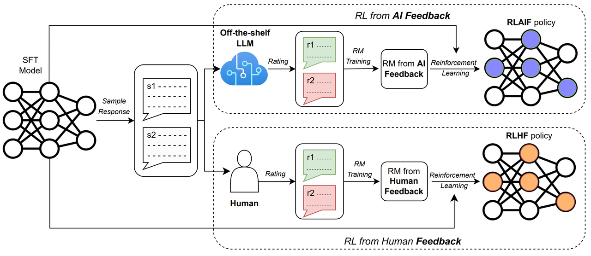

> 大规模应用RLHF的主要挑战在于**RLHF依赖人类生成的偏好标签**，这需要大量资源。标注数据的过程既**时间密集型又昂贵**，并且人类评估人员可能会引入**不一致**的地方。这些约束大大限制了RLHF的可扩展性和效率。RLAIF 利用LLM作为反馈的来源，减少了对人类标注的依赖，提供了传统RLHF的可行替代方案。这种方法可实现连续的反馈生成，可显著提高可扩展性，同时保留人类引导模型优化的灵活性
>
> **RLHF和RLAIF之间的关键区别在于反馈的来源：RLHF取决于人类生成的偏好，而RLAIF使用AI生成的反馈来指导策略更新**。RLAIF可以实现与RLHF相当甚至优于RLHF的性能（**其实现在大部分偏好标签都会通过蒸馏GPT、Claude、Gemini等强模型来生成**）
>
> **AI feedback collect：**&#x4C;LM基于预先定义的标准（Prompt）生成反馈标签，标准可以包括**特定于任务的指标、response的长度等**

> ### **总结**
>
> RLAIF的方法利用了大型语言模型的能力来生成训练数据，这为强化学习提供了一个有趣的新途径，特别是在缺乏标注人力或者开发时间比较紧的情况下。这种方法的潜在优势在于它可能减少了对大量人工标注的需求，从而加速了模型的训练和部署。同时也存在一些需要注意的问题：
>
> * **数据质量：**&#x867D;然大型语言模型（LLM）在许多任务上表现出色，但生成的数据质量仍然可能受到限制。比如，LLM可能会产生与原始内容不一致的输出或包含错误的信息。因此，确 保AI生成的偏好数据的质量至关重要
>
> * **计算成本：**&#x867D;然RLAIF方法可能减少了对人工标注的需求，但使用LLM生成数据仍然可能需要大量的计算资源。并且可能要求非常大的效果非常好的LLM来进行偏好数据的标注，比如使用gpt3.5或者gpt4接口进行标注

# **3.3.7 GRPO**

> PPO作为一种Online强化学习算法，需**要大模型在与环境（一些questions）的交互（根据question输出answer）中进行采样和策略更新**，训练过程中需要**四个模型Actor、Critic、Reward和Reference Model，其中Reward model是提前训练好的，PPO过程中只有Actor和Critic需要训练，Reward和Reference只推理**。**四个模型带来的训练推理资源需求巨大，再加上PPO作为一种on-policy强化学习算法本身训练就不太稳定，一些工作试图对大模型RLHF-PPO算法进行改进**

## **对PPO优化的思考**

> ### **Group Relative Policy Optimization**
>
> **论文：*DeepSeekMath: Pushing the Limits of Mathematical Reasoning in Open Language Models***
>
> **链接：https://arxiv.org/pdf/2402.03300**
>
> 回顾一下PPO算法，我们为了计算`Actor_loss`要用到Reference、Reward和Value三个model，其中**Reference model参与KL reward的计算，Reward和Value model参与GAE的计算**
>
> $$
> \text{Actor\_loss} = -\min \left(   \frac{\pi(a_t | s_t)}{\pi_{\text{old}}(a_t | s_t)}\cdot A_t(s_t,a_t), \text{clip} \left( \frac{\pi(a_t | s_t)}{\pi_{\text{old}}(a_t | s_t)}, 1-\epsilon, 1+\epsilon \right) \cdot A_t(s_t,a_t)\right)
>  $$
>
> $  \text{Critic\_loss} = (r_t + \gamma \cdot V_{t+1} - V_t)^2  $
>
> $
>   A_t^{\text{GAE}} = 
>
>  \sum_{l=0}^{\infty} (\gamma \lambda)^l \delta_{t+l} =\sum_{l=0}^{\infty} (\gamma \lambda)^l \left( r_{t+l} + V_{t+l+1}-V_{t+l}\right)$

> ### **PPO优化的思考**
>
> 加上Actor model，**PPO算法一共需要四个模型**，在**传统强化学习环境中，Actor和Critic以及Reference都是简单的网络实现，Reward是环境自带的人为设计好的（可以理解为rule-based reward）**，所以并不存在大规模的资源需求，而到了LLM这里，**所有的模型都是基于LLM（SFT）模型初始化或者改进的，那么即使在PPO训练过程中只有Actor和Critic需要更新参数，四个模型的推理和训练就需要大量的计算资源，以及四个模型也会带来更多的累积误差**
>
> **从模型数量上入手思考哪些模型是可以去掉的**
>
> * 首先**Actor model是策略本身必须有**
>
> * 其次Reference model可以去掉，这样就退化为最大熵强化学习，但是**Reference model可以防止模型策略太偏离reference策略，所以一般要有**
>
> * 然后就是Reward model，如果替换成rule-based reward，那就不需要单独训练一个Reward model，但是不管rule-based 还是model-based reward，**reward在公式的计算中是不可或缺的**
>
> * 最后就是Critic或者说Value model，我们**能不能通过某种替换，去掉Critic model？**
>
> 回顾策略梯度、Actor-Critic以及PPO算法，都是利用一个**基于奖励的值来引导策略的优化方向**，常用的便是用优势函数Advantage来指导，**优势函数原始定义为 $A_t = Q(s_t,a_t)-V(s_t)$即当前动作的价值比平均动作价值高出的部分**，下面看看GRPO具体是怎么做去掉Critic model的

## **GRPO的优势函数估计**

> GRPO通过**对相同问题 $q$用 $\pi_{\theta_{old}}$采样的多个一组输出 $\{o_1, o_2, \ldots, o_G\}$，然后Reward model对这些回答都给出奖励值**，然后给出优势函数的估计

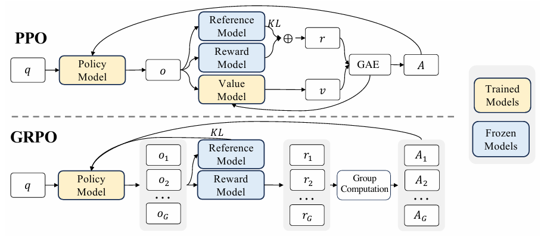

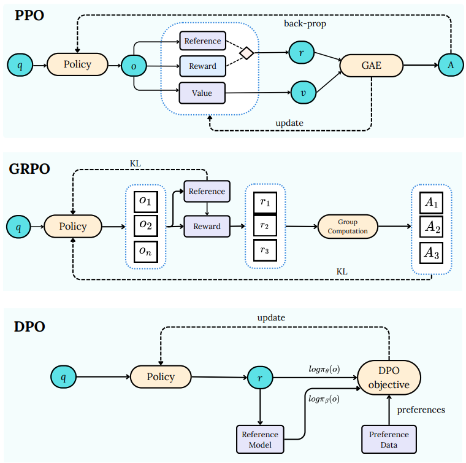

> ### **ORM 结果奖励监督RL**
>
> **即使用传统的ORM（Outcome Reward Model）来进行强化学习过程，针对这种情况，模型对一组输出生成一组奖励值 $\bold{r}=\{r_1, r_2,\cdots,r_G\}$，然后通过下式对优势函数进行估计：**
>
> **$\hat{A}_{i,t}=\hat{r_i}=\frac{r_i-\text{mean}(\bold{r})}{\text{std}(\bold{r})}$**
>
> **上述式子就是对采样的这一组输出的奖励计算归一化奖励作为输出的优势函数，同时赋值给输出中每一个token作为该token处的优势函数。简单理解就是当前第$i$个输出的奖励 $r_i(q,o_i)$比所有输出的奖励平均值高出的优势（可以为负）**
>
> ### **为什么可以这么做？**
>
> 回顾强化学习中价值函数的定义为回报（折扣累积奖励）的期望：
>
> $ V(s) = \mathbb{E}_\pi [G_t | s_t = s] = \mathbb{E}_\pi[R_t+\gamma R_{t+1}+\gamma^2R_{t+2}+\cdots|s_t=s]$
>
> $Q(s,a)=\mathbb{E}_\pi \left[G_t|s_t=s,a_t=a \right]=\mathbb{E}_\pi[R_t+\gamma R_{t+1}+\gamma^2R_{t+2}+\cdots|s_t=s,a_t=a]$
>
> 在结果奖励监督RL的设定下，就是从问题$q$到输出 $o$，状态是 $q$，动作是 $o$，只有一步奖励即 $r(q,o)$，所以价值函数可以进一步写成：
>
> $ V(s) = \mathbb{E}_\pi[R_t|s_t=s]$
>
> $Q(s,a)=\mathbb{E}_\pi[R_t|s_t=s,a_t=a]=R(s,a)$
>
> 所以用 $r_i(q,o_i)$估计 $Q(q,o_i)$，用 $\text{mean}(\bold{r})=\frac{1}{G}\sum_i^G r(q,o_i)$来估计 $V(q)$是合理的，前提是group采样足够多，然后得到优势函数的估计 $A(q,o_i)=Q(q,o_i)-V(q)$。除以 $\text{std}(\bold{r})$是为了归一化
>
> 但是这样得到的优势是整个 $(q,o_i)$的优势值，**GRPO在这里则将整个优势值用在了输出$o_i$每一个的每一个token上（广播broadcast操作）**，相当于当前policy去更新输出 $o_i$中每一个token的条件输出概率 $\pi_\theta(a_t|s_t)$的**更新幅度和方向是一致的**

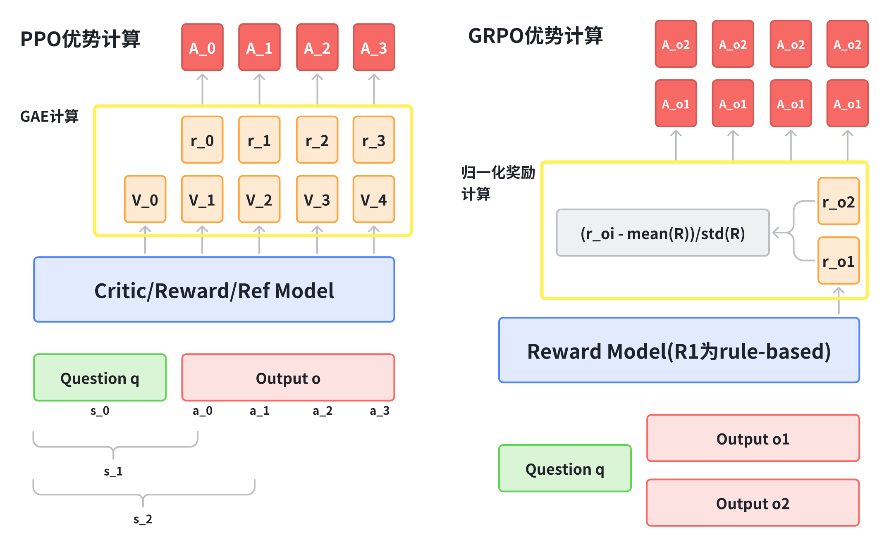

> ### **PRM 过程奖励监督RL**
>
> 使用PRM来进行强化学习，同样采样group输出，对应的一组奖励值为 :
>
> $$
> \mathbf{R}=\left\{\left\{r_{1}^{\mathrm{index}(1)},\cdots,r_{1}^{\mathrm{index}(K_1)}\right\},\cdots,\left\{r_{G}^{\mathrm{index}(1)},\cdots,r_{G}^{\mathrm{index}(K_G)}\right\}\right\}
>  $$
>
> 其中 $index(j)$为第 $j$个步骤的 end token的index， $K_i$是第 $i$个输出的步骤个数，GRPO计算优势如下：
>
> $
> \hat{A}_{i,t}=\sum_{\mathrm{index}(j)\geq t} \widetilde{r}_{i}^{\mathrm{index}(j)} =\sum_{\mathrm{index}(j)\geq t} \frac{{r}_{i}^{\mathrm{index}(j)}-\text{mean}(\bold{r})}{\text{std}(\bold{r})}$
>
> 对于PRM强化学习的情况，GRPO并不能严谨的从强化学习价值函数的定义推导出，所以还是根据公式来简要理解一下。对于所有采样的输出中的所有步骤 $\{\text{step}_{i,j}\}, i\in G,j\in K_i $，根据PRM得到奖励值 $r^{\text{index}(j)}_i$，然后计算得到每一个步骤相对于所有步骤的高出的优势（也可以只理解为进行了一步reward normalization），但是这只是针对单步步骤计算的，实际上我们的输出或者说response是由多个步骤拼接的，所以当前步骤的优势应当包含后续的期望，即当前步骤的优势值为当前步骤以及后续步骤优势值的和

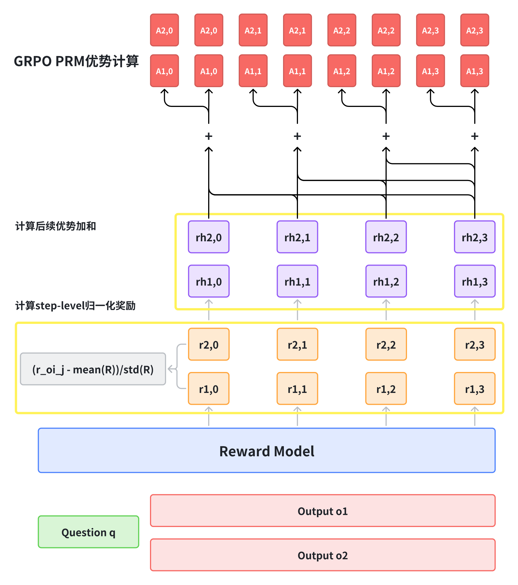

## **GRPO整体更新公式和代码**

> 最后不管是ORM还是PRM进行强化学习，都用下式进行策略更新：
> $$
>\mathcal{J}_{GRPO}(\theta)=\mathbb{E}[q\sim P(Q),\{o_i\}_{i = 1}^{G}\sim\pi_{\theta_{old}}(O|q)]\\
> \quad\quad\frac{1}{G}\sum_{i = 1}^{G}\frac{1}{|o_i|}\sum_{t = 1}^{|o_i|}\left\{\min\left[\frac{\pi_{\theta}(o_{i,t}|q,o_{i,<t})}{\pi_{\theta_{old}}(o_{i,t}|q,o_{i,<t})}\hat{A}_{i,t},\mathrm{clip}\left(\frac{\pi_{\theta}(o_{i,t}|q,o_{i,<t})}{\pi_{\theta_{old}}(o_{i,t}|q,o_{i,<t})},1 - \varepsilon,1+\varepsilon\right)\hat{A}_{i,t}\right]-\beta\mathbb{D}_{KL}[\pi_{\theta}||\pi_{ref}]\right\}
> $$
>
>  注意这里的KL散度采用了一个无偏估计等式，加在策略优化项后面，PPO则是将KL散度约束项加到奖励值当中：
>
> $\text{GRPO}:\quad
>\mathbb{D}_{KL}[\pi_{\theta}||\pi_{ref}]=\frac{\pi_{ref}(o_{i,t}|q,o_{i,<t})}{\pi_{\theta}(o_{i,t}|q,o_{i,<t})}-\log\frac{\pi_{ref}(o_{i,t}|q,o_{i,<t})}{\pi_{\theta}(o_{i,t}|q,o_{i,<t})}-1
> $$
> $$\text{PPO}:\quad
> r_t = r_{\varphi}(q, o_{\leq t}) - \beta \log \frac{\pi_{\theta}(o_t|q, o_{<t})}{\pi_{ref}(o_t|q, o_{<t})}
>$$
> 
> **GRPO代码实现，trl库的版本，代码经过精简，保留核心算法实现部分，帮助理解GRPO，具体需要运行代码请看trl/trainer/grpo\_trainer.py**

```python
def compute_loss(self, model, inputs, return_outputs=False, num_items_in_batch=None):
    if return_outputs:
        raise ValueError("The GRPOTrainer does not support returning outputs")
    # Compute the per-token log probabilities for the model

    prompt_ids, prompt_mask = inputs["prompt_ids"], inputs["prompt_mask"]
    completion_ids, completion_mask = inputs["completion_ids"], inputs["completion_mask"]
    input_ids = torch.cat([prompt_ids, completion_ids], dim=1)
    attention_mask = torch.cat([prompt_mask, completion_mask], dim=1)
    logits_to_keep = completion_ids.size(1)  # we only need to compute the logits for the completion tokens

    per_token_logps = self._get_per_token_logps(model, input_ids, attention_mask, logits_to_keep)

    # Compute the KL divergence between the model and the reference model
    ref_per_token_logps = inputs["ref_per_token_logps"]
    per_token_kl = torch.exp(ref_per_token_logps - per_token_logps) - (ref_per_token_logps - per_token_logps) - 1

    # x - x.detach() allows for preserving gradients from x
    advantages = inputs["advantages"]
    per_token_loss = torch.exp(per_token_logps - per_token_logps.detach()) * advantages.unsqueeze(1)
    per_token_loss = -(per_token_loss - self.beta * per_token_kl)
    loss = ((per_token_loss * completion_mask).sum(dim=1) / completion_mask.sum(dim=1)).mean()

    # Log the metrics
    completion_length = self.accelerator.gather_for_metrics(completion_mask.sum(1)).float().mean().item()
    self._metrics["completion_length"].append(completion_length)

    mean_kl = ((per_token_kl * completion_mask).sum(dim=1) / completion_mask.sum(dim=1)).mean()
    self._metrics["kl"].append(self.accelerator.gather_for_metrics(mean_kl).mean().item())

    return loss
def _get_per_token_logps(self, model, input_ids, attention_mask, logits_to_keep):
    # We add 1 to `logits_to_keep` because the last logits of the sequence is later excluded
    logits = model(
        input_ids=input_ids, attention_mask=attention_mask, logits_to_keep=logits_to_keep + 1
    ).logits  # (B, L, V)
    logits = logits[:, :-1, :]  # (B, L-1, V), exclude the last logit: it corresponds to the next token pred

    # Compute the log probabilities for the input tokens. Use a loop to reduce memory peak.
    per_token_logps = []
    for logits_row, input_ids_row in zip(logits, input_ids[:, -logits_to_keep:]):
        log_probs = logits_row.log_softmax(dim=-1)
        token_log_prob = torch.gather(log_probs, dim=1, index=input_ids_row.unsqueeze(1)).squeeze(1)
        per_token_logps.append(token_log_prob)
    return torch.stack(per_token_logps)
def _prepare_inputs(self, inputs: dict[str, Union[torch.Tensor, Any]]) -> dict[str, Union[torch.Tensor, Any]]:
    device = self.accelerator.device
    prompts = [x["prompt"] for x in inputs]
    prompts_text = [maybe_apply_chat_template(example, self.processing_class)["prompt"] for example in inputs]
    prompt_inputs = self.processing_class(
        prompts_text, return_tensors="pt", padding=True, padding_side="left", add_special_tokens=False
    )
    prompt_inputs = super()._prepare_inputs(prompt_inputs)
    prompt_ids, prompt_mask = prompt_inputs["input_ids"], prompt_inputs["attention_mask"]

    if self.max_prompt_length is not None:
        prompt_ids = prompt_ids[:, -self.max_prompt_length :]
        prompt_mask = prompt_mask[:, -self.max_prompt_length :]
        
    # Regular generation path
    with unwrap_model_for_generation(self.model, self.accelerator) as unwrapped_model:
        prompt_completion_ids = unwrapped_model.generate(
            prompt_ids, attention_mask=prompt_mask, generation_config=self.generation_config
        )

    # Compute prompt length and extract completion ids
    prompt_length = prompt_ids.size(1)
    prompt_ids = prompt_completion_ids[:, :prompt_length]
    completion_ids = prompt_completion_ids[:, prompt_length:]
    prompt_mask = prompt_mask.repeat_interleave(self.num_generations, dim=0)

    # Mask everything after the first EOS token
    is_eos = completion_ids == self.processing_class.eos_token_id
    eos_idx = torch.full((is_eos.size(0),), is_eos.size(1), dtype=torch.long, device=device)
    eos_idx[is_eos.any(dim=1)] = is_eos.int().argmax(dim=1)[is_eos.any(dim=1)]
    sequence_indices = torch.arange(is_eos.size(1), device=device).expand(is_eos.size(0), -1)
    completion_mask = (sequence_indices <= eos_idx.unsqueeze(1)).int()

    # Concatenate prompt_mask with completion_mask for logit computation
    attention_mask = torch.cat([prompt_mask, completion_mask], dim=1)  # (B*G, P+C)

    logits_to_keep = completion_ids.size(1)  # we only need to compute the logits for the completion tokens

    with torch.inference_mode():
        ref_per_token_logps = self._get_per_token_logps(
            self.ref_model, prompt_completion_ids, attention_mask, logits_to_keep
        )
    # Decode the generated completions
    completions = self.processing_class.batch_decode(completion_ids, skip_special_tokens=True)
    if is_conversational(inputs[0]):
        completions = [[{"role": "assistant", "content": completion}] for completion in completions]

    # Compute the rewards
    prompts = [prompt for prompt in prompts for _ in range(self.num_generations)]  # repeat prompts

    rewards_per_func = torch.zeros(len(prompts), len(self.reward_funcs), device=device)
    for i, (reward_func, reward_processing_class) in enumerate(
        zip(self.reward_funcs, self.reward_processing_classes)
    ):
        if isinstance(reward_func, nn.Module):  # Module instead of PretrainedModel for compat with compiled models
            if is_conversational(inputs[0]):
                messages = [{"messages": p + c} for p, c in zip(prompts, completions)]
                texts = [apply_chat_template(x, reward_processing_class)["text"] for x in messages]
            else:
                texts = [p + c for p, c in zip(prompts, completions)]
            reward_inputs = reward_processing_class(
                texts, return_tensors="pt", padding=True, padding_side="right", add_special_tokens=False
            )
            reward_inputs = super()._prepare_inputs(reward_inputs)
            with torch.inference_mode():
                rewards_per_func[:, i] = reward_func(**reward_inputs).logits[:, 0]  # Shape (B*G,)
        else:
            # Repeat all input columns (but "prompt" and "completion") to match the number of generations
            reward_kwargs = {key: [] for key in inputs[0].keys() if key not in ["prompt", "completion"]}
            for key in reward_kwargs:
                for example in inputs:
                    # Repeat each value in the column for `num_generations` times
                    reward_kwargs[key].extend([example[key]] * self.num_generations)
            output_reward_func = reward_func(prompts=prompts, completions=completions, **reward_kwargs)
            rewards_per_func[:, i] = torch.tensor(output_reward_func, dtype=torch.float32, device=device)

    # Sum the rewards from all reward functions
    rewards = rewards_per_func.sum(dim=1)

    # Compute grouped-wise rewards
    mean_grouped_rewards = rewards.view(-1, self.num_generations).mean(dim=1)
    std_grouped_rewards = rewards.view(-1, self.num_generations).std(dim=1)

    # Normalize the rewards to compute the advantages
    mean_grouped_rewards = mean_grouped_rewards.repeat_interleave(self.num_generations, dim=0)
    std_grouped_rewards = std_grouped_rewards.repeat_interleave(self.num_generations, dim=0)
    advantages = (rewards - mean_grouped_rewards) / (std_grouped_rewards + 1e-4)
   
    return {"prompt_ids": prompt_ids,"prompt_mask": prompt_mask,"completion_ids": completion_ids,"completion_mask": completion_mask,"ref_per_token_logps": ref_per_token_logps,
        "advantages": advantages,
    }
```

## **GRPO代码的小问题**

> 上述代码compute\_loss函数中在计算重要性采样的时候直接采用了下面的式子计算，并且也没有进行`clip`操作：
>
> **`torch.exp(per_token_logps - per_token_logps.detach())`**
>
> 我们回顾GRPO公式中的重要性采样：
> $$
>\mathcal{J}_{GRPO}(\theta)=\mathbb{E}[q\sim P(Q),\{o_i\}_{i = 1}^{G}\sim\pi_{\theta_{old}}(O|q)]\\
> \quad\quad\frac{1}{G}\sum_{i = 1}^{G}\frac{1}{|o_i|}\sum_{t = 1}^{|o_i|}\left\{\min\left[\frac{\pi_{\theta}(o_{i,t}|q,o_{i,<t})}{\pi_{\theta_{old}}(o_{i,t}|q,o_{i,<t})}\hat{A}_{i,t},\mathrm{clip}\left(\frac{\pi_{\theta}(o_{i,t}|q,o_{i,<t})}{\pi_{\theta_{old}}(o_{i,t}|q,o_{i,<t})},1 - \varepsilon,1+\varepsilon\right)\hat{A}_{i,t}\right]-\beta\mathbb{D}_{KL}[\pi_{\theta}||\pi_{ref}]\right\}
> $$
>
>  TRL在实现的时候直接使用了当前的$\pi_\theta$作为 $\pi_{\theta_{old}}$，即新旧策略一样了！那么这样做有没有问题呢？
>
> 我们可以再回顾一下一般的PPO代码中重要性采样的相关处理，这里我用传统强化学习场景的代码示例一下：

```python
old_log_probs = torch.log(self.actor(states).gather(1, actions)).detach()
for _ in range(self.epochs):
    log_probs = torch.log(self.actor(states).gather(1, actions))
    ratio = torch.exp(log_probs - old_log_probs)
    surr1 = ratio * advantage
    surr2 = torch.clamp(ratio, 1 - self.eps, 1 + self.eps) * advantage  # 截断
    actor_loss = torch.mean(-torch.min(surr1, surr2))  # PPO损失函数
    critic_loss = torch.mean(F.mse_loss(self.critic(states), td_target.detach()))
    self.actor_optimizer.zero_grad()
    self.critic_optimizer.zero_grad()
    actor_loss.backward()
    critic_loss.backward()
    self.actor_optimizer.step()
    self.critic_optimizer.step()
```

> 可以看到，**一般的重要性采样处理，会对一批样本更新多个epoch**，其中初始化第一个epoch的时候新旧策略是一样的，可以得到重要性采样为 $\frac{\pi_\theta}{\pi_{\theta_{old}}}=1$，但是后续会多更新几次当前策略，旧策略不动，所以就不会出现新旧策略一样的情况，这样可以提高当前批次数据的样本效率
>
> 回过头来再看TRL的GRPO实现，相当于少了更新多个epoch这个操作，只更新一次，样本效率低。由于当前策略和旧策略一样，所以也就不需要`clip`操作了，因为重要性权重为1。使用detach操作目的是为了使梯度能够正确回传回当前策略网络，原始代码中的注释：
>
> > **x - x.detach() allows for preserving gradients from x**
>
> 所以TRL的实现等价下面的式子，只靠优势函数和KL项提供梯度信号
>
> $$
> \mathcal{J}_{GRPO}(\theta)=\mathbb{E}[q\sim P(Q),\{o_i\}_{i = 1}^{G}\sim\pi_{\theta_{old}}(O|q)]
> \frac{1}{G}\sum_{i = 1}^{G}\frac{1}{|o_i|}\sum_{t = 1}^{|o_i|}\left\{\hat{A}_{i,t}-\beta\mathbb{D}_{KL}[\pi_{\theta}||\pi_{ref}]\right\}
> $$

```python
def compute_loss(self, model, inputs, return_outputs=False, num_items_in_batch=None):
    # Compute the per-token log probabilities for the model
    prompt_ids, prompt_mask = inputs["prompt_ids"], inputs["prompt_mask"]
    completion_ids, completion_mask = inputs["completion_ids"], inputs["completion_mask"]
    input_ids = torch.cat([prompt_ids, completion_ids], dim=1)
    attention_mask = torch.cat([prompt_mask, completion_mask], dim=1)
    logits_to_keep = completion_ids.size(1)  # we only need to compute the logits for the completion tokens
    per_token_logps = self._get_per_token_logps(model, input_ids, attention_mask, logits_to_keep)
    # Compute the KL divergence between the model and the reference model
    ref_per_token_logps = inputs["ref_per_token_logps"]
    per_token_kl = torch.exp(ref_per_token_logps - per_token_logps) - (ref_per_token_logps - per_token_logps) - 1
    # x - x.detach() allows for preserving gradients from x
    advantages = inputs["advantages"]
    per_token_loss = torch.exp(per_token_logps - per_token_logps.detach()) * advantages.unsqueeze(1)
    per_token_loss = -(per_token_loss - self.beta * per_token_kl)
    loss = ((per_token_loss * completion_mask).sum(dim=1) / completion_mask.sum(dim=1)).mean()
```

> 不过这个问题最近得到了一些修正，现在去看TRL的源码，已经加上了`num_iterations`参数和一些其他改动，下面只看一下计算loss的时候的改动，其他具体改动参考 TRL 库 2025.2.21号的 `Commit e5ae703`
>
> https://github.com/huggingface/trl/commit/e5ae703d352b29537159180087ef8bd4b41bf625
>
> 可以看到多步更新和`clip`操作都更新上去了

```python
# Compute the loss
advantages = inputs["advantages"]
# When using num_iterations == 1, old_per_token_logps == per_token_logps, so we can skip it's computation (see
# _generate_and_score_completions) and use per_token_logps.detach() instead.
old_per_token_logps = inputs["old_per_token_logps"] if self.num_iterations > 1 else per_token_logps.detach()
coef_1 = torch.exp(per_token_logps - old_per_token_logps)
coef_2 = torch.clamp(coef_1, 1 - self.epsilon, 1 + self.epsilon)
per_token_loss1 = coef_1 * advantages.unsqueeze(1)
per_token_loss2 = coef_2 * advantages.unsqueeze(1)
per_token_loss = -torch.min(per_token_loss1, per_token_loss2)
```

## 实际训练中的问题及解法

### GRPO训练时为什么会产生大量的重复内容

> #### 背景
>
> LLM通过GRPO 这种 On-Policy 方法进行RL训练时，普遍存在Policy Collapse问题，即策略熵急剧下降。这一现象直接导致模型生成内容的探索性丧失和多样性不足，最终表现为**大量重复或模式化的输出**。具体表现来说，可能有下面两种情况：
>
> **Entropy Collapse**：GRPO通常采用 Critic-Free设计，使其策略梯度对长序列任务中高方差、稀疏的奖励信号极其敏感。策略为规避这种不确定性，会倾向于快速收缩至低熵、高确定性的模式，即策略熵单调递减。  &#x20;
>
> **Reward Hacking**：重复性内容是模型最大化RM评分的一种**低成本作弊策略**。若 RM 隐性地将回复长度或冗余信息与高奖励关联，GRPO将精确遵循此信号，鼓励模型生成重复且更长的文本。
>
> **其他可能的原因**：在做RLVR时，标注者倾向选择常见答案，这会加剧模式坍塌，即使奖励模型完美也无法消除。该偏差在最优策略中表现为对常见模式的“温度锐化”，促使模型输出向偏好的单一模式收敛。

> #### 解法
>
> ##### 1. 任意熵策略优化
>
> AEPO旨在取代传统的Entropy Bonus，通过在Temperature-adjusted distributions上应用 REINFORCE 策略梯度，实现对策略熵的稳定和精确控制。
>
> ##### 2. 基于协方差的局部裁剪
>
> 传统的 PPO $ϵ-clip$作用于整个序列的平均优势函数，无法有效管理 token 级别高方差信号积累导致的局部不稳定更新。 Clip-Cov 是一种 Token-Level 的 PPO 改进，通过裁剪那些具有**高协方差**的 Token，从而稳定训练过程。 对于GRPO，Clip-Cov 能够限制局部策略的剧烈突变，有效防止模型过度优化少数 Token 而形成局部重复模式。&#x20;
>
> ##### 3. 策略过滤
>
> PF-PPO在 PPO 采样后，会过滤掉被认为**奖励不可靠的样本**（通常是中等奖励样本），仅使用高信噪比子集进行策略更新。通过提高训练信号的 SNR，降低了策略对含噪奖励信号**过度拟合**的风险，鼓励策略探索真正高质量的区域，从根本上缓解策略收缩和重复模式。
>
> ##### 4. 调参数
>
> 最朴实无华的方法，同时也大概率是可以带来收益。
>
> * Rollout 采样温度：即使policy本身开始收缩，如果在 Rollout 阶段使用较高的采样温度，仍能确保 RL Buffer 中包含更多高熵、差异化的样本。
>
> * KL散度惩罚系数 $β_{KL}$过低会导致策略激进追求 RM 奖励，极易引发策略快速收缩和过拟合（重复内容）。必须以**动态监测 KL 散度和多样性指标**（如 Distinct-N）为指导，进行动态调整。
>
> * 裁剪比：在 GRPO/DAPO 实践中，采用相对较高的裁剪阈值（如 **Clip-Higher ϵ=0.28）**，允许策略进行更激进的更新，有助于对抗早期策略收缩现象。


# **3.3.7 ReMax**

> **论文：ReMax: A Simple, Effective, and Efficient Reinforcement Learning Method for Aligning Large Language Models**

## **策略梯度与PPO回顾**

> ### **策略梯度**
>
> **其中$\psi_t$是一个基于奖励的估计值，用于给后面的策略梯度$\nabla_\theta \log \pi_\theta(a_t|s_t )$提供更新幅度(大小)和方向(正负)**
>
> $g=\mathbb{E}_{\pi_\theta}\left[ \sum^T_{t=0}\psi_t\nabla_\theta \log \pi_\theta(a_t|s_t )\right]$
>
> 基于**多条样本计算期望的话就是：**
>
> $g= \frac{1}{N}\sum_{i=1}^N\sum^T_{t=0}\psi_t^i\nabla_\theta \log \pi_\theta(a_t^i|s_t^i )$

> ### **Actor-Critic类方法对$\psi_t$的估计**
>
> 1. **轨迹的总回报：**$\sum_{t' = 0}^{T} \gamma^{t'} r_{t'}$
>
> 2. **动作$a_t$之后的回报：**$\sum_{t' = t}^{T} \gamma^{t' - t} r_{t'}$：这个就是蒙特卡洛估计，也就是REINFORCE方法用到的方法，方差大
>
> 3. **加入基线的改进版本：**$\sum_{t' = t}^{T} \gamma^{t' - t} r_{t'} - b(s_t)$：通过加入基线 $b(s_t)$来降低方差，一个比较常用的基线就是价值函数$V(s_t)$
>
> 4. **动作价值函数：**$Q^{\pi_{\theta}}(s_t, a_t)$
>
> 5. **优势函数：**$A^{\pi_{\theta}}(s_t, a_t)$
>
> 6. **时序差分：**$r_t + \gamma V^{\pi_{\theta}}(s_{t + 1}) - V^{\pi_{\theta}}(s_t)$：对优势函数的一步估计

> ### **PPO算法**
>
> $$
> \arg \max_{\theta} \mathbb{E}_{s \sim \nu^{\beta}, a \sim \pi_{\theta_k}(\cdot \mid s)} \left[ \min \left( \frac{\pi_{\theta}(a \mid s)}{\pi_{\theta_k}(a \mid s)} A^{\pi_{\theta_k}}(s, a), \text{clip} \left( \frac{\pi_{\theta}(a \mid s)}{\pi_{\theta_k}(a \mid s)}, 1 - \epsilon, 1 + \epsilon \right) A^{\pi_{\theta_k}}(s, a) \right) \right]
>  $$
>
> 对PPO进行一些简化，提取核心，发现**PPO就是用优势函数指导策略更新的策略梯度类方法，只不过在实现的时候loss计算PPO是乘以 $\pi$，策略梯度是乘以 $\log\pi$，都会反向传播更新policy的参数：**
>
> $\arg \max_{\theta} \mathbb{E}_{s \sim \nu^{\beta}, a \sim \pi_{\theta}(\cdot \mid s)} \left[ {\pi_{\theta}(a \mid s)} Adv^{\pi_{\theta}}(s, a)  \right]$

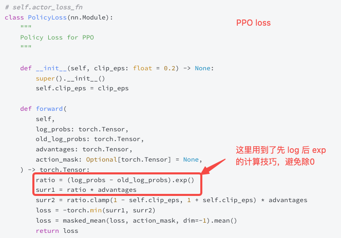

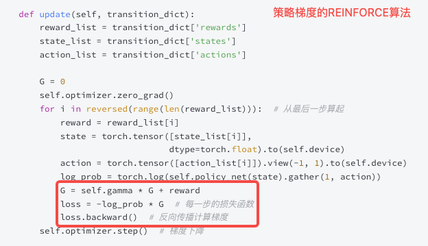

## **ReMax具体算法**

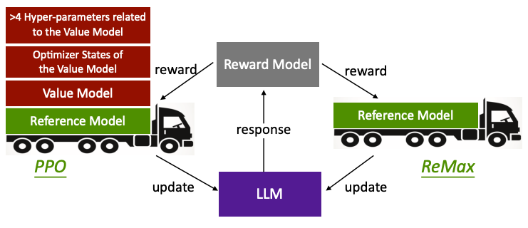

> ### **ReMax**
>
> ReMax的**出发点和GRPO也是一致的，想要去掉Critic Model**，**GRPO是在PPO的形式基础上对优势函数的估计进行重新计算，ReMax则是完全倒退回了策略梯度算法，并对其中的baseline计算做出了修改**（但实际上PPO也属于策略梯度一类的算法，前面也提到了）
>
> $\text{ReMax = REINFORCE + Max}$
>
> 从策略梯度中的REINFORCE方法出发，前面提到**REINFORCE算法就是对 $\psi_t$采用了蒙特卡洛估计后续回报：**
>
> $g= \frac{1}{N}\sum_{i=1}^N\sum^T_{t=0}(\sum_{t' = t}^{T} \gamma^{t' - t} r_{t'}^i)\nabla_\theta \log \pi_\theta(a_t^i|s_t^i )$
>
> 但是**考虑到大模型强化学习中只在最后一个token(动作)处有奖励 $r(x,y)$，这个奖励能够代表整个句子的总回报，中间token(动作)处的奖励看作0**，同时针对大模型强化学习场景修改表述，那么REINFORCE的形式就变成了：
>
> $\begin{aligned}
> g= \frac{1}{N}\sum_{i=1}^N\sum^T_{t=0}r(x^i,y^i)\nabla_\theta \log \pi_\theta(a_t^i|[x^i, a^i_{1:t-1}] )\\ =\frac{1}{N}\sum_{i=1}^N\sum^T_{t=0}r(x^i,a^i_{1:T})\nabla_\theta \log \pi_\theta(a_t^i|[x^i, a^i_{1:t-1}] )
> \end{aligned}
> $$
>其中 $$x^i$$为`prompt`， $$y^i = [a^i_1,a^i_2,\cdots,a^i_T]=a_{1:T}^i$$为`response`， $$a_t^i$$为输出的`token`也是`action`，状态则是通过拼接这些`token`形成的
> 
>**但是之前几期我们讲过，REINFORCE用蒙特卡洛方法估计回报有方差大的问题，所以ReMax实际用到的是减去基线baseline的版本：**
> 
>$$g=\frac{1}{N}\sum_{i=1}^N\sum^T_{t=0}(r(x^i,a^i_{1:T})-b_\theta(x^i))\nabla_\theta \log \pi_\theta(a_t^i|[x^i, a^i_{1:t-1}] )$$
> 
>其中基线具体计算为：
> $$
>b_{\theta}(x^{i}) = r(x^{i},\bar{a}_{1:T}^{i}), \bar{a}_{t}^{i} \in \underset{}{\operatorname{argmax}} \pi_{\theta}(\cdot|x^{i},\bar{a}_{1:t - 1}^{i})
> $
> 
>  即使用在**每一个输出`token`处用 `greedy` 解码所产生的`response`的奖励值作为基线值**，减去基线值能够降低方差，这一点在之前几期大模型强化学习专项也有讲过
>
> 通常情况下我们在 On Policy 训练过程中，LLM 在做 generate 的时会采用 top\_p = 1.0, top\_k = -1 的采样方式，以增强模型的探索。使用 greedy 策略生成句子的得分做为 basline，这之所以能够降低方差，是默认认为通常 SFT 模型已经经过一部分对齐，对于同一个 prompt 模型不太会输出差异性过大的答案
>
> > **因为每一个行为（对应生成句子中的每一个 token）都是一个随机变量，N 个随机变量加在一起，方差就会非常巨大，这通常会导致整个 RL 训练崩掉。**

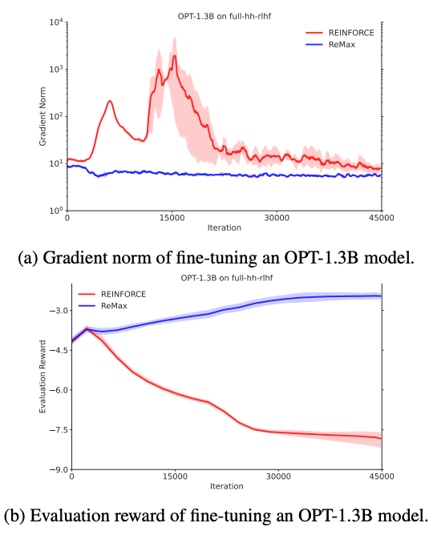

# **3.3.9 RLOO**

> **论文：Back to Basics: Revisiting REINFORCE Style Optimization for Learning from Human Feedback in LLMs&#x20;**
>
> **REINFORCE Leave-One-Out**
>
> 有了对ReMax的分析之后，RLOO的分析就更简单了，从名字可以看出，也是基于REINFORCE算法的改进，同样是对基线值进行了改动:
>
> $b_{\theta}(x^{i},y^i_j) = \frac{1}{M-1}\sum_{k\neq j}r(x^i,y^i_k) ,j\in M$
>
> **通过对`prompt` $x^i$采样 $M$条`response`，然后每一个`response`对应的基线值设置为自己的奖励减去所有其他`response`奖励的均值**，最后对所有的prompt $x^i$的策略梯度如下：
>
> $g=\frac{1}{N}\sum_{i=1}^N\frac{1}{M}\sum^M_{j=0}\left[\left(r(x^i,y^i_j)-\frac{1}{M-1}\sum_{k\neq j}r(x^i,y^i_k)\right)\nabla_\theta \log \pi_\theta(y^i_j|x^i)\right]$

# **3.3.10 REINFORCE++**

> **论文：REINFORCE++: A SIMPLE AND EFFICIENT APPROACH FOR ALIGNING LARGE LANGUAGE MODELS&#x20;**
>
> **这部分其实都包含在了 3.3.4章中[ 3.3 RLHF 基于人类反馈的强化学习](https://kcnd4kn8i6ap.feishu.cn/wiki/TQqTwh2uwiSrqYktIPccTQOcn0g?fromScene=spaceOverview#share-IZoBdQPAro3yOJx8VOecVQEPn5g)**

# **3.3.11 DAPO**

> ### **探索与利用的平衡是强化学习永恒不变的话题**
>
> **探索（Exploration）与利用（Exploitation）之间的平衡**是从传统强化学习开始诞生至今就一直在解决的关键问题，前者鼓励智能体（策略）对环境状态和动作空间进行更多的探索，以期寻得更优的状态和动作，后者强调对于目前的比较好的策略的利用，以持续产生好的轨迹样本以供学习和使用。**奖励设计（Reward Design）则可以说一直是强化学习的灵魂**，好的任务相关的奖励设计往往会降低策略学习所需要的成本，但是这通常需要专家经验和精力，所以才有了RLHF方法，从对比偏好对中学习一个奖励模型出来，但是DeepSeekR1为代表，大模型强化学习又回归了传统强化学习设计标量奖励的模式
>
> 字节开源的技术报告 **DAPO: an Open-Source LLM Reinforcement Learning System at Scale**，则是在DeepSeek GRPO强化学习算法的基础上，围绕探索利用平衡以及奖励设计提出了**DAPO算法（Decoupled Clip and Dynamic sAmpling Policy Optimization）**，主要包含了四个相关的关键技术改进，先来**回顾一下GRPO的公式：**
>
> $\begin{aligned}\mathcal{J}_{\mathrm{GRPO}}(\theta)&=\mathbb{E}_{(q,a)\thicksim\mathcal{D},\{o_i\}_{i=1}^G\thicksim\pi_{\theta_{\mathrm{old}}}(\cdot|q)}\\&\left[\frac1G\sum_{i=1}^G\frac1{|o_i|}\sum_{t=1}^{|o_i|}\left(\min\left(r_{i,t}(\theta)\hat{A}_{i,t},\right.\right.\operatorname{clip}\left(r_{i,t}(\theta),1-\varepsilon,1+\varepsilon\right)\hat{A}_{i,t}\right)-\beta D_{\operatorname{KL}}(\pi_\theta||\pi_{\operatorname{ref}})\Bigg)\Bigg],\end{aligned}$
>
> $\begin{aligned}\mathrm{where}\\r_{i,t}(\theta)&=\frac{\pi_{\theta}(o_{i,t}\mid q,o_{i,<t})}{\pi_{\theta_{\mathrm{old}}}(o_{i,t}\mid q,o_{i,<t})},\quad\hat{A}_{i,t}=\frac{R_{i}-\mathrm{mean}(\{R_{i}\}_{i=1}^{G})}{\mathrm{std}(\{R_{i}\}_{i=1}^{G})}.\end{aligned}$
>
> DAPO对GRPO做的**第一件事其实是去掉KL散度约束项**，KL约束通常出现在offline RL以及大模型RLHF当中，用来约束策略不要偏离行为策略或者初始策略（SFT）太远，但是在训练long-CoT的推理模型的过程中，模型策略会显著不同于初始策略，所以KL约束显得没那么有意义和必需，然后再加上后续的改进得到**DAPO的公式如下：**
>
> $\begin{aligned}\mathcal{J}_{\mathrm{DAPO}}(\theta)&=\quad\mathbb{E}_{(q,a)\sim\mathcal{D},\{o_{i}\}_{i=1}^{G}\sim\pi_{\theta_{\mathrm{old}}}(\cdot|q)}\\&\left[\frac{1}{\sum_{i=1}^{G}|o_{i}|}\sum_{i=1}^{G}\sum_{t=1}^{|o_{i}|}\min\left(r_{i,t}(\theta)\hat{A}_{i,t},\operatorname{clip}\left(r_{i,t}(\theta),1-\varepsilon_{\mathrm{low}},1+\varepsilon_{\mathrm{high}}\right)\hat{A}_{i,t}\right)\right]\end{aligned}$
>
> $\mathrm{s.t.}\quad0<\left|\{o_i\mid\text{is equivalent}(a,o_i)\}\right|<G,\mathrm{where}$
>
> $r_{i,t}(\theta)=\frac{\pi_\theta(o_{i,t}\mid q,o_{i,<t})}{\pi_{\theta_{\mathrm{old}}}(o_{i,t}\mid q,o_{i,<t})},\quad\hat{A}_{i,t}=\frac{R_i-\mathrm{mean}(\{R_i\}_{i=1}^G)}{\mathrm{std}(\{R_i\}_{i=1}^G)}.$

## **Clip-Higher**

> 具体的四个技术改进，第一个是Clip-Higher。顾名思义，就是**把原先的对于重要性权重 $r_{i,t}(\theta)$的向上裁剪的阈值提高了**
>
> 为什么这么做，按照原本的裁剪，取$\epsilon=0.2$，如果当前优势值 $A_{i,t}$是正，意味着我们要提高当前response中token的生成概率，但是对于本身概率就比较低的token来说，例如 $\pi_{\theta_{old}}(o_i|q) = 0.01$，那么根据裁切，当前策略概率只能到 $\pi_{\theta}(o_i|q)=0.012$，几乎没有增长，这对于学习长推理过程以及学习新的推理范式都是限制，限制了对低概率token的探索。所以DAPO调整了向上裁剪的阈值，具体为$\epsilon_{low}=0.2,\epsilon_{high}=0.28$

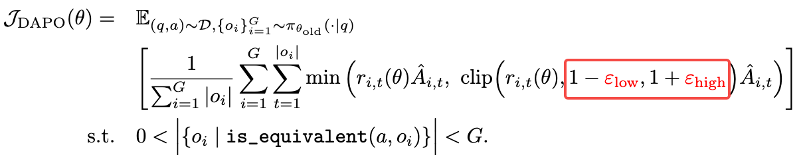

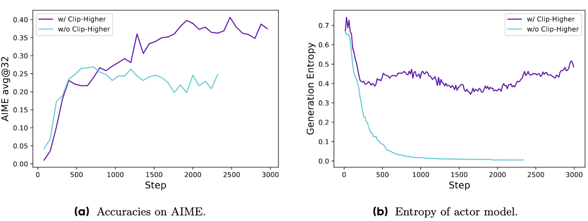

## **Dynamic Sampling**

> 第二个是动态采样，即在训练过程中，**每次训练前都进行过采样，并过滤掉准确率为1和0的prompts**，直到整个batch都是准确率介于0～1之间的prompts
>
> 举个例子，如果GRPO的一个group内所有的outputs准确率都是1，那么根据优势计算公式，该组内的优势就是0，这样会导致梯度消失的问题，然而随着训练步数的增加，准确率为1的回答是在逐步增加的，为了防止梯度消失，增加训练稳定性，DAPO采取了动态采样，过滤掉准确率为1和0的prompts

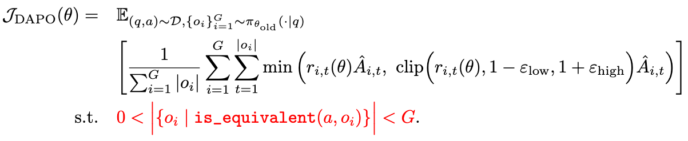

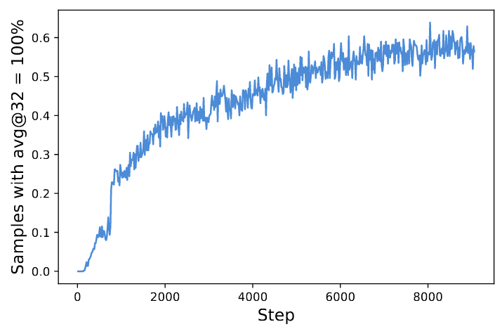

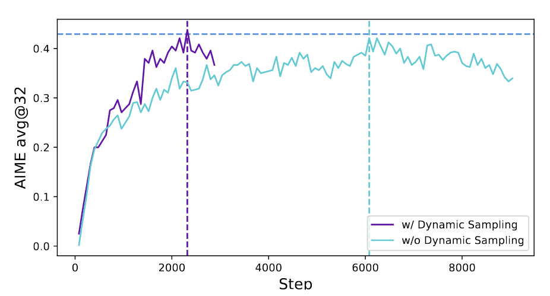

## **Token-Level Loss**


第三个是token级loss，具体就是**对group内的所有outputs的所有token计算loss均值**

GRPO在计算loss的时候是先对单个output计算所有token loss的均值，然后再计算outputs之间的均值：

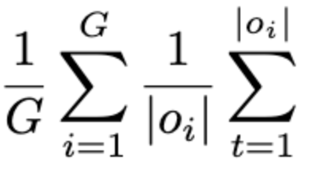


这样会导致**组内outputs对于loss贡献的不均衡，较长的response中的token对总loss的贡献偏低**，这样可能导致两个问题：

* 对于高质量的长样本，这样的loss计算方式会妨碍策略学习其中的关键推理模式

* 对于过长的低质量样本，其中包含胡言乱语和重复现象，这种样本对于loss的贡献也偏低（优势为负，贡献低会导致策略偏离这种回答样式的程度不够）

所以DAPO将sample-level的loss计算改为了token-level的loss计算，可以有效的让长回答更多的影响最后的梯度

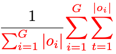

从最后的结果也可以看到，token-level loss的训练过程更加稳定，而且控制entropy不会过高（过高策略偏向随机，过低探索不足，clip-high解决过低问题）

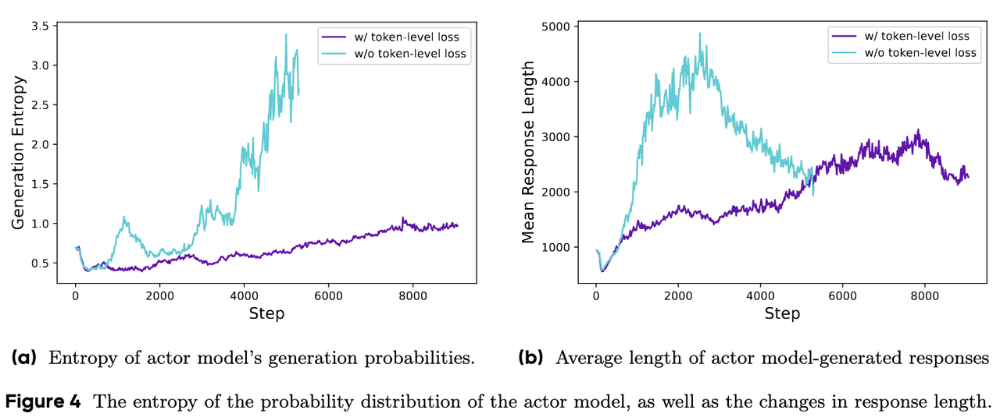

## **Overlong Reward Shaping**

> 第四个是**对过长回答的奖励修改**，具体是**用一种soft punishment的方法对overlong reponse进行惩罚**，**对于处于过长区间内的回答进行惩罚，然后叠加到准确率奖励上**。这里具体的 $L_{max}=20480, L_{cache}=4096$，这样可以有效稳定训练过程，提升性能
>
> $R_{\mathrm{length}}(y)=\begin{cases}0,&|y|\leq L_{\mathrm{max}}-L_{\mathrm{cache}}\\\frac{(L_{\mathrm{max}}-L_{\mathrm{cache}})-|y|}{L_{\mathrm{cache}}},&L_{\mathrm{max}}-L_{\mathrm{cache}}<|y|\leq L_{\mathrm{max}}\\-1,&L_{\mathrm{max}}<|y|&\end{cases}$
>
> 最后的实验结果是在 Qwen2.5-32B模型上进行的，在数学任务AIME2024上的效果，仅用了50%训练步数就超过了GRPO

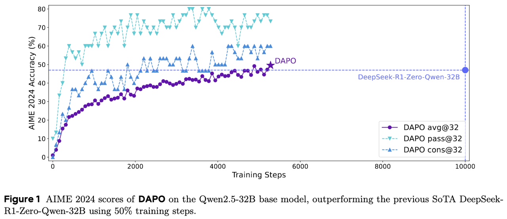

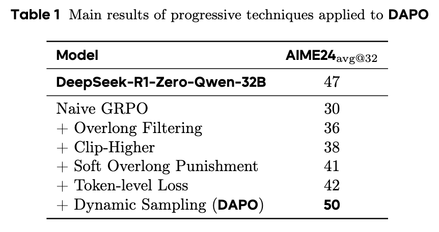

# **3.3.12 VAPO**

> **论文：VAPO: Efficient and Reliable Reinforcement Learning forAdvanced Reasoning Tasks**
>
> **链接:** **https://arxiv.org/pdf/2504.05118**
>
> 提出了 **Value-model-based Augmented PPO（VAPO）**&#x7B97;法来训练 reasoning 模型，基于 Qwen 32B base model 训练的模型在 AIME 2024 dataset 上达到了 SOTA 的60.4分，超越了 Deepseek-R1-Zero-Qwen-32B 和 字节自己之前的 DAPO 算法。**VAPO 训练稳定且高效，在 5000 steps 内就达到了SOTA**。主要研究了如何**通过 Value-model-based 框架去进行 Long-CoT 推理**，并提出了三个关键挑战：**价值模型偏差、异构序列长度以及稀疏奖励问题**

> ### **问题背景**
>
> #### **Value-model-based V.S. Value-model-free**
>
> **Value-model-free 的方法比如GRPO、DAPO**等在大模型强化学习训练方面表现出出色的有效性，这些方法通过**计算一个组内多次采样得到的轨迹的平均奖励来计算优势，去除了显式的价值函数（价值模型）的需求，但在复杂任务中，这些方法会表现出不稳定的性质（MC估计的高方差）**
>
> VAPO提出一个观点，即**如果 Value Model 训练的准确得当，Value-model-based 方法的上限是更高的**（这里其实也和 Reward Model 的困境一样，如果RM训练的足够准确，那么上限肯定是要比rule-based高的，因为可以提供足够细粒度的奖励）：
>
> * **Value Model 可以准确的估计每个执行的 Action 对后续获得的收益 Return 的影响，从而实现更精确的效用分配（Credit Assignment），以及细粒度的策略优化**。这对于复杂的推理任务尤其重要，比如单个推理步骤中的细微错误通常会导致灾难性失败，从而影响策略优化
>
> * 蒙特卡洛（MC）估计，也就是GRPO、DAPO用到的估计优势的方法，通常伴随着高方差，&#x800C;**&#x20;Value Model 则可以给每个 token 都生成低方差的价值估计，从而增强训练稳定性**
>
> * 训练准确的 **Value Model 具有良好的泛化性，可以更好地利用强化学习探索过程中产生的各种轨迹 sample，提升 RL 的上限**

> #### **Value Model 的挑战**
>
> 训练一个完美的 LongCoT 任务的 Value Model 带来了重大的挑战：
>
> * **长序列中Value Model的偏差：**&#x9488;对长轨迹序列**通过 bootstrapped（自举）的方法（就是时序差分那一套）学习一个低偏差的 Value Model 是很困难的**（MC估计是无偏但是高方差，时序差分是有偏但是低方差，因为一般就自举一步）。具体来说，VC-PPO 论文中提到，**使用 Reward Model 初始化 Value Model 会产生偏差**，因为RM是训练在 \<EOS> token处给出一个奖励，其他位置的 token 会因为不完整的上下文得到较低的奖励，但是 Value Model应该对每一个 token 都给出后续的奖励期望的估计，所以使用RM初始化在训练开始阶段的 GAE 计算会产生累积的偏差
>
> * **训练过程中异构的序列长度：同时处理 short response 和 long response 很有挑战性**，其对偏差-方差的平衡优化影响不同。对于复杂任务，模型通常为了得出正确答案而生成长度高度可变的response，而以往**计算 GAE 的时候使用的固定$\lambda$参数就不适用变长的序列了**，对于短回答，GAE估计的方差往往过高，而对于长回答，GAE估计的偏差往往更严重（自举的问题）
>
> * **Verifier-based 任务中的奖励稀疏性：**&#x56;erifiers 提供的**奖励的稀疏性被 LongCoT加剧了，这就需要更好地平衡探索和利用的平衡。&#x20;**&#x56;erifier-based RM 提供的一般是二进制反馈奖励，且随着回答的变长，计算时间增加且非零奖励值的接收频率下降，然后在策略优化过程中带有正确答案的response 会变得很少。但是为了采样到各种response，必须保持探索，另一方面算法又要有效的利用正确的 response，即探索和利用的平衡

**具体方法**

> ### **缓解长序列价值模型的偏差**
>
> 采用 Value-Pretraining 和 Decoupled-GAE来解决，这两种方法都在 VC-PPO 中介绍过
>
> * **Value-Pretraining：**&#x53EF;以理解为对 Value Model做了一个充分的warm-up
>
>   * 首先**从一个固定策略，比如$\pi_{sft}$，不断地采样回答，然后用蒙特卡洛return训练 Value Model直到value loss和方差足够的低**
>
>   * 然后保存这个Value Model用于后续的训练
>
> * **Decoupled-GAE：**&#x4E3B;要思想是将 value 和 policy 更新时候采用不同的$\lambda$值
>
>   * 具体来说在更新 value 的时候，**对于 value target 的计算使用$\lambda_{critic}=1$，**&#x5373;**使用纯粹的累积奖励来更新 Value Model（**&#x8FD9;里已经默认折扣因子$\gamma=1$**）**
>
>     $V^{target}(s_t) = GAE_{\lambda=1} + V(s_t) = \sum_{l=0}^{T-t+1} r_{t+l}$
>
>     这样就可以很好的解决 LongCoT 任务中的奖励消减问题
>
>   * 然后就是**更新 policy 的时候计算 GAE 采用 $\lambda_{policy} = 0.95$**，使用一个较低的$λ$值可以很好的**加速策略收敛**

> ### **管理训练过程中的异构序列长度**
>
> 主要使用长度自适应 GAE 计算和 token-level policy loss来解决序列长度异构问题
>
> * **Length-Adaptive GAE：**&#x5BF9;于长度大于 100 的更长序列中，与奖励相对应的 TD-error 系数为 $0.95^{100}≈0.006$，实际上为零，所以**固定的$\lambda_{policy}$不是处理极长输出序列的最佳选择**，所以 VAPO 选择了长度自适应，即 $\lambda_{policy} = 1- \frac{1}{\alpha l}$，其中$\alpha$为超参
>
> * **Token-level Policy Gradient Loss：**&#x8FD9;一点与 DAPO 相同，这里不过多赘述

> **处理 Verifier-based 任务中的奖励信号稀疏性**
>
> 提升RL训练中探索-利用平衡的效率极具挑战性，VAPO采用了：Clip-Higher、正例损失（Positive Example LM Loss）和分组采样（Group-Sampling）三种方法
>
> * **Clip-Higher：**&#x44;APO中也使用了，不过多阐述
>
> * **Positive Example LM Loss：**&#x5229;用RL训练过程中产生正确答案的样本，计算其 NLL loss，额外加入PPOloss中，增强对正样本的模仿学习：
>
>   $\mathcal{L}_{\text{NLL}}(\theta)=-\frac{1}{\sum_{o_i\in\mathcal{T}}|o_i|}\sum_{o_i\in\mathcal{T}}\sum_{t = 1}^{|o_i|}\log\pi_{\theta}(a_t|s_t)$
>
>   $\mathcal{L}(\theta)=\mathcal{L}_{\text{PPO}}(\theta)+\mu*\mathcal{L}_{\text{NLL}}(\theta)$
>
> * **Group-Sampling：**&#x8FD9;一点其实就是对同一个 prompt 采样多个回答，**相比同样计算资源下尽可能多的收集prompt，每一个prompt采样一个回答，Group Sampling的方法可以更好的引入丰富的对比信号，从而增强policy的学习**

# **3.3.13 TTRL**

> **论文：TTRL: Test-Time Reinforcement Learning**
>
> **链接：https://arxiv.org/pdf/2504.16084**
>
> 主要思想是利用**测试时扩展（Test-Time Scaling，TTS）产生的无标注数据（比如测试数据不给ground truth）进行多数投票（Majority Vote）自动计算奖励来进行强化学习优化**，驱动模型的自提升

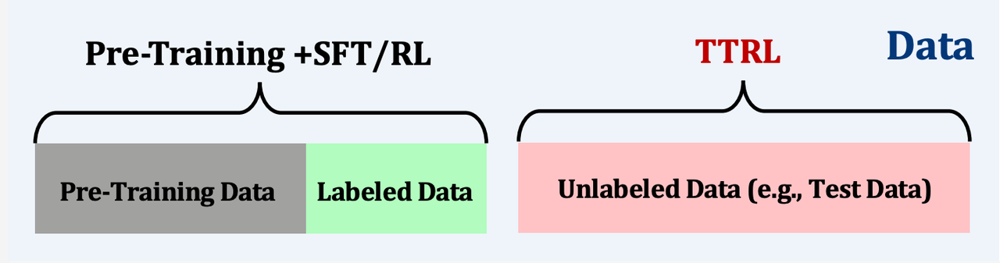

> ### **具体流程**
>
> 1. 根据测试数据中的问题，**用 LLM 多次采样，得到一组回答（温度设置为1.0增强多样性，N=64）**
>
> 2. 对这组回答**进行答案提取，并进行多数投票（多数投票我们在1.6.2章[ 1.6 Structure & Decoding 结构和解码](https://kcnd4kn8i6ap.feishu.cn/wiki/Os2swulnTiJuqEkVoarcSZKFnfh?fromScene=spaceOverview#share-KTjcdMxnvoAsxtxmjbJcWxkkn1s)讲过），选择最多数的答案作为伪标签，然后基于伪标签对其他回答进行奖励计算。具体计算逻辑为答案一致奖励为1，答案不一致奖励为0**
>
> 3. 最后就是利用这些奖励、问题和回答**对 LLM 进行强化学习训练，本文主要用的 GRPO**，也做了PPO的对比实验
>
> 整个过程中**并没用用到 Ground Truth 去计算奖励，所以是利用了无标注数据**

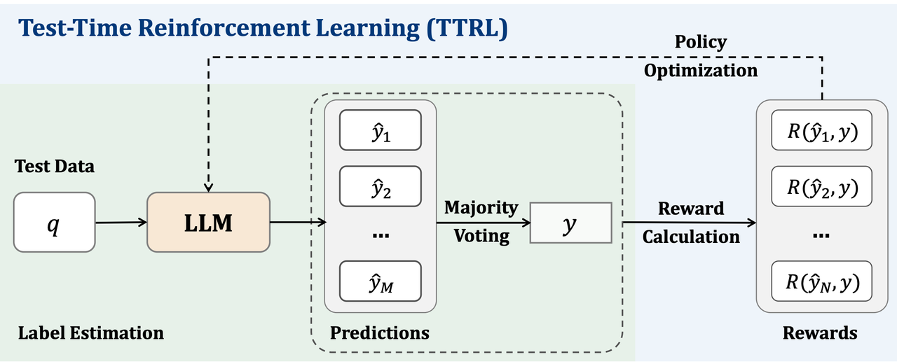

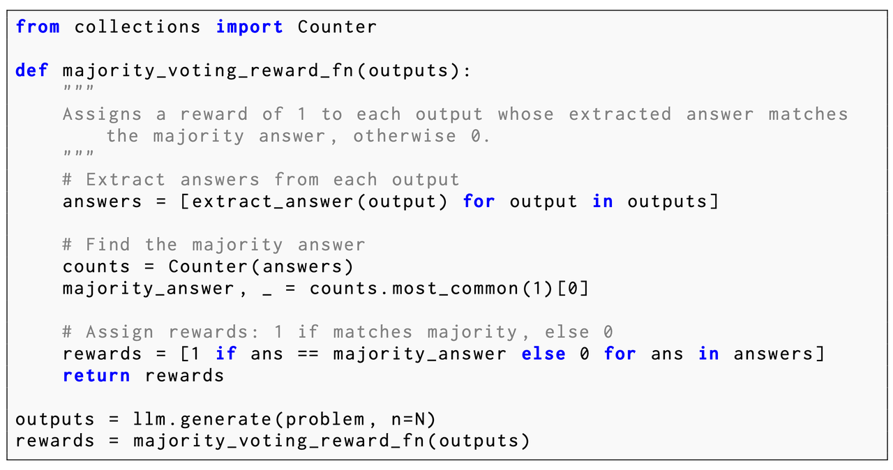

**流程伪代码**

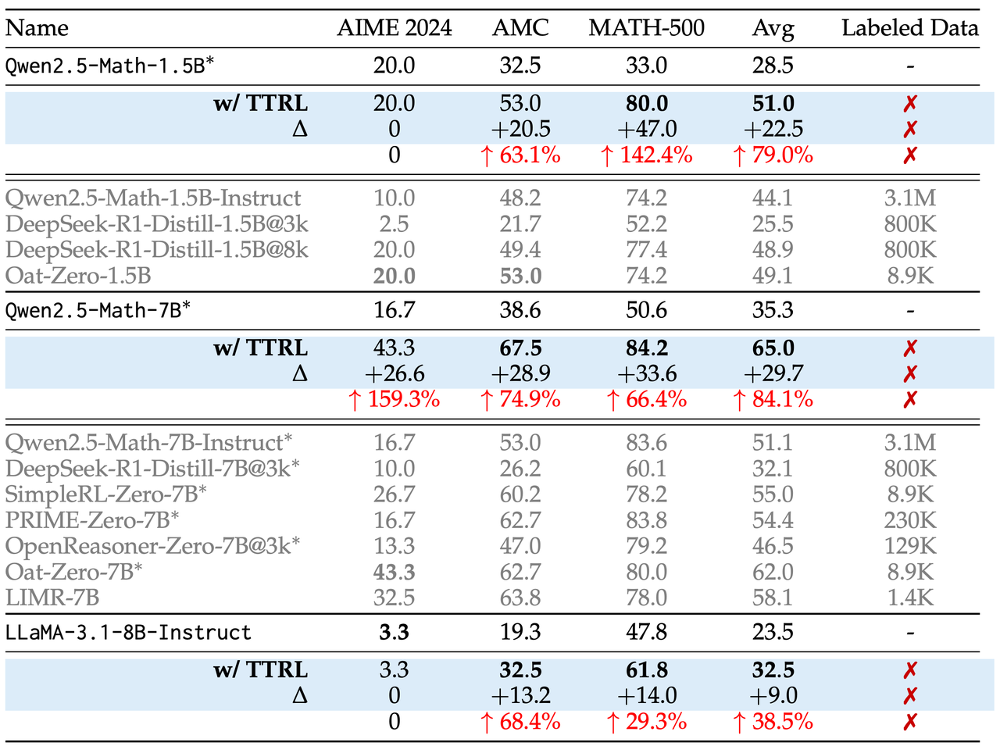

**主要实验结果**

> ### **为什么TTRL有效？**
>
> #### **标签估计**
>
> TTRL与标准强化学习算法的区别在于，**TTRL的奖励是不准确的（因为只是通过多数投票估计出来的，类似于大模型自己对自己的置信度估计），但是仍然有效：**
>
> * 已有研究表明，**强化学习能够容忍一定程度的奖励不准确，奖励通常是模糊的，主要作为探索的方向性信号，这使得强化学习对奖励噪声具有鲁棒性**
>
> * 先前的研究也从优化的角度考察了什么样的奖励模型才是好的奖励模型，结果表明，**更准确的奖励模型并不一定就是更好的 “老师”**。因此，由**策略模型自身估计的奖励信号可能会为学习提供更合适的指导**
>
> ### **奖励设计**
>
> 根据 TTRL 的奖励设计机制，与多数投票结果一致的奖励为1，不一致为0，这样在早期训练（一开始是从base model直接进行强化学习的）**多数投票预测标签还不够准确的时候，奖励的准确度却有一定的保证**。比如下方这个例子，标签预测错了，但是大多数回答的奖励是正确的，这在一定程度上保证了前期的强化学习训练的有效性

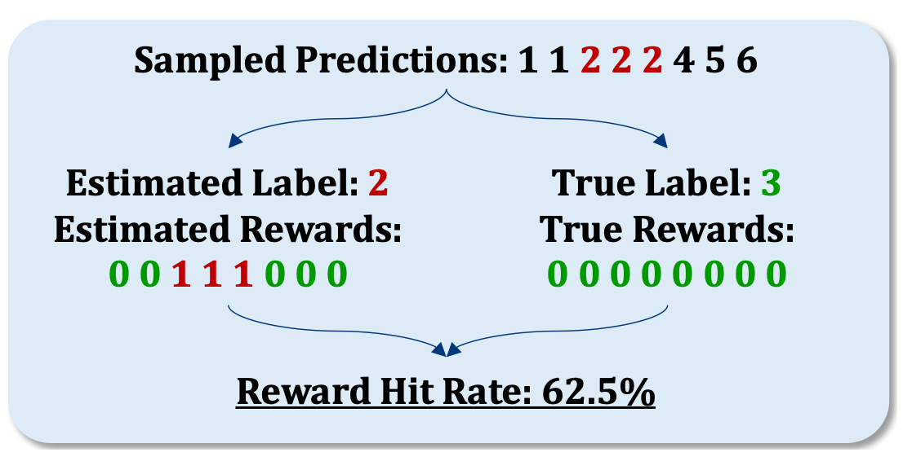

> ### **TTRL什么时候失效？**
>
> #### **强化学习参数设置**
>
> 比较低的温度系数，或者难度高的问题训练episodes太少
>
> #### **缺乏任务相关的先验知识或者说模型太小的时候**
>
> 这个很好理解，因为 **TTRL 相当于是基于自身的内在奖励（即选取置信度高、出现次数多的回答给予高奖励），进行强化学习探索**，那么如果本身**模型能力比较差（或者任务难度超出模型能处理的范围）的话，得到的奖励指导方向就会偏离任务目标**，训练效果也就好不到哪里去。前面的实验结果也可以看到 Qwen2.5-Math-1.5B 和 LLaMA-3.1-8B-Instruct 的效果都不如 Qwen2.5-Math-7B
>
> 这里也可以举一个例子，利用传统强化学习训练一个智能体在迷宫环境中找宝箱，现在智能体走到了路口，它有两个动作选择继续直走，或者拐弯。传统强化学习的奖励是设定好的，对应大模型 RL 的时候有标注的ground truth 奖励，然后经过多次采样会得到向下拐有奖励，直走没有的轨迹进行强化学习训练。但是 **TTRL 的做法是完全相信模型自己，加入现在的 agent 策略很初始化，它并不知道前面只能看到墙过去是不可能找到宝箱的这一先验，所以进行多数投票很有可能投出来直走的动作有奖励，向下拐没有**

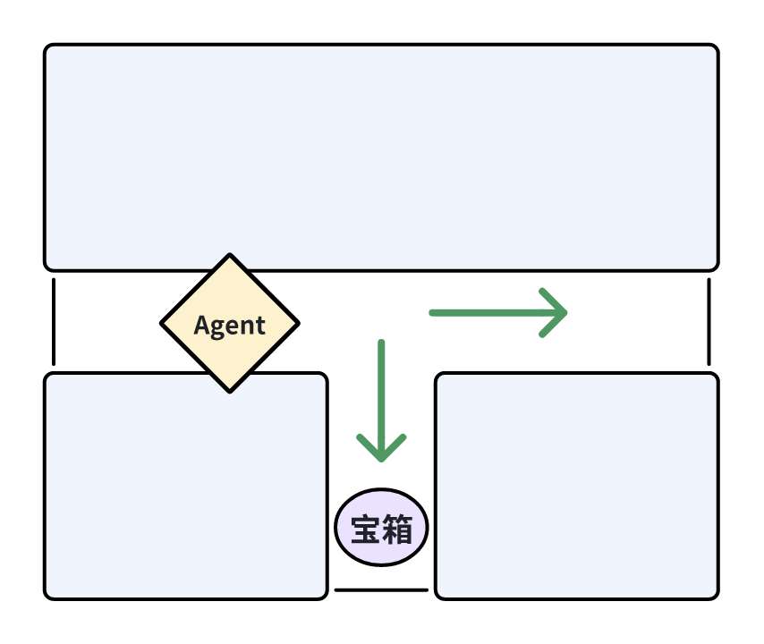

# **3.3.14 GSPO**

> **论文：Group Sequence Policy Optimization**
>
> **链接: https://arxiv.org/pdf/2507.18071**
>
> **Qwen 团队**出品大模型强化学习算法 **GSPO，Group Sequence Policy Optimization**
>
> 字面意思就是 **组序列策略优化**，很明显是要把之前 PPO / GRPO 的 token level 优化，变成序列为单位的优化

## **RL for LLM 中的 Action 建模问题**

先看一下在此之前的 RLHF/RLVR 常用算法 PPO/GRPO 在大模型场景下对 RL 的建模

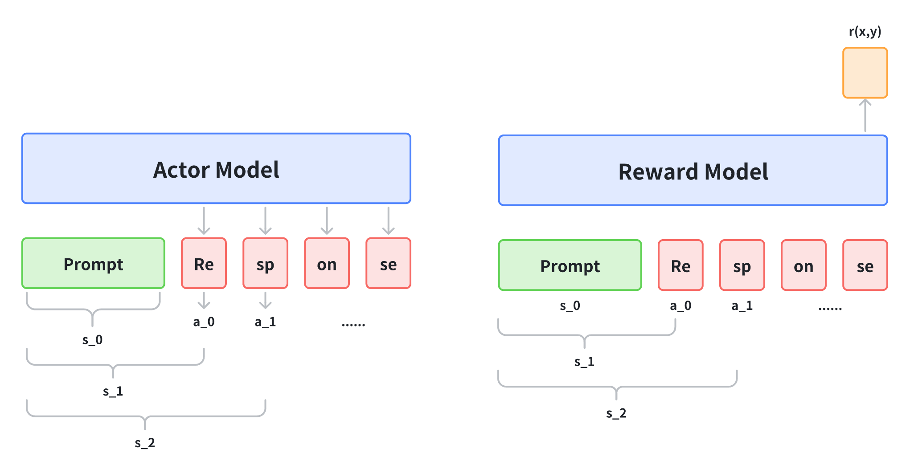

可以看到 action 是以 token 为单位的，即动作定义为大模型以历史 token 序列为 condition 输出下一个 token 的概率 $\pi(a_t|s_t)$，但是 reward 却是以整个 sequence 为单位的，即奖励是赋予整个 prompt + response 对的 $r(x,y)$其中 $x$是 prompt，$y$是 response （这里不考虑 KL 约束“奖励”）

**可以看到有一个明显的问题就是，action 和 reward 的单位并不匹配**

* 在 PPO 中，其是将中间 token 的 reward 当作0处理的（这里不考虑 KL 约束“奖励”），即将其变成了一个 sparse reward 问题，其优势函数估计$\hat A_t$是利用 value model 和 reward 在每一个 token 处计算的，优化目标也是 token 级的策略，所以优化目标单位与奖励/优势函数是一致的

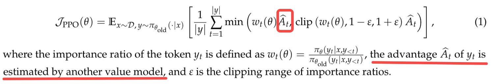

* 在 GRPO 中，又是函数估计 $ \hat{A}_{i, t}=\hat{A}_{i}=\frac{r\left(x, y_{i}\right)-mean\left(\left\{r\left(x, y_{i}\right)\right\}_{i=1}^{G}\right)}{std\left(\left\{r\left(x, y_{i}\right)\right\}_{i=1}^{G}\right)},$去掉了对 value model 的需求，但是其使用序列级别的 reward 估计的优势函数，又将其广播到每一个 token 处优化 token 级的策略，**优化目标的单位与奖励/优势函数的单位并不匹配**

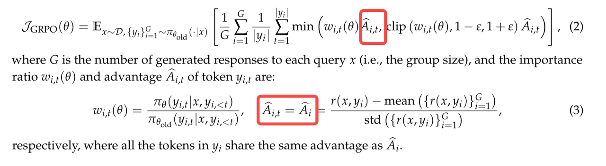

## **GRPO 存在的问题**

下面分析一下，上面的优化目标的单位与奖励/优势函数的单位不匹配带来的问题，这里的问题主要来源&#x4E8E;**&#x20;GRPO 对重要性采样权重的误用**

先回顾一下重要性采样的原理：

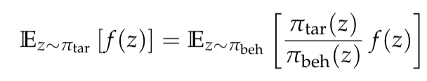

上式中，通过对从行为分布$\pi_{beh}$中抽取的样本进行重加权，来估计目标分布$\pi_{tar}$下函数$f$的期望，依赖于对从行为分布$\pi_{beh}$中抽取的多个样本（ $N\gg 1$）进行平均，然后重要性权重 $\frac{\pi_{btar}}{\pi_{beh}}$才能够有效校正分布不匹配问题

但是 GRPO 的 token 级重要性权重 $w_{i, t}(\theta)=\frac{\pi_{\theta}\left(y_{i, t} | x, y_{i,<t}\right)}{\pi_{\theta_{old }}\left(y_{i, t} | x, y_{i,<t}\right)}$，对应的从行为分布$\pi_{\theta_{old}}$抽取的样本只有$\pi_{\theta_{old }}\left(y_{i, t} | x, y_{i,<t}\right)$ 一个

这里解释一下为什么只有一个，我们看虽然 GRPO 优化目标外面有期望，从$\pi_{\theta_{old}}$采样了一个 group 的回复 $\{y_i\}_{i=1}^G$，但是每一个$y_i$都不一样，所以在重要性采样这里 $z=y_{i, t} | x, y_{i,<t}$是只有一个的。仔细分析一下，PPO 也是如此，期望中采样的$y$是不一样的，所以$z=y_{ t} | x, y_{<t}$也是只有一个

**即 PPO/GRPO 并没有对当前 token 处进行从行为分布中多次采样的操作，就这样使用 token 级的重要性采样权重无法实现有效的分布校正，还会因为样本数不足引入高方差噪声到训练梯度中，在长序列上不断累积，并且会被裁剪机制进一步放大**

进一步解释 GRPO 中 token 级重要性权重的高方差在长序列以及 clip 作用下的噪声累积和放大，核心原因在于**其token 级裁剪与高方差权重的不匹配性：**

* **token 级裁剪对高方差权重的误差累积效应：**

  * GRPO 的单个 token 的权重本身就因为基于单一样本估计存在高方差（例如，某些 token 的权重可能异常大或异常小，偏离合理范围）。裁剪机制的初衷是限制极端权重（如 clip 到 $[1-\varepsilon, 1+\varepsilon]$），但在高方差场景下，大量 token 的权重会频繁触发裁剪。例如，一个长序列中可能有 10% 的 token 权重超出裁剪范围，这些 token 的权重被强制 “拉回” 到裁剪边界，导致其梯度贡献与真实权重产生偏差

  * 对于长序列，这种单个 token 的裁剪误差会随序列长度累积：每个被裁剪的 token 都会引入一点误差，而序列越长，被裁剪的 token 数量越多，总误差就越大。最终，这些累积的误差会被纳入梯度计算，放大整体训练噪声

* **裁剪机制对异常权重的选择性放大，在 GRPO 中，token 级权重的高方差可能导致两种极端情况：**

  * 部分 token 的权重异常大（远大于 $1+\varepsilon$），被裁剪后强制设为 $1+\varepsilon$

  * 部分 token 的权重异常小（远小于 $1-\varepsilon$），被裁剪后强制设为 $1-\varepsilon$

  这两种情况都会扭曲梯度方向：

  * 异常大的权重本应反映该 token 对策略优化的重要贡献，但裁剪后其贡献被低估

  * 异常小的权重本应反映该 token 的负向影响，但裁剪后其负向贡献被削弱

  更关键的是，长序列中这类异常 token 的数量会随长度增加而增多（概率上更易出现极端值），裁剪机制对它们的扭曲也会成比例增加，最终导致梯度方向严重偏离最优方向，高方差噪声被进一步放大

Qwen团队通过实验观察到，高方差噪声会进入训练梯度中，可能导致模型崩溃，而这种崩溃往往是不可逆的。一旦发生崩溃，即使恢复到之前的检查点、精心调整超参数（例如裁剪范围）、延长生成长度或切换强化学习的查询内容，恢复训练也无济于事

## **GSPO 方法设计**

**重点：直接在序列级使用重要性权重并进行优化**

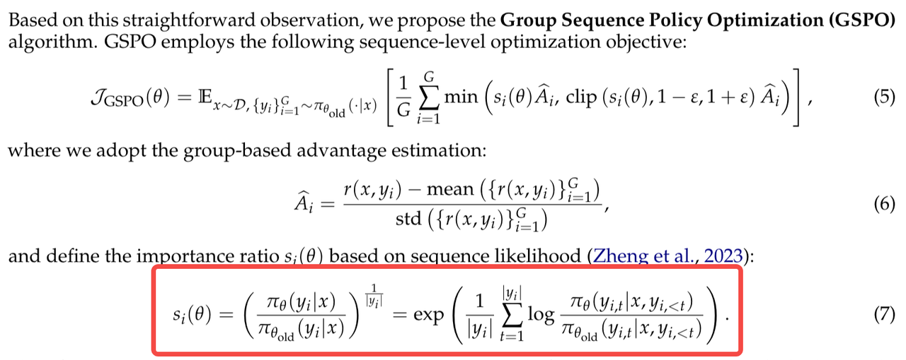

重要性权重直接使用序列级单位，对齐奖励/优势函数的单位，即将 action 建模为序列级，大模型以 prompt 为condition，输出整个 response 的概率$\pi(y_i|x)$，其中 $\pi(y_i|x)=\prod_{t=1}^{|y_i|}\pi(y_{i,t}|x,y_{i,<t})$。不同的点在于，其**计算的重要性权重为策略比值在 response 长度上的几何平均值，相当于一种归一化**

**GSPO与GRPO的梯度分析：**

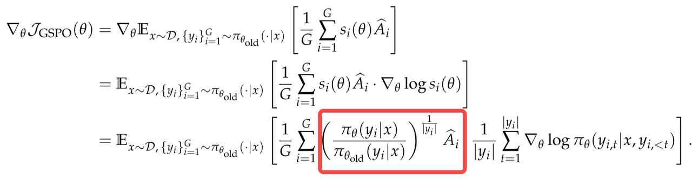

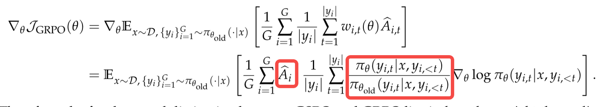

* GRPO 的梯度中，不同 token 权重不等，这些不等权重的影响随着训练的进行会不断累积，进而导致不可预测的结果

* **GSPO 对一个 response 中的所有 token 赋予同等权重，从而消除了 GRPO 的这一不稳定性因素**

# **3.3.15 ASPO**

> **论文：ASPO: Asymmetric Importance Sampling Policy Optimization**
>
> **链接：https://arxiv.org/pdf/2510.06062**
>
> 快手与清华联合出品，字面意义理解为 **非对称重要性采样** 策略优化，通过对优势值为正的 token 的重要性权重进行上下翻转，平衡探索与利用，缓解 **熵坍缩** 现象，减少过拟合倾向

### **回顾：什么是重要性采样？**

**重要性采样是一种统计技巧，调整目标分布$p(x)$与采样分布$q(x)$不一致情况下的采样权重，从而可以用$q(x)$中采样的数据来估计$p(x)$的期望。假设变量$x$服从分布$p(x)$，计算以$x$为变量的函数$f(x)$的期望如下：**

**$\mathbb{E}_{x\sim p(x)} [f(x)] = \int f(x) p(x) dx \\ =\int f(x)\frac{p(x)}{q(x)}q(x)dx =\mathbb{E}_{x\sim q(x)} [f(x)\frac{p(x)}{q(x)}]
$**

**其中$p(x)$难以采样，$q(x)$较容易采样，$\frac{p(x)}{q(x)}$为重要性权重(IS)**

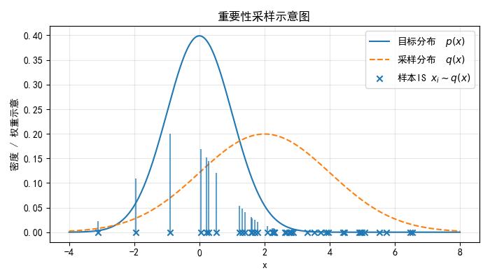

### **回顾：为什么需要重要性采样？**

**强化学习算法 PPO 的策略优化目标如下：**

**$\mathbb{E}_{a \sim \pi_{\theta_k}(\cdot \mid s)} \left[ \min \left( \frac{\pi_{\theta}(a \mid s)}{\pi_{\theta_k}(a \mid s)} A^{\pi_{\theta_k}}(s, a), \text{clip} \left( \frac{\pi_{\theta}(a \mid s)}{\pi_{\theta_k}(a \mid s)}, 1 - \epsilon, 1 + \epsilon \right) A^{\pi_{\theta_k}}(s, a) \right) \right]
$**

**其中$r_{\theta}=\frac{\pi_{\theta}(a \mid s)}{\pi_{\theta_k}(a \mid s)} $为重要性权重。先忽略clip，然后去掉重要性权重，看一下最简化的 PPO 优化目标如下：**

**$\mathbb{E}_{ a \sim \pi_{\theta}(\cdot \mid s)} \left[ {\pi_{\theta}(a \mid s)} A^{\pi_{\theta}}(s, a)  \right]$**

**这个目标就是使用当前策略$\pi_{\theta}$采样的数据来根据优势函数指导当前策略更新，是完全的 on-policy，即行为策略（采样策略）和目标策略（更新策略）是一样的。完全的 on-policy 存在样本效率低的问题，因为只能用当前策略采集的样本更新当前策略，更新完样本就得扔掉**

**加入重要性采样后的简化优化目标：**

**$\mathbb{E}_{ a \sim \pi_{\theta}(\cdot | s)} \left[ \pi_{\theta}(a|s)A^{\pi_{\theta}}(s, a)  \right] =\mathbb{E}_{ a \sim \pi_{\theta^k}(\cdot | s)} \left[ \frac{\pi_{\theta}(a | s)}{\pi_{\theta_k}(a | s)}  A^{\pi_{\theta^k}}(s, a)  \right]$**

**目标分布$p(x)=\pi_{\theta}$，采样分布 $q(x)=\pi_{\theta_k}$，$f(x)=A^{\pi}(s, a)$**

> **所以重要性采样的作用主要是：**
>
> * **修正分布，减少 off-policy 数据下的估计偏差。数据是旧策略采的，但是需要更新的是当前策略**
>
> * **提高样本利用效率。由于有了重要性权重，所以可以在多次 epoch 中反复用同一批 trajectory，而不是每一步都必须重新采样严格 on-policy 的数据**（**关于PPO到底是不是 on-policy 可以回顾 10.4.50 [ 10.4 八股面经（含答案）](https://kcnd4kn8i6ap.feishu.cn/wiki/S5DLwwDbOiKhXfkBgXfchVSCnle#share-R2qAdHSfto5RU6xc11DcEiIknBc)**）

### **不同的 clip 策略的效果**

#### **PPO/GRPO 的 clip 策略**

**GRPO 和 PPO 的 clip 机制是一脉相承的，不考虑 KL 散度，省略求和求平均，目标函数可以简化如下式，示意图也如下图所示：**

$J(θ)=\mathbb{E} \left[\min(r_{i,t}(θ) \hat{A}_{i,t}, \text{clip}(r_{i,t}(θ),1−ϵ,1+ϵ)\hat{A}_{i,t})\right]$

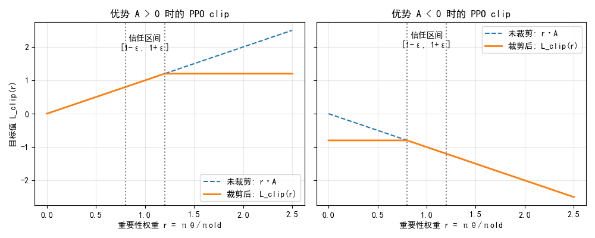

* **$A>0$，限制当前策略概率已经很高的好 token 概率不要再增加**

* **$A<0$，限制当前策略概率已经很低的坏 token 概率不要再降低**

**clip 会连梯度也裁剪掉，导致在基座模型里本来就概率很低的反思类 token（ “Aha”等），RL 给这类 token 高奖励后，更新几步后会把它们的概率拉得很高，触发上裁剪，关键token梯度都被扔掉浪费了**

* **当$r(\theta)$处于斜线部分，$∇_θJ=\frac{∂r(\theta)A}{∂\theta}=A\cdot∇_θr(θ)$**

* **当$r(\theta)$处于平直部分，$∇_θJ=\frac{∂(1±\epsilon)A}{∂\theta}=0\cdot∇_θr(θ)=0$**

### **不同的 clip 策略的效果**

#### **Dual-clip PPO 的 clip 策略**

**PPO-clip 相当于只在往提升目标的方向上裁剪，即好动作不能被推得过猛，坏动作不能被压得过猛。这样还有一个缺点，如果是大规模分布式训练，轨迹从不同时间、版本的策略采样回来，非常的 off**

**于是会出现这样的样本：**

* **旧策略概率很小，但同时新策略很喜欢，概率很大，IS值很高**

* **但是样本优势为负，那么标准 clip 下$rA$是很大的负数，对应的梯度系数也巨大，方差炸裂，导致训练极不稳定**

**所以 Dual-clip PPO 对于此情况多加了一个裁剪边界，公式如下：**

$\mathbb{E} \left[ \max \left( \underbrace{\min(r_t A_t, \text{clip}(r_t, 1 - \varepsilon, 1 + \varepsilon) A_t)}_{\text{标准 PPO 部分}}, c A_t \right) \right], \quad A_t < 0$

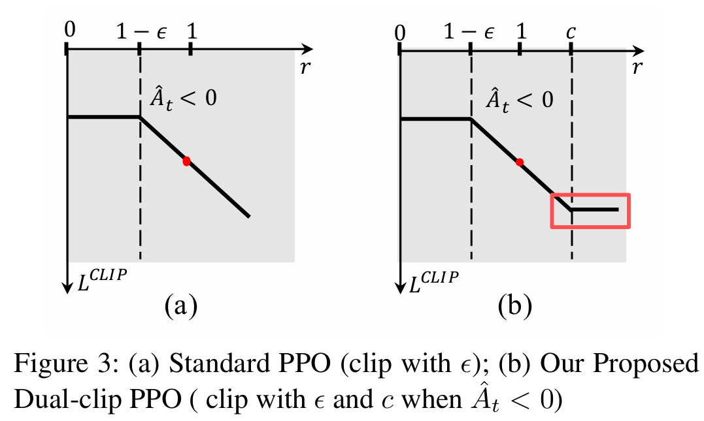

### **不同的 clip 策略的效果**

#### **CISPO 的 soft clip 策略**

**前面提到 PPO/GRPO 的 clip 会连同梯度一起裁剪掉，导致关键 token梯度不参与后续多 epoch 的 off-policy 训练，样本效率降低**

**Minimax-M1 中提出的 CISPO 方法使用了一种 soft clip 策略来保留被裁剪的样本的梯度，使其能够继续给训练过程贡献**

**CISPO 做了几点，首先目标函数从 PPO 形式改回 REINFORCE：**

$J_{\text{REINFORCE}}(\theta) = \mathbb{E}\left[ \text{sg}(r_{i,t}(\theta)) \hat{A}_{i,t} \log \pi_\theta(o_{i,t}|\cdot) \right]$

* **使用$\text{sg}(\cdot)$（stop gradient）操作把 IS 看作常数权重**

* **使用 REINFORCE 的目标，对其求导梯度由&#x20;**$\log\pi_{\theta}$项提供

* **不用$\min$操作，直接对权重本身clip**

$r=\text{clip}(r,1−ϵ_{low},1+ϵ_{high})$

**所以其梯度为：**

$\nabla_\theta J_{\text{CISPO}} = \mathbb{E}\left[ \hat{r}_{i,t} \hat{A}_{i,t} \nabla_\theta \log \pi_\theta(\cdot) \right]$

* **$r$就算被 clip 了，也只是当作一个有限的系数，不会变成 0**

* **不存在 r 超界导致 loss 对$θ $没有依赖，梯度为 0 的区域**

* **CISPO 是只限制权重大小，不把 token 从梯度里踢出去，所以叫soft clip 软裁剪**

### **ASPO 提出的问题**

**实际 PPO 应用的时候大多会把 A<0 的 dual-clip 加上，如下图：**

* **图(a) token 当前概率低的时候，重要性权重也低，训练不充分**

* **图(c)对于 A<0 的样本，权重分布符合预期，从左上角到右下角逐渐减小，即$r$增大时，如果现在的策略已经把一个“坏动作”概率提高了（r>1），就会给它更大的负梯度，强烈往回拉；如果现在概率不高（r 接近 1 或更小），负梯度比较温和**

* **图(b)对于 A>0 的样本，左上的 token 在当前策略下的概率已经远大于在旧策略下的概率，却被赋予了更大的权重；而右下角区域的 token 具有较低的当前概率，却被分配了极小的权重**

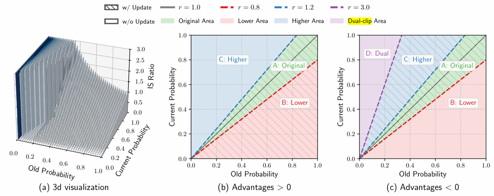

**对于优势为正的 token，存在权重分配反的问题：**

* **已经很“自信”的正优势 token 得到更大的正向更新，形成自我强化循环，导致训练不稳定、熵崩溃和输出重复增多等现象**

* **正优势但概率很低的 token被赋予极小的权重而被进一步抑制（样本量有限时几乎没有梯度），导致更新信号微弱，学习不充分**

### **ASPO 的翻转权重及实现细节**

**基于前面的分析，ASPO 提出非对称重要性采样（AIS）方法，对正样本的权重进行反转，使其更新行为与负样本保持一致，当前策略概率低于旧策略概率的 token 应被赋予更高的学习权重，而概率较高的标记则应获得较低的权重**

**具体实现分三步：**

1. **对$\ r_t^i(\theta) < 1 - \varepsilon_{\text{low}}\ (\hat{A}_t^i < 0)\ \text{or}\ \ r_t^i(\theta) > 1 + \varepsilon_{\text{high}}\ (\hat{A}_t^i > 0)$的 token，也就是上面图非阴影部分，直接 mask 掉，hard clip**

2. **对优势为正的 token 翻转 IS 权重**

**$\hat{r}_t^i = \frac{\textcolor{red}{\pi_{\theta_{\text{old}}}(o_t^i \mid q, o_{<t}^i)}\pi_{\theta}(o_t^i \mid q, o_{<t}^i)}{\textcolor{red}{\text{sg}(\pi_{\theta}^2(o_t^i \mid q, o_{<t}^i))}}$**

* **对优势为负的 token 采用正常的 dual-clip，对优势为正的token，由于权重翻转，所以极端情况从左上变到右下，所以需要对优势为正的 token 也进行 dual-clip，然后 dual-clip 都用 CISPO 的 soft clip 实现**

### **ASPO 的实验结果**

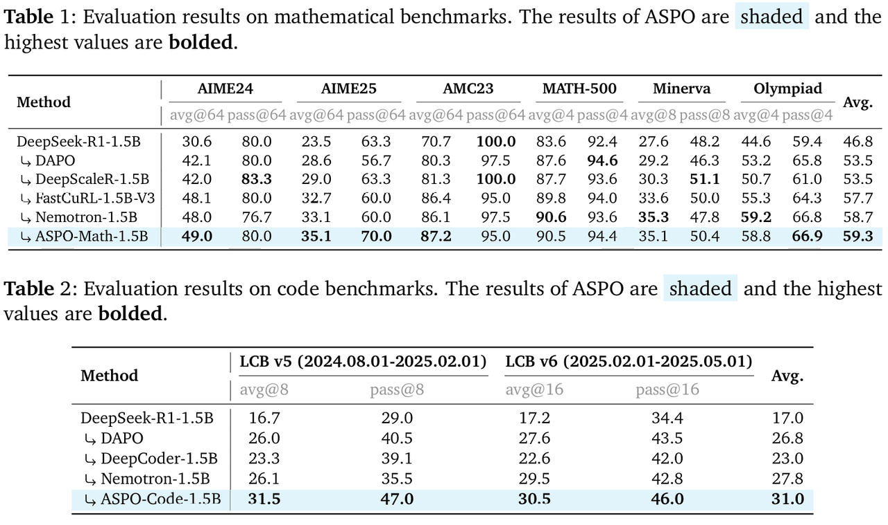

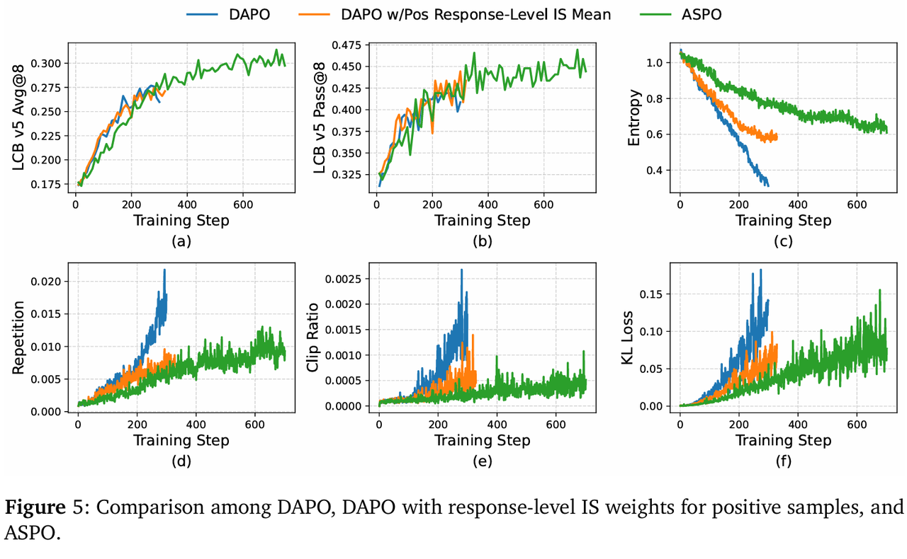


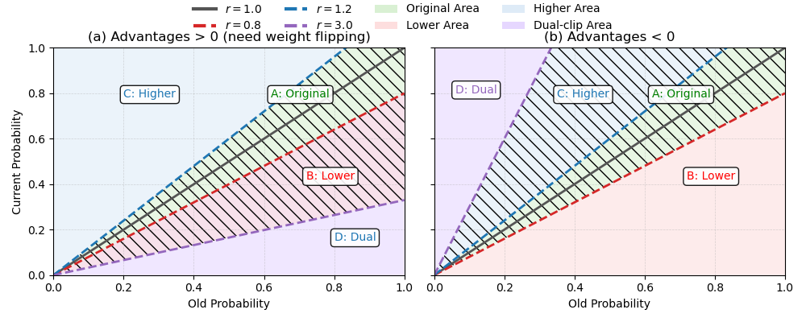

**ASPO的裁剪示意图**
