> **Direct Preference Optimization**
>
> **论文：*Direct Preference Optimization: Your Language Model is Secretly a Reward Model***
>
> **链接：https://arxiv.org/pdf/2305.18290**
>
> **本章主要介绍DPO及其改进算法的详解**
>
> ### **为什么不把DPO归类到RLHF章节？**
>
> **因为RLHF是一种RL强化学习方法，而DPO却把强化学习的部分优化掉了，变成了直接依据偏好数据集优化策略，所以其实算不上一种强化学习方法，至少没有显示的强化学习探索的过程，故不归类到RLHF中**

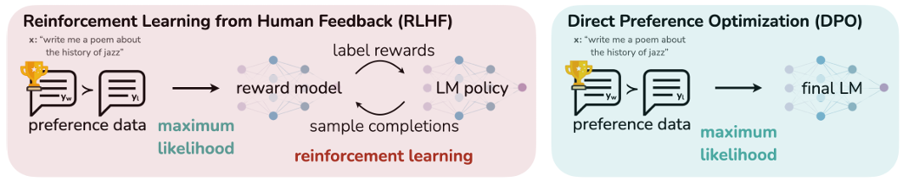

# **3.4.1 RLHF-PPO的缺点**

> * **两阶段训练带来的信息损失：**&#x52;LHF的过程是先利用偏好数据训练一个奖励函数模型，然后再用PPO或者其他强化学习算法训练最后的策略。这个过程中如果**奖励函数模型学习存在偏差**，比如奖励实际上并没有和人类偏好对齐的很好，那么后续的强化学习过程也会导致策略陷入次优
>
> * **PPO算法带来的额外训练资源需求：**&#x5F3A;化学习的训练会伴随着探索和利用（explore and exploit）的过程，一般会较不稳定，PPO算法在工程实现上利用了很多trick去保障训练的稳定和收敛。但是**PPO仍然引入了Actor、Critic、Reward和Reference四个模型**，在传统强化学习环境中，Actor和Critic以及Reference都是简单的网络实现，reward是环境自带的人为设计好的，所以并不存在大规模的资源需求，而到了LLM这里，所有的模型都是基于LLM（SFT）模型初始化或者改进的，那么即使在PPO训练过程中只有Actor和Critic需要更新参数，四个模型的推理和训练就需要大量的计算资源，以及四个模型也会带来更多的累积误差

# **3.4.2 DPO公式推导**

> ### **DPO的推导流程**
>
> DPO**基于 Bradley-Terry 偏好模型假设，以及强化学习的目标，推导得出 DPO 目标函数**，去掉了Reward和Critic两个模型，优化了对齐的流程，只需要端到端的一步就能从偏好数据到最终策略
>
> 让我们从**带行为约束的强化学习(Behavior-Regularized RL)**&#x7684;目标出发：
>
> &#x20;                                 $ 
> \max _\pi \mathbb{E}_{x \sim \mathcal{D}, y \sim \pi} [r(x, y)] - \beta D_{\text{KL}} [\pi(y|x) \| \pi_{\text{ref}}(y|x)]\\ = \max _\pi \mathbb{E}_{x \sim \mathcal{D}} \mathbb{E}_{y \sim \pi(y|x)} \left[ r(x, y) - \beta \log \frac{\pi(y|x)}{\pi_{\text{ref}}(y|x)} \right] \\ = \min _\pi \mathbb{E}_{x \sim \mathcal{D}} \mathbb{E}_{y \sim \pi(y|x)} \left[ \log \frac{\pi(y|x)}{\pi_{\text{ref}}(y|x)} - \frac{1}{\beta} r(x, y) \right] \\ = \min _\pi \mathbb{E}_{x \sim \mathcal{D}} \mathbb{E}_{y \sim \pi(y|x)} \left[ \log \frac{ \pi(y|x) }{\frac{1}{Z(x)} \pi_{\text{ref}}(y|x)\exp \left( \frac{1}{\beta} r(x, y) \right)} - \log Z(x) \right]
>  $
>
> 其中 $Z(x) = \sum_y \pi_{\text{ref}}(y|x) \exp \left( \frac{1}{\beta} r(x, y) \right)$是配分函数
>
> > 暂时将其理解为是作者看出来有一个这种形式可以提取出来，实际上这个配分函数在**逆强化学习、离线强化学习中大量存在**，涉及到比较麻烦的理论推导，这里就不展开解释了
>
> 注意到这个配分函数只是 $\pi_{ref}$和 $x$的函数（$x,y$是prompt和response）不依赖于 $\pi$，所以可以定义：
>
> &#x20;$\pi^*(y|x) = \frac{1}{Z(x)} \pi_{\text{ref}}(y|x) \exp \left( \frac{1}{\beta} r(x, y) \right)$
>
> 可以证明**上述 $\pi^{\star}$的满足概率分布大于0且和为1的定义，是一个合法的概率分布**，那么原始的目标可以写成
>
> &#x20;  $
> \min _\pi \mathbb{E}_{x \sim \mathcal{D}} \left[ \mathbb{E}_{y \sim \pi(y|x)} \left[ \log \frac{\pi(y|x)}{\pi^*(y|x)} \right] - \log Z(x) \right] = 
> \min _\pi \mathbb{E}_{x \sim \mathcal{D}} \left[ D_{\text{KL}} (\pi(y|x) \| \pi^*(y|x)) - \log Z(x) \right]$
>
> 那么可以直接**从上述目标得到我们的最优策略：**
>
> $\pi(y|x) = \pi^*(y|x) = \frac{1}{Z(x)} \pi_{\text{ref}}(y|x) \exp \left( \frac{1}{\beta} r(x, y) \right)$
>
> 从上式就可以反过来推导出最优策略表示的奖励函数：
>
> &#x20;                                                $r^*(x, y) = \beta \log \frac{\pi^*(y|x)}{\pi_{\text{ref}}(y|x)} + \beta \log Z(x)$
>
> 记得我们之前讲过的**Bradley-Terry偏好建模模型**&#x5417;**，**&#x5C06;上述式子带入可以得到：
>
> &#x20;                           $
> p_{\beta}^*(y_1 \succ y_2|x) 
> \\ = \frac{\exp \left( \beta \log \frac{\pi^*(y_1|x)}{\pi_{\text{ref}}(y_1|x)} + \beta \log Z(x) \right)}{\exp \left( \beta \log \frac{\pi^*(y_1|x)}{\pi_{\text{ref}}(y_1|x)} + \beta \log Z(x) \right) + \exp \left( \beta \log \frac{\pi^*(y_2|x)}{\pi_{\text{ref}}(y_2|x)} + \beta \log Z(x) \right)} \\ = \frac{1}{1 + \exp \left( \beta \log \frac{\pi^*(y_2|x)}{\pi_{\text{ref}}(y_2|x)} - \beta \log \frac{\pi^*(y_1|x)}{\pi_{\text{ref}}(y_1|x)} \right)} \\ = \sigma \left( \beta \log \frac{\pi^*(y_1|x)}{\pi_{\text{ref}}(y_1|x)} - \beta \log \frac{\pi^*(y_2|x)}{\pi_{\text{ref}}(y_2|x)} \right)$
>
> **其中 $\sigma$代表logistic函数**。可以惊奇的发现由于指数函数的特性，**配分函数被消掉了，那么我们的偏好模型最后只剩下了参考策略和需要优化的策略，Critic和Reward model都被优化掉了**，然后再利用交叉熵和上面的偏好概率模型计算loss进行训练，就可以完成直接从偏好数据一步到优化策略
>
> 完整的DPO loss如下：$\mathcal{L}_{\text{DPO}}(\pi_{\theta}, \pi_{\text{ref}}) = - \mathbb{E}_{(x, y_w, y_l) \sim \mathcal{D}} \left[ \log \sigma \left( \beta \log \frac{\pi_{\theta}(y_w | x)}{\pi_{\text{ref}}(y_w | x)} - \beta \log \frac{\pi_{\theta}(y_l | x)}{\pi_{\text{ref}}(y_l | x)} \right) \right]$

# **3.4.3 DPO理解和代码**

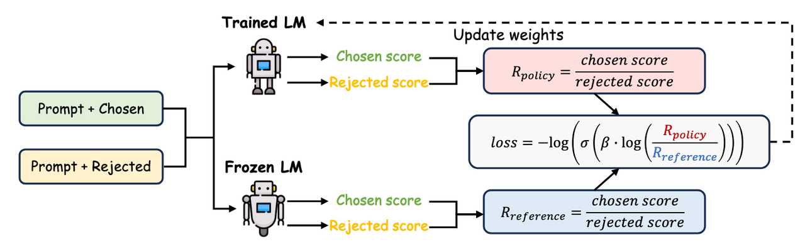


**微调流程图**

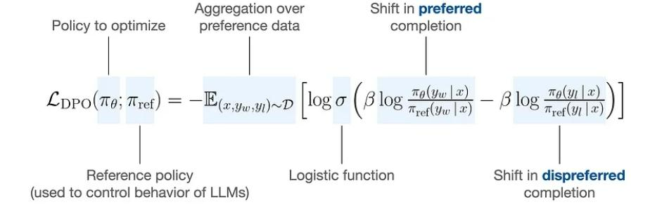

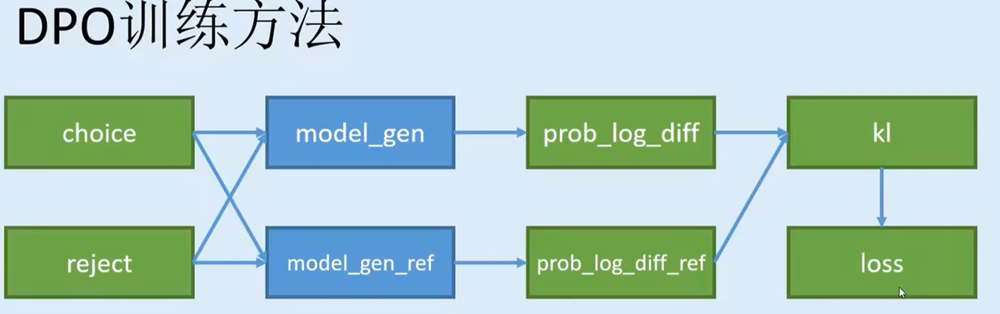

> ### **如何理解DPO loss？**
>
> 其实从最后的loss公式来看，这是一个类似**对比学习**的loss（个人觉得就是对比学习），通过上述loss **DPO会最大化偏好的回答和不偏好的回答（win/loss，chosen/reject）的概率的差值（除过reference概率之后的）**，那么理想的结果就是，**chosen的回答概率上升，reject的回答概率下降**，从而达到跟人类偏好对齐的目的。当然**实践过程中可能会到chosen和reject的概率都下降的情况**，毕竟DPO只约束差值，DPO之后就有一些工作通过增加chosen的NLL loss或者其他正则化手段等等方法优化DPO

```python
class DPOLoss(nn.Module):
    """
    DPO Loss
    """

    def __init__(self, beta: float, label_smoothing: float = 0.0, ipo: bool = False) -> None:
        super().__init__()
        self.beta = beta
        self.label_smoothing = label_smoothing
        self.ipo = ipo

    def forward(
        self,
        policy_chosen_logps: torch.Tensor,
        policy_rejected_logps: torch.Tensor,
        reference_chosen_logps: torch.Tensor,
        reference_rejected_logps: torch.Tensor,
    ) -> Tuple[torch.Tensor, torch.Tensor, torch.Tensor]:
        pi_logratios = policy_chosen_logps - policy_rejected_logps
        ref_logratios = reference_chosen_logps - reference_rejected_logps
        logits = pi_logratios - ref_logratios

        if self.ipo:
            losses = (logits - 1 / (2 * self.beta)) ** 2  # Eq. 17 of https://arxiv.org/pdf/2310.12036v2.pdf
        else:
            # Eq. 3 https://ericmitchell.ai/cdpo.pdf; label_smoothing=0 gives original DPO (Eq. 7 of https://arxiv.org/pdf/2305.18290.pdf)
            losses = (
                -F.logsigmoid(self.beta * logits) * (1 - self.label_smoothing)
                - F.logsigmoid(-self.beta * logits) * self.label_smoothing
            )

        loss = losses.mean()
        chosen_rewards = self.beta * (policy_chosen_logps - reference_chosen_logps).detach()
        rejected_rewards = self.beta * (policy_rejected_logps - reference_rejected_logps).detach()

        return loss, chosen_rewards, rejected_rewards
```

> ### **PPO VS DPO**
>
> **理论上PPO拥有更高的效果上限因为强化学习包含探索过程，有可能能探索到没见过的更好的状态，而DPO（offline DPO）则是完全局限于已经标好的数据，但是DPO实现起来更方便，PPO则需要很多工程实现技巧，包括如何训练好一个reward model都是一个技术活，所以很多工作也在研究DPO和PPO中间的状态，比如Online DPO等**

> ### **LLM生成的DPO论文大纲（仅供参考）**
>
> 1. **理解背景**：大规模无监督语言模型（LMs）虽然能够学习广泛的世界知识和一些推理技能，但由于其训练的完全无监督性，精确控制它们的行为是困难的。现有的方法通过收集人类对模型生成内容相对质量的标签，并通过人类反馈的强化学习（RLHF）来微调这些模型以符合这些偏好。
>
> 2. **DPO的核心思想**：DPO方法直接优化语言模型以满足人类偏好，而不是先训练一个奖励模型，然后使用强化学习来最大化这个奖励。这种方法避免了RLHF中的复杂性和不稳定性。
>
> 3. **理论基础**：DPO利用了Bradley-Terry模型等理论偏好模型，这些模型衡量给定奖励函数与经验偏好数据的一致性。DPO通过变量变换，将偏好损失定义为策略的函数，而不是奖励模型的函数。
>
> 4. **DPO的实现**：
>
>    * **采样和偏好标注**：对于每个提示（prompt），从参考策略（通常是基于SFT的模型）中采样生成响应（completions），并由人类标注者表达对这些响应的偏好。
>
>    * **优化目标**：DPO使用二进制交叉熵目标来优化语言模型。这个目标函数直接基于人类偏好数据，而不是基于奖励模型。
>
>    * **损失函数**：DPO的损失函数 $L_{DPO}(π_θ; π_{ref})$是一个最大化似然目标，它通过比较偏好和非偏好响应的相对对数概率来优化模型。
>
> 5. **DPO的更新**：DPO的更新通过增加对偏好响应的相对对数概率，并减少对非偏好响应的相对对数概率来实现。这个过程还包含了一个动态的、每个样本的重要性权重，以防止模型退化。
>
> 6. **实验评估**：作者在多个任务上评估了DPO，包括情感调节、摘要和单轮对话，结果表明DPO与现有的基于PPO的RLHF方法一样有效，甚至在控制生成内容的情感方面超过了RLHF，并在摘要和单轮对话的质量上匹配或提高了性能。
>
> 7. **理论分析**：DPO方法提供了对偏好学习的理论支持，并与RLHF中使用的Actor-Critic算法（如PPO）的问题进行了比较。

# **3.4.4 人类偏好建模角度理解DPO**

> 如果有人让你讲解DPO的推导过程，那么绕不开的一个地方便是**配分函数**，怎么就突然看出来一个这个玩意把他提取出来，然后后续的计算过程中就能给他约分掉呢？实在是难以让人理解，下面的内容带你从另一个视角来理解DPO算法

## **DPO推导回顾**

> 我们先来回顾一下DPO的推导过程
>
> * 首先从**大模型强化学习场景（NLP场景）下的带行为约束的强化学习(Behavior-Regularized RL)目标**出发：
>
>   $\begin{aligned}
>   优化目标&=
>   \max _\pi \mathbb{E}_{x \sim \mathcal{D}, y \sim \pi} [r(x, y)] - \beta D_{\text{KL}} [\pi(y|x) \| \pi_{\text{ref}}(y|x)]
>   \\&= \max _\pi \mathbb{E}_{x \sim \mathcal{D}} \mathbb{E}_{y \sim \pi(y|x)} \left[ r(x, y) - \beta \log \frac{\pi(y|x)}{\pi_{\text{ref}}(y|x)} \right] \\
>   \end{aligned}$
>
>   我们知道一般的强化学习目标是最大化累积奖励，在大模型这里只有一步MDP（x->y），所以没有折扣加和，那就是最大化策略$\pi$下的$r(x,y)$的期望值。**Behavior-Regularized RL 的目标则是在最大化奖励的同时也不能使得策略优化过头了偏离参考策略太远，这里的参考策略**$\pi_{ref}$在 offline RL里面就是行为策略，在大模型场景下一般就是SFT策略。实际上如果不要参考策略，**Behavior-Regularized RL 就退化为了Max Entropy RL最大熵强化学习：&#x20;**$\max _\pi \mathbb{E}_{x \sim \mathcal{D}} \mathbb{E}_{y \sim \pi(y|x)} \left[ r(x, y) - \beta \log \pi(y|x) \right] $，除了最大化奖励值外还增强了策略的随机性和探索性
>
> * 然后我们**将优化目标转换为求 min，并提取配分函数：**
>
>   $\begin{aligned}
>    优化目标&=\max _\pi \mathbb{E}_{x \sim \mathcal{D}} \mathbb{E}_{y \sim \pi(y|x)} \left[ r(x, y) - \beta \log \frac{\pi(y|x)}{\pi_{\text{ref}}(y|x)} \right] \\
>   &= \min _\pi \mathbb{E}_{x \sim \mathcal{D}} \mathbb{E}_{y \sim \pi(y|x)} \left[ \log \frac{\pi(y|x)}{\pi_{\text{ref}}(y|x)} - \frac{1}{\beta} r(x, y) \right] \\
>   &= \min _\pi \mathbb{E}_{x \sim \mathcal{D}} \mathbb{E}_{y \sim \pi(y|x)} \left[ \log \frac{ \pi(y|x) }{\frac{1}{Z(x)} \pi_{\text{ref}}(y|x)\exp \left( \frac{1}{\beta} r(x, y) \right)} - \log Z(x) \right]
>   \end{aligned}$
>
>   其中$Z(x) = \sum_y \pi_{\text{ref}}(y|x) \exp \left( \frac{1}{\beta} r(x, y) \right)$是配分函数。其实到这里大部分人都不理解为什么就这样提取出来了配分函数，我也不是很理解，虽然这个式子在offlineRL中比较常见，所以下面我并不准备解释这一点，而是从其他角度来理解DPO
>
> * 最后提取最优策略，**由于我们提取的配分函数并不是$\pi$的函数，只是**$x,\pi_{ref}$的函数**我们把$\log$的分母定义为一个新的策略 $\pi^*$如下：**
>
>   $\pi^*(y|x) = \frac{1}{Z(x)} \pi_{\text{ref}}(y|x) \exp \left( \frac{1}{\beta} r(x, y) \right)$
>
>   **可以证明这个策略满足对于策略的要求：**
>
>   1. &#x20;$\pi^*(y|x) \geq 0$，这个比较显然都是大于0的值
>
>   2. $\sum_y\pi^*(y|x)=1$，也就是对于所有动作（回答$y$）策略概率加和为1，这个只需要把$Z(x)$带入进来进行计算就发现上下一样，所以这条也成立，我们**定义的$\pi^*$确实是一个合法的策略**
>
>   那么优化目标可以写成如下，可以看到**把采样$y$写到了大括号里面，然后就凑出了$\pi$和$\pi^*$的KL散度：**
>
>   $\begin{aligned}
>   优化目标&=
>   \min _\pi \mathbb{E}_{x \sim \mathcal{D}} \left[ \mathbb{E}_{y \sim \pi(y|x)} \left[ \log \frac{\pi(y|x)}{\pi^*(y|x)} \right] - \log Z(x) \right] 
>   \\
>   &= 
>   \min _\pi \mathbb{E}_{x \sim \mathcal{D}} \left[ D_{\text{KL}} (\pi(y|x) \| \pi^*(y|x)) - \log Z(x) \right]
>   \end{aligned}$
>
>   配分函数与$\pi$无关，所以最小化优化目标等于最小化KL散度这项，那么两个策略直接距离的度量最小就是两个策略相等啦，所以可以**导出最优策略就是我们定义的$\pi^*$(一般就用 \* 表示最优):**
>
>   $\pi(y|x)=\pi^*(y|x)=\frac{1}{Z(x)} \pi_{\text{ref}}(y|x) \exp \left( \frac{1}{\beta} r(x, y) \right)$
>
> * 导出**最优奖励函数与最优策略的关系**，之前都把奖励当做常量来看，实际上我们在做RLHF的时候奖励函数/模型是要学习的，所以对上式进行适当变形，我们可以得到**理论上的最优奖励函数与最优策略之间的关系：**
>
>   $r^*(x,y) = \beta\log \frac{\pi^*(y|x)}{\pi_{ref}(y|x)}+\log Z(x)$
>
> * 最后就是**将最优奖励函数和最优策略之间的关系带入Bradley-Terry偏好建模中(表示一个回答比另一个回答被偏好的概率)：**
>
>   $\begin{aligned}
>   P^*(y_1\succ y_2|x) &=\frac{\exp\left(r^*(x,y_1)\right)}{\exp\left(r^*(x,y_1)\right)+\exp\left(r^*(x,y_2)\right)}\\
>   &=\frac{\exp\left(\beta\log \frac{\pi^*(y|x)}{\pi_{ref}(y_1|x)}+\log Z(x)\right)}{\exp\left(\beta\log \frac{\pi^*(y|x)}{\pi_{ref}(y_1|x)}+\log Z(x)\right)+\exp\left(\beta\log \frac{\pi^*(y|x)}{\pi_{ref}(y_2|x)}+\log Z(x)\right)}\\
>   &=\frac{\exp\left(\beta\log \frac{\pi^*(y|x)}{\pi_{ref}(y_1|x)}\right)}{\exp\left(\beta\log \frac{\pi^*(y|x)}{\pi_{ref}(y_1|x)}\right)+\exp\left(\beta\log \frac{\pi^*(y|x)}{\pi_{ref}(y_2|x)}\right)}
>   \end{aligned}$
>
>   可以看到 $Z(x)$被上下约掉了，随之而去的是其中包含的奖励函数，最后概率模型只剩下了策略本身，后面就可以对策略进行参数化$\pi_\theta$，然后应用偏好标签与交叉熵Loss去学习更新策略参数了！

## **DPO推导问题**

> 上面回顾了一下DPO推导的过程，全程有两个问题，第一个是配分函数是怎么来的，这个说过先不讲。第二个问题是，**上述DPO推导基于的是大模型强化学习场景，只有单步MDP（基于状态$x$，选取了动作$y$），而且可以说只有在单步MDP的情况下上述的推导过程才会成立**，下面我们看一下**一般强化学习场景的多步MDP情况下，按照DPO的推导会出现什么情况**
>
> 前面也讲过传统的多步MDP RLHF，形式如下：
>
> * **对比标签：**&#x5BF9;于智能体轨迹片段 $\sigma^1$和 $\sigma^2$来说，下面的式子表示 $\sigma^1$比 $\sigma^2$更被人偏好，得到的标签 $y$也可以表示如下，0.5代表同等偏好程度。**&#x20;$s,a$分别表示智能体的观测/状态和动作**
>
> **&#x20;**$\sigma^1\succ\sigma^2=
> \left(\left(s_{0}^{1}, a_{0}^{1}\right), \ldots,\left(s_{k - 1}^{1}, a_{k - 1}^{1}\right)\right) \succ\left(\left(s_{0}^{2}, a_{0}^{2}\right), \ldots,\left(s_{k - 1}^{2}, a_{k - 1}^{2}\right)\right) 
> \\ \\
> y = \{0,1,0.5\} \text{  if  } \{\sigma^1\succ\sigma^2, \sigma^2\succ\sigma^1, \sigma^1=\sigma^2\}$
>
> * **偏好建模：**&#x5C06;**奖励函数视为解释人类判断的潜在因素，并假设人类偏好一个片段的概率与潜在奖励在该片段长度上的总和呈指数相关**，基于 **Bradley-Terry 模型**，可以给出**人类偏好片段 $\sigma^1$超过 $\sigma^2$的概率**：
>
> $
> {P^*}[\sigma^{1} \succ \sigma^{2}] = \frac{\exp \sum_{\sigma^1} \gamma^t{r^*}(s_{t}^{1}, a_{t}^{1})}{\exp \sum_{\sigma^1} \gamma^t {r^*}(s_{t}^{1}, a_{t}^{1}) + \exp \sum_{\sigma^2} \gamma^t {r^*}(s_{t}^{2}, a_{t}^{2})}$
>
> 值得注意的是，上面的建模与大模型强化学习RLHF的区别在于：**1）多步MDP而不是单步MDP，2）起始状态、中间状态动作并不相同**，**大模型RLHF两个回答$y_1,y_2 $的起始状态都是$x$，而这里并不对智能体轨迹片段的起始状态做限制**，所以两段任意的轨迹都可以拿来比较（长度也可以不一样）。那么下面我们直接带入DPO推导过程来看看会发生什么
>
> * 首先**是强化学习目标要变成最大化回报的期望，也就是累积折扣奖励，再加上行为约束KL项：**
>
>   $\begin{aligned}
>    优化目标&=\max _\pi \mathbb{E}_{\pi} \left[\sum_{t=0}^\infty \gamma^t \left(r(s_t, a_t) - \beta \log \frac{\pi(a_t|s_t)}{\pi_{\text{ref}}(a_t|s_t)}\right) \right] \\
>
>   \end{aligned}$
>
>   我们跳过中间重复的步骤，**通过相似的推导，可以得出最优策略和最优奖励函数直接的关系如下：**
>
>   $r^*(s_t,a_t) = \log \frac{\pi^*(a_t|s_t)}{\pi_{ref}(a_t|s_t)}+\log Z(s_t)$
>
> * 然后我们直接将这个关系带入**Bradley-Terry 模型，然后得到下式：**
>
>   $\begin{aligned}
>   {P^*}[\sigma^{1} \succ \sigma^{2}] = \frac{\exp\left( \sum_{\sigma^1}  \log \frac{\pi^*(a^1_t|s^1_t)}{\pi_{ref}(a^1_t|s^1_t)}+\log Z(s^1_t)\right)}{\exp \left(\sum_{\sigma^1}  \log \frac{\pi^*(a^1_t|s^1_t)}{\pi_{ref}(a^1_t|s^1_t)}+\log Z(s^1_t)\right) + \exp\left( \sum_{\sigma^2}  \log \frac{\pi^*(a^2_t|s^2_t)}{\pi_{ref}(a^2_t|s^2_t)}+\log Z(s^2_t)\right)}
>   \end{aligned}$
>
>   这个时候可以发现，**由于两个对比的轨迹片段中间状态动作序列肯定是不一样的，所以分式上下的$\sum_{\sigma^1}\log Z(s_t^1)$和$\sum_{\sigma^2}\log Z(s_t^2)$并不相等，从而无法约掉，这样就不能通过DPO论文的方法推导出适用于传统强化学习 RLHF 的DPO公式了**

## **重新审视偏好建模**

> 在传统强化学习场景下利用 DPO 的推导方式得不到直接偏好优化策略，所以有些研究转向对人类偏好建模的重新审视。原本的**Bradley-Terry 模型偏好概率建模使用的奖励函数来衡量人类的偏好，而从奖励函数并不能直接得到最后的策略，那么是否可以用一些跟策略相关的量来衡量人类的偏好**
>
> 强化学习中**和策略挂钩的值有动作价值函数$Q(s,a)$和优势函数$A(s,a)$**，通过$\max$操作就可以导出策略了：
>
> $\pi^*(a|s) = \arg\max_{\pi}Q^{\pi}(s,a), \text{or}\arg\max_{\pi}A^{\pi}(s,a)$
>
> 所以**能不能用这些值代替奖励函数作为衡量人类偏好的度量呢？事实上优势函数$A(s,a)$其实就是一个很好的衡量人类偏好的度量**。我们来看一个例子：
>
> 下面是一个寻路环境，智能体每走一步得到 -1 的奖励，只有达到目标点的时候才会得到 100 的奖励。那么下图展示的**两个智能体轨迹片段 S（左）和 O（右），如果使用奖励函数来衡量人类偏好，那么两段轨迹的累积奖励都是 $\sum_{S}r^S_t=-1-1=-2=\sum_{O}r_t^O$，偏好概率是一致的，然而很明显可以看到轨迹片段 S 更应该被偏好，因为智能体是在向目标点靠近，而片段 O 中智能体是远离目标点的**。但是如果我们**用优势函数来做偏好度量，很明显片段 O 的累积优势值&#x20;**$\sum A(s_t,a_t)$**更大，或者说遗憾值 regret 更小**（优势函数简单理解就是采取当前动作后续获得累积奖励的期望比平均高多少）。其实用动作值函数$Q(s,a)$也可以，但是优势函数可以直接转化为策略，这个后续说明

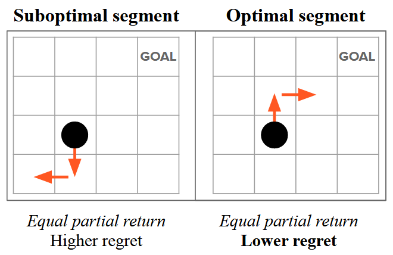

> 那么现在我们可以使用最优优势函数来重新构建我们的**Bradley-Terry 偏好概率建模：**
>
> $$
> {P^*}[\sigma^{1} \succ \sigma^{2}] = \frac{\exp \sum_{\sigma^1} {A^*}(s_{t}^{1}, a_{t}^{1})}{\exp \sum_{\sigma^1} {A^*}(s_{t}^{1}, a_{t}^{1}) + \exp \sum_{\sigma^2} {A^*}(s_{t}^{2}, a_{t}^{2})}$$
>
> 现在我们就**可以用偏好标签和交叉熵损失函数去训练参数化的优势函数$$A_\theta$$，然后再从优势函数中导出策略$$\pi$$:**
>$$
> \mathrm{loss}(\theta) = - \mathbb{E}_{(\sigma^{1}, \sigma^{2}, y) \in \mathcal{D}} \left[y(\sigma^1\succ\sigma^2) \log {P}[\sigma^{1} \succ \sigma^{2}] + y(\sigma^2\succ\sigma^1) \log {P}[\sigma^{2} \succ \sigma^{1}]\right]$
> 
>$\pi^*(a|s) = \arg\max_{\pi}Q^{\pi}(s,a), \text{or}\arg\max_{\pi}A^{\pi}(s,a)$
> 
>但是这样操作虽然比之前用奖励函数作为偏好度量先学习奖励模型，再通过强化学习最大化奖励来学习策略的两阶段学习过程好，但是也引入了优势函数需要学习，然后再去导出策略来，**就不能像DPO那样直接学习策略吗？**

## **从优势函数到策略**

> 有的，兄弟有的。在**Behavior-Regularized RL（通常是offline RL的范畴）的设定下，最优优势函数和最优策略直接是有直接的等式关系的！！！！**&#x5177;体如下（下面的式子是**利用拉格朗日乘子法和KKT条件求解行为约束强化学习目标的最优化问题得到的结论**，感兴趣的同学可以查阅相关资料查看具体证明过程）：
>
> $\pi^*(a|s)=\pi_{ref}(a|s) e^{A^*(s,a)/\beta}$
>
> $A^*(s,a)=\beta \log \frac{\pi(a|s)}{\pi_{ref}(a|s)}$
>
> 所以带到上面的偏好建模中就得到了**直接用策略来衡量人类偏好的概率建模：**
>
> $\begin{aligned}
> {P^*}[\sigma^{1} \succ \sigma^{2}] &= \frac{\exp \sum_{\sigma^1}\gamma^t {A^*}(s_{t}^{1}, a_{t}^{1})}{\exp \sum_{\sigma^1} \gamma^t {A^*}(s_{t}^{1}, a_{t}^{1}) + \exp \sum_{\sigma^2}\gamma^t  {A^*}(s_{t}^{2}, a_{t}^{2})}\\
> &=\frac{\exp \sum_{\sigma^1} \gamma^t {\beta\log\pi}(a_{t}^{1}|s_{t}^{1})}{\exp \sum_{\sigma^1} \gamma^t {\beta\log\pi}(a_{t}^{1}|s_{t}^{1})) + \exp \sum_{\sigma^2}\gamma^t  {\beta\log\pi}(a_{t}^{2}|s_{t}^{2})}
> \end{aligned}$
>
> 然后我们再**回到大模型强化学习的一步MDP场景下重新写一下上面的式子：**
>
> $\begin{aligned}
> {P^*}[y_1 \succ y_2|x] 
> &=\frac{\exp{\beta\log}\frac{\pi^*(y_1|x)}{\pi_{ref}(y_1|x)}}{\exp{\beta\log}\frac{\pi^*(y_1|x)}{\pi_{ref}(y_1|x)}) + \exp  {\beta\log}\frac{\pi^*(y_2|x)}{\pi_{ref}(y_2|x)}}
> \end{aligned}$
>
> 可以发现**这就是DPO推导到最后的式子！！！！**
>
> **所以DPO其实就是将RLHF BT Model中的人类偏好建模的度量从最优奖励函数换成了最优优势函数，即以优势函数来衡量人类偏好的的程度而不是用奖励来衡量**

# **3.4.5 对比学习角度理解DPO**

> 如果将正样本（被偏好）和负样本（不被偏好）记为 $y^+,y^-$，则上述loss可以写成：
>
> $\begin{aligned}
> \mathrm{loss} &= - \mathbb{E}_{(y^{+}, y^{-}, x) \in \mathcal{D}} \left[ \log {P}[y^{+} \succ y^{-}] \right]\\
> &=- \mathbb{E}_{(y^{+}, y^{-}, x) \in \mathcal{D}} \left[ \log \frac{\exp{\beta\log}\frac{\pi(y^+|x)}{\pi_{ref}(y^+|x)}}{\exp{\beta\log}\frac{\pi(y^+|x)}{\pi_{ref}(y^+|x)}) + \exp  {\beta\log}\frac{\pi(y^-|x)}{\pi_{ref}(y^-|x)}}\right]
> \end{aligned}$
>
> **一般对比学习的目标是学习一种表示，使得相似的样本对彼此接近，而不相似的样本对彼此远离。**&#x5BF9;于一个锚样本 $\mathbf{x}$（例如，一张图像），假设我们有一个正样本 $\mathbf{x}^+$（例如，应用了数据增强的同一图像）和一组负样本 $\{\mathbf{x}_i^-\}_{i = 1}^m$（例如，来自其他图像的样本）。为了学习一个编码器 $f$，对比学习最小化以下损失，**其中锚实例被拉近正样本，同时被推离负样本：**
>
> $\ell_f(\mathbf{x}, \mathbf{x}^+, \{\mathbf{x}_i^-\}_{i = 1}^m) = -\log \frac{\exp(f(\mathbf{x})^{\top} f(\mathbf{x}^+))}{\exp(f(\mathbf{x})^{\top} f(\mathbf{x}^+)) + \sum_{i = 1}^m \exp(f(\mathbf{x})^{\top} f(\mathbf{x}_i^-))}$
>
> 其中，两个表示的点积（例如， $f(\mathbf{x})^{\top} f(\mathbf{x}^+)$）被视为两个样本之间的相似性分数
>
> **DPO可以看成是正负样本数量都为一的对比学习，其中$\pi(y|x)$表示策略（锚样本）与正/负样本的距离（越大说明越靠近），最后的效果就是将策略推向正样本远离负样本**

> 上面**3.5.4和3.5.5两节**的参考文献如下，感兴趣可以自行阅读一下：
>
> 1. **CONTRASTIVE PREFERENCE LEARNING: LEARNING  FROM HUMAN FEEDBACK WITHOUT RL**
>
> 2. **Models of human preference for learning reward functions**
>
> 3. **OFFLINE RL WITH NO OOD ACTIONS: IN-SAMPLE  LEARNING VIA IMPLICIT VALUE REGULARIZATION**
>
> 4. **Direct Preference Optimization: Your Language Model is Secretly a Reward Model**
>
> 5. **Direct Preference-based Policy Optimization without Reward Modeling**

# **3.4.6 DPOP算法**

> **解决痛点**：好答案 & 坏答案被采样的概率同时在变低，只不过坏答案降低的比好答案更多
>
> **做法：**
>
> 为此，DPOP在 DPO loss 的基础上加入了一个正则项：
>
> * 若当前 chosen 答案在 SFT 模型中采样概率 > 当前 Policy 模型的采样概率，则减去一个正则化系数（当前的 chosen 答案 policy 还没有拟好，别再更新那么猛了）；
>
> * 若当前 chosen 答案在 Policy 模型中采样概率更高，证明 Policy 已经对这个 chosen 答案拟合的比较充分了，此时着重降低一下坏答案的采样概率。

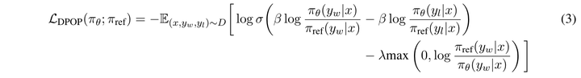

# **3.4.7 TDPO算法**

**添加ppo中的KL约束**

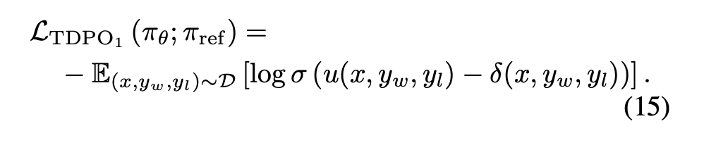

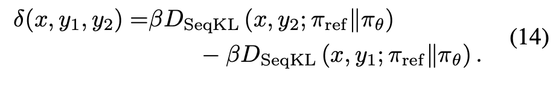

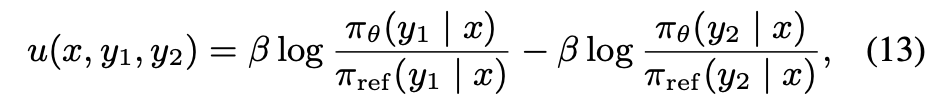

不过，不同于 PPO 中使用 backward KL，**TDPO 则是使用 forward KL 来计算 KL 惩罚**，

因为 KL 是一个非对称的距离函数，所谓 forward 和 backward 其意思就是「以 SFT 计算采样概率」还是「以 Policy Model 计算采样概率」。

在 源码 中我们能更直观的看到 forward KL 的计算方式：

```python
vocab_logps = logits.log_softmax(-1)
reference_vocab_ps = reference_logits.softmax(-1)
reference_vocab_logps = reference_vocab_ps.log()
# forward kl 
# 计算backward kl (PPO) 应为: vocab_logps - reference_vocab_logps
per_position_kl = (reference_vocab_ps * (reference_vocab_logps - vocab_logps)).sum(-1)
per_token_logps = torch.gather(vocab_logps, dim=2, index=labels.unsqueeze(2)).squeeze(2)
per_reference_token_logps = torch.gather(reference_vocab_logps, dim=2, index=labels.unsqueeze(2)).squeeze(2)
```

由于 backward KL 的目标是拟合整个分布中的「一部分」，而 forward KL 的目标是尽可能 cover 整个分布中的大部分。因此，**TDPO 训练后的模型会比 PPO 训练后的模型，在输出多样性上更加自由**。

> **PS：**&#x7ECF;过 PPO 后的模型基本一眼就能看出来，输出风格都非常一致，因为此时输出分布已经「聚集」到一个局部分布上了，reward 方差会比 SFT 小很多。

# **3.4.8 Self-Reward**

> 论文：<https://arxiv.org/pdf/2401.10020.pdf>
>
> 代码实现：<https://github.com/lucidrains/self-rewarding-lm-pytorch>
>
> 资料：<https://zhuanlan.zhihu.com/p/679449495>

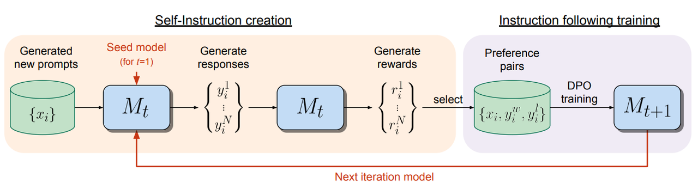

> **实现流程详解：**
>
> 1. **初始化与种子数据**：
>
>    * 首先，需要一个预训练的基础语言模型（如Llama 2 70B）和一小部分人类标注的种子数据。
>
>    * 种子数据包括指令跟随数据（Instruction Fine-Tuning, IFT）和评价指令跟随数据（Evaluation Fine-Tuning, EFT）。
>
> 2. **自我指令创建（Self-Instruction Creation）**：
>
>    * 使用少量提示（few-shot prompting）从种子IFT数据中生成新的指令提示。
>
>    * 模型为给定的新指令生成多个候选响应。
>
>    * 模型通过LLM-as-a-Judge机制评估这些候选响应的质量，即模型扮演自己的奖励模型的角色。
>
> 3. **指令遵循训练（Instruction Following Training）**：
>
>    * 从自我指令创建过程中生成的数据中选择偏好对（preference pairs），这些是由模型生成的最高分和最低分响应构成的。
>
>    * 使用直接偏好优化（Direct Preference Optimization, DPO）方法训练模型，得到下一代模型（Mt+1）。
>
> 4. **迭代训练（Iterative Training）**：
>
>    * 这个过程是迭代的，每次迭代都旨在改进前一次的结果。
>
>    * 模型使用自己的输出来细化和提高其指令遵循和奖励评估能力。
>
>    * 通过这种方式，模型在LLM对齐过程中不断更新，避免了传统模型中奖励模型固定不变的瓶颈。
>
> 5. **性能评估**：
>
>    * 模型性能的评估分为指令遵循能力和奖励模型能力两个方面。
>
>    * 指令遵循能力通过与不同模型的头对头性能比较，以及在特定排行榜（如AlpacaEval 2.0）上的胜率来评估。
>
>    * 奖励模型能力则通过与人类评级的相关性来评估，包括成对准确性、完全匹配次数、Spearman相关性和Kendall’s τ。
>
> 6. **实验结果与分析**：
>
>    * 实验结果显示，通过自我奖励训练，模型在指令遵循能力和奖励模型能力上都得到了提升。
>
>    * 在AlpacaEval 2.0排行榜上，自我奖励模型的迭代训练结果显示胜率逐步提升。

```plain&#x20;text
对用户的问题和相应回答进行审查，使用下述的加分5分制度。根据每个标准的满意程度积累分数：
若回答与用户查询相关且提供了一些相关信息，即使不完整或包含一些无关内容，加1分。
若回答涉及用户问题的实质部分，但没有完全解决查询或提供直接答案，再加1分。
若回答以有益的方式回答了用户问题的基本要素，无论其是否看似由AI助手编写，或者是否包含通常在博客或搜索结果中找到的元素，授予第三分。
若回答清晰地从AI助手的角度撰写，直接而全面地回答了用户问题，并且组织得井井有条且有帮助，即使在清晰度、简洁度或焦点方面略有改进的余地，再加1分。
若回答是由AI助手无可挑剔地根据用户的问题量身定制的，没有多余信息，反映了专业知识，并展示了高质量、引人入胜和富有深度的回答，授予第五分。
用户：<INSTRUCTION_HERE><response><RESPONSE_HERE></response>
审查用户的指示和回答后：
简要说明总分，最多100字。
以"得分：<总分>"的格式总结。请记住从AI助手的角度进行评估，必要时使用网络搜索知识。按照所述的加分模型，我们将系统地根据概述的标准进行打分。
```

**实验结果**

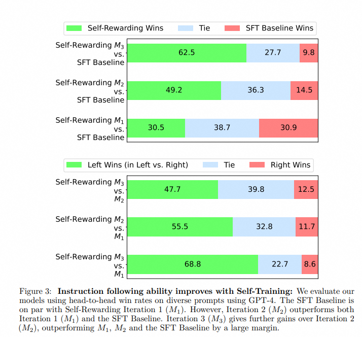


* 与单独使用 IFT 相比，将 EFT 任务添加到训练中不会影响指令 follow 能力（30.5% 胜率对比 30.9% 胜率）。

* 表明模型自奖励能力的提高不会影响其他能力。

* 这里的SFT Baseline是只使用IFT进行微调的模型，可以看到随着迭代的轮数提高，效果在不断变好。


# **3.4.9 KTO**

> **Kahneman-Tversky Optimization&#x20;**
>
> **链接：https://arxiv.org/pdf/2402.01306**

> ### **背景**
>
> 传统的 PPO 或者 DPO 需要**收集大量成对的偏好数据**，即针对一个 prompt 同时收集 chosen 和 rejected，这样的收集过程比较耗时费力。且对于主流 PPO、DPO 等方法在某种程度上已隐含了对差的回答生成更激烈惩罚的心理，但它们的效用函数仍与“真正的”前景理论函数有所差异，即**忽略人类心理偏差**：**人类对“坏输出”更敏感，却没有体现在优化中**。KTO则在此基础上，提&#x51FA;**&#x20;HALO 损失，只需要对回答标注好或者坏即可，利用前景理论，实现收益和损失的非对称**

> ### **前景理论**
>
> 前景理论（Prospect Theory）由心理学家 Kahneman 和 Tversky 提出，描述人类如何在面对不确定性时评估收益与损失。其核心特征是：
>
> * **参考点依赖性（Reference Dependence）**：判断行为基于一个心理参考点
>
> * **损失厌恶（Loss Aversion）**：损失带来的痛苦大于等量收益带来的快乐
>
> * **非线性价值感知**：小损失比小收益更敏感，边际效用递减
>
> 前景理论的价值函数通常呈 S 形，如下：
>
> * 在参考点之上（收益）为凹函数
>
> * 在参考点之下（损失）为凸函数
>
> * 损失区域的斜率更陡

> ### **HALOs**
>
> HALOs （Human-Aware Loss）将前景理论的思想应用到LLM训练中，其核心优化目标为：
>
> $f(\pi_\theta) = \mathbb{E}_{(x,y) \sim D} \left[ a_{x,y} \cdot v\bigl(r_\theta(x,y) - z_0\bigr) \right] + C_D$
>
> 其中：
>
> * $(x,y)$: 输入输出对
>
> * $a_{x,y} \in \{+1, -1\}$: 人类标注的反馈标签 (好或差) ;
>
> * $r_\theta(x,y) = \log \frac{\pi_\theta(y|x)}{\pi_{\text{ref}}(y|x)}$: 隐式奖励，即当前策略和参考模型的 log-likelihood 比值;
>
> * $z_0$: 参考点，$\mathbb{E}_Q\left[r_\theta(x, y')\right]$，其中 $Q(Y' \mid x)$是 $\mathcal{Y}$上的参考点分布，也可用 KL 散度 $\mathrm{KL}\bigl(\pi_\theta(y' \mid x) \parallel \pi_{\text{ref}}(y' \mid x)\bigr)$
>
> * $v(\cdot)$: 前景理论价值函数，分段非线性，体现收益/损失非对称
>
> * $C_D$: 与训练数据无关的常数，可忽略优化中影响。
>
> 这个目标函数用来刻画人类对“好”与“坏”生成的感知差异，使模型以更拟人化的方式学习偏好

> ### **KTO**
>
> 在 KTO 中，价值函数通过分段 logistic 实现，模仿前景理论的 S 型曲线，这种设计可以更真实地模拟人类“对好结果渐渐不敏感，但对坏结果非常敏感”的行为模式：
>
> $v(r - z_0) = \begin{cases} 
> \lambda_D \cdot \sigma\left(\beta (r - z_0)\right), & \text{若为正样本（好）} \\
> -\lambda_U \cdot \sigma\left(\beta (z_0 - r)\right), & \text{若为负样本（差）} 
> \end{cases}$
>
> * $\sigma$: logistic 函数
>
> * $\beta$: 同DPO中的 $\beta$
>
> * $\lambda_D$、$\lambda_U$: 分别表示“对正向提升的敏感度”和“对负向惩罚的敏感度”，通常$\lambda_U \gt \lambda_D$，体现损失厌恶 设 $n_D $和 $  n_U  $ 分别代表偏好和非偏好样本的个数，使用公式 $\frac{\lambda_D n_D}{\lambda_U n_U} \in \left[1, \frac{4}{3}\right]$ 来设置 $\lambda_D$、$\lambda_U$&#x20;
>
> * $z_0$: 参考点。在实际情况中，按照上述定义去估计$z_0$ 是不切实际的，因为从 $\pi_\theta $中采样速度很慢。 相反，KTO 使用一种有偏但便捷的估计方法：在同一个 microbatch 中对输出进行移位，以产生不匹配的样本对 $\{(x_1, y_2), (x_2, y_3), \ldots, (x_m, y_0)\} $，然后为同一个 microbatch中的所有样本估计一个共享的参考点，如下所示：
>
>   $ 
>   \hat{z}_0 = \max \left( 0, \frac{1}{m} \sum_{1 \leq i < m} \log \frac{\pi_\theta(y_j \mid x_i)}{\pi_{\text{ref}}(y_j \mid x_i)} \right)
>   , j = (i + 1) \bmod m  $
>
>   使用不匹配的输出 $ y_j$而非对应的 $ y_i$，原因在于后者往往是被刻意挑选出来的、典型的好输出或坏输出，因此会产生不具代表性的大幅值奖励
>
> 这样，收益和损失的增量在心理函数中的冲击是非对称且非线性的，与人类评估接轨
>
> 前面提到的 HALOs 的目标函数，目标是**最大化**，转化为具体的 KTO 的损失函数的时候，这里做了一些小处理，最后的 KTO loss如下：
>
> $L_{\text{KTO}}(\pi_\theta, \pi_{\text{ref}}) = \mathbb{E}_{x,y \sim \mathcal{D}} \left[ \lambda_y - v(x, y) \right]$
>
> 其中，当 $   y  $ 是期望（desirable）输出时， $\lambda_y$表示 $\lambda_D$；当  $  y  $是不期望（undesirable）输出时， $\lambda_y$表示 $\lambda_U$&#x20;

# **3.4.10 ORPO**

# **3.4.11 SimPO**

# **3.4.12 IPO**

# **3.4.13 RSO**

# **3.4.14 RRHF**

# **3.4.15 SLiC**

# **3.4.16 CPO**

# **3.4.17 RPO**

# **3.4.18&#x20;**&#x3B2;-DPO
