> **PEFT&#x20;**&#x65B9;法仅微调少量或额外的模型参数，固定大部分预训练参数，大大降低了计算和存储成本，同时最先进的 PEFT 技术也能实现了与全量微调相当的性能。**微调大模型时只训练一小部分参数，而不是训练全量的模型参数，对于下游任务只需要部分参数就可以**
>
> **优点：**
>
> * 显存占用少，对硬件资源要求低
>
> * 训练速度快，耗时更短
>
> * 更低的存储成本，不同的任务可以共享大部分的权重参数
>
> * 可能会有更好的模型性能，减轻了过拟合问题
>
> **但是一般有条件的时候还都是全量微调的**

# **3.5.1 Prompt Tuning**

## **Prompt Tuning概念**

> **prompt tuning&#x20;**&#x5176;实是一个比较范围比较广的概念，通过调整prompt模板来实现对模型的微调。**不同的任务可以定义自己的Prompt，然后拼接到数据上作为输入，但只在输入层加入prompt tokens，并且不需要加入到后续的模型层MLP中进行调整来解决难训练的问题。固定整个预训练模型参数，只允许将每个下游任务的额外 k 个可更新的 tokens 前置到输入文本中，也没有使用额外的编码层或任务特定的输出层**
>
> * 对于建模方面， 以 T5 为基础，将所有任务转化成文本生成任务，表示为  $P_{r_{θ}}(Y|X)$ 。Prompt Tuning 在输入 X 前额外添加一系列特殊 tokens P，输入语言模型生成 Y，即 $ P_{r_{θ};θ_{P}}(Y|[P;X])$。其中，$\theta$ 为预训练模型参数，在训练过程被固定， $θ_P$ 为 prompts 的专有参数，在训练过程被更新优化。通过将输入 $X$ 的 embedding 矩阵  $X_e$ 与 prompts 的 embedding 矩阵进行拼接  $[P_e,X_e] $输入 T5 模型，最大化 $Y$ 的概率训练模型，但是只有 prompt 参数被更新
>
> * 对于训练方面，Prompt Tuning 提出了 Prompt Ensembling 方法来集成预训练语言模型的多种 prompts。通过在同一任务上训练 N 个 prompts，为一个任务创建了 N 个单独的模型，同时在整个过程中共享核心的预训练语言建模参数

> ### **Model Tuning VS Prompt Tuning**
>
> * **Model Tuning：**&#x9700;要为每个下游任务都搞一个预训练模型，并且推理必须在单独的batch中进行
>
> * **Prompt Tuning：**&#x53EA;需要为每个任务存储一个小的特定任务的prompt，并能够使用原始预训练模型进行混合任务推理

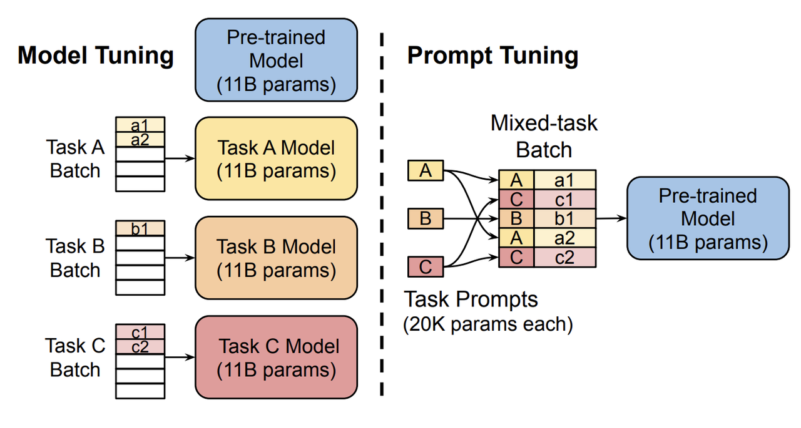

## **Prompt Tuning分类**

> **Prompt Tuning主要可以分为Hard Prompt和Soft Prompt：**
>
> * **Hard Prompt：**
>
>   * 人工构建（Manual Template）
>
>   * 启发式法（Heuristic-based Template）：通过规则、启发式搜索等方法构建合适的模板
>
>   * 生成（Generation）：根据给定的任务训练数据（通常是小样本场景），生成出合适的模板
>
> * **Soft Prompt：**
>
>   * **词向量微调（Word Embedding）**：显式地定义离散字符的模板，但在训练时这些模板字符的词向量参与梯度下降，初始定义的离散字符用于作为向量的初始化
>
>   * **伪标记（Pseudo Token）：**&#x4E0D;显式地定义离散的模板，而是将模板作为**可训练的参数**
>
> **Hard Prompt**旨在直接与原始文本拼接显式离散的字符，且在训练中始终保持不变 。这里的保持不变是指这些离散字符的词向量（Word Embedding）在训练过程中保持固定 ，不需要引入任何参数。
>
> **Soft Prompt**旨在让模型在训练过程中根据具体的上下文语义和任务目标对模板参数进行连续可调。这套方案的动机则是认为**离散不变的模板无法参与模型的训练环节，容易陷入局部最优**，而如果**将模板变为可训练的参数**，那么不同的样本都可以在连续的向量空间中寻找合适的伪标记，同时也增加模型的泛化能力，需要引入少量的参数并让模型在训练时进行参数更新
>
> **Prefix tuning、P-tuning、P-tuning v2都属于连续的prompt构建**，**通过把传统人工设计模版中的真实token替换成可微的virtual token，转换为模型中可以学习的参数进行更新**，只是他们之间存在细微差别

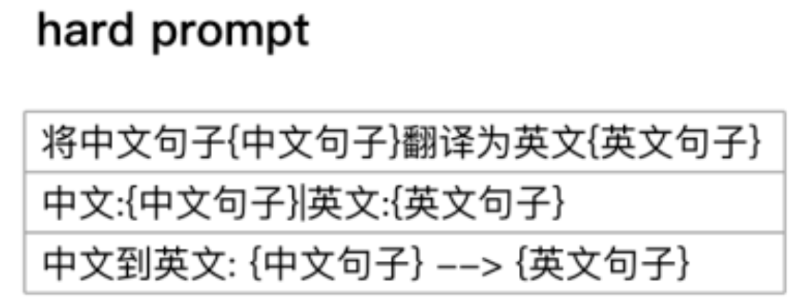

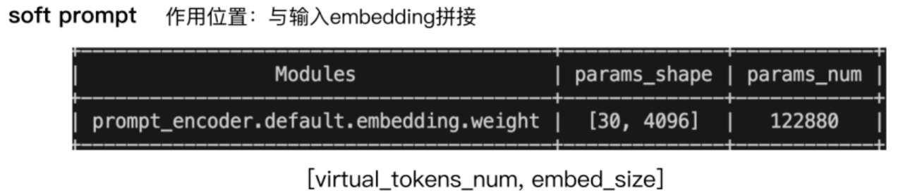

# **3.5.2 P-Tuning**

## **P-Tuning概念**

> ### **P-Tuning**
>
> 该方法&#x5C06;**&#x20;Prompt 转换为可以学习的 Embedding 层**，并用MLP+LSTM的方式来对Prompt Embedding进行一层处理，利用少量连续的 embedding 参数作为 prompt 使 GPT 更好的应用于 NLU 任务。需要注意：**P-tuning只限于embedding层，也就是输入层，没有在每一层都加**；另外virtual token的位置也不一定是前缀，插入的位置是可选的
>
> 一个离散的 prompt 模板 T 可以写为："The capital of Britain is \[MASK]."，其中"Britain"为输入的上下文 x ，"\[MASK]"位置为需要输出的目标 y 。而对于连续的 prompt 模板可以表示为： $  T=\{[P_0:i],x,[P_i+1:m],y\}  $，其中， \[Pi] 表示模板 T 中 ith 个 prompt token，且为伪 token。经过嵌入层将模板 T 映射为：  $\{h_0,...,h_i,e(x),h_i+1,...,h_m,e(y)\}$ ，其中  $h_i$ 为可训练的参数，而其它预训练的真实token向量以及模型权重参数都被固定。论文中设计了一个 prompt 编码器，该编码器由一个 Bi-LSTM 和一个两层的前馈神经网络组成，对 prompt embedding 序列进行编码后再传入到语言模型中。具体公式如下所示：
>
> $\begin{aligned}h_{i}&=\mathrm{MLP}([\overrightarrow{h_{i}}:\overleftarrow{h_{i}}])\\&=\mathrm{MLP}([\mathrm{LSTM}(h_{0:i}):\mathrm{LSTM}(h_{i:m})])\end{aligned}$

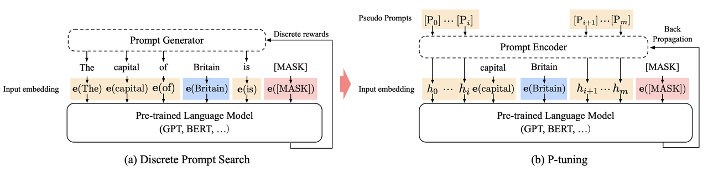

## **P-Tuning改进**

> ### **主要改进**
>
> * **考虑到伪标记的相互依赖关系：**&#x8BA4;为"capital"与"Britain"是有先后关系的，而prompt部分的双向attention无法显式地刻画这层关系，因此引入**Prompt Encoder，实际过程中的实现是采用一层RNN**
>
> * **指定上下文词：**&#x5982;果模板全部是伪标记，在训练时无法很好地控制这些模板朝着与对应句子相似的语义上优化，因此**选定部分具有与当前句子语义代表性的一些词作为一些伪标记的初始化**（例如上图中“capital”、“Britain”等）
>
> * **重参数（Reparameterization）：**&#x5177;体到代码实现上，**P-tuning先通过一个Prompt Encoder表征这些伪标记后，直接将这些新的表征覆盖到对应的embedding table上**，换句话说，Prompt Encoder只在训练时候会使用到，而在推理阶段则不再使用
>
> * 混合提示（Hydride Prompt）：将连续提示与离散token进行混合。
>
> * 需要被MASK的token如何选择：P-tuning中通过MLP或者LSTM选择
>
> * 需要参与微调的参数量级：P-tuning中仅更新embedding层中virtual token的部分参数
>
> **为什么P-tuning要先经过MLP或者LSTM选择virtual token：**&#x7ECF;过预训练的LM的词嵌入已经变得高度离散，如果随机初始化virtual token，容易优化到局部最优值。因此，用一个**Prompt Encoder**（即用一个LSTM+MLP去编码这些virtual token以后，再输入到模型）来编码会收敛更快，效果更好

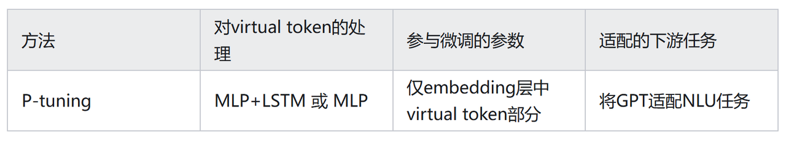

# **3.5.3 Prefix Tuning**

> 本质也是把传统人工设计模版中的真实token替换成可微的virtual token；该方法在**输入token之前构造一段任务相关的连续的virtual tokens作为Prefix，但是它由不对应于真实 tokens 的自由参数组成，**&#x7136;后，在训练的时候**只更新Prefix部分的参数**，而 LLM 中的其他部分参数固定

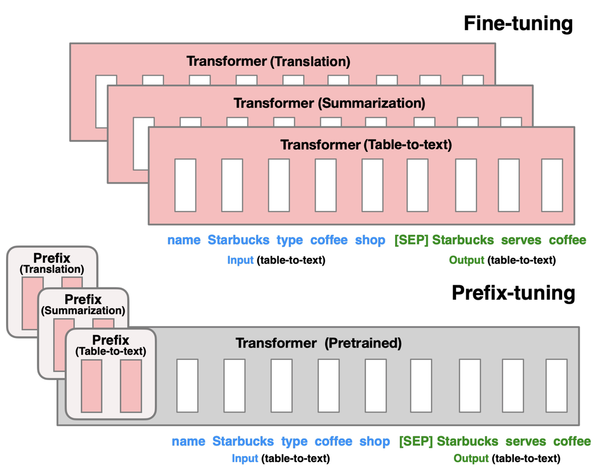

> 1. **针对不同的模型结构需要构造不同的Prefix**
>
>    * 针对**自回归架构模型：**&#x5728;句子前面添加前缀，得到 `z = [PREFIX; x; y]`，合适的上文能够在固定 LM 的情况下去引导生成下文（比如：GPT3的上下文学习）
>
>    * 针对**编码器-解码器架构模型：**&#x45;ncoder和Decoder都增加了前缀，得到 `z = [PREFIX; x; PREFIX0; y]`。Encoder端增加前缀是为了引导输入部分的编码，Decoder 端增加前缀是为了引导后续token的生成
>
> 2. **对 virtual token的编码方式**
>
>    同时，为了防止直接更新 Prefix 的参数导致训练不稳定和性能下降的情况，在 Prefix 层前面加了 MLP 结构，训练完成后，只保留 Prefix 的参数。除此之外，**通过消融实验证实，只调整embedding层的表现力不够，将导致性能显著下降，因此，在每层都加了prompt的参数，改动较大**

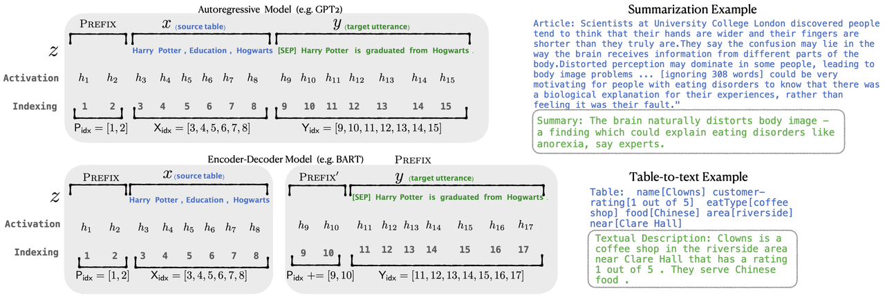

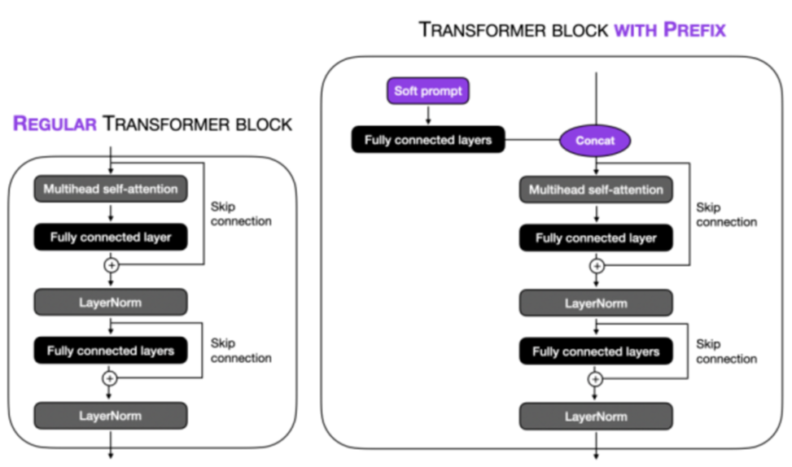

> ### **对比Prompt Tuning和Prefix Tuning**
>
> * **Prompt Tuning：**&#x5C06;可训练的张量添加到输入embedding
>
> * **Prefix Tuning：**&#x5C06;可训练张量添加到所有Transformer Block

# **3.5.4 P-Tuning V2**

> ### **Prompt Tuning和P-Tuning等方法存在的问题**
>
> 1. **缺乏模型参数规模和任务通用性**
>
>    * **缺乏规模通用性**：Prompt Tuning论文中表明当模型规模超过100亿个参数时，提示优化可以与全量微调相媲美。但是对于那些较小的模型（从100M到1B），提示优化和全量微调的表现有很大差异，这大大限制了提示优化的适用性
>
>    * **缺乏任务普遍性**：尽管Prompt Tuning和P-tuning在一些 NLU（自然语言理解） 基准测试中表现出优势，但提示调优对硬序列标记任务（即序列标注）的有效性尚未得到验证
>
> 2. **缺少深度提示优化**，在Prompt Tuning和P-tuning中，连续提示只被插入transformer第一层的输入embedding序列中，在接下来的transformer层中，插入连续提示的位置的embedding是由之前的transformer层计算出来的，这可能导致两个可能的优化挑战。
>
>    * **由于序列长度的限制，可调参数的数量是有限的**。
>
>    * **输入embedding对模型预测只有相对间接的影响**。
>
> 该方法在每一层都加入了Prompts tokens作为输入，而不是仅仅加在输入层，这带来两个方面的好处：
>
> * **更多可学习的参数**（从P-tuning和Prompt Tuning的0.01%增加到0.1%-3%），同时也足够参数高效
>
> * 加入到更深层结构中的Prompt能给模型预测带来更直接的影响

> ### **P-Tuning V2的具体做法**
>
> 做法**基本同Prefix Tuning**，可以看作是**文本生成的Prefix Tuning技术适配到NLU任务中**，然后做了一些改进：
>
> * **移除重参数化的编码器：以前的方法利用重参数化功能来提高训练速度和鲁棒性**（如：Prefix Tuning 中的 MLP 、P-Tuning 中的 LSTM），在 P-tuning v2 中，作者发现重参数化的改进很小，尤其是对于较小的模型，同时还会影响模型的表现
>
> * **针对不同任务采用不同的提示长度：**&#x63D0;示长度在提示优化方法的超参数搜索中起着核心作用。不同的理解任务通常用不同的提示长度来实现其最佳性能，这与 Prefix-Tuning 中的发现一致，不同的文本生成任务可能有不同的最佳提示长度
>
> * **引入多任务学习：**&#x5148;在多任务的Prompt上进行预训练，然后再适配下游任务。一方面，连续提示的随机性给优化带来了困难，这可以通过更多的训练数据或与任务相关的无监督预训练来缓解；另一方面，连续提示是跨任务和数据集的特定任务知识的完美载体。在一些困难的序列任务中，多任务学习可以作为P-tuning v2的补充
>
> * **回归传统的分类标签范式而不是映射器**：标签词映射器（Label Word Verbalizer）一直是提示优化的核心组成部分，它将one-hot类标签变成有意义的词，以利用预训练语言模型头。尽管它在few-shot设置中具有潜在的必要性，但在全数据监督设置中，Verbalizer并不是必须的，它阻碍了提示调优在需要无实际意义的标签和句子嵌入的场景中的应用。因此，P-Tuning v2回归传统的CLS标签分类范式，采用随机初始化的分类头（Classification Head）应用于tokens之上，以增强通用性，可以适配到序列标注任务
>
> 实现的时候prefix tuning和P-tuning v2都是通过**past\_key\_values**进入attention运算内部，在每一层中运算的

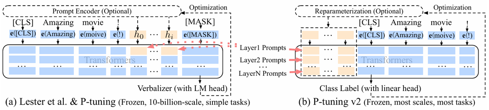

```python
#设置virtual_token的数量及past_key_values维度
prompt_tokens = prompt_tokens[:, : peft_config.num_virtual_tokens]
past_key_values = past_key_values.view(
        batch_size,peft_config.num_virtual_tokens,
        peft_config.num_layers * 2,
        peft_config.num_attention_heads,
        peft_config.token_dim // peft_config.num_attention_heads,
)
# prefix encoder类的定义
class PrefixEncoder(torch.nn.Module):  
    """  
    The torch.nn model to encode the prefix    Input shape: (batch-size, prefix-length)    Output shape: (batch-size, prefix-length, 2*layers*hidden)    """    def __init__(self, config: ChatGLMConfig):  
        super().__init__()  
        self.prefix_projection = config.prefix_projection  
  
        # self.prefix_projection=True-->prefix tuning
        # self.prefix_projection=False-->p-tuning v2
        if self.prefix_projection:  
            # Use a two-layer MLP to encode the prefix  
            kv_size = config.num_layers * config.kv_channels * config.multi_query_group_num * 2  
            self.embedding = torch.nn.Embedding(config.pre_seq_len, kv_size)  
            self.trans = torch.nn.Sequential(  
                torch.nn.Linear(kv_size, config.hidden_size),  
                torch.nn.Tanh(),  
                torch.nn.Linear(config.hidden_size, kv_size)  
            )  
        else:  
            self.embedding = torch.nn.Embedding(config.pre_seq_len,  
                                                config.num_layers * config.kv_channels * config.multi_query_group_num * 2)  
  
    def forward(self, prefix: torch.Tensor):  
        if self.prefix_projection:  
            prefix_tokens = self.embedding(prefix)  
            past_key_values = self.trans(prefix_tokens)  
        else:  
            past_key_values = self.embedding(prefix)  
        return past_key_values
```

* **总结一下soft prompt方法：**

| **方法**            | **对virtual token的处理** | **参与微调的参数**                               | **适配的下游任务** |
| ----------------- | --------------------- | ----------------------------------------- | ----------- |
| **P-tuning**      | MLP + LSTM或MLP        | 仅embedding层中virtual token部分               | 使GPT适配NLU任务 |
| **Prefix tuning** | MLP                   | Prefix encoder，通过past\_key\_values代入每一层运算 | 主要用于NLG任务   |
| **P-tuning v2**   | \\                    |                                           | NLG/NLU任务   |

# **3.5.5 Adapter Tuning**

> **核心思想：通过引入一些额外的模块来适配下游任务**
>
> 通过在每一层的transformer layer中加入额外的Adapter的模块来在下游任务微调，特点是**微调训练和推理的时候都额外增加了成本，因为Adapter是线性的加入transformer结构中的**
>
> **LLaMA-adapter：**
>
> Adapter和Prefix tuning的问题是结合了随机初始化的张量可能会损害预训练的语义学知识，导致**微调不稳定和性能损失**，而LLaMA - adapter通过下面两个改进实现稳定训练：
>
> * 引入**零初始化的注意力机制和门控机制**
>
> * **只修改深层的L个Transformer层**

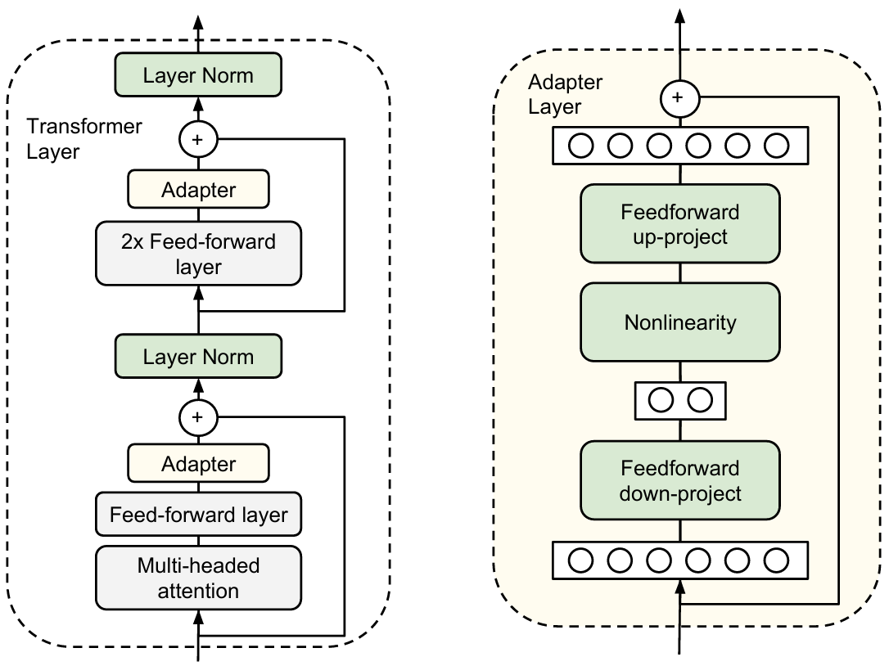

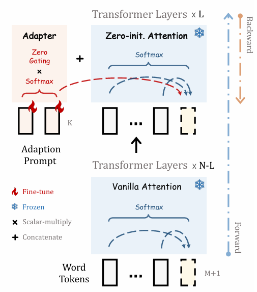

# **3.5.6 LoRA及其变体**

## **LoRA**

> ### **Low-rank Adaption 低秩微调**
>
> LORA是一种低资源微调大模型方法，使用LORA，训练参数仅为整体参数的万分之一、GPU显存使用量减少2/3且**不会引入额外的推理耗时（相比Adapter的优势）**

* **高效微调的原理：**&#x5728;微调模型的过程中加载预训练参数 $\phi$进行初始化，并通过FT的优化目标最大化语言模型概率更新得到参数 $\phi+\Delta\phi$。这样的微调方式的主要缺点是得到的增量参数 $\Delta\phi$和初始化参数的维度是一致的，称为全量微调，需要大量资源。高效微调则是用更少的参数表示上述需要学到的参数增量，相当于只微调一部分参数

* **LoRA的实现：**&#x4C;oRA旨在**使用低秩矩阵来编码参数增量 $\Delta\phi$，在训练过程中，低秩的适应矩阵仅仅放大了对下游任务有用的特征，而不是预训练模型中的主要特征**

  * **Instrisic Dimension 内在维度**：LLM表现出很好的few-shot能力，以及利用数千条样本就可以微调一个数十亿参数的LLM，其内在原意是**预训练模型拥有极小的内在维度(instrisic dimension)，即存在一个极低维度的参数，微调它和在全参数空间中微调能起到相同的效果**

  * **Low Rank 低秩：**&#x6839;据内在维度的启发，LoRA认为参数更新过程中也存在一个内在秩，对于预训练权重矩阵可以用一个低秩分解来表示参数更新：

  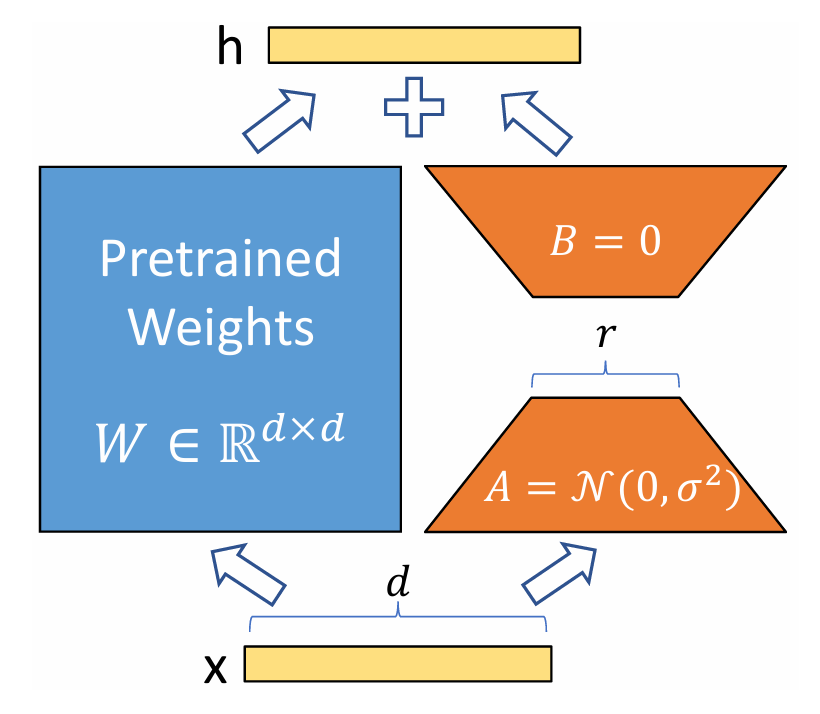


  $  W_0 + \Delta W = W_0 + BA \quad
  \\
  W_0 \in \mathbb{R}^{d \times k},
  B \in \mathbb{R}^{d \times r}, A \in \mathbb{R}^{r \times k} \quad 
  \\
  \text{and} \quad r \ll \min(d, k)  $

  训练过程中冻结参数 $W_0$，仅训练A和B中的参数，前向forward过程也变成了：

  $  h = W_0 x + \Delta W x = W_0 x + B A x  $

  两边的forward推理是并行的可以同时进行，所以相比Adapter的串行就减少了推理耗时

  * **LoRA应该作用在哪些参数矩阵？**：

    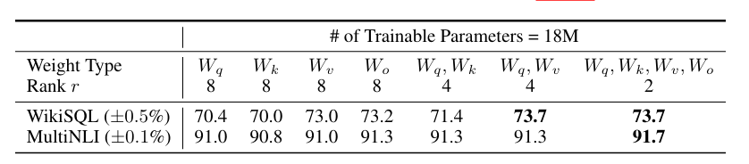

    * 将所有微调参数都放到attention的某一个参数矩阵的效果并不好，将可微调参数平均分配到𝑊𝑞和𝑊v的效果最好

    * 即使是秩仅取4也能在Δ𝑊中获得足够的信息

  * **LoRA的最优秩r是多少？：**

    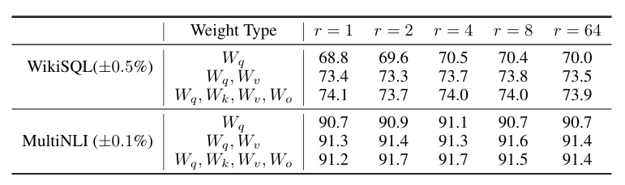

    * 在秩小到1或者2的时候，LORA的仍有不错的效果，因此更新参数矩阵ΔW可能拥有极小的内在秩

  * **LoRA的矩阵初始化：**&#x4E0B;采样矩阵A为随机高斯初始化，上采样矩阵B为全0初始化

    > 这么初始化是为了保证训练的开始旁路矩阵依然是0矩阵，对预训练的参数没有影响
    >
    > * **为什么B可以初始化为全0？**
    >
    >   如果B初始化为全0，则初始的时候$\Delta W = A\cdot B = A \cdot 0 = 0$，意味着模型的权重未发生任何变化，仍然是原始权重 ，随着训练进行，B的梯度会逐渐更新，最终学得有意义的权重调整。B的梯度： $\frac{\partial \mathcal{L}}{\partial B} = A^T \cdot \frac{\partial \mathcal{L}}{\partial \Delta W} $因此，B初始化为0不会阻碍训练，因为它仍然可以从梯度中学习到非零的值
    >
    > * **为什么A不能初始化为全0？**
    >
    >   如果A初始化为全0， $\Delta W = 0$，A的梯度 $\frac{\partial \mathcal{L}}{\partial A} =  \frac{\partial \mathcal{L}}{\partial \Delta W} \cdot B^T = 0$由于梯度为0，A将无法更新。这会导致模型的训练停滞，权重无法学到有意义的调整

**实际上上述的解释对于AB反过来也成立，并不能说明为什么这么设计**

这篇文献 ***The Impact of Initialization on LoRA Finetuning Dynamics&#x20;***&#x505A;了实验给出了AB两种初始化的对比

* Init\[A]拥有更好的特征学习效率和一些训练不稳定性

* Init\[B]拥有稳定训练和次优的特征学习

**Init\[A]通常情况下拥有更好的表现，源自于更好的特征学习，一点训练不稳定性可以接受**

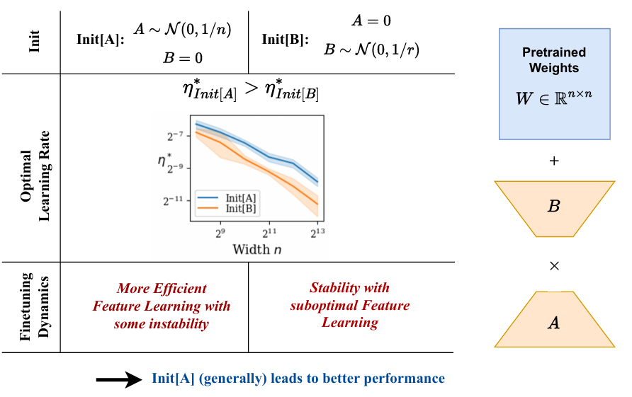

**核心代码：**&#x53C2;考脚本：PEFT/src/peft/tuners/lora/layer.py

1. LoRA 微调的核心是 `LoraModel` 类：

```python
class LoraModel(BaseTuner):    
    def __init__(self, model, config, adapter_name) -> None:
```

* 接下来分析`Linear`类，通过拷贝本来的 `nn.Linear` 的 `in_features` 和 `out_features` 属性，LoRA 创建了一个 `Linear` 类，在同个文件中可以找到这个类的定义：

```python
class Linear(nn.Linear, LoraLayer):
    def __init__(
        self,
        adapter_name: str,
        in_features: int,
        out_features: int,
        r: int = 0,
        lora_alpha: int = 1,
        lora_dropout: float = 0.0,
        fan_in_fan_out: bool = False,
        is_target_conv_1d_layer: bool = False,
        **kwargs,
    ):
        init_lora_weights = kwargs.pop("init_lora_weights", True)

        nn.Linear.__init__(self, in_features, out_features, **kwargs)
        LoraLayer.__init__(self, in_features=in_features, out_features=out_features)
        # Freezing the pre-trained weight matrix
        self.weight.requires_grad = False

        nn.Linear.reset_parameters(self)
        self.update_layer(adapter_name, r, lora_alpha, lora_dropout, init_lora_weights)
        self.active_adapter = adapter_name
```

* 接下来我们分析`LoraLayer`下的`update_layer`函数：

```python
self.lora_dropout.update(nn.ModuleDict({adapter_name: lora_dropout_layer}))
# Actual trainable parameters
self.lora_A[adapter_name] = nn.Linear(self.in_features, r, bias=False)
self.lora_B[adapter_name] = nn.Linear(r, self.out_features, bias=lora_bias)
self.lora_bias[adapter_name] = lora_bias
```

终于，看到了 LoRA 设置降维矩阵A  和升维矩阵B ，上面的代码还设置了放缩因子

## **QLoRA**

> 基于LoRA的微调方法，引入**4-bit NormalFloat、双重量化和Paged Optimizers**等方法，降低内存使用同时保持性能。通过在每个网络层添加适配器，QLORA避免以前工作中观察到的几乎所有的准确性折衷。这种方法将65B参数模型的内存需求从>780GB降低到<48GB，使得单GPU上微调最大的公开可用模型成为可能

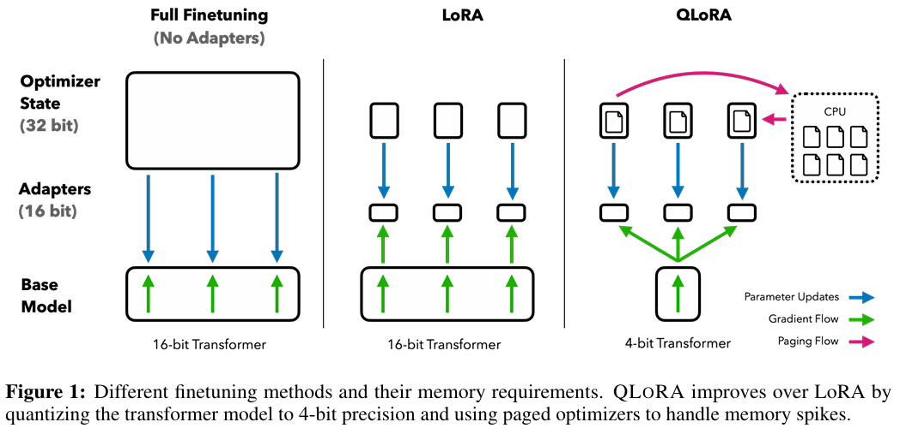

## **LoRA+**

> 为矩阵**a和b引入不同的学习率**，引入了一种更有效的训练LoRA适配器的方法具体的更新过程如下，论文中B学习率是A的6倍：
>
> $\begin{aligned}A&\leftarrow A-\eta\times G_A\\B&\leftarrow B-\lambda\eta\times G_B,\quad&\lambda\gg1\end{aligned}$

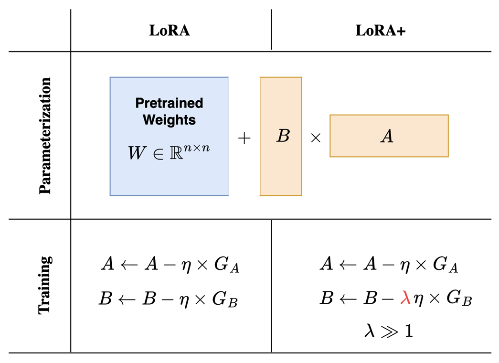

* **核心代码：**&#x53C2;考脚本：simple-lora-plus/tricks/lora\_plus.py

1. **创建lora+优化器**

```python
optimizer_grouped_parameters = [
        {
            "params": list(parameters["A"].values()),
            "weight_decay": weight_decay,
            "lr": lr,
        },
        {
            "params": list(parameters["embedding"].values()),
            "weight_decay": weight_decay,
            "lr": lora_lr_embedding,
        },
        {
            "params": list(parameters["B"].values()),
            "weight_decay": weight_decay,
            "lr": lr * lora_lr_ratio,
        },
        {
            "params": list(parameters["B_no_decay"].values()),
            "weight_decay": 0.0,
            "lr": lr * lora_lr_ratio,
        },
    ]
    optimizer = optimizer_cls(optimizer_grouped_parameters, **optimizer_kwargs)
```

* **重写Trainer 的 create\_optimizer方法**

```python
class LoraPlusTrainer(Trainer):
    def create_optimizer(self):
        opt_model = self.model_wrapped if is_sagemaker_mp_enabled() else self.model
        if self.optimizer is None:
            optimizer_cls, optimizer_kwargs = Trainer.get_optimizer_cls_and_kwargs(
                self.args
            )

            lora_lr_ratio = LORA_LR_RATIO
            lora_lr_embedding = LORA_LR_EMBEDDING

            self.optimizer = create_lorap_optimizer(opt_model, lora_lr_ratio, optimizer_cls, optimizer_kwargs,
                                                    lora_lr_embedding)
        if is_sagemaker_mp_enabled():
            self.optimizer = smp.DistributedOptimizer(self.optimizer)

        return self.optimizer
```

## **VeRA**

Vector-based Random Matrix Adaptation，引入了一种方法来大幅减少LoRA参数大&#x5C0F;**，没有训练矩阵A和B而是用共享的随机权值初始化这些矩阵(即所有层中所有矩阵A和B都具有相同的权值)，并添加两个新的向量d和b，微调的时候只训练向量d和b**

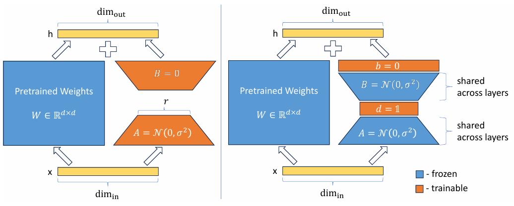

## **LoRA-FA**

> 在LoRA的基础上，冻结矩阵A，矩阵B不是添加新的向量，而是在用零初始化之后进行训练，减少了一半的训练参数

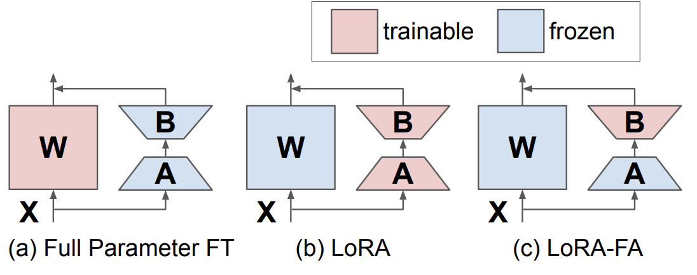

## **AdaLoRA**

> LoRA每个Adapter的秩都是一样的，**AdaLoRA对于不同层、类型参数根据下游任务动态分配秩，基于SVD的形式参数化增量更新，这种基于SVD的参数化形式可以在规避SVD复杂的计算的同时高效裁剪不重要的奇异值，从而降低计算量**

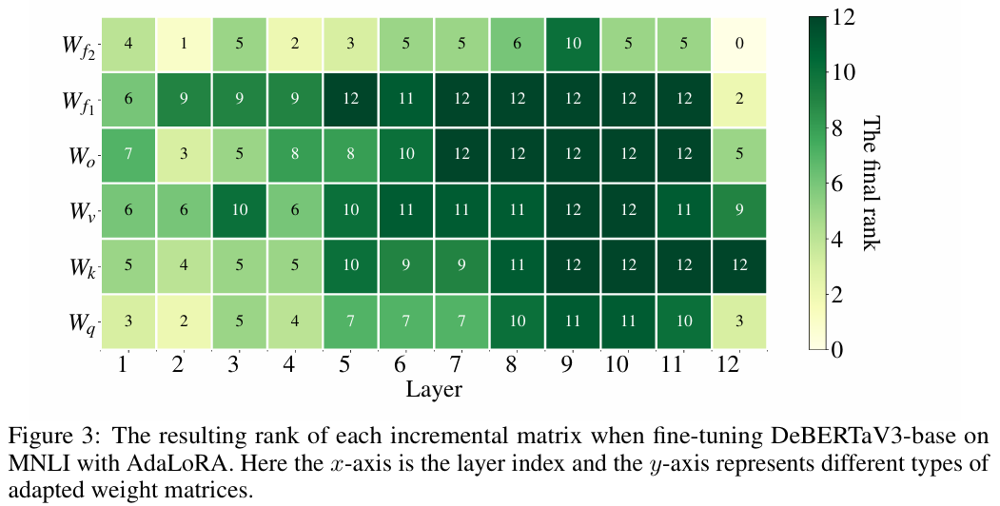

* **核心代码：参考代码**：PEFT/src/peft/tuners/adalora/layer.py，`AdaLoraLayer` 和 `SVDLinear` 类通过动态调整低秩分解参数和适配器权重，并自适应地分配预算

```python
class AdaLoraLayer(LoraLayer):
    def update_layer(self, adapter_name, r, lora_alpha, lora_dropout, init_lora_weights):    
        self.lora_A[adapter_name] = nn.Parameter(torch.randn(r, self.in_features))
        # Singular values
        self.lora_E[adapter_name] = nn.Parameter(torch.randn(r, 1))
        # Left singular vectors
        self.lora_B[adapter_name] = nn.Parameter(torch.randn(self.out_features, r))
        # The current rank
        self.ranknum[adapter_name] = nn.Parameter(torch.randn(1), requires_grad=False)
        self.ranknum[adapter_name].data.fill_(float(r))
        self.ranknum[adapter_name].requires_grad = False
        self.scaling[adapter_name] = lora_alpha if lora_alpha > 0 else float(r)
        
class SVDLinear(nn.Module, AdaLoraLayer):
    def forward(self, x: torch.Tensor, *args: Any, **kwargs: Any) -> torch.Tensor:
        result = self.base_layer(x, *args, **kwargs)
        for active_adapter in self.active_adapters:                
            lora_A = self.lora_A[active_adapter]
            lora_B = self.lora_B[active_adapter]
            lora_E = self.lora_E[active_adapter]
            dropout = self.lora_dropout[active_adapter]
            scaling = self.scaling[active_adapter]
            ranknum = self.ranknum[active_adapter] + 1e-5

            x = x.to(lora_A.dtype)
            result += (dropout(x) @ (lora_A * lora_E).T @ lora_B.T) * scaling / ranknum
            
            
        return result

```

## **DoRA**

> DoRA这个过程大概分两步走：首先，把预训练的权重矩阵拆成两个部分，一个是大小向量（m），另一个是方向矩阵（V）。然后，对方向矩阵V应用LoRA的处理，同时大小向量m也单独进行训练

* **核心代码：参考代码**：PEFT/src/peft/tuners/lora/dora.py

```python
class LinearWithDoRAMerged(nn.Module):
 
    def __init__(self, linear, rank, alpha):
        super().__init__()
        self.linear = linear
        self.lora = LoRALayer(
            linear.in_features, linear.out_features, rank, alpha
        )
        self.m = nn.Parameter(
            self.linear.weight.norm(p=2, dim=0, keepdim=True))
 
    def forward(self, x):
        lora = self.lora.A @ self.lora.B
        numerator = self.linear.weight + self.lora.alpha*lora.T
        denominator = numerator.norm(p=2, dim=0, keepdim=True)
        directional_component = numerator / denominator
        new_weight = self.m * directional_component
        return F.linear(x, new_weight, self.linear.bias)
```

## **X-Lora**

> 通过结合多个不同领域的预训练的Lora，并通过一个可训练的缩放头来动态调整每个Lora的贡献数

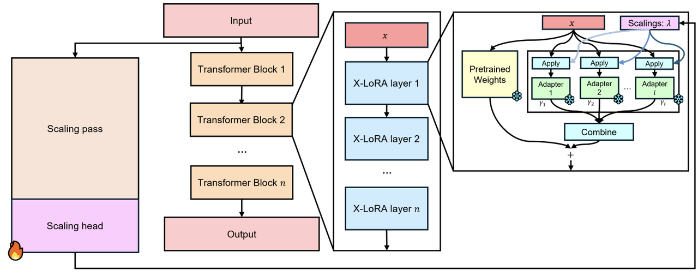

* **核心代码：参考代码**：PEFT/src/peft/tuners/xlora/layer.py

```python
class XLoraLayer:
    def apply_scalings_to_x(x: torch.Tensor, scalings_layer: torch.Tensor, adapter: int) -> torch.Tensor:
        scalings = scalings_layer[:, :, adapter].unsqueeze(-1)
        return x * scalings

    def get_maybe_topk_scalings(self, scalings) -> torch.Tensor:
        xlora_scalings = scalings[:, :, self.layer_number, :]
        if self.config.top_k_lora is not None:
            _, topk_indices = torch.topk(xlora_scalings, k=self.config.top_k_lora, dim=-1)
            mask = torch.zeros_like(xlora_scalings, dtype=torch.bool)
            mask.scatter_(-1, topk_indices, True)
            xlora_scalings = xlora_scalings * mask.to(xlora_scalings.dtype)

        if self.config.enable_softmax_topk:
            nonzero_mask = xlora_scalings != 0
            softmax_res_nonzero = torch.softmax(xlora_scalings[nonzero_mask], dim=-1)
            xlora_scalings[nonzero_mask] = softmax_res_nonzero

        return xlora_scalings


class XLoraLinearLayer(XLoraLayer):
    def forward(self, x: Tensor, *args: Any, scalings: Optional[Tensor] = None, **kwargs: Any) -> Tensor:
        if not self.target.merged:
            for adaptera_n, active_adapter in enumerate(self.target.active_adapters):                
                lora_A = self.target.lora_A[active_adapter]
                lora_B = self.target.lora_B[active_adapter]
                dropout = self.target.lora_dropout[active_adapter]
                scaling = self.target.scaling[active_adapter]
                x = x.to(lora_A.weight.dtype)
                if scalings is not None:
                    x_mod = self.apply_scalings_to_x(x, xlora_scalings, adapter_n)
                    scaling_weight = self.config.global_scaling_weight
                else:
                    x_mod = x
                    scaling_weight = 1
                result += lora_B(lora_A(dropout(x_mod))) * scaling * scaling_weight

        result = result.to(previous_dtype)
        return result
```

**参考文献：**

\[1] LoRA: Low-Rank Adaptation of Large Language Models

\[2] LoRA+: Efficient Low Rank Adaptation of Large Models

\[3] Lora-fa: Memory-efficient low-rank adaptation for large language models fine-tuning

\[4] Adaptive budget allocation for parameter-efficient fine-tuning

\[5] DoRA: Weight-Decomposed Low-Rank Adaptation

\[6] X-LoRA: Mixture of Low-Rank Adapter Experts, a Flexible Framework for Large Language Models with Applications in Protein Mechanics and Molecular Design

***

