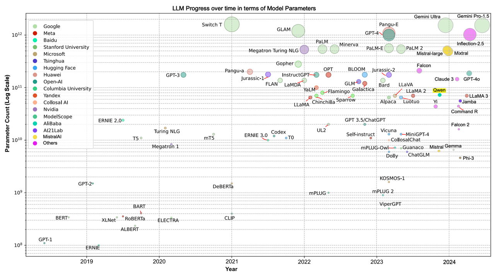

> 自从ChatGPT爆火后，LLM的研究如火如荼，海量模型扎堆涌现，在这其中以早期的**GPT、Llama、GLM**系列，后来的**Qwen、Deepseek**系列最为出名，也是使用最为广泛的模型系列
>
> 本章主要从**最早的BERT系列到GPT、Llama、Qwen、Deepseek系列来详解这些常见的模型，同时也是面试中经常会被问到的模型**

> **论文：Survey of different Large Language Model Architectures: Trends, Benchmarks, and Challenges**
>
> **链接：https://arxiv.org/pdf/2412.03220**

