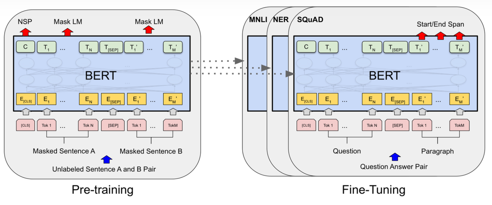
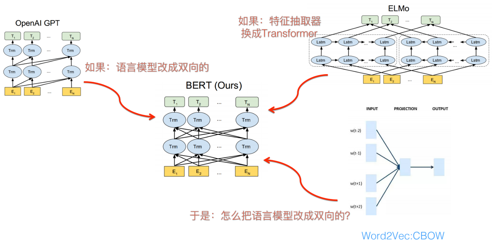
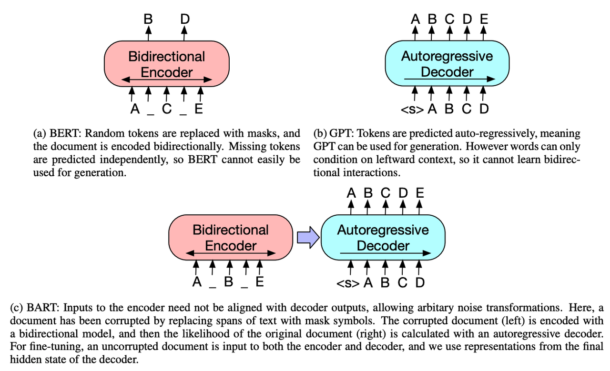
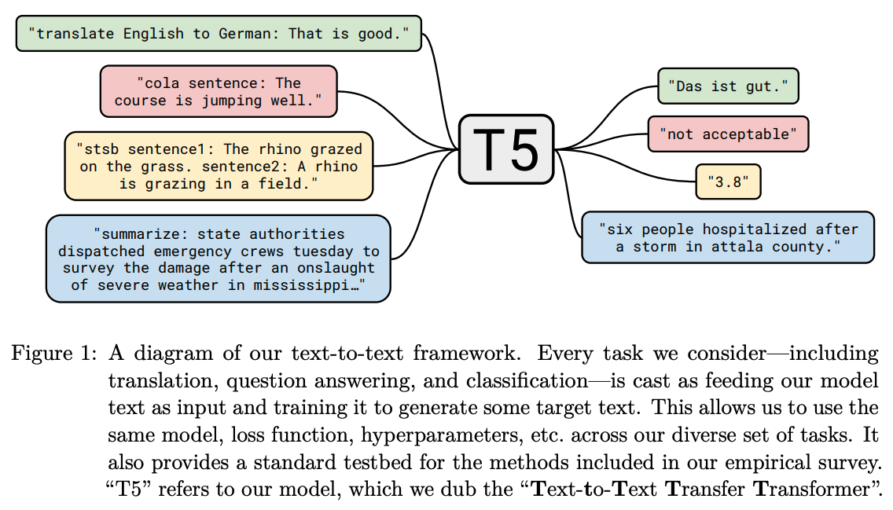
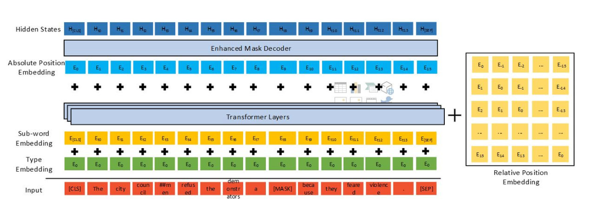
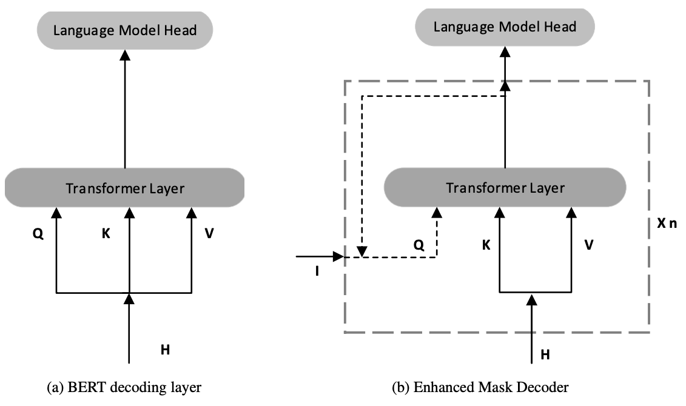

# **4.1.1 BERT**

> **Bidirectional Encoder Representation from Transformers，encoder-only**
>
> BERT主要是用来替代Word2Vec的预训练模型，通过**MLM和NSP两大预训练任务学习表征**，对于下游任务加上一个layer微调即可

> ### **BERT Embedding**
>
> BERT的输入的编码向量（长度是512）是3个嵌入特征的单位和，这三个词嵌入特征是：
>
> 1. **Position Embedding**：位置嵌入是指将单词的位置信息编码成特征向量，位置嵌入是向模型中引入单词位置关系的至关重要的一环；BERT直接去训练了一个position embedding，给每个位置词一个随机初始化的词向量，再训练
>
> 2. **Token Embedding**：上图的示例中‘playing’被拆分成了‘play’和‘ing’的token
>
> 3. **Segment Embedding**：用于区分两个句子，例如B是否是A的下文（对话场景，问答场景等）。对于句子对，第一个句子的特征值是0，第二个句子的特征值是1

> ### **Masked LM (MLM)&#x20;**
>
> 在将单词序列输入给 BERT 之前，每个序列中有 15％ 的单词被 `[MASK]` token 替换。 然后模型尝试基于序列中其他未被 mask 的单词的上下文来预测被掩盖的原单词。在BERT的实验中，15%的WordPiece Token会被随机Mask掉。在训练模型时，一个句子会被多次喂到模型中用于参数学习，但是Google并没有在每次都mask掉这些单词，而是在确定要Mask掉的单词之后，80%的概率会直接替换为`[Mask]`，10%的概率将其替换为其它任意单词，10%的概率会保留原始Token。
>
> 1. **80% 的 tokens 会被替换为 \[MASK] token**：是 Masked LM 中的主要部分，**可以在不泄露 label 的情况下融合真双向语义信息**；
>
> 2. **10% 的 tokens 会称替换为随机的 token** ：因为**需要在最后一层随机替换的这个 token 位去预测它真实的词，模型并不知道输入对应位置的词汇是否为正确的词汇（ 10%概率），这就迫使模型更多地依赖于上下文信息去预测词汇，并且赋予了模型一定的纠错能力，因而也能够让 BERT 获得更好的语境相关的词向量（这正是解决一词多义的最重要特性**）；
>
> 3. **10% 的 tokens 会保持不变但需要被预测**：这样能够给模型一定的 **bias ，相当于是额外的奖励，将模型对于词的表征能够拉向词的 真实表征**

> ### **Next Sentence Prediction (NSP)&#x20;**
>
> 在 BERT 的训练过程中，模型接收成对的句子作为输入，并且预测其中第二个句子是否在原始文档中也是后续句子
>
> 1. 在训练期间，50％ 的输入对在原始文档中是前后关系，另外 50％ 中是从语料库中随机组成的，并且是与第一句断开的。
>
> 2. 在**第一个句子的开头插入 `[CLS]` 标记，表示该特征用于分类模型，对非分类模型，该符号可以省去，在每个句子的末尾插入 `[SEP]` 标记，表示分句符号，用于断开输入语料中的两个句子**。
>
> **优点：**&#x42;ERT使用了**双向Transformer提取特征**，使得模型能力大幅提升；添加了两个预训练任务, MLM + NSP的多任务方式进行模型预训练.
>
> **缺点：**
>
> 1. 模型过于庞大, 参数量太多, 需要的数据和算力要求过高, 训练好的模型应用场景要求高；**更适合用于语言嵌入表达，语言理解方面的任务，不适合用于生成式的任务**
>
> 2. 因为Bert用于下游任务微调时， `[MASK]`标记不会出现，它只出现在预训练任务中。这就造成了预训练和微调之间的不匹配，微调不出现`[MASK]`这个标记，模型好像就没有了着力点、不知从哪入手。所以只将80%的替换为`[mask]`，但这也只是缓解、不能解决。
>
> 3. 相较于传统语言模型，Bert的每批次训练数据中只有 15% 的标记被预测，这导致模型需要更多的训练步骤来收敛

**GPT、BERT和ELMo的对比**

# **4.1.2 BART**

> **Bidirectional and Auto-Regressive Transformers**
>
> BART使用**标准的Transformer模型，encoder- decoder**，不过做了一些改变：
>
> * 同GPT一样，将ReLU激活函数改为GeLU，并且参数初始化服从正态分布N(0,0.02)
>
> * BART base模型的Encoder和Decoder各有6层，large模型增加到了12层
>
> * BART解码器的各层对编码器最终隐藏层额外执行cross-attention
>
> * BERT在词预测之前使用了额外的Feed Forward Layer，而BART没有
>
> BART比BERT更适合文本生成的场景；相比GPT，也多了双向上下文语境信息。在生成任务上获得进步的同时，它也可以在一些文本理解类任务上取得SOTA

**BERT, GPT, BART的区别**

# **4.1.3 T5**

> **Text-to-Text Transfor Transformer， encoder-decoder 架构**
>
> 预训练语言模型领域的通用模型，该模型的**基本思想是将所有自然语言问题都转化成文本到文本（“text-to-text”）的形式**，并用一个统一的模型解决，即**输入是带有任务前缀声明的文本序列，输出的文本序列是相应任务的结果**。具体到这个工作，主要考虑了**machine translation、question answering、abstractive summarization和text classification**四个任务，顺便贡献了个语料库C4（Colossal Clean Crawled Corpus）
>
> 对下游任务微调训练更友好，不需要做任何模型侧的改动，只需要对下游任务的训练数据做简单改写，就可以用T5完成相应的任务。训练方式采用和BERT一样的方法，但是**mask连续的三个词**，**只预测被mask的部分词，**&#x91CD;点还是**大量的数据，和更大的模型11B参数**

# **4.1.4 RoBERTa**

> **A Robustly Optimized BERT Pretraining Approach**
>
> 在**模型规模、算力和数据上**，与BERT相比主要有以下几点改进：
>
> * **更大的模型参数量**，模型使用 1024 块 V100 GPU 训练了 1 天的时间
>
> * **更大bacth size**，RoBERTa 在训练过程中使用了更大的bacth size。尝试过从 256 到 8000 不等的bacth size
>
> * **更多的训练数据，**&#x5305;括：CC-NEWS 等在内的 160GB 纯文本。而最初的BERT使用16GB BookCorpus数据集和英语维基百科进行训练
>
> **另外，RoBERTa在训练方法上有以下改进：**
>
> * **去掉下一句预测(NSP)任务**
>
> * **动态掩码，**&#x42;ERT 依赖随机掩码和预测 token。原版的 BERT 实现在数据预处理期间执行一次掩码，得到一个静态掩码。 而 RoBERTa 使用了动态掩码：每次向模型输入一个序列时都会生成新的掩码模式。这样，在大量数据不断输入的过程中，模型会逐渐适应不同的掩码策略，学习不同的语言表征。
>
> * **文本编码，**&#x42;yte-Pair Encoding（BPE）是字符级和词级别表征的混合，支持处理自然语言语料库中的众多常见词汇。原版的 BERT 实现使用**字符级别的 BPE 词汇**，大小为 30K，是在利用**启发式分词规则**对输入进行预处理之后学得的。而BART考虑用**更大的 byte 级别 BPE 词汇表来训练 BERT**，这一词汇表包含 50K 的子词单元，且没有对输入作任何额外的预处理或分词

# **4.1.5 DeBERTa**

> **Decoding-enhanced BERT with disentangled attention**
>
> DeBERTa 模型使用了**注意力解耦机制**和**增强的mask解码器**改进了 BERT 和 RoBERTa 模型，同时还引入了一种新的微调方法 **虚拟对抗训练** 以提高模型的泛化能力

> ### **注意力解耦机制**
>
> * 在BERT 中，输入层的每个单词都使用一个向量来表示，该向量是其单词（内容）嵌入和位置嵌入的总和
>
> * 而 DeBERTa 中的每个单词使用两个对其内容和位置分别进行编码的向量来表示，并且注意力单词之间的权重分别使用基于它们的内容和相对位置的解码矩阵来计算
>
> * 单词对的注意力权重不仅取决于它们的内容，还取决于它们的相对位置。 例如，“deep”和“learning”这两个词相邻出现时，它们之间的依赖性比它们出现在不同句子中时要强得多

> ### **增强的掩码解码器**
>
> * DeBERTa和BERT模型一样，也是使用MLM进行预训练的，在该模型中，模型被训练为使用 mask token 周围的单词来预测mask词应该是什么。 DeBERTa将上下文的内容和位置信息用于MLM。 解耦注意力机制已经考虑了上下文词的内容和相对位置，但没有考虑这些词的绝对位置，这在很多情况下对于预测至关重要。
>
> * 如：给定一个句子“a new store opened beside the new mall”，并用“store”和“mall”两个词 mask 以进行预测。 仅使用局部上下文（即相对位置和周围的单词）不足以使模型在此句子中区分store和mall，因为两者都以相同的相对位置在new单词之后。 为了解决这个限制，模型需要考虑绝对位置，作为相对位置的补充信息。 例如，句子的主题是“store”而不是“mall”。 这些语法上的细微差别在很大程度上取决于单词在句子中的绝对位置。
>
> * 有两种合并绝对位置的方法。 BERT模型在输入层中合并了绝对位置。 在DeBERTa中，微软在所有Transformer层之后将它们合并，然后在softmax层之前进行 mask token 预测。这样，DeBERTa捕获了所有Transformer层中的相对位置，同时解码被mask的单词时将绝对位置用作补充信息&#x20;

> ### **虚拟对抗训练**
>
> * 虚拟对抗训练是一种改进模型泛化的正则化方法。 它通过对抗性样本提高模型的鲁棒性，对抗性样本是通过对输入进行细微扰动而创建的。 对模型进行正则化，以便在给出特定于任务的样本时，该模型产生的输出分布与该样本的对抗性扰动所产生的输出分布相同
>
> * 对于之前的NLP任务，一般会把扰动应用于单词嵌入，而不是原始单词序列。 但是嵌入向量值的范围在不同的单词和模型之间有所不同。 对于具有数十亿个参数的较大模型，方差会变大，从而导致对抗训练有些不稳定
>
> * SiFT通过应用扰动的归一化词嵌入来提高训练稳定性，即在实验中将DeBERTa微调到下游NLP任务时，SiFT首先将单词嵌入向量归一化为随机向量，然后将扰动应用于归一化的嵌入向量
