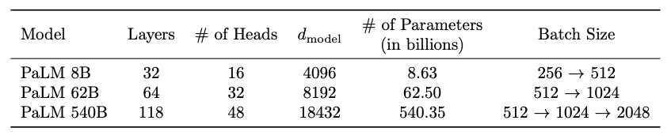
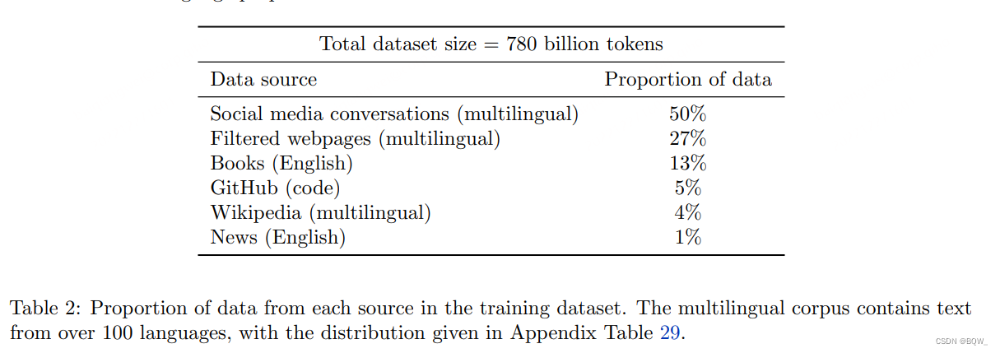
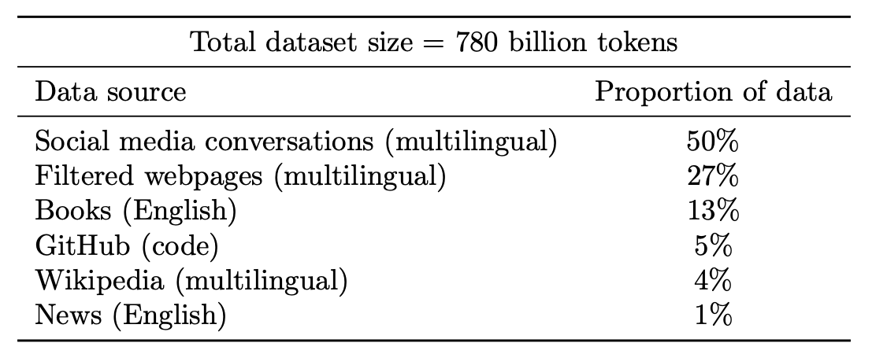
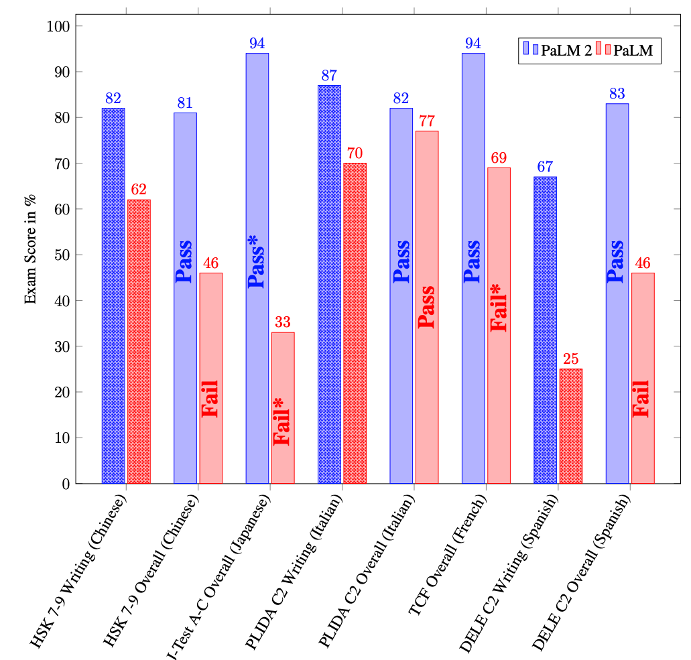
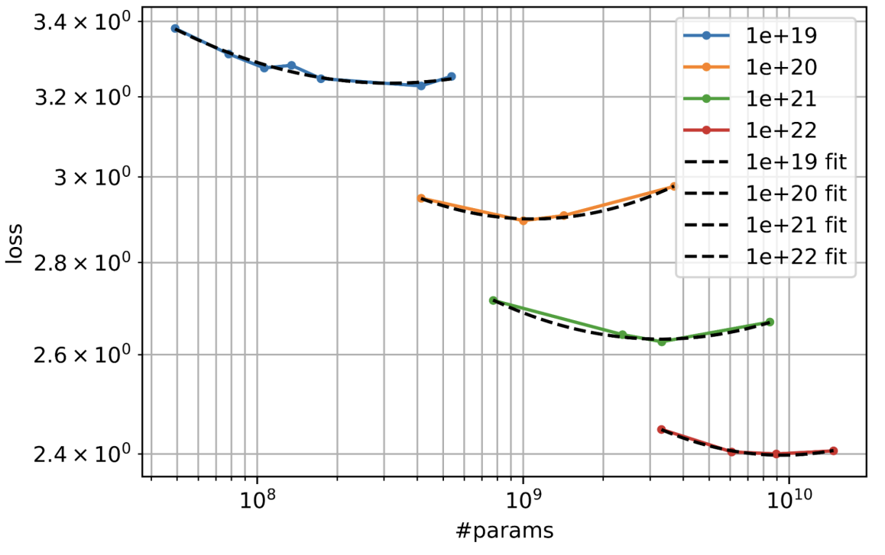
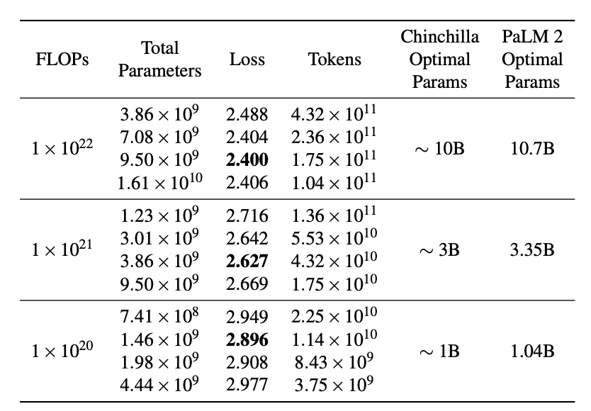
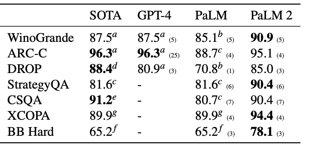
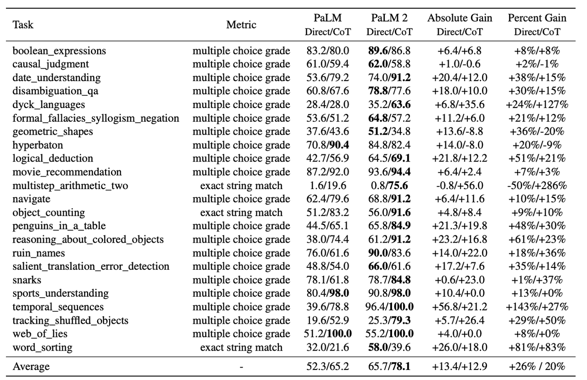

# **4.2.1 PaLM1**

**Pathways Language Model**

**论文：PaLM: Scaling Language Modeling with Pathways**

* **模型结构：**&#x50;aLM使用标准的 Transformer 模型架构只设置 Decoder-only 并做了以下修改:

  * **SwiGLU激活：**&#x46;FN部分更换为SwiGLU的结构

  * **并行层：**&#x6807;准的序列化表述为

    $$y = x + MLP(LayerNorm(x + Attention(LayerNorm(x))))$$

    PaLM使用**并行化的结构：**

    $$y = x + MLP(LayerNorm(x)) + Attention(LayerNorm(x))$$

  * **MQA、RoPE、共享输入输出embedding、去掉dense层和LN中的偏差项（提升训练稳定性）**

  * 使用SentencePiece训练得到256K大小的词表，对于数字切分总是切分为单个（例如，"123.5 → 1 2 3 . 5"）

  

* **训练数据集：**

* **训练设置**

  * **权重初始化：**&#x6838;心权重(除了embedding和layer norm scales)都使用"fan-in variance scaling"初始化，即 $$W\sim\mathcal{N}(0,1/\sqrt{n_{in}})$$ 是核的维度。输入embedding使用 $$E ∼ N ( 0 , 1 ) $$初始化，因为layer normalization不应用在embedding层。因为输入和输出的embedding层共享，将softmax之前的logits使用 $$\frac{1}{\sqrt{n}}$$进行缩放，其中n是embedding的尺寸

  * **优化器：**&#x4F7F;用Adafactor优化器进行训练。这相当于带有"参数缩放"的Adam，其通过参数矩阵的均方根来缩放学习率。因为权重初始化与  $$\frac{1}{\sqrt{n}}$$成正比，其类似于手动缩小Adam的学习率。然而，参数缩放的优点是，在不同尺度上操作的参数矩阵的学习率不会以相同的速率缩减

  * **优化超参数：**&#x5728;前10000个step，Adafactor的学习率为  $$10^{-2}$$，然后会以  $$\frac{1}{\sqrt{k}}$$的比率进行衰减，k kk是step数量。训练的momentum为 $$\beta_1 = 0.9，$$。二阶距插值的计算为 $$\beta_2=1-k^{-0.8}$$ ，其中k是step数量。实验发现相比于标准的 $$\beta_2=0.99$$，在训练大模型时会更加稳定。对于所有模型使用值为1.0的全局范数梯度裁剪。在训练时使用  $$lr^{2}$$ 的动态权重衰减，其中lr是当前的学习率

  * **损失函数：**&#x6A21;型使用标准的语言模型损失函数，其是一个不使用标签平滑的所有token的对数概率平均值。此外，额外使用了辅助损失函数 $$Z_{loss} = 10^{-4}log^2{Z}$$来鼓励softmax标准化接近0，其可以增加训练的稳定性。

  * **序列长度：**&#x6240;有模型都使用2048的序列长度。输入样本被拼接在一起，然后被划分为精确的2048个tokens，所以也不需要padding的token，但是样本可能会被从中间分开。输入样本之间使用特殊的token \[eod] 来区分开

  * **Batch size：**&#x5BF9;于所有的模型，在训练时增加batch size。在50k step之前使用的batch size为512，在115k步骤之前则使用的batch size为1024，在训练完成的255k step之前则使用2048的batch size。较小的模型遵循类似的方案。使用这种batch size调度的方法主要原因有2个：(1) 较小的batch size在训练早期样本效率更高；(2) 更大的batch size会带来更大的矩阵乘法维度，其增加TPU效率

  * **Dropout：**&#x6A21;型在训练时不使用dropout，虽然在大多数微调时使用0.1的dropout

# **4.2.2 PaLM2**

**论文：PaLM 2 Technical Report**

* **模型结构：**&#x6280;术报告没说

* **预训练数据配比：**&#x50;aLM2采用了**UL2的思想**(UL2是谷歌尝试的一种与GPT-3、PaLM不同的大语言模型路径，参考DataLearner关于UL2的模型卡信息：[https://www.datalearner.com/ai-models/pretrained-models/UL2](https://link.zhihu.com/?target=https%3A//www.datalearner.com/ai-models/pretrained-models/UL2) ），使用了不同的预训练目标的混合，以训练模型理解语言的不同方面，多语言能力很强

* **Scaling law**

简略来说就是他们用了4个不同规模的模型与参数样本做同样方法的训练，通过loss评估最佳结果，看曲线可以看出来差不多是一个等比关系。

* **Downstream metric evaluations**

进一步探究 $$1∗10^{22} $$ FLOPs计算成本下选择最佳参数数量和训练令牌数量的影响，见下表，阔以看到在Loss最小（2.400）时，Parameters、Token的关系，进一步阐述

炼丹炉和炼丹材料的最适大小关系。

* **Reasoning**

着重讨论了LLM在数学和科学工程问题上的一些痛点，所以对PaLM 2对这方面问题有做出专门的调整以优化这一块的性能。

