> **Open and Efficient Foundation Language Models，**&#x76EE;前主流的开源大模型(Dense)基本上都是LLaMA架构，并在此基础上做各种改动

# **4.4.1 LLaMA1**

> **论文：LLaMA: Open and Efficient Foundation Language Models**
>
> ### **模型结构**
>
> 相比GPT做出来如下改动
>
> * 为了增强训练稳定性，采用**pre-RMSNorm**作为层归一化方法
>
> * 为了提高模型性能，采用**SwiGLU**作为激活函数
>
> * 为了更好地建模长序列数据，采用**RoPE**作为位置编码
>
> * 为了更好地编码数据，Llama-1使用**BPE**算法进行分词，具体由**sentencepiece进行实现**。值得注意的是，Llama-1将**所有数字分解为单独的数字，并对未知的UTF-8字符回退到字节进行分解，词表大小为32k**

> ### **训练方式**
>
> 基础的**自监督学习模型**，**没有**经过**任何形式的特定任务微调**
>
> * Llama-1在公布的技术报告中详细描述了使用**AdamW优化器**的机器学习模型的具体训练配置。AdamW是对Adam优化器的改进，可以更有效地处理权重衰减，从而提高训练的稳定性。β1和β2参数的选择影响训练过程的收敛行为和稳定性
>
> * Llama-1描述的**余弦学习率调度**是一种有效的技术，用于在训练期间调整学习率，通过逐渐减少学习率在某些情况下可以导致更好的收敛。实施**0.1的权重衰减和1.0的梯度裁剪是预防过拟合和确保数值稳定性的标准做法**
>
> * **warmup**是一种策略性方法，旨在训练过程初期稳定训练动态。根据模型大小调整学习率和batch是一种优化资源分配和效率的实用方法，有可能提高模型性能

> ### **训练数据**
>
> 海量无标注数据进行自监督学习 1.4T token，这些预训练数据由多个来源混合而成，且都是公开的数据，各个来源的数据量和采样比例见右表👉

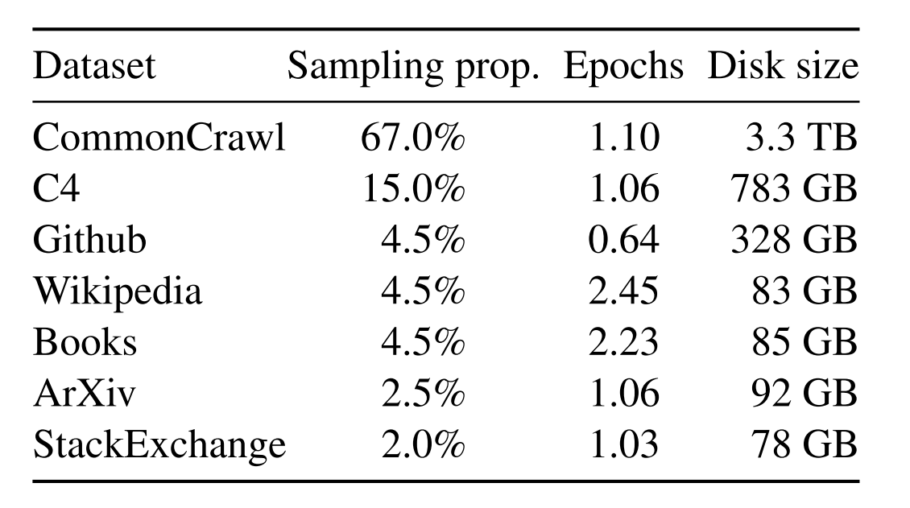

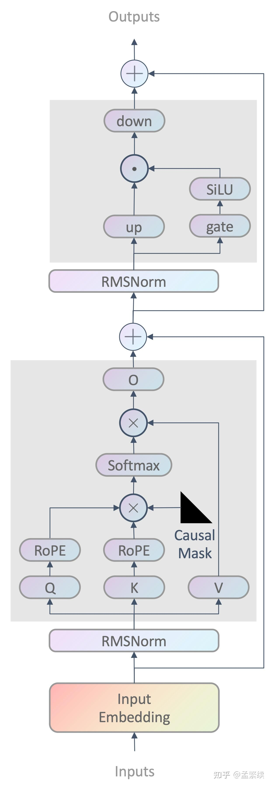

# **4.4.2 Llama2**

> **论文：Llama 2: Open Foundation and Fine-Tuned Chat Models**
>
> ### **模型结构**
>
> * 跟LLaMA1相比大参数模型**多了GQA**，整体参数量会有减少
>
> * **FFN模块矩阵维度有扩充，**&#x589E;强泛化能力，整体参数量增加
>
> * 其他区别体现在**更多的训练数据、更长的上下文窗口达到了4K**，LLaMA1是2K
>
> ### **训练数据**
>
> Llama-2 预训练使用了来自公开可用源的 2T个数据token（未详细指出具体的开源数据）。以下是个人想法：meta 在文章中提到开始时使用公开数据做SFT，后来使用自有的标注数据。显然公开数据更多更丰富。但是meta提到“quality is all you need”，所以他们还是选择了自己标注数据。**所以meta觉得不好的数据影响很大，不如只有少量好的。后来作者发现不同的数据源和数据标注供应商，会显著影响下游微调结果，这一点更加突出了数据检查的重要性**

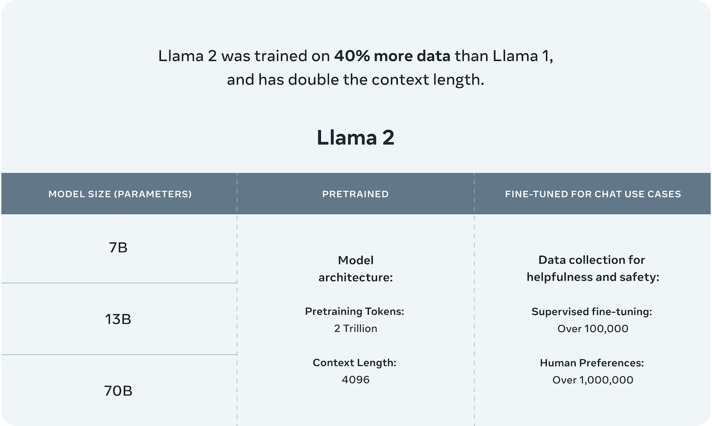

> ### **训练过程**
>
> 通过结合人类反馈和**拒绝采样**，模型能够更有效地利用稀缺的高质量数据，最大化训练的效率和效果

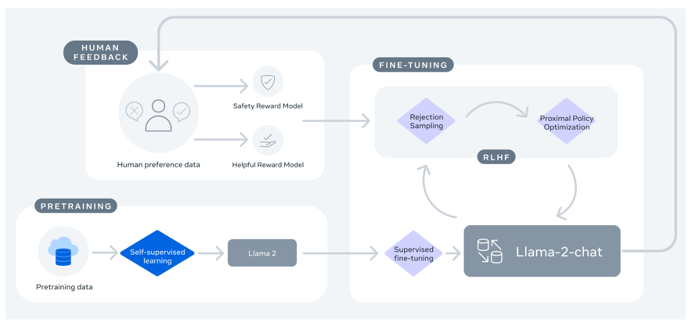

> **Reject Sampling 拒绝采样**
>
> * RS是一种从目标概率分布中获取样本的基本蒙特卡洛方法，主要用于在难以直接从目标分布采样时，通过一个更容易采样的提议分布来间接获取目标分布的样本。假设我们想要从一个复杂的目标概率分布中采样，但是直接对采样很困难。可以选择一个比较简单的提议分布，这个提议分布通常是比较容易采样的，比如均匀分布、正态分布等
>
> * 在LLM这里通常是**模型对同一个prompt生成K个response，然后利用Reward Model对这些答案进行评分**，挑选出得分最高、表现最优的答案。这一过程不仅提升了模型的生成质量，也为模型的进一步训练提供了优质样本

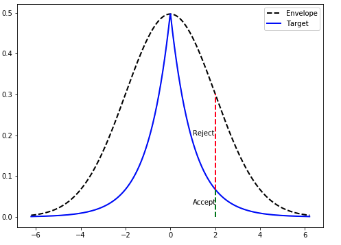

> ### **后训练总结**
>
> * **SFT阶段：**&#x53;FT阶段不应该停留太久，标注员的能力往往不高，写出来的东西也一般。一般一万个样本就足以让模型达到标注员的水平。
>
> * **奖励模型语料的构建方式：**
>
>   * **数据最好要从自己的模型中来**（不管是自己的7b、13b还是34b，这些模型pretrain数据肯定基本一致）这个其实很容易理解，奖励模型终归是要去提升自己的模型，而标注数据其实很有限，如果你提供的数据都是一些GPT4的输出，那奖励模型也只能知道GPT4的哪种输出更好，而我们自己的模型输出对它而言其实是分布外的数据，效果很难调好
>
>   * **对不同大小的模型做不同（temperature等）的采样，再让人工标注**
>
>   * **训练是迭代进行的！不是一劳永逸的：**&#x8FD9;一点非常重要，由于奖励模型的训练语料都是当前阶段的模型产生的，那么奖励模型很可能只能知道怎么提升当前模型的一小步，因此需要不断的迭代标注。从这一点上看，RLHF更像是一个宏观层面上的梯度下降算法。Llama2里一共迭代了5次，每次效果都有大幅度的提升
>
> * **是否使用PPO等强化学习算法并没有不重要：**&#x4C;lama2里，前四次迭代都是简单的BoN，只有最后一次才是PPO，其实说明了RLHF是一个生成式模型人工对齐的优化思想，重要的是HF，而不是RL

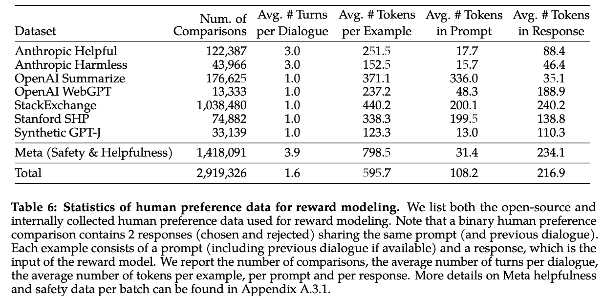

# **4.4.3 CodeLlama**

**CodeLlama：**&#x57FA;于Llama-2训练的领域模型

**论文：Code Llama: Open Foundation Models for Code**

* **训练流程：**

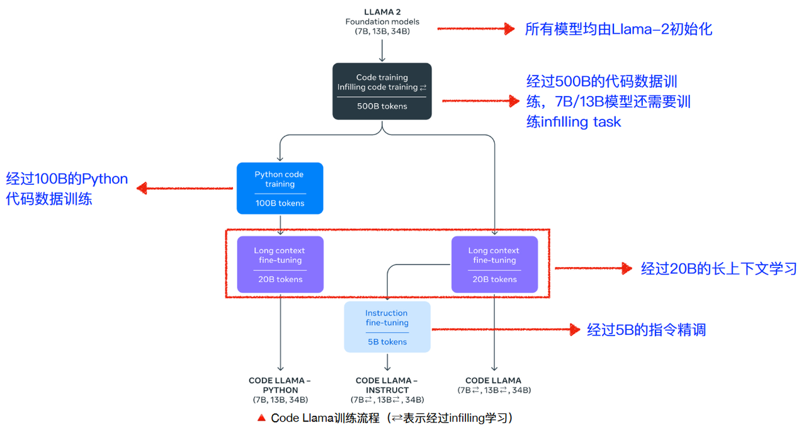

* **CodeLLaMA7B，13B模型的infilling task，任务目标：**&#x6839;据代码的上下文，预测残缺部分的代码

  * 从完整的代码中选择一部分进行掩码（mask）并替换为`<MASK>`符号，构成上下文

  * 利用自回归的方法，根据上下文信息预测解码出被mask的代码部分

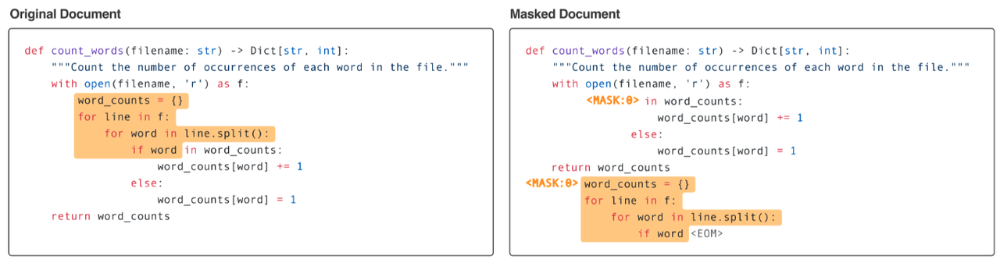

# **4.4.3 Llama3**

> **论文：The Llama 3 Herd of Models**
>
> **包含Llama3和Llama3.1两个系列，不过差别不大，多一些多语言、长文本和toll use，论文主要结果是3.1**

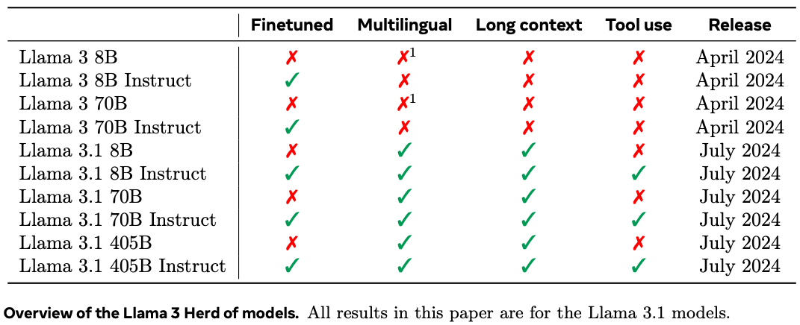

> ### **模型结构**
>
> * 与LLaMA2相&#x6BD4;**，**&#x4C;LaMA3将**tokenizer由sentencepiece换成了tiktoken**，这与GPT4 保持一致，**词表大小由32k扩展到了128k**
>
> * LLaMA&#x33;**&#x20;8B和70B都采用了GQA**
>
> * **同时上下文长度也扩展到了8k（一开始，预训练后期用多阶段长文本训练达到了128K）**

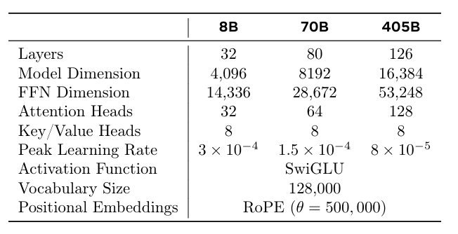

|             | **Training Data**                           | **Params** | **Context length** | **GQA** | **Token count** |
| ----------- | ------------------------------------------- | ---------- | ------------------ | ------- | --------------- |
| **Llama 3** | A new mix of publicly available online data | 8B         | 8k                 | Yes     | 15T+            |
|             |                                             | 70B        | 8k                 | Yes     |                 |

> * **训练数据：**&#x7CBE;心设计了预训练语料库，数量&质量，扩展到了**15T Tokens**，增长了约8倍。其中，**代码数据扩充了4倍，显著提升了模型在代码能力和逻辑推理能力方面的表现。**&#x503C;得注意的是，LLaMA-3并没有采用MOE（Mixture of Experts）结构，这种结构主要用于降低训练和推理成本，但在性能上通常无法与同规模的密集型（Dense）模型相比。随着模型规模的扩大，如何降低推理成本将成为一个需要关注的问题。此外，LLaMA-3的训练数据包括了**大量的代码token和超过5%的非英语token，来源于30多种语言**。这不仅使得模型在处理英语内容时更加高效，也显著提升了其多语言处理能力。为确保数据质量，Meta开发了**一系列数据过滤pipeline，包括启发式过滤器、NSFW过滤器、语义重复数据删除技术及用于预测数据质量的文本分类器**。这些工具的有效性得益于先前版本Llama的表现，特别是在识别高质量数据方面。此外，Meta通过大量实验**评估了在最终预训练数据集中混合不同来源数据的最佳策略**，确保Llama-3能在多种场景下展现卓越性能，如日常琐事、STEM 领域、编程和历史知识等

> ### **训练流程**
>
> Llama-3系列也有两个模型——**预训练模型Llama-3和微调后的模型Llama-3-Instruct**
>
> * **预训练阶段：**&#x4E3A;了有效地利用预训练数据，Llama-3投入了大量精力来扩大预训练。具体而言，通过为下游基准测试制定一系列**扩展法则（scaling laws）**，使得在训练之前就能预测出模型在关键任务上的性能，进而选择最佳的数据组合
>
>   **整体流程：**&#x31;）初始预训练，2) 长上下文预训练，3) 退火（Annealing）
>
> * **后训练阶段：监督式微调（SFT）、拒绝采样、RLHF和直接策略优化（DPO）的组合进行多轮对齐**。**用于SFT的提示质量和用于PPO和DPO的偏好排名对对齐模型的性能有巨大影响。LLaMA3在模型质量上的一些最大改进来自于仔细筛选这些数据，并对人类标注者提供的多轮质量保证进行多次审查**

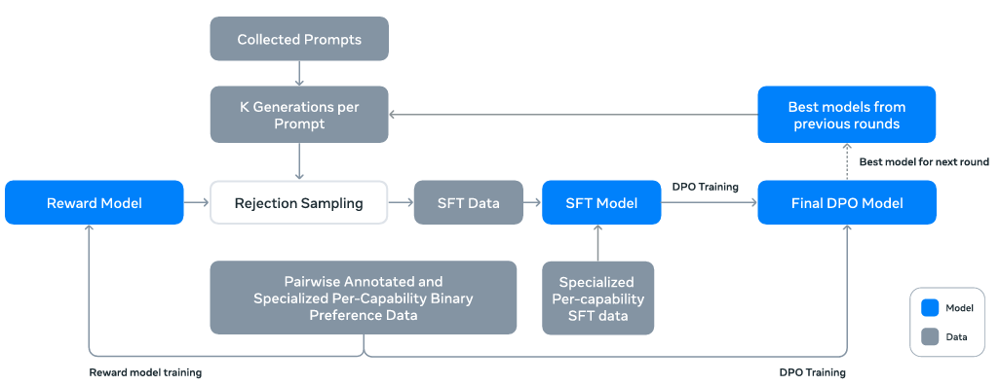

> 1. 【reward model】在预训练模型的基础上，使用人类标注的偏好数据来训练一个奖励模型。这个模型的目标是评估生成的文本是否符合人类的期望
>
> 2. 【SFT】使用奖励模型对人类标注的提示进行筛选（拒绝采样），选择最优的输出。结合这些筛选出的数据和其他数据源（包括合成数据），使用标准的交叉熵损失函数对预训练语言模型进行微调
>
> 3. 【DPO】在 SFT 微调后的模型基础上，使用最新的人类偏好数据进行进一步训练，以更好地符合人类反馈。DPO 特别关注于提高模型遵循指令的能力
>
> 4. 【**模型平均化**】对在每个奖励模型（RM）、监督式微调（SFT）或直接偏好优化（DPO）阶段使用不同版本数据或超参数获得的模型权重进行平均化处理。结合了多个模型的预测结果，以期望获得比单一模型更稳定和可靠的输出。**模型平均化还有助于减少模型对特定训练样本的过度拟合，因为它考虑了来自不同训练集的多个模型的观点。这可以提高模型在面对新数据时的泛化能力**

> ### **LLaMA3对DPO的改进**
>
> * **在DPO loss中mask格式化的token：**&#x5305;括标题和终止token，以稳定DPO训练因为他们观察到，这些token对损失的贡献可能导致模型行为不理想，例如尾部重复或突然生成终止token。假设这是由于DPO损失的对比性质——在**chosen和reject response中存在共同token导致学习目标冲突**，因为**模型需要同时增加和减少这些token的概率**
>
> * **使用NLL损失进行正则化：加一个chosen response的负对数似然loss(NLL loss)进行正则化**，loss系数为0.2，有助于通过保持生成的期望格式并防止选择response的对数概率下降，来进一步稳定DPO训练
