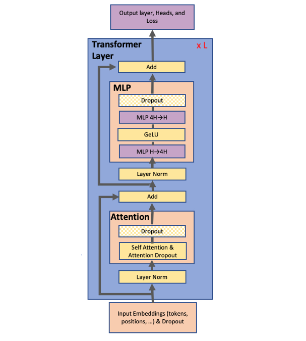
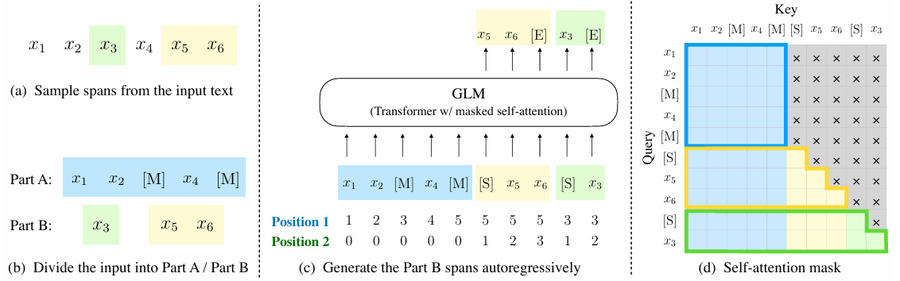
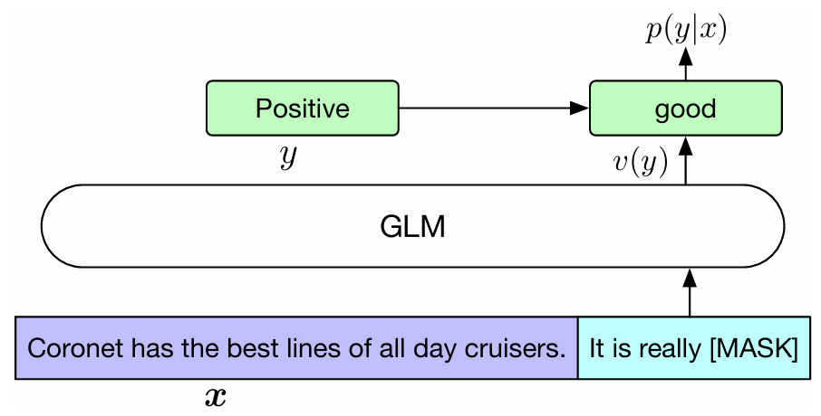
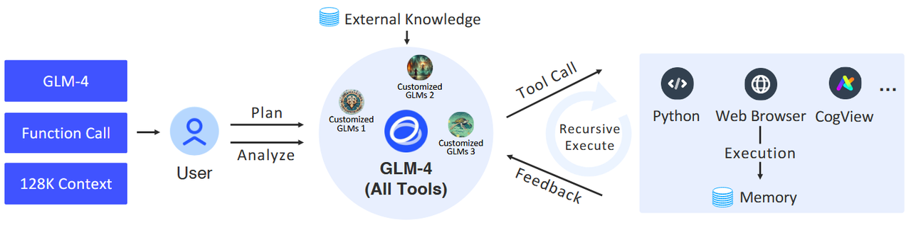
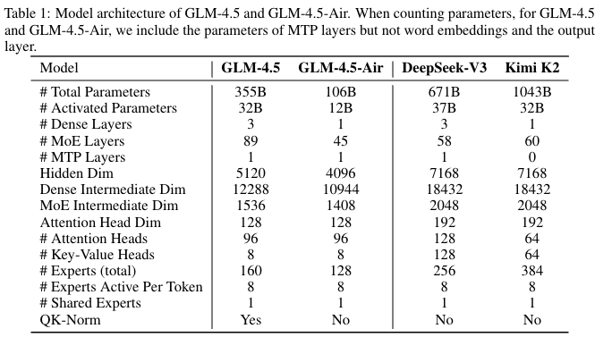
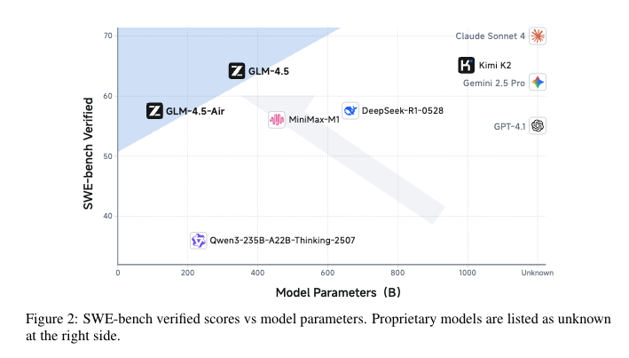
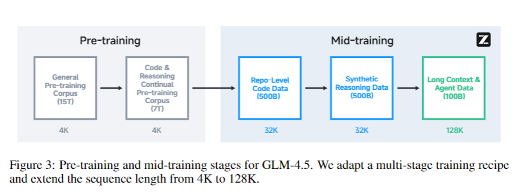

# **4.5.1 GLM1**

**论文：GLM：General Language Model Pretraining with Autoregressive Blank Infilling**

> ### **模型结构**
>
> GLM1是**prefix-decoder结构的Transformer**（实际上就是transformer decoder，只不过通过特殊的mask实现了prefix部分双向attention，后面的部分单向attention），然后做了一些改动：
>
> * **Pre Deep Norm**
>
> * 用一个单层线性层用来output token预测
>
> * ReLU --> **GeLU 激活函数**
>
>

> ### **GLM训练目标**

> ### **自回归填空**
>
> 这个任务包含了下面两个思想：
>
> * **自编码思想：**&#x5728;输入文本中，随机删除连续的tokens
>
> * **自回归思想：**&#x987A;序重建连续tokens，在使用自回归方式预测缺失tokens时，模型既可以访问corrupted文本，又可以访问之前已经被预测的spans
>
> **核心是span shuffling + 二维位置编码技术：**
>
> * 通过**改变缺失spans的数量和长度**，自回归空格填充目标可以为条件生成和无条件生成任务预训练语言模型
>
> * 输入$$x$$可以被分成两部分：**Part A是被mask的文本corrupt** ，**Part B由masked spans组成**。假设原始输入文本是 $$[x_1,𝑥_2,𝑥_3,𝑥_4,𝑥_5,𝑥_6]$$，采样的两个文本片段是 $$[𝑥_3]$$以及 $$[𝑥_5,𝑥_6]$$，那么mask后的文本序列是： $$𝑥_1,𝑥_2,[𝑀],𝑥_4,[𝑀]$$，即Part A；同时我们需要对Part B的片段进行shuffle，每个片段使用`[S]`填充在开头作为输入，使用`[E]`填充在末尾作为输出
>
> * **二维位置编码：**&#x5728;GLM中，使用二维位置编码，第一个位置id用来标记Part A中的位置，第二个位置id用来表示span内部的相对位置，这两个位置id会通过embedding表被投影为两个向量，最终都会被加入到输入token的embedding表达中
>
> * GLM中自定义attention mask的：
>
>   * **Part A中的tokens彼此可见，但是不可见B中的任意tokens(对应prefix部分是双向attention)**
>
>   * **Part B tokens可见Part A，Part B tokens可见B中过去的tokens，不可见B中未来的tokens（对应B中的是masked attention/casual attention）**
>
> * 模型可以**自动学习双向encoder（Part A）以及单向decoder（Part B）**

> ### **多任务预训练**
>
> 生成更长文本与空白填充目标共同优化
>
> * **Doc-level 文档级：**&#x4ECE;原始长度的 50% - 100% 范围内均匀采样一个span，该目标旨在生成长文本
>
> * **Sentence-level 句子级：**&#x9650;制被mask的span必须是完整的句子，采样多个span以覆盖原始token的 15%（和BERT的15%一致），这个目标适用于 seq2seq（序列到序列）任务，这些任务的预测结果通常是完整的句子或段落

* **GLM做分类任务示例：**

# **4.5.2 GLM2**

**GitHub：https://github.com/THUDM/ChatGLM2-6B**

**模型结构**

* 完全**Decoder-only**，**RoPE**，Gelu-->**SwiGLU**，**Pre-RMSnorm**

* **MHA->MQA**，实现更高效的推理

* 更长的上下文（基于**FalshAttention**，2K->32K），并在对话阶段使用8K上下文训练

**训练目标**

* ChatGLM2-6B 使用了 GLM 的混合目标函数，经过了 1.5T 中英标识符的预训练与人类偏好对齐训练

> ### **为什么prefix-decoder回归casual-decoder？**
>
> * **多轮对话用prefix-decoder需要构造多个数据来训练，而decoder-only的casual mask可以直接用整个多轮对话数据**，等效且各个对话的权重不一样，这个改动导致了二维编码的去除
>
>   在处理多轮对话的过程中,设有3轮对话,Q1A1，Q2A2，Q3A3，PrefixLM需要构建三条样本:
>
>   * Q1->A1
>
>   * Q1A1Q2->A2
>
>   * Q1A1Q2A2Q3->A3
>
>   **Decoder-only利用casual mask的性质在一条样本里面实现多轮对话**：
>
>   * 样本构建:Q1 A1 Q2 A2 Q3 A3
>
>   * Loss计算:只需要计算 A1 A2 和 A3 部分
>
> * LLaMA架构展现出decoder-only架构的强大的自回归生成能力

# **4.5.3 GLM3**

> **GitHub：https://github.com/THUDM/ChatGLM3**
>
> * **模型结构：**&#x43;hatGLM2与ChatGLM3模型架构是完全一致的，ChatGLM与后继者结构不同。相对于ChatGLM，ChatGLM2、ChatGLM3模型上的变化：
>
>   * 词表的大小从 ChatGLM 的150528缩小为65024 （是ChatGLM2、3加载比ChatGLM快不少）
>
>   * **位置编码从每个GLMBlock一份提升为全局一份**
>
>   * SelfAttention之后的前馈网络有不同：ChatGLM用GeLU做激活；ChatGLM2，3用SwiGLU做激活

# **4.5.4 GLM4**

**技术报告：ChatGLM: A Family of Large Language Models from GLM-130B to GLM-4 All Tools，链接：https://arxiv.org/pdf/2406.12793**

> ### **模型结构**
>
> * **除了QKV，其余部分都移除了bias：**&#x63D0;升训练速度，且长度外推性得到一定提升
>
> * **RMSNorm、SwiGLU、RoPE：**&#x7ECF;典三件套
>
> * **GQA：**&#x47;QA 减少了 MHA 的参数量，所以 FFN 的隐藏层维度增加到了原来的 10/3

> ### **预训练**
>
> * **数据来源：**&#x4E0D;同来源的**多语言（主要是英语和中文）**&#x6587;档组成，包括**网页、维基百科、书籍、代码以及研究论文**
>
> * **数据处理：**&#x53BB;重、筛选和分词
>
>   * **去重阶段：去除重复或相似的文档来提高数据的多样性**，采用了**精确去重和模糊去重两种方式**
>
>   * **筛选阶段：**&#x9488;对网页的筛选去除包含**冒犯性语言、占位符文本、源代码等噪声的文档来提高数据质量**
>
>   * **分词阶段：**&#x9884;训练数据中的 token 数量直接影响模型的训练速度。采&#x7528;**&#x20;BBPE** 分别训练中文和多语言词表，然后和与 tiktoken 的 cl100k\_base 分词器词表合并成一个大小为15万的统一词表。最终的训练中不同来源的数据重新赋予权重，增加书籍和维基百科等高质量和教育性来源的权重。预训练使用了10T token
>
> * **长文本：**&#x901A;过**位置编码扩展以及长文本继续预训练、长文本对齐**来扩展到 1M 上下文
>
>   > 感兴趣长文本对齐的可以看看这篇论文：**LongAlign: A Recipe for Long Context Alignment of Large Language Models**

> ### **对齐训练**
>
> **对齐训练/后训练**用来让大模型输出与人类的偏好保持一致，例如**了解人类意图，指令遵循和多轮对话**
>
> * **SFT：真实的人类的 prompt 和交互**，比基于模板或模型生成的 response 对对齐质量更加重要（这一点打一个问号，现在的gpt、claude、gemini、grok这些系列的强模型生成质量都很好）
>
> * **RLHF：**&#x53;FT 在很大程度上使 base model与人类的偏好保持一致，但RLHF可以进一步帮助缓解 **响应拒绝、安全、多语种混合以及多轮连贯性**等问题。对齐数据标注维度：**安全性，事实，相关性，帮助性和人类偏好**

> ### **ChatGLM 技术**
>
> GLM4 和 GLM4 All Tools都使用了以下技术来训练和对齐：
>
> 1. **Emergent Abilities of LLMs（**&#x4E0D;算是一个技术？**）：**&#x4E0D;同模型尺寸和训练 token 数的LLM 如果预训练 loss 相同，下游任务性能一致，某些任务比如 MMLU 和 GSM8K 只有预训练 loss 降低到一定程度才可能有效果（比随机选择好）
>
> 2. **LongAlign：**&#x4C;ongAlign: A Recipe for Long Context Alignment of Large Language Models
>
> 3. **ChatGLM-Math：**&#x4F7F;用**自我评价**，而不是外部模型或手动注释来选择数据。Chatglm-math: Improving math problem-solving in large language models with a self-critique pipeline
>
> 4. **ChatGLM-RLHF：**&#x8BB2;了很多关于 Reward Model 训练的trick，强烈推荐阅读。Chatglm-rlhf: Practices of aligning large language models with human feedback
>
> 5. **Self-Contrast：**&#x5229;用 **target LLM 自生成的大规模负样本**进行RLHF对齐，减少昂贵的人工标注。Extensive self-contrast enables feedback-free language model alignment
>
> 6. **AgentTuning：**&#x5F00;发了 AgentTuning 框架，**构建了 AgentTuning 指令微调数据集，其中包含高质量的 agent与环境的交互轨迹**。Agenttuning: Enabling generalized agent abilities for llms
>
> 7. **APAR：**&#x4E3A;了提高LLM生成层次结构化 response 的推理速度，GLM 提出了 **auto-parallel auto-regressive APAR 生成方法**，利用指令微调训练 LLM 来规划（并行）生成过程并执行APAR生成。Apar: Llms can do auto-parallel auto-regressive decoding
>
> 8. **一些benchmarks：**&#x41;gentBench、LongBench、HumanEval-X

> GLM4 All Tools 被训练来自主理解用户意图，规划复杂的指令，并调用一个或多个工具（例如Web浏览器，Python解释器和 image-to-text 模型）以完成复杂的任务

# **4.5.5 GLM4.5**

**技术报告：GLM-4.5: Agentic, Reasoning, and Coding (ARC) Foundation Models，链接：https://arxiv.org/pdf/2508.06471**

> ### **基础信息**
>
> * **核心定位：**&#x805A;焦**智能体能力（Agentic）、推理（Reasoning）和编码（Coding）的开源 MoE 模型**，支持**混合推理模式（思考模式用于复杂任务，直接响应模式用于即时任务）**
>
> * **参数规模：**
>
>   * **GLM-4.5：**&#x603B;参数 355B，激活参数 32B
>
>   * **GLM-4.5-Air：**&#x603B;参数 106B，激活参数 12B

> ### **模型架构**
>
> **MoE 架构，通过优化模型深度与宽度的平衡、注意力机制及专家路由策略，提升训练与推理效率，同时增强推理能力**
>
> 1. **深度优先设计：**&#x5BF9;比 DeepSeek-V3、Kimi K2，**GLM-4.5 系列减少模型宽度（隐藏维度和专家路由宽度），增加层数（MoE 层更多），实验表明更深的模型推理能力更优**
>
> 2. **注意力机制优化：**
>
>    * 采&#x7528;**&#x20;GQA 结合部分 RoPE**
>
>    * **注意力头数量提升至 96 个（隐藏维度 5120）**，没有降低训练 loss，但显著提升 MMLU、BBH 等推理基准性能
>
>    * 引&#x5165;**&#x20;QK-Norm&#x20;**&#x7A33;定 attention logits 的范围（GLM-4.5有，Air没有）
>
> 3. **MoE 与 MTP 层：**
>
>    * 采用**无损失平衡路由（loss-free balance routing） 和 sigmoid 门控机制分配专家**
>
>    * **加入一层 MoE 作为 MTP（Multi-Token Prediction）层**，支持推理时的投机解码（speculative decoding），提升效率
>
> 4. **参数效率：**&#x5728;总参数远低于竞品（Kimi K2 的 1043B）的情况下，通过激活参数的优化配置（32B），实现与大参数模型相当的性能

> ### **预训练（pre-training）**
>
> 1. **预训练数据来源：网页数据**（英文和中文网页为主）、**社交媒体**（补充实时性、互动性内容）、**书籍与论文**（提供系统性知识，如数学、科学领域）、**代码仓库**（GitHub 等），总共 23T token
>
> 2. **预训练数据处理：**
>
>    * **网页数据质量控制：**&#x53C2;考 Nemotron-CC 分质量桶，优先采高质量桶、弃最低质桶；用 **SemDedup&#x20;**&#x5904;理 MinHash 无法去重的模板相似网页
>
>    * **多语言数据处理：**&#x5229;用质量分类器评估文档的 “教育价值”，优先采高质量数据
>
>    * **代码数据处理：**&#x89C4;则过滤后，**利用质量模型将其分三级**，仅留并优先采高质量代码，**应用 Fill-In-the-Middle&#x20;**&#x76EE;标；对含代码的网页，经**标签识别、分类器筛选、质量评估**后保留，用细粒度解析器保留格式内容
>
>    * **数学与科学数据处理：大模型按教育内容占比评分，训练分类器预测评分，优先采高分文档**
>
> 3. **预训练阶段：**
>
>    * **第一阶段：**&#x4EE5;**通用网页文档为主**，基础语言能力
>
>    * **第二阶段：优先采样 GitHub 源代码、与编码 / 数学 / 科学相关的网页数据**，专业领域能力
>
> ### **中期训练（mid-training）**
>
> **目标：**&#x901A;过**中等规模的领域特定数据集（含指令数据）**，强化模型在**复杂推理、代码工程、长上下文理解及智能体交互等核心能力**，**弥补预训练阶段通用数据的局限性**
>
> 1. **代码仓库级训练（Repo-level Code Training）**
>
>    * 整合同一代码仓库的多个文件，学习跨文件依赖关系，提升软件工程能力
>
>    * 纳入 GitHub 的 issues、PRs 和 commits，强化真实开发场景适配
>
>    * 将**训练序列长度从 4K 扩展至 32K，以容纳大型代码仓库内容**
>
> 2. **合成推理数据训练（Synthetic Reasoning Data Training）**
>
>    * 收集数学、科学、编程竞赛相关的问答数据，**并用推理模型生成详细推理过程**
>
>    * 通过**合成数据增强模型在多步骤逻辑推导、公式推导等复杂任务中的表现**
>
> 3. **长上下文与智能体训练（Long-context & Agent Training）**
>
>    * 进一步**扩展序列长度至 128K**，优先采样预训练语料中的长文档，强化长文本理解能力
>
>    * 引入**大规模合成智能体轨迹数据**，提升模型与外部工具、环境的交互能力（如网页浏览、多步工具调用）

> ### **后训练（post-training）**
>
> #### **SFT**
>
> 分冷启动 SFT（基础能力初始化）和整体 SFT（蒸馏专家模型能力，平衡推理与直接响应模式）

