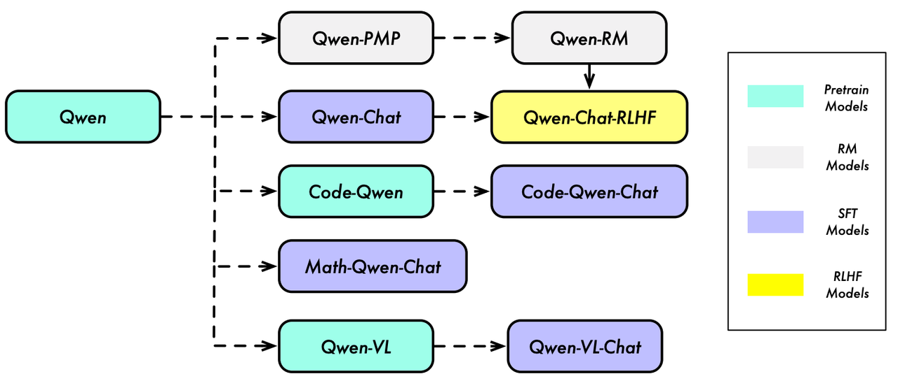
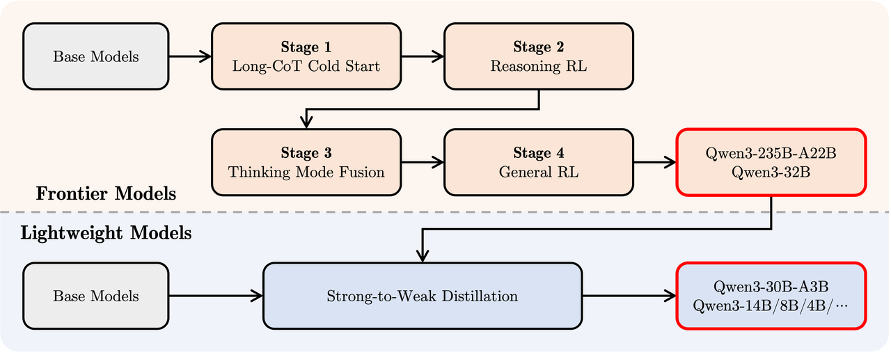
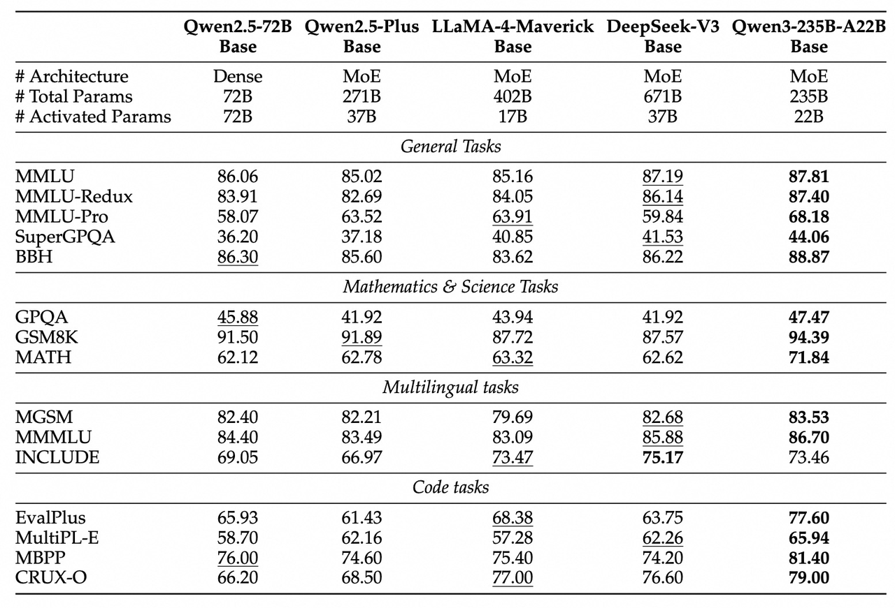

# **4.6.1 Qwen1**

**论文：QWEN TECHNICAL REPORT**



> ### **模型结构**
>
> 基于Transformer改进，类似LLaMA结构
>
> * tiktoken BPE，选择词汇表 cl100k base 作为起点扩充词汇表，同时将数字拆分为单个数字，**最终词汇表大小约为 152K**
>
> * **Untied Embedding：**&#x49;nput embedding和Output embedding不进行权重共享，是单独的两个权重矩阵，但是代价是**增加了内存消耗，不过可以显著提升模型的性能**
>
> * **RoPE**位置编码，**Pre-RMSNorm**，**SwiGLU**激活函数
>
> * 在**大多数层移除偏执bias，但在注意力的 QKV 层中保留**，以增强模型的外推能力。通过添加偏差项，可以更好地捕捉输入数据的特征，从而提升模型在处理未知或未见数据时的表现。这种增强外推能力的做法对于处理复杂任务和应对多样化的数据输入非常重要

> ### **模型训练**
>
> * 采用**标准的自回归语言模型训练目标**
>
> * **训练时上下文长度为2048，为了构建批次数据，对文本内容进行随机打乱及合并，再讲其截断到指定长度**
>
> * 注意力模块采用**Flash Attention**技术，以提高计算效率并减少内存使用
>
> * 使用**BF16**混合精度加速训练
>
> * 优化器采用AdamW，超参数 $$β1、β2$$和$$ϵ$$为别为0.9、0.95和1e−8
>
> * 采用余弦学习率计划，学习率会衰减到峰值的10%

> ### **上下文长度（外推能力）扩展**
>
> 通过**动态NTK插值**、**LogN-Scaling和分层窗口Self-Attention等技术**，有效地扩展了模型的上下文长度，同时保持了性能
>
> * **动态NTK插值：参考1.5.5章长度外推优化[ 1.5 Positional Encoding 位置编码](https://kcnd4kn8i6ap.feishu.cn/wiki/UWrpwhKWhigc5DkOqRGcBRLInzb?fromScene=spaceOverview#share-ApCLdjJtzokEWyxWhD1c8531nWs)**
>
> * **LogN-Scaling：**&#x6839;据**熵不变性**以及一些合理的假设，可以得到一个新的缩放因子，从而得到一种Scaled Dot-Product Attention，LogN-Scaling可以根据上下文长度与训练长度的比值，对Q和V的点积进行重新缩放，确保注意力值的熵随着上下文长度的增长而保持稳定
>
>   $$\text{Attention}(Q, K, V) = \text{softmax} \left( \frac{\kappa \log n}{d} QK^{\top} \right) V $$
>
> * **分层窗口Self-Attention：**&#x4F7F;用分层窗口Self-Attention，将注意力限制在一个上下文窗口内，防止模型关注到太远的内容；在不同层采用不同的窗口大小，较低的层使用较短的窗口，而较高的层使用较长的窗口
>
> **综合上述技术，Qwen预训练长度2048，推理的时候可以处理8192**

> ### **Reward Model训练**
>
> * **预训练偏好模型（preference model pretraining）：**&#x5956;励模型由**同等大小Qwen模型+池化层**得来，用特殊的句子结束标记经过池化层的映射值作为模型奖励值
>
> * **微调奖励模型：**
>
>   * 分类系统：为确保prompt具备一定的多样性和复杂性，创建了一个包含约6600详细标签的分类系统
>
>   * 平衡采样：并采用了一种平衡采样算法，以在选择提示时兼顾多样性和复杂性
>
>   * 多样性采样：为了生成多样的回复，实验过程使**用了不同规模和采样策略的 Qwen 模型**，因为多样化的回复有助于降低标注难度并提高奖励模型的性能

# **4.6.2 Qwen1.5**

**论文：没有发正式的技术报告，有两篇官方的介绍blog，https://qwenlm.github.io/zh/blog/qwen1.5/，https://qwenlm.github.io/zh/blog/qwen1.5-32b/**

> ### **模型结构**
>
> * **Tokenizer BPE、PreRMSNorm、SwiGLU、RoPE：**&#x9EC4;金四件套
>
> * **Attention：**&#x7EE7;续使&#x7528;**&#x20;Flash Attention**，并且实现的时候用到了 `torch.nn.functional.scaled_dot_product_attention`即 **SDPA Attention&#x20;**&#x7684;实现函数。（**只有Qwen1.5-32B用了GQA**）
>
> * **其他结构改动：Embedding和输出层不进行参数共享**（`tie_word_embedding=false`），延续 Qwen1 只在 QKV 参数里面加 bias
>
> * **Qwen1.5-MoE-A2.7B（2.7B激活参数）：**
>
>   * **细粒度专家：**&#x5C06; **FFN 切分为多个部分，每个部分是一个独立的专家**
>
>   * **初始化：**&#x5229;用 Qwen-1.8B进行改造初始化，然后**引入随进性加快收敛**
>
>   * **routing机制：四个共享专家 + 60个 routing 专家（每次激活四个）**

```python
# from https://github.com/huggingface/transformers/blob/ee339bad01bf09266eba665c5f063f0ab7474dad/src/transformers/modeling_utils.py#L1264
def tie_weights(self):
    """
    Tie the weights between the input embeddings and the output embeddings.

    If the `torchscript` flag is set in the configuration, can't handle parameter sharing so we are cloning the
    weights instead.
    """
    if getattr(self.config, "tie_word_embeddings", True):
        output_embeddings = self.get_output_embeddings()
        if output_embeddings is not None:
            self._tie_or_clone_weights(output_embeddings, self.get_input_embeddings())

    if getattr(self.config, "is_encoder_decoder", False) and getattr(self.config, "tie_encoder_decoder", False):
        if hasattr(self, self.base_model_prefix):
            self = getattr(self, self.base_model_prefix)
        self._tie_encoder_decoder_weights(self.encoder, self.decoder, self.base_model_prefix)

    for module in self.modules():
        if hasattr(module, "_tie_weights"):
            module._tie_weights()
```

> ### **模型训练**
>
> 数据量没有公布，**偏好对齐部分 PPO 和 DPO 都用到了**。全系列支持 32K 上下文，还提供了 AWQ 和 GPTQ 的量化模型（包括 int4 和 int8）

# **4.6.3 Qwen2**

**论文：QWEN2 TECHNICAL REPORT**

**模型结构**

> * 与Qwen的区别**GQA、YaRN+双块注意力（Dual Chunk Attention, DCA）**
>
>   * **YARN见1.5.5章长度外推优化[ 1.5 Positional Encoding 位置编码](https://kcnd4kn8i6ap.feishu.cn/wiki/UWrpwhKWhigc5DkOqRGcBRLInzb?fromScene=spaceOverview#share-ApCLdjJtzokEWyxWhD1c8531nWs)**
>
>   * **DCA见1.3.6章DCA(Dual Chunk Attention)[ 1.3 Attention 注意力](https://kcnd4kn8i6ap.feishu.cn/wiki/SUHDwvtwLiyigUkbMk5c49sPnHW?fromScene=spaceOverview#share-Q7KQdD8OLo4zRoxu6KLcj9YznGh)**
>
> * Tokenizer BBPE，151643词表大小
>
> * SwiGLU、RoPE、QKV bias、RMSNorm

**模型训练**

**预训练**

* **质量提升：**&#x8FC7;滤算法通过**额外的启发式**和**基于模型的方法**进行了改进，包括使用Qwen模型过滤掉低质量数据。此外，这些模型还被用于合成高质量的预训练数据

* **数据扩展：**&#x4E0E;Qwen1.5相比，**收集了更大容量的高质量代码、数学和多语言数据**，增强了模型在这些领域的能力。这个新数据集支持约30种语言，如英语、中文、西班牙语、法语、德语、阿拉伯语、俄语、韩语、日语、泰语和越南语等

* **分布改进：**&#x4E3A;确保模型学习类似于人类学习的分布，**在小规模的模型上进行实验，优化来自不同来源和领域的数据混合**

**后训练数据合成**

* **拒绝采样：**&#x5BF9;于数学或类似具有明确最终答案的任务，**应用拒绝采样来提高解决方案的质量**。偏好数据是通过对比正确和错误的路径生成的

* **执行反馈：**&#x5BF9;于coding任务，LLMs被用来生成解决方案和相关的测试用例。**通过编译和执行这些解决方案来评估其有效性**，从而创建演示和偏好数据。这种方法也适用于评估指令跟随。对于每个具有约束的指令，例如长度限制，LLMs被任务生成一个Python验证函数，以确保响应符合指令要求

* **数据再利用：**&#x5728;文学写作任务中创建熟练的响应对于没有接受过专门培训的注释者来说是一个挑战。为解决这个问题，我们收集了高质量的公共领域文学作品，并使用LLMs开发具有不同细节级别的指令。这些指令与原始作品配对，作为demo数据

* **宪法反馈：**&#x43;onstitutional AI指的是指导LLMs根据预定义的原则集生成响应的过程。为确保遵守如安全和价值观等准则，构建了一个宪法数据集。该数据集规定了要遵循和避免的原则。它被用来指导LLMs生成符合或偏离这些准则的响应，作为演示和偏好数据的参考

**RLHF的训练过程**

**分为离线+在线两阶段**

* **离线训练阶段**，使用预先收集的偏好数据集进行DPO训练

* **在线训练阶段**，模型利用即时反馈的奖励模型不断改进其性能。**从当前策略模型中采样多个response，奖励模型选择最受欢迎和最不受欢迎的响应**，形成用于每个情节中DPO的偏好对。采用**在线合并优化器（Online Merging Optimizer）**&#x6765;减轻**对齐税，即与人类偏好对齐时模型性能下降的问题**


# **4.6.4 Qwen2.5**

**论文： Qwen2.5 Technical Report，https://arxiv.org/pdf/2412.15115**

> ### **模型系列**
>
> 包含 base 和 instruct 的 0.5B、1.5B、3B、7B、14B、32B和72B模型，MoE模型 Qwen2.5-Turbo 和 Qwen2.5-Plus

> ### **模型结构**
>
> * **SwiGLU、RoPE、QKV bias、RMSNorm、GQA + YaRN + DCA**，与Qwen2一致
>
> * Tokenizer BBPE，151643大小词表

> ### **预训练数据**
>
> 18T tokens的量级
>
> * **更精细的数据过滤：**&#x5229;&#x7528;**&#x20;Qwen2-Instruct 模型作为数据质量过滤器**，多维度分析、评估和打分训练样本，有效过滤低质量的样本。
>
> * **更优的数学与代码数据：**&#x52A0;入了 Qwen2.5-Math 和 Qwen2.5-Coder 的训练数据
>
> * **更高质量的合成数据：**&#x51;wen2-72B-Instruct 和 Qwen2-Math-72B-Instruct合成数据，并使用**专有奖励模型和 Qwen2-Math-RM-72B 模型进行严格的过滤**
>
> * **更合理的数据混合：**&#x4F7F;用 **Qwen2-Instruct 模型对不同领域的内容进行分类与平衡**。分析显示，像电子商务、社交媒体和娱乐等领域在互联网数据中占比过大，常包含重复、模板化或机器生成的内容。相比之下，**技术、科学和学术研究等领域虽然包含更高质量的信息，却常常被低估，对过度代表的领域进行下采样，对高价值领域进行上采样**

> ### **长文本预训练**
>
> Qwen2.5采用了两阶段的预训练方法：
>
> * 首先使用 4K token的上下文长度进行训练，在最终的预训练阶段，除 Qwen2.5-Turbo外，所有模型将**上下文长度从4K扩展到32K token**。同时，利用ABF技术将**RoPE的基础频率从10000提升到1000000**
>
> * 对于Qwen2.5-Turbo模型，经过四个阶段：**32K token、64K token、128K token，最终达到 256K token，RoPE的基础频率为10,000,000**。在每个阶段，训练数据包含40%的当前最大长度序列和60%的较短序列
>
> **渐进式的训练方法帮助模型平稳适应逐渐增加的上下文长度，同时保持其处理和泛化不同长度序列的能力**。此外应用 YARN 和 DCA 也使得长度进一步扩展，从而使Qwen2.5-Turbo能够处理最多 1M 个token，其他模型能够处理最多128K token

> ### **后训练**
>
> 总共 1M 示例数据，涵盖 SFT、DPO 和 GRPO
>
> 1. **长序列生成：**&#x6784;建 long response 数据集，并通过反向翻译技术从预训练语料中生成长文本数据的query，确保输出长度符合预期，并使用Qwen2过滤低质量的配对数据
>
> 2. **数学推理：**&#x5F15;&#x5165;**&#x20;Qwen2.5-Math 中的 CoT 数据**，采用**拒绝采样**保证高质量，结合奖励建模和带注解的答案，帮助模型生成逐步推理过程
>
> 3. **编程能力：**&#x6574;合了**Qwen2.5-Coder中的指令微调数据**。多个编程语言的**智能体协作**生成约40种编程语言的多样化、高质量的指令数据，然后进一步扩展数据集，通过合成来自**代码问答网站的示例**和从**GitHub收集的算法代码片段**，增加了编程指令的多样性。并利用多语言 sandbox 进行静态代码检查，通过自动化单元测试来验证代码的质量与正确性
>
> 4. **指令跟随：**&#x6784;建了基于代码的验证框架，模型在此过程中既生成指令也生成相应的验证代码，配合全面的单元测试进行交叉验证。通过基于执行反馈的拒绝采样方法，精心挑选训练数据，确保模型能够精准遵循指令
>
> 5. **结构化数据理解：**&#x5F00;发了一个包含传统任务（如**表格问答、事实验证、错误修正和结构理解**）和涉及**结构化及半结构化数据**的复杂任务的数据集。通过加入CoT，大大增强了模型从结构化数据中推理的能力，从而提高了在这些多样任务中的表现
>
> 6. **逻辑推理：**&#x5F15;入了来自多个领域的70000个新 query，这些 query 涵盖了**多项选择题、判断题和开放性问题**。模型通过演绎推理、归纳推理、类比推理等多种方式系统性地处理这些问题。通过迭代优化，剔除错误答案和有缺陷的推理过程，从而加强了模型的推理能力，确保其在逻辑推理任务中的高效表现
>
> 7. **跨语言迁移：**&#x4F7F;用翻译模型将高资源语言的指令翻译为多种低资源语言，从而生成对应的回答候选，并评估这些回答与原始回答的语义对齐情况，保证了响应在不同语言之间的逻辑结构和风格一致性
>
> 8. **鲁棒系统指令：**&#x901A;过构建**数百条通用系统提示词，确保了后训练阶段系统提示词的多样性和一致性**，评估表明模型在不同的系统提示词下仍能保持优异的表现和较小的方差，增强了模型的鲁棒性
>
> 9. **响应过滤：**&#x4F7F;用多种自动化注释方法进行响应评估，包括**专门的评论模型和多智能体协作评分系统**。所有响应都经过严格筛选，只有被所有评分系统认为完美的响应才被保留，从而保证了输出的高质量标准

# **4.6.5 Qwen3**

> Qwen3正式发布！这次涵盖了从 0.6B 到 235B 参数量的多种模型（dense or moe）。下面就具体来拆解一下这次Qwen3的技术细节。

## **模型结构**

> Qwen3 相较于 Qwen2 的主要结构变化在于 Attention 模块：
>
> * **引入了对 Query 和 Key 的 RMS Normalization。**
>
> * **Attention 内部线性层的偏置项变为可配置**
>
> * **滑动窗口的判断逻辑移到了初始化阶段**
>
> 其他的类如 `MLP`, `DecoderLayer`, `RotaryEmbedding`, 以及模型的主体框架 (`Qwen*Model`, `Qwen*ForCausalLM` 等) 在核心结构上保持了高度的一致性。

1. **Attention 层的线性投影 (Linear Projections in Attention Layer)**:

   > * Qwen2 的 Attention 层 (`Qwen2Attention`) 中的 `q_proj`, `k_proj`, `v_proj` 默认带有偏置 (bias=True)，`o_proj` 默认不带偏置 (bias=False)。
   >
   > * Qwen3 的 Attention 层 (`Qwen3Attention`) 中的 `q_proj`, `k_proj`, `v_proj`, `o_proj` 是否带有偏置由配置 `config.attention_bias` 控制。这是一个新增的可配置项。

**代码对比**

* **Query 和 Key 的归一化 (Query and Key Normalization)**:

  > * Qwen2 的 Attention 层没有对 Query (q) 和 Key (k) 进行额外的归一化。
  >
  > * Qwen3 的 Attention 层 (`Qwen3Attention`) 引入了 `q_norm` 和 `k_norm`，使用 `Qwen3RMSNorm` 对计算出的 Query 和 Key 在 head\_dim 维度上进行归一化。这是 Qwen3 结构上的一个显著变化。

**代码对比:**

* **RMSNorm 类的导入和使用**:

  > 虽然两个版本都使用了 RMSNorm，但 Qwen3 的代码明确地使用了 `@use_kernel_forward_from_hub("RMSNorm")` 装饰器，这可能意味着它优先尝试使用来自 Hub 的优化内核实现。Qwen2 也用了这个装饰器，但在代码组织上，Qwen3 将 `Qwen3RMSNorm` 类定义移到了文件的更前面。这主要影响实现细节或效率，而非核心结构逻辑。

**代码对比:** (类定义位置和装饰器)

* **Sliding Window Attention 处理逻辑**:

  > * 两个版本都支持滑动窗口注意力 (Sliding Window Attention)。但在 `Qwen3Attention` 的 `__init__` 方法中，对 `self.sliding_window` 属性的设置逻辑略有不同，明确检查了 `config.use_sliding_window`、`config.sliding_window` 是否存在以及 `layer_idx` 是否满足条件，然后才设置 `self.sliding_window` 的值。Qwen2 在 `forward` 方法内才进行类似的检查。这使得 Qwen3 的逻辑更集中在初始化阶段

**代码对比:**

## **预训练**

> ### **训练数据层面**
>
> 从 Qwen2.5 的 18T tokens 扩展到 36T tokens。
>
> 训练数据包含了更丰富的高质量内容，包括**代码、STEM领域知识、推理数据、书籍、多语言数据以及合成数据**（具体的合成方式可以等一波report）

> ### **训练策略层面**
>
> Qwen3 的预训练过程分为三个阶段：  &#x20;
>
> * **第一阶段**：在超过 30T tokens 的数据上进行预训练，上下文长度为 4K tokens。
>
> * **第二阶段**：通过增加知识密集型数据的比例（例如 STEM、代码和逻辑推理任务）来优化数据集。模型在此阶段额外训练了 5T tokens，以提升其推理能力。  &#x20;
>
> * **第三阶段**：使用高质量的长上下文数据来扩展模型的上下文长度至 32K tokens。这有助于模型更好地理解和处理长输入序列。  &#x20;

## **后训练**

> **四阶段后训练流程**
>
> 为了开发出能够进行逐步推理和快速响应的混合模型，Qwen3 采用了四阶段的后训练流程：  &#x20;
>
> * **长链式思考（Chain-of-Thought, CoT）冷启动**：使用多样化的长 CoT 数据对模型进行微调，涵盖数学、编码、逻辑推理和 STEM 等多个领域，旨在赋予模型基本的推理能力。  &#x20;
>
> * **基于推理的强化学习**：通过强化学习进一步提升模型的推理能力。  &#x20;
>
> * **思考模式融合**：将思考模式和非思考模式的能力进行融合。  &#x20;
>
> * **通用强化学习**：在超过 20 个领域任务上进行通用强化学习，进一步优化模型的性能。



## **模型效果**



