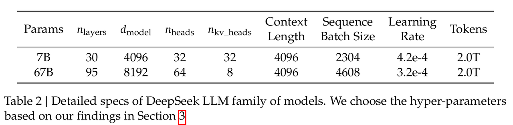
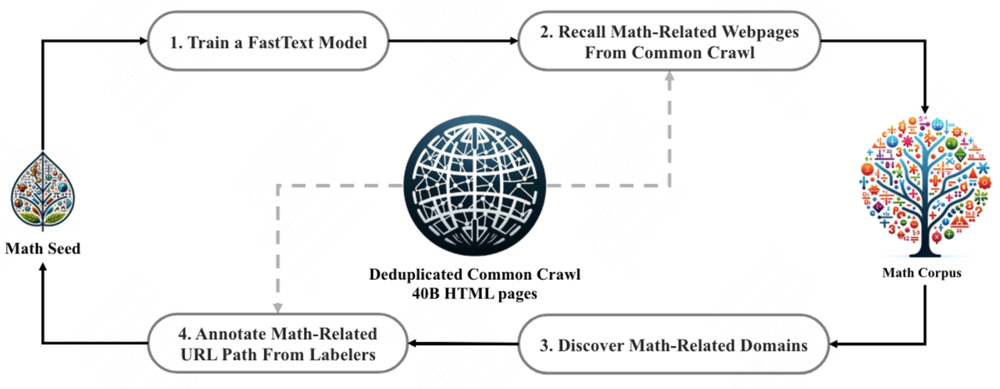
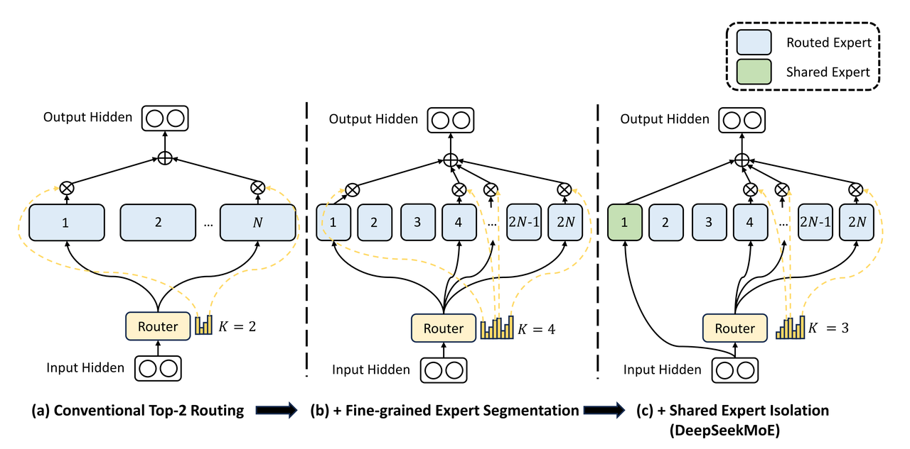
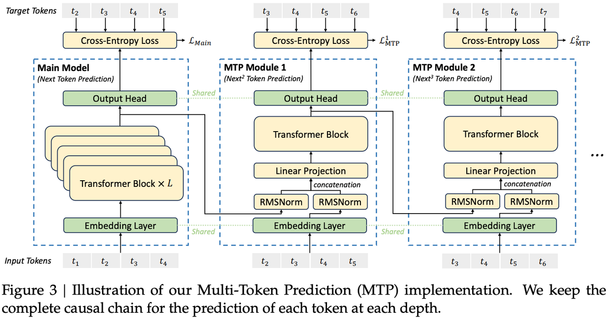
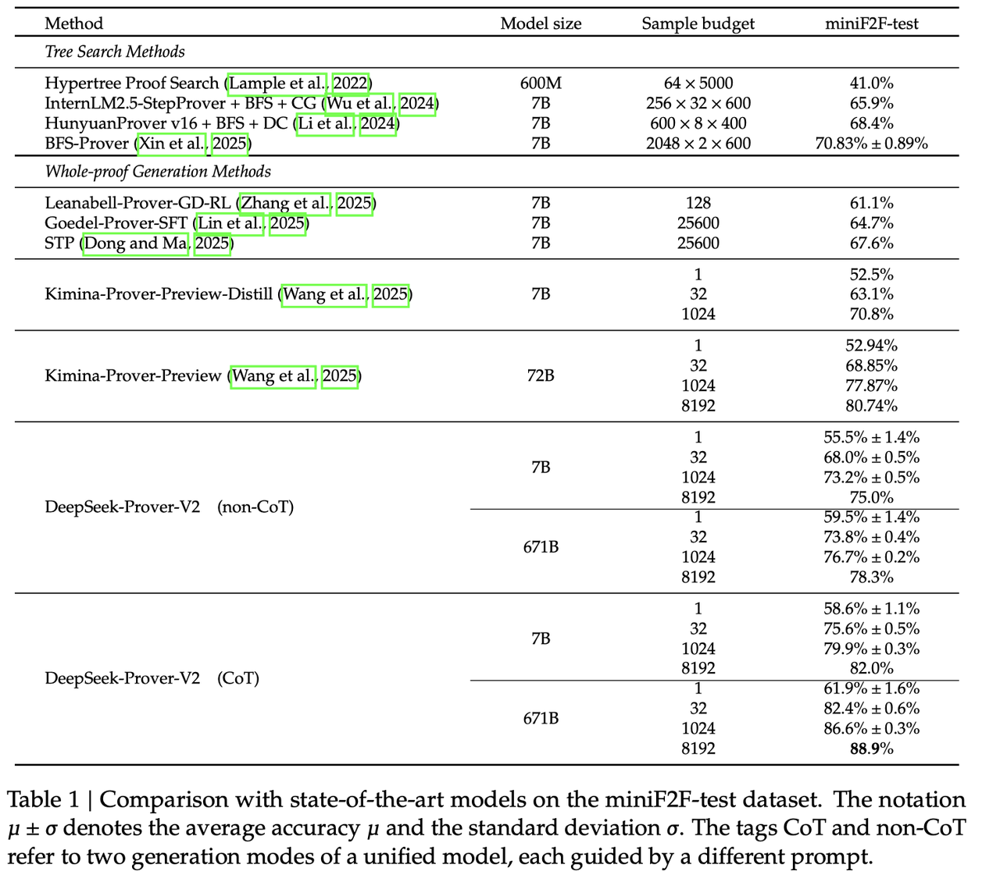

# **4.7.1 Deepseek-V1**

**论文：DeepSeek LLM: Scaling Open-Source Language Models with Longtermism**

**模型结构**

* **基于 LLaMA，采用 Pre-RMSNorm、SwiGLU和RoPE，67B 模型使用 GQA 优化推理成本，调**整了层数

* 使用 BBPE 算法进行分词，训练了约 24GB 的语料库，词汇表大小为 102400

**SFT训练**

* 收集了1.5M 的中英文指令数据

* 微调7B模型4 epochs，67B模型2 epochs，学习率分布为1e-5和5e-6

**DPO训练**

* 用自己的Deepseek Chat Models产生responses，进而构建偏好对

* Batchsize 512，lr 5e-6




**DeepseekV1具体参数**


# **4.7.2 Deepseek-math**

> 主要贡献包括**可扩展的数学预训练**，以及对**强化学习的探索和分析**。这里主要讲解一下**数据处理过程**

> ### **训练数据**
>
> **120B math tokens，从Common Crawl用fastText-based 分类器提取出的，多语言**
>
> Common Crawl该项目的目标是构建一个大规模的、公开可用的 web 爬虫数据集，以便研究人员、开发者和公众可以探索互联网上的信息

> ### **数据集收集和清洗过程**
>
> 1. **初始语料库：**
>
>    * 使用**OpenWebMath**作为初始种子语料库，包含高质量的数学网页文本。14.7B tokens的高质量数学网络文本数据集
>
>    * 训练fastText模型以召回更多类似OpenWebMath的数学网页从CC中
>
> 2. **训练fastText模型：**&#x6CE8;意熟悉一下其和 word2vec CBOW的区别
>
>    * 从种子语料库中随机选择50万个数据点作为正训练样本，从Common Crawl中选择50万个网页作为负样本
>
>    * 使用开源库进行训练，配置向量维度为256，学习率为0.1，最大词n-gram长度为3，最小词出现次数为3，训练轮数为3
>
> 3. **去重和召回：**
>
>    * 使用基于URL的去重和近似去重技术，将Common Crawl缩减为40B个HTML网页
>
>    * 使用fastText模型从去重后的Common Crawl中召回数学网页
>
> 4. **数据过滤和排名：**
>
>    * 根据fastText模型的分数对收集的页面进行排名，只保留排名靠前的页面。
>
>    * 通过预训练实验评估数据量，选择保留前40B个tokens
>
> 5. **迭代数据收集：**
>
>    * 识别和注释未收集的数学网页来源，丰富种子语料库，优化fastText模型
>
>    * 经过四轮数据收集，最终获得了3550万个数学网页，总计120B个tokens。在数学训练之前进行代码训练可以提高模型解决数学问题的能力，无论是否使用工具
>
> 6. **去污染：**
>
>    * 过滤掉包含英语和中文数学基准测试题目或答案的网页，避免基准污染。任何包含 10 克字符串的文本片段，如果与评估基准中的任何子字符串完全匹配，将从我们的数学训练语料库中删除。对于短于 10 克但至少为 3 克的基准文本，我们采用精确匹配来过滤掉受污染的网页



> ### **其他内容**
>
> **基座模型**： DeepSeek-Coder-Base-v1.5 7B，从一个code LLM开始是一个好选择
>
> **预训练**：
>
> 1. **数据量和分布：**&#x35;00B tokens， distribution of the data is as follows: 56% is from the DeepSeekMath Corpus, 4% from AlgebraicStack, 10% from arXiv, 20% is Github code, and the remaining 10% is natural language data from Common Crawl in both English and Chinese.
>
> 2. **参数设置：**&#x48;AI-LLM框架，AdamW，2000 warmup，4.2e-4，BS 10M tokens
>
> **指令微调**：
>
> 1. 数据：构建了一个数学指令调优数据集，涵盖了来自不同数学领域和不同复杂程度的中英文问题。问题的solution用COT、POT以及 tool-integrated reasoning形式提供，总大小 776K个样本
>
> 2. 训练：在 DeepSeekMath-Base 上训练，数据cat起来到4K tokens长度，BS 256， lr 5e-5，500步
>
> **强化学习过程**：GRPO，group size = 64，**GRPO详解见3.3.6章[ 3.3 RLHF 基于人类反馈的强化学习](https://kcnd4kn8i6ap.feishu.cn/wiki/TQqTwh2uwiSrqYktIPccTQOcn0g?fromScene=spaceOverview#share-SwVMdG5cPoR6hnxpgbjcNrWyn8d)**
>
> 有个指标，**&#x20;Pass@K，可以参考：**[大模型评估中Pass@k值是如何计算的-CSDN博客](https://blog.csdn.net/qiaotl/article/details/135066642)

# **4.7.3 Deepseek-V2**

**论文：DeepSeek-V2: A Strong, Economical, and Efficient Mixture-of-Experts Language Model**

> **DeepSeekMoE模型结构**

**Basic Architecture**

DeepSeekMoE有两个关键理念：

* 将**专家模块分割成更细的粒度**，以实现**更高程度的专家专业化**和更准确的知识获取

* **隔离一些共享专家模块，以减少被路由专家之间的知识冗余**

设$$u_{t}$$为第$$t$$个token的FFN输入，按如下方式计算FFN的输出 $$h_{t}'$$：

$$h_{t}'=u_{t}+\sum_{i = 1}^{N_{s}} FFN_{i}^{(s)}(u_{t})+\sum_{i = 1}^{N_{r}} g_{i,t} FFN_{i}^{(r)}(u_{t})
\\
g_{i,t}= \begin{cases}s_{i,t}, & s_{i,t} \in \text{Topk}(\{s_{j,t} | 1 \leq j \leq N_{r}\}, K_{r}) \\ 0, & \text{否则} \end{cases}
\\
s_{i,t}=\text{Softmax}_{i}(u_{t}^{T} e_{i})$$

其中$$N_{s}$$和$$N_{r}$$分别表示**共享专家的数量和路由专家的数量**；$$FFN_{i}^{(s)}(\cdot)$$和$$FFN_{i}^{(r)}(\cdot)$$分别表示第$$i$$个共享专家和第$$i$$个路由专家；$$K_{r}$$表示**激活的路由专家的数量**； $$g_{i,t}$$是第$$i$$个专家的门控值；$$s_{i,t}$$是token与专家的亲和度；$$e_{i}$$是该层中第$$i$$个路由专家的质心； $$\text{Topk}(\cdot, K)$$表示由为第$$t$$个token与所有路由专家计算出的亲和度分数中$$K$$个最高分数组成的集合

**Communication Balance Loss**

Device-Limited Routing 解决了设备上的数据分发不均衡的问题，但是在**数据接受侧，还是有可能出现极少数的设备接受大部分的数据从而导致通信阻塞**，所以在deepseekv2中又增加了一个通信平衡的loss，如下所示。其中，D是设备数，M是受限路由的设备数，系数 $$\frac{D}{M}$$ 也是为了保证loss不随设备数或者激活的expert对应的设备数的影响。**Device-Limited Routing机制保证每一个设备最多发送 MT 个`hidden states`，而Communication Balance Loss则保障每个设备大概接受送 MT 个hidden states**，从而实现设备级的负载均衡

$$\begin{aligned}\mathcal{L}_{\mathrm{CommBal}}&=\alpha_{3}\sum_{i=1}^{D}f_{i}^{\prime\prime}P_{i}^{\prime\prime},\\f_{i}^{\prime\prime}&=\frac{D}{MT}\sum_{t=1}^{T}\mathbb{1}(\mathrm{Token~}t\text{ is sent to Device }i),\\P_{i}^{\prime\prime}&=\sum_{j\in\mathcal{E}_{i}}P_{j},\end{aligned}$$

**&#x20;Device-Limited Routing**

**原因**：在采用专家并行处理时，被路由的专家会分布在多个设备上。每个token与MoE相关的通信频率和其目标专家覆盖的设备数量成正比。由于DeepSeekMoE采用了细粒度的专家分割，**激活的专家数量可能较多，若使用专家并行，MoE相关的通信成本会很高**

**具体方法**：对于每个token，不是简单地进行top$$K$$个被路由专家的选择。首先选择$$M$$个设备，这些设备中拥有与该 token 亲和度得分最高的专家。这里的亲和度得分用于衡量 token 与专家之间的匹配程度，得分越高说明越匹配。然后，在选定的这$$M$$个设备上的专家中进行top$$K$$专家的选择。通过这种方式，确保每个token的目标专家最多分布在$$M$$个设备上，从而限制了通信所涉及的设备范围，进而降低通信成本

**实际效果**：实际应用中发现，当$$M \geq 3$$时，设备受限路由能够实现与无限制的 top$$K$$专家选择路由大致相当的良好性能。也就是说，在有效控制通信成本的同时，不会显著降低模型的性能表现


**Token-Dropping Strategy**

尽管前面做了很多工作来达到负载均衡，但是这些工作都不能保证完全的负载均衡，因此deepseekv2还引入了设备级别的**token-drop**策略。

1. 首先，需要预先计算每个设备的平均计算预算

2. 其次，对每个设备实际分配到的token数按照路由分数降序排列

3. 最后，每个设备中超过平均计算预算的尾部token就被drop掉了，不参与该层的hidden states的计算


**Multi-Head Latent Attention(MLA)**

**KV Cache的低秩投影，具体参考1.3.5章[ 1.3 Attention 注意力](https://kcnd4kn8i6ap.feishu.cn/wiki/SUHDwvtwLiyigUkbMk5c49sPnHW?fromScene=spaceOverview#share-JMcJdub3dok0KExsw87csUoIn0c)**


* **模型训练：GRPO，具体参考3.3.6章[ 3.3 RLHF 基于人类反馈的强化学习](https://kcnd4kn8i6ap.feishu.cn/wiki/TQqTwh2uwiSrqYktIPccTQOcn0g?fromScene=spaceOverview#share-RUkadSON6obibSxBhK0cD4XlncL)**

# **4.7.4 Deepseek-V3**

**论文：DeepSeek-V3 Technical Report**

> ### **模型结构**
>
> 主要是**MoE结构的变化。**&#x76F8;比传统的 MoE 架构，DeepSeekMoE采用了**更细粒度的专家分配机制**，并**创新性地将部分专家设置为共享专家。**&#x44;eepSeek-V3通过**无辅助损失负载均衡机制、序列级辅助损失补充机制和节点约束路由机制**确保了计算与通信的近乎完全并行处理以及训练推理过程中**完整的 Token 保留**
>
> * **gate的计算从softmax改成了sigmoid：**&#x53EF;以类比为把分类改成多标签分类。之所以做这个变更是因为，从v2到v3，路由专家从160增加到256，而softmax是饱和式的激活函数，其会倾向于把分数尽量往0-1的两端拉，就会导致不同路由专家的分数缺乏区分度，从而使整个计算过程非常敏感，可想而知，路由专家的数量越多，这个问题越严重。不过总体的softmax改成了单个的sigmoid，不同的专家在gate这一层缺乏交互，整体上“竞争”机制会弱一些
>
>   $$\begin{aligned}&h_t^{\prime}=\mathbf{u}_{t}+\sum_{i=1}^{N_{s}}\mathrm{FFN}_{i}^{(s)}(\mathbf{u}_{t})+\sum_{i=1}^{N_{r}}\mathrm{g}_{i,t}\mathrm{FFN}_{i}^{(r)}(\mathbf{u}_{t}),\\&g_{i,t}=\frac{g_{i,t}^{\prime}}{\sum_{j=1}^{N_{r}}g_{j,t}^{\prime}},\\&g_{i,t}=\begin{cases}s_{i,t},&s_{i,t}\in\mathrm{Topk}(\{s_{j,t}|1\leqslant j\leqslant N_{r}\},K_{r}),\\0,&\mathrm{otherwise},&\end{cases}\\&s_{i,t}=\mathrm{Sigmoid}\left(\mathbf{u}_{t}^{T}\mathbf{e}_{i}\right),\end{aligned}$$
>
> * **Auxiliary-Loss-Free Load Balancing：**&#x5728;deepseekv1和v2中，为了缓解负载不均衡的问题，分别提出了专家级、设备级和设备通信级等辅助loss，但是这些loss往往会导致模型效果下降。所以本文就取消了这些辅助的loss，而通过引入一个可学习的bias项来控制Topk-routing，最终来保证负载均衡，如下图所示。其具体的做法是，之前通过路由专家的得分来选择Topk，而现在的方式是用专家的得分加上一个bias项来选择Topk，当一个专家是过载状态，就降低bias，从而减少该专家被激活的概率，当一个专家是负载不足的情况，就增加bias，从而增加该专家被激活的概率
>
>   $$g_{i,t}^{\prime}=\begin{cases}s_{i,t},&s_{i,t}+b_i\in\mathrm{Topk}(\{s_{j,t}+b_j|1\leqslant j\leqslant N_r\},K_r),\\0,&\text{otherwise.}&\end{cases}$$
>
> * **Complementary Sequence-Wise Auxiliary Loss：**&#x64;eepseekv3还提出了一个Sequence级别的loss，其实跟此前的专家级、设备级的loss计算逻辑是一样的，只不过粒度控制在单条数据上
>
>   $$\begin{aligned}\mathrm{LBal}&=\alpha\sum_{i=1}^{Nr}f_{i}P_{i},\\f_{i}=\frac{N_{r}}{K_{r}T}\sum_{t=1}^{T}1&\left(s_{i,t}\in\mathrm{Topk}(\{s_{j,t}|1\leqslant j\leqslant N_{r}\},K_{r})\right),\\s_{i,t}&=\frac{s_{i,t}}{\sum_{j=1}^{N_{r}}s_{j,t}},\\P_{i}&=\frac{1}{T}\sum_{t=1}^Ts_{i,t}^{\prime},\end{aligned}$$
>
> * **No Token-Dropping：**&#x6700;后，因为有了这些新的技术可以达到比较好的负载均衡，所以此前使用的token-dropping的trick就可以去掉了



> ### **训练目标**
>
> > 关于MTP的拓展阅读：https://zhuanlan.zhihu.com/p/18056041194
>
> 多token预测目标，**Multi-token Prediction**。DeepSeek-V3 创新性地采用了 MTP 目标，将预测范围**扩展到每个位置的多个后续 token**。这种设计具有双重优势，首先，MTP 目标通过**增加训练信号的密度可以提高数据利用效率**；其次，它使模型能够**提前规划表征，从而更准确地预测后续 token**。如下图所示，该实现方案与先前研究的方法有所不同：前者**使用独立输出头并行预测 D 个额外 token**，而 **DeepSeek-V3 采用顺序预测方式，并在每个预测层级保持完整的因果关系链（Casual Chain）**
>
> **具体实现：**&#x4F7F;用了 $$D$$个顺序 MTP Module 来预测 $$D$$个额外的 token。第k个 MTP 模块由**一个共享嵌入层Emb、一个共享输出头OutHead、一个Transformer模块以及一个投影矩阵组成，**&#x5177;体公式如下：
>
> $$h_{i}^{\prime k}=M_{k}\left[RMSNorm\left(h_{i}^{k - 1}\right) ; RMSNorm\left(Emb\left(t_{i + k}\right)\right)\right]$$
>
> $$h_{1: T - k}^{k}=TRM_{k}\left(h_{1: T - k}^{\prime k}\right)$$
>
> $$P_{i + k + 1}^{k}=\text{OutHead}(h_{i}^{k})$$
>
> 最后的MTP训练目标，对于每一个 MTP Module为：
>
> $$\mathcal{L}_{MTP}^{k}=\text{CrossEntropy}\left(P_{2 + k: T + 1}^{k}, t_{2 + k: T + 1}\right)=-\frac{1}{T} \sum_{i = 2 + k}^{T + 1} \log P_{i}^{k}\left[t_{i}\right]$$
>
> 最后综合 MTP 目标的均值乘以系数作为 DeepseekV3的 $$\mathcal{L}_{main}$$之外的额外训练目标：
>
> $$\mathcal{L}_{MTP}=\frac{\lambda}{D} \sum_{k = 1}^{D} \mathcal{L}_{MTP}^{k}$$



# **4.7.5 Deepseek-R1**

**这部分可以直接看 8.1.1 章 Deepseek-R1的技术报告论文笔记[ 8.1.1 Deepseek-R1](https://kcnd4kn8i6ap.feishu.cn/wiki/Cy7GwzWv5iCNwkkaQ5HcHuWBn9d)**

# **4.7.6 DeepSeek-Prover-V2**

> ## **形式化定理任务的定义及难点**
>
> 形式化定理证明固有的挑战在于**需要严格的、可验证的证明，以及潜在证明步骤的巨大搜索空间**。与许多其他大型语言模型应用不同，其困难之处不仅在于找到正确的答案，还在于**生成一系列逻辑上合理且可以被形式化系统验证的步骤**。形式化数学需要绝对的精确性。与自然语言任务中可能允许一定程度的模糊性不同，形式化证明中的一个错误就可能使整个推导无效。这需要专门的模型和训练方法。

> **近期代表性工作**：
>
> * DeepSeek 系列
>
> * Kimina-Prover
>
> * STP
>
> * Goedel-Prover

## **技术拆解**

> 提出了一套从 **子目标分解 到 RL** 的综合管线，以提高形式化证明的性能。
>
> 核心思路是先用一个**DeepSeek-V3**生成 **链式思考** 过程，再利用专门的证明器模型递归解决分解出的子目标，最后通过RL进一步优化模型。

### **子目标分解与冷启动数据生成**

> 对于一个复杂定理，首先使用 DeepSeek-V3 以自然语言形式分析题目并**分解成多个更小的子目标**，同时将每一步翻译成 Lean 4 形式化语句。
>
> 生成的初步 Lean 定理通常包含多个 `have … := by sorry` 形式的占位语句，表示需要证明的子命题。
>
> 下面代码中，`have ... := by sorry` 形式产生了若干子目标，需要后续证明器来填充具体内容。这种做法模拟了人类逐步建立子引理的思路：先生成高层次证明框架，然后细化每个子目标。

```plain&#x20;text
theorem induction_ineq_nsqlefactn (n : ℕ) (h₀ : 4 ≤ n) : n^2 ≤ n! := by
  have base_case : 4^2 ≤ 4! := by
    simp [Nat.factorial]
  have inductive_step : ∀ k ≥ 4, k^2 ≤ k! → (k + 1)^2 ≤ (k + 1)! := by
    intro k h₁ h₂
    simp_all [Nat.factorial]
    nlinarith
  have final_proof : ∀ n ≥ 4, n^2 ≤ n! := by
    intro n hn
    induction' hn with k hk
    case refl =>
      exact base_case
    case step =>
      apply inductive_step k hk
      exact by assumption
  apply final_proof
  exact h₀
```

> **一旦子目标被解决，它们的证明就会被合成为一个连贯的思维链过程**。这种合成对于确保最终证明的整体逻辑流程和完整性至关重要。仅仅独立地解决子目标是不够的；模型需要以逻辑顺序连接这些单独的解决方案，以形成原始定理的有效证明。

### **递归求解子目标**

> 得到含有 `sorry` 占位符的 Lean 语句后，使用一个较小的 7B 参数规模的证明器模型（DeepSeek-Prover-V2-7B）对每个子目标进行求解。具体来说，将第一个子目标替换原始目标，令**前面的子目标结果作为前提继续证明**；递归地解决所有子目标后，将得到每个子目标的完整证明。最后，将这些子证明组合起来即可得到原始定理的完整证明。整个过程将 DeepSeek-V3 生成的**链式思考**过程与**子目标的形式化证明**结合起来，合成了高质量的“冷启动”训练数据。简言之，首先用 DeepSeek-V3 产生具备逻辑结构的证明草图，再用专门证明器逐个填空，最后拼接成完整证明。

### **课程学习与推理一致性的强化训练**

> 为了让模型能够逐步适应不同难度的证明任务，DeepSeek-Prover-V2 采用了课程学习策略。研究者将**子目标分解得到的定理和引理按照难度递增地加入训练集中，从简单到复杂地训练模型**。这种方式类似于将高难度定理分解成多个更易解的子问题，通过逐级增强任务难度来加速学习进度。在此基础上，还引入了 **一致性奖励** 的强化学习机制。在强化学习阶段，以生成正确证明为基本奖励，同时观察到模型输出的证明结构有时会偏离原先链式思考给出的子目标结构，因此在训练初期加入额外的一致性惩罚：如果最终证明中漏掉了某些 `have` 引入的引理，则给出惩罚。这一策略促使模型在证明时尽量保留并使用所有分解出的子目标，有效提高了对多步复杂定理的证明准确率。

### **no-CoT与CoT的两阶段训练**

> 首先是高效率的非思维链（non-CoT）模式，该模式侧重于快速生成简洁的形式化 Lean 证明代码，而没有明确的中间推理步骤。这种模式优先考虑速度和效率，可能适用于更简单的问题或作为进一步改进的起点。对于充分理解的问题类型，直接生成最终证明可能比明确概述每个中间步骤更有效。
>
> 其次是高精度的思维链（CoT）模式，该模式强调在构建最终形式化证明之前，系统地阐述中间推理步骤，以确保透明性和逻辑连贯性。这种模式对于复杂问题至关重要，在这些问题中，推理过程与最终结果同样重要，有助于调试和理解模型的思考过程。对于具有挑战性的定理，显式地生成和验证每个中间步骤可以显着提高获得正确且易于理解的证明的可能性。

## **性能对比**

> DeepSeek-Prover-V2 在多个基准上领先于现有模型。以 **miniF2F** 测试集为例，DeepSeek-V2 671B 模型在 Pass@8192 下取得了 **88.9%** 的通过率，显著超过此前最佳的 Kimina-Prover 80.7%（Pass@8192）​、STP 模型的约 65.0%（Pass@3200）​以及 Goedel-Prover 的 57.6%（Pass@32）​。在 **PutnamBench** 上，DeepSeek-V2 可解决 658 道题中的 **49** 道，明显领先于 Kimina-Prover（榜首约 10 道，见公开榜单）、STP 的 8/644 道和 Goedel-Prover 的 7 道。此外，在新引入的 **ProverBench** 上（共 325 道题，其中 15 道来自 AIME 竞赛），DeepSeek-V2 在 AIME 部分解决了 6 道题，虽然略低于非正式模型 DeepSeek-V3 的 8 道，但体现出机器证明能力向高阶竞赛数学问题迁移的潜力。




## **思考与启发**

> ### **子目标分解在复杂问题解决中的意义**
>
> 将问题分解为更小、更易于管理的部分，可以简化复杂领域（如形式化数学）中解决方案的搜索。这种方法与人类的认知策略相符，有助于缓解巨大搜索空间带来的挑战。通过专注于证明较小的引理或中间步骤，模型可以避免迷失在整体问题的复杂性中。这种技术在定理证明中的成功表明，它可以更广泛地应用于其他需要复杂推理的领域，例如代码生成或逻辑演绎。许多人工智能领域的复杂问题都可以分解为更小、更易于管理的子问题，DeepSeek-Prover-V2 中使用的技术可以为这些领域的新方法提供灵感。  &#x20;
>
> ### **弥合非形式化数学推理与形式化数学推理之间的鸿沟**
>
> 整合非形式化、直观的推理与形式化证明系统的严谨性至关重要。这种整合对于开发不仅能够验证数学真理，而且能够以反映人类数学直觉的方式发现数学真理的人工智能系统至关重要。人类数学家通常依靠直觉和非形式化推理来指导他们寻找形式化证明。能够有效结合这两个方面的模型可能更成功地解决新颖且具有挑战性的问题。冷启动训练过程通过学习 DeepSeek-V3 的推理与形式化过程之间的相互作用，为此做出了贡献。这种新颖的训练方法通过让模型接触将高级推理与形式化证明步骤联系起来的示例，从而向模型灌输某种形式的数学直觉。通过学习非形式化推理及其形式化过程的示例，模型可以更好地理解如何将数学见解转化为可验证的证明。  &#x20;
>
> ### 对未来自动化定理证明的启示
>
> DeepSeek-Prover-V2 的进步可能为更强大、更通用的自动化定理证明器铺平道路。随着像 DeepSeek-Prover-V2 这样的模型不断改进，它们可能成为数学家的宝贵工具，协助验证复杂的证明，甚至可能帮助发现新的定理。

