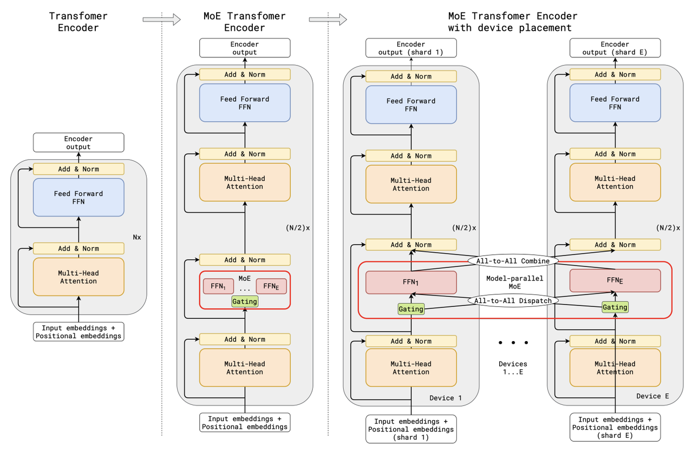
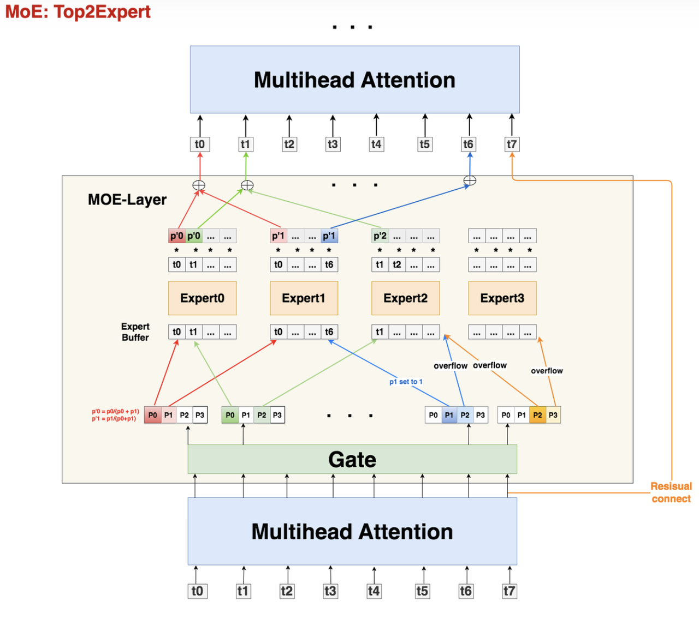
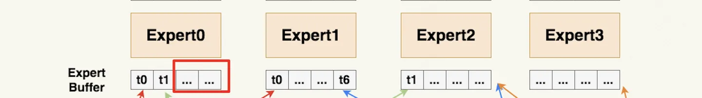
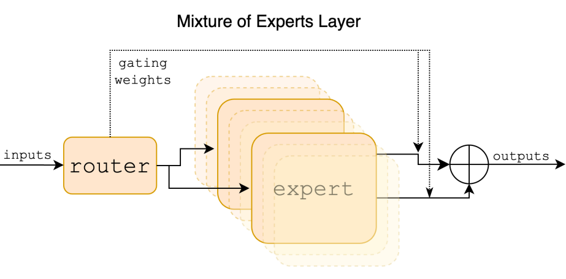
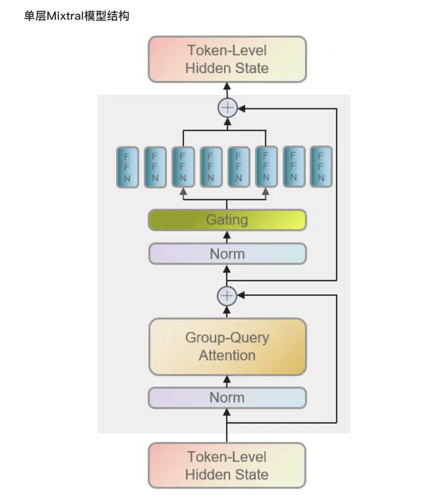
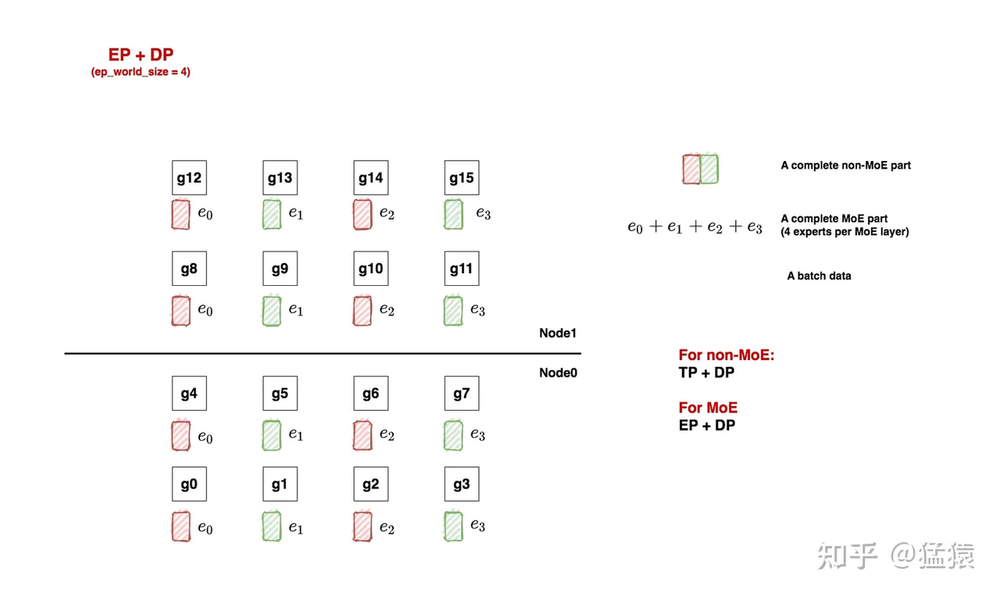
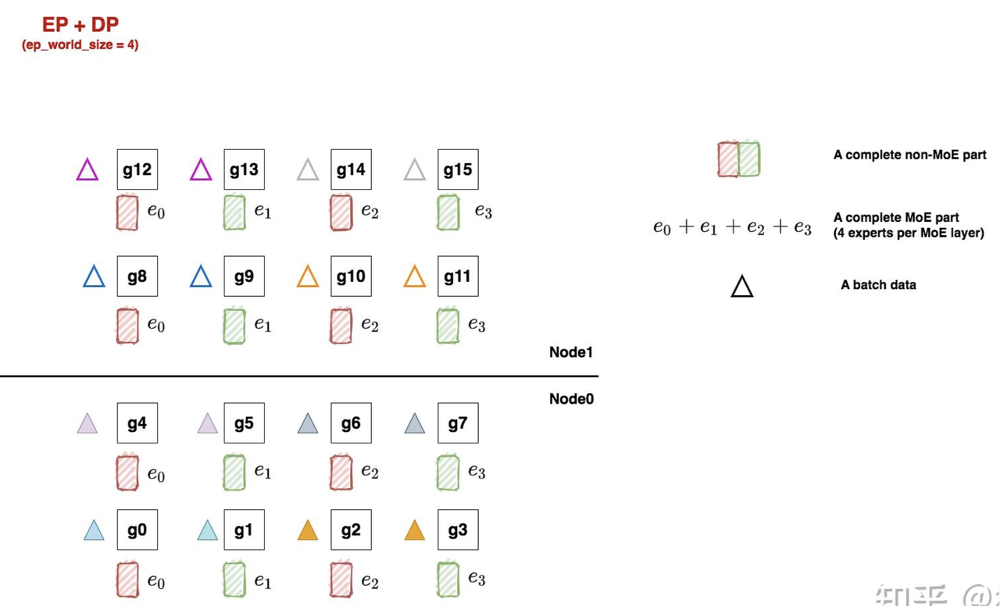
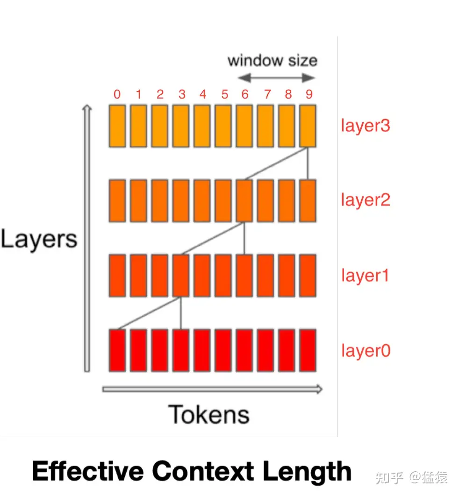
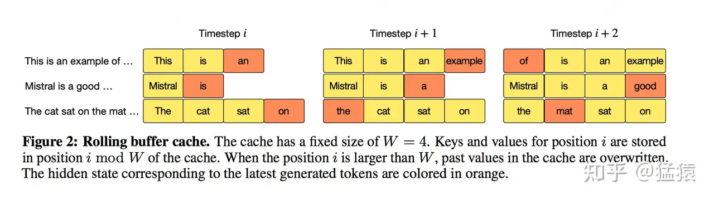
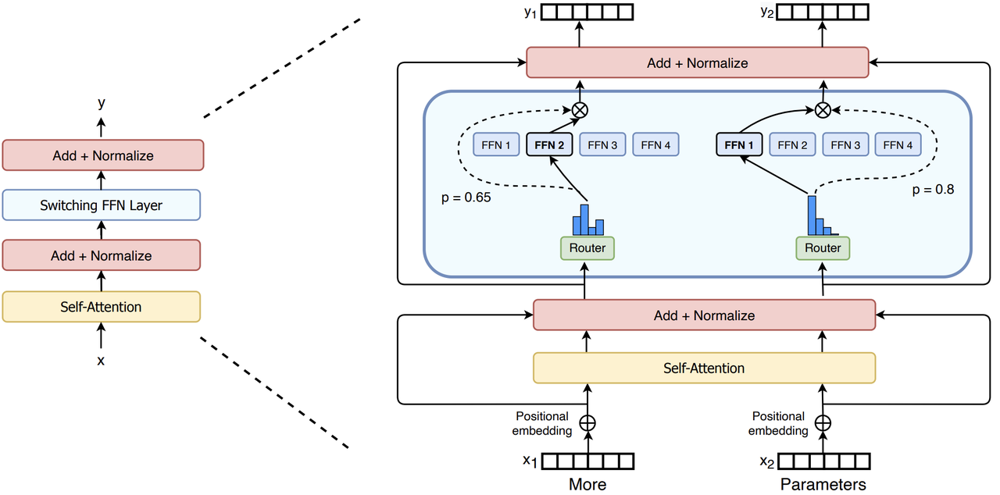

# **4.8.1 Gshard**

**论文：GShard: Scaling Giant Models with Conditional Computation and Automatic Sharding&#x20;**



**Gate**

> 使用线形层Gate判断token应该送去哪个expert。在别的MoE架构中，Gate有时也被称为Router（路由）。Gate的尺寸大小为`(M, E)`，其中E表示expert的数量。输入数据`(S, M)`过Gate`(M, E)`后，得到prob数据`(S, E)`，它的含义是：每个token去向每个expert的概率。由于在Gshard中使用的是top2Expert，因此对每个token，我们只关心它概率最大的两个expert。在下图中，用深色表示最大概率，浅色表示次大概率。例如对token0来说，它被送去expert0的概率最大，被送去expert1的概率次大



**Expert与溢出处理**

设置expert buffer：假设有8个token和4个expert，每个expert应该接收8/4 = 2个token，考虑到这里采用的是top2Expert，因此最终每个expert接收的token上限最好是(8/4)\*2 = 4，这也是我们图中expert buffer的长度。capacity可以按如下式子定义：

$$capacity=max(\frac{S}{E}∗K∗capacity \_factor,min\_capacity)$$

**token溢出**

如果只有单个expert溢出，那么就把另一个expert的权重值为1，然后正常参与加权计算；如果2个expert都溢出，那么该token就不经过任何expert，直接通过残差连接的方式，原样发去下一层的Attention上

**Drop tokens**

当发生溢出情况时，不是所有token都会被expert正常处理的，我们称这种对溢出的操作为drop tokens


**Zero padding**

在没有buffer中空出来的位置，用0向量填充，称为Zero padding



**Random Routing**

1st expert它是肯定要发去的。但是在选择2nd expert时，它做了一些加噪处理：对产出的每个概率（更确切地说是logit），它从某种分布中采样4个噪声，加在这4个logit上，然后mask掉1st expert位置的logit，再从剩下3个logit中找到最大的作为其2nd Expert。现在我们已经选出最终的top2Expert，我们再回到没有加噪时的4个概率上，取出相应位置的概率，做normalize计算：

$$P_0 = \frac{P_0}{P_{0}+P_{1}}, P_1 = \frac{P_1}{P_{0}+P_{1}}$$

P0,P1 是一种权重，该token过expert0和expert1后会分别得到一个输出token，我们可以对2个输出token做加权计算，得到最终的输出token

**辅助函数**

除了capacity和random routing外，Gshard还通过增加一项辅助损失函数 (Auxiliary Loss)来尽量保证Expert的负载均衡，其定义如下：

$$  l_{aux} = \frac{1}{E} \sum_{e = 1}^{E} \frac{c_e}{S} * m_e  $$

其中：$$E$$为专家数量,$$c_e$$为某个专家的buffer中已经存下的token数量（一般指该专家作为1st专家时接收到的token数）,$$S$$为总token数量,$$m_e$$为某个专家的buffer中已经存下的token在该专家上的avg(weight)（token考虑范围也是那些将该专家作为1st专家的token）

# **4.8.2 Mistral**

**论文：Mixtral of Experts，模型：Mixtral 8x7B**

> **一句话总结**：小模型推理速度更快，是 agent 技术的未来。专家组有8个小模型组成，**训练的时候基于8个模型，但是推理的时候只使用其中两个**：46.7B total parameters but only uses 12.9B parameters per token. 因此，它的使用成本就相当于一个 12.9B 的模型。
>
> 该层的输出是两个选定专家的输出的加权和。在Mixtral中，专家是标准的FFN结构



> ### **模型结构**
>
> 传入模型的各个token在经过Attention层及残差连接后，进一步将由路由（Gating/Router）导向2个expert（FFN）中，之后对expert的输出进行加权聚合，再经过残差连接得到当前层的输出。将大型模型分解为多个“专家”，其中每个专家负责处理输入数据的一个特定方面
>
> * 具体来说，每个专家专门处理特定类型的输入数据
>
> * 举个例子，某个专家可能专注于处理语法结构，而另一个专家可能专注于理解语义内容
>
> * 关键组成部分是门控机制，它决定了哪些专家处理哪些输入，可以基于输入数据的特性来动态选择最优的专家组合
>
> * 前馈块从8组不同的参数集中选择：在每一层，对于每个 token，一个路由网络（门控机制）选择这些组中的两个“专家”Transformer，来处理输入，并将它们的输出以加法方式结合
>
> * 通过使用MoE，Transformer模型可以处理大规模数据集或复杂任务，因为它允许模型使用处理特定输入最相关的部分专家（只用2个）




> ### **优化点**
>
> * Sentence-Level是对各个样本分别进行路由
>
> * Token-Level是对样本中的各个token分别进行路由
>
> * Task-Level要求不同的expert明确负责不同任务
>
> * 使用与专家函数*Ei*(*x*)相同的SwiGLU架构，并设置K = 2。这意味着每个token被路由到两个具有不同权重集的SwiGLU子块。综合来看，对于输入tokenx的输出y计算如下：
>
>   $$y=\sum_{i=0}^{n-1}\mathrm{Softmax}(\mathrm{Top}2(x\cdot W_g))_i\cdot\mathrm{SwiGLU}_i(x)$$

### **MOE 并行训练**

**一般使用EP+DP，实验条件：16块GPU，对于non-moe的部分，采取tp + dp并行，对于moe部分，采取ep + dp并行**



1. **分布式初始化**

假设我们每个MoE层有若干个专家，现在我们想把这一套专家分布排列到gpu上，最直觉的做法就是：我们先定好要用几块GPU装下一套专家（EP），进而我们就能确认全局上共有多少套专家副本在跑（DP）。

```python
ep_world_size = 4 # 表示我们希望用4块GPU装下一套完整的专家
ep_groups = [
             [g0,    g1,    g2,     g3 ],
             [g4,    g5,    g6,     g7],
             [g8,    g9,    g10,  g11],
             [g12,  g13,  g14,  g15]
            ]   # 

ep_dp_world_size = 4  #数据并行
ep_dp_groups = [
                 [g0,   g4,   g8,   g12],
                 [g1,   g5,   g9,   g13],
                 [g2,   g6,   g10, g14],
                 [g3,   g7,   g11, g15]
                 ]

ep_tp_world_size = 1。  #张量并行
```

* **FWD与BWD过程**

8个batch，目的：16卡吃8个小batch做完FWD+BWD后的结果，应该与单卡吃下由这8个小batch组成的大batch的结果一致



* 在FWD中，数据先过non-MoE（Attention）层，由于一个tp组内每块卡的输出也是一致的，因此三角形颜色的分布没有改变。我们把三角形移动到对应的non-MoE分块下，表示在整个FWD中对应的non-MoE分块见过的batch。

* 继续做FWD，现在数据来到了MoE层，前面说过，每块卡上数据的维度是(E, C, M)，即我们已经计算好token和专家的对应关系，我们只需在ep\_group内做all2all通讯，将token发送去对应的专家即可，这就是ep\_group的作用。all2all通讯的细节我们放在后面说，这里只需记住在all2all通讯后，ep\_group内每个专家见过的batch有了改变，例如对e0，现在它见过了蓝色和橘色两个batch的数据。每个专家计算完自己的结果后，再通过all2all的方式，将对应的token计算结果还给ep\_group内的各gpu，然后继续mon-MoE->MoE的步骤，知道FWD完毕

* 做完了FWD，进入BWD。我们首先来到MoE部分，以e0为例，根据分布式训练使命，我们应该allreduce 8个batch的梯度结果，用来更新e0。欸那这8个batch在哪里呢？当然是在图中的ep\_dp\_group内！所以在BWD过程中，我们对ep\_dp\_group中e0的梯度做allreduce，用来更新e0。现在更好理解ep\_group的作用了

### **MOE 推理优化**

* **Sliding Window Attention：**&#x63;ache的存储压力之所以变大，是因为我们的Attention是causal decoder形式的，即每一个token，都要和它之前所有的token做Attention，所以cache中存储的数据量才和seq\_len正相关。如果现在我们转换一下思路，假设每一个token只和包含其本身在内的前 W 个token做Attention，这样不就能把cache的容量维持在W吗？而从直觉上来说，这样的做法也有一定的道理：对当前token来说，距离越远的token，能提供的信息量往往越低，所以似乎没有必要浪费资源和这些远距离的token做Attention。

  

  对于`layer3 token9`，虽然在每一层它“最远”只能看到前置序列中部分token，但是只要模型够深，它一定能够在某一层看到所有的前置tokens。类似于CNN中的“感受野”

* **Rolling Buffer Cache**

  

  不难发现，prompt中第 i 个token在KV cache中的存储序号为：`i % W`

* **Chunking：过长的prompt会给显存带来压力。一个符合直觉的解决办法是：把prompt切成若干chunk，每次只喂给模型1个chunk，更新1次KV Cache。**&#x4E00;般情况下，我们设`chunk_size = cache_window = sliding_window = W`，也就是chunk和cache的尺寸都和滑动窗口的尺寸保持一致，都设为W。

# **4.8.3 Switch Transformer**

> ### **模型特点**
>
> Switch Transformer是encoder-decoder结构，基于T5开发的，具有**1.6T**的参数，**2048**个expert
>
> Switch Transformer的一大亮点在于**其模型参数量可以是一个独立于总计算量的，单独的缩放轴**。也就是说，在改变参数量的同时，几乎不改变训练和推理的计算量，就可以带来效果的提升。因此Switch Transformer关注在“同样的FLOPS/token的计算量”下，如何扩大模型，提升效果

> ### **创新点**
>
> * **MoE to dense**：把训出来的效果较好的MoE模型蒸馏到dense模型，在压缩MoE模型99%的参数的情况下，效果还是比直接训练dense模型好。
>
> * **训练和微调技术**：
>
>   * 首次使用bf16成功训练MoE模型
>
>   * 更适合MoE结构的模型初始化
>
>   * 增加的专家正则化，改善了稀疏模型的微调和多任务训练
>
> * **多语言**：在多语言数据集上训练，发现101种语言效果普遍有提升。

**模型结构设计**

模型结构总体来看就是把transformer每层的FFN替换成MoE层。另外，Switch Transformer则直接把gating简化为只选择1个expert，即k=1。这样的MoE层叫做Switch layer



> ### **负载均衡**
>
> 如果一个token被分配到了一个已经满载的expert，就会出现overflow，那这个token在本层就不会被处理，而是直接通过残差链接，透传给下一层。这点也同GShard一样。
>
> 在Switch Transformer，专家容量通过容量系数capacity factor来控制。具体公式如下：
>
> $$expert capacity = \left( \frac{tokens per batch}{number of experts} \right) \times capacity factor$$
>
> **原因**：一个大的capacity factor意味着每个expert能够处理更多的token，从而减少overflow情况的发生，但是计算量和通讯量的压力也会增大，所以这是一个需要权衡的参数。
>
> **expert capacity的设定**
>
> 经验上，低的token丢弃率对模型的scaling很重要，想要训练超大规模的模型，就要解决这个问题。而通过负载均衡损失就可以确保良好的平衡，使得在使用较小容量系数的情况下，overflow尽量少，从而兼顾效果和计算速度。
>
> 关键问题来到负载均衡损失怎么设计。
>
> 给定 N 个expert，和包含 T 个token的batch $$\mathcal{B}$$，负载均衡损失是这么计算的：
>
> $$loss = \alpha \cdot N \cdot \sum_{i = 1}^{N} f_i \cdot P_i$$
>
> &#x20;$$f_i$$表示被分配到第  i 个expert的token数，这个不可导：
>
> $$f_i = \frac{1}{T} \sum_{x \in \mathcal{B}} \mathbf{1} \{ \text{argmax } p(x) = i \}$$
>
> $$P_i$$表示整个batch每个token分配给第 i 个expert的概率的总和，这个可导:
>
> $$P_i = \frac{1}{T} \sum_{x \in \mathcal{B}} p_i(x).$$
>
> 这个损失的设计其实和GShard中的也是一样的。在完美平均分配的情况下， $$f$$和 $$P$$ 这两个向量都是 ，这个时候负载均衡损失是最小的。$$\alpha$$ 扫描了1e-5到1e-1，发现设为1e-2，已经足够大保持负载平衡，同时不过分影响模型收敛。观察到 $$\sum_{i = 1}^{N} (f_i \cdot P_i) = \sum_{i = 1}^{N} \left( \frac{1}{N} \cdot \frac{1}{N} \right) = \frac{1}{N}$$，所以负载均衡loss还乘了个 $$N$$，这样可以保持无论使用多少个expert，在平均分配的情况下，loss都能保持相同的常数。

