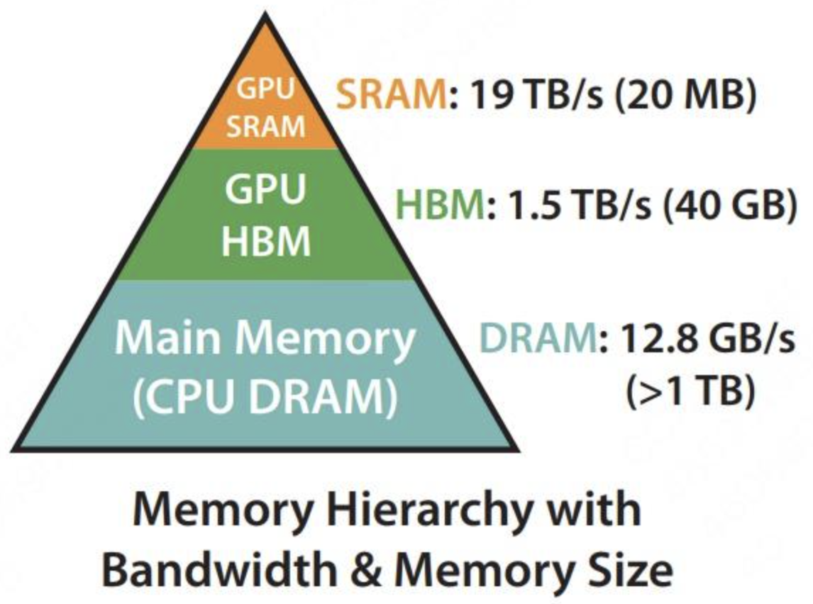
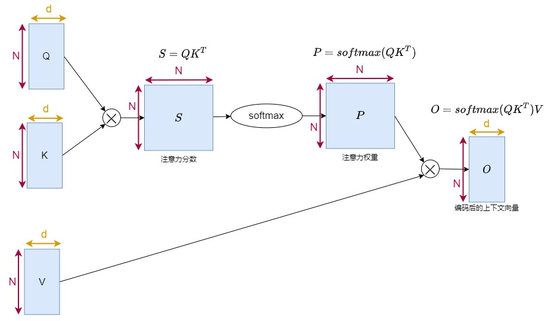
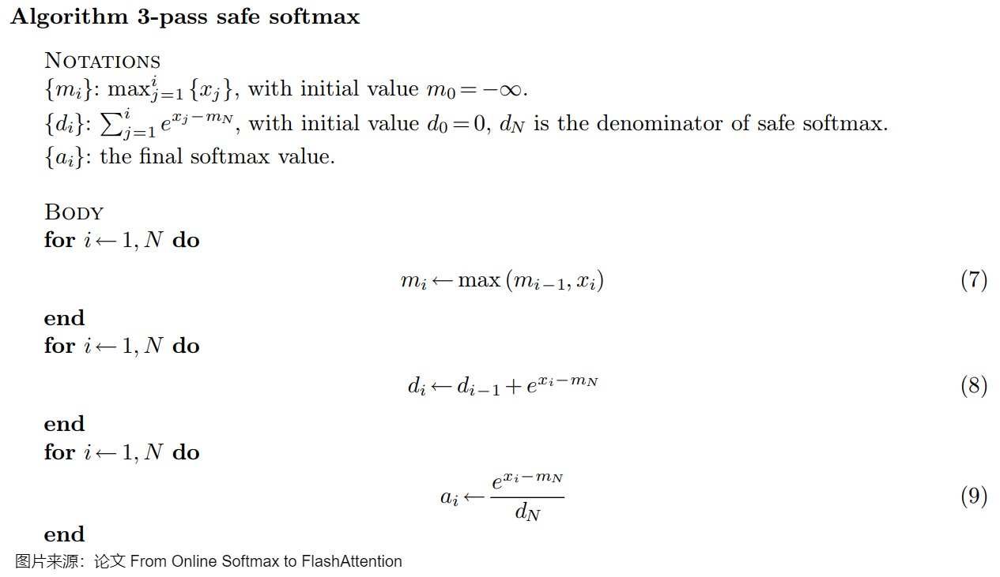
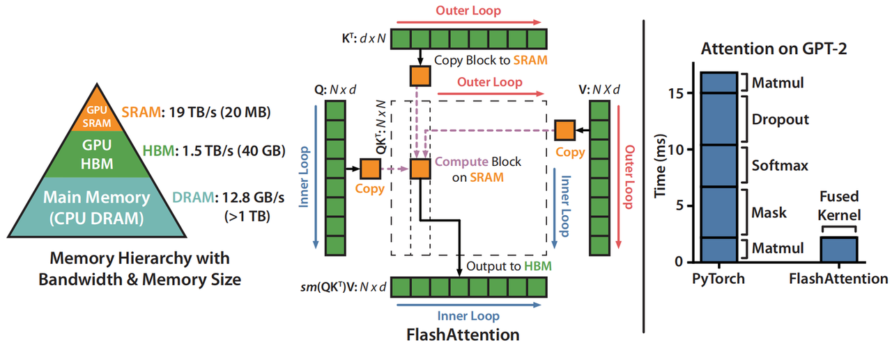
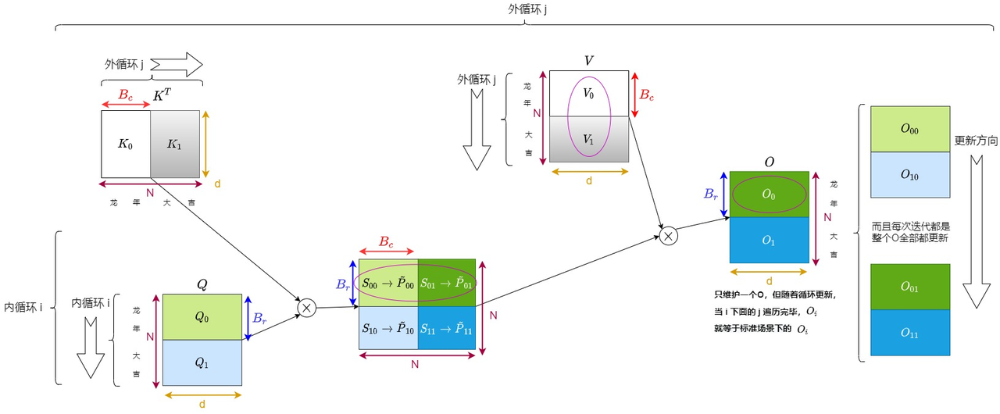
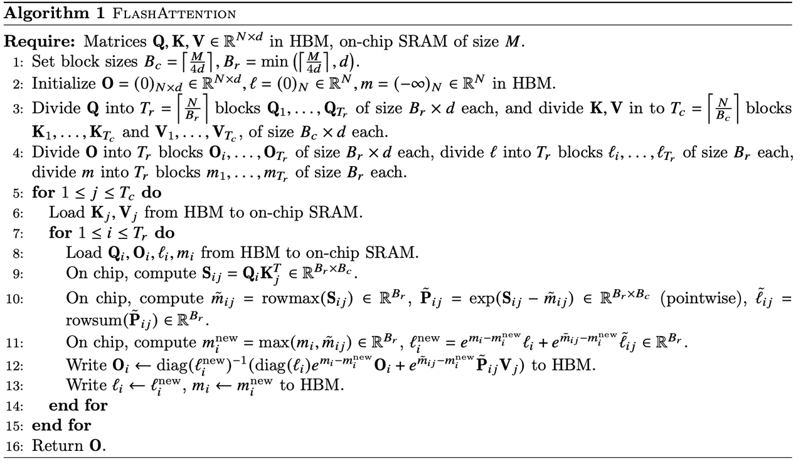

> **论文：FlashAttention: Fast and Memory-Efficient Exact Attention with IO-Awareness**
>
> > **参考阅读：**&#x68;ttps://zhuanlan.zhihu.com/p/669926191，https://zhuanlan.zhihu.com/p/676655352，https://zhuanlan.zhihu.com/p/663932651

> FlashAttention提出了一种加速计算，节省显存，IO感知的精确注意力，可以有效地缓解transformer模型的计算量和储存复杂度随着序列长度 N 呈二次方增长带来的资源和效率问题，而且FlashAttention在训练和推理都可以用
>
> * **加快了计算（Fast）：**&#x46;lash Attention并没有减少计算量FLOPs，而是从IO感知出发，**减少了HBM访问次数，从而减少了计算时间**。减少HBM访问次数，是通过**tiling技术分块和算子融合**来实现的
>
> * **节省了显存（Memory-efficient）：**&#x46;lash Attention通过引入统计量，改变注意力机制的计算顺序，**避免了实例化注意力矩阵**，**将显存复杂度从 O(N^2) 降低到了 O(N)&#x20;**
>
> * **精确注意力（Exact Attention）：**&#x4E0D;同于稀疏注意力，Flash Attention只是分块计算，而不是近似计算，**Flash Attention与原生注意力的结果是完全等价的**

# **5.2.1 计算与内存限制**

> self-attention块的**计算复杂度和空间复杂度是序列长度 N 的二次方**，有许多近似注意力的方法尝试减少attention的计算和内存要求。例如，稀疏近似和低秩近似的方法，将计算复杂度降低到了序列长度的线性或亚线性，但这些方法并没有得到广泛应用，因为这些方法过于关注FLOPs(浮点数计算次数)的减少，而忽略了IO读写的内存访问开销。在现代GPU中，**计算速度已经远超过了显存访问速度，transformer中的大部分计算操作的瓶颈是显存访问**
>
> > **注意区分FLOPS和FLOPs。**
> >
> > FLOPS：全大写，floating point operations per second。每秒钟执行的浮点数操作次数，理解为运算速度，是衡量硬件性能的指标
> >
> > FLOPs：s为小写，floating point operation。表示浮点数运算次数，理解为计算量，衡量模型或算法的复杂度
>
> * **计算带宽（math bandwidth）：**&#x5904;理器每秒钟可以执行的数学计算次数，单位通常是OPS(即operations/second)。如果用浮点数进行计算，单位是FLOPS
>
> * **内存带宽 （memory bandwidth）：**&#x5904;理器每秒钟从内存中读取的数据量，单位是bytes/second
>
> * **math-bound：**&#x6027;能受限于计算带宽，**大矩阵乘法、通道数很大的卷积运算**
>
> * **memory-bound：**&#x6027;能受限于内存带宽，**逐点运算的操作大多是内存受限的**，比如：**激活函数、dropout、mask，**&#x53E6;外reduction操作也是内存受限的，比如：**softmax，batch normalization和layer normalization**
>
> 对于self-attention块，除了大矩阵乘法是计算受限，其他操作**计算softmax，dropout，mask都是内存受限的**



**GPU内存分级**

GPU内存由多个不同大小和不同读写速度的内存组成。内存越小，读写速度越快。

* **片上内存：**&#x4E3B;要用于缓存（cache）及少量特殊存储单元（例如 texture），其特点是“存储空间小，但带宽大”。对应到上图中，**SRAM 就属于片上内存，它的存储空间只有 20MB，但是带宽可以达到 19TB/s**

* **片下内存：**&#x4E3B;要用于全局存储（global memory），即我们常说的显存，其特点是“存储空间大，但带宽小”，对应到上图中，**HBM 就属于片下内存（也就是显存），它的存储空间有 40GB（A100 40GB），但带宽相比于 SRAM 就小得多，只有 1.5TB/s，因此减少对HBM的读写次数，有效利用更高速的SRAM来进行计算是非常重要的**

**GPU运行模式**

GPU有大量的线程来执行某个操作，称为kernel。执行操作分为三步：

* **每个kernel将输入数据从低速的HBM中加载到高速的SRAM中**

* 在**SRAM中进行计算**

* 将**计算结果从SRAM中写入到HBM中**


**kernel 融合**

对于性能受限于内存带宽的操作，进行加速的常用方式就是**kernel融合，避免反复执行“从HBM中读取输入数据，执行计算，将计算结果写入到HBM中”**，将多个操作融合成一个操作，**减少读写HBM的次数。**&#x4E3E;例来说，我现在要做计算 A 和计算 B。在老方法里，我做完 A 后得到一个中间结果，写回显存，然后再从显存中把这个结果加载到 SRAM，做计算 B。但是现在我发现 SRAM 完全有能力存下我的中间结果，那我就可以把 A 和 B 放在一起做了，这样就能节省很多读取时间

# **5.2.2 标准Attention与Safe softmax**

## **标准Attention**

**先定义 q、k、v**：batch\_size 等于 1，seq\_len 等于 N，emb\_size 等于 d。我们只关注 attention 部分，忽略 dropoout、mask 等计算。下面是标准的 attention 计算流程， $$S = QK^T, P = \text{softmax}(S)$$。



## **标准Safe softmax**

对于**float32和bfloat16**来说，&#x5F53;**&#x20;x≥89 时，exp(x) 就会变成inf，发生数据上溢的问题**。为了避免发生数值溢出的问题，保证数值稳定性，计算时通常会减去最大值，称为**safe softmax**：

$$ 
 m = \max_i (x_i) ,\quad
 \text{softmax}(x_i) = \frac{e^{x_i - m}}{\sum_{j = 1}^{d} e^{x_j - m}}  $$



简单代码实现如下：

```python
import torch
A = torch.tensor([1., 2., 3., 5., 4.])

def online_softmax(x):
    m = torch.tensor(-1000.0)
    d = 0
    N = len(x)
    a = torch.zeros(N)
    
    for i in range(N):
        m_pre = m
        m = torch.max(m, x[i])
        d = d * (m_pre - m).exp() + (x[i] - m).exp()

    for i in range(N):
        a[i] = (x[i] - m).exp() / d

    return a

print(torch.softmax(A,dim=-1))
print(online_softmax(A))
```

# **5.2.3 FlashAttention forward流程**

## **Tilling 分块计算**



> ### **Tiling 分块计算**
>
> SRAM的读写速度比HBM高一个数量级，但内存小很多。通过kernel融合的方式，将多个操作融合为一个操作，利用高速的SRAM进行计算，可以减少读写HBM的次数，从而有效减少内存受限操作的运行时间。但SRAM的内存大小有限，不可能一次性计算完整的注意力，因此必须进行分块计算，使得分块计算需要的内存不超过SRAM的大小
>
> #### **分块计算的难点**
>
> 注意力计算流程&#x662F;**&#x20;矩阵乘法-->scale-->mask-->softmax-->dropout-->矩阵乘法**，**矩阵乘法和逐点操作的分块计算是容易实现**的，但是**softmax由于分母需要完整输入数据，所以分块计算很难**
>
> #### **FlashAttention的做法**
>
> 引入**额外的统计量 $$m(x),l(x)$$**&#x6765;进行解耦
>
> * **求Safe Softmax**
>
>   $$m(x) := \max_i x_i,\quad
>   f(x) := [e^{x_1 - m(x)}, \ldots, e^{x_B - m(x)}],\quad
>   l(x) := \sum_i f(x)_i,\quad
>   \text{softmax}(x) := \frac{f(x)}{l(x)}$$
>
> * **解耦拼接向量的Softmax计算**
>
>   $$m(x) = m([x^{(1)}, x^{(2)}]) = \max(m(x^{(1)}), m(x^{(2)}))\\
>   f(x) = [e^{m(x^{(1)}) - m(x)} f(x^{(1)}), e^{m(x^{(2)}) - m(x)} f(x^{(2)})]\\
>   l(x) = l([x^{(1)}, x^{(2)}]) = e^{m(x^{(1)}) - m(x)} l(x^{(1)}) + e^{m(x^{(2)}) - m(x)} l(x^{(2)})\\
>   \text{softmax}(x) = \frac{f(x)}{l(x)}$$
>
>   通过保持额外的两个统计量可以实现softmax的分块计算，同时**注意，多个block的softmax，GPU 是可以做并行计算的，这也提升了计算效率**
>
> * **kernel融合**
>
>   把mask和dropout加上的forward：
>
>   $$ S = \frac{1}{\sqrt{d_k}} Q K^{\top} \in \mathbb{R}^{N \times N} \\
>    S_{\text{masked}} = \text{MASK}(S) \in \mathbb{R}^{N \times N} \\
>    P = \text{softmax}(S_{\text{masked}}) \in \mathbb{R}^{N \times N} \\
>   P_{\text{dropped}} = \text{dropout}(P, p_{\text{drop}}) \in \mathbb{R}^{N \times N} \\
>   O = P_{\text{dropped}} V \in \mathbb{R}^{N \times d} \\$$
>
>   tiling分块计算使得可以用一个CUDA kernel来执行注意力的所有操作，从HBM中加载输入数据，在SRAM中执行所有的计算操作（矩阵乘法，mask，softmax，dropout，矩阵乘法），再将计算结果写回到HBM中，通过kernel融合将多个操作融合为一个操作，避免了反复地从HBM中读写数据&#x20;

> ### **一个分块计算Softmax的例子**
>
> 对向量\[1, 2, 3, 4]计算softmax，分成两块\[1, 2]和\[3, 4]进行计算
>
> **计算block1：**
>
> &#x20;                                         $$m_1 = \max(\{1, 2\}) = 2 \\
>  f_1 = [e^{1 - 2}, e^{2 - 2}] = [e^{-1}, e^0] \\
>  l_1 = \sum f_1 = e^{-1} + e^0 \\
>  o_1 = \frac{f_1}{l_1} = \frac{[e^{-1}, e^0]}{e^{-1} + e^0} $$
>
> **计算block2：**
>
> &#x20;                                         $$ m_2 = \max(\{3, 4\}) = 4 \\
>  f_2 = [e^{3 - 4}, e^{4 - 4}] = [e^{-1}, e^0] \\
>  l_2 = \sum f_2 = e^{-1} + e^0 \\
>  o_2 = \frac{f_2}{l_2} = \frac{[e^{-1}, e^0]}{e^{-1} + e^0} \\$$
>
> **合并得到完整的结果：**
>
> &#x20;                                   $$  m = \max(m_1, m_2) = 4 \\
>  f = [e^{m_1 - m} f_1, e^{m_2 - m} f_2] = [e^{-3}, e^{-2}, e^{-1}, e^0] \\
>  l = e^{m_1 - m} l_1 + e^{m_2 - m} l_2 = e^{-3} + e^{-2} + e^{-1} + e^0 \\
>  o = \frac{f}{l} = \frac{[e^{-3}, e^{-2}, e^{-1}, e^0]}{e^{-3} + e^{-2} + e^{-1} + e^0}  $$
>
> 在忽略mask和dropout的情况下，Flash Attention算法的前向计算在K, V的维度上做外循环，在Q的维度上做内循环

## **Forward具体流程**

### **Flash Attention 具体做法**

1. 首先，将 𝑄 矩阵切为 𝑇𝑟 块，每块的长度为 𝐵𝑟 。用 𝑄𝑖 来表示切完后的某块矩阵，则 𝑄𝑖 的维度为 （𝐵𝑟，𝑑） 。不难理解， 𝑄𝑖 中存储着某 𝐵𝑟 个 token 的 query 信息

2. 然后，将 $$𝐾^𝑇 $$矩阵切为 𝑇𝑐 块，每块的长度为 𝐵𝑐 。用 $$  𝐾_𝑗^𝑇  $$表示切完后的某块矩阵，则 $$  𝐾_𝑗^𝑇  $$的维度为 （𝑑，𝐵𝑐） 。易知 $$  𝐾_𝑗^𝑇  $$中存储着某 𝐵𝑐 个 token 的 key 信息

3. 同样，将 𝑉 矩阵也切为 𝑇𝑐 块，每块长度为 𝐵𝑐 。用 𝑉𝑗 表示切完后的某块矩阵，则 𝑉𝑗 的维度为 （𝐵𝑐，𝑑） 。易知 𝑉𝑗 中存储着某 𝐵𝑐 个 token 的 value 信息



* **计算初始attention分数：**&#x56FE;中的 $$S_{ij}$$ 表示前 $$B_r$$ 个token和前 $$B_c$$ 个token间的原始相关性分数

* **Safe softmax + mask + dropout：**&#x5BF9; $$S_{ij}$$ 做safe softmax、mask和dropout操作，得到 $$\widetilde{P}_{ij}$$ 。你可能会有疑惑：前面不是说， $$\widetilde{P}_{ij}$$ 是归一化前的结果， $$P_{ij}$$ 是归一化后的结果吗？那么这里是不是应该用 $$P_{ij}$$ 呢？这里确实只用到算到 $$\widetilde{P}_{ij}$$ ，在后文对分块计算细节的讲解中，我们会详细说这点。目前为止，大家不用太纠结符号，只用大体知道 $$P$$ 代表的含义即可

* **计算output：**&#x7EC6;心的你肯定又发现了，这个等式不太对劲，这个 $$O_{ij}$$ 不太对劲。想一想，在正常情况下，前 $$B_r$$ 个token过attention后的输出结果，应该是它和所有token都做注意力计算后的输出结果。可是这里， $$O_{ij}$$ 却只是前 $$B_r$$ 个token和前 $$B_c$$ 个token的结果。虽然 $$O_{ij}$$ 的shape对了，但其中的内容却不是我们最终想要的。所以，关于 $$O$$ 的计算，也是我们需要关注的细节，我们同样放在后文详说

计算的伪代码如下：

```python
# ---------------------# Tc: K和V的分块数# Tr: Q的分块数量# ---------------------
for 1 <= j <= Tc:
    for 1 <= i <= Tr:
        do....
```

### **Tilling 中的 Safe Softmax**

> 1. 假设标准场景下， $$S$$矩阵某一行的向量为 $$x = [x_1,x_2,\ldots,x_d]$$，因为分块的原因，它被我们切成了两部分 $$x = [x^{(1)},x^{(2)}]$$&#x20;
>
> 2. 我们定义：
>
>    * $$m(x)$$：标准场景下，该行的全局最大值
>
>    * $$m(x^{(1)})$$：分块1的全局最大值
>
>    * $$m(x^{(2)})$$：分块2的全局最大值
>
>    那么易知：$$m(x)=m([x^{(1)},x^{(2)}]) = max(m(x^{(1)}),m(x^{(2)}))$$
>
> 3. 我们定义：
>
>    * $$f(x)$$：标准场景下， $$exp(x - m(x))$$的结果
>
>    * $$f(x^{(1)})$$：分块场景下， $$exp(x^{(1)} - m(x^{(1)}))$$ 的结果
>
>    * $$f(x^{(2)})$$：分块场景下， $$exp(x^{(2)} - m(x^{(2)}))$$的结果
>
>    那么易知： $$f(x)=[e^{(m(x^{(1)})-m(x))}f(x^{(1)}),e^{(m(x^{(2)})-m(x))}f(x^{(2)})]$$。这个很好理解，详细的证明过程就不写了
>
> 4. 我们定义：
>
>    * $$l(x)$$：标准场景下， $$rowsum[f(x)]$$的结果
>
>    * $$l(x^{(1)})$$：分块场景下， $$rowsum[f(x^{(1)})]$$的结果
>
>    * $$l(x^{(2)})$$：分块场景下， $$rowsum[f(x^{(2)})]$$的结果
>
>    那么由 (3) 易知：$$l(x)=e^{m(x^{(1)}) - m(x)}l(x^{(1)})+e^{m(x^{(2)}) - m(x)}l(x^{(2)})$$
>
> 5. 现在，我们就可以用分块计算的结果，来表示标准场景下safe softmax的结果了：
>
>    $$\mathrm{softmax}(x)=\frac{f(x)}{l(x)}=\frac{[e^{(m(x^{(1)}) - m(x))}f(x^{(1)}),e^{(m(x^{(2)}) - m(x))}f(x^{(2)})]}{e^{m(x^{(1)}) - m(x)}l(x^{(1)})+e^{m(x^{(2)}) - m(x)}l(x^{(2)})}$$
>
>    配合上面的图例和flash attention论文中的伪代码，再来进一步理解一下分块计算safe softmax的(1)～(5)步骤

### **分块计算中的输出 O**

> 第一想法可能是，只要让每块 𝑆，𝑃 结果和标准场景下的结果完全一致，不就行了吗？但是别忘了，你不计算到最后一块 𝑆，𝑃 ，你是拿不到全局的 rowmax 和 rowsum 的。而由于为了解决 memory-bound 的问题，我们只保留 𝑚，𝑙，𝑂 而不存各块 𝑆，𝑃 。因此等你遍历到最后一块时，虽然有了全局的 rowmax 和 rowsum，但没有 𝑆，𝑃 ，你根本算不出最终的 𝑂𝑖&#x20;
>
> 所以这里我们换个思路： 𝑂𝑖 不是每遍历一块就更新一次吗？那有没有一种办法，**不断用当前最新的 rowmax 和 rowsum 去更新 𝑂𝑖 ，直到遍历完最后一块，这时的 𝑂𝑖 不就和标准场景下的结果完全一致了吗？也就是我们想构造形如下面这样的更新等式：**
>
> $$O_i = O_i + 当前最新结果$$
>
> $$\begin{aligned}O_i^{(j+1)}&=P_{i,:j+1}V_{:j+1}\\&=softmax(S_{i,:j+1})V_{:j+1}\\&=diag(l^{(j+1)})^{-1}[exp([S_{i,:j},S_{i(j+1)}]-m^{(j+1)})]\begin{bmatrix}V_{:j}\\V_{j+1}\end{bmatrix}\\&=diag(l^{(j+1)})^{-1}[exp(S_{i,:j}-m^{(j+1)})V_{:j}+exp(S_{i(j+1)}-m^{(j+1)})V_{j+1})]\\&=diag(l^{(j+1)})^{-1}[e^{-m^{(j+1)}}exp(S_{i,j})V_{:j}+e^{-m^{(j+1)}}exp(S_{i(j+1)})V_{j+1})\\&=diag(l^{(j+1)})^{-1}[diag(l^{(j)})e^{m^{(j)}-m^{(j+1)}}diag(l^{(j)})^{-1}exp(S_{i,:j}-m^{(j)})V_{:j}+e^{-m^{(j)}}\\&=diag(l^{(j+1)})^{-1}[diag(l^{(j)})e^{m^{(j)}-m^{(j+1)}}\left.P_{i,:j}V_{:j}+e^{-m^{(j+1)}}exp(S_{i(j+1)})V_{j+1})\right]\\&=diag(l^{(j+1)})^{-1}[diag(l^{(j)})e^{m^{(j)}-m^{(j+1)}}O_i^{(j)}+e^{\widetilde{m}-m^{(j+1)}}exp(S_{i(j+1)}-\widetilde{m})V_{j+1}\\&=diag(l^{(j+1)})^{-1}[diag(l^{(j)})e^{m^{(j)}-m^{(j+1)}}O_{i}^{(j)}+e^{\widetilde{m}-m^{(j+1)}}\widetilde{P}_{i(j+1)}V_{j+1}]\end{aligned}$$
>
> 初次看到这个推导过程，你可能有些懵圈，不要紧，我们一行一行来看。在讲解之前，我们先明确以上推导过程中符号上下标的含义：
>
> * $$i:$$这个大家应该很熟悉了。例如图例中， $$i=0,1,2$$分别对应着深浅绿、深浅蓝、深浅黄块。
>
> * $$i(j+1):$$表示当前分块的相关结果
>
> * $$i,:+1:$$表示截止到当前分块（包含当前分块）的相关结果。 $$2,:j$$表示截止到前一分块（包含前一分块）的相关结果

### **Forward计算代码**

```python
import torch

NEG_INF = -1e10  # -infinity
EPSILON = 1e-10

Q_LEN = 6
K_LEN = 6
Q_BLOCK_SIZE = 3
KV_BLOCK_SIZE = 3
P_DROP = 0.2

Tr = Q_LEN // Q_BLOCK_SIZE
Tc = K_LEN // KV_BLOCK_SIZE

Q = torch.randn(1, 1, Q_LEN, 4, requires_grad=True).to(device='cpu')
K = torch.randn(1, 1, K_LEN, 4, requires_grad=True).to(device='cpu')
V = torch.randn(1, 1, K_LEN, 4, requires_grad=True).to(device='cpu')

O = torch.zeros_like(Q, requires_grad=True)
l = torch.zeros(Q.shape[:-1])[..., None]
m = torch.ones(Q.shape[:-1])[..., None] * NEG_INF

# step 4
Q_BLOCKS = torch.split(Q, Q_BLOCK_SIZE, dim=2)
K_BLOCKS = torch.split(K, KV_BLOCK_SIZE, dim=2)
V_BLOCKS = torch.split(V, KV_BLOCK_SIZE, dim=2)

# step 5
O_BLOCKS = list(torch.split(O, Q_BLOCK_SIZE, dim=2))
l_BLOCKS = list(torch.split(l, Q_BLOCK_SIZE, dim=2))
m_BLOCKS = list(torch.split(m, Q_BLOCK_SIZE, dim=2))

# step 6
for j in range(Tc):
    # step 7
    Kj = K_BLOCKS[j]
    Vj = V_BLOCKS[j]
    # step 8
    for i in range(Tr):
        # step 9
        Qi = Q_BLOCKS[i]
        Oi = O_BLOCKS[i]
        li = l_BLOCKS[i]
        mi = m_BLOCKS[i]

        # step 10
        S_ij = torch.einsum('... i d, ... j d -> ... i j', Qi, Kj)

        # step 11
        mask = S_ij.ge(0.5)
        S_ij = torch.masked_fill(S_ij, mask, value=0)
        
        # step 12
        m_block_ij, _ = torch.max(S_ij, dim=-1, keepdims=True)
        P_ij = torch.exp(S_ij - m_block_ij)
        l_block_ij = torch.sum(P_ij, dim=-1, keepdims=True) + EPSILON
        P_ij_Vj = torch.einsum('... i j, ... j d -> ... i d', P_ij, Vj)

        # step 13
        mi_new = torch.maximum(m_block_ij, mi)

        li_new = torch.exp(mi - mi_new) * li + \
                 torch.exp(m_block_ij - mi_new) * l_block_ij

        # step 14
        m = torch.nn.Dropout(p=P_DROP)
        P_ij_Vj = m(P_ij_Vj)

        # Step 15
        O_BLOCKS[i] = (li / li_new) * torch.exp(mi - mi_new) * Oi \
                      + (torch.exp(m_block_ij - mi_new) / li_new) * P_ij_Vj
        print(f'-----------Attention : Q{i}xK{j}---------')
        print(O_BLOCKS[i].shape)
        print(O_BLOCKS[0])
        print(O_BLOCKS[1])
        print('\n')

        # step 16
        l_BLOCKS[i] = li_new
        m_BLOCKS[i] = mi_new

O = torch.cat(O_BLOCKS, dim=2)
l = torch.cat(l_BLOCKS, dim=2)
m = torch.cat(m_BLOCKS, dim=2)
```

## **计算量和显存**

* **FlashAttention 计算流程**



> ### **计算量**
>
> 1. 在算法第9行，有 $$S_{ij}=Q_iK_j^T$$ ，其中 $$Q_i\in\mathbb{R}^{B_r * d},K_j^T\in\mathbb{R}^{d * B_c}$$ 。根据前置知识，求 $$S_{ij}$$ 的计算量为 $$O(B_rB_cd)$$&#x20;
>
> 2. 在算法第12行，我们有 $$\widetilde{P}_{ij}V_j$$ ，其中 $$\widetilde{P}_{ij}\in\mathbb{R}^{B_r * B_c},V_j\in\mathbb{R}^{B_c * d}$$ 。则这里的计算量同样为 $$O(B_rB_cd)$$&#x20;
>
> 3. 接下来我们看一共计算了多少次(1)和(2)，也就是执行了多少次内循环：
>
> 4. 综合以上三点，flash attention的forward计算量为： $$O(\frac{N^2}{B_cB_r}B_rB_cd)=O(N^2d)$$
>
>    同理可以自行推出backward中的计算量，在论文里给出的结论是 $$O(N^2)$$ ，d远小于N，因此 $$d$$ 也可以略去不表达
>
> ### **显存**
>
> 和标准attention相比，如果不考虑$O$的话，Flash Attention只需要存储 $$m, l$$，其显存需求为 $$O(N)$$。而标准attention需要存储$$S, P$$，其显存需求为$$O(N^2)$$。可以发现相比于标准attention，flash attention明显降低了对显存的需求。
>
> ### **IO复杂度**
>
> 1. 我们来看伪代码的第六行，在每个外循环中，我们都会加载 $$K, V$$的block。所有外循环结束后，相当于我们加载了完整的 $$K, V\in\mathbb{R}^{N*d}$$，因此这里的IO复杂度为：$$O(Nd)$$
>
> 2. 再看伪代码第8行，在每个内循环中，我们都加载了部分 $$Q, O, m, l$$ block，由于 $$m, l$$本身比较小(IO复杂度是 $$O(N)$$)，因此我们暂时忽略它们，只考虑 $$Q, O$$(原论文也是这么分析的)。固定某个外循环，所有内循环结束后，我们相当于完整遍历了 $$Q, O\in\mathbb{R}^{N*d}$$。同时我们会经历 $$T_c$$次外循环。因此这里最终的IO复杂度为： $$O(T_cNd)$$
>
> 3. 将 $$O, m, l$$写回HBM，这里近似后IO复杂度为：$$O(Nd)$$。不过在原论文的分析中并没有考虑写回的复杂度，不过省略一些常数项不会影响我们最终的分析
>
> 4. 所以，总体来说flash attention的IO复杂度为：$$O(T_cNd)=O(\frac{N}{B_c}Nd)=O(\frac{4Nd}{M}Nd)=O(\frac{N^2d^2}{M})$$。论文中提过，一般d的取值在64～128，M的取值在100KB左右，因此有 $$\frac{d^2}{M}\ll1$$。因此可以看出，Flash attention的IO复杂度是要显著小于标准attention的IO复杂度的
