# **5.4.1 Megatron-LM**

> 预训练必用框架，训练速度比DeepSpeed快，但是也有诸多缺点：
>
> * 作为框架完全没有分层分模块，也没有太多抽象设计，导致模型跟框架无法解耦， 需要手动切割模型并且适配， 只适合`gpt/llama`系列模型。
>
> * 通信有明显精度损失，特别`ringallReduce`
>
> * `megatron`推理， `kv cache`低级bug，容易导致`RLHF`训练失败
>
> * 混合精度训练，bf16没有`master weight`
>
> * 显存乱申请， 加上`pytorch allocator`拉垮，经常`oom`
>
> 虽然有这么多缺点，**但是`Megatron-LM`仍然是千卡集群以上最佳的选择，没有之一。千卡以内`fsdp`或者`torchtitan`都可以。**
>
> **特点**：支持数据并行、张量并行和流水线和专家并行，简称4D并行。
>
> > 提醒：[可以看看李沐的视频](https://www.bilibili.com/video/BV1nB4y1R7Yz/?spm_id_from=333.1387.collection.video_card.click)

> Megatron-LM 是一个**基于 PyTorch 的分布式训练框架**，用来训练基于Transformer的大型语言模型
>
> 大型模型能够提供更精准和强大的语义理解与推理能力。随着计算资源的普及和数据集的增大，模型参数的数量呈指数级增长。然而，训练这样规模庞大的模型面临着一些挑战：
>
> * **显存限制：&#x20;**&#x5373;便是目前最大的GPU主内存也难以容纳这些模型的参数。举例来说，一个1750亿参数的GPT-3模型需要约700GB的参数空间，对应的梯度约为700GB，而优化器状态还需额外的1400GB，总计需求高达2.8TB
>
> * **计算挑战：** 即使我们设法将模型适应单个GPU（例如通过在主机内存和设备内存之间进行参数交换），模型所需的大量计算操作也会导致训练时间大幅延长。举个例子，使用一块NVIDIA V100 GPU来训练拥有1750亿参数的GPT-3模型，大约需要耗时288年
>
> * **并行策略挑战：&#x20;**&#x4E0D;同的并行策略对应不同的通信模式和通信量，这也是一个需要考虑的挑战

## **数据并行**

> ### **Data Parallelism DP**
>
> 假设有 N 张卡（worker），**每张卡都保存一个完整模型的副本，每一次迭代（iteration/step）都将输入数据集batch分割成 N 个等大小的micro-batch，每张卡根据拿到的micro-batch数据独立计算梯度，worker定期聚合它们的梯度（调用AllReduce计算梯度均值）**，每张卡再独立进行参数更新。对于无法放进单个Worker的大模型，可以在模型的较小片段上使用数据并行
>
> 数据并行的扩展通常表现出色，但存在两个限制：
>
> * **降低GPU利用率：** 在一定点之后，每个GPU的批量大小变得太小，这会降低GPU的利用率，并增加通信成本
>
> * **设备数限制：&#x20;**&#x53EF;用于训练的GPU设备数量受到批量大小的限制，这限制了可以使用的最大设备数

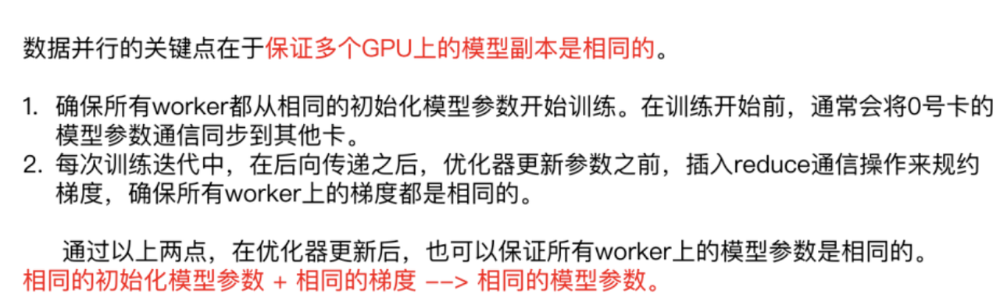

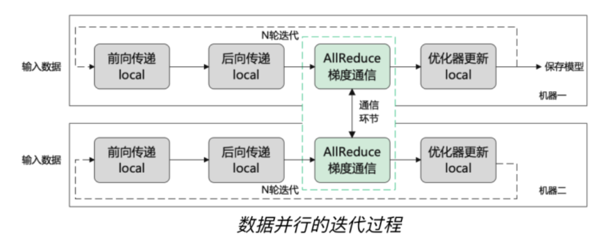

> **`All-Reduce`** 是一种在并行计算和分布式计算中常用的通信操作，用于在多个计算节点（例如 GPU 或 CPU）之间汇总数据
>
> **工作原理：**
>
> * **数据分发：**&#x6BCF;个节点在完成了自己的计算后会生成一组梯度（或者其他需要汇总的数据），这些数据需要在所有节点之间进行汇总
>
> * **数据汇总：**&#x41;ll-Reduce 操作将每个节点上的数据在所有节点之间进行相加或其他类型的归约操作（例如，求和、求平均、求最大值等），这意味着最终每个节点都会得到相同的结果，该结果是所有节点数据的汇总
>
> * **结果广播：**&#x5B8C;成汇总操作后，汇总结果会被广播回每个节点，使得每个节点都持有相同的汇总数据。这一步确保了所有节点在下一步的计算中都能使用一致的数据

## **模型并行**

> ### **Model Parallelism MP**
>
> 对于数据并行的限制，可以采用一些内存管理技术，比如激活检查点（**Activation Checkpointing**）
>
> **Activation Checkpointing（gradient\_checkpointing）：**&#x524D;向传播过程中计算节点的激活值并保存，计算下一个节点完成后丢弃中间节点的激活值，反向传播时如果有保存下来的梯度就直接使用，如果没有就使用保存下来的前一个节点的梯度重新计算当前节点的梯度再使用

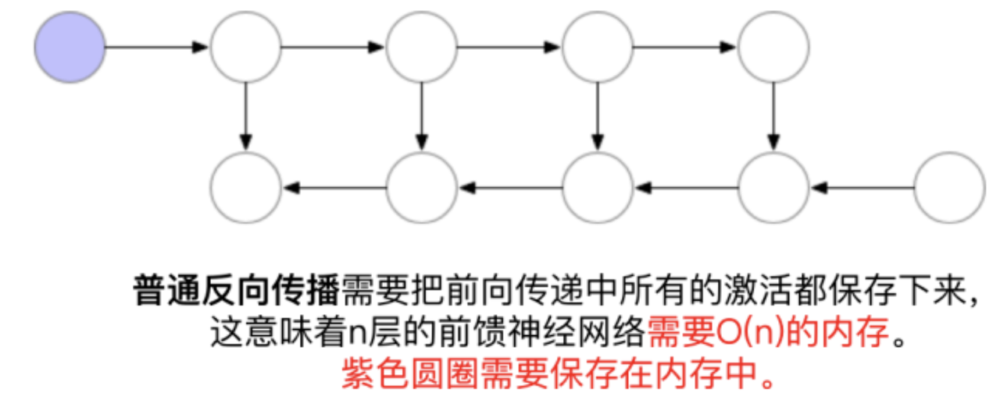

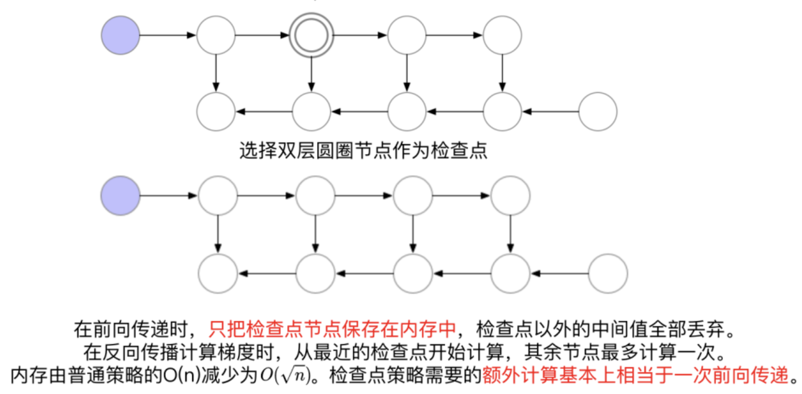

> 此外，还可以使用**模型并行**来划分模型的不同阶段，从而解决GPU内存容量和计算限制的问题，使得权重和关联的优化器状态不需要同时存储在一个GPU上。一个模型的内存和计算被分布在多个计算节点上，主要的方式分为**流水线并行和张量并行**

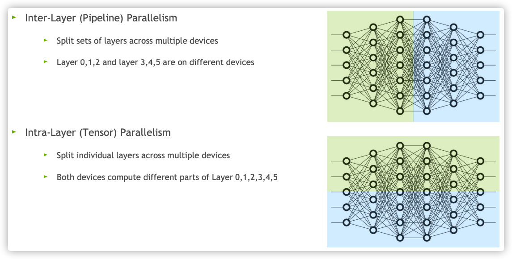

### **张量并行 Intra-Layer Tensor Parallelism**

有的tensor/layer很大，一张卡放不下，将tensor分割成多块，一张卡存一块。这也可以被理解为将大矩阵运算拆分成多个小矩阵运算，然后分布到不同的设备上进行计算

```python
# 假设模型有三层：L0, L1, L2 每层有两个神经元 两张卡
GPU0:
L0 | L1 | L2
---|----|---
a0 | b0 | c0

GPU1:L0 | L1 | L2
---|----|---
a1 | b1 | c1
```

高度的模型并行会产生很多的小矩阵乘法(GEMMS)，对于一个GEMMs $Y = XA$，按照对权重矩阵A的分块方式，**张量并行又可以分成行并行和列并行。**&#x795E;经网络中的线性层（Linear层），可以将其看作是**将输入矩阵分块进行计算，然后将计算结果合并成输出矩阵**。这个过程涉及矩阵乘法和加法操作，其中矩阵乘法涉及到权重矩阵和输入数据之间的乘法，然后再加上偏置向量；对于非线性层（例如激活函数层），通常不需要进行额外的设计。这些层的计算过程是基于输入数据应用某种非线性函数，例如ReLU（修正线性单元）、Sigmoid、Tanh等。这些函数在数学上是已知的，只需要将输入数据传递给这些函数，然后得到输出。整体来看，神经网络的计算可以被抽象为一系列的矩阵和向量操作，其中线性层涉及矩阵乘法和加法，而非线性层涉及特定的函数计算。这些操作在深度学习框架中会被高度优化，以提高计算效率和训练速度

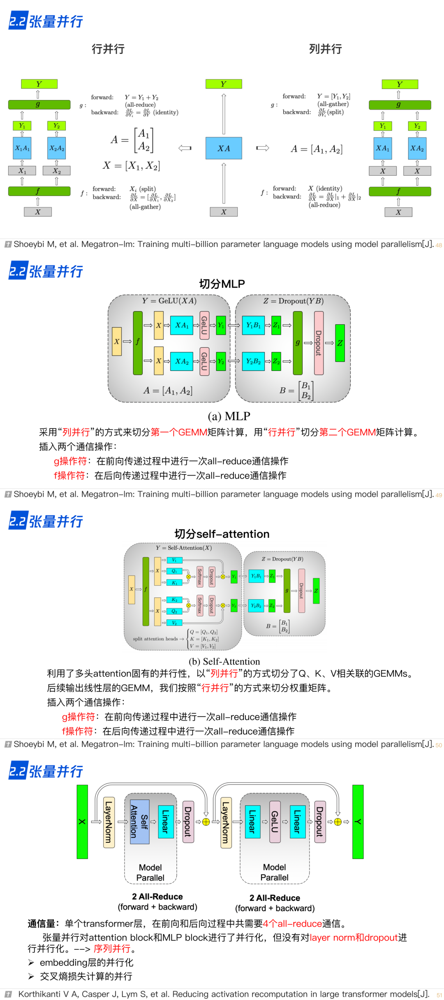

* **GEMMs行并行：**&#x5148;分析 `Row Parallelism`，就是把权重矩阵 $A$按照行切分成两部分，对应的把 $X$按照列切分成两部分

  $X A = [X_1 \quad X_2] \begin{bmatrix} A_1 \\ A_2 \end{bmatrix} = X_1 A_1 + X_2 A_2 = Y_1 + Y_2 = Y $

  这样 $X_1,A_1$可以在第一个GPU上计算， $X_2,A_2$可以在第二个GPU上计算，然后进行结果相加即可

  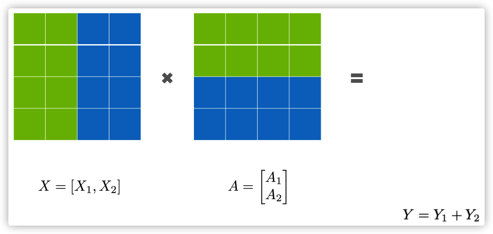

  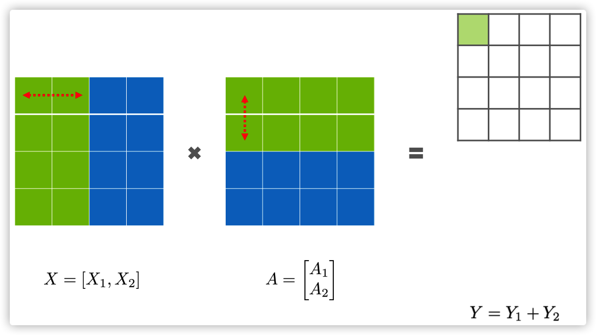

  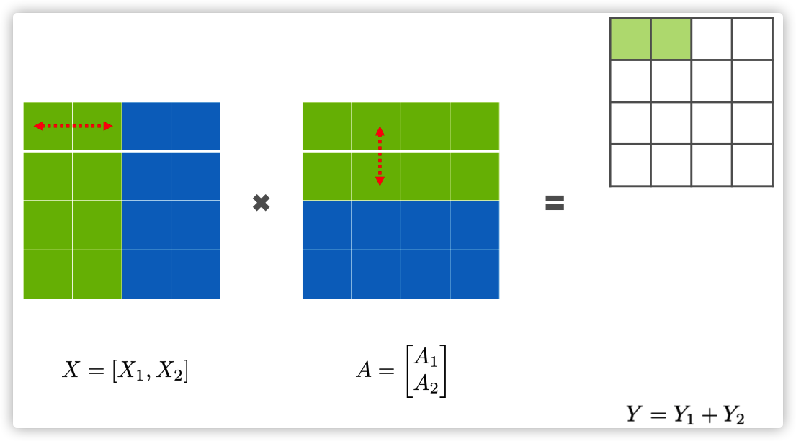

  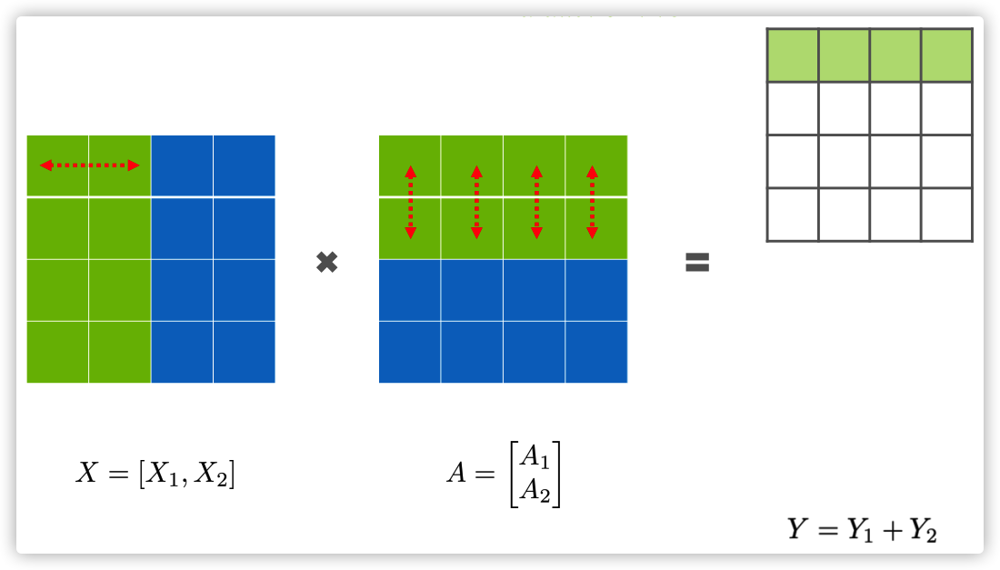

  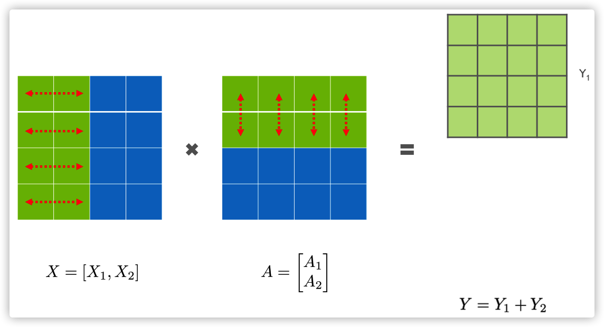

  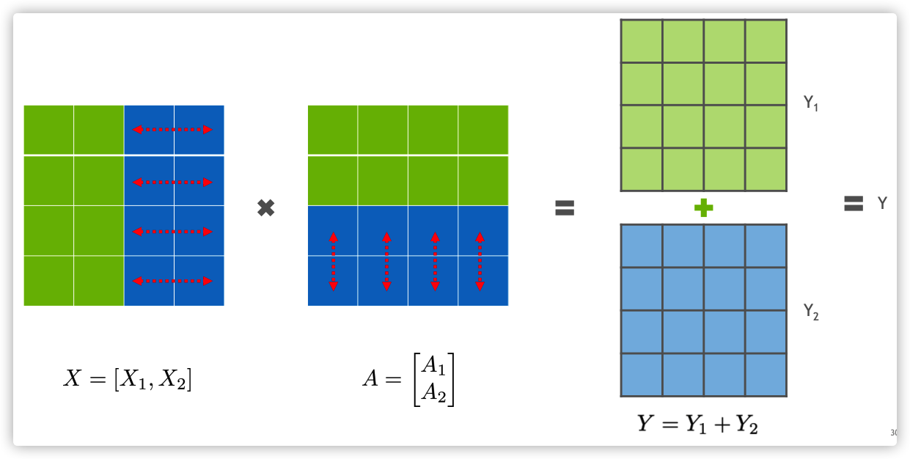

* **GEMMs列并行：**&#x5C31;是把 $A$按照列来分割

  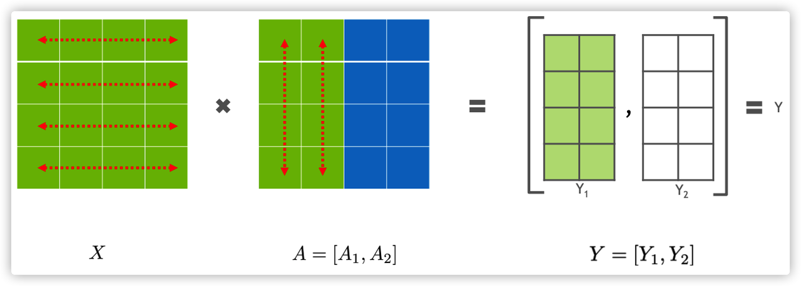

  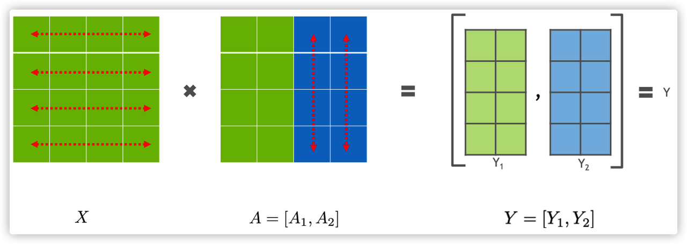

* **Transformer中的张量并行：**

  每个Transformer块包含了Self-Attention和Feed Forward Network，这些操作是大量的矩阵计算，适合在GPU上进行并行操作，从而加速模型的训练和推理过程

  1. **Masked Multi-Head Self Attention：** 涉及到大量的矩阵乘法操作，这些操作可以被高效地并行执行

  2. **Feed Forward Neural Network：** 包含多个全连接层，每个全连接层都涉及矩阵乘法、[激活函数](https://zhida.zhihu.com/search?content_id=232659360\&content_type=Article\&match_order=2\&q=%E6%BF%80%E6%B4%BB%E5%87%BD%E6%95%B0\&zhida_source=entity)（通常是GeLU）和可能的Dropout层。这些操作也是高度并行化的，可以在GPU上迅速执行

  Megatron 的 FFN是一个两层MLP，第一层是维度从 H 变成 4H，第二层是维度从 4H 变回到 H，所以Transformer具体架构如下，紫色块对应于全连接层，每个蓝色块表示一个被复制 N 次的transformer层，红色的 x L 代表此蓝色复制 L 次

  张量并行就是要对Transformer进行切分，Megatron 把 Masked Multi-Head Self Attention 和 Feed Forward 都进行切分以并行化，通过添加一些同步通信操作来创建一个简单的模型并行实现

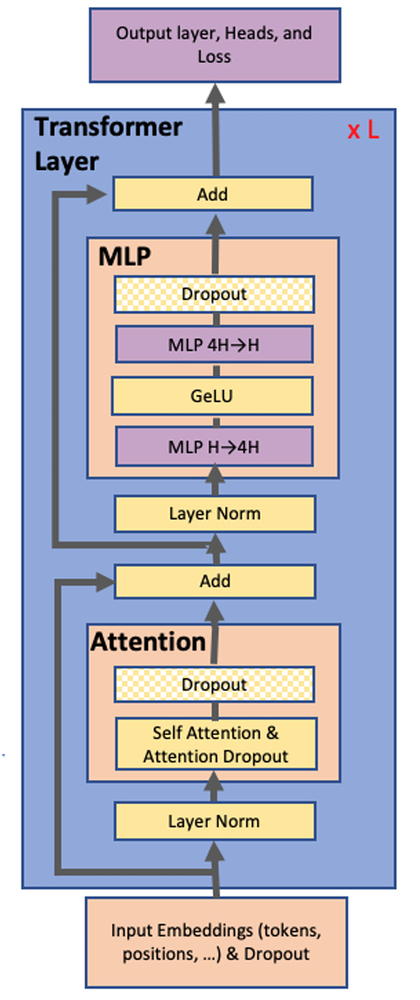

* **切分MLP：**&#x4ECE;MLP开始，MLP的第一部分是GEMM，后面是激活函数GeLU $Y = \text{GeLU}(XA)$

  **对比按照行列切分权重的方法：**

  * **行并行：** $Y = \text{GeLU}(X_1A_1+X_2A_2)$，但是**GeLU是非线性计算，也就是 $\text{GeLU}(X_1A_1+X_2A_2) \ne \text{GeLU}(X_1A_1) + \text{GeLU}(X_2A_2)$，**&#x6240;以这种方案需要在GeLU函数之前加上一个同步点，这个同步点让不同GPU之间交换信息

  * **列并行：** $\left[Y_1\quad Y_2\right] = \left[\text{GeLU}(XA_1),\text{GeLU}(XA_2)\right]$，**不需要同步点，直接把两个GeLU的输出拼接起来就行**，而不需要额外的通信（比如GeLU这里就不用all-reduce了）。下图所示， $f,g$分别是在前向和后向传递的时候做一次all-reduce通信操作。对于第二个MLP使用行并行，可以直接与第一个MLP得到的 $Y_1,Y_2$对应计算，不需要额外通信操作

  总的来说，**在MLP层中，对A采用“列切割”，对B采用“行切割”**。

  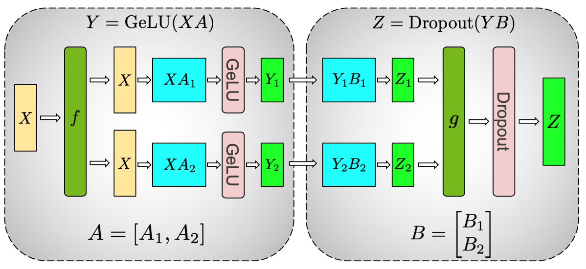

  > 这是因为，我们要**尽量保证各GPU上的计算相互独立，减少通讯量**。对A来说，需要做一次GELU的计算，而GELU是非线形的。也就意味着，**如果对A采用行切割，我们必须在做GELU前，做一次AllReduce**，这样就会产生额外通讯量。但是如果对A采用列切割，那每块GPU就可以继续独立计算了。一旦确认好A做列切割，那么也就相应定好B需要做行切割了。

  * **通信量分析**

  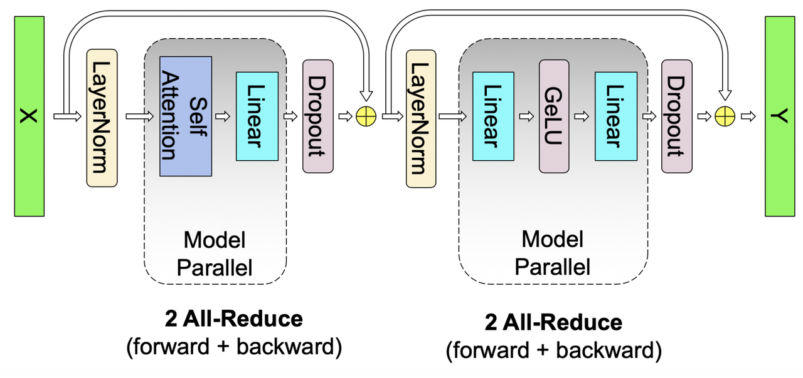

  MLP层做forward时产生一次AllReduce，做backward时产生一次AllReduce。AllReduce的过程分为两个阶段，Reduce-Scatter和All-Gather，每个阶段的通讯量都相等。现在我们设每个阶段的通讯量为 Φ $\Phi$，则一次AllReduce产生的通讯量为  $4\Phi$。MLP层的总通讯量为 $4\Phi$，其中  $\mathrm\Phi=b*s*h$&#x20;

* **切分self-attention：**&#x5229;用多头注意力固有的并行特性，直接**以列并行的方法切分QKV相关的GEMMs**

  1. **首先这里指考虑head=1的情况**

  `self-attention`的计算方式如下图所示：

  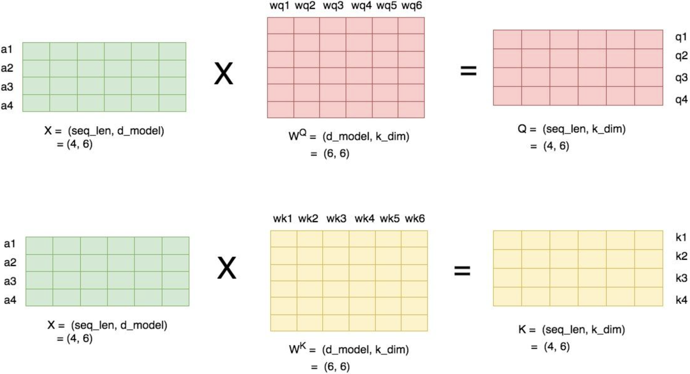

  * **当num\_heads = 2时attention层的情况**

  即对每一块权重，我们都沿着列方向维度切割一刀。此时每个`head`上的 $W_Q,W_K,W_V $的维度都变成`(d_model, k_dim//2)`。每个`head`上单独做矩阵计算，最后将计算结果`concat`起来即可。整个流程如下：

  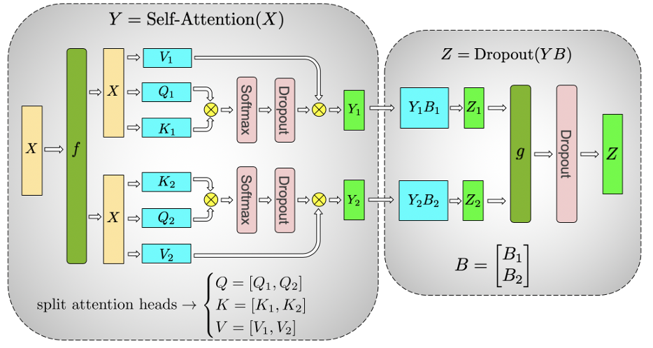

  所以，我们可以把每个头的参数放到一块GPU上，也可以把多个head放到一块GPU上，但是尽量保证head总数能被GPU个数整除。

  * **通信量分析**

  这里使用`N`来表示GPU的数量。有几块GPU，就把W按行维度切成几份。

  `self-attention`层在`forward`中做一次`AllReduce`，在`backward`中做一次`AllReduce`。总通讯量也是 $\Phi$，其中  $\mathrm\Phi=b*s*h$ 。

* **Embedding切分：**

  1. **输入层embedding**

  包括word embedding和positional embedding两部分。

  对positional embedding来说，max\_s本身不会太长，因此每个GPU上都拷贝一份，对显存的压力也不会太大。但是对word embedding来说，词表的大小就很客观了，因此需要把word embedding拆分到各个GPU上。

  * **输出层embedding**

  只有一个word embedding。

  > **必须时刻保证输入层和输出层共用一套word embedding**。而在backward的过程中，我们在输出层时会对word embedding计算一次梯度，在输入层中还会对word embedding计算一次梯度。在用梯度做word embedding权重更新时，我们必须保证用两次梯度的总和进行更新

* **Cross-entrop切分：**

  需要对输出层的Y1和Y2做一次All-Gather，把它们concat起来形成Y，然后对Y的每一行做softmax，就可得到对于当前位置来说，每个词出现的概率。接着，再用此概率和真值组做cross-entropy即可。但是All-Gather会产生额外的通讯量  $b∗s∗v $。当词表v很大时，这个通讯开销也不容忽视。针对这种情况，可做如下优化：

  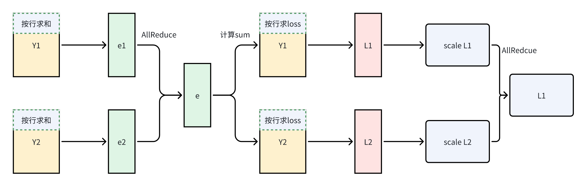

  * 每块GPU上，我们可以先按行求和，得到各自GPU上的`GPU_sum(e)`

  * 将每块GPU上结果做`AllReduce`，得到每行最终的 $sum(e)$，也就`softmax`中的分母。此时的通讯量为 $b∗s$

  * 在每块GPU上，即可计算各自维护部分的 $e/sum(e)$，将其与真值做`cross-entropy`，得到每行的loss，按行加总起来以后得到GPU上`scalar Loss`。

  * 将GPU上的`scalar Loss`做`AllReduce`，得到总Loss。此时通讯量为N。

  这样，我们把原先的通讯量从 $b∗s∗v $大大降至  $b∗s+N $

**一个TransformerBlock需要在前向和后向总共需要4个 all-reduce通信操作**

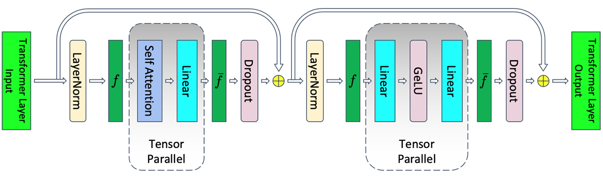

张量并行对AttentionBlock和MLP都进行了并行化，但是**没有对LN和dropout进行并行化**，不过后续在megatron3中用**序列并行**技术对这两部分进行了并行，这部分就不过多展开了

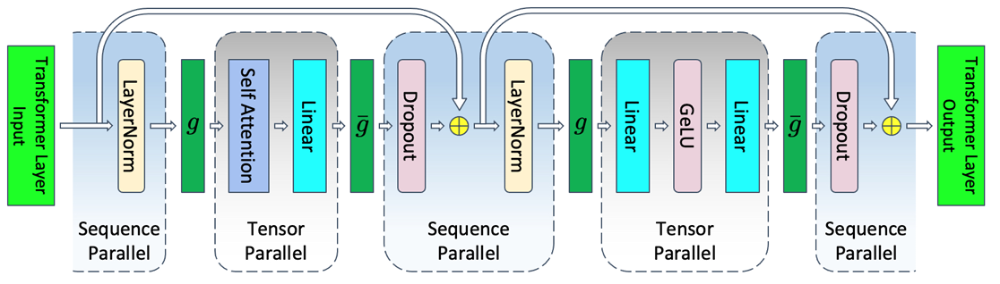

### **流水线并行 Inter-Layer Pipeline Parallelism**

* 将**网络按层切分，划分成多组，一张卡存一组。**&#x4F8B;如，前几层放在一个设备上，中间几层放在另 一个设备上，最后几层放在第三个设备上。这种方式可以在不同设备上并行执行不同的模型阶段，从而提高效率

```python
# 假设模型有8层 两张卡
======================  =====================
|  L0 | L1 | L2 | L3 |  | L4 | L5 | L6 | L7 |
======================  =====================
          GPU0                 GPU1
# 设想一下，当GPU0在进行（前向/后向）计算时，GPU1在干嘛？闲着
# 当GPU1在进行（前向/后向)计算时，GPU0在干嘛？闲着
# 为了防止”一卡工作，众卡围观“，实践中PP也会把batch数据分割成
# 多个micro-batch，流水线执行
```

目前主流的流水线并行方法包括了两种：**Gpipe和PipeDream**。与这两者相比，Megatron中的流水线并行实现略有不同，采用了Virtual Pipeline的方法。传统的流水线并行通常会在一个设备上放置几个模块，通过在计算和通信之间取得平衡来提高效率。然而，虚拟流水线则采取相反的策略。在设备数量不变的前提下，它将流水线阶段进一步细分，以承载更多的通信量，从而**降低空闲时间的比率，以缩短每个步骤的执行时间**

* **Gpipe：**&#x5C06;transformer layer 按层切分放到 Device1-4 上，并将一个 batch 切分成 8 个mini-batch。前向时，每个mini-batch 从 Device 1 流向 Device 4；反向时，在 Device4 上算出梯度并更新 Device4 对应层的参数，将梯度传向 Device3，Device3 做梯度计算和参数更新后传给 Device 2 等。这么做的劣势之一是空泡率(流水线空闲时间)比较高

  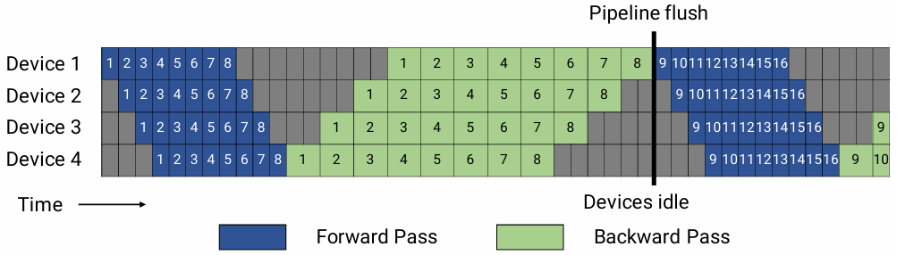

* **PipeDream：**&#x50;其相对与 G-pipe 的改进在内存方面， 空泡时间和 G-pipe 一致，但通过合理安排前向和反向过程的顺序，在 step 中间的稳定阶段，形成 1前向1反向 的形式，称为 1F1B 模式，在这个阶段，每个 Device 上最少只需要保存 1 份 micro-batch 的激活值，最多需要保存流水线阶段数份激活值，可以有效降低空泡占比

  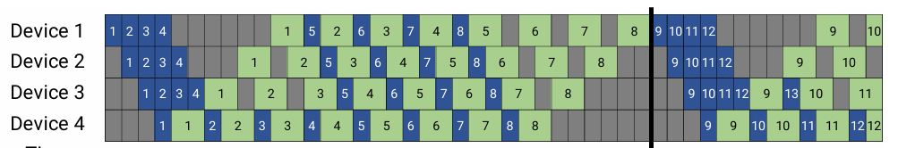

* **Virtual Pipeline：**&#x4F20;统的 pipeline 并行通常会在一个 Device 上放置几个 block，这是为了扩展效率考虑，在计算强度和通信强度中间取一个平衡。但 virtual pipeline 的却反其道而行之，在 device 数量不变的情况下，分出更多的 pipeline stage，以更多的通信量，换取空泡比率降低，减小了 step e2e 用时。virtual 若网络共16层（编号 0-15），4个Device，前述 G-pipe 和 PipeDream 是分成 4 个stage， 按编号 0-3 层放 Device1，4-7层放 Device2 以此类推。virtual pipeline 则是减小切分粒度，以 virtaul\_pipeline\_stage=2 为例，将 0-1 层放 Device1, 2-3 层放在 Device2，...，6-7 层放到 Device4，8-9 层继续放在 Device1，10-11 层放在 Device2，...，14-15 层放在 Device4，在 steady 的时候也是 1F1B 的形式。按照这种方式，Device之间的点对点通信次数(量)直接翻了 virtual\_pipeline\_stage 倍，但空泡比率降低了

  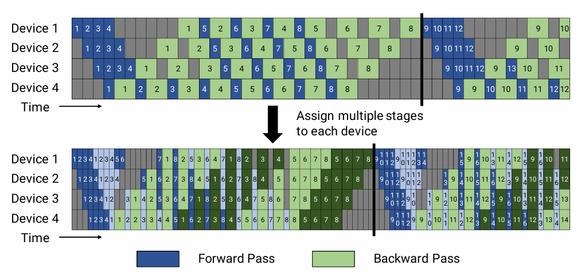

实际上**流水线并行和张量并行是正交互补的**，而且可以**同时存在**

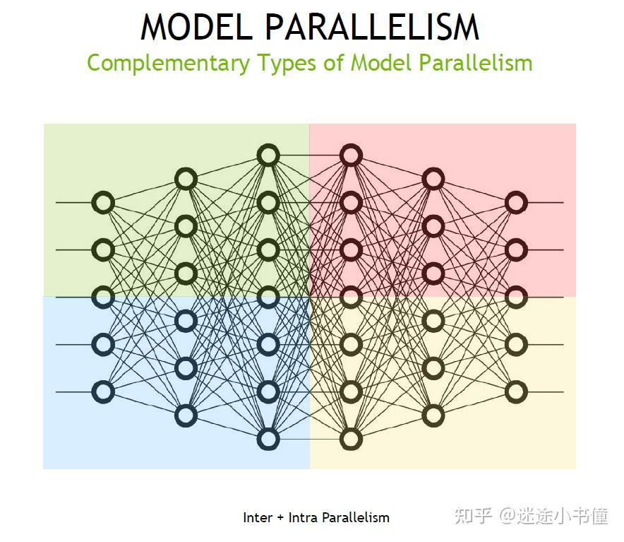

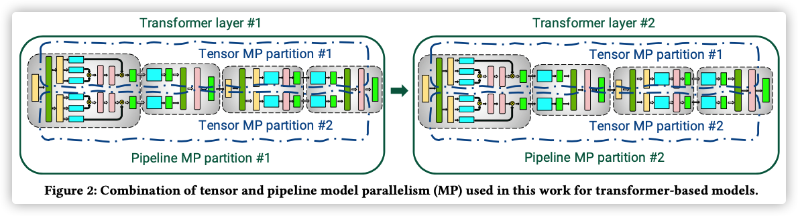

## **3D并行**

> **数据并行：**&#x8BA1;算效率高，**实现简单**
>
> * 显存效率：每张卡上都保存了**完整的模型、梯度、优化器状态**，因此显存效率不高
>
> * 计算效率：当增加并行度时，单卡的计算量是保持恒定的，可以实现近乎完美的线性扩展。但规约梯度的通信开销，与模型大小成正相关
>
> **张量并行：**&#x56E0;模型结构而异，**实现难度大**
>
> * 显存效率：随着并行度增加，**成比例地减少显存占用**。是减少单层神经网络中间激活的唯一方法
>
> * 计算效率：**频繁的通信**，限制了两个通信阶段之间的计算量，影响了计算效率，**计算效率很低**
>
> **流水线并行：**&#x901A;信成本最低
>
> * 显存效率：**减少的显存与流水线并行度成正相关**。但流水线并行不会减少每层中间激活的显存占用
>
> * 计算效率：成本更低的**点对点（P2P）通信**。通信量与流水线各个阶段边界的激活值大小成正相关
>
> **显存效率：**&#x6A21;型并行 > 流水线并行 > 数据并行
>
> **通信效率：**&#x6D41;水线并行 > 数据并行 > 模型并行

**混合数据并行(DP)、张量并行(TP)和流水线并行(PP)组成**

3D并行，四路张量并行，四路流水线并行，两路数据并行，32个worker

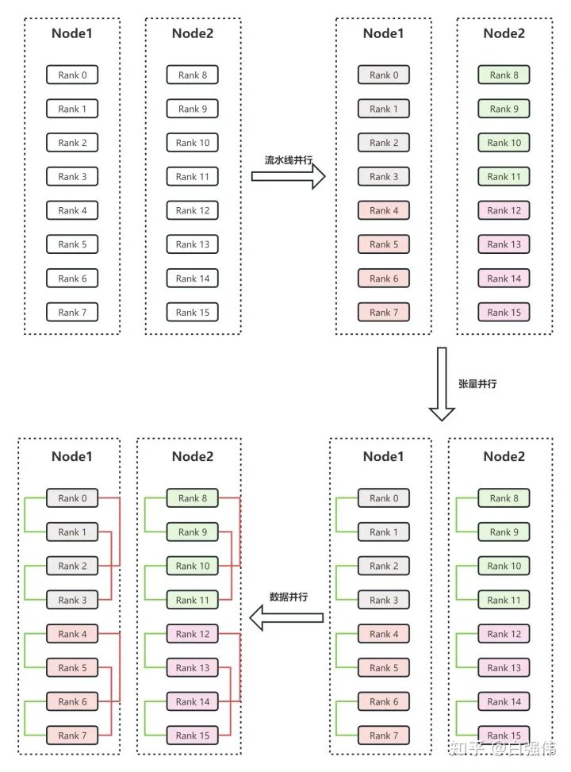

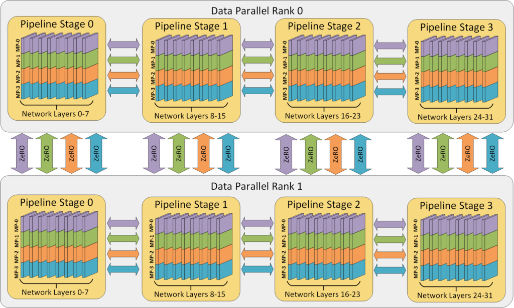

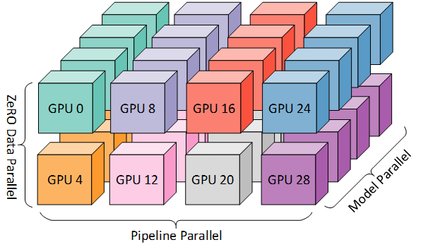

在LLaMA3的技术报告中，他们还使用了**4D并行的技术，除了PP，TP和DP，还加上了CP（context parallel）**

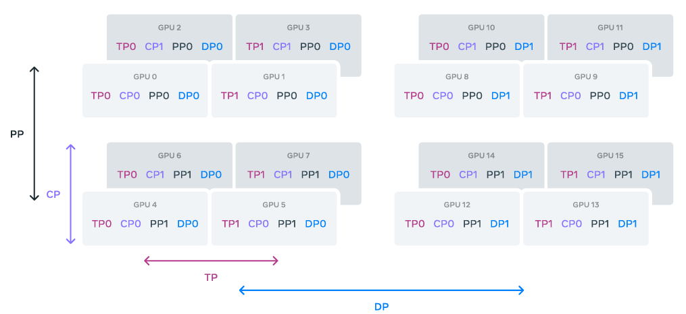

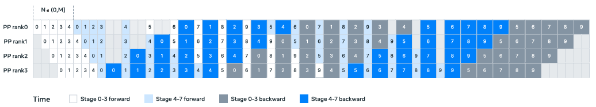

# **5.4.2 DeepSpeed**

## **混合精度训练**

> 训练的时候同时使用FP16和FP32两种精度的数据类型，主要在进行forward/backward的时候转FP16，参数更新的时候转FP32更新。这块可以**参考2.3.7章混合精度训练[ 2.3 预训练流程](https://kcnd4kn8i6ap.feishu.cn/wiki/RlTkwWHiwiavL9khjlncWsbunFb?fromScene=spaceOverview#share-YVrOdp4D0o7FDdxSgvNcm5Rvnxd)**

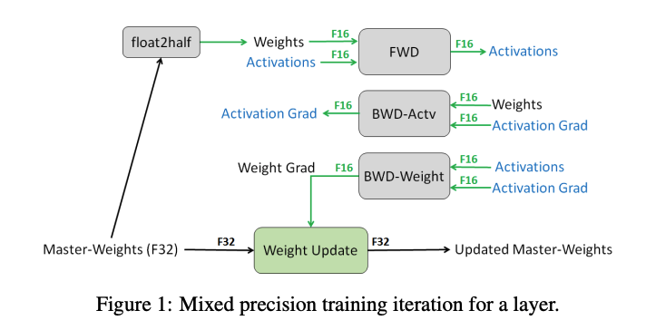

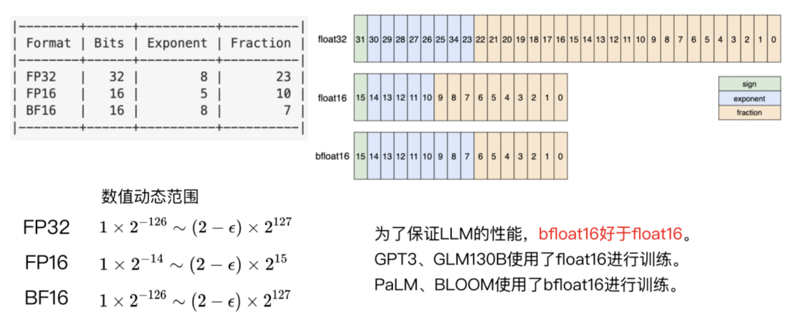

## **ZeRO 零冗余优化器**

> **ZERO的显存分类：**
>
> * **模型状态（model states）**: 模型参数（fp16）、模型梯度（fp16）和**Adam状态（fp32的模型参数备份，fp32的momentum和fp32的variance）**。假设模型参数量 Φ ，则共需要 2Φ+2Φ+（4Φ+4Φ+4Φ）=4Φ+12Φ=16Φ 字节存储，可以看到，Adam优化器状态占比 75% ，更新参数的时候还得加上FP32的梯度
>
> * **剩余状态（residual states）**: 除了模型状态之外的显存占用，包括激活值（activation）、各种临时缓冲区（buffer）以及无法使用的显存碎片（fragmentation），激活值可以用**activation checkpointing** 来大大减少
>
> **ZeRO三个阶段以及显存占用分析：**

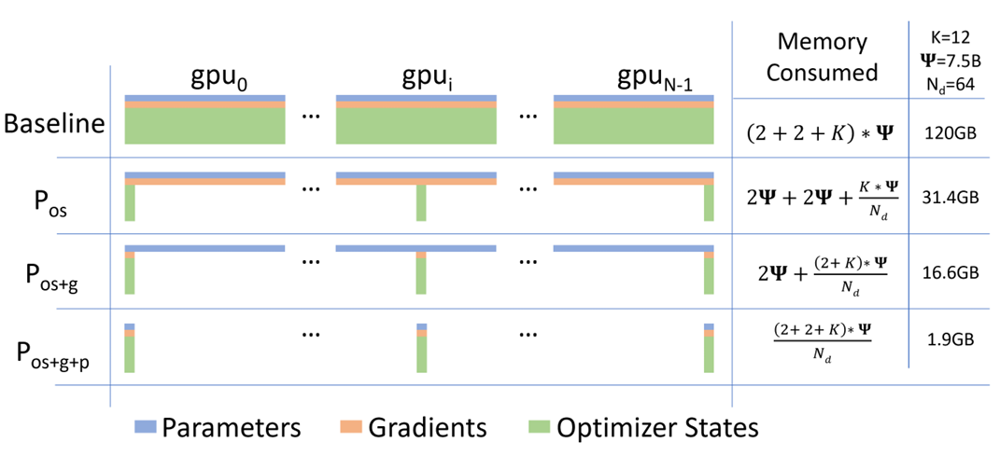

## **数据通信量分析**

**DeepSpeed ZeRO主要是数据并行**

* **传统数据并行：**&#x4F20;统数据数据并行在每一步（step/iteration）计算梯度后，需要进行一次**AllReduce**操作来计算梯度均值，目前常用的是**Ring AllReduce**，分为**ReduceScatter**和**AllGather**两步，**每张卡的通信数据量（发送+接受）近似为 4Φ&#x20;**

  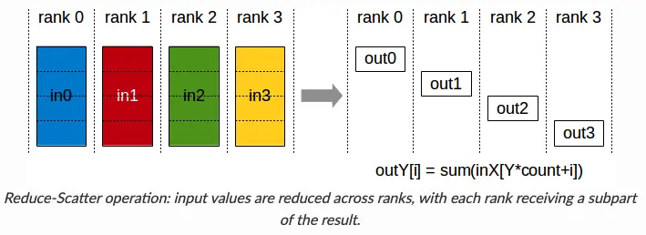

  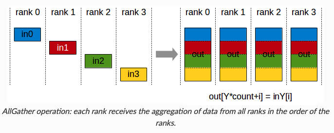

  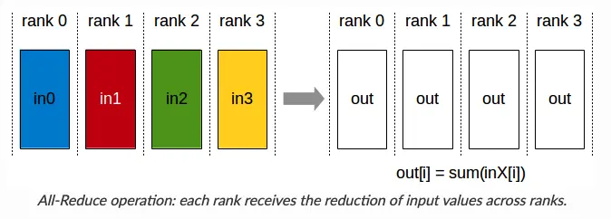

* **ZeRO1、2阶段(优化器状态分区、梯度分区)：**&#x540C;传统数据并行

  直接分析 $P_{os + g} $，每张卡只存储 $\frac{1}{N}$的优化器状态和梯度，对于gpu\_0来说，为了计算它这 $\frac{1}{N}$梯度的均值，需要进行一次Reduce操作，通信数据量是 $ 2*\frac{1}{N} \Phi \cdot N = 2\Phi$（发送+接收），然后其余显卡则不需要保存这部分梯度值了。实现中使用了bucket策略，保证 $ \frac{1}{N}$的梯度每张卡只发送一次.当 gpu\_0 计算好梯度均值后，就可以更新局部的优化器状态（包括 $ \frac{1}{N} \Phi$的参数），当反向传播过程结束，进行一次Gather操作，更新 $(1 - \frac{1}{N}) \Phi$的模型参数，通信数据量是 $ 2*\frac{1}{N} \Phi \cdot N = 2\Phi$（发送+接收）。全局来看，相当于用Reduce-Scatter和AllGather两步，和数据并行一致

  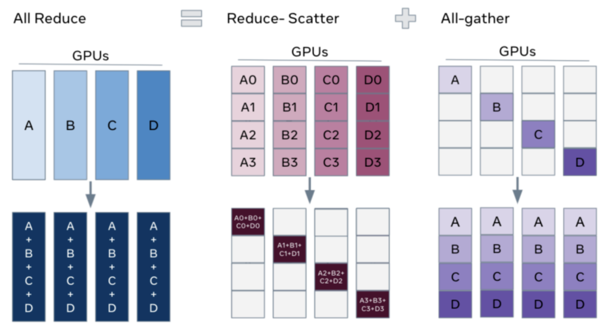

* **ZERO3：**&#x6BCF;张卡只存了 1/N 的参数，不管是在前向计算还是反向传播，都涉及一次Broadcast操作， **All gather&#x20;**+ **ReduceScatter + AllGather**通信量是**6Φ，是标准数据并行的1.5倍**

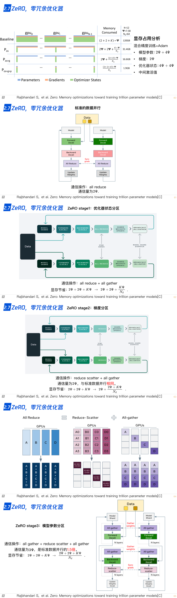

* **CPU卸载 ZERO-offload：不仅卸载数据，而且将计算卸载到CPU，显著减少GPU - CPU通信量**

  **CPU卸载应满足在以下三个方面最优：**

  * 减少CPU的计算量，避免CPU成为性能瓶颈

  * 最小化GPU - CPU之间的通信量，避免通信开销成为性能瓶颈

  * 在最小化通信量时，最大化GPU的显存节省

  **数据卸载：**

  * FP32的模型参数、优化器状态 --> CPU

  * FP16的模型参数、中间激活 --> GPU

  **计算卸载：**

  * 优化器更新模型参数 --> CPU

  * 前向传递和后向传递 --> GPU

  **通信量：**&#x46;P16的梯度、模型参数

  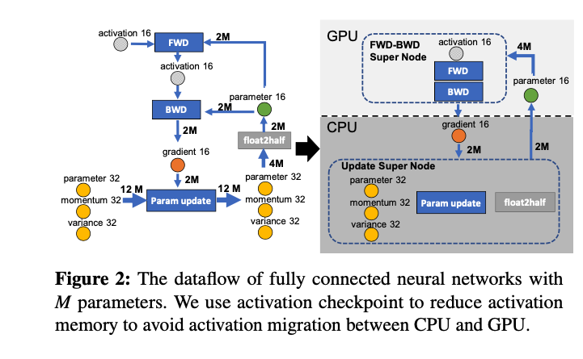

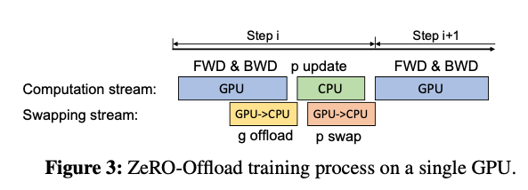

# **5.4.3 X-ray**

> **某大厂大语言模型分布式强化学习框架**，大语言模型、分布式、强化学习这三个关键字的出处分别是：
>
> * 大模型：Deepspeed/Megatron
>
> * 分布式：Ray
>
> * 强化学习：trlX

## **构建思想**

* 强化学习，特别是基于人类反馈的强化学习（RLHF）会涉及到多个模型之间的交互通信，模型之间的通信具有数据量较小、交互模式灵活性要求高的特点，适于使用 Ray 的 Actor Programming 编程范式，对模型间通信（**inter model communication**）进行实现。

* 大模型通常采用 3D 并行技术，它的前向、反向、生成过程都涉及到较大数据量的通信，通常采用 GPU NCCL 的集合通信（collective communication），开源的 Deepspeed、Megatron 均提供了模型并行方案，对模型内通信（**intra model communication**）进行了高效实现。

* 构建模型间通信和模型内通信的层次化通信平面，模型间：基于 Ray 的 Actor Programming 编程范式，实现高效的异步通信；模型内：集成 Megatron 的 TP/PP/DP 并行算法，集成 Deepspeed的 DP（Zero）并行算法，具备完整的 3D 并行加速方案。

* trlX 对 PPO 等算法进行了实现，且是 battle tested，因此我们借鉴了 trlX 的 PPO 算法流程。

* 引进 Deepspeed Inference 和 vLLM 推理加速方案，加速 Actor 的 token 生成效率，支持两种后端组合，Megatron 训练 + vLLM 推理，Deepspeed Zero3 训练 + Deepspeed Inference 推理。

## **大模型并行训练**

训练大模型，必然伴随着大数据，并行训练主要有以下几个技术：

1. 数据并行（Data Parallel，DP），在模型副本间分摊数据、反向时副本间交换梯度 <https://pytorch.org/tutorials/intermediate/ddp_tutorial.html>

2. 张量并行（Tensor Parallel，TP），做 Intra Layer 内的拆分，比如在 Transformer 结构上按照 Attention Heads 进行 N 等分，同时也会对 Feed Forward Network 进行 N 等分。[Megatron-LM: Training Multi-Billion Parameter Language Models Using Model Parallelism](https://arxiv.org/abs/1909.08053)

3. 流水线并行（Pipeline Parallel，PP），做 Inter Layer 间的拆分，比如 \[0，N) layers 在 GPU 0，\[N, 2N) layers 在 GPU 1 [GPipe: Efficient Training of Giant Neural Networks using Pipeline Parallelism](https://arxiv.org/abs/1811.06965)

4. ZeRO （Zero Redundancy Optimizer），思想上类似 Parameter Server 架构，GPU 间互为参数服务器，参数服务器根据不同模式存储着优化器参数、梯度、模型参数。ZeRO 本质上是数据并行，即一张卡上会发生一次完整的前向和反向。

[ZeRO: Memory Optimizations Toward Training Trillion Parameter Models](https://arxiv.org/abs/1910.02054)

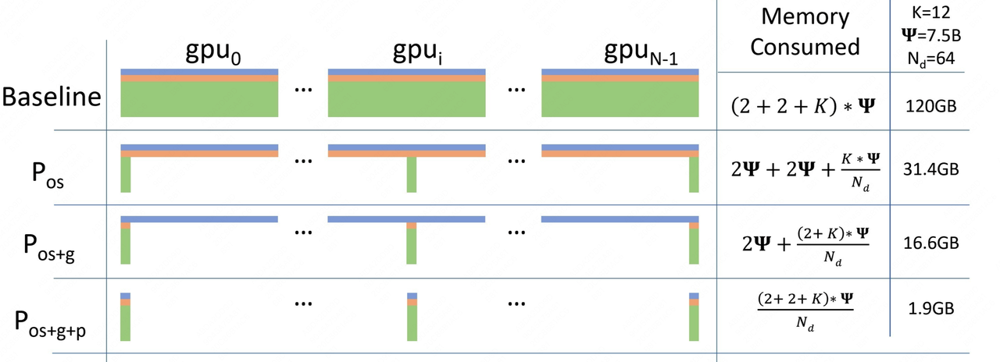

对以上并行技术进行综合就得到了 3D 并行：

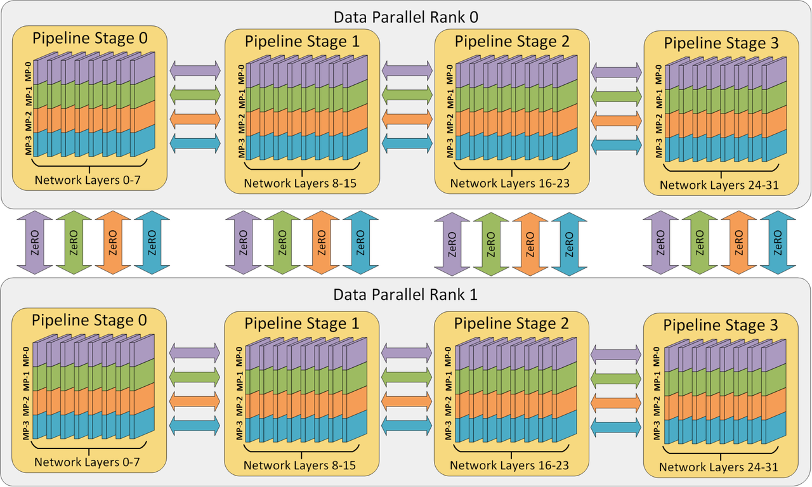

|             | 优点                          | 不足                             |
| ----------- | --------------------------- | ------------------------------ |
| Megatron-LM | 性能高，包含大量优化技巧，比如算子融合、通信计算并行化 | 支持模型类型较少，适配 Hugging Face 模型成本高 |
| Deepspeed   | 无缝支持 Hugging Face 的大量模型     | 原生 torch 算子实现，性能一般             |

## **Ray**

> “At OpenAI, we are tackling some of the world’s most complex and demanding computational problems. Ray powers our solutions to the thorniest of these problems and allows us to iterate at scale much faster than we could before.”  -- Greg Brockman, CTO and cofounder, OpenAI

Ray 是一个高性能分布式执行框架，提供了简单但通用的分布式编程抽象，Ray 处于一个较低的抽象层次，在其上可以构建各种分布式计算系统，

Ray 的编程前端包括 Python，Java，C++(experimental). Ray 的构建思想是去中心化的，这一点体现在分布式共享内存 object store，分布式引用计数，分布式调度。

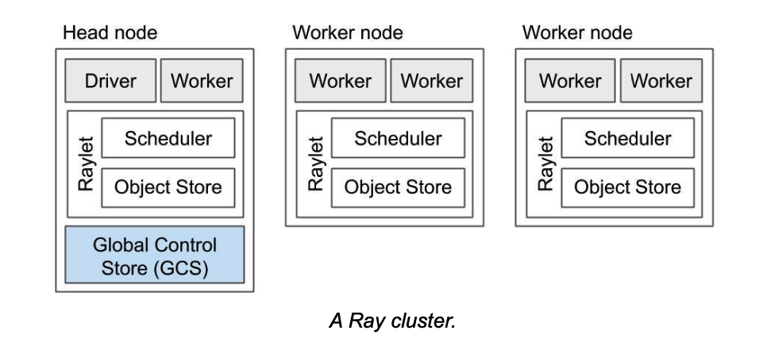

Ray 的编程抽象中 Actor 实现为一个 Python Class，代表的是一个 Long Running Python Process，我们可以通过调用 Class 的方法向 Ray Actor 发送请求。

```python
import ray

@ray.remote
class Counter:
    def __init__(self):
        self.value = 0

    def increment(self):
        self.value += 1
        return self.value

    def get_counter(self):
        return self.value

# Create ten Counter actors.
counters = [Counter.remote() for _ in range(10)]

# Increment each Counter once and get the results. These tasks all happen in
# parallel.
results = ray.get([c.increment.remote() for c in counters])
print(results)

# Increment the first Counter five times. These tasks are executed serially
# and share state.
results = ray.get([counters[0].increment.remote() for _ in range(5)])
print(results)
```

为了构建大语言模型分布式强化学习框架，我们抽象出 Workhorse 和 WholeModel 两个核心类：

* Workhorse，是一个 Ray Actor，其持有一张 GPU 卡，是模型的一个分片。

* WholeModel，是一个 Ray Actor，它代表了一个模型整体，是一个代理，而模型本身可能被 shard / replicate 到多机多卡上，它持有着多个 Workhorse。

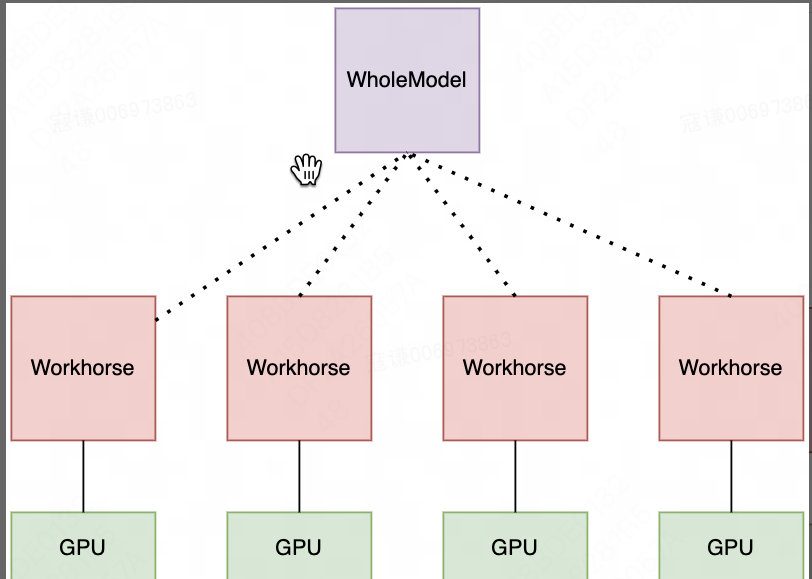

# **5.4.4 Accelerate**

> Accelerate 是一个为 PyTorch 用户设计的库，旨在帮助简化分布式训练和混合精度训练的过程。它提供了一种简单且灵活的方式来加速和扩展您的 PyTorch 训练脚本，而无需编写冗长的样板代码。使用户能够更轻松地利用大规模计算资源并加速模型训练过程。在**无需大幅修改代码的情况下完成并行化，支持DeepSpeed的多种ZeRO策略**
>
> * **代码效率高，**&#x652F;持无论是单机单卡还是多机多卡适配同一套代码
>
> * 允许在**单个实例上训练更大的数据集**：Accelerate 还可以使 `DataLoaders` 更高效。这是通过自定义采样器实现的，它可以在训练期间自动将部分批次发送到不同的设备，从而允许每个设备只需要储存数据的一部分，而不是一次将数据复制四份存入内存
>
> * **支持DeepSpeed：**&#x65E0;需更改代码，只用配置文件即可对DeepSpeed开箱即用

**分布式推理：**

当模型参数大到单张卡放不下时候（哪怕batchsize为1也会报显存不足的情况），这里就需要将大模型中的不同layer放到不同的GPU上，而每个GPU只负责其中一部分训练，当然数据在不同卡上流转的时候，都需要自动将数据放到对应的卡上

```python
from accelerate import dispatch_model
# device_map设置为自动的最方便了，不用自己设计把模型的layer分配到哪个GPU
model = dispatch_model(model, device_map="auto")
# 打印device_map
print(model.hf_device_map)
print(f'memory_allocated {torch.cuda.memory_allocated()}')
```

**分布式训练：**

下面是官方的例子，只需要更新几行代码即可开启分布式训练之旅啦！

* `accelerator = Accelerator()`实例化

* `accelerator.prepare`把我们的模型、数据、优化器等等都放进accelerate里面，让他帮我们操作

* `accelerator.backward(loss)`替换掉常用的`loss.backword()`

* 如果需要梯度裁剪，这里必须使用`accelerator.clip_grad_norm_()`

* 涉及到模型存储的时候，需要unwrap 下模型,因为在通过 prepare() 方法时，模型可能被 wrap 从而用于分布式训练

```python
import torch
import torch.nn.functional as F
from datasets import load_dataset
from accelerate import Accelerator
accelerator = Accelerator()
device = 'cpu'
device = accelerator.device
model = torch.nn.Transformer().to(device)
optimizer = torch.optim.Adam(model.parameters())
dataset = load_dataset('my_dataset')
data = torch.utils.data.DataLoader(dataset, shuffle=True)
model, optimizer, data = accelerator.prepare(model, optimizer, data)
model.train()
for epoch in range(10):
  for source, targets in data:
      source = source.to(device)
      targets = targets.to(device)
      optimizer.zero_grad()
      output = model(source)
      loss = F.cross_entropy(output, targets)
      loss.backward()
      accelerator.backward(loss)
      optimizer.step()
# 等待所有进程达到一定程度后再执行指令
accelerator.wait_for_everyone()
# 只在主进程中保存模型
if self._accelerator.is_main_process:
     unwrapped_model = accelerator.unwrap_model(model)
     accelerator.save(unwrapped_model,model_path)
     torch.save(unwrapped_model.state_dict, "./model/accelerate.pt")
```

# **5.4.5 Megatron和DeepSpeed后端实现的区别**

## **Deepspeed 后端**

> Deepspeed 后端采用 Zero3 数据并行方式进行的训练，同一个变量的参数被分片后放到不同的 GPU 卡上，如果直接进行生成，每一个变量都会触发一次 AllGather，生成会十分缓慢。我们可以首先通过一次 AllGather 进行参数的重分片，从 Zero3 的参数分片模式，切换到张量并行的参数分片模式。由于生成环节，不需要保存模型前向过程中的激活值，也不需要计算梯度，张量并行的并行度可以低于 Zero3 的数据并行度，从构建出多个推理数据并行组，进行并行生成，进一步加速生成。本方案采用的是 in-place 模式切换的方式，这些卡既用作训练也用作生成，在 Train Phase 和 Inference Phase 间来回切换

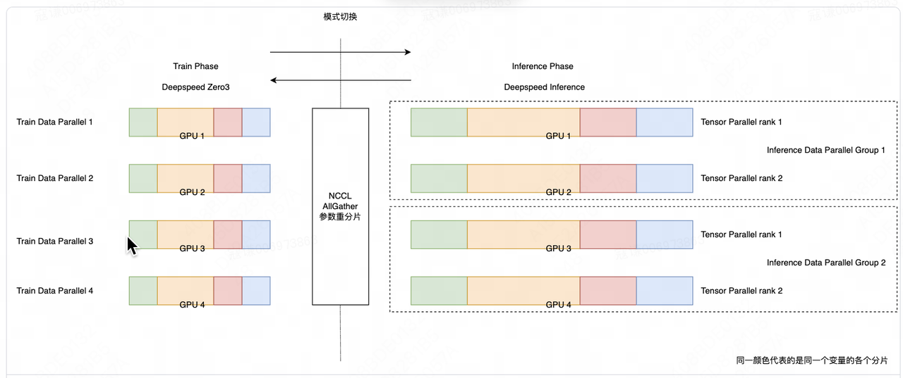

## **Megatron 后端**

> Megatron 后端采用 3D 并行方式进行的训练，对模型进行了张量维度和流水线维度的分片，放到不同的 GPU 卡上，直接生成的速度会十分缓慢。我们引入了 vLLM 开源推理引擎，vLLM 实现了张量并行和 PagedAttention，具有显存利用率高、推理吞吐高的特点。我们采用 NCCL P2P 通信将 Megatron 的参数重分片同步到 vLLM，并对 vLLM Attention 的内存布局进行调整，使之与 Megatron 一致，这样 vLLM 侧就可以 recv in place，省略掉参数 rearrange 的过程，加速参数重分片同步的过程

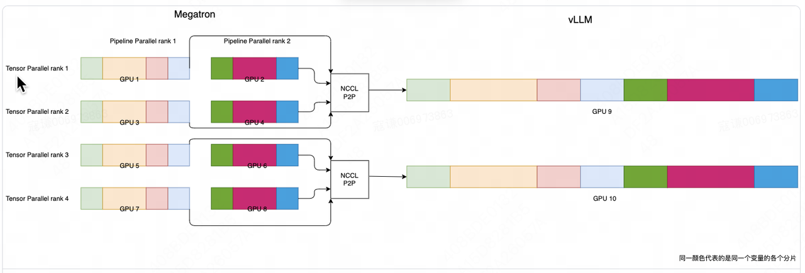
