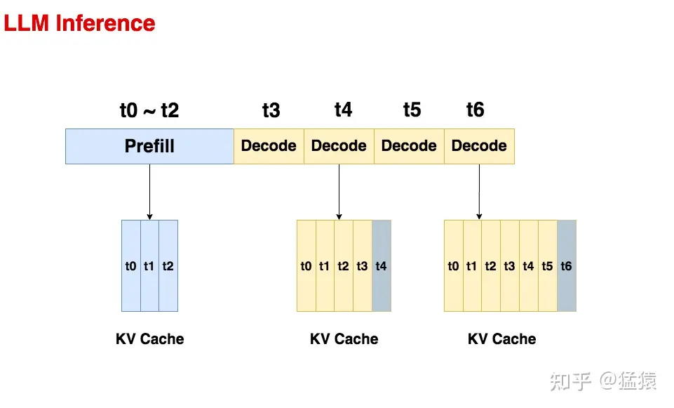
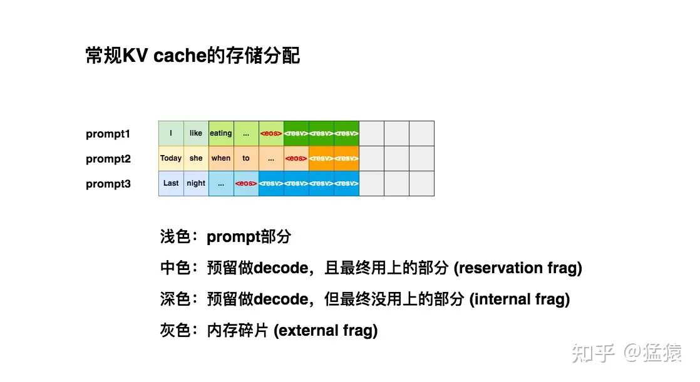
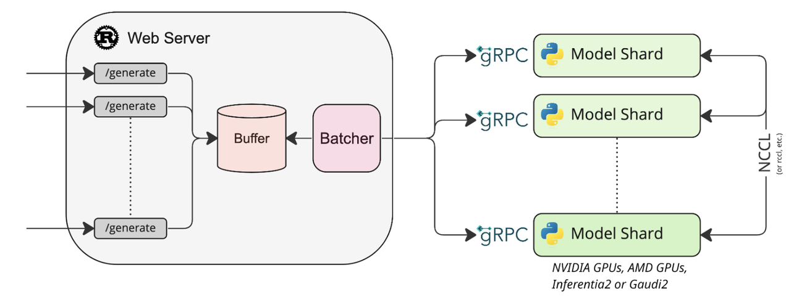

# **5.5.1 VLLM**

> vLLM是一个开源的大模型推理加速框架，通过PagedAttention高效地管理attention中缓存的张量，实现了比HuggingFace Transformers高24倍的吞吐量，其原理是基于PagedAttention的

## **Prefill**

预填充阶段。在这个阶段中，把整段prompt喂给模型做forward计算。如果采用KV cache技术，在这个阶段中我们会把prompt过 Wk,Wv 后得到的 Xk,Xv 保存在cache\_k和cache\_v中。这样在对后面的token计算attention时，我们就不需要对前面的token重复计算 Xk,Xv 了，可以帮助我们节省推理时间。

## **Decode**

> 生成response的阶段。在这个阶段中，我们根据prompt的prefill结果，一个token一个token地生成response。由于Decode阶段的是逐一生成token的，因此它不能像prefill阶段那样能做大段prompt的并行计算，所以在LLM推理过程中，Decode阶段的耗时一般是更大的

## **常规KV cache分配**

> **痛点**：由于推理所生成的序列长度大小是无法事先预知的，所以大部分框架会按照`(batch_size, max_seq_len)`这样的固定尺寸，在gpu显存上预先为一条请求开辟一块连续的矩形存储空间。然而，这样的分配方法很容易引起“gpu显存利用不足”的问题，进而影响模型推812理时的吞吐量

# **5.5.2 HuggingFace TGI**

从图中可以看出，若干个客户端同时请求Web Server的“/generate”服务后，服务端会将这些请求在“Buffer”组件处整合为Batch，并通过gRPC协议转发请求给GPU推理引擎进行计算生成。至于将请求发给多个Model Shard，多个Model Shard之间通过NCCL通信，这是因为显存容量有限或出于计算效率考虑，需要多张GPU进行分布式推理。

## **Prefill和Decode**

> 出于效率考虑，推理框架一般会将第1次推理(生成第1个Token)和余下的推理（生成其余Token）分别设计为Prefill和Decode2个过程。
>
> Prefill是将1个请求的Prompt一次性转换为KV Cache,并生成第1个Token的过程。假设Prompt的长度为*L*，MultiHead Attention的头数为*H*（Head），每个头的维度为*HS*（Head Size，暂不考虑GQA/MQA）。计算该过程时，输入Attention的Q、K、V维度均为`[L,H, HS]`,输入FFN的hidden（隐藏层向量）维度为`[L, H *HS]`。完成模型计算后，仅对最后一个Logit进行解码得到第1个生成的Token；中间过程计算得到的K、V将被保留在显存中（即KV Cache，用于避免后续Decode过程重复计算这些K、V导致算力浪费）。
>
> 从第2个Token开始，将上一次推理的输出（新生成的1个Token）作为输入进行一次新的推理，这就是Decode的过程。假设BatchSize=1，已生成的新子序列长度为*N，*&#x5728;计算该过程时，输入Attention的Q维度为`[1,H, HS]`, K、V维度则为`[L+N+1,H, HS]`，输入FFN的hidden维度为`[1, H*HS]`。完成模型计算后，对唯一的Logit进行解码得到新生成的Token；中间过程计算得到的K、V追加到KV Cache中（原因同上）。重复Decode流程持续生成Token直到模型输出\<EOS>(End of Sentence,表示输出结束的特殊Token)。
>
> 很明显，将推理分为Prefill和Decode2个流程，是考虑到生成第1个Token和其余Token时计算模式的差异较大，分开实现有利于针对性的优化。

## **Concatenate和Filter**

> 上述讨论仅在BatchSize=1的情况下讨论，从计算维度可以看出，Prefill环节在Prompt较长时计算强度足够高（可以这样“不准确地”理解：Prompt有*L*个Token，则Prefill相当于按BatchSize=*L*（单并发）进行推理），不会造成性能瓶颈；然而Decode环节的计算强度相对就低得多了（BatchSize=1（单并发）），对于NV新的A/H系列GPU而言是吃不满算力的。一个自然的想法是将多个请求合并成1个Batch进行推理，然而相对CV等经典应用场景，LLM进行Batch推理还有难点需要处理：
>
> 1. 对Late-joining Requests的处理。相对常见的CV业务而言，占用GPU推理的时间是漫长的（<1S VS 数秒到数十秒）。所以如果没有一个将新请求插入到推理Batch的机制，还是还像之前场景那样等前面的请求都推理结束后才进行推理，用户增加排队的时间太多，导致等待服务响应的时间过长，这是不可接受的；
>
> 2. 对Early-finished Requests处理。不同请求所生成的文本长度不一致，可能差别很大，并且不易预测。如果没有一个部分请求生成结束就提前返回的机制，那么只能等一个Batch内所有请求都完成生成后再返回生成结果，生成短文本的用户则需要多“陪跑”数秒到数十秒才能得到结果，这对于服务响应时间是不利的；
>
> 3. 对Canceled Requests的处理。用户随时可能在文本生成的过程中主动（例如输出文本明显不是期望的）或被动（例如网络中断）中止文本的生成。对于被中止的请求，如果没有一个及时从Batch中剔除的机制，那么这些请求只能继续生成直到结束，这会造成算力的浪费。
>
> Continuous Batching是处理上述难点的一种解决方案，核心思想是在两次推理的间隙插入新请求的Prefill、各请求的合并和剔除等操作，从而以动态Batch推理的方法提高GPU的利用率
