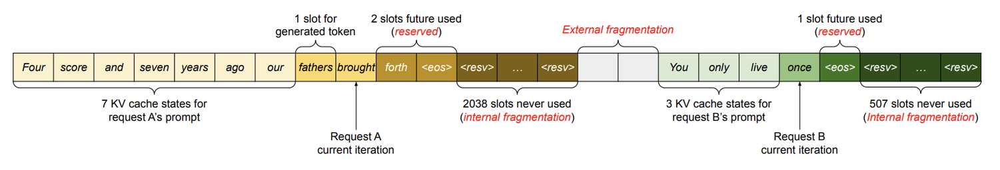
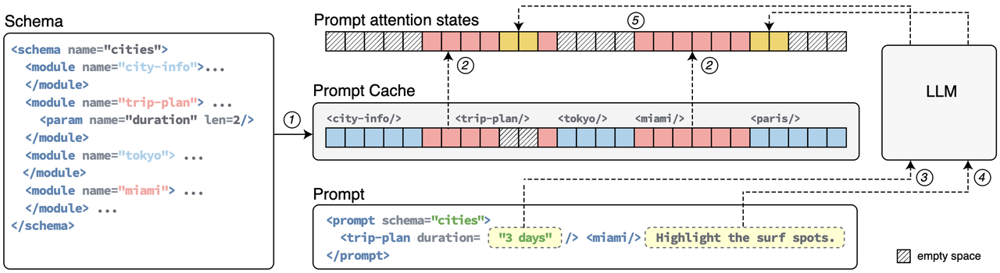

# **5.6.1 推理耗时**

## **推理机制**

**传统推理方式**：

逐 token 生成，无法并行

**过程建模两种方式**：

* 矩阵-向量乘&#x6CD5;**，**&#x4E00;个大矩阵（例如 8192x8192）乘以一个向量，得到另一个向量

* attention 计算，利用`KV-cache`进行推理

**瓶颈分析：浮点运算的主要来源**

* 矩阵-向量乘法对每个矩阵元素执行一次乘加运算（2 FLOPs）

* attention 对每个 key 执行一次乘加，对每个 value 执行一次乘加

## **时延计算**

> * 计算一个`token`所需要的数据量
>
>   * **数据总量：**&#x5982;果模型使用 `FP16` 作为矩阵元素的类型， 那每生成一个 token，需要加载到 ALU 上的数据量：
>
>   $7111M \ params * 2Byte/param = ~14.2 GB$。虽然计算下一个 token 时每个矩阵都可以复用，但硬件缓存的大小通常只有几十 MB， 矩阵无法放入缓存中，因此我们可以断定，这个生成（推理）过程的速度不会快于显存带宽。attention 计算需要读取当前 token 及前面上下文中所有 tokens 对应的 KV-cache， 所以读取的数据量取决于生成新 token 时模型看到多少前面的 token， 这包括：**System Prompt（通常对用户隐藏）、User Prompt、前面的模型输出、可能还包括长聊天会话中多个用户的提示词**
>
>   * **KV-cache ：**&#x5047;设是7B大小的LLM，它的KV Cache 为每层的每个 key 存储 8 个 128 元素向量，每层的每个 value 存储 8 个 128 元素向量，这加起来，每个 token 对应 32 \* 128 \* 8 \* 2 = 65K 个元素； 如果 KV-cache 使用 FP16，那么对于 token number P，我们需要读取 `P * 130 KB` 的数据。 例如， token number 1000 将需要从 KV-cache 读取 `130MB` 的数据。 跟 14.2GB 这个总数据量相比，这 130MB 可以忽略不计了

> * **计算时延：**&#x4F8B;如，在 NVIDIA `RTX 4090`（1008 GB/s）上，14.2GB (fp16) 需要 `~14.1ms` 读取，因此可以预期对于位置靠前的 token， 每个 token 大约需要 `14.1ms`（KV-cache 影响可以忽略不计）。如果使用 `8bit` 权重，需要读取 7.1GB，这需要大约 `7.0ms`。这些都是理论下限，代表了生成每个 token 的最小可能时间。

**参考来源**：《LLM inference speed of ligh&#x74;**》**

> **通俗来说**模型的预测时间可以近似理解为： $y=kx+b$，其中 b 是首个 `token` 的耗时，k 是后续每个 token 的耗时，x 是生成 `token` 的总数量。更具体的， $b$会是  $k$的十几倍或更多，和 `prompt` 的长度几乎呈正相关。这个耗时的近似估算和 `KV_cache` 机制有关，不熟悉的可以自行搜索。
>
> **这也就是为什么众人都知 `CoT` 效果好，众人又都不使用 `CoT`（但是现在o1、R1的大模型推理增强还是需要很多CoT数据的）**，因为我们可以几乎下断言“模型的生成速度和生成 `token` 数量呈正相关”，而 `CoT` 恰恰又引入了大量的生成 token

## **推理TPS计算**

> ### **如何计算TPS？**
>
> 部署 LLM 时，**每秒生成的token数量 TPS（Tokens Per Second）**&#x662F;衡量推理性能的重要指标：
>
> $\text{TPS}=\frac{生成的\text{token}总数}{总延迟时间（秒）}$
>
> 总延迟时间包括两个阶段：
>
> * **TTFT（Time To First Token）**：​从输入到生成第一个token的延迟时间，主要受prompt长度和模型结构影响，也就是在 **Prefilling 阶段**
>
> * **TPOT（Time Per Output Token）**：​生成每个后续token所需的平均时间，也就是在 **Decoding 阶段**
>
> **总延迟延迟可表示为&#x20;**$\text{Latency} = \text{TTFT} + \text{TPOT} \times \text{输出token数量}$
>
> 所&#x4EE5;**&#x20;TPS 可以表示为**​ $\text{TPS} = \frac{\text{输出token数量}}{\text{TTFT} + \text{TPOT} \times \text{输出token数量}}$
>
> ### **TPS估算方法**
>
> * **确定模型参数量**：**X B**
>
> * **计算Prefilling阶段的FLOPs：&#x20;**$\text{FLOPs}_{\text{prefill}}=\text{2×Batch Size×Prompt Length×模型参数量}$
>
> * **计算Decoding阶段的FLOPs**：​使用公式： $\text{FLOPs}_{\text{decoding}} = 2 \times \text{Batch\_size} \times \text{Completion Size} \times \text{模型参数量} $
>
>   > 矩阵-向量乘法对每个矩阵元素执行一次**乘加运算（2 FLOPs）**
>
> * **估算TTFT和TPOT**：​将上述 **FLOPs 除以GPU的实际算力（考虑利用率，比如 A100 312 TFLOPs，60%利用率，实际算力就是 312 x 60% = 187 TFLOPs）即可得到TTFT和TPOT**
>
> * **计算TPS**：​使用估算的TTFT和TPOT计算TPS
>
> 实际 FLOPs 计算还会受到模型具体实现、硬件架构（如GPU的并行计算能力）以及优化技术（如Flash Attention）的影响

# **5.6.2 首token时延优化**

## **首Token时延**

> 在LLM推理过程中，生成首`token`是计算密集任务任务，生成首`token`阶段也称为`prefill phase`或`context phase`，生成首`token`的时间与处理输入给大模型的`Prompt`的计算量有关，与`Prompt`长度直接相关。例如，在`Prompt`长度相对较长的情况下再考虑到等技术优化，生`FlashAttention2`成首`token`的时间与输入`Prompt`的长度近似成线性关系
>
> $ 首个 token 的推理延迟\geq- \frac{模型浮点计算量(FLOPs)}{GPU 半精度浮点算力}$
>
> $后续每个 token 的推理延迟 \geq- \frac{模型参数量(字节数)}{GPU HBM 带宽}$

## **优化System Prompt**

> `System Prompt Caching` 基本思想是对System Prompt部分进行一次计算，并缓存其对应的Key和Value值（例如，存放在GPU显存中），当LLM推理再次遇到相同的（甚至部分相同的）`System Prompt`时，则可以直接利用已经缓存的`System Prompt`对应的Key和Value值，这样就避免了对于System Prompt的重复计算。

**第一种形式**，Prefix Sharing，适用于 “Prompt = System Prompt + User Prompt”这样的场景，其中System Prompt就是Prefix

**第二种形式**，Prompt Cache，属于相对高级的用法，是对整个输入Prompt对应的Key和Value值进行Caching操作，不局限于shared prefix

> 特别地，对于多轮对话场景，以及基于LLM的AI Agent应用场景，上述第二种方式，即Prompt Cache，可以支持Session Prompt Cache。在一个多轮对话session里，输入到LLM的Prompt，会携带多轮对话历史，涉及到很多重复计算。通过 Session Prompt Cache 可以显著减少不必要的重复计算，节省GPU资源，提高对话响应速度和用户体验
