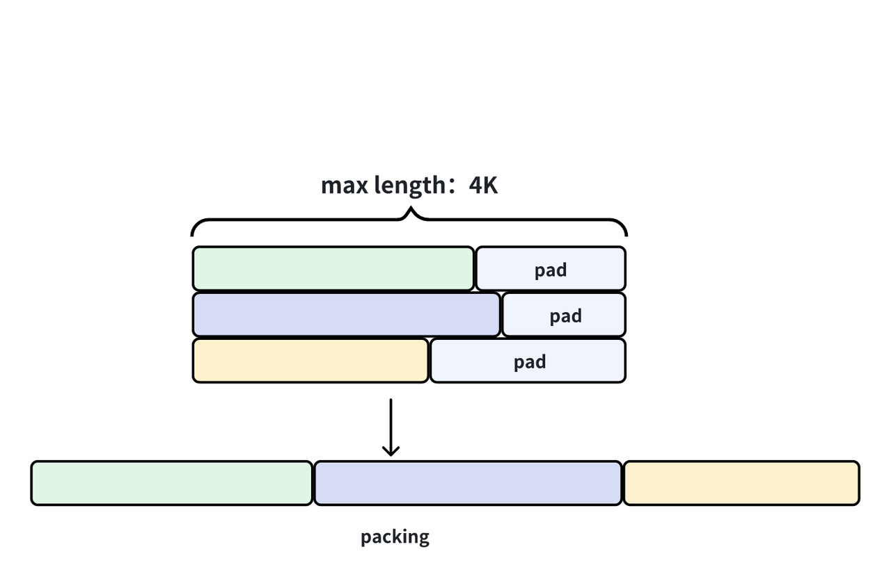
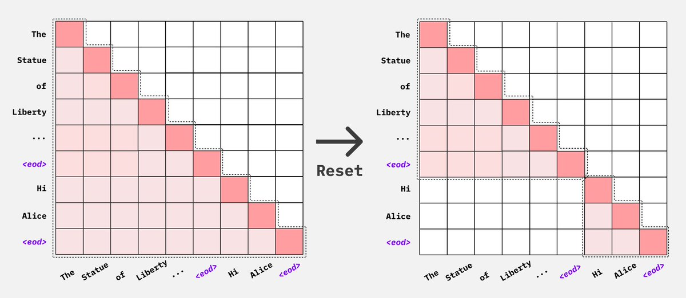

> # **Why：**
>
> 在传统的模型训练中，通常会使用一个固定长度的输入序列。但实际数据中的文本片段长度各不相同，如果直接将短文本用 `[PAD]` token 填充到固定长度，会造成大量无效计算
>
> # **What：**
>
> Packing 是指将多个短的序列拼接成一个长序列，使得每个 batch 的 token 数更接近最大长度限制，**最大化 token 利用率**。实际上，做packing时既可以按照batch内最长句子填充，也可以按照模型最长输入长度填充

# **5.7.1 预训练阶段**

> 预训练阶段的packing大部分就是传统的直接拼接，不同来源的文本使用特殊字符隔开，例如`[sep]`的特殊token
>
> 当然，如果约到超长文本则会面临阶段的问题，其实我们允许部分过长的文本在预训练前期（非长文本继续预训练）出现这种阶段现象，但是占比不能过过高，那么如何解决呢？
>
> 一个很好的思路是，短文本和长文本各自packing，而且短文本文本的pack大小等于原来的`max length`（比如4k），长文本的pack大小为128k，然后再将短文本的再多进行一次pack就可以解决了



# **5.7.2 微调阶段**

> ### **不做packing的高效做法**
>
> 这里的高效主要还是体现在多轮对话场景下。
>
> 由于CLM采用下三角形式的attention mask，其结构确保每个token仅能关注自身及之前的token。因此，在预测答案一下token时，模型只会接收到该token之前的信息，后续的内容无法被访问。基于这一机制，我们可以在一次前向计算中获取整个多轮对话中所有response的logits，随后在计算loss时，仅保留response部分的loss，而忽略掉prompt部分。

> 咱们来看看Llama Factory是如何优化的。
>
> 和之前直接使用贪心搜索算法不同，得益于目前transformer支持`4D mask`机制，目前最新的实现方式新增了**对`attention mask`进行区分，不同文档使用不同的标识符，然后padding部分用0标识。**
>
> 具体的实现细节如下所示：

```python
if len(packed_input_ids) != data_args.cutoff_len: raise ValueError("The length of packed example should be identical to the cutoff length.")
model_inputs["input_ids"].append(packed_input_ids)
model_inputs["attention_mask"].append(packed_attention_masks)
model_inputs["labels"].append(packed_labels)model_inputs = {"input_ids": [], "attention_mask": [], "labels": []}
# 这里将长度排序，然后贪心检索最大长度加入，直到要超过cutoff-len
# 得到一个二维数组，里面是是每组数据包含的数据长度
# 如： [[2048],[1024,1023],[1000,1000,41],[500,500,500,500,40]]
knapsacks = greedy_knapsack(lengths, data_args.cutoff_len)
for knapsack in knapsacks:
    packed_input_ids, packed_attention_masks, packed_labels = [], [], []
    for i, length in enumerate(knapsack):
        index = length2indexes[length].pop()
        packed_input_ids += batch_input_ids[index]
        packed_labels += batch_labels[index]
        # 这里分为两种做法
        if data_args.neat_packing:
            packed_attention_masks += [i + 1] * len(batch_input_ids[index])  
        else:
            # 这里还是按照之前全部置为1
            packed_attention_masks += [1] * len(batch_input_ids[index])

    # 这里把padding位置的loss忽略掉，labels设置为IGNORE INDEX
    if len(packed_input_ids) < data_args.cutoff_len:
        pad_length = data_args.cutoff_len - len(packed_input_ids)
        packed_input_ids += [tokenizer.pad_token_id] * pad_length
        packed_labels += [IGNORE_INDEX] * pad_length
        if data_args.neat_packing:
            packed_attention_masks += [0] * pad_length
        else:
            packed_attention_masks += [1] * pad_length  # more efficient flash_attn

```

> ### **什么是4D mask？**
>
> 在模型内部，二维张量掩码会变成四维张量，形状为`[batch_size, heads, input_ids_length, total_sequence_length]`。这种格式允许更细致的注意力策略，例如因果解码，它使用一个由 1 组成的下三角矩阵，有时如果存在键值 (KV) 缓存，还会辅以一个由 1 组成的矩形矩阵。
>
> 对batch中每一条数据进行上面的操作，然后复制num\_heads份，就可以构成4D mask，维度是\[bs, num\_heads, seq\_len, seq\_len]。



