# **6.1.1 In-Context Learning 上下文学习**

## **ICL概念原理**

> 在前面讲GPT系列模型的时候，提到GPT使用的Few-shot Learning，这就属于ICL的一个部分
>
> In-context Learning **允许模型在给定的上下文中进行学习和推理，而无需真正更新模型参数**。这种方法充分利用了模型的预训练知识，并通过在推理阶段提供相关的上下文信息来生成或调整模型输出

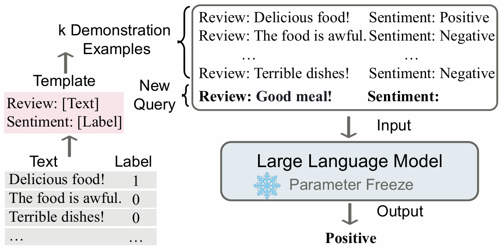

> ### **核心概念**
>
> * **上下文依赖：**&#x49;CL的核心在于**利用模型的上下文理解能力来完成任务**，模型根据输入的上下文信息(包括示例和任务描述)进行推理，而**不是依赖于显示的训练过程**
>
> * **无参数更新**：ICL**不涉及对模型实际参数的修改**，只是根据提供的上下文信息调整其生成或分类行为
>
> * **动态适应：**&#x6A21;型在推理时会动态地适应给定的上下文，通过分析上下文中的示例或指示来生成合适的输出，这种适应能力来源于模型在预训练阶段学到的通用知识
>
> ### **工作原理**
>
> * **提示词和示例：**&#x49;CL常通过提示词来引导模型的生成过程，提示词通常包括任务描述，问题陈述或请求模型执行的操作。在少样本学习(Few-Shot Learning)中，提示词可能包括一些示例输入和输出，帮助模型理解如何处理类似的任务
>
> * **上下文提供**：在ICL中，任务描述用于告诉模型要完成的任务，例如：生成一个关于人工智能的总结。提供几个示例输入和输出对，可以帮助模型理解特定任务的模式或要求，例如：给出一些翻译示例来帮助模型进行语言翻译
>
> * **推理和生成：**&#x6A21;型根据提供的上下文进行推理，生成与上下文相关的响应或输出。在ICL中，生成的文本基于模型对上下文的理解，以及预训练中学到的知识
>
> ### **ICL形式化定义**
>
> $\text{LLM}(I, f(x_1, y_1), \ldots, f(x_k, y_k), f(x_{k+1}, \_)) \rightarrow \hat{y}_{k+1} $，其中 $I $是任务定义， $f(x_i, y_i) $表示示例， $x_{k+1}$是输入，\_\_是要预测的answer

**实例理解：**

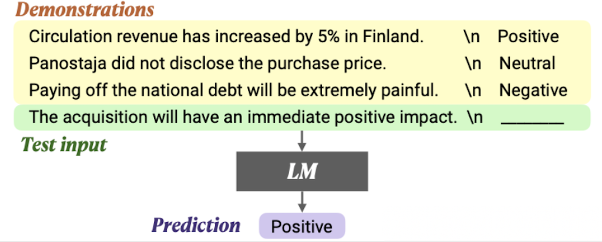

## **ICL示例设计**

1. **示例选择**

   1. **启发式方法：**

      * **基于语义相似度：**&#x4F7F;用BERT类模型作作为编码器，选取其CLS embedding的输出向量作为训练样本的文本表征。使用KNN、欧式距离，选取与当前test sentence语义最近的10个训练个样本，作为demonstration

        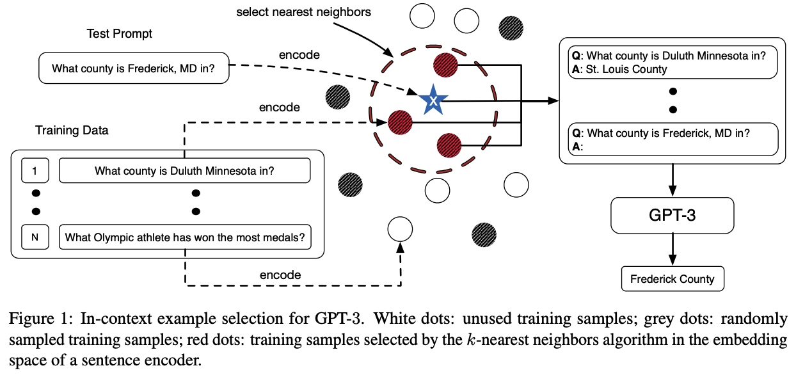

      * **基于多样性：**&#x7528;来挑选demostration的训练数据和测试数据有时候可能会存在较大的分布差异，这个时候很难通过KNN等基于相似方法来挑选合适的demostration。从多样性的角度去挑选demostration，在原有相似度的基础上，考虑不同demostration之间的差异性。当两个demostration高度语义相似时，剔除其中一个

        **paper：*Diverse Demonstrations Improve In-context Compositional Generalization***

        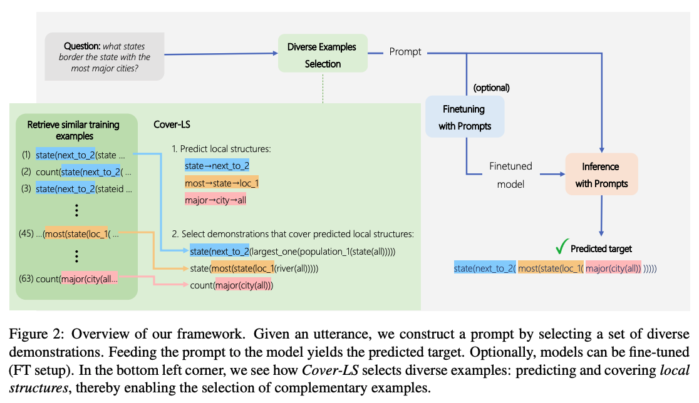

   2. **LLM-based方法：直接用LLM来生成Demonstration**

      * **基于prompt召回：**&#x5C06;训练集中的每一个样本都当做示例连同input一块输入模型，通过这样得到output的概率大小来评估当前示例的好坏，为了缓解数据集过大导致的计算成本，可以利用BM25、SBERT预先对训练集召回，筛选候选示例集，然后进行评估，选取最高分的k条示例作为正例集，最低分k条作为负例集，使用对比学习的方法，训练retriever。同时生成一个针对输入编码的Utterance encoder和针对示例编码的prompt encoder。基于训练好的retriever，结合Faiss相似度计算框架，找出输入input对应最佳的demostrations

        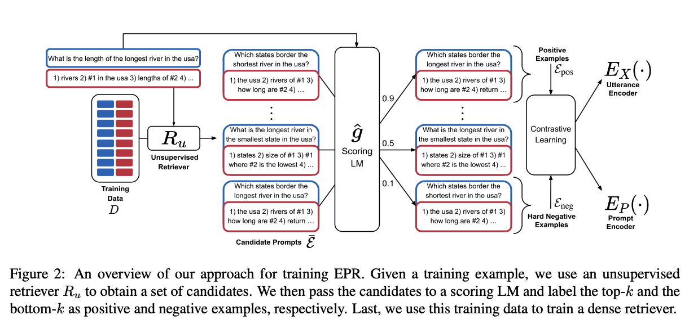

        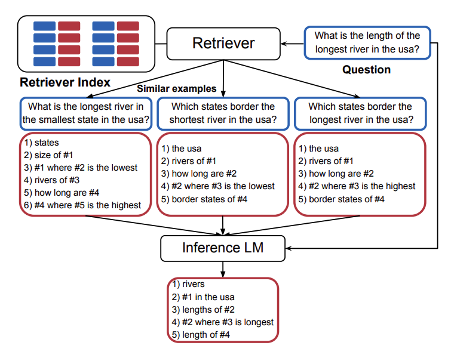

      * **基于主动学习/强化学习：**&#x4E3B;动学习的思路是从样本库中选择适合的样本，提供给标注者标注。而示例选择问题与主动学习的思路有点类似，示例选择目标是选择适合的示例，提供给prompt，以使测试样本得到较高的准确率。由于demostrations的可选空间，与样本库（一般是训练集）呈指数关系，要枚举所有的demostrations组合，并不现实。因此可以把示例选择看作是一个序列决策问题，这样就可以基于马尔可夫决策过程（MDP），使用强化学习（RL）的方法去解决。state定义为当前时刻的demostration，即(xi,yi)，action定义为样本库中所有的样本和一个停止信号标识（┴），reward定义为LLMs利用state与当前action构成的demostrations，在验证集中的准确率。即，prompt是由state+action构造成的demostrations，加上验证集中的样本输入一起组成。通过对比验证集标签与LLMs输出，可计算准确率。然后再选一种RL算法就OK了

      * **基于自生成的：**&#x5229;用LLMs自身的能力，生成合适的demonstration。目的是最小化对外部样本库的依赖。整个过程分为两个阶段：借助预先设计的prompt，让LLMs生成k个合适的示例；在原来输入的基础上，加入第一阶段生成的示例，让LLMs预测最终结果

        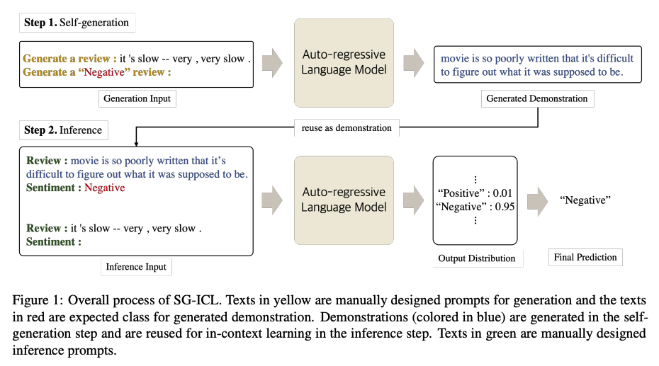

2. **示例格式**

   在完成demonstrations的选择后，下一步就是将demonstrations整合成一个自然语言Prompt

   ***Cross-task generalization via natural language crowdsourcing instructions***

   这篇论文提出了一个新的跨任务instruction数据集。他们使用总包的方式，按照规定的instruction格式，对多个开源数据集进行改造。针对每一个promt，其格式包含：

   * **title:** 包含一个high-level的任务描述，以及其相关技能，如question generation，answer generation等

   * **prompt:&#x20;**&#x5355;独的文本命令，一般出现在输入示例之前

   * **definition:&#x20;**&#x6307;令的补充内容，更加详细地描述指令的具体执行细节

   * **things to avoid:&#x20;**&#x5305;含模型应该避免的内容，或规则

   * **emphasis and caution:&#x20;**&#x8B66;告或反对的内容

   * **positive examples:** 提供一个类似系统期望的输入、输出例子，使得众包人员更好地理解任务

   * **negative examples:**&#x63D0;供一个类似系统期望的输入、输出的负例，让众包人员尽量避免

   * **reason:&#x20;**&#x89E3;释为什么例子是positive或negative

   * **suggestion:&#x20;**&#x5305;含一些建议，主要用于指导如何将负例改成正例。

   模型在经过上述instruction数据集微调后，能在unseen样本上，达到较好的生成效果。在新样本推断时，将demonstrations加入到task instances即可


   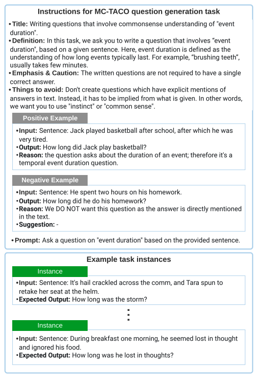

3. **示例顺序**

   在整合prompt的时候，各个示例放入的顺序也很关键，排序的方法既有不需要训练的，也有根据示例跟当前输入距离远近进行排序的，也可以根据自定义的熵指标进行重排

## **ICL的挑战**

> * **长上下文问题：**&#x5927;规模模型对上下文长度有一定的限制，处理非常长的上下文可能会受到影响
>
> * **选择适当的上下文：**&#x786E;定哪些信息应该包含在上下文中，以及如何组织这些信息，是ICL的关键挑战之一
>
> * **输出一致性：**&#x5728;不同上下文中，模型生成的内容可能会有所不同，确保生成结果的一致性和准确性是需要关注的问题

# **6.1.2 Chain-of-Thought 思维链**

## **CoT概念原理**

**Chain-of-Thought(CoT)是一种改进的Prompt技术**，目的在于提升大模型LLMs在复杂推理任务上的表现，对于复杂问题尤其是复杂的数学题大模型很难直接给出正确答案。如算术推理（arithmetic reasoning）、常识推理（commonsense reasoning）、符号推理（symbolic reasoning）。COT通过要求模型在输出最终答案之前，显式输出中间逐步的推理步骤这一方法来增强大模型的算数、常识和推理能力，简单但有效。通过让**大模型逐步参与将一个复杂问题分解为一步一步的子问题并依次进行求解的过程可以显著提升大模型的性能**。区别于传统的 Prompt 从输入直接到输出的映射 \<input——>output> 的方式，CoT 完成了从输入到思维链再到输出的映射，&#x5373;**&#x20;\<input——>reasoning chain——>output>**

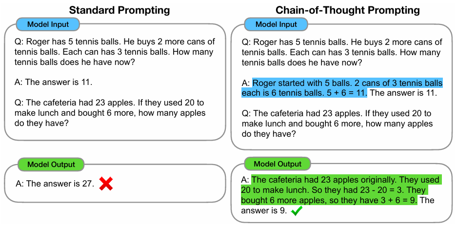

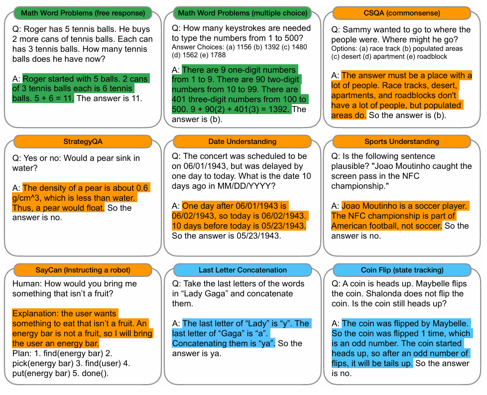

一个完整的包含 CoT 的 Prompt 往往由**指令（Instruction），逻辑依据（Rationale），示例（Exemplars）三部分组成**

* **指令：**&#x7528;于描述问题并且告知大模型的输出格式

* **逻辑依据：**&#x6307; CoT 的中间推理过程，可以包含问题的解决方案、中间推理步骤以及与问题相关的任何外部知识

* **示例：**&#x6307;以少样本的方式为大模型提供输入输出对的基本格式，每一个示例都包含：问题，推理过程与答案

以**是否包含示例**为区分，可以将 CoT 分为 **Zero-Shot-CoT 与 Few-Shot-CoT**：

* **Zero-Shot-CoT&#x20;**&#x4E0D;添加示例而仅仅在指令中添加一行经典的“Let’s think step by step”，就可以“唤醒”大模型的推理能力。其实 Zero-shot-CoT 是一个 pipeline。也就是说“Let's think step by step”这句话，只是通过这个 prompt 让LLM 尽可能生成一些思考过程，然后再将生成的 rationale（理由） 和 question 拼在一起，重新配合一个answer 指向的 prompt 如“The answer is ”来激励模型生成答案。从技术上讲，完整的零样本思维链（Zero-shot-CoT）过程涉及两个单独的提示/补全结果。在下右图中，左侧生成一个思维链，而右侧接收来自第一个提示（包括第一个提示本身）的输出，并从思维链中提取答案。这个第二个提示是一个自我增强的提示

  .png>)

  .png>)

  “Let's think step by step”是被验证过有效的，其他prompt效果没有这个好

  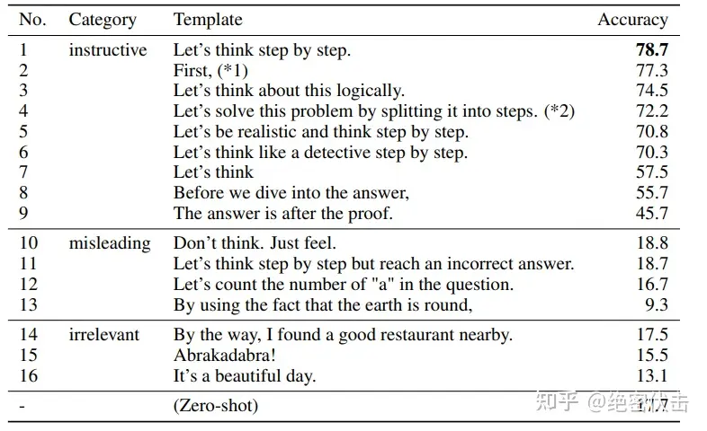

* **Few-Shot-Cot&#x20;**&#x5219;在示例中详细描述了“解题步骤”，让模型照猫画虎得到推理能力

## **CoT改进方法**

* **CoT-SC：Self Consistency**，主要改进是对答案进行了多数投票（majority vote），是生成多个思路链，然后取多数答案作为最终答案，并且发现其可以显著地提高思维链方法的性能。在下面的图中，左侧的提示是使用少样本思维链范例编写的。使用这个提示，独立生成多个思维链，从每个思维链中提取答案，通过“边缘化推理路径”来计算最终答案。实际上，这意味着取多数答案

  .png>)

* **ToT：**&#x54;ree-of-Thoughts，思维树。其做法是通过树（tree）来建模 LLM 推理过程。这能让模型使用不同的思维路径，并能提供全新的功能，比如基于不好的结果反向回溯推理过程。不幸的是，由于 ToT 方法为思维过程强加了严格的树结构，所以会极大限制 prompt 的推理能力

  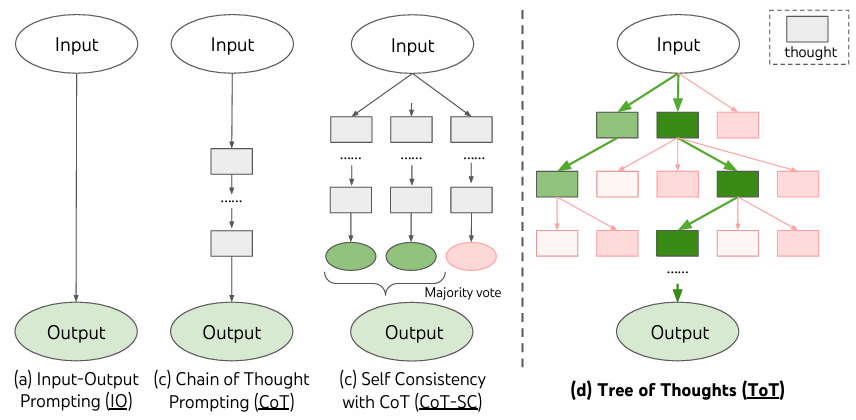

* **GoT：**&#x47;raph-of-Thoughts，思维图。在 GoT 中，一个 LLM 思维会被建模成一个顶点，顶点之间的依赖关系则建模为边。使用 GoT，通过构建有多于一条输入边的顶点，可以将任意思维聚合起来。整体而言，GoT 使用的图抽象方法可无缝地将 CoT 和 ToT 泛化到更复杂的思维模式，而且这个过程无需更新模型。相比于 ToT 增加了聚合操作，能够实现分治

  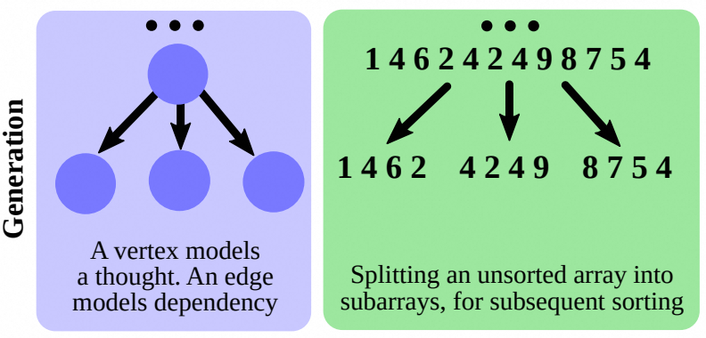

  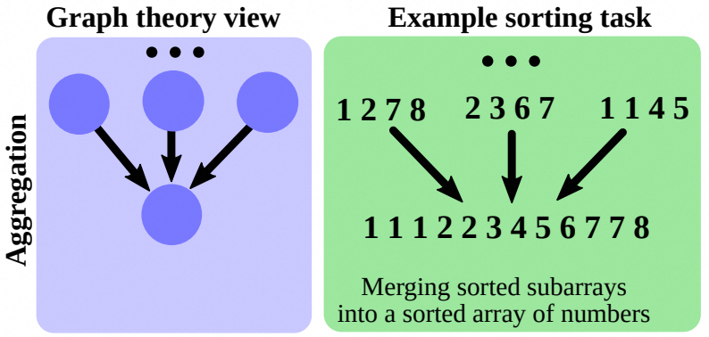

  GoT 中的 G 是有向无环图，整体结构如下图

  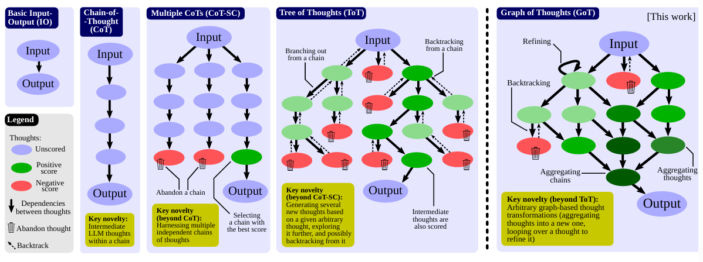

  GoT 由一组交互式模块构成，见下图（蓝色部分）。这些模块是 Prompter（准备用于 LLM 的消息）、Parser（解析器，提取 LLM 答复中的信息）、评分模块（验证 LLM 答复并评分）、Controller（控制器，协调整个推理过程，并决定如何推进推理）。Controller 中包含另外两个重要组件：操作图（GoO）和图推理状态（GRS）。GoO 是一个静态结构，其指定了对给定任务的图分解，即它规定了应用于 LLM 思维的变换及其顺序和依赖关系。GRS 是一个动态结构，其维持着正在进行的 LLM 推理过程的状态（其思维及其状态的历史）

  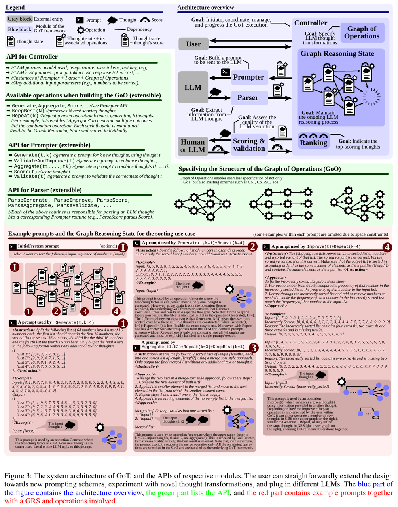

# **6.1.3 Prompt WorkFlow：Prompt自动优化框架 工作梳理**

> #### **Motivation**
>
> Prompt对于大模型生产的各个环节都是至关重要的，相较于古早的人工设计、优化Prompt，我们更加倾向于能够**设计出一套自动优化Prompt的管线**，利用大模型本身的特性和能力自动优化基座和业务上原本的Prompt，为了搞清楚为什么大模型可以自动化优化Prompt，我们先来看DeepMind的一篇很有意思的文章——**《LANGUAGE MODELS AS OPTIMIZERS》**。

## **《LANGUAGE MODELS AS OPTIMIZERS》**

> 简单来说，它提出了一种简单有效的利用LLMs作为优化器的方法——**Optimization by PROmpting（OPRO）**。
>
> 该方法通过自然语言描述优化任务，在每次优化步骤中，基于包含之前生成的解及其价值的提示，让LLM生成新的解决方案，然后评估新解的价值并将其加入提示中（**注意，OPRO 是直接生成新的 prompt，而不是更改现有的 prompt**），为下一步优化做准备，直到LLM无法提出更优的解或达到最大迭代次数。

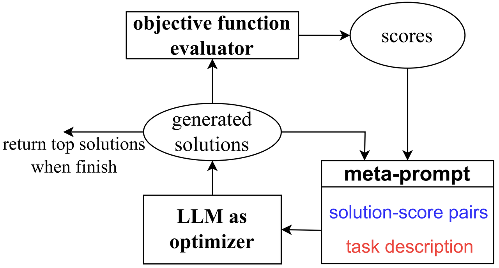

> #### **具体做法**
>
> **初始化：**
>
> * 定义优化问题的自然语言描述，包括目标函数和约束条件。
>
> * 准备初始解及其评估值，这些信息将作为 LLM 的meta-prompt的一部分。
>
> **迭代优化：**
>
> * 在每次迭代中，将包含历史解及其评估值的 meta-prompt 输入到 LLM 中。
>
> * LLM 根据提示生成新的候选解。
>
> * 对新生成的候选解进行评估，计算其目标函数值。
>
> * 将新解及其评估值添加到 meta-prompt 中，为下一次迭代做准备。

```python
def opro_optimization(initial_solutions, scorer, max_steps=200):# 初始化 meta-prompt，包含问题描述和初始解
    meta_prompt = build_meta_prompt(problem_description, initial_solutions)
    for step in range(max_steps):
    # 使用 LLM 生成新的候选解
        new_solutions = llm_generate_solutions(meta_prompt)# 评估新解
        new_solutions_with_scores = evaluate_solutions(new_solutions, scorer)# 更新 meta-prompt，加入新解及其评估值
        meta_prompt = update_meta_prompt(meta_prompt, new_solutions_with_scores)# 检查是否满足终止条件
        if termination_condition_met(meta_prompt):
            break
        # 返回优化后的解
        return extract_best_solution(meta_prompt)
```

## **《Large language models are human-level prompt engineers》**

> APE的核心思路是**从候选集中选出好的prompt，再在好的prompt附近进行试探性地搜索**。
>
> 它的目的是将提示工程视为自然语言程序合成，将任务抽象为寻找最优指令 $\rho$，使得模型 M 在输入 $\mathrm[\rho;Q]$ 时输出正确答案 A。目标是最大化期望得分函数：
>
> $\rho^*=\arg\max_\rho\mathbb{E}_{(Q,A)}[f(\rho,Q,A)]$
>
> 其中 $f$ 可以是执行准确率（如  $f_{\text{exec}} = \mathbb{1}[M([\rho; Q])=A]$）或对数概率（ $\log P(A|[\rho; Q])$）。

**实现细节**

1. **&#x20;Proposal**

* Forward Generation）：通过 LLM 根据输入 - 输出示例直接生成指令，例如：

```plain&#x20;text
"I gave a friend an instruction and five inputs... The instruction was <COMPLETE>" 。
```

* 反向生成（Reverse Generation）：利用支持填充的 LLM（如 T5、GLM）推断缺失的指令，例如：

```plain&#x20;text
"I instructed my friend to <INSERT>... Here are the input-output pairs..." 。
```

* **&#x20;Scoring**

- 执行准确率：直接衡量模型输出与正确答案的匹配度（0-1 损失）。

- 对数概率：评估模型生成正确答案的概率，提供更细粒度的优化信号。

- 自适应过滤策略：先在小数据集上快速筛选低质量候选，再对高质量候选进行全量评估，降低计算成本 。

另外，这一步如果在全量训练集上评估，则开销非常大，因此作者提出一种multi-stage策略。大致思想是先在少量subset上评估，然后过滤掉比较差的，循环这一过程直到候选集足够小，此时再在全量训练集上进行评价、挑选。

* **&#x20;Iterative Monte Carlo Search**

- 基于当前高分候选，通过 LLM 生成语义相似的新指令，逐步提升候选质量。例如：

```plain&#x20;text
"Generate a variation of the following instruction while keeping the semantic meaning..." 。
```


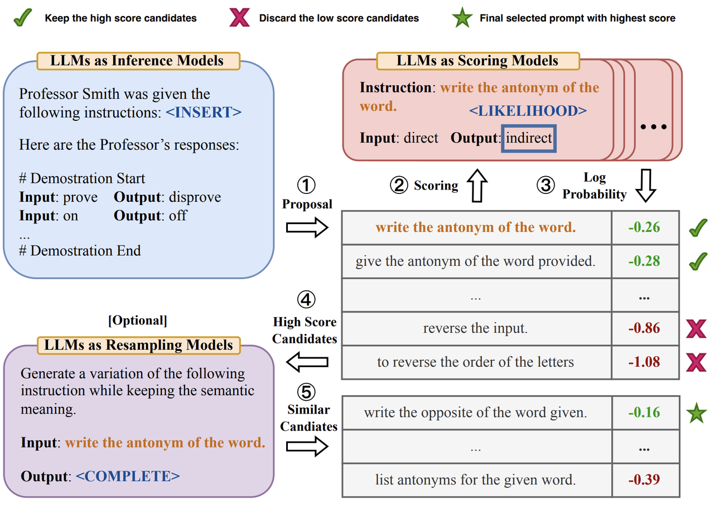

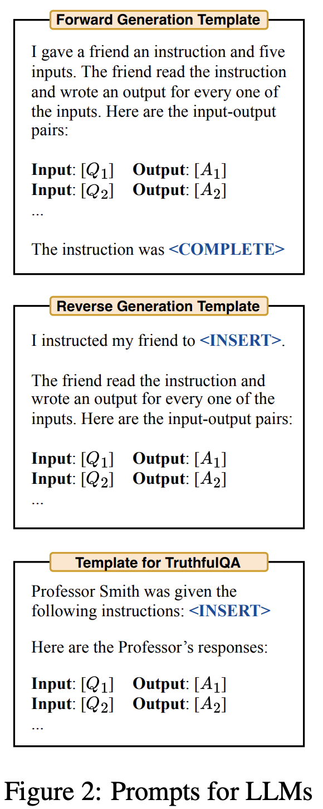

**代码实现**

* `find_prompts`：生成提示并对其进行评估

```python
def find_prompts(eval_template,
                 demos_template,
                 prompt_gen_data,
                 eval_data,
                 conf,
                 base_conf='configs/default.yaml',
                 few_shot_data=None,
                 prompt_gen_template=None):
    conf = config.update_config(conf, base_conf)

    # Generate prompts
    eval_template = template.EvalTemplate(eval_template)
    demos_template = template.DemosTemplate(demos_template)
    if prompt_gen_template is None:
        prompt_gen_template = eval_template.convert_to_generation_template()
    else:
        prompt_gen_template = template.GenerationTemplate(prompt_gen_template)

    if few_shot_data is None:
        few_shot_data = prompt_gen_data

    print('Generating prompts...')
    prompts = generate.generate_prompts(
        prompt_gen_template, demos_template, prompt_gen_data, conf['generation'])

    print('Model returned {} prompts. Deduplicating...'.format(len(prompts)))
    prompts = list(set(prompts))
    print('Deduplicated to {} prompts.'.format(len(prompts)))

    print('Evaluating prompts...')

    res = evaluate.evalute_prompts(prompts, eval_template, eval_data, demos_template, few_shot_data,
                                   conf['evaluation']['method'], conf['evaluation'])

    print('Finished evaluating.')

    demo_fn = evaluate.demo_function(eval_template, conf['demo'])

    return res, demo_fn
```

* `evaluate_prompts`：用于评估给定的提示列表

```python
def evaluate_prompts(prompts, eval_template, eval_data, demos_template, few_shot_data, conf,
                     base_conf='configs/default.yaml'):
    conf = config.update_config(conf, base_conf)
    # Generate prompts
    eval_template = template.EvalTemplate(eval_template)
    demos_template = template.DemosTemplate(demos_template)

    print('Evaluating prompts...')
    res = evaluate.evalute_prompts(
        prompts, eval_template, eval_data, demos_template, few_shot_data, conf['evaluation']['method'],
        conf['evaluation'])
    return res
```

* `estimate_cost`：估计生成和评估提示的成本

```python
def find_prompts(eval_template,
                 demos_template,
                 prompt_gen_data,
                 eval_data,
                 conf,
                 base_conf='configs/default.yaml',
                 few_shot_data=None,
                 prompt_gen_template=None):
    conf = config.update_config(conf, base_conf)

    # Generate prompts
    eval_template = template.EvalTemplate(eval_template)
    demos_template = template.DemosTemplate(demos_template)
    if prompt_gen_template is None:
        prompt_gen_template = eval_template.convert_to_generation_template()
    else:
        prompt_gen_template = template.GenerationTemplate(prompt_gen_template)

    if few_shot_data is None:
        few_shot_data = prompt_gen_data

    prompts = generate.generate_prompts(
        prompt_gen_template, demos_template, prompt_gen_data, conf['generation'])

    prompts = list(set(prompts))

    res = evaluate.evalute_prompts(prompts, eval_template, eval_data, demos_template, few_shot_data,
                                   conf['evaluation']['method'], conf['evaluation'])

    demo_fn = evaluate.demo_function(eval_template, conf['demo'])

    return res, demo_fn
```

## **《EvoPrompt: Connecting LLMs with Evolutionary Algorithms Yields Powerful Prompt Optimizers》**

> APE可以被视为一个不可导的优化问题，因为不存在一条可导的链路将模型的损失直接用于提示的优化。
>
> 那么我们换到进化视角，**如果将Prompt视为Individual，将其在LLM中的效果视为fitness，而将提示的修改视为crossover或变异mutation**，那么我们就可以利用现有的遗传算法框架来进行提示优化。这就是**EvoPrompt**算法。
>
> **EvoPrompt**的核心思想是说，利用进化算法（如遗传算法 GA、差分进化 DE）的全局搜索能力，平衡提示词的Exploration与Exploitation，更进一步来说，**EvoPrompt**可以借助LLMs 的自然语言处理能力生成高质量候选提示词，避免传统 EA 在离散文本空间中独立修改 tokens 导致的语义断裂。

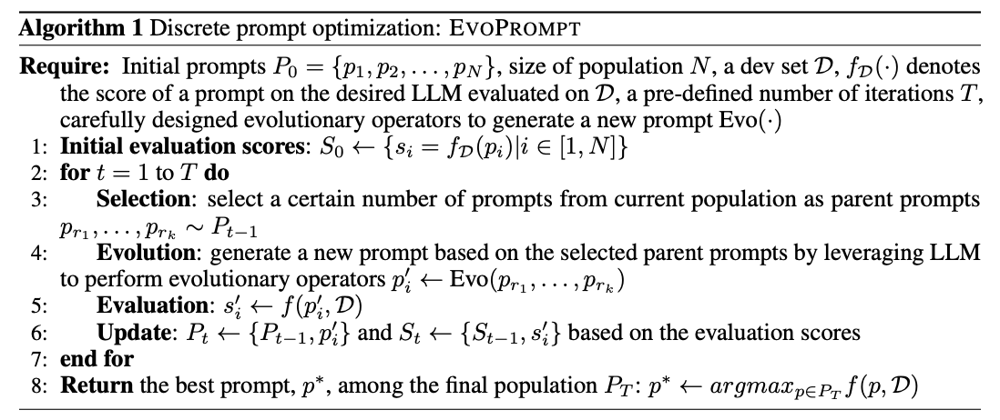

> #### **具体做法**
>
> ##### 1.&#x20;**&#x20;初始种群构建**
>
> * 人工提示词：引入现有手动设计的提示词，利用人类经验。
>
> * LLM 生成提示词：通过 LLM生成随机提示词，增加种群多样性。
>
> ##### 2.&#x20;**&#x20;LLMs 驱动的进化算法**
>
> * 遗传算法（GA）流程：
>
>   1. select：基于开发集表现，通过轮盘赌选择法选取父代提示词。
>
>      * 选择概率公式： $p_i = \frac{s_i}{\sum_{j=1}^N s_j}, \quad \text{其中 } s_i \text{ 为第 } i \text{ 个提示词的得分}$
>
>   2. Crossover：LLMs 融合父代提示词的关键短语生成子代。例如：
>
>      * 父代 1：“分类情感为积极 / 消极”，父代 2：“仅返回标签” → 子代：“分类情感并返回标签”。
>
>   3. Mutation：LLMs 对交叉后的提示词进行局部改写（如替换同义词），例如将 “分类” 改为 “分析”。
>
> * 差分进化（DE）流程：
>
>   1. 差异向量计算：LLMs 找出两个随机提示词的差异部分（如 “tweet” vs “sentence”）。
>
>   2. 变异：随机修改差异部分（如 “tweet”→“review”），生成变异向量。
>
>   3. 重组：将变异向量与当前最优提示词结合，生成新候选提示词。
>
> ##### 3.&#x20;**&#x20;种群更新**
>
> * 评估：在开发集上计算候选提示词的性能得分（准确率、ROUGE 等）。
>
> * 选择保留：
>
>   * GA：合并新旧种群，保留得分最高的 N 个提示词。
>
>   * DE：逐一对每个提示词生成变异体，保留原提示词与变异体中得分更高的一个。

**基于GA的APE**

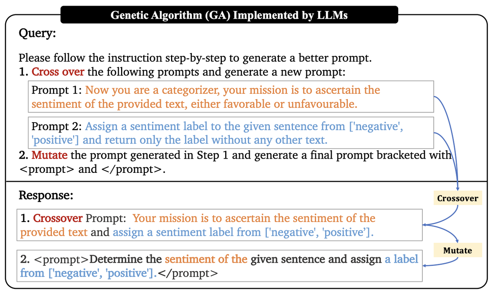


**基于DE的APE**

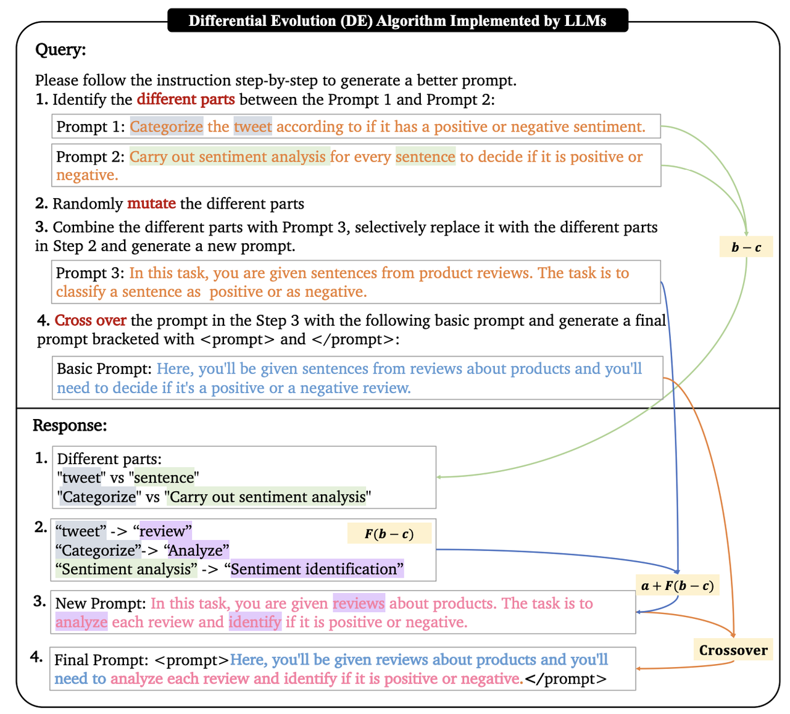

## **《PromptWizard: Task-Aware Prompt Optimization Framework》**

> **PromptWizard**是一个自动化离散提示优化框架，通过反馈驱动的批判与合成机制，实现提示指令和上下文示例的迭代优化。
>
> 给定初始提示指令  $P$、问题描述 $D$ 和训练样本 $(Q, A) = \{(q_i, a_i)\}_{i=1}^N$，目标是通过迭代优化提示 $\hat{P}$和上下文示例  $(q_f, a_f)$，最大化模型在目标任务上的准确率 $A$，即： $\max_{P, (q_f, a_f)} A\left(L \mid q_i, P, q_f, a_f\right)$。
>
> 其中，L 为黑盒 LLM，输出概率为 $p_L(a_i \mid q_i, P, q_f, a_f)$。

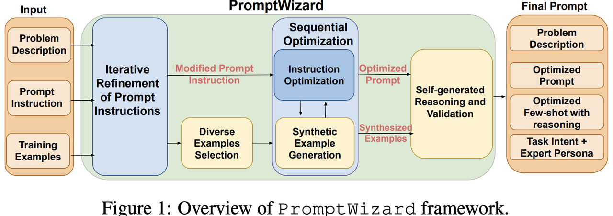

> #### 实现细节
>
> ##### 4. **Iterative Refinement of Prompt Instructions**
>
> * MutateComponent： 根据预设的思维风格（如 “如何简化问题”“替代视角”）生成提示变体。例如，初始提示 “逐步解决数学问题” 可变异为 “分步骤实验求解” 等形式。
>
> * ScoringComponent： 使用mini- batch（如 5 个）训练样本，基于 F1 分数或 LLM 评估器对变异提示评分，筛选高性能提示。
>
> * CritiqueComponent： 分析提示的成功与失败案例，提取具体改进方向。例如，指出提示未涵盖 “百分比处理” 或 “时间转换” 等需求。
>
> * SynthesizeComponent： 根据批判反馈重构提示，增强任务特异性。例如，在数学问题中加入 “理解问题背景”“处理百分比” 等要求。
>
> ##### 5.&#x20;**&#x20;Diverse Example Selection**
>
> * 从训练数据中随机选取 25 个样本，按提示性能分为正例（成功案例）和负例（失败案例）。
>
> * 优先选择能覆盖任务多样性的示例（如数学问题中的多步运算、分数处理等），若正例不足则随机补充。
>
> ##### 6.&#x20;**&#x20;Sequential Optimization**
>
> * 示例优化： 通过批判组件分析现有示例的不足（如 “缺乏复杂性”），合成更具挑战性的新示例。例如，在算术问题中加入分数运算的合成示例。
>
> * 提示优化： 基于新示例再次批判提示，迭代调整指令。例如，根据合成示例的反馈，在提示中增加 “处理分数和百分比” 的要求。
>
> **关键公式**： $\text{优化流程}：P^{(t+1)}, E^{(t+1)} = \text{SeqOpt}(P^{(t)}, E^{(t)})$ 其中， $P^{(t)}$为第 t 轮提示， $E^{(t)}$ 为对应示例，通过批判 - 合成循环逐步优化。
>
> ##### 7.&#x20;**&#x20;自生成推理链与专家角色整合**
>
> * 思维链（CoT）生成： 为每个示例自动生成详细推理步骤，增强模型的问题分解能力。例如，数学题中逐步展示 “乘法→加法→验证” 的推理链。
>
> * 任务意图与专家角色： 提取任务关键词（如 “数学推理”“多步问题解决”）并设定专家身份（如 “数学教育者”），使提示更贴合领域需求。

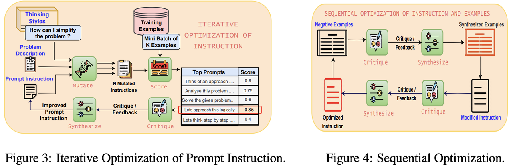

