# **6.3.1 RAG简介**

RAG（Retrieval Augmented Generation）为生成式模型提供了与外部世界互动的一个很有前景的解决方案。主要作用**类似于搜索引擎，找到用户提问最相关的知识或者是相关的对话历史，并结合原始提问（查询），创造信息丰富的prompt，指导模型生成准确输出**。其本质上应用了In-Context Learning的原理

**RAG（检索增强生成）= 检索技术 + LLM（大语言模型）提示**

**LLM本身的局限性：**

* **知识的局限性：**&#x6A21;型自身的知识完全源于它的训练数据，而现有的主流大模型的训练集基本都是构建于网络公开的数据，对于一些实时性的、非公开的或离线的数据是无法获取到的，这部分知识也就无从具备

* **幻觉问题：**&#x6240;有的AI模型的底层原理都是基于数学概率，其模型输出实质上是一系列数值运算，大模型也不例外，所以它有时候会一本正经地胡说八道，尤其是在大模型自身不具备某一方面的知识或不擅长的场景。而这种幻觉问题的区分是比较困难的，因为它要求使用者自身具备相应领域的知识

* **数据安全性：**&#x5BF9;于企业来说数据安全至关重要，没有企业愿意承担数据泄露的风险，将自身的私域数据上传第三方平台进行训练。这也导致完全依赖通用大模型自身能力的应用方案不得不在数据安全和效果方面进行取舍

**RAG的特点：**

* **依赖LLM来强化信息检索和输出：**&#x52;AG需要结合LLM来进行信息的检索和生成，但如果单独使用RAG，它的能力会受到限制。也就是说，RAG需要依赖强大的语言模型支持，才能更有效地生成和提供信息

* **能与外部数据有效集成：**&#x52;AG能够很好地接入和利用外部数据库的数据资源。这一特性弥补了通用大模型在某些垂直或专业领域的知识不足或者数据时效问题，比如行业特定的术语和深度知识，能提供更精确的答案

* **数据隐私和安全保障：**&#x901A;常RAG所连接的私有数据库不会参与到大模型的数据集中训练。因此，RAG既能提升模型的输出表现，又能有效地保护这些私有数据的隐私性和安全性，不会将敏感信息暴露给大模型的训练过程

* **表现效果因多方面因素而异：**&#x52;AG的效果受多个因素影响，比如所使用的语言模型的性能、输入数据的质量、算法以及检索系统的设计等。这意味着不同的RAG系统之间效果差异较大，不能一概而论

# **6.3.2 RAG流程与分类**

## **RAG整体思路**

可以分为五个基本流程：**知识文档的准备、Embedding模型、向量数据库、查询检索和生成回答**

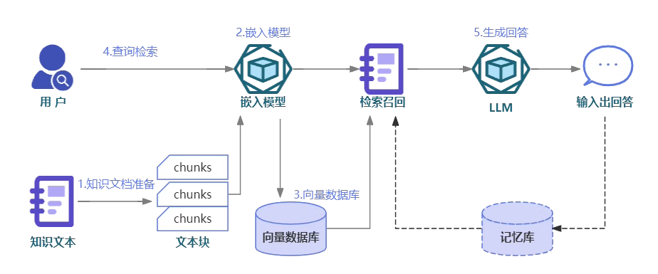

* **知识文档的准备：**&#x5728;构建一个高效的RAG系统时，首要步骤是准备知识文档。现实场景中，我们面对的知识源可能包括多种格式，如**Word文档、TXT文件、CSV数据表、Excel表格，甚至是PDF文件、图片和视频**等。因此，第一步需要使用**专门的文档加载器（例如PDF提取器）或多模态模型（如OCR技术）**，将这些丰富的知识源转换为**大语言模型可理解的纯文本数据**。例如，处理PDF文件时，可以利用PDF提取器抽取文本内容；对于图片和视频，OCR技术能够识别并转换其中的文字信息。此外，鉴于文档可能存在过长的问题，我们还需执行一项关键步骤：**文档切片。我们需要将长篇文档分割成多个文本块，以便更高效地处理和检索信息**。这不仅有助于减轻模型的负担，还能提高信息检索的准确性

* **Embedding模型：核心任务是将文本转换为向量形式**，的日常语言中充满歧义和对表达词意无用的助词，而**向量表示则更加密集、精确，能够捕捉到句子的上下文关系和核心含义，**&#x6765;识别语义上相似的句子。Word2Vec，BERT，GPT系列，BGE系列等等Embedding模型

* **向量数据库：**&#x4E13;门设计用于存储和检索向量数据的数据库系统。在RAG系统中，通过嵌入模型生成的所有向量都会被存储在这样的数据库中。这种数据库优化了处理和存储大规模向量数据的效率，使得在面对海量知识向量时，我们能够迅速检索出与用户查询最相关的信息

* **查询检索：**&#x7528;户的问题会被输入到嵌入模型中进行向量化处理。然后，系统会在向量数据库中搜索与该问题向量语义上相似的知识文本或历史对话记录并返回

* **生成回答：**&#x5C06;用户提问和上一步中检索到的信息结合，构建出一个提示模版，输入到大语言模型中，静待模型输出答案即可

## **RAG分类**

**三个阶段Naive RAG，Advanced RAG、Modular RAG**

**综述论文：[Retrieval-Augmented Generation for Large Language Models: A Survey](https://www.semanticscholar.org/paper/46f9f7b8f88f72e12cbdb21e3311f995eb6e65c5)**

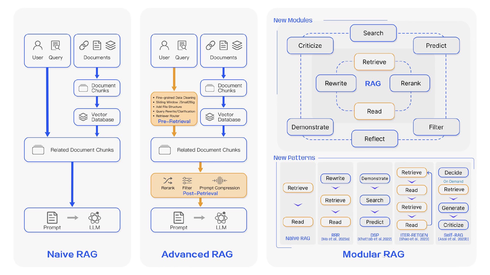

* **Naive RAG：**&#x7ECF;典的RAG，主要涉及“检索-阅读”过程。主要包括包括三个基本步骤：

  * **索引：**&#x5C06;文档库分割成较短的 Chunk，并通过编码器构建向量索引

  * **检索：**&#x6839;据问题和 chunks 的相似度检索相关文档片段

  * **生成：** 以检索到的上下文为条件，生成问题的回答

* **Advanced RAG**：Naive RAG 在检索质量、响应生成质量以及增强过程中存在多个挑战。Advanced RAG在**数据索引、检索前和检索后都进行了额外处理**。通过更精细的数据清洗、设计文档结构和添加元数据等方法提升文本的一致性、准确性和检索效率。在**检索前阶段则可以使用问题的重写**、**路由和扩充等方式对齐问题和文档块之间的语义差异**。在**检索后阶段则可以通过将检索出来的文档库进行重排序避免 “Lost in the Middle ” 现象的发生，或是通过上下文筛选与压缩的方式缩短窗口长度**

* **Modular RAG：**&#x5728;结构上更加自由的和灵活，引入了更多的具体功能模块，例如**查询搜索引擎、融合多个回答**。技术上将**检索与微调、强化学习等技术融合**。流程上也对 RAG 模块之间进行设计和编排，出现了多种的 RAG 模式

| **RAG框架种类**                      | **优点**                                                              | **缺点**                                                             |
| -------------------------------- | ------------------------------------------------------------------- | ------------------------------------------------------------------ |
| **初级RAG**&#xA;**(Naive RAG)**    | 1.采用传统的索引、检索和生成流程2.直接基于用户输入进行查询3.结合相关文档与问题形成新的提示，供大型语言模 型生成答案       | 1.检索质量低，可能导致“空中掉落”现象2.响应生成质量存在幻觉和询矢量转换 不相关性问题3.增强过程中的集成挑战如冗余和风格一致性 |
|                                  |                                                                     |                                                                    |
|                                  |                                                                     |                                                                    |
| **进阶的 RAG（Advanced RAG）**        | 1.优化数据索引，提高索引内容质量2.实施预检索和后检索方法，提高检索和生成的质量3.引入混合检索和索引结构优化，如图结构信息     | 1.高级优化增加了复杂性2.对计算资源和处理能力有更高要求3.需要更多的定制和调优以提高效率和相关性                 |
|                                  |                                                                     |                                                                    |
|                                  |                                                                     |                                                                    |
| **模块化RAG**&#xA;**(Modular RAG)** | 1.增加功能模块，提供多样性和灵活性2.适应性强，可针对特定问题上下文替换或重组模块3.采用串行或端到端训练方法，允许跨多个模块的定制 | 1.构建和维护模块化系统可能较为复杂2. 需要仔细管理以确保模块间的协调和一致性                           |
|                                  |                                                                     |                                                                    |

**更详细版的表格**

**RAG发展路线：**

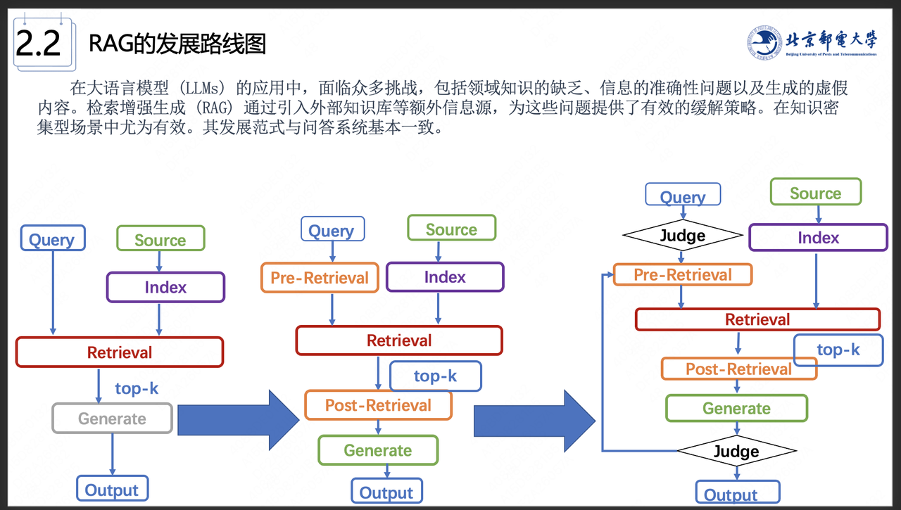

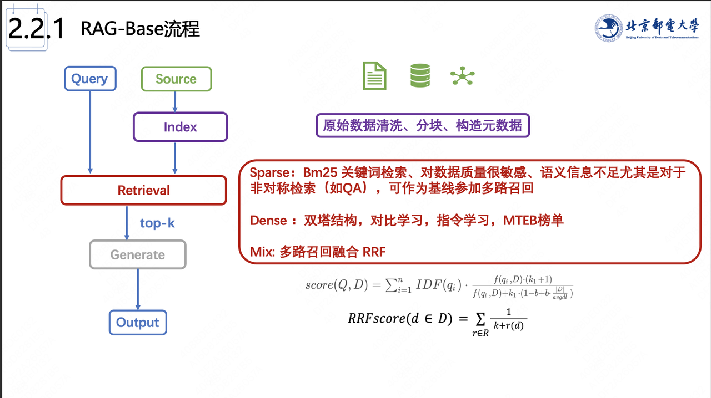

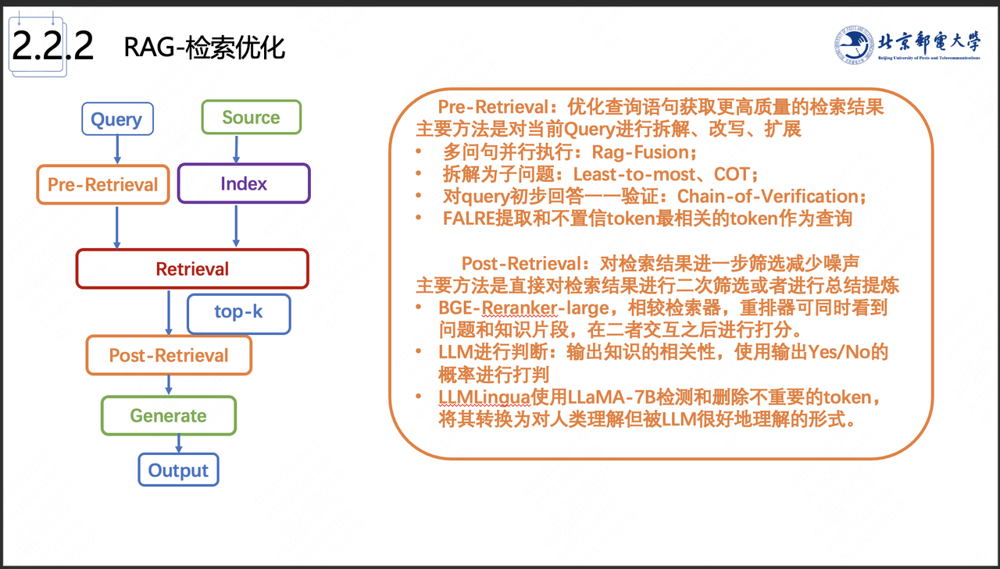

# **6.3.3 RAG评估**

> RAG的评估是非常令人头疼的事，单纯依靠指标或者LLM-as-a-Judge是无法全面地评估reponse 的质量的，今天谈谈在工业界实习时的一些做法和思考
>
> **RAG评估需要从相关性、事实性来评估，其中，相关性包括了上下文相关性和答案相关性。**

## **RAG的难点**

**如何建立知识向量库**

> 收集的数据文件类型、如何切分不同类型的文件、如何设置**chunk-size和overlap**的大小、选用何种向量化工具构建、embedding模型是否需要微调等等，这些因素都会影响下游链路的结果。

**检索优化**

> 用户原始问题的质量是影响 RAG 生成效果的主要因素，一个模糊、指向不明的问题会严重降低检索效率，带来糟糕的生成结果。我们无法也不应该要求用户提出的每一个问题都是高质量问题，因此检索前优化目标是改善用户的提问质量。即使面对糟糕的用户提问，RAG 系统也有能力将其转换和拓展成一系列高质量问题。

**归纳总结**

> 对于模型归纳生成的内容，内容全面性、生成内容格式、生成效果稳定性很难控制，即对于模型输出内容的可控性做的不够好。

## **针对检索环节的评估**

* **MRR平均倒数排名：Mean Reciprocal Rank，**&#x67E5;询或推荐请求的排名倒数

  MRR是一种常用的评估信息检索（Information Retrieval, IR）系统表现的指标，尤其用于衡量搜索引擎、推荐系统等根据查询返回的多个结果中的相关性。结果列表中，第一个结果匹配分数为1，第二个匹配分数为0.5，第n个匹配分数为1/n，如果没有匹配的句子分数为0。最终的分数为所有得分之和，再平均

  **MRR的意义：**

  * MRR值越高，表示系统对用户查询的响应越好，因为第一个相关结果更可能出现在较高的排名位置

  * 如果第一个相关结果排名在前几个位置，倒数排名接近1，会提高MRR值

  * 如果第一个相关结果排得很靠后，倒数排名就会较小，MRR值较低

  假设我们有3个查询：

  * 第一个查询的第一个相关结果排在第2位（倒数排名 = 1/2）

  * 第二个查询的第一个相关结果排在第5位（倒数排名 = 1/5）

  * 第三个查询的第一个相关结果排在第1位（倒数排名 = 1/1）

  那么，MRR就会是： $     MRR = \frac{1}{3} \left( \frac{1}{2} + \frac{1}{5} + \frac{1}{1} \right) = \frac{1}{3} (0.5 + 0.2 + 1) = \frac{1}{3} \times 1.7 = 0.567  $

  ```python
  def mean_reciprocal_rank(ranked_lists):
      mrr = 0.0
      for ranked_list in ranked_lists:
          reciprocal_rank = 0
          for rank, item in enumerate(ranked_list, start=1):
              if item == 1:  # Correct answer found
                  reciprocal_rank = 1 / rank
                  break
          mrr += reciprocal_rank
      return mrr / len(ranked_lists)
  ```

  MRR衡量的是**相关结果首次出现的位置（越靠前越好）**&#x9002;用于多结果排序任务，如搜索引擎查询、推荐系统

* **Hits Rate 命中率：**&#x524D;K项中包含正确信息的项的占比，评估召回相关文档的比率

  ```python
  def calculate_precision(retrieved_docs, relevant_docs):
      relevant_retrieved_docs = [doc for doc in retrieved_docs if doc in relevant_docs]
      precision = len(relevant_retrieved_docs) / len(retrieved_docs) if retrieved_docs else 0    
      return precision
  ```

* **衡量检索到的文档的全面性：**&#x5B83;是检索到的相关文档数量与数据库中相关文档的总数之比

  ```python
  def calculate_recall(retrieved_docs, relevant_docs):
      relevant_retrieved_docs = [doc for doc in retrieved_docs if doc in relevant_docs]
      recall = len(relevant_retrieved_docs) / len(relevant_docs) if relevant_docs else 0    
      return recall
  ```

* **NDCG归一化折损累计增益：**&#x4E;ormalized Discounted Cumulative Gain

  **DCG的思想：**&#x6C;ist中item的顺序很重要，不同位置的贡献不同，一般来说，排在前面的item影响更大，排在后面的item影响较小。（例如一个返回的网页，肯定是排在前面的item会有更多人点击）**DCG使排在前面的item增加其影响，排在后面的item减弱其影响**

  $DCG_k = \sum_{i=1}^{k}\frac{rel(i)}{\log_2(i+1)}$

  其中rel(i)是item(i)的相关性得分。IDCG是根据rel(i)降序排序后的最好状态的DCG，所以可以得到NDCG：

  $NDCG=\frac{DCG}{IDCG}$

## **针对生成环节的评估**

* **非量化：**&#x5B8C;整性、正确性、上下文相关性、答案忠实性和答案相关性

* **量化：**&#x52;ouge、BLEU等文本相似性指标

## **意图分流评估**

> 目前RAG的主流做法是`Agentic RAG`，其中意图分流环节利用`agent`进行用户意图分流的同时发挥其`function call`的能力已经是共识。意图分流的效果严重影响下游的链路的准确性，所以需要对其进行评估。

分类任务嘛，用几个常见的指标分类指标评估即可。

对于`function call`的评估，可以参考`ToolLearning Eval`的做法：

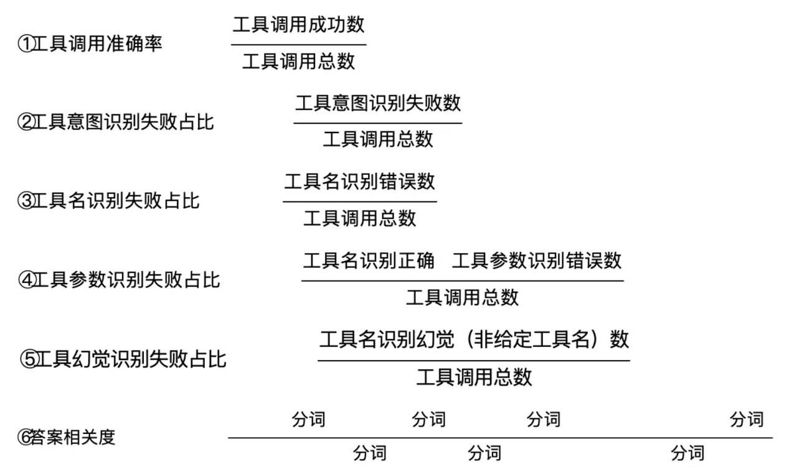

## **答案评估**

* 事实性

  * 生成的答案与已验证事实的数据库进行比较，以识别不准确之处。提供了一种无需人工干预即可检查信息有效性的自动方式 \[1]。

  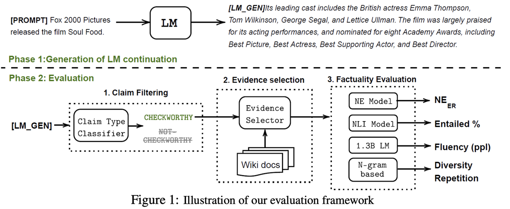

  * 验证输入源和输出内容是否前后矛盾，最简单的可以训练一个NLI模型。

* 答案相关性

  1. 用各种相似度指标算下相似度

  2. 写个prompt，让其他LLM评估一下答案和ground truth的相似性，或者直接结合prompt评估答案的相关性。

## **噪音评估**

模型能从噪声文档中提取有用信息。噪声文档定义为与问题相关但不包含任何相关信息的文档。采用精确匹配法，如果生成的文本与答案完全匹配，则视为正确答案

## **分专项能力评估**

* **易混淆实体：**&#x68C0;索出来的文档中关键实体有不同的含义，模型在归纳总结时容易将这几个实体视为一个一并总结

* **弱相关性：**&#x68C0;索出来的文档没有一篇强相关的，或者有两篇文章描述的是同一件事，但是有一篇错的又一篇对的，需要模型择优

* **function call：**&#x5BF9;于需要做补充搜索、调用外部API工具的的case，需要评估链路中的相关能力

* **时效性：**&#x5BF9;于具有强时效性的case，模型归纳时需要优先利用最新的资料进行回答。可以参考模型的注意力特点把最新的文档放到注意力最强的位置

* **拒答：**&#x5728;agent意图分流走兜底策略，或者检索的资料没有任何好结果时，需要评估系统的拒答率。其中，又可分为部分拒答和全部拒答

## **开源RAG评估框架**

* **[Ragas](https://github.com/nayeon7lee/FactualityPrompt)：主要评估忠实性、答案相关性和上下文相关性。**

  * **忠实性**。答案应基于给定的上下文。这个可以确保检索到的上下文可以作为生成答案的理由

  * **答案相关性**。生成的答案应针对所提供的实际问题

  * **上下文相关性**。检索的上下文应重点突出，尽可能少地包含无关信息，因为向LLM处理长篇上下文信息的成本很高，当上下文段落过长时，LLMs在利用上下文方面的效率往往较低，尤其是对于上下文段落中间提供的信息

* **LangSmith：**&#x5141;许调试、测试、评估和监控基于任何 LLM 框架构建的链和智能代理，并无缝集成 LangChain。

# **6.3.4 RAG优化**

## **文档知识准备阶段**

* **数据清洗：**&#x52;AG依赖于准确且清洁的原始知识数据。一方面为了**保证数据的准确性，需要优化文档读取器和多模态模型**。特别是处理如CSV表格等文件时，单纯的文本转换可能会丢失表格原有的结构。因此，我们需引入额外的机制以在文本中恢复表格结构，比如使用分号或其他符号来区分数据。另一方面也需要**对知识文档做一些基本数据清洗其中可以包括**：

  * **基本文本清理**：规范文本格式，去除特殊字符和不相关信息。除重复文档或冗余信息

  * **实体解析**：消除实体和术语的歧义以实现一致的引用。例如，将“LLM”、“大语言模型”和“大模型”标准化为通用术语

  * **文档划分**：合理地划分不同主题的文档，不同主题是集中在一处还是分散在多处？如果作为人类都不能轻松地判断出需要查阅哪个文档才能来回答常见的提问，那么检索系统也无法做到

  * **数据增强**：使用同义词、释义甚至其他语言的翻译来增加语料库的多样性

  * **用户反馈循环**：基于现实世界用户的反馈不断更新数据库，标记它们的真实性

  * **时间敏感数据**：对于经常更新的主题，实施一种机制来使过时的文档失效或更新

## **解析PDF文件**

> 在构建RAG系统时，最麻烦的莫过于构建知识库，一个完美的知识库时检索精准的关键。
>
> 今天就和大伙聊聊目前有哪些主流的PDF解析手段。

**一、 基于规则的解析算法**

> `Langchain`中默认的解析pdf的算法即`pypdf`。其主要是根据 PDF 页面中的文本对象的坐标和布局信息，按照一定的顺序将文本内容提取出来，尽量保持原文档中的文本顺序和格式。
>
> **优点**：根据文档的组织特征确定每个部分的风格和内容
>
> **缺点**：不够通用、无法处理复杂排版

```python
import PyPDF2
filename = "your path"
pdf_file = open(filename, 'r')
​
reader = PyPDF2.PdfReader(pdf_file)
​
page_num = 5
page = reader.pages[page_num]
text = page.extract_text()

print(text)
​
pdf_file.close()
```

**二、基于多模态大模型的解析技术**

> 直接利用VLM对pdf信息进行抽取，核心在于如何写一个完备的prompt，以及如何评估抽取的准确性。
>
> * 可选的基座模型
>
>   * Qwen-VL
>
>   * GPT-4o
>
>   * Intern-VL
>
>   * COGVLM
>
>   * Step-1o

* prompt示例 (自己测过，效果还不错，注意，do\_sample设置为False):&#x20;

```python
"As a professional OCR expert, analyze the provided document/images and extract text with 100% fidelity. For multi-page PDFs, maintain page separation using clear markers. Preserve original layouts including paragraphs, lists, tables using appropriate delimiters. Convert formulas to LaTeX (preferred) with context notation for complex equations. Retain original formatting styles (bold/italic) using Markdown. Flag low-confidence text regions with xxx. Exclude headers/footers unless specified. Never modify/add content."
```

**三、多级标题如何处理**

> * **为什么要处理多级标题？**
>
>   * 对于有些问题high-level的问题，没有标题很难得到满意的结果
>
>   * 标题是快速做摘要最核心的文本
>
> * **具体做法**
>
>   用OCR工具来对标题区块提取文字！推荐Layout-parse，缺点是速度慢。unstructured的效果很差，非常不建议。会将很多公式也识别为标题。得到了list，存储所有检测出来的标题，接下来利用标题区块的高度来判断哪些是一级标题，哪些是二级、三级等。unstructured的fast模式就是按照文字的边去切的，同一级标题的区块高度误差在0.001之间。因此我们只需要用unstructured拿到标题的高度值即可

**四、好用的PDF文件解析工具**

> 1. Deepdoc
>
> 2. TextMonkey
>
> 3. OLMOCR
>
> 4. Pandoc
>
> 5. Pymupdf
>
> 6. Mathpix
>
> 7. Docling
>
> 8. Marker

## **文本分块策略**

> 在RAG系统中，**文档需要被分割成多个文本块后再进行向量嵌入**。不考虑大模型输入长度限制和成本问题的情况下，其目的是在**保持语义上的连贯性的同时，尽可能减少嵌入内容中的噪声，从而更有效地找到与用户查询最相关的文档部分**。如果**分块太大，可能包含太多不相关的信息，从而降低了检索的准确性。相反，分块太小可能会丢失必要的上下文信息，导致生成的回应缺乏连贯性或深度**。在RAG系统中实施合适的文档分块策略，旨在找到这种平衡，确保信息的完整性和相关性。一般来说，理想的文本块应当在没有周围上下文的情况下对人类来说仍然有意义，这样对语言模型来说也是有意义的

#### **文本分块策略对大模型输出的影响**

**将长文档拆分为适合检索的“段落”是 RAG 系统成功的关键之一**。良好的**分块策略**可以让每个文本片段既包含足够的信息来回答某类问题，又不会过长导致噪声增加或向量表示模糊不清

* **文本分块过长的影响：**&#x5728;构建 RAG（Retrieval-Augmented Generation）系统时，文本分块的长度对大模型的输出质量有着至关重要的影响。**过长的文本块**会带来一系列问题：

  1. **语义模糊**：当文本块过长时，在向量化过程中，细节语义信息容易被平均化或淡化。这是因为向量化模型需要将大量的词汇信息压缩成固定长度的向量表示，导致无法精准捕捉文本的核心主题和关键细节。结果就是，生成的向量难以代表文本的重要内容，降低了模型对文本理解的准确性。

  2. **降低召回精度**：在检索阶段，系统需要根据用户的查询从向量数据库中检索相关文本。过长的文本块可能涵盖多个主题或观点，增加了语义的复杂性，导致检索模型难以准确匹配用户的查询意图。这样一来，召回的文本相关性下降，影响了大模型生成答案的质量。

  3. **输入受限**：大语言模型（LLM）对输入长度有严格的限制。过长的文本块会占据更多的输入空间，减少可供输入的大模型的文本块数量。这限制了模型能够获取的信息广度，可能导致遗漏重要的上下文或相关信息，影响最终的回答效果。

* **文本分块过短的影响：**&#x76F8;反，**过短的文本块**也会对大模型的输出产生不利影响，具体表现为：

  1. **上下文缺失**：短文本块可能缺乏必要的上下文信息。上下文对于理解语言的意义至关重要，缺乏上下文的文本块会让模型难以准确理解文本的含义，导致生成的回答不完整或偏离主题。

  2. **主题信息丢失**：段落或章节级别的主题信息需要一定的文本长度来表达。过短的文本块可能只包含片段信息，无法完整传达主要观点或核心概念，影响模型对整体内容的把握。

  3. **碎片化问题**：大量的短文本块会导致信息碎片化，增加检索和处理的复杂度。系统需要处理更多的文本块，增加了计算和存储的开销。同时，过多的碎片化信息可能会干扰模型的判断，降低系统性能和回答质量。

通过上述分析，可以得出结论：**合理的文本分块策略是提升 RAG 系统性能和大模型回答质量的关键**。为了在实际应用中取得最佳效果，需要在以下方面进行权衡和优化：

1. **根据文本内容选择切分策略**：不同类型的文本适合不同的切分方法。

   * **逻辑紧密的文本**：对于论文、技术文档等段落内逻辑紧密的文本，应尽量保持段落的完整性，避免过度切分，以保留完整的语义和逻辑结构。

   * **语义独立的文本**：对于法规条款、产品说明书等句子间逻辑相对独立的文本，可以按照句子进行切分。这种方式有助于精确匹配特定的查询内容，提高检索的准确性。

2. **考虑向量化模型的性能**：评估所使用的向量化模型对于不同长度文本的处理能力。

   * **长文本处理**：如果向量化模型在处理长文本时容易丢失信息，应适当缩短文本块的长度，以提高向量表示的精确度。

   * **短文本优化**：对于能够有效处理短文本的模型，可以适当切分文本，但要注意保留必要的上下文信息。

3. **关注大模型的输入限制**：大语言模型对输入长度有一定的限制，需要确保召回的文本块能够全部输入模型。

   * **输入长度优化**：在切分文本块时，控制每个块的长度，使其既包含完整的语义信息，又不超过模型的输入限制。

   * **信息覆盖**：确保切分后的文本块能够覆盖知识库中的关键信息，避免遗漏重要内容。

4. **实验与迭代**：没有一种放之四海而皆准的最佳实践，需要根据具体的应用场景进行实验和调整。

   * **性能评估**：通过实验评估不同切分策略对检索准确性和生成质量的影响，从而选择最适合的方案。

   * **持续优化**：根据模型的表现和用户反馈，不断优化切分策略，提升系统的整体性能。

#### **常见文本分块策略**

> * **固定大小的分块：**&#x6700;简单和直接的方法，直接设定块中的字数，并选择块之间是否重复内容。通常，我们会保持块之间的一些重叠，以确保语义上下文不会在块之间丢失。与其他形式的分块相比，固定大小分块简单易用且不需要很多计算资源
>
> * **内容分块：**&#x6839;据文档的具体内容进行分块，例如根据标点符号（如句号）分割。或者直接使用更高级的NLTK或者spaCy库提供的句子分割功能
>
> * **递归分块：**&#x5728;大多数情况下推荐的方法，通过重复地应用分块规则来递归地分解文本。 例如，在langchain中会先通过段落换行符（\n\n）进行分割，然后，检查这些块的大小。如果大小不超过一定阈值，则该块被保留。对于大小超过标准的块，使用单换行符（\n）再次分割。以此类推，不断根据块大小更新更小的分块规则（如空格，句号）。这种方法可以灵活地调整块的大小。例如，对于文本中的密集信息部分，可能需要更细的分割来捕捉细节；而对于信息较少的部分，则可以使用更大的块。它的挑战在于，需要制定精细的规则来决定何时和如何分割文本
>
> * **从小到大分块：**&#x65E2;然小的分块和大的分块各有各的优势，一种更为直接的解决方案是将同一文档从大到小所有尺寸的分块，然后将不同大小的分块全部存进向量数据库，并保存每个分块的上下级关系，进行递归搜索。但可想而知，因为我们需要存储大量重复的内容，这种方案的缺点就是需要更大的存储空间
>
> * **特殊结构分块：**&#x9488;对特定结构化内容的专门分块器。这些分块器专门设计来处理这些类型的文档，以确保正确地保留和理解其结构。langchain提供的特殊分块器包括：Markdown文件、LaTeX文件，以及各种主流代码语言分块器
>
> * **分块大小的选择：**&#x9996;先不同的嵌入模型有其最佳输入大小，例如OpenAI的text - embedding - ada - 002模型在256或512大小的块上效果更好；其次，文档的类型和用户查询的长度及复杂性也是决定分块大小的重要因素。处理长篇文章或书籍时，较大的分块有助于保留更多的上下文和主题连贯性；而对于社交媒体帖子，较小的分块可能更适合捕捉每个帖子的精确语义。如果用户的查询通常是简短和具体的，较小的分块可能更为合适；相反，如果查询较为复杂，可能需要更大的分块

* **固定长度分块**

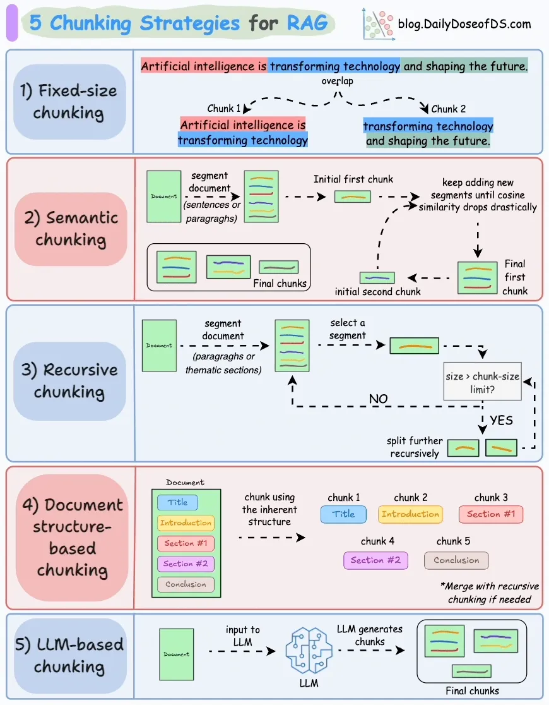

最简单直观的文本分块方法，按照预先设定的固定长度，将文本划分为若干块。这种方法实现起来容易，但在实际应用中，需要注意以下几点：

* **问题与挑战**

  * **上下文割裂**：简单按照固定字符数截断文本，可能会打断句子或段落，导致上下文信息丢失。这会影响后续的文本向量化效果和语义理解

  * **语义完整性受损**：文本块可能包含不完整的句子或思想，影响检索阶段的匹配精度，以及大模型生成回答的质量

* **改进方法**

  * **引入重叠**：在相邻文本块之间引入一定的重叠部分，确保上下文的连贯性。比如，每个文本块与前一个块有 50 个字符的重叠。这有助于保留句子的完整性和段落的连贯性。此外在问答时，如果答案跨越块边界，也可能因为重叠部分而被捕获

  * **智能截断**：在切分文本时，尽量选择在标点符号或段落结束处进行截断，而不是严格按照字符数。这可以避免打断句子，保持语义的完整

**LangChain&#x20;**&#x63D0;供了 `RecursiveCharacterTextSplitter`，优化了固定大小文本切块的缺陷，推荐在通用文本处理中使用。在实践中，**固定长度 + 重叠**是一种常用且有效的策略。比如针对中文内容，可以设定每块大约包含 300-500 个字符，重叠 50-100 字符。这个长度通常足够包含一个完整的细节或论点，又不会太长导致嵌入模型难以表示。通过调整 chunk 大小和重叠长度，开发者可以在**召回粒度**（过短的块容易需要多个块才能拼凑完整答案）和**检索精准**（过长的块可能包含无关信息）之间取得平衡。

**使用示例**：

```python
from langchain.text_splitter import RecursiveCharacterTextSplitter
text_splitter = RecursiveCharacterTextSplitter(
    chunk_size=200,
    chunk_overlap=50,
    length_function=len,
    separators=["\n", "。", ""]
)
text = "..."  # 待处理的文本
texts = text_splitter.create_documents([text])
for doc in texts:print(doc)
```

**参数说明**：

* `chunk_size`：文本块的最大长度（如 200 个字符）。

* `chunk_overlap`：相邻文本块之间的重叠长度（如 50 个字符）。

* `length_function`：用于计算文本长度的函数，默认为 `len`。

* `separators`：定义了一组分割符列表，用于在切分文本时优先选择合适的位置。

**工作原理**：

`RecursiveCharacterTextSplitter` 按照 `separators` 中的分割符顺序（**段落、章节分割等**），**递归**地对文本进行切分：

1. **初步切分**：使用第一个分割符（如 `"\n"`，表示段落分隔）对文本进行初步切分

2. **检查块大小**：如果得到的文本块长度超过了 `chunk_size`，则使用下一个分割符（如 `"。"`，表示句子分隔）进一步切分

3. **递归处理**：依次使用剩余的分割符，直到文本块长度符合要求或无法再切分

4. **合并块**：如果相邻的文本块合并后长度不超过 `chunk_size`，则进行合并，确保块的长度尽可能接近 `chunk_size`，同时保留上下文完整

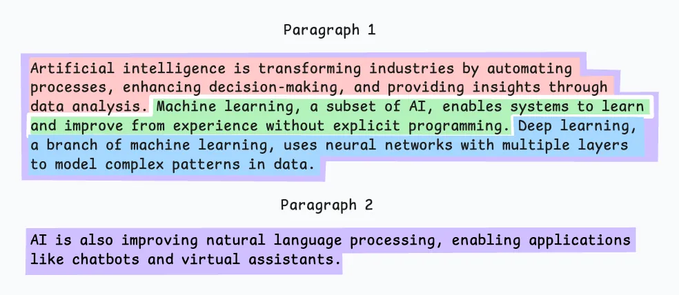

**基于语义分块**

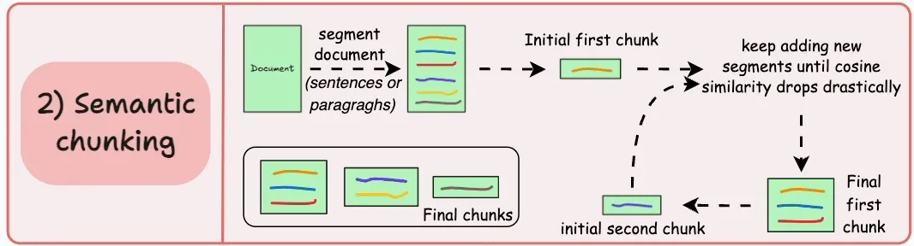

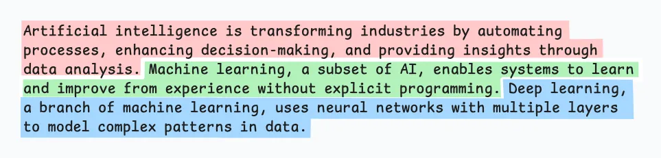

* **做法：**&#x5229;用自然语言处理的方法，根据语义或句子边界来切分，**比如在句子结尾或标点处分块（根据有意义的单元，如句子、段落或主题部分对文档进行分段），或者通过模型预测段落边界**。这样可以尽量保证每个 chunk 语义独立完整。比如为每个分段创建embedding，如果第一个分段的embedding与第二个分段的embedding具有很高的余弦相似度，那么这两个分段就会形成一个分块。这个过程一直持续到余弦相似度显著下降为止。一旦出现这种情况，我们就会开始一个新的片段，然后重复上述步骤。这样可以保持语言的自然流畅，保留完整的思想。由于每个语块的内容都更丰富，因此提高了检索的准确性，反过来，LLM 也能做出更连贯、更相关的回应。一个小问题是，它依赖于一个阈值来确定余弦相似度是否显著下降，而这个阈值可能因文档而异。

* **优点：**&#x4E0A;下文相关性、灵活性、提高检索准确性

* **缺点：**&#x590D;杂性、处理时间长、计算成本高、阈值调整

**NLTK（Natural Language Toolkit）** 是广泛使用的 Python 自然语言处理库，提供了丰富的文本处理功能。其中，**`sent_tokenize`** 方法可用于自动将文本切分为句子。

**原理**：**`sent_tokenize`** 基于论&#x6587;**《Unsupervised Multilingual Sentence Boundary Detection》**&#x7684;方法，使用无监督算法为缩写词、搭配词和句子开头的词建立模型，然后利用这些模型识别句子边界。这种方法在多种语言（主要是欧洲语言）上都取得了良好效果。

* **预训练模型缺失**：NLTK 官方并未提供中文分句模型的预训练权重，需要用户自行训练。

* **训练接口可用**：NLTK 提供了训练接口，用户可以基于自己的中文语料库训练分句模型。

* **在 LangChain 中的应用**

**LangChain&#x20;**&#x96C6;成了 NLTK 的文本切分功能，方便用户直接调用。

**使用示例**：

```python
from langchain.text_splitter import NLTKTextSplitter
text_splitter = NLTKTextSplitter()
text = "..."  # 待处理的文本
texts = text_splitter.split_text(text)
for doc in texts:print(doc)
```

* **扩展：基于 spaCy 的文本切块**

**spaCy** 是另一款强大的自然语言处理库，具备更高级的语言分析能力。LangChain 也集成了 spaCy 的文本切分方法。

**使用方法**：

只需将 **`NLTKTextSplitter`** 替换为 **`SpacyTextSplitter`**：

```python
from langchain.text_splitter import SpacyTextSplitter
text_splitter = SpacyTextSplitter()
text = "..."  # 待处理的文本
texts = text_splitter.split_text(text)

for doc in texts:print(doc)
```

***提示：使用 spaCy 时，需要先下载对应语言的模型。例如，处理中文文本时，需要下载中文模型包。***

**LangChain中也集成了基于 embedding 的 semantic chunker，能够将文本或数据按照语义信息进行分块**

```python
from langchain_experimental.text_splitter import SemanticChunker
from langchain_openai.embeddings import OpenAIEmbeddings
text_splitter = SemanticChunker(OpenAIEmbeddings())
docs = text_splitter.create_documents([state_of_the_union])
print(docs[0].page_content)
```

* **基于文档结构分块**

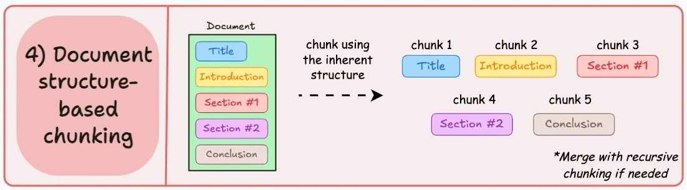

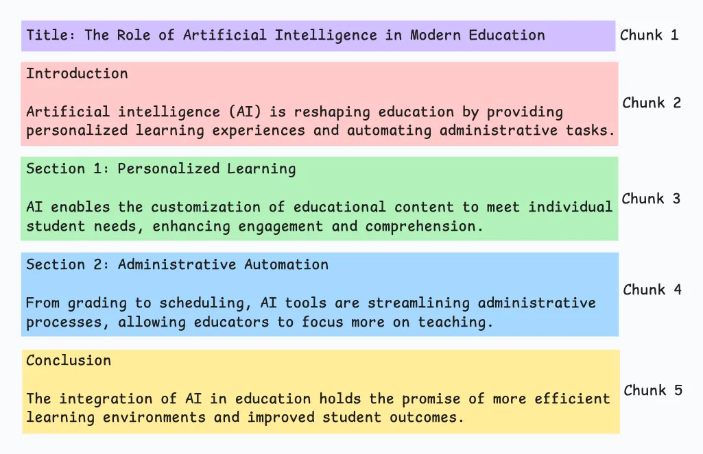

利用文档内部已经有的内在结构（标题、章节、段落等）进行分块，能够保持文档的自然结构，但前提是文档具有清晰的结构。但是这样分出来的chunks长度不一样，可能有些chunk过长超出大模型的上下文长度，这时候可以结合递归式分块

* **基于大模型的分块**

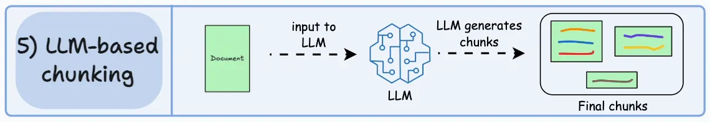

使用 LLM 来直接创建chunks，可以生成语义孤立且有意义的chunk。很明显，这种方法可以确保较高的语义准确性，因为 LLM 可以理解上下文和意义，而不是简单的启发式方法。唯一的问题是，这种方法对计算要求最高的分块技术。而且，由于 LLM 的上下文窗口通常有限，这也是需要注意的问题

**Dense X Retrieval: What Retrieval Granularity Should We Use?&#x20;**&#x7684;论文介绍了一种新的检索单位，称为 **proposition** 。**proposition 被定义为文本中的 atomic expressions**（不能进一步分解的单个语义元素，可用于构成更大的语义单位） **，用于检索和表达文本中的独特事实或特定概念，能够以简明扼要的方式表达，使用自然语言完整地呈现一个独立的概念或事实，不需要额外的信息来解释**

通过构建提示词并与 LLM 交互来获取。LlamaIndex 和 Langchain 都实现了相关算法。**LlamaIndex** 的实现思路是使用论文中提供的提示词来生成 proposition ：

```python
PROPOSITIONS_PROMPT = PromptTemplate(
    """Decompose the "Content" into clear and simple propositions, ensuring they are interpretable out of
context.
1. Split compound sentence into simple sentences. Maintain the original phrasing from the input
whenever possible.
2. For any named entity that is accompanied by additional descriptive information, separate this
information into its own distinct proposition.
3. Decontextualize the proposition by adding necessary modifier to nouns or entire sentences
and replacing pronouns (e.g., "it", "he", "she", "they", "this", "that") with the full name of the
entities they refer to.
4. Present the results as a list of strings, formatted in JSON.

Input: Title: ¯Eostre. Section: Theories and interpretations, Connection to Easter Hares. Content:
The earliest evidence for the Easter Hare (Osterhase) was recorded in south-west Germany in
1678 by the professor of medicine Georg Franck von Franckenau, but it remained unknown in
other parts of Germany until the 18th century. Scholar Richard Sermon writes that "hares were
frequently seen in gardens in spring, and thus may have served as a convenient explanation for the
origin of the colored eggs hidden there for children. Alternatively, there is a European tradition
that hares laid eggs, since a hare’s scratch or form and a lapwing’s nest look very similar, and
both occur on grassland and are first seen in the spring. In the nineteenth century the influence
of Easter cards, toys, and books was to make the Easter Hare/Rabbit popular throughout Europe.
German immigrants then exported the custom to Britain and America where it evolved into the
Easter Bunny."
Output: [ "The earliest evidence for the Easter Hare was recorded in south-west Germany in
1678 by Georg Franck von Franckenau.", "Georg Franck von Franckenau was a professor of
medicine.", "The evidence for the Easter Hare remained unknown in other parts of Germany until
the 18th century.", "Richard Sermon was a scholar.", "Richard Sermon writes a hypothesis about
the possible explanation for the connection between hares and the tradition during Easter", "Hares
were frequently seen in gardens in spring.", "Hares may have served as a convenient explanation
for the origin of the colored eggs hidden in gardens for children.", "There is a European tradition
that hares laid eggs.", "A hare’s scratch or form and a lapwing’s nest look very similar.", "Both
hares and lapwing’s nests occur on grassland and are first seen in the spring.", "In the nineteenth
century the influence of Easter cards, toys, and books was to make the Easter Hare/Rabbit popular
throughout Europe.", "German immigrants exported the custom of the Easter Hare/Rabbit to
Britain and America.", "The custom of the Easter Hare/Rabbit evolved into the Easter Bunny in
Britain and America." ]

Input: {node_text}
Output:"""
)
```

## **Embedding模型阶段**

嵌入模型能把文本转换成向量，不同的嵌入模型带来的效果也不尽相同，推荐参考Hugging Face的嵌入模型排行榜MTEB https://huggingface.co/spaces/mteb/leaderboard

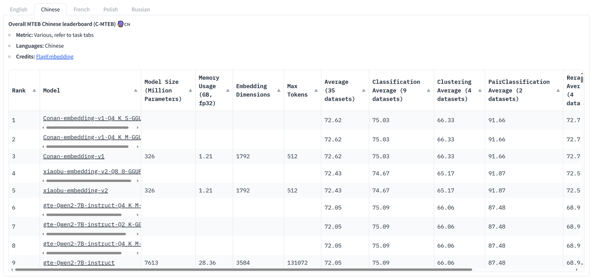

## **向量数据库阶段**

* **元数据：**&#x5728;向量数据库中存储向量数据时，某些数据库支持将向量与元数据（即非向量化的数据）一同存储。为向量添加元数据标注是一种提高检索效率的有效策略，它在处理搜索结果时发挥着重要作用。

  * 例如，日期就是一种常见的元数据标签。它能够帮助我们根据时间顺序进行筛选。设想一下，如果我们正在开发一款允许用户查询他们电子邮件历史记录的应用程序。在这种情况下，日期最近的电子邮件可能与用户的查询更相关。然而，从嵌入的角度来看，我们无法直接判断这些邮件与用户查询的相似度。通过将每封电子邮件的日期作为元数据附加到其嵌入中，我们可以在检索过程中优先考虑最近日期的邮件，从而提高搜索结果的相关性。

  * 此外，还可以添加诸如章节或小节的引用，文本的关键信息、小节标题或关键词等作为元数据。这些元数据不仅有助于改进知识检索的准确性，还能为最终用户提供更加丰富和精确的搜索体验

## **查询索引阶段（检索召回、重排）**

* **多级索引：元数据无法充分区分不同上下文类型的情况下，可以考虑进一步尝试多重索引技术**。

  * 多重索引技术的核心思想是将庞大的数据和信息需求按类别划分，并在不同层级中组织，以实现更有效的管理和检索。这意味着系统不仅依赖于单一索引，而是建立了多个针对不同数据类型和查询需求的索引

  * 例如，可能有一个索引专门处理摘要类问题，另一个专门应对直接寻求具体答案的问题，还有一个专门针对需要考虑时间因素的问题。这种多重索引策略使RAG系统能够根据查询的性质和上下文，选择最合适的索引进行数据检索，从而提升检索质量和响应速度。但为了引入多重索引技术，还需配套加入多级路由机制

  * 多级路由机制确保每个查询被高效引导至最合适的索引。查询根据其特点（如复杂性、所需信息类型等）被路由至一个或多个特定索引。这不仅提升了处理效率，还优化了资源分配和使用，确保了对各类查询的精确匹配

  * 例如，对于查询“最新上映的科幻电影推荐”，RAG系统可能首先将其路由至专门处理当前热点话题的索引，然后利用专注于娱乐和影视内容的索引来生成相关推荐

* **索引/查询算法：**

  * 可以利用索引筛选数据，从筛选后的数据中检索出相关的文本向量。由于向量数据量庞大且复杂，寻找绝对的最优解变得计算成本极高，有时甚至是不可行的。加之，大模型本质上并不是完全确定性的系统，这些模型在搜索时追求的是语义上的相似性——一种合理的匹配即可。从应用的角度来看，这种方法是合理的

  * 例如，在推荐系统中，用户不太可能察觉到或关心是否每个推荐的项目都是绝对的最佳匹配；他们更关心的是推荐是否总体上与他们的兴趣相符。因此查找与查询向量完全相同的项通常不是目标，而是要找到“足够接近”或“相似”的项，这便是最近邻搜索（Approximate Nearest Neighbor Search，ANNS）。这样做不仅能满足需求，还为检索优化提供了巨大的优化潜力。下面我们会介绍一些常见的向量搜索算法以便大家在具体使用场景中进行取舍

  1. **聚类：K-means等**

  2. **位置敏感哈希：**&#x6CBF;着缩小搜索范围的思路，位置敏感哈希算法是另外一种实现的策略。在传统的哈希算法中，通常希望每个输入对应一个唯一的输出值，并努力减少输出值的重复。然而，在位置敏感哈希算法中，我们的目标恰恰相反，我们需要增加输出值碰撞的概率。这种碰撞正是分组的关键，哈希值相同的向量将被分配到同一个组中，也就是同一个“桶”里。此外，这种哈希函数还需满足另一个条件：空间上距离较近的向量更有可能被分入同一个桶。这样在进行搜索时，只需获取目标向量的哈希值，找到相应的桶，并在该桶内进行搜索即可

  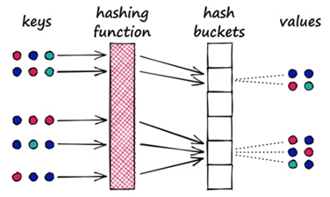

  * **量化乘积、分层导航小世界**等

* **查询转换：**&#x5728;RAG系统中，用户的查询问题被转化为向量，然后在向量数据库中进行匹配。不难想象，查询的措辞会直接影响搜索结果。如果搜索结果不理想，可以尝试以下几种方法对问题进行重写，以提升召回效果

  * **结合历史对话的重新表述：**&#x5728;向量空间中，对人类来说看似相同的两个问题其向量大小并不一定很相似。我们可以直接利用LLM 重新表述问题来进行尝试。此外，在进行多轮对话时，用户的提问中的某个词可能会指代上文中的部分信息，因此可以将历史信息和用户提问一并交给LLM重新表述

  * **假设文档嵌入（HyDE）：**&#x48;yDE的核心思想是接收用户提问后，先让LLM在没有外部知识的情况下生成一个假设性的回复。然后，将这个假设性回复和原始查询一起用于向量检索。假设回复可能包含虚假信息，但蕴含着LLM认为相关的信息和文档模式，有助于在知识库中寻找类似的文档

  * **退后提示（Step Back Prompting）：**&#x5982;果果原始查询太复杂或返回的信息太广泛，我们可以选择生成一个抽象层次更高的“退后”问题，与原始问题一起用于检索，以增加返回结果的数量。例如，原问题是“桌子君在特定时期去了哪所学校”，而退后问题可能是关于他的“教育历史”。这种更高层次的问题可能更容易找到答案

  * **多查询检索/多路召回（Multi Query Retrieval）**&#x4F7F;用LLM生成多个搜索查询，特别适用于一个问题可能需要依赖多个子问题的情况

* **检索参数：**&#x5177;体的检索过程中，可以根据向量数据库的特定设置来优化一些检索参数，以下是一些常见的可设定参数

  * **稀疏和稠密搜索权重：**&#x7A20;密搜索即通过向量进行搜索。然而，在某些场景下可能存在限制，此时可以尝试使用原始字符串进行关键字匹配的稀疏搜索。一种有效的稀疏搜索算法是最佳匹配25（BM25），它基于统计输入短语中的单词频率，频繁出现的单词得分较低，**而稀有的词被视为关键词，得分会较高**。我们可以结合稀疏和稠密搜索得出最终结果。向量数据库通常允许设定两者对最终结果评分的权重比例，如0.6表示40%的得分来自稀疏搜索，60%来自稠密搜索

  * **结果数量（topK）：**&#x68C0;索结果的数量是另一个关键因素。足够的检索结果可以确保系统覆盖到用户查询的各个方面。在回答多方面或复杂问题时，更多的结果提供了丰富的语境，有助于RAG系统更好地理解问题的上下文和隐含细节。但需注意，结果数量过多可能导致信息过载，降低回答准确性并增加系统的时间和资源成

  * **相似度度量方法：**&#x8BA1;算两个向量相似度的方法也是一个可选参数。这包括使用欧式距离和Jaccard距离计算两个向量的差异，以及利用余弦相似度衡量夹角的相似性。通常，余弦相似度更受青睐，因为它不受向量长度的影响，只反映方向上的相似度。这使得模型能够忽略文本长度差异，专注于内容的语义相似性。需要注意的是，并非所有嵌入模型都支持所有度量方法，具体可参考所用嵌入模型的说明

* **高级检索策略：**

  * **上下文压缩：**&#x5F53;文档文块过大时，可能包含太多不相关的信息，传递这样的整个文档可能导致更昂贵的LLM调用和更差的响应。上下文压缩的思想就是通过LLM的帮助根据上下文对单个文档内容进行压缩，或者对返回结果进行一定程度的过滤仅返回相关信息

  * **句子窗口搜索：**&#x76F8;反，文档文块太小会导致上下文的缺失。其中一种解决方案就是窗口搜索，该方法的核心思想是当提问匹配好分块后，将该分块周围的块作为上下文一并交给LLM进行输出，来增加LLM对文档上下文的理解

  * **父文档搜索：**&#x7236;文档搜索也是一种很相似的解决方案，父文档搜索先将文档分为尺寸更大的主文档，再把主文档分割为更短的子文档两个层级，用户问题会与子文档匹配，然后将该子文档所属的主文档和用户提问发送给LLM

  * **自动合并：**&#x81EA;动合并是在父文档搜索上更进一步的复杂解决方案。同样地，我们先对文档进行结构切割，比如将文档按三层树状结构进行切割，顶层节点的块大小为1024，中间层的块大小为512，底层的叶子节点的块大小为128。而在检索时只拿叶子节点和问题进行匹配，当某个父节点下的多数叶子节点都与问题匹配上则将该父节点作为结果返回。

  * **多向量检索：**&#x591A;向量检索同样会给一个知识文档转化成多个向量存入数据库，不同的是，这些向量不仅包括文档在不同大小下的分块，还可以包括该文档的摘要，用户可能提出的问题等等有助于检索的信息。在使用多向量查询的情况下，每个向量可能代表了文档的不同方面，使得系统能够更全面地考虑文档内容，并在回答复杂或多方面的查询时提供更精确的结果。例如，如果查询与文档的某个具体部分或摘要更相关，那么相应的向量就可以帮助提高这部分内容的检索排名

  * **多代理检索：**&#x591A;代理检索，简而言之就是选取优化策略中的部分交给一个智能代理合并使用。就比如使用子问题查询，多级索引和多向量查询结合，先让子问题查询代理把用户提问拆解为多个小问题，再让文档代理对每个字问题进行多向量或多索引检索，最后排名代理将所有检索的文档总结再交给LLM。这样做的好处是可以取长补短，比如，子问题查询引擎在探索每个子查询时可能会缺乏深度，尤其是在相互关联或关系数据中。相反，文档代理递归检索在深入研究特定文档和检索详细答案方面表现出色，以此来综合多种方法解决问题。需要注意的是现在网络上存在不同结构的多代理检索，具体在多代理选取哪些优化步骤尚未有确切定论，可以结合使用场景进行探索

  * **Self-RAG：**&#x81EA;反思搜索增强是一个全新RAG框架，其与传统RAG最大的区别在于通过检索评分和反思评分来提高质量。它主要分为三个步骤：检索、生成和批评。Self-RAG首先用检索评分来评估用户提问是否需要检索，如果需要检索，LLM将调用外部检索模块查找相关文档。接着，LLM分别为每个检索到的知识块生成答案，然后为每个答案生成反思评分来评估检索到的文档是否相关，最后将评分高的文档当作最终结果一并交给LLM

* **重排模型：**&#x52;eranking，重排模型通过对初始检索结果进行更深入的相关性评估和排序，确保最终展示给用户的结果更加符合其查询意图。这一过程通常由深度学习模型实现，如Cohere模型。这些模型会考虑更多的特征，如查询意图、词汇的多重语义、用户的历史行为和上下文信息等

  * 举个例子，对于查询“最新上映的科幻电影推荐”，在首次检索阶段，系统可能基于关键词返回包括科幻电影的历史文章、科幻小说介绍、最新电影的新闻等结果。然后，在重排阶段，模型会对这些结果进行深入分析，并将最相关、最符合用户查询意图的结果（如最新上映的科幻电影列表、评论或推荐）排在前面，同时将那些关于科幻电影历史或不太相关的内容排在后面。这样，重排模型就能有效提升检索结果的相关性和准确性，更好地满足用户的需求。在实践中，使用RAG构建系统时都应考虑尝试重排方法，以评估其是否能够提高系统性能

## **生成回答阶段**

* **提示词：**&#x5927;型语言模型的解码器部分通常基于给定输入来预测下一个词。这意味着设计提示词或问题的方式将直接影响模型预测下一个词的概率。这也给了我们一些启示：通过改变提示词的形式，可以有效地影响模型对不同类型问题的接受程度和回答方式，比如修改提示语，让LLM知道它在做什么工作，是十分有帮助的

  为了减少模型产生主观回答和幻觉的概率，一般情况下，**RAG系统中的提示词中应明确指出回答仅基于搜索结果**，不要添加任何其他信息例如，可以设置提示词如：

  > “你是一名智能客服。你的目标是提供准确的信息，并尽可能帮助提问者解决问题。你应保持友善，但不要过于啰嗦。请根据提供的上下文信息，在不考虑已有知识的情况下，回答相关查询。”

  当然也可以根据场景需要，也可以适当让模型的回答融入一些主观性或其对知识的理解。此外，使用少量样本（few-shot）的方法，将想要的问答例子加入提示词中，指导LLM如何利用检索到的知识，也是提升LLM生成内容质量的有效方法。这种方法不仅使模型的回答更加精准，也提高了其在特定情境下的实用性

* **LLM：**&#x53EF;以根据自己的需求选择LLM，例如开放模型与专有模型、推理成本、上下文长度等。此外，可以使用一些LLM开发框架来搭建RAG系统，比如，**LlamaIndex或LangChain**。这两个框架都拥有比较好用的debugging工具，可以让我们定义回调函数，查看使用了哪些上下文，检查检索结果来自哪个文档等等

**RAG展望：**

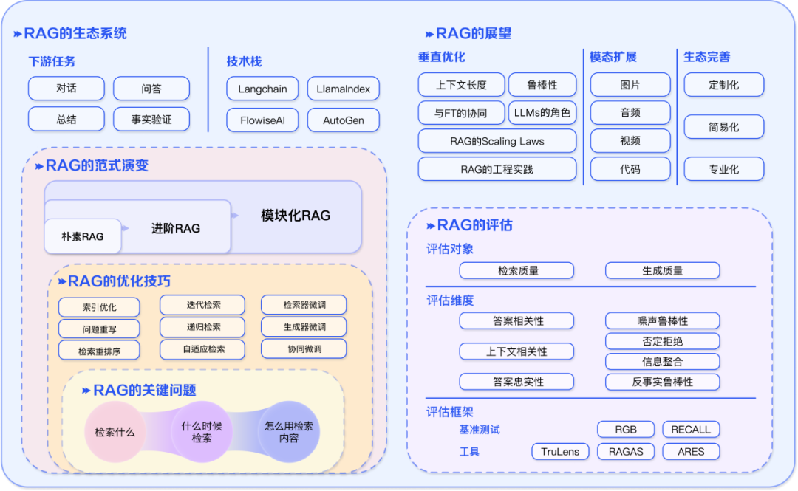

# **6.3.5 RAG方向**

## 业界主要方向

* RAG业界重点方向主要聚焦在内容供给上，方法包含query改写、query路由、向量召回、重排、大模型和搜索引擎的交互方式。我们的场景已经具备较好的检索能力，因此论文方向跟我们的匹配度相对较低。目前可参考的点有query改写、切chunk召回两个方向

* 内容归纳总结能力方向上，学术界论文主要聚焦在消除幻觉的方法研究，对于生成response内容全面性，生成结果稳定性等方面鲜有相关论文。与我们一样更加关注内容全面性，生成内容格式，生成效果稳定性的工业界（例如百度，bing等），并未开源相关资料。因此我们调研的重心放在消除幻觉的方法上，其中针对response的二次校验方法(CoVe, SAFE 等) 以及生成response时的解码方式(DoLa)可作为后续尝试方向

## **可尝试方法方向**

* **检索方向**

  * **query 扩展：**

    * 改写原始 query，扩展 query 方向

    * 提高检索结果多样性，进而提高生成结果全面性

  * **切片 + 向量检索：**

    * 大搜都是基于TopN进行term/向量召回，L2、L3的表征也都是基于TopN构建

    * 切片解决关键信息在文章靠后位置的问题

* **生成方向**

  * **prompt中passage顺序优化：**&#x5927;模型对越靠后的文本注意力越强，识别的准确率越高，因此在元知大模型生成时可以将qtc和PR高的高质量文献排在后边。

  * **response数据二次refine:&#x20;**&#x20;利用kimi/gpt4对生成结果、人工标注结果做refine,  得到更高质量的sft数据，可用于模型sft & 数据蒸馏

    refine case：

    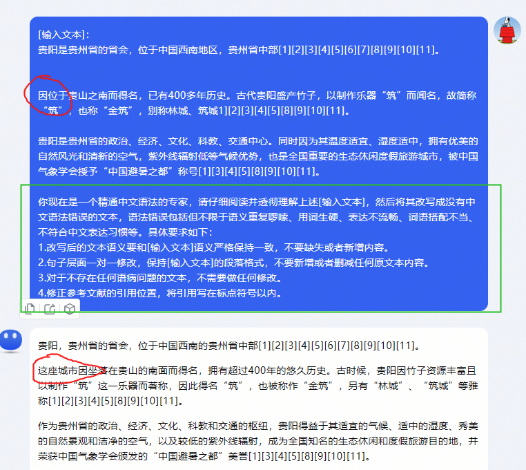

  * **链式验证（CoVe）方法：**&#x901A;过该方法模型首先生成基准回答，然后生成验证问题来核实生成的结果，独立回答这些问题以避免受到其他回答的影响，最终生成验证后的回答

    

  * **搜索增强事实（SAFE）评估方法: &#x20;**&#x4F5C;为CoVe的升级方法，在链式验证中引入检索增强，通过将LLM生成的response拆分成多个事实，剔除与问题无关的事实内容，并针对每个相关事实进行检索增强，细粒度判断检索结果是否支持该事实

    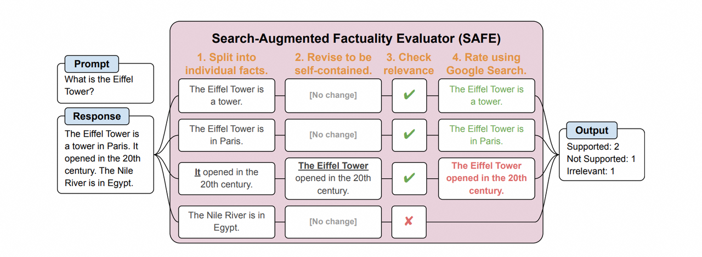

  * **层对比解码(Decoding by Contrasting Layers, DoLa)：&#x20;**&#x5728;生成结果解码时同时关注Transformer高层与底层的知识，通过强调较高层中的知识并淡化低层中的知识，在不检索外部知识或进行额外微调的情况下，减少语言模型的幻觉

    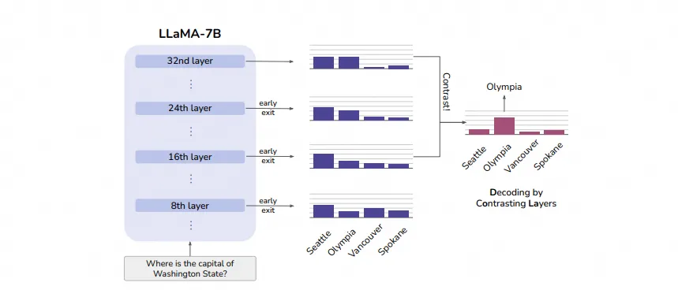

## **RAG主流产品**

> * OpenAI-GPT 检索增强插件
>
> * 百度-[文心一言](https://yiyan.baidu.com/)
>
> * 百度搜索-RAG SC
>
> * 头条搜索-RAG SC
>
> * [Perplexity](https://www.perplexity.ai/)
>
> * Bing Copilot
>
> * 360-[360AI搜索](https://www.sou.com/)
>
> * 百川-[百川大模型-汇聚世界知识 创作妙笔生花-百川智能](https://www.baichuan-ai.com/home)
>
> * 月之暗面-[Kimi.ai - 帮你看更大的世界](https://kimi.moonshot.cn/)
>
> * 秘塔-[秘塔AI搜索](https://metaso.cn/)
>
> * 网易有道-[QAnything](https://qanything.ai/)
>   [GitHub - netease-youdao/QAnything: Question and Answer based on Anything.](https://github.com/netease-youdao/QAnything)&#x20;
>
> * 开发库：
>
>   * [LangChain](https://www.langchain.com/)&#x20;
>
>   * [LlamaIndex, Data Framework for LLM Applications](https://www.llamaindex.ai/)&#x20;

## **项目参考**

> 1. Langchain-Chatchat 入坑RAG的第一个项目，教程详细，上手友好，检索部分可优化点多，可自行魔改。
>
>    1. 可以优化的点：加一个结合历史信息改写当前Query的模块；引入重排模块
>
> 2. QAnyThing 网易有道的RAG开源项目，拿实验室的文件数据实测效果不错。
>
> 3. [JARVIS](https://github.com/microsoft/JARVIS) HuggingGPT，single-agent从此大火。
>
> 4. [AutoGPT](https://github.com/Significant-Gravitas/AutoGPT) agent项目的必看系列。
>
> 5. [generative\_agents](https://github.com/joonspk-research/generative_agents) 斯坦福小镇

# **6.3.6 常见检索优化算法实现**

> **一句话总结**：检索优化主要包括：多查询改写、RAG融合、step Back、查询分解和HyDE。

* **在开始代码前，你需要配置你的环境**

```python
import os
os.environ['LANGCHAIN_TRACING_V2'] = 'true'
os.environ['LANGCHAIN_ENDPOINT'] = 'https://api.smith.langchain.com'
os.environ['LANGCHAIN_API_KEY'] = <your-api-key>
os.environ['OPENAI_API_KEY'] = <your-api-key>
```

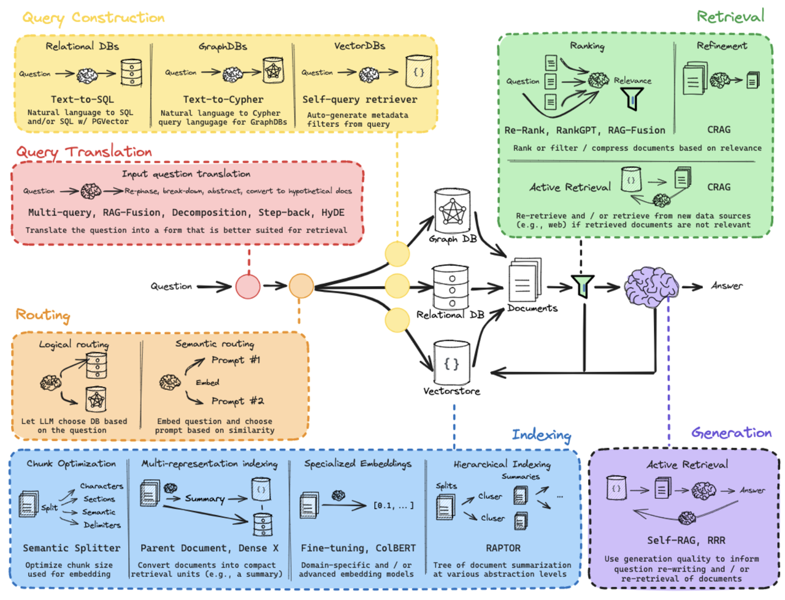

图源：https://docs.google.com/presentation/d/1C9IaAwHoWcc4RSTqo-pCoN3h0nCgqV2JEYZUJunv\_9Q/edit?slide=id.g2b6714d62f7\_0\_0#slide=id.g2b6714d62f7\_0\_0

## **Multi Query**

> **目的**：从不同的维度（即不同角度）改写用户查询，在实现上即把一个查询改写成多个查询。

* **indexing**

```python
# Load blog
import bs4
from langchain_community.document_loaders import WebBaseLoader
loader = WebBaseLoader(
    web_paths=("https://lilianweng.github.io/posts/2023-06-23-agent/",),
    bs_kwargs=dict(
        parse_only=bs4.SoupStrainer(
            class_=("post-content", "post-title", "post-header")
        )
    ),
)
blog_docs = loader.load()

# Split
from langchain.text_splitter import RecursiveCharacterTextSplitter
text_splitter = RecursiveCharacterTextSplitter.from_tiktoken_encoder(
    chunk_size=300, 
    chunk_overlap=50)

# Make splits
splits = text_splitter.split_documents(blog_docs)

# Index
from langchain_openai import OpenAIEmbeddings
from langchain_community.vectorstores import Chroma
vectorstore = Chroma.from_documents(documents=splits, 
                                    embedding=OpenAIEmbeddings())

retriever = vectorstore.as_retriever()
```

* **Prompt构造**

```python
from langchain.prompts import ChatPromptTemplate

# Multi Query: Different Perspectives
template = """你是一款AI语言模型助手。你的任务是为用户提供的问题生成五个不同版本的改写，以便从向量数据库中检索相关文档。通过从多个角度改写用户问题，你的目标是帮助用户克服基于距离的相似性搜索的一些局限性。
请将这些改写问题用换行符分隔。原始问题：{question}"""
prompt_perspectives = ChatPromptTemplate.from_template(template)

from langchain_core.output_parsers import StrOutputParser
from langchain_openai import ChatOpenAI

generate_queries = (
    prompt_perspectives 
    | ChatOpenAI(temperature=0) 
    | StrOutputParser() 
    | (lambda x: x.split("\n"))
)
```

* **检索文档**

```python
from langchain.load import dumps, loads

def get_unique_union(documents: list[list]):
    """ Unique union of retrieved docs """
    # Flatten list of lists, and convert each Document to string
    flattened_docs = [dumps(doc) for sublist in documents for doc in sublist]
    # Get unique documents
    unique_docs = list(set(flattened_docs))
    # Return
    return [loads(doc) for doc in unique_docs]

# Retrieve
question = "What is task decomposition for LLM agents?"
retrieval_chain = generate_queries | retriever.map() | get_unique_union
docs = retrieval_chain.invoke({"question":question})
len(docs)
```

* **内容生成**

```python
from operator import itemgetter
from langchain_openai import ChatOpenAI
from langchain_core.runnables import RunnablePassthrough

# RAG
template = """Answer the following question based on this context:

{context}

Question: {question}
"""

prompt = ChatPromptTemplate.from_template(template)

llm = ChatOpenAI(temperature=0)

final_rag_chain = (
    {"context": retrieval_chain, 
     "question": itemgetter("question")} 
    | prompt
    | llm
    | StrOutputParser()
)

final_rag_chain.invoke({"question":question})
```

## &#x20;**RAG-Fusion**

> **目的**：从多个角度重写用户问题，检索每个重写问题的文档，并组合多个搜索结果列表的排名，以使用倒数排名融合(RRF)生成单一、统一的排名。

* **构造prompt**

```python
from langchain.prompts import ChatPromptTemplate

# RAG-Fusion: Related
template = """You are a helpful assistant that generates multiple search queries based on a single input query. \n
Generate multiple search queries related to: {question} \n
Output (4 queries):"""
prompt_rag_fusion = ChatPromptTemplate.from_template(template)

from langchain_core.output_parsers import StrOutputParser
from langchain_openai import ChatOpenAI

generate_queries = (
    prompt_rag_fusion 
    | ChatOpenAI(temperature=0)
    | StrOutputParser() 
    | (lambda x: x.split("\n"))
)
```

* **核心代码实现**

```python
from langchain.load import dumps, loads

def reciprocal_rank_fusion(results: list[list], k=60):
    """ Reciprocal Rank Fusion），该方法接收多个已排序的文档列表，以及在 RRF 公式中使用的可选参数 k。"""
    
    # Initialize a dictionary to hold fused scores for each unique document
    fused_scores = {}

    # Iterate through each list of ranked documents
    for docs in results:
        # Iterate through each document in the list, with its rank (position in the list)
        for rank, doc in enumerate(docs):
            # Convert the document to a string format to use as a key (assumes documents can be serialized to JSON)
            doc_str = dumps(doc)
            # If the document is not yet in the fused_scores dictionary, add it with an initial score of 0
            if doc_str not in fused_scores:
                fused_scores[doc_str] = 0
            # Retrieve the current score of the document, if any
            previous_score = fused_scores[doc_str]
            # Update the score of the document using the RRF formula: 1 / (rank + k)
            fused_scores[doc_str] += 1 / (rank + k)

    # Sort the documents based on their fused scores in descending order to get the final reranked results
    reranked_results = [
        (loads(doc), score)
        for doc, score in sorted(fused_scores.items(), key=lambda x: x[1], reverse=True)
    ]

    # Return the reranked results as a list of tuples, each containing the document and its fused score
    return reranked_results

retrieval_chain_rag_fusion = generate_queries | retriever.map() | reciprocal_rank_fusion
docs = retrieval_chain_rag_fusion.invoke({"question": question})
len(docs)


```

* **结果生成**

```python
from langchain_core.runnables import RunnablePassthrough

# RAG
template = """Answer the following question based on this context:

{context}

Question: {question}
"""

prompt = ChatPromptTemplate.from_template(template)

final_rag_chain = (
    {"context": retrieval_chain_rag_fusion, 
     "question": itemgetter("question")} 
    | prompt
    | llm
    | StrOutputParser()
)

final_rag_chain.invoke({"question":question})
```

## **Decomposition**

> **目的**：将一个复杂问题分解成多个子问题，将问题分解为一组子问题/问题，可以按顺序解决（使用第一个问题的答案+检索来回答第二个问题），也可以并行解决（将每个答案合并为最终答案），这个是向下分解

* **构造答案迭代式回答的prompt**

```python
from langchain.prompts import ChatPromptTemplate

# Prompt
template = """Here is the question you need to answer:

\n --- \n {question} \n --- \n

Here is any available background question + answer pairs:

\n --- \n {q_a_pairs} \n --- \n

Here is additional context relevant to the question: 

\n --- \n {context} \n --- \n

Use the above context and any background question + answer pairs to answer the question: \n {question}
"""

decomposition_prompt = ChatPromptTemplate.from_template(template)


```

* **构造答案独立回答的prompt**

```python
# Answer each sub-question individually 

from langchain import hub
from langchain_core.prompts import ChatPromptTemplate
from langchain_core.runnables import RunnablePassthrough, RunnableLambda
from langchain_core.output_parsers import StrOutputParser
from langchain_openai import ChatOpenAI

# RAG prompt
prompt_rag = hub.pull("rlm/rag-prompt")

def retrieve_and_rag(question,prompt_rag,sub_question_generator_chain):
    """RAG on each sub-question"""
    
    # Use our decomposition / 
    sub_questions = sub_question_generator_chain.invoke({"question":question})
    
    # Initialize a list to hold RAG chain results
    rag_results = []
    
    for sub_question in sub_questions:
        
        # Retrieve documents for each sub-question
        retrieved_docs = retriever.get_relevant_documents(sub_question)
        
        # Use retrieved documents and sub-question in RAG chain
        answer = (prompt_rag | llm | StrOutputParser()).invoke({"context": retrieved_docs, 
                                                                "question": sub_question})
        rag_results.append(answer)
    
    return rag_results,sub_questions

# Wrap the retrieval and RAG process in a RunnableLambda for integration into a chain
answers, questions = retrieve_and_rag(question, prompt_rag, generate_queries_decomposition)
```

* **生成答案**

```python
from operator import itemgetter
from langchain_core.output_parsers import StrOutputParser

def format_qa_pair(question, answer):
    """Format Q and A pair"""
    
    formatted_string = ""
    formatted_string += f"Question: {question}\nAnswer: {answer}\n\n"
    return formatted_string.strip()

# llm
llm = ChatOpenAI(model_name="gpt-3.5-turbo", temperature=0)

q_a_pairs = ""
for q in questions:
    
    rag_chain = (
    {"context": itemgetter("question") | retriever, 
     "question": itemgetter("question"),
     "q_a_pairs": itemgetter("q_a_pairs")} 
    | decomposition_prompt
    | llm
    | StrOutputParser())

    answer = rag_chain.invoke({"question":q,"q_a_pairs":q_a_pairs})
    q_a_pair = format_qa_pair(q,answer)
    q_a_pairs = q_a_pairs + "\n---\n"+  q_a_pair
```

## **Step Back**

> **目的**：鼓励 LLM 从具体实例中退一步，参与对底层一般概念或原则的推理。

* **构造few shot**

```python
# Few Shot Examples
from langchain_core.prompts import ChatPromptTemplate, FewShotChatMessagePromptTemplate
examples = [
    {
        "input": "Could the members of The Police perform lawful arrests?",
        "output": "what can the members of The Police do?",
    },
    {
        "input": "Jan Sindel’s was born in what country?",
        "output": "what is Jan Sindel’s personal history?",
    },
]
# We now transform these to example messages
example_prompt = ChatPromptTemplate.from_messages(
    [
        ("human", "{input}"),
        ("ai", "{output}"),
    ]
)
few_shot_prompt = FewShotChatMessagePromptTemplate(
    example_prompt=example_prompt,
    examples=examples,
)
```

* **构造prompt**

```python
prompt = ChatPromptTemplate.from_messages(
    [
        (
            "system",
            """你是一位世界知识领域的专家。你的任务是退一步，将问题改写为更通用的、便于回答的“退一步”问题。以下是一些示例：""",
        ),
        # Few shot examples
        few_shot_prompt,
        # New question
        ("user", "{question}"),
    ]
)

generate_queries_step_back = prompt | ChatOpenAI(temperature=0) | StrOutputParser()
question = "LLM代理的任务分解是什么？"
generate_queries_step_back.invoke({"question": question})

# Response prompt 
response_prompt_template = """你是一位世界知识领域的专家。我将向你提问一个问题。你的回答应当全面，并且在相关情况下不得与以下内容矛盾。如果这些内容与问题无关，则可以忽略它们。

# {normal_context}
# {step_back_context}

# Original Question: {question}
# Answer:"""
response_prompt = ChatPromptTemplate.from_template(response_prompt_template)

chain = (
    {
        # Retrieve context using the normal question
        "normal_context": RunnableLambda(lambda x: x["question"]) | retriever,
        # Retrieve context using the step-back question
        "step_back_context": generate_queries_step_back | retriever,
        # Pass on the question
        "question": lambda x: x["question"],
    }
    | response_prompt
    | ChatOpenAI(temperature=0)
    | StrOutputParser()
)

chain.invoke({"question": question})
```

## **HyDE**

> **目的**：通过生成伪文档，并使用无监督检索器对其进行编码，并在其嵌入空间中进行搜索。

* **生成伪文档**

```python
from langchain.prompts import ChatPromptTemplate

# HyDE document genration
template = """请撰写一段科学论文内容来回答以下问题。
Question: {question}
Passage:"""
prompt_hyde = ChatPromptTemplate.from_template(template)

from langchain_core.output_parsers import StrOutputParser
from langchain_openai import ChatOpenAI

generate_docs_for_retrieval = (
    prompt_hyde | ChatOpenAI(temperature=0) | StrOutputParser() 
)

# Run
question = "LLM代理的任务分解是什么?"
generate_docs_for_retrieval.invoke({"question":question})
```

* **检索**

```python
# Retrieve
retrieval_chain = generate_docs_for_retrieval | retriever 
retireved_docs = retrieval_chain.invoke({"question":question})
retireved_docs

# RAG
template = """Answer the following question based on this context:

{context}

Question: {question}
"""

prompt = ChatPromptTemplate.from_template(template)

final_rag_chain = (
    prompt
    | llm
    | StrOutputParser()
)

final_rag_chain.invoke({"context":retireved_docs,"question":question})
```

> **参考文献：**
>
> \[1] [How to use the MultiQueryRetriever](https://python.langchain.com/docs/how_to/MultiQueryRetriever/).
>
> \[2] RAG-Fusion: a New Take on Retrieval-Augmented Generation.
>
> \[3] LEAST-TO-MOST PROMPTING ENABLES COMPLEX REASONING IN LARGE LANGUAGE MODELS.
>
> \[4] TAKE A STEP BACK: EVOKING REASONING VIA ABSTRACTION IN LARGE LANGUAGE MODELS.
>
> \[5] Precise Zero-Shot Dense Retrieval without Relevance Labels.
