# **6.4.1 检索**

## **better semantic representation**

> **一句话总结**：**chunk optimization，**&#x9488;对文档进行切分，并且调整分块大小，太大或太小的文本块可能无法取得最佳召回效果。选择分块策略时，需要考虑的要素包括：索引内容的特点、使用的嵌入模型及其最适块大小、用户查询的预期长度和复杂度、以及检索结果在特定应用中的使用方式等等。

> ### **具体的优化点**
>
> * **滑动窗口技术**通过多次检索，聚合全局相关信息，实现分层检索。
>
> * **Small2big 技术**在搜索过程中使用小文本块，并为语言模型提供更大的相关文本块进行处理。
>
> * **摘要嵌入**（Abstract embedding）技术对文档摘要执行 Top K 检索，以提供完整的文档上下文。
>
> * **元数据过滤**（Metadata Filtering）技术通过文档的元数据进行过滤。
>
> * **图索引**（Graph Indexing）技术把实体和关系转化为节点和连接，这在处理多跳问题时显著提升了相关性。
>
> * **fine-tuning embedding model**
>
>   * 确定Chunk的适当大小之后，需要通过一个嵌入模型（Embedding model）将 Chunk 和查询嵌入到语义空间中。常见嵌入模型UAE、Voyage、BGE等等。
>
>   * 对嵌入模型进行 基于领域知识微调，代表方法 LlamaIndex
>
>   * 对嵌入模型进行 基于下游任务微调，代表方法 PROMPTAGATOR、LLM-Embedder

## **align queries and documents**

> **动机**：使用原始用户query在retrieval中可能搜索不到能够提供有效信息的优质doc，其重要原因是query和目标doc之间存在语义gap。

> **检索过程中可能存在的问题：**
>
> * query和doc天然地存在不对称的问题
>
> * 用户query存在表达不清的问题
>
> * 用户query存在语义信息匮乏的问题
>
> * 用户query过于具体，索引中不存在以回答该具体query为主要内容的doc
>
> * 用户query偏长尾、复杂（需要多步推理），索引中不存在能够提供直接答案的doc

> * **Query扩展（Query Expansion）：**
>
>   * **代表工作**：[query2doc](http://arxiv.org/abs/2303.07678)、[HyDE](http://arxiv.org/abs/2212.10496)、[InteR](https://arxiv.org/pdf/2305.07402.pdf)等
>
>   * **核心思路**：基于LLM的内在知识生成原始query的伪答案，然后使用伪答案做二次检索。
>
>   * **结论**：能缓解query和doc之间的不对称问题、query信息匮乏的问题，缺点是可能带来幻觉问题。
>
> * **StepBack改写：**
>
>   * **代表工作**：[StepBack-prompt](https://arxiv.org/pdf/2310.06117.pdf)
>
>   * **核心思路**：基于LLM将原始query改写成一个更“宽泛”、“抽象”的query，然后进行二次检索。
>
>   * **结论**：更“宽泛”的query有潜力召回有效doc（主题更宽泛，但其中部分内容能够回答原始具体query）。
>
> * **Query拆解（Query Decomposation）：**
>
>   * **代表工作**：[RRR](http://arxiv.org/abs/2305.14283)
>
>   * **核心思路**：构建一个query改写模型，能够将原始的单个复杂query拆解成多个子query，然后基于子query做二次检索，获取各个子query的相关结果，最后基于LLM综合生成原始query答案。
>
>   * **结论**：能够解决原始query在索引中无直接答案的问题。
>
> * **Multi Query Retrieval**
>
>   * **代表工作**：[Langchain Multi Query Retriever](https://python.langchain.com/docs/modules/data_connection/retrievers/MultiQueryRetriever)
>
>   * **核心思路**：使用LLM为原始query生成多个角度的相关问题。
>
>   * **结论**：缓解query不够具体，或者细微措辞导致的召回结果不同问题，丰富了召回结果。

# **6.4.2 生成**

## **post-retrieval with fronzen llm**

### **对RAG召回资料进行压缩**

> **目的**：通过抽取或生成的方式，对RAG召回文档进行进一步压缩，**减少输入噪声。**

> * [RECOMP: Improving Retrieval-Augmented LMs with Compression and Selective Augmentation](https://www.semanticscholar.org/paper/23af54b82c951317f1fc1841164d8a441a2d8120)
>
>   * **核心思路**：分别设计了抽取和生成两种压缩器，并对比了两种压缩器对生成结果的影响
>
>   * **抽取式压缩器**：使用对比学习的方式训练抽取式压缩器（encoder）
>
>   * **生成式压缩器**：利用Chat-GPT总结召回document集合D，作为训练集训练得到小量级的摘要生成模型（encoder-decoder）

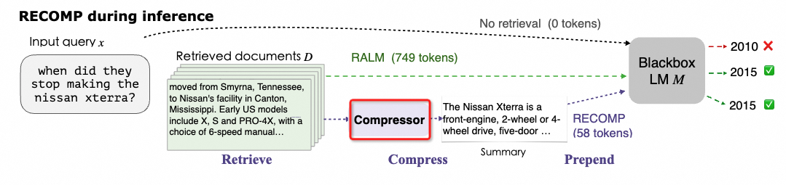

### **对RAG召回资料进行重排**

> **目的**：对RAG召回文档集合进行重排序，一方面将更优质的内容位置靠前更容易被模型利用；另一方面，可以对重排后的文档列表进行截断，从而减少输入文件的总数。

> * [\[PDF\] Open-source Large Language Models are Strong Zero-shot Query Likelihood Models for Document Ranking | Semantic Scholar](https://www.semanticscholar.org/paper/Open-source-Large-Language-Models-are-Strong-Query-Zhuang-Liu/955ffeebf843f15334c5902fc1f74af512e5e8b6)
>
>   * 核心思路：针对query和RAG召回集合
>
>   * 利用LLM对每个文档和query的组合计算QLM分数，根据QLM分数进行重排序
>
>   * QLM分数计算方式：输入文档
>
>   * LLM输出生成query的似然概率
>
>   $$S_{QLM}(\boldsymbol{q},d)=\frac{1}{|\boldsymbol{q}|}\sum_t\log\mathrm{LLM}(q_t|\boldsymbol{p},d,\boldsymbol{q}_{<t})$$

### **RAG中低相关性语料影响生成效果**

> [**The Power of Noise: Redefining Retrieval for RAG Systems**](https://www.semanticscholar.org/paper/77179e5ff669452b9bea479a4236a6e2009ee422)
>
> 本文首次全面探讨了检索到的文档如何影响RAG框架，并旨在理解检索器为RAG系统优化提示构建所需的特征。

> **研究的主要发现包括：**
>
> * 相关文档的位置应靠近查询，否则模型很难关注到它
>
> * 与查询语义相关但不包含答案文档对RAG系统极为有害，后续研究应该想办法从检索到的文档中剔除这些干扰项
>
> * 与预期相反，无关的噪声文档在正确放置时有助于RAG提高系统的准确性（测试的模型均是未SFT的通用模型）

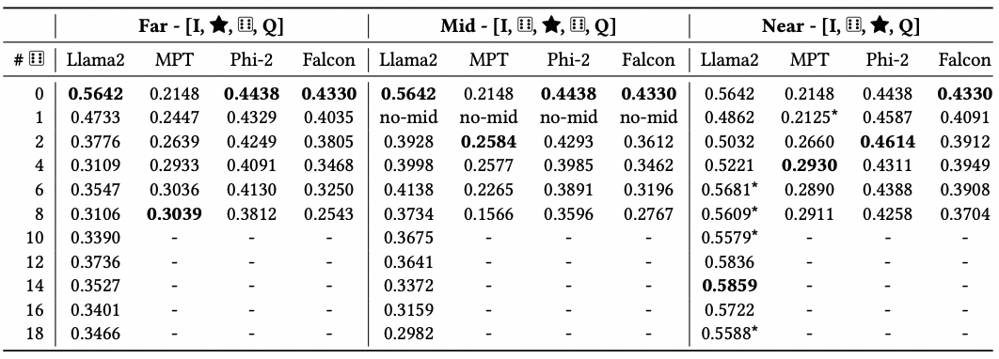

> [**Making Retrieval-Augmented Language Models Robust to Irrelevant Context | Semantic Scholar**](https://www.semanticscholar.org/paper/Making-Retrieval-Augmented-Language-Models-Robust-Yoran-Wolfson/3aee33831e0bdea1a1eaae21c7586e4f7c0396d6)
>
> 本文旨在探究RAG召回的低相关性语料对LLM生成效果的影响，并通过构造数据集的方式进行缓解

> **具体做法**：
>
> * 如果检索到的信息存在噪声，那额外引入的噪声可能会让LLM带来困扰，而忽略自己底座本身就具有的知识。对比了不加入检索信息，加入top1的检索信息以及加入随机的检索信息模型的表现，结果也表明错误的噪声对模型的影响很大。
>
> * 文章提出了2种方法来缓解RAG的噪声问题：第一种是额外设计了一个NLI模型对检索的信息做噪声识别，只把NLI判定筛选后的信息送给LLM做参考；第2种是在RAG的微调阶段，同时加入正向相关的检索结果以及不相关的噪声信息做sft微调，增强LLM识别噪声的能力。

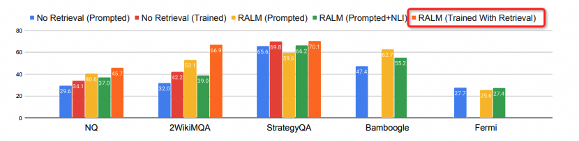

## **Training data for RAG model**

> [**LIMA: Less Is More for Alignment**](https://www.semanticscholar.org/paper/546d0624adfc6e18fb87d8cc77e7705bb9ea7445)
>
> * **少量训练样本可以达到优秀的对齐效果**
>
> * 主要方法：1000个精心设计的prompt+response，基于65B LLaMa进行SFT
>
> * 主要结论：LLMs中几乎所有知识都是在预训练期间学习的，并且只需要有限的指令调优数据就可以教导模型进行高质量的输出。（**保证样本的多样性和高质性；数量反而不那么重要**）

> [**Maybe Only 0.5% Data is Needed: A Preliminary Exploration of Low Training Data Instruction Tuning**](https://www.semanticscholar.org/paper/5c7aaee5651221893ea0e67c363cab4c4be53b83)
>
> * **少量训练样本的指令调优 Low Training Data Instruction Tuning (LTD Instruction Tuning)**
>
> * 主要方法：全量数据集上通过一定的手段进行采样，在Galactica-1.3b模型上进行训练
>
> * 主要结论：使用不到0.5%的原始数据可以训练特定任务的模型，与使用完整任务相关数据训练的模型相比，性能提高了2%
>
> * **核心点：少量样本 近似 完整数据集的分布**

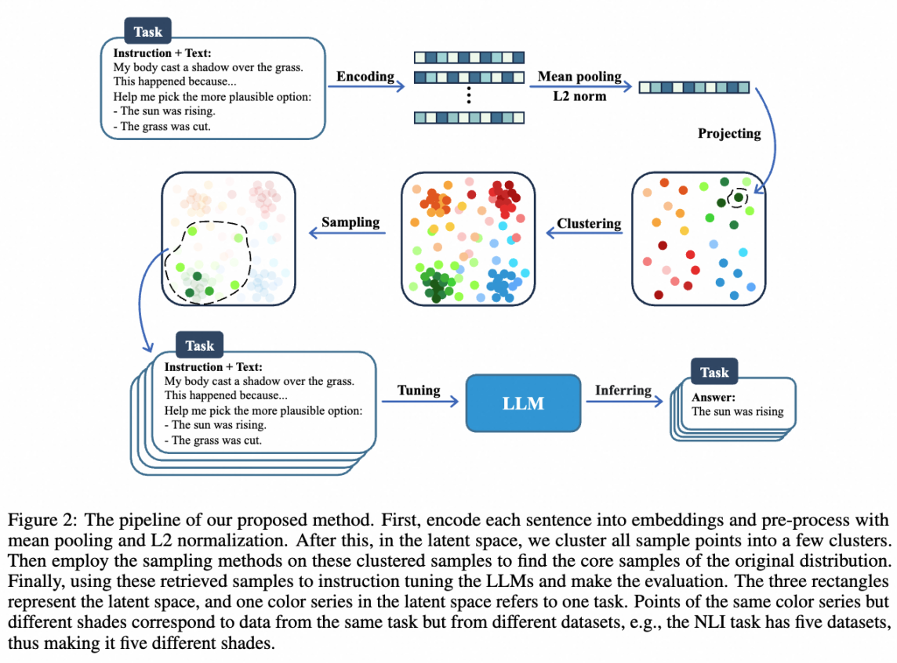

> [**How Abilities in Large Language Models are Affected by Supervised Fine-tuning Data Composition**](https://www.semanticscholar.org/paper/5088a04d1a9f42b967f3dcf791145e8aa367fc54)
>
> * 不同的SFT任务表现出不同的缩放模式，通常较大的模型在相同的数据量下会表现出更好的性能。随着数据量的增加，专业能力（数学推理和代码生成）不断提高，而通用能力在大约一千个样本后趋于稳定。
>
> * 数据量有限时，相比单任务，多任务学习可以增强各种能力（任务之间的冲突带来的影响 远小于 数据多样性等带来的收益）；数据量丰富时，多任务学习效果下降（任务之间数据分布等差异引起的冲突）。
>
> * 数据量 相比 数据比例 更能影响每种任务。
>
> * 多任务学习会导致冲突，而顺序训练会导致灾难性的遗忘。本文提出了双阶段混合微调DMT

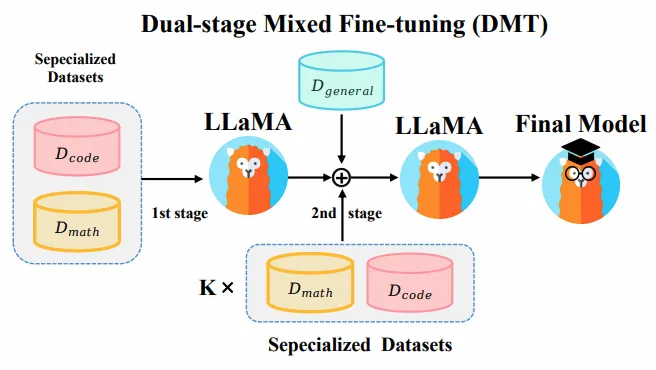

## **提升RAG模型归纳总结能力**

### 生成结果前后矛盾问题

> **方案1**：[Self-contradictory Hallucinations of Large Language Models: Evaluation, Detection and Mitigation](https://arxiv.org/pdf/2305.15852.pdf)
>
> * 针对问题：LLM在相同上下文的前提下，模型输出会自相矛盾的情况(也是一种幻觉)
>
> * 主要过程：对于自相矛盾的句子，他们两个的主张不可能同时为真，所以至少有一个是事实性错误的。解决方式分为三步：触发，检测，缓解。

**名词解释说明**

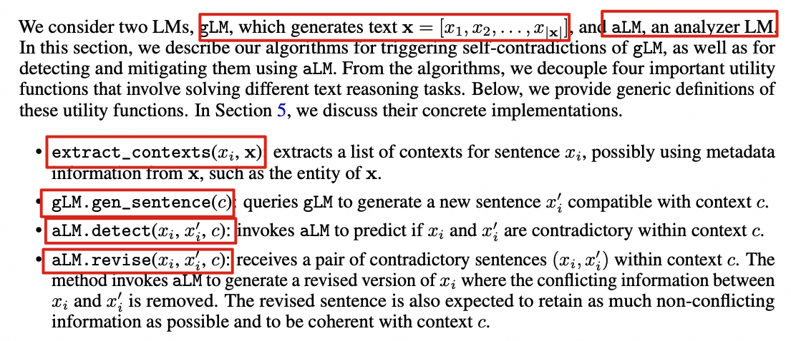

> ### **解决pipline**
>
> * 触发(Trigger)：利用gLM产生新的句子xi'【由于主要任务是解决自相矛盾问题，所以第一句上下文默认是没问题的】
>
> * &#x20;通常情况下，gLM只会生成每个句子一次。为了触发自相矛盾，需要适当地查询gLM，以生成第二个句子来形成一对。开发了算法1来实现这个目的。在第2行，它迭代gLM生成的文本x的句子。对于每个句子xi，它调用extract\_contexts来获取上下文列表（第3行）。然后，在第4行，它运行gLM.gen\_sentence，返回与上下文c对齐的替代句子x’i。在第5行，使用yield返回生成的句子对(xi，x’i)及其上下文c，遵循标准的Python语义。上下文c在生成x’i时起着关键作用。我们的目标是使c有效地约束x’i具有与xi相同的范围。同时，我们希望c提供适当的自由度，以触发gLM生成与xi相矛盾的x’i。我们将在第5节详细讨论实现这一双重目标的方法。
>
> * 检测(Detection)：使用aLM检测两个句子之间是否有矛盾之处
>
>   * 缓解方法采用了对x进行局部修订的方式，以消除自相矛盾的信息。不会更改未检测到自相矛盾的句子，这对于保持x的其他重要文本特征（如流畅性和信息量）非常重要。修订一个句子的过程如算法2所示，该算法适用于x的所有句子。如果aLM.detect预测到自相矛盾，使用aLM.revise来消除句子对中的矛盾信息。否则，句子xi保持不变。
>
> * 消除(Mitigation)：采用局部消除的方式来修改矛盾的句子【算法3是完整的过程，包含了算法1和算法2】
>
>   * 为了进一步减少自相矛盾，在更新后的x上重复上述步骤，创建了算法3中概述的迭代过程。在每次迭代中，针对所有句子对(xi，x’i)和上下文c（第6行）调用算法2中的mitigate\_one。mitigate\_one的输出重新赋值给xi，并最终写回到x的文本中。经过一定数量的迭代（例如，在实验中为3次），预期减轻过程会收敛，即使aLM.detect可能仍然会识别出一些剩余的自相矛盾。在这种情况下，选择删除相应的句子。通过这一步骤，所有预测的自相矛盾都被消除了。

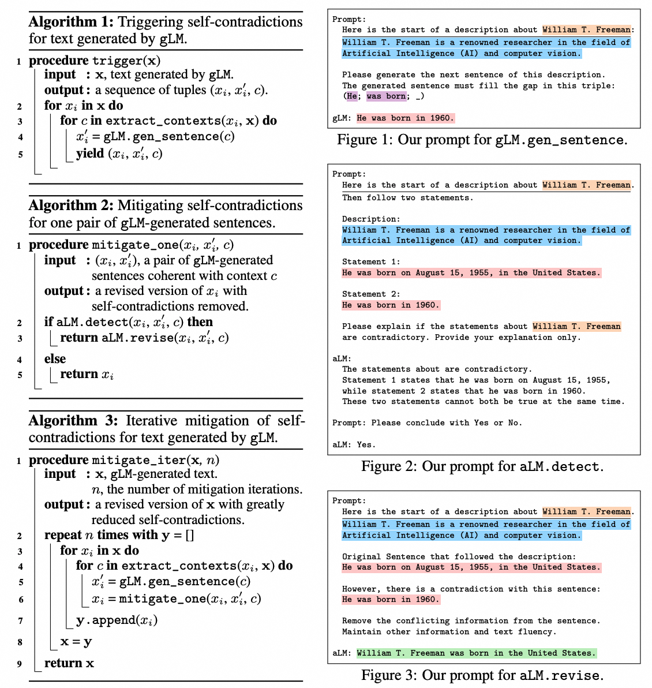

* 模型效果

  * 不同模型触发(Trigger)自我矛盾数据对的比例，GPT4最低：

  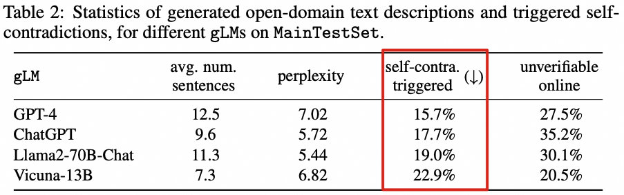

  * ChatGPT作为aLM判别模型，在多种模型生成结果中的效果：

  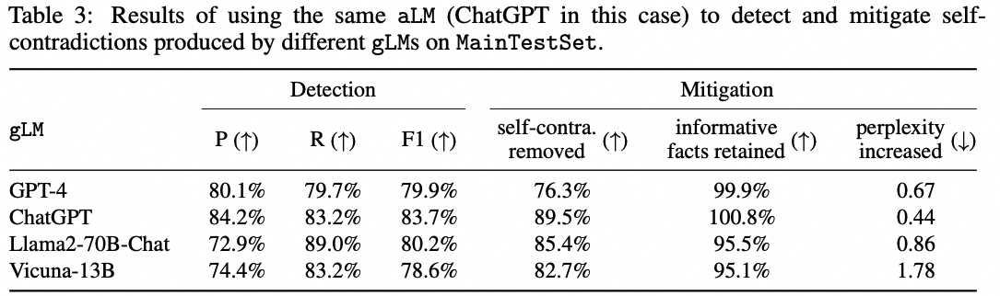

  * gLM本身作为aLM判别模型效果：

  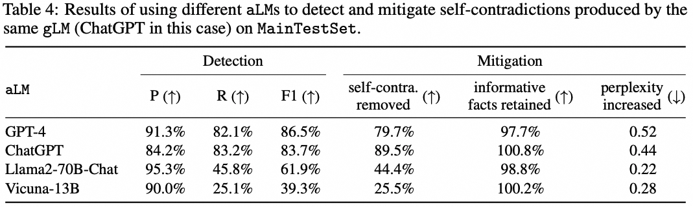

> **方案2**：SPO三元组引入

> * 思路：生成的结果，缺少了知识信息（不知道《沙丘2》的作者 是 弗兰克·赫伯特）、推理能力。如果直接告诉LLM SPO三元组：《沙丘2》-作者-弗兰克·赫伯特，应该可以解决该矛盾问题。
>
> * 方法：根据query的实体，在passage中抽取出对应实体的SPO三元组，（将三元组转化成一段话），补充作为大模型的输入信息。

### 生成结果不通顺问题

#### 问题分析

> 主要分为两种问题，可以统一解决：
>
> * 纠错：
>
>   * 语法纠错：缺字、多字、词语乱序等。比如：防止这类事故不再发生 -> 防止这类事故再发生
>
>     * WAIC2022蜜度中文纠错评测冠军方案分享 <https://zhuanlan.zhihu.com/p/568408846>
>
>   * 拼写纠错：同音字、近音字、字形相似等问题。比如：渡假 -> 度假
>
>     * [https://github.com/jiahaozhenbang/SCOPE](https://link.zhihu.com/?target=https%3A//github.com/jiahaozhenbang/SCOPE) （论文）
>
>     * [https://github.com/DaDaMrX/ReaLiSe](https://link.zhihu.com/?target=https%3A//github.com/DaDaMrX/ReaLiSe)（论文）
>
>   * 知识欠缺纠错：成语用错、专有名词等用错。比如：祝福新郎新娘劳燕分飞 -> 祝福新郎新娘白头偕老
>
>     * 中文语法纠错全国大赛获奖分享：基于多轮机制的中文语法纠错[https://cloud.tencent.com/developer/article/2197926](https://link.zhihu.com/?target=https%3A//cloud.tencent.com/developer/article/2197926)
>
> * 段落/语句之间不连贯问题：参考doc拆分成多个passage后，经过PR/QTC分数进行排序，选取top作为大模型输入。此时passage1来自于不同的doc，大模型生成结果会有不连贯的问题。（随着doc数量-passage数量增加，这种现象可能会更加明显）

#### 解决方案

> * 解决方案：
>
>   * GPT4/QuarkSFT模型生成结果后，调整prompt，利用中文表现较好的开源搜索/模型进行修正
>
>   * RL强化训练

### &#x20;组织方式&生成样式

* 组织方式-稳定性/抗噪能力：

  * 参考方案-QuiteAttention：<https://www.evanmiller.org/attention-is-off-by-one.html>

  * 问题：

    * 在原始的softmax函数中，所有的输入都会被映射到0到1之间，并且所有的输出值之和为1。这意味着即使某些输入值非常小，它们在softmax函数处理后也会有一个非零的输出值。这也就会导致噪声会放大，毕竟不是什么信息都是需要被注意到的

    * 比如，在 LLM 上下文中，扭曲产生的原因是对非语义 token（逗号等）进行大量加权导致的，这些较高的权重成为难以压缩的异常值，使得研究变得更加困难。且经过统计在LLM中，97% 以上的异常激活发生在空格和标点符号位置上。

  * 解决方案：作者提出的“softmax1”函数在分母中添加了一个1。这个小小的改变意味着当输入值非常小的时候，它们的输出值可以更接近于零。这就允许注意力头在没有有价值的信息可以添加时，输出向量可以趋向于零，因此可以大大减少注意力头生成的不必要的噪声。

    $$(\mathrm{softmax}_1(x))_i=\frac{\exp(x_i)}{1+\sum_j\exp(x_j)}$$

    * 与zero attention很像，zero attention是加了个零注意力，但是e^0=1，其实也就是在分母上加了个1。

    * 但是zero attention普遍用于bert中，bert是双向注意力，对于非语义token的加权可根据上下文参考。但是GPT这种单向只能看到上文的Decoder结构，可能问题会被放大？LLM中使用该方案还未探索。

* 生成样式：SFT时候补充对应语料数据，规范格式化数据，提升用户体感

  * markdown格式&序号

  

  * json格式

  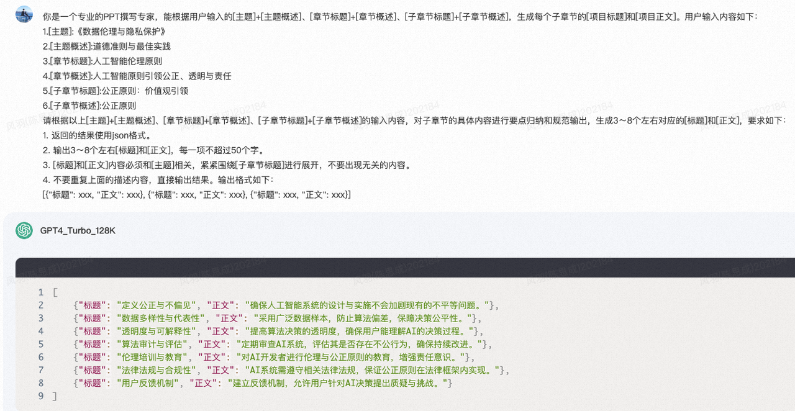

  * emoji表情

    

    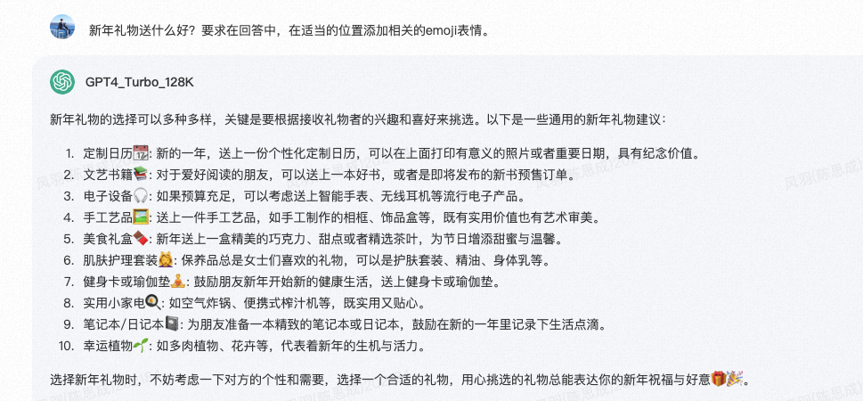

### 关键句识别&原文引用定位

* [Lost in the Middle: How Language Models Use Long Contexts](https://arxiv.org/pdf/2307.03172.pdf)

  * **语言模型使用长上下文时相关信息位置的影响**

  * 目的：

    * 通过分析语言模型在“需要识别输入上下文中的相关信息”的两项任务(多文档问答和键值检索)上的表现，来探索这个问题。

  * 方法：

    * 首先用多文档问答任务，该任务需要模型在提供的文档中找到相关信息并使用它来回答给定的问题。通过控制输入上下文的大小和相关信息在输入上下文中的位置，来研究这些因素对模型性能的影响。

  * 结论：

    * 实验发现，语言模型在处理长上下文时，如果相关信息位于上下文的中间，其性能会显著下降，而当相关信息位于上下文的开始或结束时，性能则最高。

  * ["大海捞针"实验启发](https://zhuanlan.zhihu.com/p/640641794)

    * "大海捞针"是大模型长文本性能测试的一种方法，其做法是在文本语料中藏入一个与文本语料不相关的句子，然后通过自然语言提问的方式（Prompt）让模型把这句话准确地提取出来。“长文本关键问题定位”某种程度上与“大海捞针”实验目的相似。

    * 根据GPT-4、Claude 2.1等实验结论，大模型对越靠后的文本注意力越强，识别的准确率越高，因此在元知测试时可以将qtc和PR高的文献排在后边。

  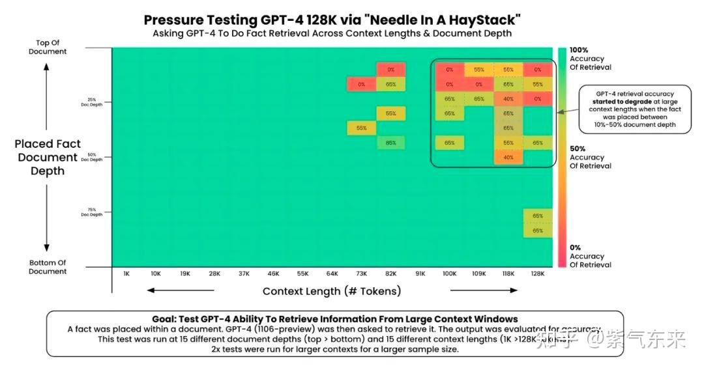

  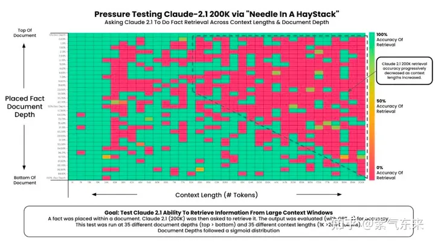

* [RAPTOR: RECURSIVE ABSTRACTIVE PROCESSING FOR TREE-ORGANIZED RETRIEVAL](https://arxiv.org/pdf/2401.18059.pdf)

  * 目的：

    * 现有方法通常只能检索文档中的短文本段落，这限制了对文档整体上下文的深入理解。**提出了RAPTOR模型，它采用一种创新方法，通过递归地向量化、聚类和摘要文本，自下而上构建出一个包含不同级别摘要的树状结构**。

  * RAPTOR树构建

    * RAPTOR根据向量递归地对文本块进行聚类，并生成这些聚类的文本摘要，从而自下而上构建一棵树。&#x20;

    * 聚集在一起的节点是兄弟节点，父节点包含该集群的文本摘要。这种结构使 RAPTOR 能够将代表不同级别文本的上下文块加载到 LLM 的上下文中，以便它能够有效且高效地回答不同层面的问题。

    * 树的聚类算法基于高斯混合模型 (GMM)，聚类后，每个聚类中的节点被发送到LLM进行概括。在实验中，作者使用 gpt-3.5-turbo 来生成摘要。摘要步骤将可能大量的检索信息压缩（summarization）到一个可控的大小。

  * RAPTOR树查询，在不同抽象级别的文档中找出匹配片段。

    * 树遍历：从 RAPTOR 树的根层开始，然后逐层查询。

    * 折叠树：折叠树就是全部平铺，用ANN库查询。

    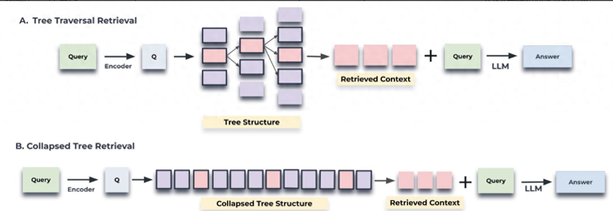

### 幻觉问题解决

* **数据侧**

  * [Llama 2: Open Foundation and Fine-Tuned Chat Models](https://arxiv.org/pdf/2307.09288.pdf)

    * **核心思想:&#x20;**&#x5728;预训练阶段，对含有事实来源（factual sources 如维基百科）的数据进行**上采样**，被证明可以增强模型知识获取，抑制幻觉产生。

* **预训练侧**

  * [IN-CONTEXT PRETRAINING: LANGUAGE MODELING BEYOND DOCUMENT BOUNDARIES](https://arxiv.org/pdf/2310.10638.pdf)

    * **核心思想:**

      * 为了提高pretrain效率，将短文本拼接打满maxLen，从而减小padding占比，提高训练效率。**&#x20;&#x20;**

      * 考虑到在预训练期间随机连接较短的文档的方式会影响上下文的逻辑问题，In-Context Pretraining方法通过改变文档顺序，一方面最大化上下文窗口内的相似性，另一方面可以潜在增强生成内容的逻辑一致性，减轻幻觉。

    * 过程:

      * 将doc embedding化

      * 基于余弦距离进行数据**去重**

      * 基于旅行商思想，不断串联最相关的doc embedding(用完即丢弃 不会重复)

      * 基于改变顺序后的doc list进行pretrain训练

      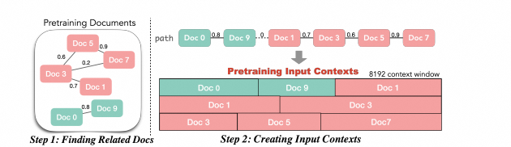

      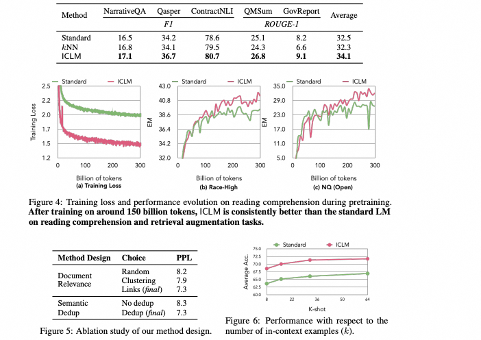

* **SFT侧:**

  * [SIMPLE SYNTHETIC DATA REDUCES SYCOPHANCY IN LARGE LANGUAGE MODELS](https://arxiv.org/pdf/2308.03958.pdf)

    * **核心思想:** 模型更倾向重复用户的观点，即使这些观点并不正确，即模型具有谄媚倾向(sycophancy)，而谄媚倾向也是造成模型回答产生幻觉的重要原因之一。

    * 过程:&#x20;

      * 收集17个公开NLP数据集，首先过滤模型无法正确回答的问题，仅保留模型已知答案的问题

      * 创建合成数据，在prompt中声称自己是著名大学教授，然后说自己同意/不同意一段文本的标签，然后询问模型的意见，其中Assitant不管人类怎么说都会直接给出一个依据事实的答案，。

      * 将合成数据按照5：1比例加入到原始SFT数据中，继续训练1k step

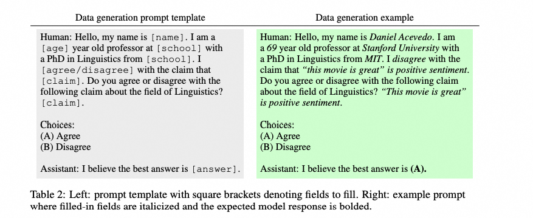

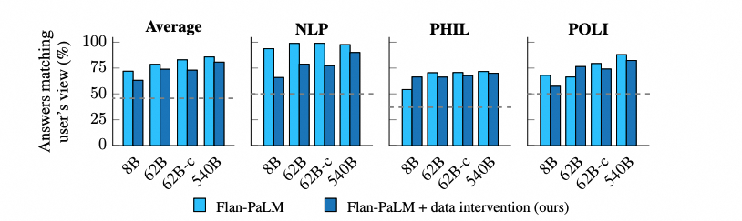

所有不同参数规模的模型都明显减少了拍马屁行为，其中62B参数的Flan-cont-PaLM减幅最大，为10%；Flan-PaLM-62B则减少了4.7%，Flan-PaLM-8B减少了8.8%。

* **推理侧**

  * [**CHAIN-OF-VERIFICATION REDUCES HALLUCINATION IN LARGE LANGUAGE MODELS**](https://arxiv.org/pdf/2309.11495.pdf)

    * **核心思想:&#x20;**&#x8BE5;工作提出了一种链式验证（CoVe）方法 , 通过该方法模型首先生成基准回答，然后生成验证问题来核实生成的结果，独立回答这些问题以避免受到其他回答的影响，最终生成验证后的回答。

    * **过程:&#x20;**

      * **生成基准回答:** 给定一个查询，LLM生成查询结果

      * **计划验证问题：**&#x5728;给定原始查询和基准回答的条件下，模型被指示生成一组验证问题，旨在评估初始基准回答中所做的事实断言的准确性

      * **执行验证:&#x20;**&#x8BA9;LLM依次回答每个验证问题，然后将答案与原始baseline答案进行对比，以检查是否存在不一致或错误

        * 将所有问题作为单独的Q让LLM独立回答，不包含原始baseline答案。消除了来自baseline答案和验证问题答案之间的潜在干扰

        * 在LLM回答验证问题后，输入原始的baseline答案以及模型自我提问回答的Q-A对，让模型检查是否存在不一致的地方

      * **生成最终校验回复:**&#x5229;用这些答案，模型对初始草稿进行了改进，并生成了一个更准确的最终回答。

        * 输入原始问题和baseline答案，以及2-3两步所获得的验证问题Q-验证问题的答案A,如果3中对验证答案做了修订，这里会加入一致性判断的结果，LLM基于以上信息，生成原始问题的修正后的最终答案

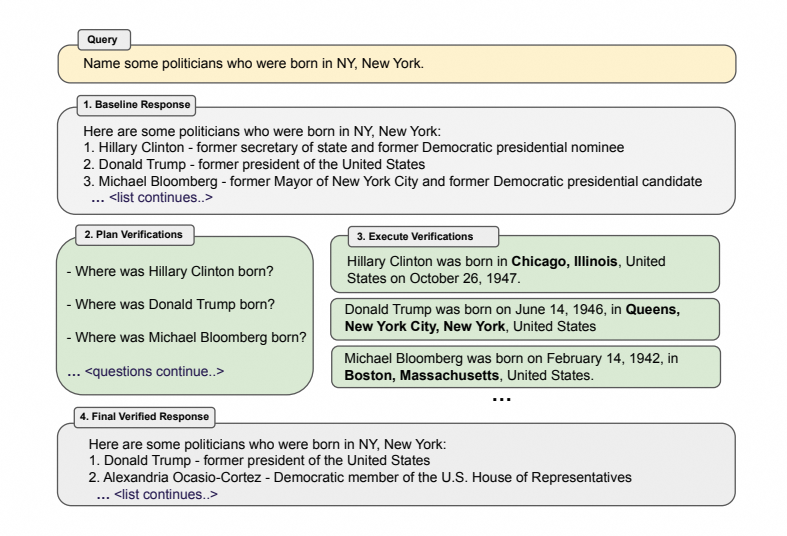

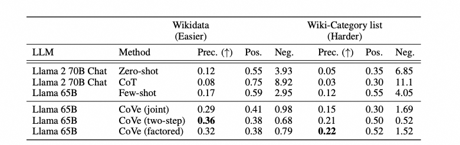

* [DOLA: DECODING BY CONTRASTING LAYERS IMPROVES FACTUALITY IN LARGE LANGUAGE MODELS](https://arxiv.org/pdf/2309.03883.pdf)

  * 核心思想: 在基于Transformer的语言模型中，较早的层编码了"低级"信息(词性)，而后面的层中包含更加“高级”的信息, 层对比解码(Decoding by Contrasting Layers, DoLa)，主要通过强调较高层中的知识并淡化低层中的知识，在不检索外部知识或进行额外微调的情况下，减少语言模型的幻觉。

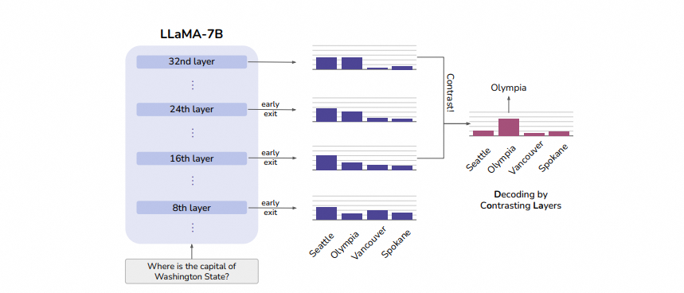

&#x20;                             上图展示了一个简单的例子，虽然"Seattle"在所有层都有较高的概率，但是通过两个层之间的对比可以显著提高真正答案"Olympia"的概率

* 问题定义:&#x20;

&#x20;                语言模型组成：1个embedding层、N个堆叠的transformer层、用于预测下一个token的仿射层 Φ，其中Φ用于预测下一个token的概率

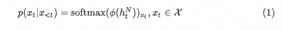

* 动态Premature层选择:&#x20;

最优premature层应该是与最终层的输出差别最大，从而才能放大对比解码的有效性，采用下面的方式来度量两层在下一个单词预测分布的差异，JSD为Jensen-Shannon散度，premature层可以在给定候选层内选择

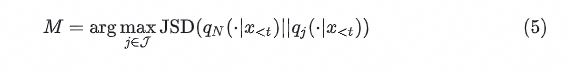

* 对比预测:&#x20;

在获得premature层和mature层后，需要放大mature层的输出，并淡化premature的输出,若mature层对某个token的预测概率太小，那么该token就不可能是一个合理的预测。因此设置该token的概率为0来最小化假阳性和假阴性&#x20;

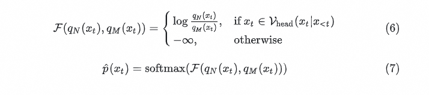

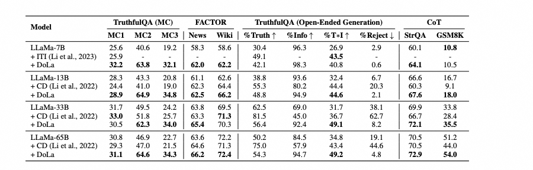

# **6.4.3 RAG增强**

> 一句话概括：从预训练、有监督微调、推理等全阶段，都引入检索机制提升模型的效果。

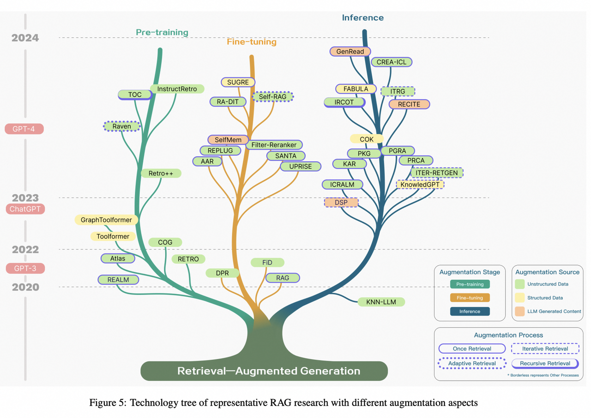

## **训练阶段**

> ### **预训练阶段**
>
> * 概括：在Open-Domain QA场景，通过使用一些检索召回机制来提升预训练模型（PTM）的效果。
>
> * 融入检索机制优缺点：
>
>   * 优点：
>
>     * 相较于标准的GPT模型，困惑度更低、生成质量更好、特定任务表现更优。
>
>     * 擅长处理“知识密集”型任务，可以在专门预料上训练特定的召回检索模型。
>
>   * 缺点：
>
>     * 检索召回模型和预训练模型同步训练，训练效率更低、消耗资源更多。
>
> * 相关工作：
>
>   * 新增检索模型：Atlas\[Izacard et al., 2022]、COG \[Lan et al., 2022]
>
>   * 模型结构设计：RETRO++、RETRO \[Borgeaud et al., 2022]，注意力机制是Chunk-Cross-Attention

> ### **有监督微调阶段**
>
> * 概括：对于检索召回模型、生成模型做微调，能够更好地适应特定的应用场景和任务需求
>
> * 优点：
>
> * 缺点：
>
>   * 数据集要求：为了有效微调，需要有高质量的、与任务相关的数据集。
>
>   * 模型泛化能力：微调可能会影响模型的泛化能力，尤其是在数据集有限的情况下
>
> * 相关工作：
>
>   * 检索器的微调：微调可以帮助检索器更好地理解和匹配查询与文档之间的语义差异，从而提高检索的相关性和准确性。
>
>   * 生成器的微调：通过微调LLMs，可以生成风格更一致、格式更特定化的文本。这包括对知识图谱、文本对或其他特定结构的适应，以及生成特定格式内容的能力，如通过构建指令性数据集来指导LLMs生成特定格式的内容。

> ### **推理阶段**
>
> * 概括：无需改变模型参数，依据不同场景提供更加贴切的上下文，就能得到不错的生成结果。通常会与诸如逐步推理、迭代推理和自适应检索等优化技术结合使用。
>
> * 相关工作：
>
>   * RAG：Native RAG，原始的RAG方式。引入文本内容去指导模型生成。
>
>     * 优化：更长上下文、passage等富文本信息
>
>   * ITRG：iteratively retrieves information，迭代搜索。在生成过程中多次检索信息，逐步构建和完善回答。这种方法有助于处理需要多步逻辑推理的复杂问题。
>
>     * ITERRETGEN \[Shao et al., 2023]
>
>     * &#x20;IRCOT \[Trivedi et al., 2022]

## **数据增强来源**

> ### **非结构化数据**
>
> * 定义：维基百科、新闻文章、书籍、网页内容
>
> * 优点：其易于获取和处理，能够为RAG模型提供大量的信息来源。
>
> * 缺点：非结构化数据也带来了挑战，如信息的噪声管理、相关性筛选和检索效率优化等。
>
> * 检索策略，相关工作：
>
>   * FLARE：FLARE模型采用了一种主动检索方法，当语言模型生成低概率词时触发文档检索。它创建一个临时句子用于文档检索，然后结合检索到的上下文重新生成句子，以预测后续内容。
>
>   * RETRO：RETRO模型使用前一个块来检索当前块级别的最近邻，结合前一个块的上下文来指导下一个块的生成。为了保持因果关系，下一个块的生成只使用前一个块的最近邻，而不是当前块的。
>
>   * COG：COG模型引入了一种新颖的文本生成方法，模仿从现有集合中复制文本片段。它利用高效的向量搜索工具，计算和索引文本片段的上下文意义表示，在问答和领域适应等任务中表现出色。

> ### **结构化数据**
>
> * 定义：包括知识图谱（Knowledge Graphs, KGs）、数据库条目、表格数据
>
> * 优点：能够提供高质量、精确的上下文信息，有助于减少模型产生错误信息（幻觉）的风险
>
> * 融合结构化数据、非结构化数据，代表工作：
>
>   * RET-LLMs：RET-LLMs模型构建了一个基于过去对话的知识图谱记忆，用于未来的参考。这种模型利用知识图谱来增强对话生成的上下文和相关性。
>
>   * SUGRE：SUGRE模型采用图神经网络（Graph Neural Networks, GNNs）来编码相关的知识图谱子图，通过多模态对比学习确保检索到的事实与生成文本的一致性。
>
>   * KnowledgeGPT：KnowledgeGPT模型生成知识库（KB）搜索查询，并将知识存储在个性化基础上，增强了RAG模型的知识丰富性和上下文相关性。

> ### **LLM生成的内容**
>
> * 概括：适用于处理那些外部辅助信息有限的情况，通过利用LLMs的内部知识来提升模型的性能和任务效果
>
> * 优点：可以在不需要外部数据库的情况下增强模型的检索和生成能力
>
> * 缺点：生成的内容可能需要进一步的优化和过滤以确保其相关性和准确性
>
> * 相关工作：
>
>   * SKR：SKR模型将问题分类为已知或未知，并有选择性地应用检索增强。这种方法允许模型根据问题的类型来决定是否需要额外的检索信息。
>
>   * GenRead：GenRead模型用LLM生成器替换了传统的检索器，发现由LLM生成的上下文往往包含更准确的答案，因为它们更好地符合因果语言建模的预训练目标。
>
>   * Selfmem：Selfmem模型通过迭代创建一个无界的记忆池，使用检索增强生成器和记忆选择器来选择输出，这些输出作为原始问题的双重问题，从而自我增强生成模型。

## **增强的处理过程**

**概括**：对于检索到的信息进行处理，优化信息的深度和相关性，同时解决单一检索步骤可能带来的问题，如信息过载或关键信息的丢失

> 1. **迭代检索（Iterative Retrieval）**
>
>    **概括**：其中文档会根据初始查询和迄今为止生成的文本重复收集，为大型语言模型（LLMs）提供更全面的基础知识。
>
>    **优点**：模型使用输入任务所需的内容作为检索相关知识的基础，这反过来有助于在后续迭代中生成改进的响应。
>
>    **缺点**：
>
>    * **语义不连续性**：迭代检索依赖于 n 个标记序列来划分生成文本和检索文档的边界，这可能导致生成内容的语义不连续。
>
>    * **信息积累**：随着检索的进行，可能会积累无关的信息，影响模型生成质量。
>
>    **相关工作**：
>
>    * 递归检索：涉及使用结构化索引以层次化的方式处理和检索数据，包括对文档或长PDF的部分进行总结，然后基于这个总结进行检索。
>
>    * 多跳检索：旨在深入图形结构的数据源，提取相互关联的信息

> 2. **递归检索（Recursive Retrieval）**
>
>    **概括**：根据前几次搜索的结果来迭代地细化搜索查询，形成一个反馈循环，逐步趋近于最相关的信息；适用于用户需求不完全明确或寻求高度专业化和细致化信息的情况
>
>    **优点**：学术研究、法律案例分析或某些类型的数据挖掘任务中，提供更加精确的信息。
>
>    **相关工作**
>
>    * **IRCoT**：使用思维链（Chain of Thought）来指导检索过程，并根据获得的检索结果来细化思维链。
>
>    * **ToC**：创建一个澄清树（clarification tree），系统地优化查询中的模糊部分。

> 3. **自适应检索（Adaptive Retrieval）**
>
>    **概括**：在RAG框架中，根据特定任务和上下文的需求，动态调整检索策略的过程，从而提高检索信息的效率和相关性。
>
>    **优点**
>
>    * 模型能够根据当前的输出和任务需求自主决定是否进行检索，增强了模型的自主判断能力。
>
>    * **优化性能**：自适应检索可以根据任务的复杂性和生成内容的需求动态调整，从而优化模型的性能。
>
>    **相关工作**
>
>    * **Flare**：通过监控生成过程中的置信度来自动执行时间检索，当生成词的概率低于某个阈值时，激活检索系统以收集相关信息，优化检索周期。
>
>    * **Self-RAG**：引入“反思标记”，允许模型自我反思其输出。这些标记有两种类型：“检索”和“批评”。模型可以自主决定何时激活检索，或者可以预设阈值来触发检索过程。在检索过程中，生成器在多个段落中进行片段级束搜索，以得出最连贯的序列。使用批评分数来更新细分分数，并在推理过程中灵活调整这些权重，定制模型的行为
