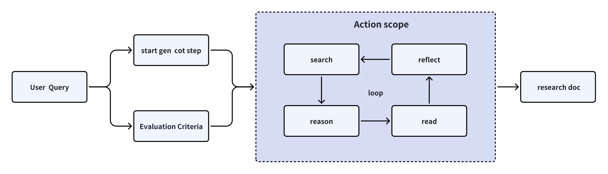
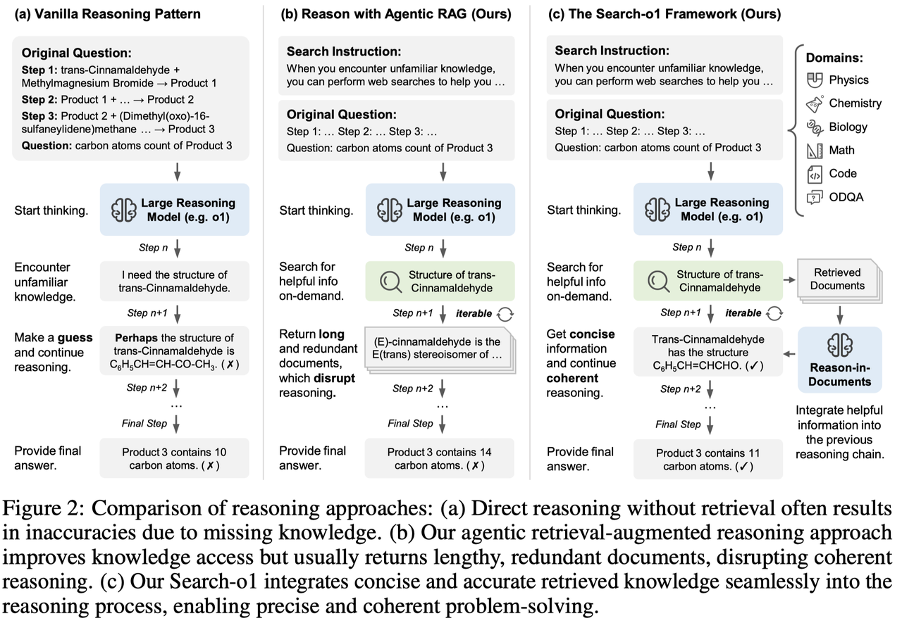
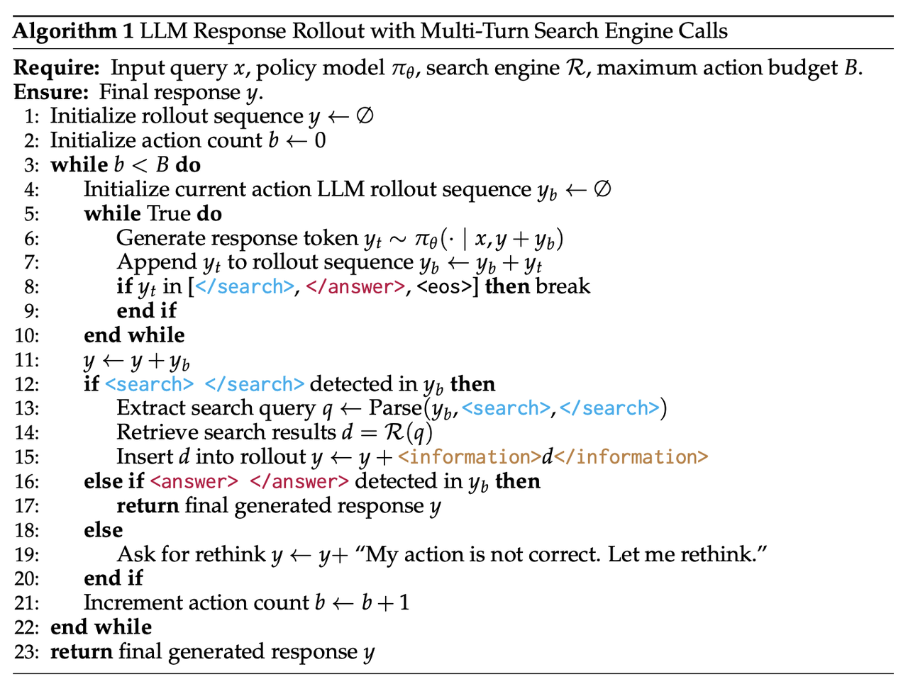
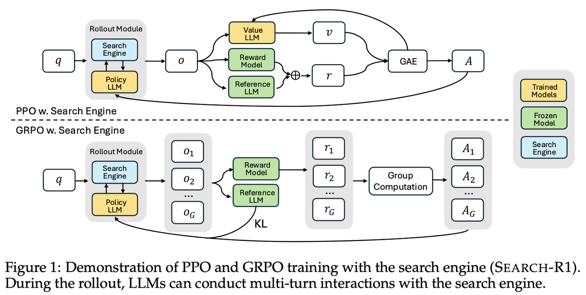
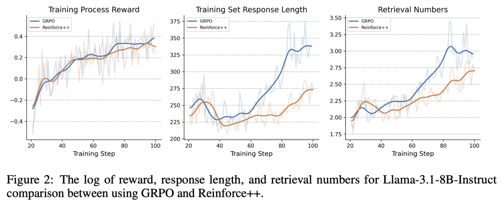
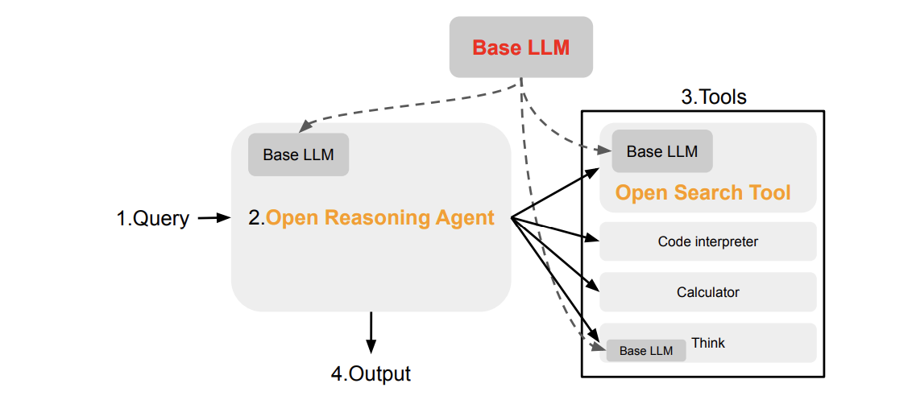
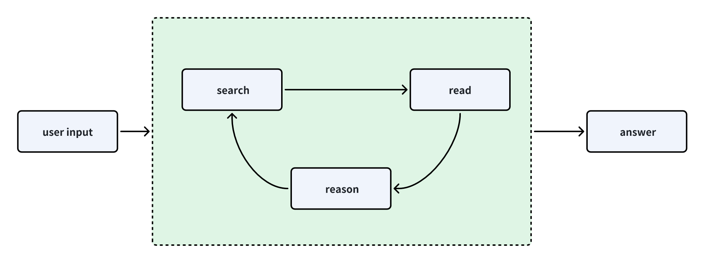
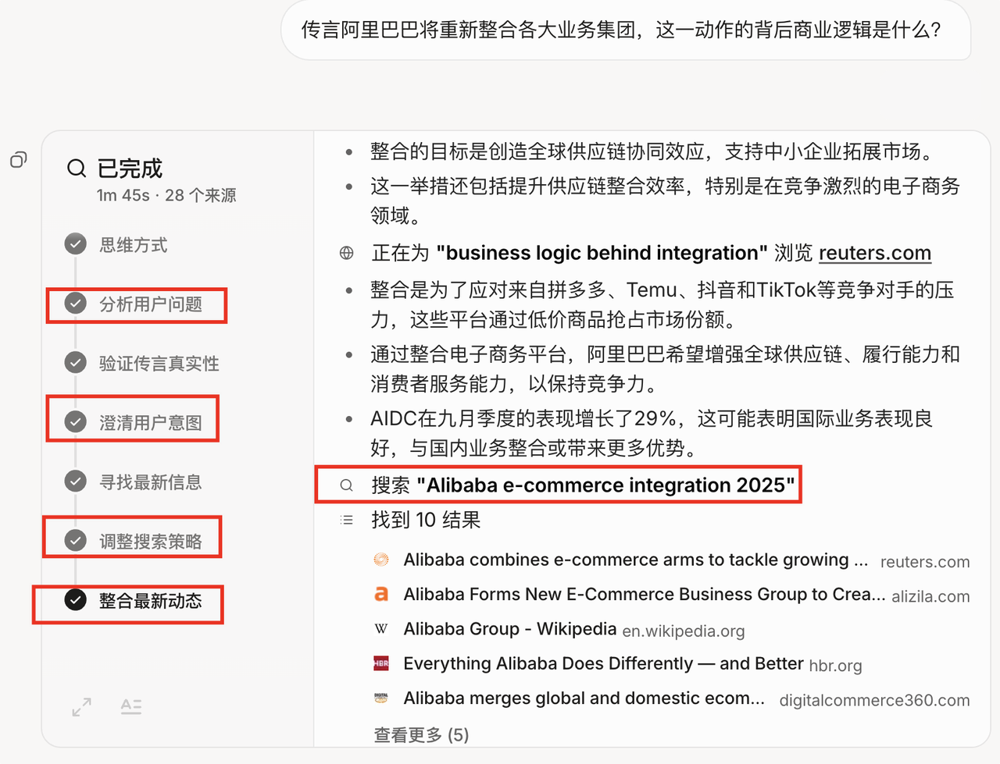

# **Deep Research工作梳理及推荐**

## **Deep Research的定义**

> 所谓的**Deep Research**，就是在**Deep Search**的基础能力上，再结合“调研”能力，能够**在短时间内形成一份完整的长篇调研报告**。
>
> 与**Deep Search**不同，**DeepResearch** 专注于撰写高质量且富有可读性的长篇研究报告。这不仅仅是简单的信息搜集，更是一项系统性的工程，**要求整合有效的可视化元素（如图表、表格）、设计合理的章节结构**，确保各子章节逻辑连贯，术语统一，杜绝信息重复，并通过流畅的过渡句自然衔接全文内容。



## **Deep Search**

> **DeepSearch 的试图通过搜索、阅读和推理三个环节中不断循环，直到找到最优答案。**&#x20;
>
> **搜索阶段利用Google、Bing等外部搜索API接口做信息聚合，阅读阶段则利用召回的网页信息进行分析并对原内容进行调整，推理阶段则基于已有信息（已推理出的CoT、query、search doc等）进行评估，并决定是应该将原始问题拆解为更小的子问题，还是尝试其他的搜索策略。**

> 我们可以理解**Deep Search**是**RAG**的进阶版本，它更加适用于实际上复杂的业务场景。与RAG只执行一&#x6B21;**`搜索-生成`**&#x8FC7;程，**DeepSearch** 执行多次迭代，需要明确的停止条件。在2025年之前，大家习惯通过所谓的**Agentic RAG**实现这一目的。下面就给大家介绍一些比较有价值的**Deep Search**工作。

### **《Search-o1: Agentic Search-Enhanced Large Reasoning Models》**

> **发布时间：2024**
>
> **开源代码：有**
>
> 该算法的核心点有两个：**`Agentic RAG`**&#x548C;**`Reason-in-document`。**
>
> 1. **`Agentic RAG`**&#x53EF;以解决知识点不足及`query`需求点较多的问题，通过概率触发`<|begin_search_query|>搜索词<|end_search_query|>`实现。
>
> 2. **`Reason-in-document`**&#x7684;核心点是通过精炼召回的文档信息解决ICL问题。



### **《Search-R1: Training LLMs to Reason and Leverage Search Engines with Reinforcement Learning》**

> **发布时间：2025**
>
> **开源代码：有**
>
> **Search-o1**通过：问题拆解->agentic retrieve->信息整合进行深度检索，其中agentic retrieve->信息整合阶段可多次迭代优化。
>
> 与**Search-o1**不同的是**Search-R1**针对模型进行了RL训练。
>
> 对于RL训练，其支持PPO和GRPO两种RL算法，reward设计如下所示：
>
> $$r_{\phi}(x,y)=\mathrm{EM}(a_{\mathrm{pred}},a_{\mathrm{gold}})$$






### **《R1-Searcher: Incentivizing the Search Capability in LLMs via Reinforcement Learning》**

> **发布时间：2025**
>
> **开源代码：有**
>
> **R1-Searcher** 的核心思想是**通过强化学习中的奖励设计**实现让模型在出现不确定信息时，能够自发地检索外部资料并将检索到的文档纳入最终的推理中。
>
> R1-Searcher 整体的RL流程分为两阶段
>
> **在一阶段**，希望模型先学会如何发起检索请求并遵守输出格式要求。reward设计如下：
>
> $$R_{\mathrm{retrieval}}=\left\{\begin{array}{ll}0.5,&\mathrm{if~}n\geq1,\\0,&\mathrm{if~}n=0.\end{array}\right.$$$$R_{\mathrm{format}}=\left\{\begin{array}{ll}0.5,&\text{if format is correct,}\\0,&\text{otherwise.}\end{array}\right.$$$$R_{\mathrm{stage-}1}=R_{\mathrm{retrieval}}+R_{\mathrm{format}}.$$
>
> **在二阶段**，需要让模型有效利用检索结果来回答问题。reward设计如下：
>
> 答案奖励：$$\mathrm{Precision}=\frac{I_{N}}{P_{N}},\quad\mathrm{Recall}=\frac{I_{N}}{R_{N}},\quad F1=\frac{2\times\mathrm{Precision}\times\mathrm{Recall}}{\mathrm{Precision}+\mathrm{Recall}}.$$
>
> 格式奖励： $$R′_{\mathrm{format}}=\left\{\begin{array}{ll}0,&\text{if format is correct,}\\-2,&\text{otherwise.}\end{array}\right.$$
>
> $$R_{\mathrm{stage-}2}=R_{\mathrm{answer}}+R′_{\mathrm{format}}.$$



### **《Open Deep Search: Democratizing Search with Open-source Reasoning Agents》**

> **发布时间：2024**
>
> **开源代码：无**
>
> 该工作实现了两个个核心组件：**Search Tool和Reasoning Agent**。
>
> **Search Tool**就是简单的查询重述+检索+排序模块实现。
>
> **Reasoning Agent**又分为基于`ReAct`代理和基于`CodeAct`代理两个版本。简单来说就是`CoT+SC（Self-Consistency Sampling）+ReAct`。



## **Deep Research**

> 我们先来看看各家大厂是如何做**Deep Reserch**的，然后再给大家分享几个有价值的开源工作。

### **JINA**

> **JINA**家分享了一个很有价值的**Deep Research**工作，地址&#x4E3A;**`jina-ai/node-DeepResearch`**
>
> 但是，该工作不是我们所熟知的“research”，其目的是**通过深度搜索获得快速、简洁的答案，而不是获得一篇有深度的报告**。



* **核心的整体迭代伪代码如下**

```python
# 主推理循环
while token_usage < token_budget and bad_attempts <= max_bad_attempts:
    # 追踪进度
    step += 1
    total_step += 1

    # 从 gaps 队列中获取当前问题，如果没有则使用原始问题
    if gaps:
        current_question = gaps.pop(0)
    else:
        current_question = question

    # 根据当前上下文和允许的操作生成提示词
    system = get_prompt(
        diary_context, all_questions, all_keywords,
        allow_reflect, allow_answer, allow_read, allow_search, allow_coding,
        bad_context, all_knowledge, unvisited_urls
    )

    # 让 LLM 决定下一步行动
    result = await llm.generate_structured_response(system, messages, schema)
    this_step = result['object']

    # 执行所选的行动（回答、反思、搜索、访问、编码）
    if this_step['action'] == 'answer':
        # 处理回答行动...
        pass
    elif this_step['action'] == 'reflect':
        # 处理反思行动...
        pass
    # ... 其他行动依此类推

```

### **Grok**

**grok，本质也是不断推理、搜索、阅读。在这个循环过程中，系统可以对 gaps 列表中的多个问题同时进行搜索。**



### **Gemini**

> 在面对复杂的用户问题时，会首先制定一个详细的研究计划，将问题分解为一系列更小、更容易处理的子任务。接下来，系统会监督执行这些子任务，并灵活决定哪些任务可以并行处理，哪些需要按顺序完成。待收集到足够的信息后，Gemini会综合所有结果并生成一份详尽的报告。在生成报告的过程中，系统会批判性地评估收集到的信息，识别关键主题和不一致之处，并通过多轮自我审查提高报告的清晰度和细节。Gemini的上下文除去利用gemini 1million的上下文的能力外，还结合了RAG技术，可能是先将相关的文章存储起来，然后在需要时通过向量检索进行召回。

### **开源项目推荐**

1. **jina-ai/node-DeepResearch**

2. **dzhng/deep-research**

3. **open\_deep\_research（hugging face）**

4. **zilliztech/deep-searcher**

5. **LearningCircuit/local-deep-research**

6. **assafelovic/gpt-researcher**

7. **HKUDS/AI-Researcher**
