# **7.1.1 量化简介**

> 模型量化是指以较低的推理精度损失将连续取值如**float32，float16的浮点型权重近似为有限多个离散值权重如int8、int4**的过程。通过以更少的位数表示浮点数据，模型量化可以减少模型尺寸，进而减少在推理时的内存消耗，并且在一些低精度运算较快的处理器上可以增加推理速度

> ### **常用的数据类型**
>
> * **FP32：**&#x33;2位浮点数，是最常用的高精度表示方式
>
> * **FP16：**&#x31;6位浮点数，数值范围比FP32小，但占用内存较少
>
> * **BF16：**&#x31;6位截断的FP32，增加指数位，数值范围更广，常用于深度学习
>
> * **INT8：**&#x38;位整数，位数仅为FP32的1/4，适用于模型参数的数据范围映射
>
> * **INT4：**&#x34;位整数，进一步减少位数，适用于极端资源受限的场景
>
> * **二值网络（Binary Network）：**&#x31;位二值网络，参数只能取0或1，计算效率极高但精度损失较大
>
> 工业界目前最常用的量化位数是8比特，低于8比特的量化被称为低比特量化。1比特是模型压缩的极限，可以将模型压缩为1/32，在推理时也可以使用高效的XNOR和BitCount位运算来提升推理速度

## **量化对象**

> * **权重（Weight）：权重**的量化是最常规，可达到减少模型大小内存和占用空间
>
> * **激活值（Activation）：**&#x5B9E;际中**激活值**往往是占内存使用的大头，量化激活值不仅可以大大减少内存占用，更重要的是，结合权重的量化可以充分利用整数计算获得性能提升
>
>   > 激活值是神经元在接收到输入信号并经过激活函数处理后所产生的输出值
>
> * **KV Cache：**&#x91CF;化 KV 缓存对于提高长序列生成的吞吐量至关重要
>
> * **梯度（Gradients）：**&#x76F8;对上面的量化对象略微小众一些，因为主要用于训练。在训练深度学习模型时，梯度通常是浮点数，它主要作用是在分布式计算中减少通信开销，也可以减少backward时的开销

## **量化形式**

根据量化数据表示的原始数据范围是否均匀，可以将量化方法分为**线性量化和非线性量化**。深度神经网络的权重和激活值通常是不均匀的，因此理论上使用非线性量化导致的精度损失更小，但在实际推理中非线性量化的计算复杂度较高，**通常使用线性量化：**

$q=clip(round(\frac{r}{s}+z),q_{min},q_{max})$

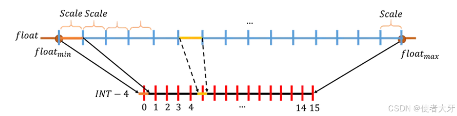

其中$r$为量化前的浮点数，$q$为量化后的整数，round表示取整，clip为截断，$s$为数据量化的间隔 $z$为数据偏移，为0的时候为对称量化，不为0的时候为不对称量化。**对称量化可以避免量化算子在推理中计算z相关的部分，降低推理时的计算复杂度**；**非对称量化可以根据实际数据的分布确定最小值和最小值，可以更加充分的利用量化数据信息，使得量化导致的损失更低**

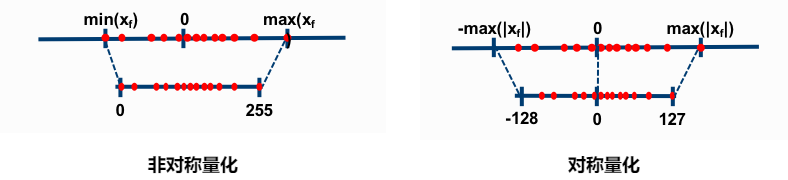

根据 $s$和 $z$的共享范围即量化粒度，量化方法可以进行以下分类：

* **逐层量化 per-tensor：**&#x8303;围最大，最简单，**以一层网络为单位一组量化参数**

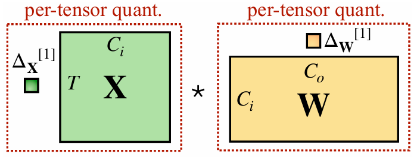

* **逐通道量化 per-token & per-channel：**&#x4EE5;一层网络的每个量化通道为单位，每个通道单独用一组量化参数。量化粒度更细，更高的量化精度，计算也更复杂。 其中，per-token 针对激活 x 而言，每行对应一个量化系数；per-channel 针对权重 w 而言，每列对应一个量化系数。结合使用也叫**vector-wise**

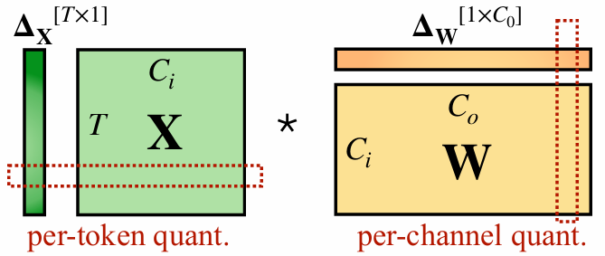

* **逐组量化 per-group：**&#x4EE5;组为单位，每个组比如K 行激活值或 K 列权重使用一组s和z；它的粒度处于 per-tensor 和 vector-wise之间。当 groupsize=1 时，逐组量化与逐层量化等价；当 groupsize= 卷积核的数量时，逐组量化与逐通道量化等价

* 此外激活值和权重可以选择不同的粒度进行量化，对于激活值来说还有**动态量化**（推理过程中，实时计算激活的量化系数，对激活进行量化）与**静态量化**（在推理前就计算好激活的量化系数，在推理过程中应用）

* Llama3 技术报告中提供的 tensor-wise 和 row-wise FP8量化示意图

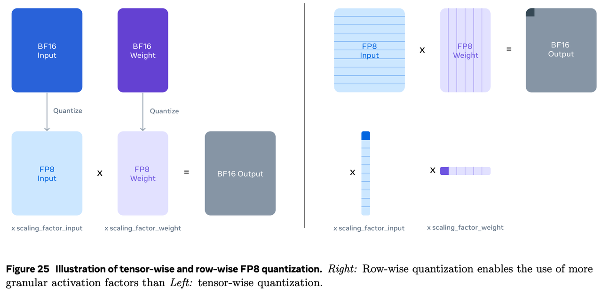

## **量化分类**

根据量化压缩模型的阶段还可以分为：

* **量化感知训练 Quantization Aware Training QAT**

* **量化感知微调 Quantization-Aware Fine-tuning QAF**

* **训练后量化 Post Training Quantization PTQ**

# **7.1.2 QAT 量化感知训练**

> 首先正常预训练模型，然后在模型中插入“**伪量化节点**”，就是对权重和激活先量化，再反量化。这样**引入了量化误差，让模型在训练过程中“感知”到量化操作，在优化training loss 的同时兼顾quantization error**。适用于对模型精度要求较高的场景，其量化目标无缝地集成到模型的训练过程中，使LLM在训练过程中适应低精度表示，增强其处理由量化引起的精度损失的能力

**QAT方法：**

* **LLM-QAT：**&#x5229;用预训练模型生成的结果来实现无数据蒸馏

  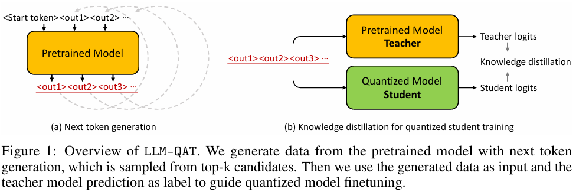

  LLM-QAT不仅**量化了权重和激活**，还**量化了KV缓存**。这个策略旨在增强吞吐量并支持更长的序列。LLM-QAT能够将带有权重和KV缓存量化的LLaMA模型蒸馏为仅有4比特的模型

  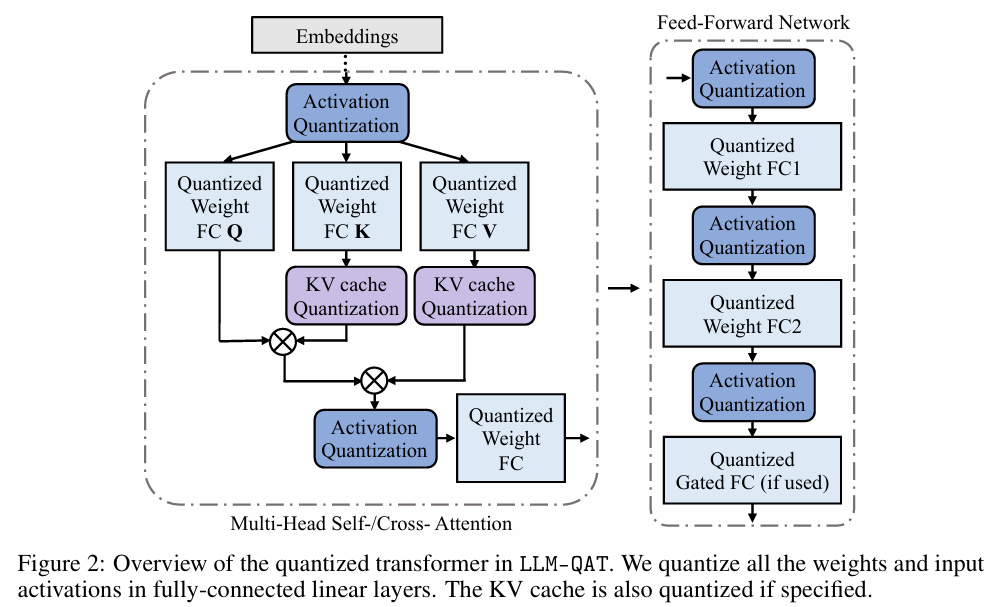

# **7.1.3 QAF 量化感知微调**

在微调过程中对LLM进行量化，主要目标是确保经过微调的LLM在量化为较低位宽后仍保持性能。通过将量化感知整合到微调中，以在模型压缩和保持性能之间取得平衡

**QAF方法：**

* **PEQA：**&#x4D;emory-Efficient Fine-Tuning of Compressed Large  Language Models via sub-4-bit Integer Quantization。一种新的量化感知微调技术，可以促进模型压缩并加速推理。采用了双阶段过程运行。在**第一阶段，每个全连接层的参数矩阵被量化为低比特整数矩阵和标量向量**。在**第二阶段，对每个特定下游任务的标量向量进行微调**。这种策略大大压缩了模型的大小，从而降低了部署时的推理延迟并减少了所需的总体内存。 同时使快速的微调和高效的任务切换成为可能

  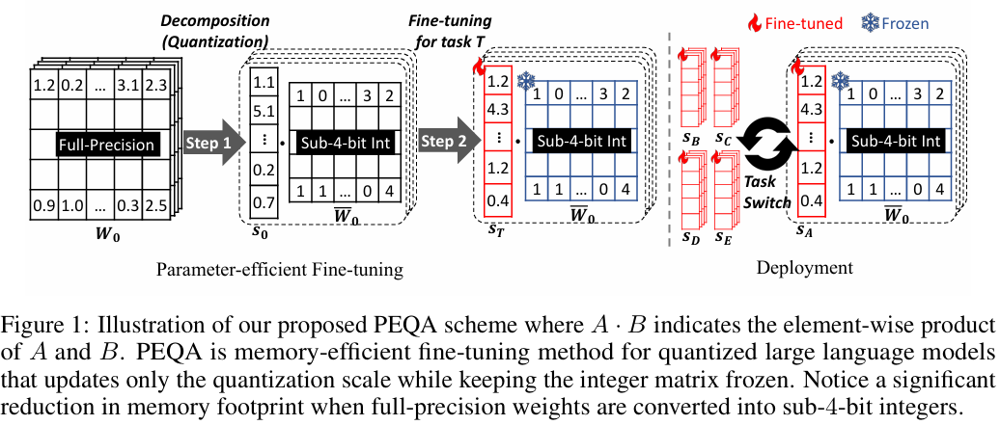

* **QLoRA：**&#x4E5F;是一种QAF方法 **参考3.5.6章节[ 3.5 PEFT 参数高效微调](https://kcnd4kn8i6ap.feishu.cn/wiki/OYA5wHPWoit8mpkCAqIcdN0hnQK#share-VjV4d9oY9ogZJpxIPfncR3t7nsd)**

# **7.1.4 PTQ 训练后量化**

> **QAT 插入“伪量化节点”后微调大大增加了计算成本，尤其是面对超大规模的 LLM**。目前针对 LLM 的量化研究都集中在 训练后量化，比如 `LLM.int8()`, `SmoothQuant`, `GPT-Q` 。对于权重而言，可以在推理前事先计算好量化系数，完成量化。但是对于激活（即各层的输入），它们事先是未知的，取决于具体的推理输入
>
> 在LLM训练完成后对其参数进行量化，只需要少量校准数据，适用于追求高易用性和缺乏训练资源的场景。主要目标是减少LLM的存储和计算复杂性，而无需对LLM架构进行修改或进行重新训练。**PTQ的主要优势在于其简单性和高效性，但PTQ可能会在量化过程中引入一定程度的精度损失**

**PTQ方法：**

* **LLM.int8()：**&#x6FC0;活值X中存在一些离群值，它们的绝对值明显更大；并且这些离群值分布在少量的几个特征 中，称为离群特征。观察下图中黄色的离群值，不论是 per-token 还是 per-channel quantization，都会受到这些离群值的很大影响。LLM.in8() 的思路是，既然只有少量的特征包含离群值，那就把这些特征拿出来单独计算，只对剩余特征做量化，即**采用混合精度分解的量化方法，先做了一个矩阵分解，对绝大部分权重和激活用8比特量化（vector-wise），对离群特征的几个维度保留16bit，对其做高精度的矩阵乘法**

  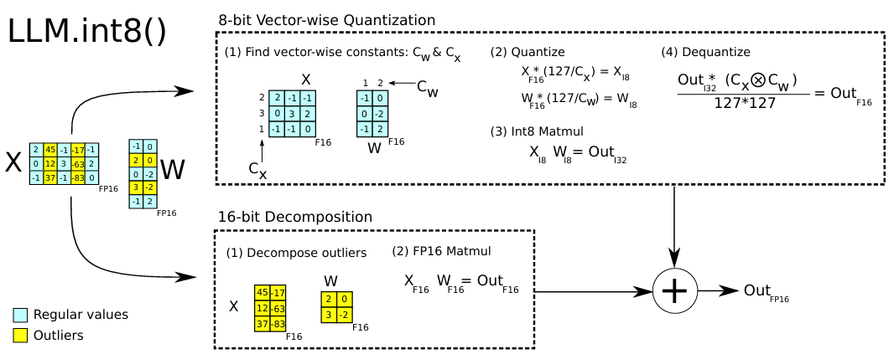

* **SmoothQuant：**&#x9488;对激活中的离群值，SmoothQuant 给出了与 LLM.int8() 不同的解题思路，激活值的量化比权重的量化难得多，可以通过一个平滑系数，把二者的难度中和一下：

  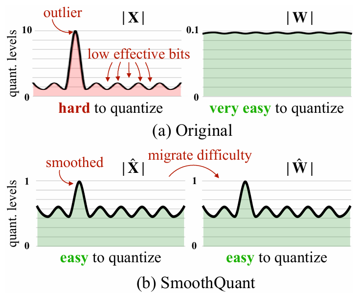

  $  Y = (X \text{diag}(s)^{-1}) \cdot (\text{diag}(s) W) = \hat{X} \hat{W} \quad \\
   s_j = \max(|X_j|)^\alpha / \max(|W_j|)^{1 - \alpha} \quad  $

  对平滑后的激活值和权重进行量化即可，权重采用per-tensor，激活采用不同粒度、不同时机的量化有不同版本：

  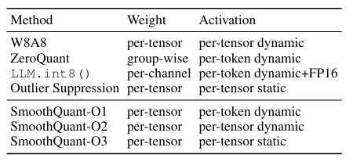

* **GPT-Q：**&#x4C;LM.int8() 和 SmoothQuant 都属于 round-to-nearest (RTN) 量化：舍入到最近的定点数，GPT-Q 则是把量化问题视作优化问题，逐层寻找最优的量化权重。**对某个块（block）内的所有参数逐个量化，每个参数量化后，需要适当调整这个块内其他未量化的参数，以弥补量化造成的精度损失**。 此外，GPTQ 量化需要准备校准数据集

  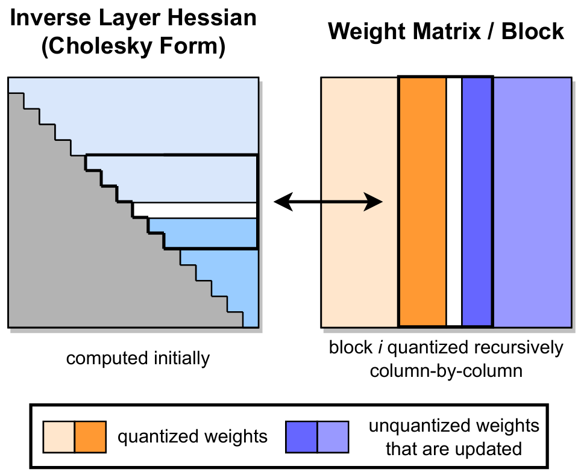

* **AWQ：**&#x5BF9;于LLM的性能，**权重并不是同等重要的**，通过**保留1%的显著权重可以大大减少量化误差**。在此基础上，**AWQ采用了激活感知方法，考虑与较大激活幅度对应的权重通道的重要性**，这在处理重要特征时起着关键作用。采用**逐通道缩放技术来确定最佳缩放因子**，从而在量化所有权重的同时最小化量化误差

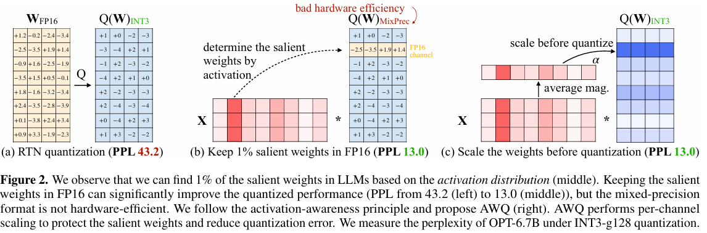

