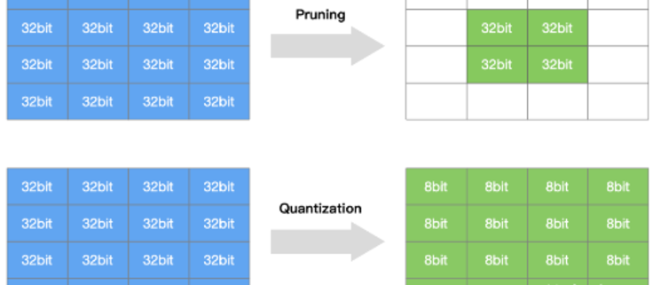
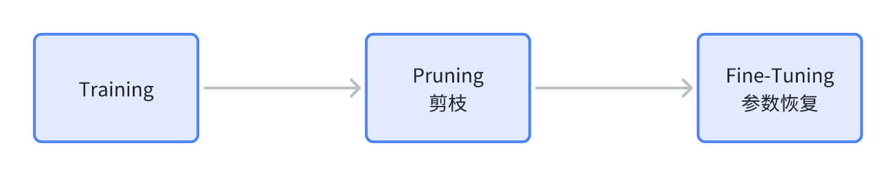
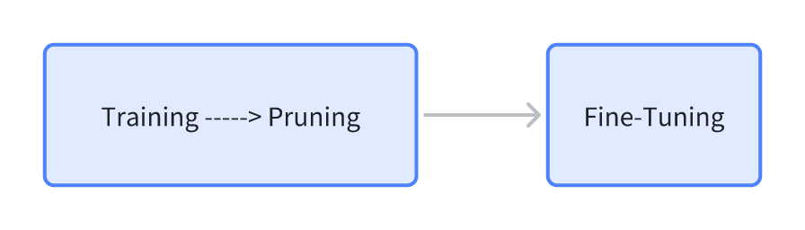
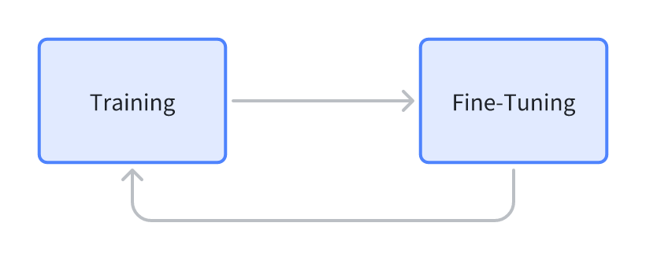
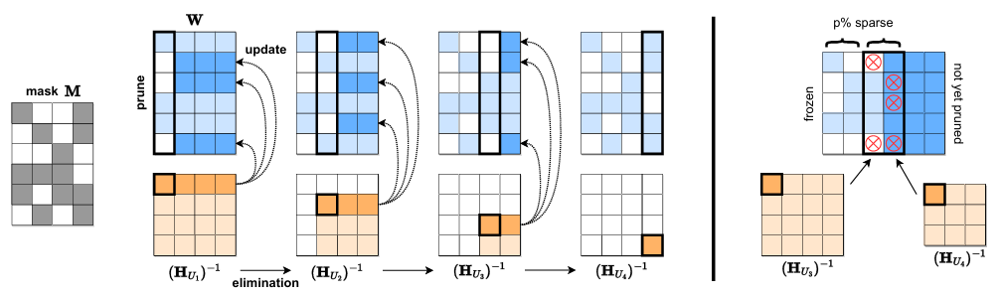
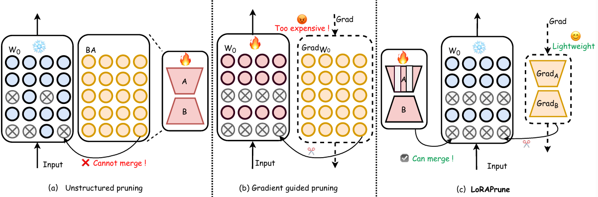
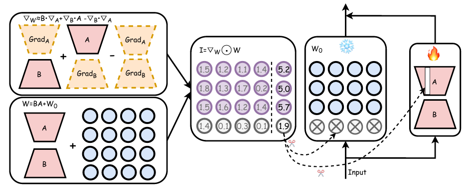
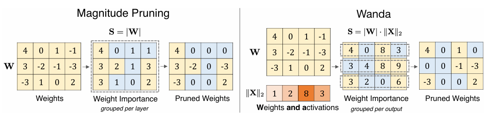
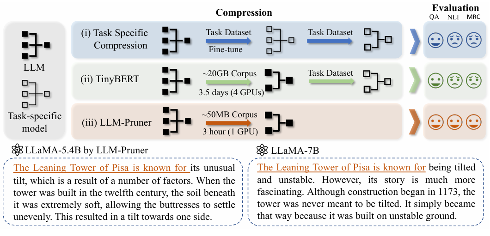
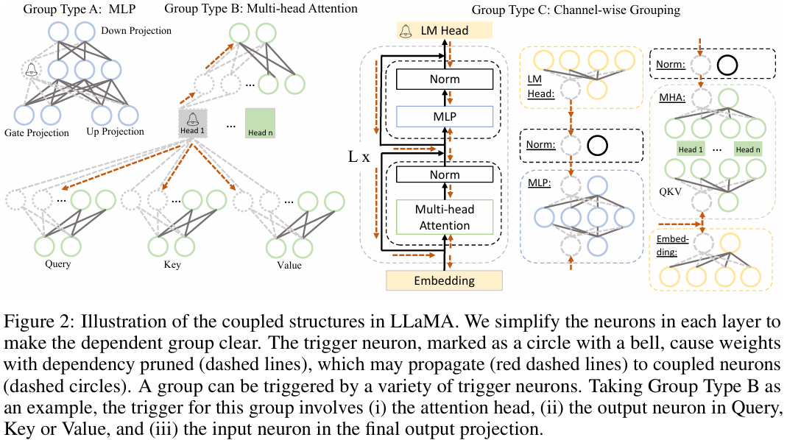

# **7.2.1 剪枝简介**

* 模型量化是指通过减少权重表示或激活所需的比特数来压缩模型

* **模型剪枝研究模型权重中的冗余，并尝试删除/修剪冗余和非关键的权重，减少模型大小和计算复杂度**

.png>)

# **7.2.2 剪枝流程**

模型剪枝大的流程大致有三种：

* 先训练模型，然后剪枝，最后微调

  

* 模型训练的过程中剪枝，然后微调

  

* 进行剪枝，然后从头训练剪枝的模型

  

# **7.2.3 剪枝分类**

## **非结构化剪枝**

**随机对独立权重或者神经元链接进行剪枝，指移除个别参数，而不考虑整体网络结构**。这种方法通过将低于阈值的参数置零的方式对个别权重或神经元进行处理。它会导致特定的参数被移除，模型出现不规则的稀疏结构。并且这种不规则性需要专门的压缩技术来存储和计算被剪枝的模型。此外，非结构化剪枝通常需要对LLM进行大量的再训练以恢复准确性，这对于LLM来说尤其昂贵

* **优点：**&#x526A;枝算法简单，模型压缩比高

* **缺点：**&#x7CBE;度不可控，剪枝后权重矩阵稀疏，没有专用硬件难以实现压缩和加速的效果

**非结构化剪枝方法：**

* **SparseGPT：**&#x5F15;入了**一次性剪枝策略，无需重新训练**。该方法**将剪枝视为一个广泛的稀疏回归问题，并使用近似稀疏回归求解器来解决，实现了显著的非结构化稀疏性**

  

* **LoRAPrune：**&#x5C06;参数高效微调（PEFT）方法与剪枝相结合，以提高下游任务的性能。引入了一种独特的参数重要性标准，使用了来自LoRA的值和梯度

  

  

* **Wanda：**&#x63D0;出一种新的剪枝度量，**根据每个权重的大小以及相应输入激活的范数的乘积进行评估，这个乘积是通过使用一个小型校准数据集来近似计算的。这个度量用于线性层输出内的局部比较，使得可以从LLM中移除优先级较低的权重**

  

## **结构化剪枝**

根据**预定义规则移除连接或分层结构，同时保持整体网络结构**。这种方法一次性地针对整组权重，优势在于降低模型复杂性和内存使用，同时保持整体的LLM结构完整&#x20;

**结构化剪枝方法：**

* **LLM-Pruner：**&#x91C7;用了一种多功能的方法来压缩LLMs，同时保护它们的多任务解决和语言生成能力。它引入了一个依赖检测算法，以定位模型内部的相互依赖结构。它还实施了一种高效的重要性估计方法，考虑了一阶信息和近似Hessian信息

