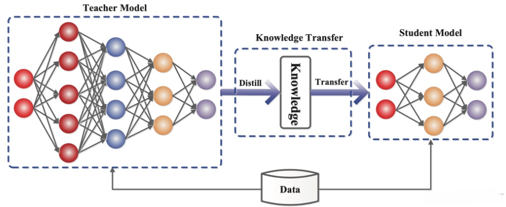
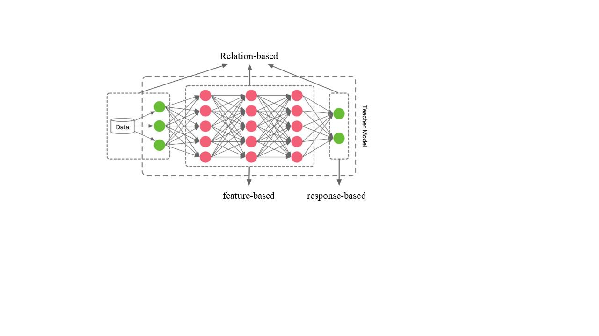
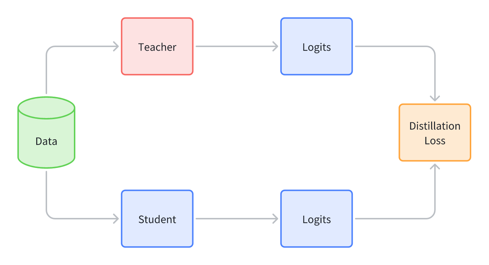
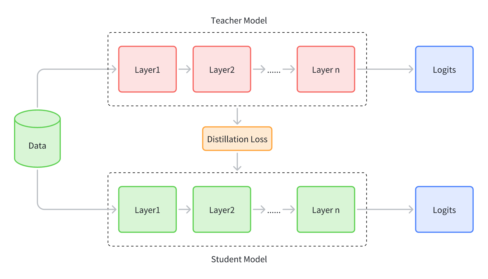
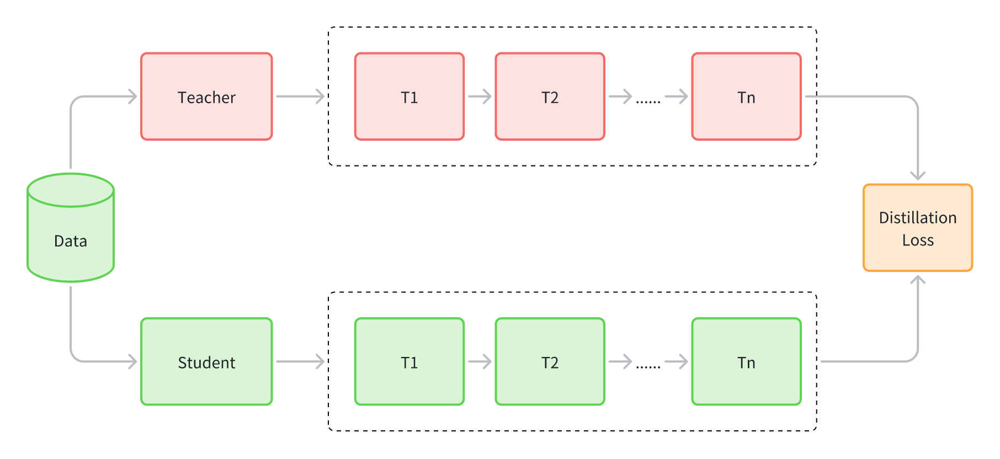
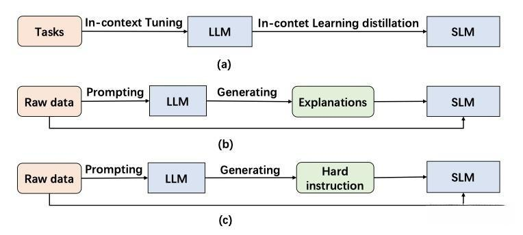

# **7.3.1 知识蒸馏简介**

**知识蒸馏（KD）**&#x662F;一种旨在将知识从大型复杂模型（即教师模型）转移到较小简单模型（即学生模型）的技术。可以分为：**Blackbox知识蒸馏**，通常**只能访问教师模型的输出，这些教师模型一般来自闭源大语言模型**；以及**Whitebox知识蒸馏**，在这种情况下**可以获取教师模型的参数或输出分布，教师模型通常来自开源大语言模型**

知识蒸馏算法由三部分组成，分别是**知识**（Knowledge）、**蒸馏算法**（Distillation algorithm）、**师生架构**（Teacher-student architecture），一般的师生架构如下图所示：

通常，教师网络会比学生网络大，通过知识蒸馏的方法将教师网络的知识转移到学生网络，因此，蒸馏学习可以用于压缩模型，将大模型变成小模型。另外，知识蒸馏的过程需要数据集，这个数据集可以是用于教师模型预训练的数据集，也可以是额外的数据集

# **7.3.2 白盒知识蒸馏**

**知识的类型：**&#x4E3B;要有 Response-based、Feature-based、Relation-based 三种

* **Response-based：**&#x5F53;知识蒸馏对这部分知识进行转移时，学生模型直接学习**教师模型输出层的特征**。通俗的说法就是老师充分学习知识后，直接将结论告诉学生

  

* **Feature-based：**&#x4E0A;面一种方法学习目标非常直接，学生模型直接学习教师模型的最后预测结果。考虑到深度神经网络善于学习不同层级的特征，**教师模型的中间层的特征激活也可以作为学生模型的学习目标，对 Response-based knowledge 形成补充**。虽然基于特征的知识转移为学生模型的学习提供了更多信息，但由于学生模型和教师模型的结构不一定相同，如何从教师模型中选择哪一层特征激活（提示层），从学生模型中选择哪一层（引导层）模仿教师模型的特征激活，是一个需要探究的问题。另外，当提示层和引导层大小存在差异时，如何正确匹配教师与学生的特征表示也需要进一步探究，目前还没有成熟的方案

  

* **Relation-based：**&#x4E0A;述两种方法都使用了教师模型中特定网络层中特征的输出，而基于关系的知识进一步探索了各网络层输出之间的关系或样本之间的关系。例如将教师模型中两层 feature maps 之间的 Gram 矩阵（网络层输出之间的关系）作为知识，或者将样本在教师模型上的特征表示的概率分布（样本之间的关系）作为知识

  

**蒸馏的方法：**&#x4E00;般分为三种offline distillation，online distillation和self-distillation

* **Offline distillation：**&#x5927;部分知识蒸馏算法采用的方法，主要包含两个过程：1）蒸馏前**教师模型预训练&#x20;**&#x32;）**蒸馏算法迁移知识**。主要侧重于知识迁移部分，教师模型通常参数量大，训练时间比较长，一些大模型会通过这种方式得到小模型，比如 BERT 通过蒸馏学习得到 tinyBERT

* **Online distillation：**&#x8981;求**教师模型和学生模型同时更新**，主要针对参数量大、精度性能好的教师模型不可获得情况。而现有的方法往往难以获得在线环境下参数量大、精度性能好的教师模型

* **Self distillation：** online distillation 的一种特例，教师模型和学生模型采用相同的网络模型

# **7.3.3 黑盒知识蒸馏**

白盒知识蒸馏也叫标准KD，旨在让学生学习LLM所用的常见知识，如输出分布和特征信息，相比之下，黑盒知识蒸馏通常促使教师大语言模型生成一个蒸馏数据集，用于微调学生语言模型，从而将能力从教师大语言模型转移到学生语言模型。特别的，对于LLM来说，**知识转移还涵盖了蒸馏他们独特的涌现能力，所以又叫 Emergent Abilities-based KD，主要是ICL、CoT和Instruction Following三种蒸馏**

* **ICL：**&#x91C7;用结构化的自然语言prompt，包含任务描述和一些示例。通过这些任务示例，LLM可以在不需要显式梯度更新的情况下掌握和执行新任务。**ICL蒸馏将LLM的上下文少样本学习和语言建模能力转移到学生模型中，将上下文学习目标与传统的语言建模目标相结合**，并在少样本学习范式下进行ICL蒸馏

* **CoT：**&#x43;oT与ICL相比，在**提示中加入了中间推理步骤，这些步骤可以影响最终的输出，而不是使用简单的输入-输出对**。一些基于CoT的蒸馏工作：MT-COT利用LLMs产生的解释来增强较小的推理器的训练，利用多任务学习框架，使较小的模型具备强大的推理能力以及生成解释的能力；Fine-tune-CoT通过随机采样从LLMs生成多个推理解决方案，这种训练数据的增加有助于学生模型的学习过程；SOCRATIC CoT训练了两个蒸馏模型：问题分解器和子问题解决器，分解器将原始问题分解为一系列子问题，而子问题解决器则处理解决这些子问题；DISCO 引入了一种基于LLMs的完全自动反事实知识蒸馏方法，它通过工程化的提示生成短语扰动，然后通过任务特定的教师模型将这些扰动数据过滤，以提取高质量的反事实数据；SCOTT采用对比解码，将每个原理与答案联系起来，鼓励从教师那里提取相关的原理

* **IF：仅依赖于任务描述而不依赖于少量示例**。通过**使用一系列以指令形式表达的任务进行微调，语言模型展现出能够准确执行以前未见过的指令描述的任务的能力**。利用LLMs的适应性来提升学生模型的性能，促使LLM识别和生成“困难”指令，然后利用这些指令来增强学生模型的能力

